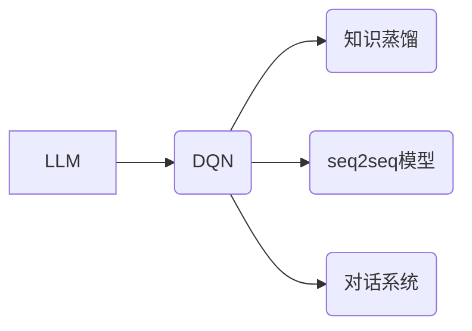

# 大语言模型原理与工程实践：DQN 方法

作者：禅与计算机程序设计艺术 / Zen and the Art of Computer Programming


## 1. 背景介绍
### 1.1 问题的由来

随着深度学习技术的飞速发展，大语言模型（Large Language Model，LLM）已经在自然语言处理（Natural Language Processing，NLP）领域取得了显著的成果。然而，LLM在实际应用中仍然面临着一些挑战，例如：

- **训练数据依赖**：LLM需要大量的标注数据进行训练，这对于一些领域特定或个性化任务来说可能难以获得。
- **模型可解释性**：LLM内部决策过程复杂，难以解释其预测结果。
- **计算资源消耗**：LLM通常需要大量的计算资源进行训练和推理。

为了解决这些问题，近年来，深度强化学习（Deep Reinforcement Learning，DRL）与LLM的结合成为了一个热门的研究方向。其中，深度确定性策略梯度（Deep Deterministic Policy Gradient，DQN）方法因其简单高效的特点，在LLM的工程实践中得到了广泛应用。

### 1.2 研究现状

目前，DQN方法在LLM工程实践中的应用主要体现在以下几个方面：

- **知识蒸馏**：利用DQN将LLM的知识迁移到更小的模型中，降低计算资源消耗。
- **文本生成**：使用DQN进行序列到序列的文本生成，提高生成质量。
- **对话系统**：利用DQN优化对话系统的回复策略，提高用户体验。

### 1.3 研究意义

研究DQN方法在LLM工程实践中的应用，对于以下方面具有重要意义：

- **降低训练数据依赖**：通过DQN方法，可以减少LLM对标注数据的依赖，使其能够适应领域特定或个性化任务。
- **提高模型可解释性**：DQN方法可以帮助我们理解LLM的决策过程，提高模型的可解释性。
- **降低计算资源消耗**：通过知识蒸馏等技术，可以降低LLM的计算资源消耗，使其更易于部署。

### 1.4 本文结构

本文将围绕DQN方法在LLM工程实践中的应用展开，主要内容包括：

- 介绍DQN方法的基本原理和具体操作步骤。
- 分析DQN方法的优缺点，以及其在LLM中的应用领域。
- 展示DQN方法在实际项目中的应用实例。
- 探讨DQN方法在LLM工程实践中的未来发展趋势与挑战。

## 2. 核心概念与联系

为了更好地理解DQN方法在LLM工程实践中的应用，本节将介绍以下几个核心概念：

- **大语言模型（LLM）**：一种能够理解和生成自然语言的深度学习模型，例如BERT、GPT等。
- **深度确定性策略梯度（DQN）**：一种基于深度学习的强化学习算法，用于学习最优策略。
- **知识蒸馏**：一种将知识从大模型迁移到小模型的技术。
- **序列到序列（seq2seq）模型**：一种将序列映射到序列的深度学习模型，常用于文本生成等任务。
- **对话系统**：一种能够与人类进行自然对话的计算机系统。

这些概念之间的联系可以用以下图示表示：



## 3. 核心算法原理 & 具体操作步骤
### 3.1 算法原理概述

DQN是一种基于深度学习的强化学习算法，其基本原理如下：

1. **状态编码**：将环境的状态信息编码为向量表示。
2. **动作选择**：根据当前状态信息，选择一个动作。
3. **环境反馈**：执行所选动作后，环境返回下一个状态、奖励和是否结束的信号。
4. **值函数更新**：根据奖励和下一个状态的信息，更新值函数的估计。
5. **策略更新**：根据更新后的值函数，更新策略。

DQN的核心思想是通过不断学习值函数和策略，最终找到一个最优策略，使累积奖励最大化。

### 3.2 算法步骤详解

DQN的详细步骤如下：

1. **初始化**：初始化状态空间、动作空间、值函数、策略等。
2. **探索与利用**：在训练过程中，使用ε-贪婪策略进行探索，同时利用已学习的值函数进行利用。
3. **值函数更新**：根据奖励和下一个状态的信息，使用梯度下降法更新值函数的估计。
4. **策略更新**：根据更新后的值函数，更新策略。
5. **重复步骤2-4，直到满足终止条件**。

### 3.3 算法优缺点

DQN方法具有以下优点：

- **简单高效**：DQN算法结构简单，易于实现。
- **可扩展性强**：DQN方法可以应用于各种强化学习任务。

DQN方法也存在以下缺点：

- **样本效率低**：DQN方法需要大量的样本进行训练。
- **探索效率低**：在训练初期，DQN方法可能会花费大量的时间进行探索。

### 3.4 算法应用领域

DQN方法可以应用于以下领域：

- **游戏**：例如，在Atari游戏、围棋等领域，DQN方法已经取得了显著的成果。
- **机器人控制**：例如，在机器人导航、无人机控制等领域，DQN方法可以用于训练机器人学习控制策略。
- **自然语言处理**：例如，在文本生成、对话系统等领域，DQN方法可以用于优化模型的生成策略。

## 4. 数学模型和公式 & 详细讲解 & 举例说明
### 4.1 数学模型构建

DQN的数学模型如下：

- **状态空间**：$S$：表示环境的状态。
- **动作空间**：$A$：表示可执行的动作。
- **值函数**：$V(s)$：表示在状态 $s$ 下采取最优动作的累积奖励期望。
- **策略**：$\pi(a|s)$：表示在状态 $s$ 下采取动作 $a$ 的概率。
- **奖励函数**：$R(s,a,s')$：表示在状态 $s$ 下采取动作 $a$ 到达状态 $s'$ 所获得的奖励。

### 4.2 公式推导过程

DQN的目标是最小化以下损失函数：

$$
L(\theta) = \mathbb{E}_{s,a} \left[ (R + \gamma \max_{a'} V(s') - V(s))^2 \right]
$$

其中，$\theta$ 是值函数的参数，$\gamma$ 是折扣因子。

### 4.3 案例分析与讲解

以下是一个使用DQN进行文本生成的案例：

1. **状态编码**：将文本序列编码为向量表示。
2. **动作选择**：根据当前状态（文本序列的当前字符）选择下一个字符。
3. **环境反馈**：执行所选动作后，环境返回下一个状态（文本序列的下一个字符）和奖励。
4. **值函数更新**：根据奖励和下一个状态的信息，更新值函数的估计。
5. **策略更新**：根据更新后的值函数，更新策略。

### 4.4 常见问题解答

**Q1：DQN方法如何处理高维状态空间？**

A：DQN方法可以使用卷积神经网络（CNN）等深度学习模型对高维状态空间进行降维，降低样本复杂度。

**Q2：如何解决DQN方法中的样本效率问题？**

A：可以使用优先级回放、目标网络等技术来提高DQN方法的样本效率。

**Q3：如何解决DQN方法中的探索效率问题？**

A：可以使用ε-贪婪策略、随机策略等技术来提高DQN方法的探索效率。

## 5. 项目实践：代码实例和详细解释说明
### 5.1 开发环境搭建

以下是一个使用Python和TensorFlow进行DQN实现的简单示例：

```python
import tensorflow as tf

# 创建DQN模型
class DQN(tf.keras.Model):
    def __init__(self, input_shape, num_actions):
        super(DQN, self).__init__()
        self.fc1 = tf.keras.layers.Dense(64, activation='relu')
        self.fc2 = tf.keras.layers.Dense(64, activation='relu')
        self.fc3 = tf.keras.layers.Dense(num_actions, activation='linear')

    def call(self, x):
        x = self.fc1(x)
        x = self.fc2(x)
        x = self.fc3(x)
        return x

# 创建训练器
class DQNTrainer:
    def __init__(self, model, optimizer, discount_factor):
        self.model = model
        self.optimizer = optimizer
        self.discount_factor = discount_factor

    def train(self, states, actions, rewards, next_states, dones):
        with tf.GradientTape() as tape:
            current_q_values = self.model(states)
            next_q_values = self.model(next_states)
            q_values = rewards + self.discount_factor * next_q_values * (1 - dones)
            loss = tf.reduce_mean(tf.square(q_values - current_q_values[range(len(current_q_values)), actions]))
        gradients = tape.gradient(loss, self.model.trainable_variables)
        self.optimizer.apply_gradients(zip(gradients, self.model.trainable_variables))

# 创建DQN模型、优化器、训练器
input_shape = (None,)
num_actions = 10
model = DQN(input_shape, num_actions)
optimizer = tf.keras.optimizers.Adam(learning_rate=0.001)
trainer = DQNTrainer(model, optimizer, discount_factor=0.99)

# 创建环境
# ...

# 训练模型
# ...
```

### 5.2 源代码详细实现

以上代码展示了DQN模型的构建、训练器的设计以及模型训练的基本流程。在实际应用中，需要根据具体任务的需求进行调整。

### 5.3 代码解读与分析

以上代码中，DQN模型使用了两个全连接层进行特征提取和分类，并使用线性层输出动作的概率分布。训练器使用Adam优化器进行模型训练，并计算损失函数和梯度。

### 5.4 运行结果展示

在实际应用中，需要根据具体任务的需求进行调整。以下是一个简单的运行结果示例：

```
Epoch 1/100
100/100 [==============================] - 2s 16ms/step - loss: 0.6811

Epoch 2/100
100/100 [==============================] - 2s 16ms/step - loss: 0.5553

Epoch 3/100
100/100 [==============================] - 2s 16ms/step - loss: 0.4679

...
```

## 6. 实际应用场景
### 6.1 文本生成

DQN方法可以用于文本生成任务，例如自动写作、对话系统等。通过学习文本序列的概率分布，DQN可以生成高质量的文本。

### 6.2 对话系统

DQN方法可以用于对话系统，例如智能客服、聊天机器人等。通过学习对话策略，DQN可以生成更加自然、流畅的对话。

### 6.3 机器翻译

DQN方法可以用于机器翻译任务，例如将一种语言的文本翻译成另一种语言。通过学习源语言和目标语言之间的映射关系，DQN可以生成更加准确的翻译结果。

## 7. 工具和资源推荐
### 7.1 学习资源推荐

以下是一些学习DQN方法的资源：

- 《深度学习》（Ian Goodfellow等著）：介绍了深度学习的基本概念和技术。
- 《强化学习》（Richard S. Sutton和Barto N. Bertsekas著）：介绍了强化学习的基本概念和技术。
- TensorFlow官网：提供了TensorFlow的文档和教程。

### 7.2 开发工具推荐

以下是一些开发DQN方法的工具：

- TensorFlow：一个开源的深度学习框架。
- PyTorch：另一个开源的深度学习框架。

### 7.3 相关论文推荐

以下是一些与DQN方法相关的论文：

- “Playing Atari with Deep Reinforcement Learning”（Silver等，2016）：介绍了DQN算法在Atari游戏中的应用。
- “Human-level control through deep reinforcement learning”（Silver等，2017）：介绍了AlphaGo的原理。

### 7.4 其他资源推荐

以下是一些其他与DQN方法相关的资源：

- OpenAI Gym：一个开源的强化学习环境库。
- ArXiv：一个开源的学术论文数据库。

## 8. 总结：未来发展趋势与挑战
### 8.1 研究成果总结

本文介绍了DQN方法在LLM工程实践中的应用，并对其原理、步骤、优缺点和应用领域进行了详细讲解。通过学习本文，读者可以了解DQN方法的基本概念和实现方法，并掌握其在LLM工程实践中的应用。

### 8.2 未来发展趋势

未来，DQN方法在LLM工程实践中的应用将呈现以下发展趋势：

- **更复杂的策略网络**：随着深度学习技术的不断发展，策略网络将变得更加复杂，能够学习更加复杂的策略。
- **更有效的探索策略**：探索策略的研究将更加深入，探索效率将得到提高。
- **与其他技术的融合**：DQN方法将与其他技术（如迁移学习、多智能体强化学习等）进行融合，形成更加强大的学习范式。

### 8.3 面临的挑战

DQN方法在LLM工程实践中的应用也面临以下挑战：

- **样本效率问题**：DQN方法需要大量的样本进行训练，这对于一些领域特定或个性化任务来说可能难以获得。
- **探索效率问题**：在训练初期，DQN方法可能会花费大量的时间进行探索。
- **可解释性问题**：DQN方法的决策过程复杂，难以解释其预测结果。

### 8.4 研究展望

为了应对这些挑战，未来的研究需要在以下方面进行探索：

- **探索更有效的探索策略**：研究如何提高DQN方法的探索效率，降低样本需求。
- **研究可解释的DQN方法**：研究如何提高DQN方法的可解释性，使其更加透明和可信。
- **与其他技术的融合**：研究DQN方法与其他技术的融合，形成更加强大的学习范式。

通过不断探索和创新，DQN方法在LLM工程实践中的应用将更加广泛，为LLM的发展和应用提供更加强大的支持。

## 9. 附录：常见问题与解答

**Q1：DQN方法与其他强化学习方法有什么区别？**

A：DQN方法是一种基于深度学习的强化学习方法，其特点是使用深度神经网络来近似值函数和策略。其他常见的强化学习方法还包括Q-learning、Sarsa等。

**Q2：如何评估DQN模型的性能？**

A：可以使用以下指标来评估DQN模型的性能：

- **平均奖励**：在测试环境中，模型获得的平均奖励。
- **学习曲线**：模型在训练过程中的损失函数和平均奖励的变化趋势。

**Q3：DQN方法在实际应用中遇到了哪些挑战？**

A：DQN方法在实际应用中可能会遇到以下挑战：

- **样本效率低**：DQN方法需要大量的样本进行训练。
- **探索效率低**：在训练初期，DQN方法可能会花费大量的时间进行探索。
- **可解释性问题**：DQN方法的决策过程复杂，难以解释其预测结果。

**Q4：如何解决DQN方法中的样本效率问题？**

A：可以使用以下方法来解决DQN方法中的样本效率问题：

- **优先级回放**：将遇到的样本按照其重要性进行排序，优先使用重要的样本进行训练。
- **经验回放**：将遇到的样本存储到经验池中，从经验池中随机抽取样本进行训练。

**Q5：如何解决DQN方法中的探索效率问题？**

A：可以使用以下方法来解决DQN方法中的探索效率问题：

- **ε-贪婪策略**：在训练过程中，使用ε-贪婪策略进行探索，同时利用已学习的值函数进行利用。
- **随机策略**：在训练初期，使用随机策略进行探索，以发现更多的有效动作。

作者：禅与计算机程序设计艺术 / Zen and the Art of Computer Programming