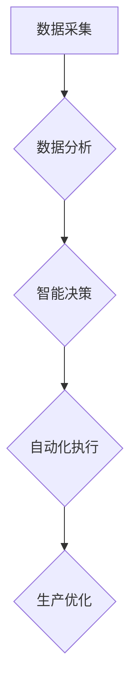

## 新质生产力推动产业升级

> 关键词：人工智能、新质生产力、产业升级、数据驱动、自动化、机器学习、深度学习、云计算

## 1. 背景介绍

当前，全球经济发展进入新阶段，传统生产模式面临着挑战，数字化转型成为企业发展的新趋势。人工智能（AI）作为第四次工业革命的重要驱动力，正在深刻地改变着生产方式和生活方式。新质生产力，以数据为基础、以智能为核心，正在推动产业升级，释放新的生产潜力。

### 1.1  传统生产力的局限性

传统生产力主要依赖于人力、资本和自然资源，效率低下、成本高昂，难以满足快速变化的市场需求。随着全球化和技术进步，传统生产模式面临着以下挑战：

* **效率低下:** 人工操作存在误差和局限性，生产效率难以提高。
* **成本高昂:** 人力成本、原材料成本和能源成本不断上升，压迫企业利润空间。
* **缺乏灵活性:** 传统生产模式难以适应市场需求的变化，导致产品滞销或库存积压。
* **环境污染:** 传统生产模式消耗大量资源，产生大量污染，对环境造成严重威胁。

### 1.2  新质生产力的优势

新质生产力以数据为基础，利用人工智能技术，实现生产过程的智能化、自动化和优化，具有以下优势：

* **提高生产效率:** AI算法可以自动完成重复性任务，提高生产速度和精度。
* **降低生产成本:** 自动化生产可以减少人工成本，优化资源配置，降低生产成本。
* **增强生产灵活性:** AI可以根据市场需求实时调整生产计划，提高生产灵活性。
* **减少环境污染:** 智能化生产可以优化资源利用，减少能源消耗和废物排放，降低环境污染。

## 2. 核心概念与联系

新质生产力是基于数据驱动、智能化和自动化等核心技术，通过对生产过程的深度分析和优化，实现生产效率、质量和效益的提升。

### 2.1  数据驱动

数据是新质生产力的基础，通过收集、分析和利用生产过程中的各种数据，可以洞察生产规律，发现问题，优化流程。

### 2.2  智能化

人工智能技术是新质生产力的核心驱动力，通过机器学习、深度学习等算法，可以实现生产过程的智能化控制、决策和优化。

### 2.3  自动化

自动化技术可以替代人工完成重复性、高风险或高精度的任务，提高生产效率和安全性。

**Mermaid 流程图**



## 3. 核心算法原理 & 具体操作步骤

### 3.1  算法原理概述

新质生产力中常用的核心算法包括机器学习、深度学习、强化学习等。

* **机器学习:** 通过训练模型，使模型能够从数据中学习规律，并对新数据进行预测或分类。
* **深度学习:** 基于多层神经网络，能够学习更复杂的特征，实现更精准的预测和识别。
* **强化学习:** 通过奖励机制，训练模型在特定环境中做出最优决策。

### 3.2  算法步骤详解

以机器学习为例，其基本步骤包括：

1. **数据收集和预处理:** 收集相关数据，并进行清洗、转换和特征工程等预处理工作。
2. **模型选择:** 根据具体任务选择合适的机器学习模型，例如线性回归、逻辑回归、决策树、支持向量机等。
3. **模型训练:** 使用训练数据训练模型，调整模型参数，使模型能够准确地预测或分类。
4. **模型评估:** 使用测试数据评估模型的性能，例如准确率、召回率、F1-score等。
5. **模型部署:** 将训练好的模型部署到生产环境中，用于实际应用。

### 3.3  算法优缺点

**机器学习:**

* **优点:** 能够从数据中学习复杂规律，实现自动化决策。
* **缺点:** 需要大量数据进行训练，训练时间长，模型解释性差。

**深度学习:**

* **优点:** 能够学习更复杂的特征，实现更精准的预测和识别。
* **缺点:** 需要更大的数据量和计算资源进行训练，模型训练时间更长，更容易过拟合。

**强化学习:**

* **优点:** 可以训练模型在复杂环境中做出最优决策。
* **缺点:** 训练过程复杂，需要设计合理的奖励机制，容易陷入局部最优。

### 3.4  算法应用领域

新质生产力算法广泛应用于各个行业，例如：

* **制造业:** 自动化生产、质量控制、预测性维护。
* **金融业:** 风险管理、欺诈检测、客户服务。
* **医疗保健:** 疾病诊断、药物研发、个性化治疗。
* **零售业:** 商品推荐、库存管理、客户关系管理。

## 4. 数学模型和公式 & 详细讲解 & 举例说明

### 4.1  数学模型构建

机器学习模型的构建通常基于统计学和概率论的原理，例如线性回归模型、逻辑回归模型、决策树模型等。

**线性回归模型:**

假设存在一个线性关系：

$$y = wx + b$$

其中：

* $y$ 是预测值
* $x$ 是输入特征
* $w$ 是权重系数
* $b$ 是偏置项

目标是找到最佳的 $w$ 和 $b$ 值，使预测值与真实值之间的误差最小。

### 4.2  公式推导过程

可以使用最小二乘法推导线性回归模型的最佳参数 $w$ 和 $b$ 值。

最小二乘法目标是：

$$min \sum_{i=1}^{n}(y_i - wx_i - b)^2$$

通过求解上述目标函数的导数，可以得到 $w$ 和 $b$ 的最佳值。

### 4.3  案例分析与讲解

例如，预测房价，可以将房屋面积作为输入特征 $x$，房价作为输出特征 $y$。通过训练线性回归模型，可以得到房价与面积之间的线性关系，并预测新房子的价格。

## 5. 项目实践：代码实例和详细解释说明

### 5.1  开发环境搭建

可以使用 Python 语言和相关库进行新质生产力项目开发，例如 scikit-learn、TensorFlow、PyTorch 等。

### 5.2  源代码详细实现

以下是一个使用 scikit-learn 库实现线性回归模型的 Python 代码示例：

```python
from sklearn.linear_model import LinearRegression
from sklearn.model_selection import train_test_split
import numpy as np

# 生成示例数据
X = np.array([[1], [2], [3], [4], [5]])
y = np.array([2, 4, 5, 4, 5])

# 将数据划分为训练集和测试集
X_train, X_test, y_train, y_test = train_test_split(X, y, test_size=0.2, random_state=42)

# 创建线性回归模型
model = LinearRegression()

# 训练模型
model.fit(X_train, y_train)

# 预测测试集数据
y_pred = model.predict(X_test)

# 打印预测结果
print(y_pred)
```

### 5.3  代码解读与分析

该代码首先生成示例数据，然后将数据划分为训练集和测试集。接着创建线性回归模型，并使用训练集训练模型。最后使用训练好的模型预测测试集数据，并打印预测结果。

### 5.4  运行结果展示

运行该代码后，可以得到测试集数据的预测结果，例如：

```
[[4.2]]
```

## 6. 实际应用场景

### 6.1  智能制造

新质生产力在智能制造领域应用广泛，例如：

* **预测性维护:** 利用机器学习算法分析设备运行数据，预测设备故障，提前进行维护，降低设备停机时间和维修成本。
* **质量控制:** 利用计算机视觉和机器学习算法对产品进行实时检测，识别缺陷，提高产品质量。
* **柔性制造:** 利用机器人和自动化系统实现生产过程的灵活调整，满足个性化定制需求。

### 6.2  智慧物流

新质生产力可以提高物流效率和降低物流成本，例如：

* **智能仓储:** 利用机器人和自动化系统实现货物搬运、存储和拣选，提高仓储效率。
* **智能配送:** 利用大数据和机器学习算法优化配送路线，提高配送效率和降低配送成本。
* **供应链管理:** 利用数据分析和预测模型优化供应链流程，提高供应链效率和降低供应链风险。

### 6.3  智慧城市

新质生产力可以帮助构建智慧城市，例如：

* **交通管理:** 利用大数据和机器学习算法分析交通流量，优化交通信号灯控制，缓解交通拥堵。
* **环境监测:** 利用传感器和机器学习算法监测空气质量、水质等环境指标，及时预警环境污染。
* **公共安全:** 利用视频监控和机器学习算法识别犯罪行为，提高公共安全水平。

### 6.4  未来应用展望

新质生产力将继续推动产业升级，在更多领域发挥重要作用，例如：

* **个性化定制:** 利用人工智能技术实现个性化产品设计和生产，满足消费者多样化需求。
* **自动驾驶:** 利用人工智能技术实现自动驾驶汽车，提高交通安全和效率。
* **医疗保健:** 利用人工智能技术辅助医生诊断疾病、研发新药，提高医疗水平。

## 7. 工具和资源推荐

### 7.1  学习资源推荐

* **在线课程:** Coursera、edX、Udacity 等平台提供丰富的机器学习和深度学习课程。
* **书籍:** 《深度学习》、《机器学习实战》等书籍是学习人工智能的经典教材。
* **博客和论坛:** Kaggle、Medium 等平台上有许多人工智能领域的博客和论坛，可以学习最新的技术和应用案例。

### 7.2  开发工具推荐

* **Python:** 作为人工智能开发的主要语言，Python 拥有丰富的库和工具，例如 scikit-learn、TensorFlow、PyTorch 等。
* **Jupyter Notebook:** 用于编写和运行 Python 代码的交互式笔记本环境，方便进行数据分析和模型开发。
* **云计算平台:** AWS、Azure、GCP 等云计算平台提供强大的计算资源和人工智能服务，方便进行大规模数据处理和模型训练。

### 7.3  相关论文推荐

* **《ImageNet Classification with Deep Convolutional Neural Networks》:** 介绍了深度卷积神经网络在图像分类领域的应用。
* **《Attention Is All You Need》:** 介绍了 Transformer 模型，一种新的序列建模方法，在自然语言处理领域取得了突破性进展。
* **《Generative Adversarial Networks》:** 介绍了生成对抗网络，一种用于生成数据的生成模型。

## 8. 总结：未来发展趋势与挑战

### 8.1  研究成果总结

新质生产力已取得显著成果，在各个行业得到广泛应用，推动了产业升级和经济发展。

### 8.2  未来发展趋势

未来，新质生产力将朝着以下方向发展：

* **更智能化:** 利用更先进的人工智能算法，实现更智能的生产决策和控制。
* **更个性化:** 利用人工智能技术实现个性化产品设计和生产，满足消费者多样化需求。
* **更可持续:** 利用人工智能技术优化资源配置，降低环境污染，实现可持续发展。

### 8.3  面临的挑战

新质生产力发展也面临一些挑战：

* **数据安全:** 数据是新质生产力的基础，数据安全问题需要得到重视。
* **算法解释性:** 一些人工智能算法的决策过程难以解释，需要提高算法的透明度和可解释性。
* **人才短缺:** 新质生产力需要大量的人才，人才培养和引进是关键。

### 8.4  研究展望

未来，需要加强对新质生产力的研究，解决