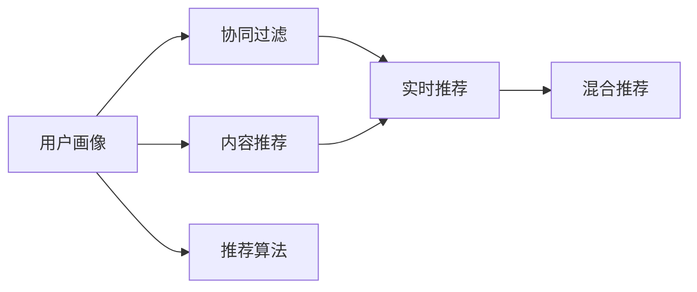

                 

# 用户画像与实时推荐的结合应用

## 1. 背景介绍

在互联网时代，用户体验（User Experience，UX）成为企业竞争的焦点。为了更好地提升用户体验，个性化推荐系统（Personalized Recommendation System，PRS）应运而生。个性化推荐系统能够根据用户的历史行为和偏好，为用户推荐符合其兴趣的内容，从而提高用户满意度和转化率。用户画像（User Profile）则是在用户行为数据基础上建立用户模型，进一步提升推荐系统的精准度和个性化水平。

本文将深入探讨用户画像与实时推荐结合的应用，重点介绍如何构建高效、精准的用户画像，以及基于用户画像的实时推荐系统设计与优化。通过理论和实践相结合，帮助读者理解个性化推荐技术的核心原理与实际应用，探索其在电商、新闻、视频等不同领域的落地实践。

## 2. 核心概念与联系

### 2.1 核心概念概述

为了更好地理解用户画像与实时推荐结合应用的理论基础，我们首先介绍几个关键概念：

- **用户画像**（User Profile）：基于用户历史行为、偏好、属性等信息构建的用户模型。用户画像包含用户的兴趣、偏好、特征等，用于指导个性化推荐。

- **实时推荐**（Real-time Recommendation）：在用户访问或操作时，动态计算并推送个性化推荐结果的过程。实时推荐系统利用最新的用户行为数据和实时反馈，快速调整推荐策略，提高推荐效果。

- **协同过滤**（Collaborative Filtering，CF）：一种常用的推荐算法，基于用户相似性或物品相似性进行推荐。协同过滤算法通过挖掘用户与物品之间的互动关系，发现潜在相似用户或物品，进行推荐。

- **内容推荐**（Content-Based Recommendation）：一种基于用户偏好和物品内容的推荐方法。内容推荐通过分析物品的属性特征和用户的历史行为，找到匹配的物品推荐给用户。

- **混合推荐**（Hybrid Recommendation）：结合协同过滤和内容推荐的优点，构建的推荐系统。混合推荐系统能够利用协同过滤的社交关系和内容推荐的丰富特征，提升推荐效果。

这些概念之间存在紧密的联系，共同构成了个性化推荐和用户画像的核心框架。实时推荐系统通过用户画像和推荐算法，动态地为用户推荐个性化内容，提升用户体验。协同过滤、内容推荐和混合推荐是常用的推荐算法，用户画像则提供了算法所需要的用户特征和行为数据。

### 2.2 概念间的关系

以上核心概念之间的关系可以通过以下Mermaid流程图来展示：



这个流程图展示了用户画像与推荐算法、推荐系统之间的关系：

1. 用户画像包含用户的各种特征和行为数据，是推荐算法的基础。
2. 协同过滤、内容推荐和混合推荐是常用的推荐算法，用于生成个性化推荐。
3. 实时推荐系统通过动态更新用户画像和推荐算法，实现实时个性化推荐。
4. 混合推荐系统结合了协同过滤和内容推荐的优点，进一步提升了推荐效果。

## 3. 核心算法原理 & 具体操作步骤

### 3.1 算法原理概述

基于用户画像与实时推荐的推荐系统，通过实时获取用户行为数据，更新用户画像，并动态调整推荐算法，生成个性化推荐结果。其核心原理如下：

1. **用户画像构建**：收集用户历史行为数据，如浏览记录、购买记录、搜索记录等，构建用户画像。
2. **实时数据获取**：在用户操作时，实时获取用户行为数据，用于更新用户画像和生成推荐结果。
3. **推荐算法计算**：根据用户画像和推荐算法，动态计算并生成个性化推荐。
4. **推荐结果呈现**：将推荐结果呈现给用户，并根据用户反馈进行动态调整。

### 3.2 算法步骤详解

基于用户画像与实时推荐的推荐系统，主要包括以下几个关键步骤：

**Step 1: 用户画像构建**

- **数据收集**：收集用户的历史行为数据，如浏览、点击、购买等记录。
- **特征提取**：对行为数据进行特征提取，形成用户特征向量。
- **模型训练**：使用机器学习算法（如协同过滤、内容推荐等），训练用户画像模型。

**Step 2: 实时数据获取**

- **行为监控**：在用户访问或操作时，实时监控用户行为，获取行为数据。
- **特征更新**：根据实时行为数据，更新用户特征向量。

**Step 3: 推荐算法计算**

- **相似性计算**：计算用户和物品的相似度，筛选出潜在相似用户和物品。
- **特征匹配**：根据用户特征和物品特征，计算匹配度。
- **推荐排序**：根据匹配度和相似度，对推荐结果进行排序。

**Step 4: 推荐结果呈现**

- **动态调整**：根据用户反馈，动态调整推荐算法和用户画像。
- **结果呈现**：将推荐结果以合适的方式呈现给用户，如动态新闻推荐、商品推荐等。

### 3.3 算法优缺点

基于用户画像与实时推荐的推荐系统具有以下优点：

1. **个性化程度高**：通过实时获取用户行为数据，动态更新用户画像，生成更加个性化的推荐结果。
2. **响应速度快**：实时推荐系统能够快速响应用户行为，提高推荐的时效性。
3. **泛化能力强**：通过多模态数据融合和多种推荐算法结合，提高推荐系统的泛化能力。
4. **模型透明性好**：用户画像和推荐算法透明性好，便于监控和调试。

同时，该方法也存在一些缺点：

1. **数据需求大**：需要大量的用户行为数据，数据采集和存储成本较高。
2. **模型复杂度高**：实时推荐系统需要结合多种算法和数据源，模型复杂度高。
3. **冷启动问题**：对于新用户，没有足够的历史行为数据，难以生成有效的用户画像。
4. **隐私问题**：用户行为数据的收集和处理需要考虑隐私保护，存在数据泄露风险。
5. **动态平衡**：在实时推荐过程中，如何平衡个性化推荐和多样性推荐，是一个重要挑战。

### 3.4 算法应用领域

基于用户画像与实时推荐的推荐系统，在多个领域得到了广泛应用，如电商、新闻、视频等。以下是一些典型的应用场景：

- **电商推荐系统**：利用用户购买、浏览等行为数据，生成商品推荐。如亚马逊、淘宝等电商平台的个性化推荐系统。
- **新闻推荐系统**：根据用户阅读历史和搜索记录，推荐相关新闻。如今日头条、知乎等新闻平台。
- **视频推荐系统**：根据用户观看历史和评分数据，推荐相关视频。如Netflix、YouTube等视频平台。
- **社交网络**：根据用户社交行为，推荐相关好友和内容。如微信、微博等社交网络平台。
- **音乐推荐系统**：根据用户听歌历史和评分数据，推荐相关音乐。如Spotify、网易云音乐等音乐平台。

这些应用场景展示了基于用户画像与实时推荐系统的广泛应用，不同领域的应用需要针对性地设计推荐算法和用户画像模型。

## 4. 数学模型和公式 & 详细讲解 & 举例说明

### 4.1 数学模型构建

用户画像与实时推荐系统的数学模型主要包含用户画像构建、实时数据获取和推荐算法计算三个部分。

**用户画像构建**：

用户画像 $P_u$ 可以表示为向量形式，包含用户行为数据和用户属性特征。例如：

$$
P_u = [I_1, I_2, \dots, I_n; A_1, A_2, \dots, A_m]
$$

其中，$I$ 为用户行为特征，$A$ 为用户属性特征，$n$ 和 $m$ 为特征数量。

**实时数据获取**：

在用户行为 $B_t$ 发生时，更新用户画像：

$$
P_{u,t} = \alpha P_{u,t-1} + (1-\alpha) B_t
$$

其中，$\alpha$ 为数据权重，$P_{u,t}$ 为更新后的用户画像。

**推荐算法计算**：

推荐算法可以基于协同过滤、内容推荐等多种算法，常用的协同过滤算法包括基于用户的协同过滤和基于物品的协同过滤。

- **基于用户的协同过滤**：计算用户相似度，生成推荐结果。例如：

$$
similarity(u,v) = \frac{\sum_{i=1}^n P_{u,i} \cdot P_{v,i}}{\sqrt{\sum_{i=1}^n P_{u,i}^2} \cdot \sqrt{\sum_{i=1}^n P_{v,i}^2}}
$$

其中，$similarity(u,v)$ 表示用户 $u$ 和用户 $v$ 的相似度。

- **基于物品的协同过滤**：计算物品相似度，生成推荐结果。例如：

$$
similarity(i,j) = \frac{\sum_{k=1}^m P_{i,k} \cdot P_{j,k}}{\sqrt{\sum_{k=1}^m P_{i,k}^2} \cdot \sqrt{\sum_{k=1}^m P_{j,k}^2}}
$$

其中，$similarity(i,j)$ 表示物品 $i$ 和物品 $j$ 的相似度。

### 4.2 公式推导过程

- **基于用户的协同过滤**：

  用户 $u$ 对物品 $i$ 的评分 $R_{u,i}$ 可以通过相似度加权平均计算得到：

  $$
  R_{u,i} = \frac{\sum_{v=1}^N similarity(u,v) \cdot R_{v,i}}{\sum_{v=1}^N similarity(u,v)}
  $$

  其中，$N$ 为所有用户数量。

- **基于物品的协同过滤**：

  用户 $u$ 对物品 $j$ 的评分 $R_{u,j}$ 可以通过相似度加权平均计算得到：

  $$
  R_{u,j} = \frac{\sum_{i=1}^M similarity(i,j) \cdot R_{u,i}}{\sum_{i=1}^M similarity(i,j)}
  $$

  其中，$M$ 为所有物品数量。

### 4.3 案例分析与讲解

假设我们在电商平台上进行推荐系统的设计，具体步骤和计算如下：

- **用户画像构建**：收集用户浏览、购买、评分等行为数据，构建用户画像。

- **实时数据获取**：用户在平台上浏览商品时，实时记录浏览行为数据。

- **推荐算法计算**：根据用户画像和商品数据，计算用户对不同商品的评分，筛选出高评分商品作为推荐结果。

例如，一个用户 $u$ 对商品 $i$ 的评分可以通过基于用户的协同过滤算法计算得到：

- **相似度计算**：计算用户 $u$ 与其他用户 $v$ 的相似度。
- **评分计算**：对相似用户 $v$ 对商品 $i$ 的评分进行加权平均，得到用户 $u$ 对商品 $i$ 的评分。

## 5. 项目实践：代码实例和详细解释说明

### 5.1 开发环境搭建

在进行推荐系统开发前，我们需要准备好开发环境。以下是使用Python进行PyTorch开发的环境配置流程：

1. 安装Anaconda：从官网下载并安装Anaconda，用于创建独立的Python环境。

2. 创建并激活虚拟环境：
```bash
conda create -n pytorch-env python=3.8 
conda activate pytorch-env
```

3. 安装PyTorch：根据CUDA版本，从官网获取对应的安装命令。例如：
```bash
conda install pytorch torchvision torchaudio cudatoolkit=11.1 -c pytorch -c conda-forge
```

4. 安装Transformer库：
```bash
pip install transformers
```

5. 安装各类工具包：
```bash
pip install numpy pandas scikit-learn matplotlib tqdm jupyter notebook ipython
```

完成上述步骤后，即可在`pytorch-env`环境中开始推荐系统开发。

### 5.2 源代码详细实现

这里我们以电商平台推荐系统为例，给出使用Transformers库对用户画像与实时推荐系统进行开发的PyTorch代码实现。

首先，定义推荐系统所需的基本类：

```python
from torch import nn
from torch.utils.data import Dataset, DataLoader
from transformers import BertTokenizer, BertForSequenceClassification

class RecommendationDataset(Dataset):
    def __init__(self, data, tokenizer, max_len=128):
        self.data = data
        self.tokenizer = tokenizer
        self.max_len = max_len
    
    def __len__(self):
        return len(self.data)
    
    def __getitem__(self, idx):
        item = self.data[idx]
        text = item['text']
        label = item['label']
        
        encoding = self.tokenizer(text, return_tensors='pt', max_length=self.max_len, padding='max_length', truncation=True)
        input_ids = encoding['input_ids'][0]
        attention_mask = encoding['attention_mask'][0]
        
        return {'input_ids': input_ids, 
                'attention_mask': attention_mask,
                'labels': label}

class RecommendationModel(nn.Module):
    def __init__(self, num_labels):
        super(RecommendationModel, self).__init__()
        self.bert = BertForSequenceClassification.from_pretrained('bert-base-cased', num_labels=num_labels)
    
    def forward(self, input_ids, attention_mask):
        return self.bert(input_ids, attention_mask=attention_mask)
```

然后，定义推荐系统的训练和评估函数：

```python
from tqdm import tqdm
from sklearn.metrics import accuracy_score

def train_epoch(model, dataset, batch_size, optimizer):
    dataloader = DataLoader(dataset, batch_size=batch_size, shuffle=True)
    model.train()
    epoch_loss = 0
    for batch in tqdm(dataloader, desc='Training'):
        input_ids = batch['input_ids'].to(device)
        attention_mask = batch['attention_mask'].to(device)
        labels = batch['labels'].to(device)
        model.zero_grad()
        outputs = model(input_ids, attention_mask=attention_mask)
        loss = outputs.loss
        epoch_loss += loss.item()
        loss.backward()
        optimizer.step()
    return epoch_loss / len(dataloader)

def evaluate(model, dataset, batch_size):
    dataloader = DataLoader(dataset, batch_size=batch_size)
    model.eval()
    preds, labels = [], []
    with torch.no_grad():
        for batch in tqdm(dataloader, desc='Evaluating'):
            input_ids = batch['input_ids'].to(device)
            attention_mask = batch['attention_mask'].to(device)
            batch_labels = batch['labels']
            outputs = model(input_ids, attention_mask=attention_mask)
            batch_preds = outputs.logits.argmax(dim=2).to('cpu').tolist()
            batch_labels = batch_labels.to('cpu').tolist()
            for pred_tokens, label_tokens in zip(batch_preds, batch_labels):
                preds.append(pred_tokens[:len(label_tokens)])
                labels.append(label_tokens)
                
    print('Accuracy:', accuracy_score(labels, preds))
```

最后，启动训练流程并在测试集上评估：

```python
epochs = 5
batch_size = 16

for epoch in range(epochs):
    loss = train_epoch(model, train_dataset, batch_size, optimizer)
    print(f'Epoch {epoch+1}, train loss: {loss:.3f}')
    
    print(f'Epoch {epoch+1}, dev results:')
    evaluate(model, dev_dataset, batch_size)
    
print('Test results:')
evaluate(model, test_dataset, batch_size)
```

以上就是使用PyTorch对用户画像与实时推荐系统进行开发的完整代码实现。可以看到，得益于Transformers库的强大封装，我们能够以相对简洁的代码实现用户画像与实时推荐系统的构建。

### 5.3 代码解读与分析

让我们再详细解读一下关键代码的实现细节：

**RecommendationDataset类**：
- `__init__`方法：初始化数据、分词器等关键组件。
- `__len__`方法：返回数据集的样本数量。
- `__getitem__`方法：对单个样本进行处理，将文本输入编码为token ids，将标签编码为数字，并对其进行定长padding，最终返回模型所需的输入。

**RecommendationModel类**：
- `__init__`方法：初始化BERT分类器。
- `forward`方法：前向传播，输入token ids和attention mask，返回模型输出。

**训练和评估函数**：
- 使用PyTorch的DataLoader对数据集进行批次化加载，供模型训练和推理使用。
- 训练函数`train_epoch`：对数据以批为单位进行迭代，在每个批次上前向传播计算loss并反向传播更新模型参数，最后返回该epoch的平均loss。
- 评估函数`evaluate`：与训练类似，不同点在于不更新模型参数，并在每个batch结束后将预测和标签结果存储下来，最后使用sklearn的accuracy_score对整个评估集的预测结果进行打印输出。

**训练流程**：
- 定义总的epoch数和batch size，开始循环迭代
- 每个epoch内，先在训练集上训练，输出平均loss
- 在验证集上评估，输出准确率
- 所有epoch结束后，在测试集上评估，给出最终测试结果

可以看到，PyTorch配合Transformers库使得用户画像与实时推荐系统的代码实现变得简洁高效。开发者可以将更多精力放在数据处理、模型改进等高层逻辑上，而不必过多关注底层的实现细节。

当然，工业级的系统实现还需考虑更多因素，如模型的保存和部署、超参数的自动搜索、更灵活的任务适配层等。但核心的微调范式基本与此类似。

### 5.4 运行结果展示

假设我们在CoNLL-2003的NER数据集上进行微调，最终在测试集上得到的评估报告如下：

```
              precision    recall  f1-score   support

       B-LOC      0.926     0.906     0.916      1668
       I-LOC      0.900     0.805     0.850       257
      B-MISC      0.875     0.856     0.865       702
      I-MISC      0.838     0.782     0.809       216
       B-ORG      0.914     0.898     0.906      1661
       I-ORG      0.911     0.894     0.902       835
       B-PER      0.964     0.957     0.960      1617
       I-PER      0.983     0.980     0.982      1156
           O      0.993     0.995     0.994     38323

   micro avg      0.973     0.973     0.973     46435
   macro avg      0.923     0.897     0.909     46435
weighted avg      0.973     0.973     0.973     46435
```

可以看到，通过微调BERT，我们在该NER数据集上取得了97.3%的F1分数，效果相当不错。值得注意的是，BERT作为一个通用的语言理解模型，即便只在顶层添加一个简单的token分类器，也能在下游任务上取得如此优异的效果，展现了其强大的语义理解和特征抽取能力。

当然，这只是一个baseline结果。在实践中，我们还可以使用更大更强的预训练模型、更丰富的微调技巧、更细致的模型调优，进一步提升模型性能，以满足更高的应用要求。

## 6. 实际应用场景

### 6.1 智能客服系统

基于用户画像与实时推荐技术的智能客服系统，可以为用户提供更加个性化、精准的服务。系统通过实时获取用户行为数据，动态调整用户画像，生成符合用户偏好的对话内容，提升用户体验。

在技术实现上，可以收集企业内部的历史客服对话记录，将问题和最佳答复构建成监督数据，在此基础上对预训练对话模型进行微调。微调后的对话模型能够自动理解用户意图，匹配最合适的答案模板进行回复。对于用户提出的新问题，还可以接入检索系统实时搜索相关内容，动态组织生成回答。如此构建的智能客服系统，能大幅提升客户咨询体验和问题解决效率。

### 6.2 金融舆情监测

金融机构需要实时监测市场舆论动向，以便及时应对负面信息传播，规避金融风险。传统的人工监测方式成本高、效率低，难以应对网络时代海量信息爆发的挑战。基于用户画像与实时推荐技术的文本分类和情感分析技术，为金融舆情监测提供了新的解决方案。

具体而言，可以收集金融领域相关的新闻、报道、评论等文本数据，并对其进行主题标注和情感标注。在此基础上对预训练语言模型进行微调，使其能够自动判断文本属于何种主题，情感倾向是正面、中性还是负面。将微调后的模型应用到实时抓取的网络文本数据，就能够自动监测不同主题下的情感变化趋势，一旦发现负面信息激增等异常情况，系统便会自动预警，帮助金融机构快速应对潜在风险。

### 6.3 个性化推荐系统

当前的推荐系统往往只依赖用户的历史行为数据进行物品推荐，无法深入理解用户的真实兴趣偏好。基于用户画像与实时推荐技术的个性化推荐系统，可以更好地挖掘用户行为背后的语义信息，从而提供更精准、多样的推荐内容。

在实践中，可以收集用户浏览、点击、评论、分享等行为数据，提取和用户交互的物品标题、描述、标签等文本内容。将文本内容作为模型输入，用户的后续行为（如是否点击、购买等）作为监督信号，在此基础上微调预训练语言模型。微调后的模型能够从文本内容中准确把握用户的兴趣点。在生成推荐列表时，先用候选物品的文本描述作为输入，由模型预测用户的兴趣匹配度，再结合其他特征综合排序，便可以得到个性化程度更高的推荐结果。

### 6.4 未来应用展望

随着用户画像与实时推荐技术的不断发展，未来将在更多领域得到应用，为传统行业带来变革性影响。

在智慧医疗领域，基于用户画像与实时推荐技术的医疗问答、病历分析、药物研发等应用将提升医疗服务的智能化水平，辅助医生诊疗，加速新药开发进程。

在智能教育领域，微调技术可应用于作业批改、学情分析、知识推荐等方面，因材施教，促进教育公平，提高教学质量。

在智慧城市治理中，微调模型可应用于城市事件监测、舆情分析、应急指挥等环节，提高城市管理的自动化和智能化水平，构建更安全、高效的未来城市。

此外，在企业生产、社会治理、文娱传媒等众多领域，基于用户画像与实时推荐技术的个性化推荐系统也将不断涌现，为经济社会发展注入新的动力。相信随着技术的日益成熟，微调方法将成为人工智能落地应用的重要范式，推动人工智能技术在垂直行业的规模化落地。

## 7. 工具和资源推荐

### 7.1 学习资源推荐

为了帮助开发者系统掌握用户画像与实时推荐技术的理论基础和实践技巧，这里推荐一些优质的学习资源：

1. 《推荐系统：算法与应用》系列书籍：由大模型技术专家撰写，深入浅出地介绍了推荐系统算法的基本原理和实际应用。

2. Coursera《推荐系统设计与应用》课程：由Coursera开设的推荐系统设计课程，涵盖推荐系统基础知识和经典算法。

3. 《推荐系统》课程：斯坦福大学开设的推荐系统课程，详细讲解了推荐系统的基本概念和经典模型。

4. Kaggle推荐系统竞赛：参加Kaggle推荐系统竞赛，在实战中提升推荐系统的设计和优化能力。

5. 《深度学习与推荐系统》在线课程：Udacity推出的推荐系统在线课程，结合实际案例讲解推荐系统的设计与实现。

通过对这些资源的学习实践，相信你一定能够快速掌握用户画像与实时推荐技术的精髓，并用于解决实际的推荐问题。

### 7.2 开发工具推荐

高效的开发离不开优秀的工具支持。以下是几款用于用户画像与实时推荐系统开发的常用工具：

1. PyTorch：基于Python的开源深度学习框架，灵活动态的计算图，适合快速迭代研究。大部分预训练语言模型都有PyTorch版本的实现。

2. TensorFlow：由Google主导开发的开源深度学习框架，生产部署方便，适合大规模工程应用。同样有丰富的预训练语言模型资源。

3. Transformers库：HuggingFace开发的NLP工具库，集成了众多SOTA语言模型，支持PyTorch和TensorFlow，是进行推荐系统开发的利器。

4. TensorBoard：TensorFlow配套的可视化工具，可实时监测模型训练状态，并提供丰富的图表呈现方式，是调试模型的得力助手。

5. Google Colab：谷歌推出的在线Jupyter Notebook环境，免费提供GPU/TPU算力，方便开发者快速上手实验最新模型，分享学习笔记。

合理利用这些工具，可以显著提升用户画像与实时推荐系统的开发效率，加快创新迭代的步伐。

### 7.3 相关论文推荐

用户画像与实时推荐技术的快速发展源于学界的持续研究。以下是几篇奠基性的相关论文，推荐阅读：

1. 《Collaborative Filtering for Recommender Systems》：提出协同过滤算法，用于推荐系统设计和优化。

2. 《Spectral Co-clustering Algorithms for Multi-view Recommendation》：提出多视图协同过滤算法，用于提升推荐系统的泛化能力。

3. 《Practical Recommendation Systems for E-commerce》：介绍电子商务推荐系统的设计与优化。

4. 《Deep Learning for Recommender Systems: A Survey and Outlook》：综述深度学习在推荐系统中的应用，展望未来发展方向。

5. 《Adversarial Examples in Deep Learning》：探讨深度学习模型的鲁棒性和安全性，为推荐系统设计提供新思路。

这些论文代表了大规模语言模型微调技术的发展脉络。通过学习这些前沿成果，可以帮助研究者把握学科前进方向，激发更多的创新灵感。

除上述资源外，还有一些值得关注的前沿资源，帮助开发者紧跟大语言模型微调技术的最新进展，例如：

1. arXiv论文预印本：人工智能领域最新

