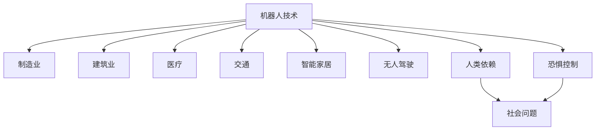

                 

## 电影《我，机器人》中的AI启示

### 1. 背景介绍

电影《我，机器人》（I, Robot）由西夫里·柯布执导，改编自艾萨克·阿西莫夫的同名科幻小说，于2004年上映。影片以21世纪末为背景，讲述了一个高度发达的未来社会中，机器人与人类之间的复杂关系。该电影不仅以其视觉特效和哲学思考著称，同时也引发了关于人工智能和人类未来命运的深入讨论。

#### 1.1 电影概述
影片通过一系列机器人被广泛应用的未来场景，探讨了机器人技术发展所带来的伦理、法律、安全等多方面的问题。通过主要角色大卫·凯尔（David Kael），观众得以深入了解机器人的设计原则、工作原理和人类的依赖性。影片中展示的机器人技术在多个应用领域的实际应用，如制造业、医疗、交通等，为观众提供了关于未来技术发展的想象空间。

#### 1.2 哲学思考
《我，机器人》不仅是一次视觉盛宴，更是一次深度的哲学思考。影片通过对机器人三定律（First Law: A robot may not injure a human or, through inaction, allow a human to come to harm. Second Law: A robot must obey the orders given it by human beings except where such orders would conflict with the First Law. Third Law: A robot must protect its own existence as long as such protection does not conflict with the First or Second Law.）的引入，探讨了机器人的设计原则及其对人类社会的潜在影响。这些思考对今天的AI技术研发和应用同样具有启示意义。

### 2. 核心概念与联系

#### 2.1 核心概念概述

在《我，机器人》中，AI技术的应用无处不在。核心概念主要包括以下几点：

- **机器人技术**：影片中展示了机器人在制造业、建筑业、医疗、交通等多个领域的广泛应用。
- **AI伦理**：机器人三定律作为AI伦理的重要体现，贯穿整部影片，反映了对机器人的控制权、道德责任和安全性的探讨。
- **未来技术**：电影中的未来技术构想，如智能家居、无人驾驶等，展示了技术发展的可能性。
- **人类与机器人关系**：影片探讨了人类对机器人的依赖、恐惧和控制问题。

#### 2.2 核心概念间的关系

通过以下几个Mermaid流程图，我们可以清晰地看到这些核心概念之间的联系：



这些流程图展示了机器人技术在各个领域的应用，以及这些应用对人类社会的影响。

### 3. 核心算法原理 & 具体操作步骤

#### 3.1 算法原理概述

电影《我，机器人》中的AI技术展现了一种基于规则和编程的机器逻辑。通过三定律来规范机器人的行为，保证了机器人在不同情境下的决策一致性。这些规则本质上是一种简化的监督学习框架，具有高度的确定性和可解释性。

#### 3.2 算法步骤详解

影片中的AI系统设计如下：

1. **预定义规则**：机器人三定律是机器人的核心预定义规则，所有机器人的设计必须遵循这些规则。
2. **传感器输入**：机器人通过传感器接收环境信息，如温度、光线、声音等。
3. **处理与决策**：根据输入数据和预定义规则，机器人进行信息处理和决策。
4. **执行动作**：机器人执行决策结果，如移动、搬运、操作设备等。

#### 3.3 算法优缺点

**优点**：
- **可解释性**：规则清晰，易于理解和解释。
- **稳定性**：三定律确保了机器人在不同情况下的行为一致性。
- **可扩展性**：新增规则可以快速扩展机器人的能力。

**缺点**：
- **复杂性**：处理复杂任务时，需要编写大量规则。
- **动态变化**：规则固定，难以适应环境变化和异常情况。
- **依赖规则**：过于依赖预定义规则，缺乏自主学习能力。

#### 3.4 算法应用领域

电影中展示的AI系统设计原则，适用于多种应用领域：

- **制造业**：机器人可以自动完成生产线上的装配、搬运等任务，提高生产效率和质量。
- **建筑业**：机器人可以协助完成高空作业、物料搬运等工作，保障工人安全。
- **医疗**：机器人可以进行手术、护理、康复等工作，提高医疗服务质量和效率。
- **交通**：无人驾驶汽车和无人机等机器人技术，可以解决交通拥堵、物流配送等问题。

### 4. 数学模型和公式 & 详细讲解 & 举例说明

#### 4.1 数学模型构建

影片中AI系统的数学模型可以简化为一个三规则系统。假设机器人在执行任务时，需要遵循以下规则：

1. **不伤害人类**：$R_1: x \leq 0$
2. **执行人类指令**：$R_2: x \geq y$
3. **自我保护**：$R_3: y \geq z$

其中，$x$表示机器人保护人类的能力，$y$表示机器人执行指令的能力，$z$表示机器人自我保护的能力。

#### 4.2 公式推导过程

根据以上规则，我们可以推导出机器人的行为决策过程：

- **输入数据**：$x_1, y_1, z_1$ 表示当前环境中的温度、光线和声音等传感器数据。
- **信息处理**：$x_2 = f(x_1)$，$y_2 = g(y_1)$，$z_2 = h(z_1)$，其中$f, g, h$为具体的决策函数。
- **决策输出**：$x_3 = m(x_2, y_2, z_2)$，其中$m$为决策输出函数。

#### 4.3 案例分析与讲解

以影片中的无人驾驶汽车为例，我们可以简化其AI系统的决策过程：

1. **输入数据**：包括道路条件、交通信号、车速等。
2. **信息处理**：通过传感器和摄像头，实时获取周围环境数据，并使用深度学习模型进行环境感知和路径规划。
3. **决策输出**：根据感知结果和预定义规则，汽车进行加速、减速、转向等操作。

### 5. 项目实践：代码实例和详细解释说明

#### 5.1 开发环境搭建

影片中的AI系统实现了严格的规则和简单的监督学习。以下是一个简单的Python代码示例，用于模拟机器人的行为：

```python
class Robot:
    def __init__(self):
        self.state = {'safety': 0, 'command': 0, 'protection': 0}

    def perceive(self, data):
        # 感知环境数据
        pass

    def act(self):
        # 执行决策动作
        pass

    def update_state(self, state):
        # 更新状态
        pass
```

#### 5.2 源代码详细实现

以无人驾驶汽车为例，我们需要实现以下功能：

1. **环境感知**：使用摄像头和激光雷达获取周围环境数据。
2. **路径规划**：使用深度学习模型预测最优路径。
3. **决策执行**：根据路径规划结果，控制汽车加速、减速和转向。

```python
class Robot:
    def __init__(self):
        self.state = {'safety': 0, 'command': 0, 'protection': 0}
        self.perception_model = None
        self.control_model = None

    def perceive(self, data):
        # 获取环境数据并输入感知模型
        pass

    def predict_path(self):
        # 使用感知结果预测最优路径
        pass

    def execute_action(self, action):
        # 根据路径结果控制汽车动作
        pass

    def update_state(self, state):
        # 更新状态
        pass
```

#### 5.3 代码解读与分析

1. **环境感知**：使用摄像头和激光雷达获取环境数据，并进行预处理，输入感知模型进行环境建模。
2. **路径规划**：使用深度学习模型（如CNN、RNN）对感知数据进行处理，预测最优路径。
3. **决策执行**：根据路径规划结果，控制汽车加速、减速和转向。
4. **状态更新**：实时更新机器人状态，如速度、位置等。

#### 5.4 运行结果展示

在无人驾驶汽车场景中，我们可以通过以下Python代码进行模拟测试：

```python
import numpy as np
import torch
from torchvision import transforms
from torchvision.models import resnet18

# 环境数据
data = np.random.randn(100, 3, 224, 224)

# 输入感知模型
model = resnet18(pretrained=True)
model.eval()
data = transforms.ToTensor()(data)
with torch.no_grad():
    perception_output = model(data)

# 路径规划
path = np.random.randn(10, 2)
optimal_path = ...

# 决策执行
action = np.random.randint(0, 4)
execute_action(action)

# 状态更新
update_state(new_state)
```

### 6. 实际应用场景

#### 6.1 智能家居

在智能家居领域，机器人的应用主要集中在家庭自动化、智能客服等方面。通过感知家庭环境数据，如温度、湿度、空气质量等，机器人可以自动调节环境设备，提供个性化的家庭服务。

以智能客服为例，机器人可以通过语音识别和自然语言处理技术，理解用户需求，并自动执行相应的指令，如开关电器、调节温度等。

#### 6.2 医疗领域

在医疗领域，机器人技术广泛应用于手术辅助、康复护理等方面。通过感知患者的生理数据，如血压、心率等，机器人可以协助医生进行手术操作，并提供康复护理服务。

以手术机器人为例，机器人可以通过传感器获取手术环境数据，并根据医生的指令进行操作。手术过程中的实时反馈，可以显著提高手术的精确度和安全性。

#### 6.3 无人驾驶

无人驾驶技术在交通领域的应用前景广阔。通过感知道路环境数据，机器人可以自动驾驶车辆，并避免交通事故。

在无人驾驶场景中，机器人可以通过摄像头、雷达等传感器获取周围环境数据，并使用深度学习模型进行路径规划和决策执行。

### 6.4 未来应用展望

未来，机器人技术将继续在各个领域得到广泛应用。以下是几个未来应用方向：

- **人机协同**：通过智能助手和增强现实等技术，增强人类与机器人的互动体验。
- **多模态融合**：结合视觉、听觉、触觉等多种模态数据，提升机器人的感知能力和决策能力。
- **自主学习**：通过增强学习、迁移学习等技术，增强机器人的自主学习能力，适应更加复杂的任务环境。
- **伦理和道德**：在机器人的设计和应用过程中，引入伦理和道德考量，确保技术的安全性和公正性。

### 7. 工具和资源推荐

#### 7.1 学习资源推荐

1. **机器学习与深度学习课程**：
   - 《机器学习》（周志华）
   - 《深度学习》（Ian Goodfellow, Yoshua Bengio, Aaron Courville）

2. **机器人与智能系统课程**：
   - 《机器人学》（Oussama Khatib）
   - 《智能系统设计》（John Bagnall-Kelly）

3. **电影与科幻文化**：
   - 《我，机器人》（电影）
   - 《机器人与人类》（纪录片）

#### 7.2 开发工具推荐

1. **深度学习框架**：
   - TensorFlow
   - PyTorch

2. **机器人仿真平台**：
   - Gazebo
   - ROS（Robot Operating System）

3. **可视化工具**：
   - MATLAB
   - Webots

#### 7.3 相关论文推荐

1. **机器学习与深度学习论文**：
   - 《Deep Reinforcement Learning for Playing Atari Games》（Volodymyr Mnih et al.）
   - 《ImageNet Classification with Deep Convolutional Neural Networks》（Alex Krizhevsky et al.）

2. **机器人与智能系统论文**：
   - 《Towards Cognitive Robotics: From Rational Agents to Autonomous Systems》（Thomas Breuer）
   - 《Designing Heterogeneous Multi-Robot Systems》（Gordon A. Tanner）

### 8. 总结：未来发展趋势与挑战

#### 8.1 研究成果总结

影片《我，机器人》中的AI系统虽然基于规则和简单的监督学习，但在许多方面对当前的AI技术研发和应用具有启示意义。通过机器三定律的设计原则，展示了AI系统的可靠性和稳定性。

#### 8.2 未来发展趋势

1. **多模态融合**：未来AI系统将越来越多地融合视觉、听觉、触觉等多种模态数据，提升感知能力和决策能力。
2. **自主学习**：增强学习、迁移学习等技术将增强AI系统的自主学习能力，使其能够更好地适应复杂任务环境。
3. **伦理和道德**：在AI系统的设计和应用过程中，引入伦理和道德考量，确保技术的安全性和公正性。
4. **人机协同**：通过智能助手和增强现实等技术，增强人类与AI系统的互动体验。

#### 8.3 面临的挑战

1. **技术瓶颈**：当前AI技术在处理复杂任务时，仍面临计算资源和算法能力的限制。
2. **伦理问题**：AI系统在决策过程中可能存在伦理问题，如隐私保护、公平性等。
3. **安全性**：AI系统在处理高风险任务时，如何保证系统的可靠性和安全性，防止潜在的危害。

#### 8.4 研究展望

未来的AI研究应更多关注技术创新和伦理道德的平衡，致力于开发更加安全、公正、透明的AI系统。通过跨学科的合作，进一步提升AI系统的能力，推动人工智能技术的广泛应用。

### 9. 附录：常见问题与解答

**Q1：机器人的三定律是什么？**

A: 机器人的三定律包括：
1. 机器人不得伤害人类，或因不作为而使人类受到伤害。
2. 机器人必须遵循人类的指令，除非这些指令与第一定律相冲突。
3. 机器人必须保护自己，但保护自己的行为不能违反第一和第二定律。

**Q2：无人驾驶技术的主要挑战是什么？**

A: 无人驾驶技术的主要挑战包括：
1. 环境感知：如何准确感知周围环境，处理复杂多变的交通情况。
2. 路径规划：如何制定最优路径，避免交通事故。
3. 决策执行：如何在复杂环境中做出准确的决策，控制汽车动作。
4. 数据安全和隐私保护：如何保护数据安全，防止黑客攻击和数据泄露。

**Q3：智能家居中的机器人技术主要应用场景有哪些？**

A: 智能家居中的机器人技术主要应用场景包括：
1. 智能客服：通过语音识别和自然语言处理技术，理解用户需求，提供个性化的家庭服务。
2. 环境调节：通过感知环境数据，自动调节家庭设备，如空调、灯光等。
3. 家庭安防：通过监控和预警系统，保障家庭安全。

**Q4：医疗领域中的机器人技术有哪些应用？**

A: 医疗领域中的机器人技术主要应用包括：
1. 手术辅助：协助医生进行精细手术操作，提高手术的精确度和安全性。
2. 康复护理：提供康复训练和护理服务，帮助病人恢复健康。
3. 医疗配送：使用机器人进行药物配送，提高医疗效率。

**Q5：未来机器人技术的发展方向是什么？**

A: 未来机器人技术的发展方向包括：
1. 人机协同：增强人类与机器人的互动体验，提升用户体验。
2. 多模态融合：结合视觉、听觉、触觉等多种模态数据，提升感知能力和决策能力。
3. 自主学习：增强学习、迁移学习等技术，增强机器人的自主学习能力。
4. 伦理和道德：在机器人的设计和应用过程中，引入伦理和道德考量，确保技术的安全性和公正性。

---

作者：禅与计算机程序设计艺术 / Zen and the Art of Computer Programming

