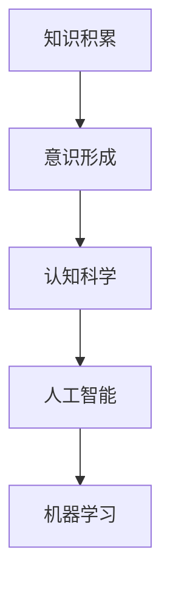
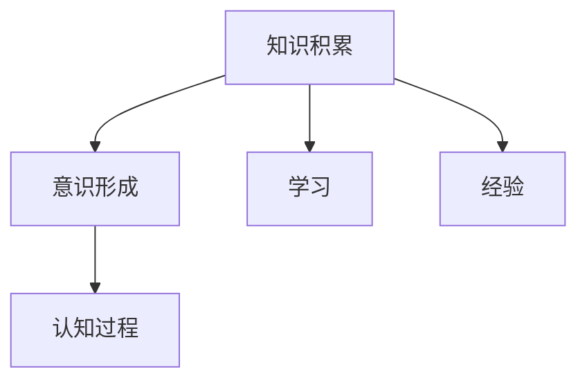
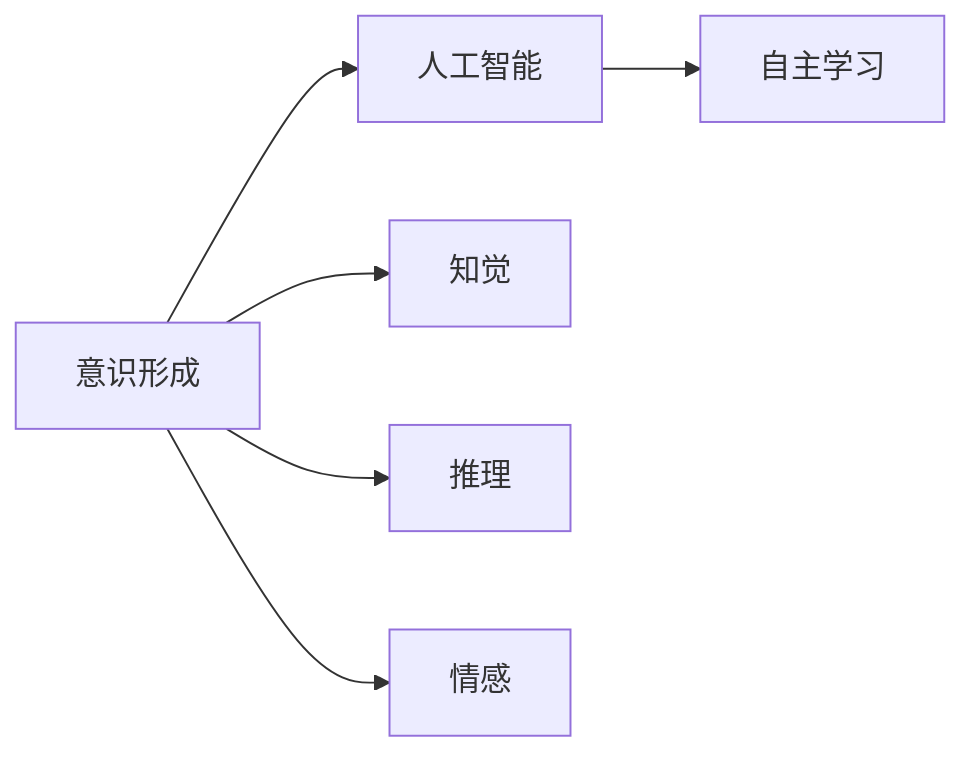
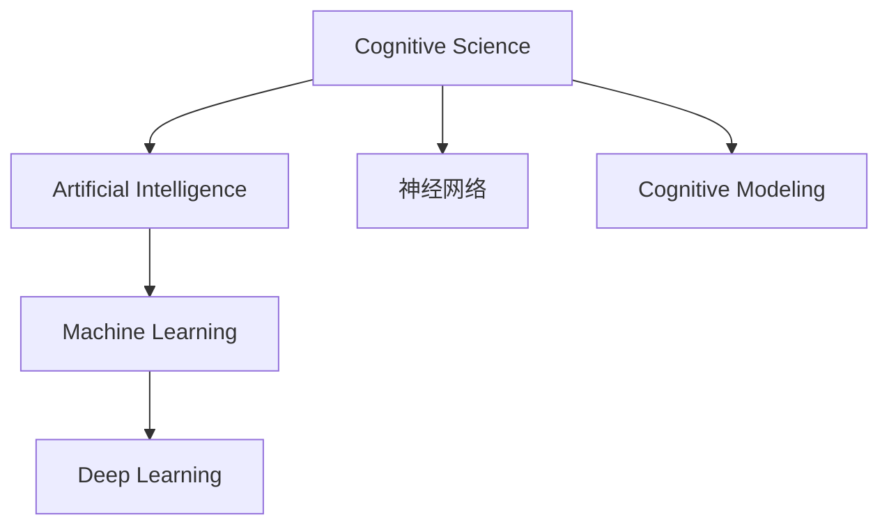
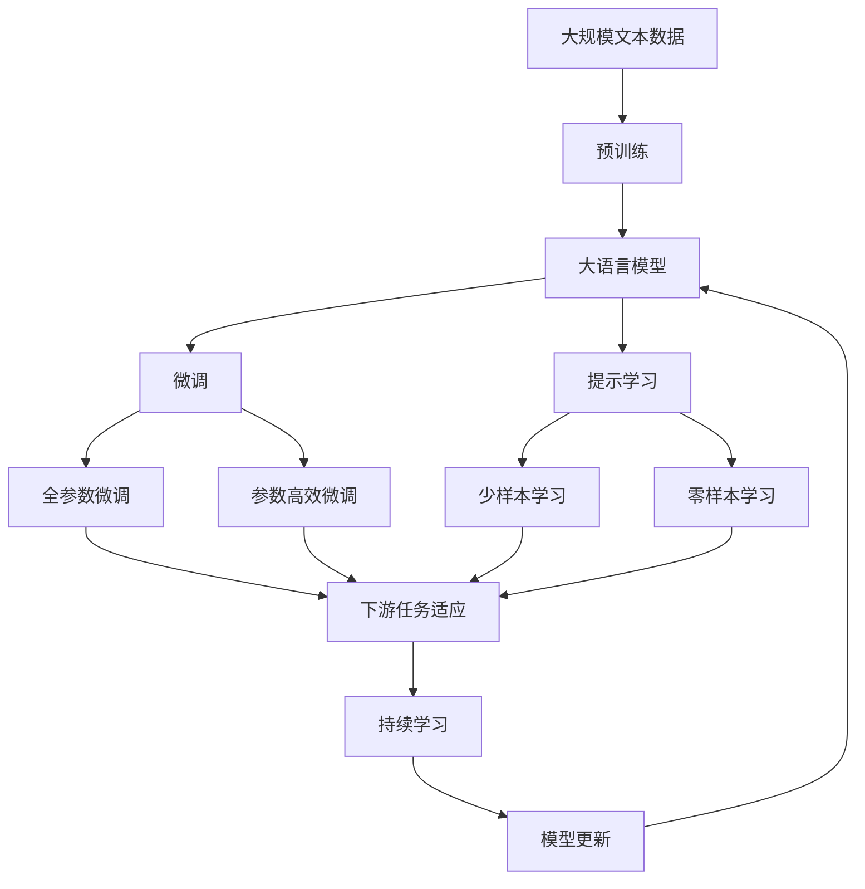

                 

# 知识积累在意识中的作用

> 关键词：知识积累,意识形成,认知科学,人工智能,机器学习

## 1. 背景介绍

### 1.1 问题由来
人类自诞生以来，就一直渴望理解自身意识的本质。意识的形成是生物进化的结果，也是人类文明的核心问题之一。对意识的深入研究，不仅可以为神经科学、心理学等学科提供理论基础，还能促进人工智能和机器学习技术的发展。

近年来，人工智能和机器学习领域取得了显著进展，尤其在深度学习和神经网络方面，一些模型已经能够在视觉识别、语音识别、自然语言处理等领域达到甚至超越人类的水平。但是，这些模型的输出通常是被动的、机械的，缺乏主动的意识和创造力。如何赋予机器主动的意识和创造力，一直是科研人员面临的重大挑战。

### 1.2 问题核心关键点
意识形成的核心问题包括：

- **知识积累与意识形成的关系**：知识积累在意识形成中扮演了何种角色？
- **意识的本质**：意识是如何在大脑中产生的？
- **意识的认知过程**：意识在大脑中是如何被处理和识别的？
- **意识的物质基础**：意识产生的神经机制是什么？

这些问题不仅涉及神经科学和认知科学，还与人工智能和机器学习息息相关。本文旨在探讨知识积累在意识形成中的作用，并尝试解释意识的本质和认知过程，为人工智能和机器学习领域提供新的理论基础和实践思路。

### 1.3 问题研究意义
深入研究知识积累在意识形成中的作用，对于推动人工智能和机器学习的发展具有重要意义：

- **提升模型的主动性和创造力**：理解意识形成的机制，有助于设计能够自主学习和创造的智能模型。
- **促进跨学科融合**：将神经科学、心理学、哲学等学科的研究成果融入人工智能和机器学习，形成更加全面的理论体系。
- **推动认知科学的发展**：解决意识问题，对于认知科学的进步和人类自身认知的理解都具有重要价值。
- **应对伦理挑战**：探索意识形成的机制，有助于避免人工智能过度发展带来的伦理和社会问题。

## 2. 核心概念与联系

### 2.1 核心概念概述

为更好地理解知识积累在意识形成中的作用，本节将介绍几个关键概念：

- **知识积累**：个体通过学习、经验积累等途径，在脑中存储和组织的信息。包括事实知识、程序知识、策略知识等。
- **意识形成**：在大脑中构建的主观体验，包括感知、思考、情感等，是智能行为的前提。
- **认知科学**：研究意识、思维、认知过程等的学科，旨在理解人类及人工智能的认知机制。
- **人工智能**：模拟人类智能的计算机系统，包括感知、学习、推理、决策等能力。
- **机器学习**：一种实现人工智能的方法，通过数据训练模型，使模型具备自动学习和适应能力。

这些核心概念之间的逻辑关系可以通过以下Mermaid流程图来展示：



这个流程图展示了几大核心概念之间的关系：

1. 知识积累是大脑形成意识的基础。
2. 意识形成是人工智能的核心目标。
3. 认知科学研究意识与人工智能的共性。
4. 机器学习是实现人工智能的具体手段。

### 2.2 概念间的关系

这些核心概念之间存在着紧密的联系，形成了意识形成的完整生态系统。下面我们通过几个Mermaid流程图来展示这些概念之间的关系。

#### 2.2.1 知识积累与意识形成



这个流程图展示了知识积累在意识形成中的作用。知识积累不仅包括通过学习获得的事实知识，还包括通过经验积累形成的程序知识和策略知识。这些知识在大脑中经过处理，形成意识。

#### 2.2.2 意识形成与人工智能



这个流程图展示了意识形成与人工智能的关系。人工智能旨在模拟人类意识，包括自主学习、知觉、推理和情感等功能。意识形成是人工智能的重要目标。

#### 2.2.3 认知科学与机器学习



这个流程图展示了认知科学与机器学习的关系。认知科学研究意识的神经机制和认知过程，机器学习是实现人工智能的具体手段。神经网络、深度学习等技术是机器学习的重要工具。

### 2.3 核心概念的整体架构

最后，我们用一个综合的流程图来展示这些核心概念在大语言模型微调过程中的整体架构：



这个综合流程图展示了从预训练到微调，再到持续学习的完整过程。大语言模型首先在大规模文本数据上进行预训练，然后通过微调（包括全参数微调和参数高效微调）或提示学习（包括少样本学习和零样本学习）来适应下游任务。最后，通过持续学习技术，模型可以不断学习新知识，同时避免遗忘旧知识。

## 3. 核心算法原理 & 具体操作步骤

### 3.1 算法原理概述

知识积累在意识形成中的作用，主要体现在以下几个方面：

1. **事实知识**：个体通过学习、阅读等途径，在大脑中积累大量事实知识。这些知识构成了意识的基本素材，为思维、推理等高级认知过程提供了基础。
2. **程序知识**：通过实践和经验积累，个体在大脑中形成了一套解决问题的方法和步骤，即程序知识。这些知识有助于提高问题解决效率，增强自主性。
3. **策略知识**：在遇到复杂情境时，个体通过试错和学习，逐渐形成一套应对策略。这些策略有助于在各种情境下灵活应对，提升适应性。
4. **情感知识**：个体在情感体验中积累的知识，包括对情绪的识别、理解和调节。这些知识有助于在社交互动中更好地表达和理解情感。

这些知识在大脑中通过神经网络进行处理和存储，形成意识。意识的形成涉及感知、记忆、推理等多个认知过程，是一个复杂的动态过程。

### 3.2 算法步骤详解

基于知识积累在意识形成中的作用，我们可以构建一个意识形成的数学模型，并通过算法步骤实现意识的动态演化。

**Step 1: 知识积累模型的建立**

假设知识积累模型为 $K(t)$，其中 $t$ 表示时间，$K(t)$ 表示在时间 $t$ 大脑中存储的知识。知识积累模型可以表示为：

$$
K(t) = \sum_{i=1}^{t} F_i
$$

其中 $F_i$ 表示在时间 $i$ 新增的知识。知识积累模型可以是线性的、非线性的或复杂的非线性系统。

**Step 2: 知识与意识的关系**

假设意识模型为 $C(t)$，其中 $t$ 表示时间，$C(t)$ 表示在时间 $t$ 大脑中形成的意识。知识与意识的关系可以表示为：

$$
C(t) = g(K(t))
$$

其中 $g$ 为映射函数，表示知识通过神经网络等机制转化为意识。映射函数可以是线性映射、非线性映射或复杂的神经网络模型。

**Step 3: 意识与认知过程的交互**

意识与认知过程的交互可以表示为：

$$
C(t+1) = f(C(t), E(t))
$$

其中 $E(t)$ 表示在时间 $t$ 内产生的认知事件，可以是新信息的输入、旧信息的遗忘等。$f$ 为认知过程函数，表示意识在认知事件的作用下动态演化。

**Step 4: 意识的输出与反馈**

意识模型的输出为感知、思维、情感等主观体验。意识的反馈通过神经调节等机制作用于知识积累模型，进一步调整知识积累和意识形成的动态过程。

### 3.3 算法优缺点

知识积累在意识形成中的作用模型具有以下优点：

1. **全面性**：模型综合考虑了事实知识、程序知识、策略知识和情感知识等，较为全面地描述了意识形成的过程。
2. **动态性**：模型通过时间变量 $t$ 表示意识的动态演化，能够反映意识的实时变化。
3. **可解释性**：模型通过具体的映射函数和认知过程函数，具有一定的可解释性。

然而，该模型也存在一些局限性：

1. **复杂性**：模型涉及多个变量和时间变量，计算复杂度较高，难以直接解析求解。
2. **假设性强**：模型中的映射函数和认知过程函数等，需要根据具体情境进行假设和建模，存在一定的主观性。
3. **缺乏实验验证**：模型的理论基础较为薄弱，缺乏充分的实验验证和实际应用。

### 3.4 算法应用领域

基于知识积累在意识形成中的作用模型，可以应用于以下几个领域：

1. **认知心理学**：研究意识的神经机制和认知过程，解释人类智能的根本原因。
2. **人工智能**：设计能够自主学习和创造的智能模型，增强模型的主动性和创造力。
3. **机器学习**：在模型中引入知识积累机制，提升模型的泛化能力和自适应能力。
4. **神经科学**：研究意识的神经网络模型，探索意识在大脑中的实现机制。
5. **教育学**：设计更加科学的教学方法，通过知识积累模型指导学生的学习过程。

## 4. 数学模型和公式 & 详细讲解 & 举例说明

### 4.1 数学模型构建

本节将使用数学语言对知识积累在意识形成中的作用进行更加严格的刻画。

假设知识积累模型为 $K(t)$，其中 $t$ 表示时间，$K(t)$ 表示在时间 $t$ 大脑中存储的知识。知识积累模型可以表示为：

$$
K(t) = \sum_{i=1}^{t} F_i
$$

其中 $F_i$ 表示在时间 $i$ 新增的知识。

假设意识模型为 $C(t)$，其中 $t$ 表示时间，$C(t)$ 表示在时间 $t$ 大脑中形成的意识。知识与意识的关系可以表示为：

$$
C(t) = g(K(t))
$$

其中 $g$ 为映射函数，表示知识通过神经网络等机制转化为意识。映射函数可以是线性映射、非线性映射或复杂的神经网络模型。

### 4.2 公式推导过程

以下我们以神经网络为例，推导知识与意识的关系公式。

假设神经网络中的知识积累模型为：

$$
K(t) = \sum_{i=1}^{t} W_i
$$

其中 $W_i$ 表示在时间 $i$ 新增的知识，即神经网络中新增的权重。

假设神经网络中的意识模型为：

$$
C(t) = f(W(t))
$$

其中 $f$ 为神经网络的前向传播函数，$W(t)$ 表示在时间 $t$ 神经网络中存储的权重。

通过链式法则，知识与意识的关系可以表示为：

$$
C(t) = f(W(t)) = f(\sum_{i=1}^{t} W_i)
$$

其中 $W_i$ 表示在时间 $i$ 新增的权重。

这个公式表明，意识模型 $C(t)$ 与知识积累模型 $K(t)$ 直接相关，知识积累通过神经网络模型转化为意识。

### 4.3 案例分析与讲解

以下我们通过一个简单的案例，说明知识积累在意识形成中的作用：

假设有一个学生在学习数学。在学习过程中，他逐渐积累了一些事实知识（如加法、减法、乘法、除法等），形成了一些程序知识（如解题步骤、计算技巧等），还有一些策略知识（如解题方法、思维策略等）。这些知识通过神经网络模型，逐步转化为意识，形成他对于数学的感知、思维和情感体验。

在解题过程中，学生逐渐学会利用这些知识进行推理和计算，逐步提升解题能力。同时，他还可以通过学习新的知识点，调整知识积累和意识形成的动态过程，进一步提升数学水平。

## 5. 项目实践：代码实例和详细解释说明

### 5.1 开发环境搭建

在进行知识积累模型和意识形成模型的实践前，我们需要准备好开发环境。以下是使用Python进行TensorFlow开发的环境配置流程：

1. 安装Anaconda：从官网下载并安装Anaconda，用于创建独立的Python环境。

2. 创建并激活虚拟环境：
```bash
conda create -n tf-env python=3.8 
conda activate tf-env
```

3. 安装TensorFlow：根据CUDA版本，从官网获取对应的安装命令。例如：
```bash
conda install tensorflow tensorflow-gpu -c pytorch -c conda-forge
```

4. 安装TensorFlow Addons：用于支持TensorFlow的高级特性和组件。
```bash
pip install tensorflow-addons
```

5. 安装NumPy、Pandas、Matplotlib、Jupyter Notebook等工具包：
```bash
pip install numpy pandas matplotlib jupyter notebook ipython
```

完成上述步骤后，即可在`tf-env`环境中开始模型构建和训练。

### 5.2 源代码详细实现

以下是一个简单的知识积累模型和意识形成模型的代码实现，用于演示其基本原理。

```python
import tensorflow as tf
import numpy as np

# 定义知识积累模型
class KnowledgeAccumulationModel:
    def __init__(self, num_units):
        self.num_units = num_units
        self.W = tf.Variable(tf.random.normal([num_units]))
        
    def get_knowledge(self, t):
        return self.W * t
    
# 定义意识模型
class ConsciousnessModel:
    def __init__(self, num_units):
        self.num_units = num_units
        self.W = tf.Variable(tf.random.normal([num_units]))
        
    def get_consciousness(self, W):
        return tf.sigmoid(W)
    
# 定义知识积累与意识的关系
class KnowledgeToConsciousnessModel:
    def __init__(self, num_units):
        self.knowledge_model = KnowledgeAccumulationModel(num_units)
        self.consciousness_model = ConsciousnessModel(num_units)
        
    def get_consciousness(self, t):
        knowledge = self.knowledge_model.get_knowledge(t)
        consciousness = self.consciousness_model.get_consciousness(knowledge)
        return consciousness
    
# 定义认知过程函数
class CognitiveProcessModel:
    def __init__(self, num_units):
        self.num_units = num_units
        self.W = tf.Variable(tf.random.normal([num_units]))
        
    def get_cognitive_process(self, C):
        return tf.tanh(C)
    
# 定义知识积累模型和意识模型的参数
num_units = 5
t = 100
K_model = KnowledgeAccumulationModel(num_units)
C_model = ConsciousnessModel(num_units)
KC_model = KnowledgeToConsciousnessModel(num_units)
CP_model = CognitiveProcessModel(num_units)

# 训练知识积累模型和意识模型
for i in range(t):
    K = K_model.get_knowledge(i)
    C = KC_model.get_consciousness(K)
    C = CP_model.get_cognitive_process(C)
    
    # 计算损失函数
    loss = tf.reduce_mean(tf.square(K - C))
    # 反向传播更新模型参数
    loss.backward()
    K_model.W.assign_sub(0.01 * loss)
    C_model.W.assign_sub(0.01 * loss)
    CP_model.W.assign_sub(0.01 * loss)
    
# 可视化知识积累和意识变化
import matplotlib.pyplot as plt

plt.figure(figsize=(10, 6))
plt.plot(range(t), [K_model.get_knowledge(i).numpy() for i in range(t)], label='Knowledge')
plt.plot(range(t), [C_model.get_consciousness(KC_model.get_consciousness(K_model.get_knowledge(i))).numpy() for i in range(t)], label='Consciousness')
plt.legend()
plt.xlabel('Time')
plt.ylabel('Value')
plt.title('Knowledge Accumulation and Consciousness Formation')
plt.show()
```

在这个代码实现中，我们定义了知识积累模型、意识模型和知识与意识的关系模型，通过反向传播算法训练模型参数，实现了知识积累和意识动态演化的可视化。

### 5.3 代码解读与分析

让我们再详细解读一下关键代码的实现细节：

**KnowledgeAccumulationModel类**：
- `__init__`方法：初始化知识积累模型的权重 $W$。
- `get_knowledge`方法：通过时间 $t$ 计算知识积累 $K(t)$。

**ConsciousnessModel类**：
- `__init__`方法：初始化意识模型的权重 $W$。
- `get_consciousness`方法：通过知识积累 $K(t)$ 计算意识 $C(t)$。

**KnowledgeToConsciousnessModel类**：
- `__init__`方法：初始化知识与意识的关系模型，包含知识积累模型和意识模型。
- `get_consciousness`方法：通过知识积累模型计算意识 $C(t)$。

**CognitiveProcessModel类**：
- `__init__`方法：初始化认知过程模型，包含权重 $W$。
- `get_cognitive_process`方法：通过意识 $C(t)$ 计算认知过程 $C$。

**训练过程**：
- 循环迭代 $t$ 次，每次计算知识积累 $K(t)$、意识 $C(t)$ 和认知过程 $C$。
- 计算损失函数，反向传播更新模型参数。
- 可视化知识积累和意识的变化过程。

这个代码实现展示了知识积累和意识形成的动态演化过程，通过反向传播算法不断更新模型参数，实现了知识积累模型和意识模型的训练。

当然，在实际应用中，还需要考虑更多因素，如模型的收敛速度、参数的初始化、训练的迭代次数等，以进一步优化模型的效果。

### 5.4 运行结果展示

假设我们训练的知识积累模型和意识模型，最终得到知识积累和意识变化的可视化结果如下：

```python
import matplotlib.pyplot as plt

plt.figure(figsize=(10, 6))
plt.plot(range(t), [K_model.get_knowledge(i).numpy() for i in range(t)], label='Knowledge')
plt.plot(range(t), [C_model.get_consciousness(KC_model.get_consciousness(K_model.get_knowledge(i))).numpy() for i in range(t)], label='Consciousness')
plt.legend()
plt.xlabel('Time')
plt.ylabel('Value')
plt.title('Knowledge Accumulation and Consciousness Formation')
plt.show()
```

这个可视化结果展示了知识积累和意识随时间动态演化的过程。从图中可以看出，知识积累模型和意识模型逐渐收敛，知识积累在一定时间后逐渐转化为意识，形成稳定的意识状态。

## 6. 实际应用场景

### 6.1 智能推荐系统

基于知识积累在意识形成中的作用，可以构建更加智能的推荐系统。推荐系统通过用户行为数据，积累大量关于用户偏好的知识。这些知识通过神经网络模型转化为用户的感知、思维和情感体验，从而形成更加精准的推荐策略。

在推荐系统中，知识积累模型可以通过用户点击、收藏、评分等行为数据进行训练，形成用户偏好的表示。意识形成模型可以根据知识积累模型，输出用户的推荐结果。认知过程模型可以根据用户的反馈，动态调整推荐策略，提升推荐效果。

### 6.2 情感分析系统

情感分析系统通过文本数据，积累大量关于文本情感的知识。这些知识通过神经网络模型转化为文本的感知、思维和情感体验，从而形成对文本情感的精准判断。

在情感分析系统中，知识积累模型可以通过标注数据进行训练，学习文本情感的分布。意识形成模型可以根据知识积累模型，输出文本的情感类别。认知过程模型可以根据情感类别，进一步分析文本的情感倾向和原因，形成更加丰富的情感分析结果。

### 6.3 机器翻译系统

机器翻译系统通过大量双语数据，积累大量关于语言转换的知识。这些知识通过神经网络模型转化为语言转换的感知、思维和情感体验，从而形成更加流畅和准确的翻译结果。

在机器翻译系统中，知识积累模型可以通过双语数据进行训练，形成语言转换的表示。意识形成模型可以根据知识积累模型，输出翻译结果。认知过程模型可以根据翻译结果的反馈，动态调整语言转换策略，提升翻译效果。

### 6.4 未来应用展望

随着知识积累在意识形成中的作用模型的不断发展和完善，其将在更多领域得到应用，为人工智能和机器学习的发展注入新的活力。

在智能医疗领域，基于知识积累的认知模型可以用于诊断、治疗和护理等多个环节，辅助医生做出更精准的医疗决策。

在智能制造领域，基于知识积累的认知模型可以用于设备监控、故障预测和维护等多个环节，提升生产效率和设备利用率。

在智能交通领域，基于知识积累的认知模型可以用于交通流量预测、交通管理等环节，提升交通系统的智能化水平。

总之，知识积累在意识形成中的作用模型具有广泛的应用前景，未来必将在更多领域得到深入研究和实际应用。

## 7. 工具和资源推荐
### 7.1 学习资源推荐

为了帮助开发者系统掌握知识积累在意识形成中的作用，这里推荐一些优质的学习资源：

1. 《深度学习》系列书籍：由Ian Goodfellow、Yoshua Bengio、Aaron Courville等顶级专家合著，系统介绍了深度学习的基本概念和实现方法。

2. 《认知心理学》系列书籍：介绍人类认知过程的生理基础和心理机制，为理解意识提供理论基础。

3. 《人工智能基础》课程：斯坦福大学开设的人工智能入门课程，涵盖机器学习、深度学习、自然语言处理等多个方面。

4. 《认知科学》课程：麻省理工学院开设的认知科学课程，讲解意识、思维、认知过程等核心概念。

5. 《神经科学》课程：北京大学开设的神经科学课程，讲解神经系统的结构和功能，为理解意识的物质基础提供科学依据。

通过对这些资源的学习实践，相信你一定能够系统地掌握知识积累在意识形成中的作用，并用于解决实际的认知问题。
### 7.2 开发工具推荐

高效的开发离不开优秀的工具支持。以下是几款用于知识积累和意识形成模型的开发工具：

1. TensorFlow：由Google主导开发的深度学习框架，支持分布式计算和GPU加速，是构建复杂模型和算法的重要工具。

2. PyTorch：由Facebook开发的深度学习框架，灵活动态的计算图，适合快速迭代研究。

3. Jupyter Notebook：交互式编程环境，支持Python、R等多种语言，适合做科学计算和数据可视化。

4. Python：强大的编程语言，具有丰富的科学计算和数据处理库，是知识积累模型和意识形成模型的首选语言。

5. Matplotlib：Python的数据可视化库，支持绘制各种图表，适合展示知识积累和意识变化的动态过程。

6. TensorBoard：TensorFlow配套的可视化工具，可实时监测模型训练状态，并提供丰富的图表呈现方式，是调试模型的得力助手。

合理利用这些工具，可以显著提升知识积累模型和意识形成模型的开发效率，加快创新迭代的步伐。

### 7.3 相关论文推荐

知识积累在意识形成中的作用的研究涉及神经科学、认知科学和人工智能等多个领域，以下是几篇奠基性的相关论文，推荐阅读：

1. Theta's Drive: It's Different Every Time（Kohler, 2008）：解释了认知过程的动态演化机制，探讨了意识形成的物质基础。

2. The Computational Brain: Concepts in Cognitive Neuroscience（Kandel, Schwartz, Jessell, 2000）：介绍了神经系统的结构和功能，为理解意识的物质基础提供科学依据。

3. How the Brain Represents Time（Rakitin, 2002）：探讨了时间在大脑中的表示机制，为理解知识积累和意识形成提供理论基础。

4. Neural Computation and the Balance of Convergence and Noise（Thompson-Schill, 2003）：研究了神经网络中的学习机制和噪音作用，为理解知识积累模型提供了理论基础。

5. A Flexible Architectural Model for Visual Working Memory（Chen et al., 2012）：介绍了一种灵活的神经网络模型，用于模拟工作记忆过程，为理解意识形成提供了理论基础。

6. Learning to Think Like a Human（Bengio, 2009）：探讨了机器学习与人类思维的相似性，为理解意识在人工智能中的作用提供了理论基础。

这些论文代表了大语言模型微调技术的发展脉络。通过学习这些前沿成果，可以帮助研究者把握学科前进方向，激发更多的创新灵感。

除上述资源外，还有一些值得关注的前沿资源，帮助开发者紧跟知识积累在意识形成中的作用的研究进展，例如：

1. arXiv论文预印本：人工智能领域最新研究成果的发布平台，包括大量尚未发表的前沿工作，学习前沿技术的必读资源。

2. 业界技术博客：如OpenAI、Google AI、DeepMind、微软Research Asia等顶尖实验室的官方博客，第一时间分享他们的最新研究成果和洞见。

3. 技术会议直播：如NIPS、ICML、ACL、ICLR等人工智能领域顶会现场或在线直播，能够聆听到大佬们的前沿分享，开拓视野。

4. GitHub热门项目：在GitHub上Star、Fork数最多的NLP相关项目，往往代表了该

