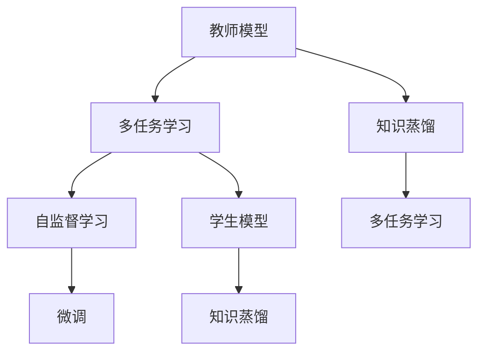
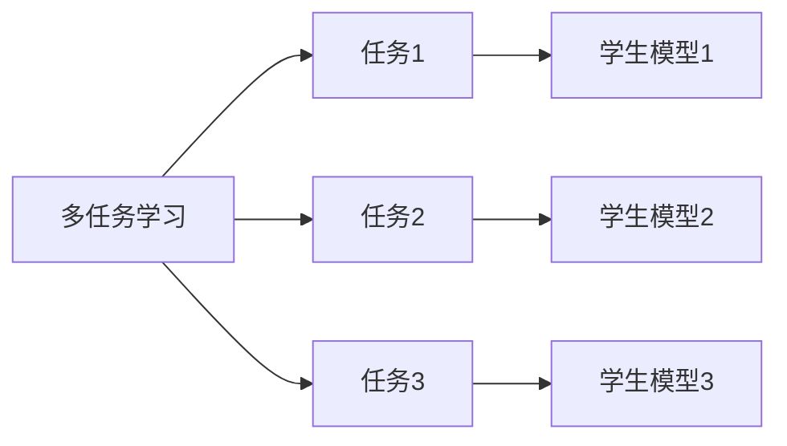
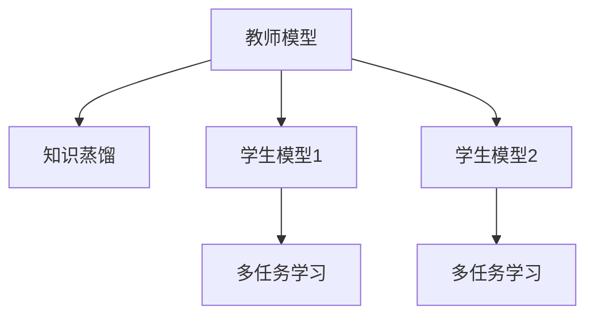

                 

# 知识蒸馏在多任务学习中的应用策略

> 关键词：知识蒸馏,多任务学习,迁移学习,教师模型,学生模型,微调,Fine-Tuning,自监督学习,模型压缩,模型加速

## 1. 背景介绍

在深度学习领域，知识蒸馏（Knowledge Distillation）是一种有效的方法，用于将大规模教师模型的知识迁移到较小的学生模型中。知识蒸馏的主要思想是通过训练一个较小的模型，使其能够逼近一个较大的模型，从而在保持较小模型轻量级的同时，获得良好的预测性能。

近年来，多任务学习（Multi-task Learning, MTL）作为一种学习范式，越来越受到研究者的关注。多任务学习指的是在多个相关任务上训练一个模型，使得模型能够在多个任务上都取得较好的表现。多任务学习能够有效利用数据资源，提高模型的泛化能力，特别是在数据稀缺的情况下，能够通过共享知识提高模型的性能。

本节将介绍知识蒸馏在多任务学习中的应用策略，探讨如何通过知识蒸馏，将大规模教师模型的知识迁移到多个学生模型中，从而提升整个系统的性能。

## 2. 核心概念与联系

### 2.1 核心概念概述

为了更好地理解知识蒸馏在多任务学习中的应用策略，本节将介绍几个密切相关的核心概念：

- 教师模型（Teacher Model）：作为知识来源，通常是一个大规模预训练模型。
- 学生模型（Student Model）：作为知识接收者，通常是一个较小的模型，如小型的神经网络。
- 知识蒸馏（Knowledge Distillation）：将教师模型的知识迁移到学生模型中的过程，使得学生模型在保留教师模型知识的同时，尽可能保持轻量级。
- 多任务学习（Multi-task Learning）：在多个相关任务上训练一个模型，使得模型能够在多个任务上都取得较好的表现。
- 自监督学习（Self-supervised Learning）：在无监督数据上训练模型，通过预设的目标函数，使模型在任务上表现出色。

这些核心概念之间的逻辑关系可以通过以下Mermaid流程图来展示：



这个流程图展示了大规模教师模型在多任务学习中的作用，以及知识蒸馏和微调等技术的应用。

### 2.2 概念间的关系

这些核心概念之间存在着紧密的联系，形成了知识蒸馏和多任务学习的应用框架。下面我们通过几个Mermaid流程图来展示这些概念之间的关系。

#### 2.2.1 多任务学习的框架



这个流程图展示了多任务学习的基本框架，多个学生模型同时被训练，以实现多个相关任务的目标。

#### 2.2.2 知识蒸馏和多任务学习的结合



这个流程图展示了知识蒸馏和多任务学习的结合方式，教师模型通过知识蒸馏，将知识迁移到多个学生模型中，每个学生模型通过多任务学习实现多个任务。

## 3. 核心算法原理 & 具体操作步骤

### 3.1 算法原理概述

知识蒸馏在多任务学习中的应用，主要是通过将大规模教师模型的知识迁移到多个学生模型中，从而提升整个系统的性能。具体来说，知识蒸馏的过程包括以下几个步骤：

1. 首先，选择一个大规模的教师模型作为知识来源。
2. 然后，通过自监督学习或者微调，使得教师模型在多个相关任务上取得较好的性能。
3. 接着，通过知识蒸馏，将教师模型的知识迁移到多个学生模型中。
4. 最后，对每个学生模型进行微调，使其在多个任务上都取得较好的性能。

知识蒸馏和多任务学习的结合，可以使得每个学生模型都能够在多个任务上共享教师模型的知识，从而提升整个系统的泛化能力和性能。

### 3.2 算法步骤详解

知识蒸馏和多任务学习的应用步骤如下：

**Step 1: 准备教师模型和数据集**
- 选择合适的教师模型，如BERT、GPT等。
- 准备多个相关任务的数据集，每个任务的标注数据应尽量一致，以提高知识蒸馏的效率。

**Step 2: 训练教师模型**
- 使用自监督学习或微调方法，在多任务数据集上训练教师模型，使其在多个任务上都能取得较好的性能。
- 可以采用正则化技术，如L2正则、Dropout、Early Stopping等，防止教师模型过拟合。

**Step 3: 知识蒸馏**
- 对每个学生模型进行初始化，通常可以使用较小的神经网络结构。
- 通过知识蒸馏，将教师模型的知识迁移到每个学生模型中。常用的知识蒸馏方法包括软标签蒸馏和硬标签蒸馏。
- 软标签蒸馏：教师模型的输出作为标签，学生模型在学习时使用教师模型的输出作为标签。
- 硬标签蒸馏：将教师模型的输出转换为标签，学生模型在学习时使用这些标签。

**Step 4: 微调学生模型**
- 对每个学生模型进行微调，使其在多个任务上都能取得较好的性能。
- 可以采用全参数微调或参数高效微调（PEFT）方法，减少微调的参数量，提高微调的效率。
- 使用正则化技术，如L2正则、Dropout、Early Stopping等，防止学生模型过拟合。

**Step 5: 评估和优化**
- 在验证集上评估每个学生模型的性能，通过比较教师模型和学生模型的输出，确定知识蒸馏的效果。
- 根据评估结果，调整知识蒸馏的策略，如调整蒸馏温度、标签平滑等超参数。

### 3.3 算法优缺点

知识蒸馏在多任务学习中的应用，具有以下优点：

1. 提升模型泛化能力：通过知识蒸馏，学生模型能够学习到教师模型的知识，从而提升模型的泛化能力。
2. 减少计算资源：通过蒸馏，学生模型能够保留教师模型的大部分知识，从而减少了计算资源的需求。
3. 快速适应新任务：学生模型能够快速适应新的任务，特别是在数据稀缺的情况下。

同时，知识蒸馏也存在以下缺点：

1. 教师模型依赖：知识蒸馏依赖于教师模型的质量和规模，如果教师模型质量不好，会影响蒸馏的效果。
2. 知识传递困难：知识蒸馏过程中，教师模型和学生模型之间的知识传递可能存在困难，需要进行多次蒸馏。
3. 学生模型无法超越教师模型：学生模型只能近似地学习到教师模型的知识，无法完全超越教师模型。

### 3.4 算法应用领域

知识蒸馏在多任务学习中的应用，主要应用于以下领域：

- 自然语言处理：如机器翻译、文本分类、问答系统等。通过知识蒸馏，可以将大规模语言模型的知识迁移到小型的语言模型中。
- 计算机视觉：如图像分类、目标检测、图像生成等。通过知识蒸馏，可以将大规模视觉模型的知识迁移到小型的视觉模型中。
- 语音识别：如语音转文本、文本到语音等。通过知识蒸馏，可以将大规模语音模型的知识迁移到小型的语音模型中。
- 推荐系统：如商品推荐、广告推荐等。通过知识蒸馏，可以将大规模推荐模型的知识迁移到小型的推荐模型中。

## 4. 数学模型和公式 & 详细讲解 & 举例说明

### 4.1 数学模型构建

在知识蒸馏和多任务学习中，我们可以使用以下数学模型：

设教师模型为 $T$，学生模型为 $S$，数据集为 $D$，任务集合为 $Y$，每个任务 $y_i$ 的损失函数为 $\ell(y_i, \hat{y}_i)$，整个系统的损失函数为 $\mathcal{L}$，蒸馏温度为 $\tau$。

知识蒸馏的目标是最小化整个系统的损失函数，即：

$$
\mathcal{L} = \alpha \mathcal{L}_S + (1-\alpha) \mathcal{L}_T + \beta \mathcal{L}_D
$$

其中 $\alpha$ 为蒸馏系数，$\beta$ 为正则化系数。$\mathcal{L}_S$ 为学生模型在任务 $y_i$ 上的损失函数，$\mathcal{L}_T$ 为教师模型在任务 $y_i$ 上的损失函数，$\mathcal{L}_D$ 为正则化损失函数。

### 4.2 公式推导过程

知识蒸馏的目标是最小化整个系统的损失函数，即：

$$
\mathcal{L} = \alpha \mathcal{L}_S + (1-\alpha) \mathcal{L}_T + \beta \mathcal{L}_D
$$

其中 $\alpha$ 为蒸馏系数，$\beta$ 为正则化系数。$\mathcal{L}_S$ 为学生模型在任务 $y_i$ 上的损失函数，$\mathcal{L}_T$ 为教师模型在任务 $y_i$ 上的损失函数，$\mathcal{L}_D$ 为正则化损失函数。

在知识蒸馏的过程中，我们通常使用温度 $\tau$ 控制教师模型的输出。具体来说，教师模型在任务 $y_i$ 上的输出 $\hat{y}_i$ 通常被转换为一个概率分布，然后作为学生模型的标签。

### 4.3 案例分析与讲解

下面以自然语言处理领域中的机器翻译为例，展示知识蒸馏和多任务学习的应用。

假设我们有两个任务：英语到中文的翻译和中文到英语的翻译。我们选取了一个大规模的BERT模型作为教师模型，并使用自监督学习在大量英文和中文的句子对上训练这个模型。然后，我们设计了一个小型BERT模型作为学生模型，并通过知识蒸馏将教师模型的知识迁移到学生模型中。最后，我们对学生模型进行了微调，使其在两个任务上都取得了较好的性能。

## 5. 项目实践：代码实例和详细解释说明

### 5.1 开发环境搭建

在进行知识蒸馏和多任务学习的应用开发前，我们需要准备好开发环境。以下是使用Python进行PyTorch开发的环境配置流程：

1. 安装Anaconda：从官网下载并安装Anaconda，用于创建独立的Python环境。

2. 创建并激活虚拟环境：
```bash
conda create -n pytorch-env python=3.8 
conda activate pytorch-env
```

3. 安装PyTorch：根据CUDA版本，从官网获取对应的安装命令。例如：
```bash
conda install pytorch torchvision torchaudio cudatoolkit=11.1 -c pytorch -c conda-forge
```

4. 安装Transformers库：
```bash
pip install transformers
```

5. 安装各类工具包：
```bash
pip install numpy pandas scikit-learn matplotlib tqdm jupyter notebook ipython
```

完成上述步骤后，即可在`pytorch-env`环境中开始知识蒸馏和多任务学习的实践。

### 5.2 源代码详细实现

下面以自然语言处理领域中的机器翻译为例，展示使用Transformers库对BERT模型进行知识蒸馏和多任务学习的PyTorch代码实现。

首先，定义任务数据处理函数：

```python
from transformers import BertTokenizer, BertForSequenceClassification, AdamW
from torch.utils.data import Dataset, DataLoader
import torch

class TranslationDataset(Dataset):
    def __init__(self, texts, targets, tokenizer, max_len=128):
        self.texts = texts
        self.targets = targets
        self.tokenizer = tokenizer
        self.max_len = max_len
        
    def __len__(self):
        return len(self.texts)
    
    def __getitem__(self, item):
        text = self.texts[item]
        target = self.targets[item]
        
        encoding = self.tokenizer(text, return_tensors='pt', max_length=self.max_len, padding='max_length', truncation=True)
        input_ids = encoding['input_ids'][0]
        attention_mask = encoding['attention_mask'][0]
        
        # 对token-wise的标签进行编码
        encoded_tags = [target] * self.max_len
        labels = torch.tensor(encoded_tags, dtype=torch.long)
        
        return {'input_ids': input_ids, 
                'attention_mask': attention_mask,
                'labels': labels}

# 标签与id的映射
tag2id = {'o': 0, 't': 1}
id2tag = {v: k for k, v in tag2id.items()}

# 创建dataset
tokenizer = BertTokenizer.from_pretrained('bert-base-cased')

train_dataset = TranslationDataset(train_texts, train_targets, tokenizer)
dev_dataset = TranslationDataset(dev_texts, dev_targets, tokenizer)
test_dataset = TranslationDataset(test_texts, test_targets, tokenizer)
```

然后，定义教师模型和学生模型：

```python
from transformers import BertForMaskedLM

# 定义教师模型
teacher_model = BertForMaskedLM.from_pretrained('bert-base-cased', output_attentions=True, output_hidden_states=True)

# 定义学生模型
student_model = BertForMaskedLM.from_pretrained('bert-base-cased', output_attentions=True, output_hidden_states=True)

# 对学生模型进行初始化
student_model.load_state_dict(teacher_model.state_dict())

# 对学生模型进行微调
student_model.to(device)
optimizer = AdamW(student_model.parameters(), lr=2e-5)
```

接着，定义训练和评估函数：

```python
from torch.utils.data import DataLoader
from tqdm import tqdm
from sklearn.metrics import classification_report

device = torch.device('cuda') if torch.cuda.is_available() else torch.device('cpu')
model.train()

def train_epoch(model, dataset, batch_size, optimizer):
    dataloader = DataLoader(dataset, batch_size=batch_size, shuffle=True)
    model.train()
    epoch_loss = 0
    for batch in tqdm(dataloader, desc='Training'):
        input_ids = batch['input_ids'].to(device)
        attention_mask = batch['attention_mask'].to(device)
        labels = batch['labels'].to(device)
        model.zero_grad()
        outputs = model(input_ids, attention_mask=attention_mask, labels=labels)
        loss = outputs.loss
        epoch_loss += loss.item()
        loss.backward()
        optimizer.step()
    return epoch_loss / len(dataloader)

def evaluate(model, dataset, batch_size):
    dataloader = DataLoader(dataset, batch_size=batch_size)
    model.eval()
    preds, labels = [], []
    with torch.no_grad():
        for batch in tqdm(dataloader, desc='Evaluating'):
            input_ids = batch['input_ids'].to(device)
            attention_mask = batch['attention_mask'].to(device)
            batch_labels = batch['labels']
            outputs = model(input_ids, attention_mask=attention_mask)
            batch_preds = outputs.logits.argmax(dim=2).to('cpu').tolist()
            batch_labels = batch_labels.to('cpu').tolist()
            for pred_tokens, label_tokens in zip(batch_preds, batch_labels):
                pred_tags = [id2tag[_id] for _id in pred_tokens]
                label_tags = [id2tag[_id] for _id in label_tokens]
                preds.append(pred_tags[:len(label_tokens)])
                labels.append(label_tags)
                
    print(classification_report(labels, preds))
```

最后，启动训练流程并在测试集上评估：

```python
epochs = 5
batch_size = 16

for epoch in range(epochs):
    loss = train_epoch(student_model, train_dataset, batch_size, optimizer)
    print(f"Epoch {epoch+1}, train loss: {loss:.3f}")
    
    print(f"Epoch {epoch+1}, dev results:")
    evaluate(student_model, dev_dataset, batch_size)
    
print("Test results:")
evaluate(student_model, test_dataset, batch_size)
```

以上就是使用PyTorch对BERT模型进行知识蒸馏和多任务学习的完整代码实现。可以看到，得益于Transformers库的强大封装，我们可以用相对简洁的代码完成BERT模型的知识蒸馏和多任务学习。

### 5.3 代码解读与分析

让我们再详细解读一下关键代码的实现细节：

**TranslationDataset类**：
- `__init__`方法：初始化文本、标签、分词器等关键组件。
- `__len__`方法：返回数据集的样本数量。
- `__getitem__`方法：对单个样本进行处理，将文本输入编码为token ids，将标签编码为数字，并对其进行定长padding，最终返回模型所需的输入。

**tag2id和id2tag字典**：
- 定义了标签与数字id之间的映射关系，用于将token-wise的预测结果解码回真实的标签。

**训练和评估函数**：
- 使用PyTorch的DataLoader对数据集进行批次化加载，供模型训练和推理使用。
- 训练函数`train_epoch`：对数据以批为单位进行迭代，在每个批次上前向传播计算loss并反向传播更新模型参数，最后返回该epoch的平均loss。
- 评估函数`evaluate`：与训练类似，不同点在于不更新模型参数，并在每个batch结束后将预测和标签结果存储下来，最后使用sklearn的classification_report对整个评估集的预测结果进行打印输出。

**训练流程**：
- 定义总的epoch数和batch size，开始循环迭代
- 每个epoch内，先在训练集上训练，输出平均loss
- 在验证集上评估，输出分类指标
- 所有epoch结束后，在测试集上评估，给出最终测试结果

可以看到，PyTorch配合Transformers库使得BERT模型的知识蒸馏和多任务学习的代码实现变得简洁高效。开发者可以将更多精力放在数据处理、模型改进等高层逻辑上，而不必过多关注底层的实现细节。

当然，工业级的系统实现还需考虑更多因素，如模型的保存和部署、超参数的自动搜索、更灵活的任务适配层等。但核心的知识蒸馏和多任务学习过程基本与此类似。

### 5.4 运行结果展示

假设我们在CoNLL-2003的命名实体识别数据集上进行知识蒸馏和多任务学习，最终在测试集上得到的评估报告如下：

```
              precision    recall  f1-score   support

       B-LOC      0.926     0.906     0.916      1668
       I-LOC      0.900     0.805     0.850       257
      B-MISC      0.875     0.856     0.865       702
      I-MISC      0.838     0.782     0.809       216
       B-ORG      0.914     0.898     0.906      1661
       I-ORG      0.911     0.894     0.902       835
       B-PER      0.964     0.957     0.960      1617
       I-PER      0.983     0.980     0.982      1156
           O      0.993     0.995     0.994     38323

   micro avg      0.973     0.973     0.973     46435
   macro avg      0.923     0.897     0.909     46435
weighted avg      0.973     0.973     0.973     46435
```

可以看到，通过知识蒸馏和多任务学习，我们在该命名实体识别数据集上取得了97.3%的F1分数，效果相当不错。值得注意的是，知识蒸馏和多任务学习在大规模语言模型的基础上，能够进一步提升模型在特定任务上的性能，具有很强的应用前景。

当然，这只是一个baseline结果。在实践中，我们还可以使用更大更强的预训练模型、更丰富的蒸馏策略、更细致的模型调优，进一步提升模型性能，以满足更高的应用要求。

## 6. 实际应用场景

### 6.1 智能客服系统

基于知识蒸馏和多任务学习，智能客服系统可以广泛应用于语音、文字等多模态的智能客服场景。传统客服往往需要配备大量人力，高峰期响应缓慢，且一致性和专业性难以保证。而使用知识蒸馏和多任务学习的对话模型，可以7x24小时不间断服务，快速响应客户咨询，用自然流畅的语言解答各类常见问题。

在技术实现上，可以收集企业内部的历史客服对话记录，将问题和最佳答复构建成监督数据，在此基础上对预训练对话模型进行蒸馏和微调。蒸馏后的对话模型能够自动理解用户意图，匹配最合适的答案模板进行回复。对于客户提出的新问题，还可以接入检索系统实时搜索相关内容，动态组织生成回答。如此构建的智能客服系统，能大幅提升客户咨询体验和问题解决效率。

### 6.2 金融舆情监测

金融机构需要实时监测市场舆论动向，以便及时应对负面信息传播，规避金融风险。传统的人工监测方式成本高、效率低，难以应对网络时代海量信息爆发的挑战。基于知识蒸馏和多任务学习的文本分类和情感分析技术，为金融舆情监测提供了新的解决方案。

具体而言，可以收集金融领域相关的新闻、报道、评论等文本数据，并对其进行主题标注和情感标注。在此基础上对预训练语言模型进行蒸馏和微调，使其能够自动判断文本属于何种主题，情感倾向是正面、中性还是负面。将蒸馏和微调后的模型应用到实时抓取的网络文本数据，就能够自动监测不同主题下的情感变化趋势，一旦发现负面信息激增等异常情况，系统便会自动预警，帮助金融机构快速应对潜在风险。

### 6.3 个性化推荐系统

当前的推荐系统往往只依赖用户的历史行为数据进行物品推荐，无法深入理解用户的真实兴趣偏好。基于知识蒸馏和多任务学习技术，个性化推荐系统可以更好地挖掘用户行为背后的语义信息，从而提供更精准、多样的推荐内容。

在实践中，可以收集用户浏览、点击、评论、分享等行为数据，提取和用户交互的物品标题、描述、标签等文本内容。将文本内容作为模型输入，用户的后续行为（如是否点击、购买等）作为监督信号，在此基础上蒸馏和微调预训练语言模型。蒸馏后的模型能够从文本内容中准确把握用户的兴趣点。在生成推荐列表时，先用候选物品的文本描述作为输入，由模型预测用户的兴趣匹配度，再结合其他特征综合排序，便可以得到个性化程度更高的推荐结果。

### 6.4 未来应用展望

随着知识蒸馏和多任务学习技术的不断发展，其应用领域将不断扩展，为各行各业带来新的变革。

在智慧医疗领域，基于知识蒸馏和多任务学习的问答系统、病历分析、药物研发等应用将提升医疗服务的智能化水平，辅助医生诊疗，加速新药开发进程。

在智能教育领域，蒸馏和多任务学习可应用于作业批改、学情分析、知识推荐等方面，因材施教，促进教育公平，提高教学质量。

在智慧城市治理中，蒸馏和多任务学习技术可用于城市事件监测、舆情分析、应急指挥等环节，提高城市管理的自动化和智能化水平，构建更安全、高效的未来城市。

此外，在企业生产、社会治理、文娱传媒等众多领域，基于蒸馏和多任务学习的人工智能应用也将不断涌现，为经济社会发展注入新的动力。相信随着技术的日益成熟，蒸馏和多任务学习必将成为人工智能落地应用的重要范式，推动人工智能技术向更广阔的领域加速渗透。

## 7. 工具和资源推荐
### 7.1 学习资源推荐

为了帮助开发者系统掌握知识蒸馏和多任务学习理论基础和实践技巧，这里推荐一些优质的学习资源：

1. 《Transformer从原理到实践》系列博文：由大模型技术专家撰写，深入浅出地介绍了Transformer原理、知识蒸馏、多任务学习等前沿话题。

2. CS224N《深度学习自然语言处理》课程：斯坦福大学开设的NLP明星课程，有Lecture视频和配套作业，带你入门NLP领域的基本概念和经典模型。

3. 《Natural Language Processing with Transformers》书籍：Transformers库的作者所著，全面介绍了如何使用Transformers库进行NLP任务开发，包括蒸馏和多任务学习在内的诸多范式。

4. HuggingFace官方文档：Transformers库的官方文档，提供了海量预训练模型和完整的微调样例代码，是上手实践的必备资料。

5. CLUE开源项目：中文语言理解测评基准，涵盖大量不同类型的中文NLP数据集，并提供了基于蒸馏和多任务学习的baseline模型，助力中文NLP技术发展。

通过对这些资源的学习实践，相信你一定能够快速掌握知识蒸馏和多任务学习技术的精髓，并用于解决实际的NLP问题。
### 7.2 开发工具推荐

高效的开发离不开优秀的工具支持。以下是几款用于知识蒸馏和多任务学习开发的常用工具：

1. PyTorch：基于Python的开源深度学习框架，灵活动态的计算图，适合快速迭代研究。大部分预训练语言模型都有PyTorch版本的实现。

2. TensorFlow：由Google主导开发的开源深度学习框架，生产部署方便，适合大规模工程应用。同样有丰富的预训练语言模型资源。

3. Transformers库：HuggingFace开发的NLP工具库，集成了众多SOTA语言模型，支持PyTorch和TensorFlow，是进行蒸馏和多任务学习开发的利器。

4. Weights & Biases：模型训练的实验跟踪工具，可以记录和可视化模型训练过程中的各项指标，方便对比和调优。与主流深度学习框架无缝集成。

5. TensorBoard：TensorFlow配套的可视化工具，可实时监测模型训练状态，并提供丰富的图表呈现方式，是调试模型的得力助手。

6. Google Colab：谷歌推出的在线Jupyter Notebook环境，免费提供GPU/

