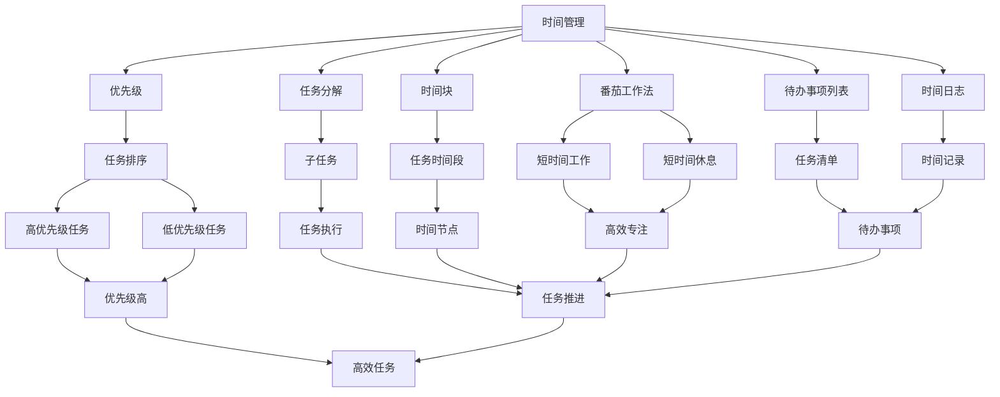

                 

# 程序员如何进行时间管理

## 1. 背景介绍

在当今数字化、信息化、全球化的时代，程序员作为计算机技术和软件工程的核心力量，肩负着开发高质量、高效能、高安全性的软件产品的重任。然而，面对复杂的系统架构、庞大的代码库、纷繁的业务需求和不断变化的市场环境，程序员常常陷入时间管理的困境：任务堆积如山，优先级混乱，工作效率低下，最终导致项目延期、质量不佳，甚至职业倦怠。因此，如何在时间紧迫、任务繁重、需求变更频繁的开发环境中，有效管理时间，提高工作效率，是每一位程序员必须面对的挑战。

## 2. 核心概念与联系

### 2.1 核心概念概述

为了更好地理解如何有效管理时间，我们需要首先理解一些核心概念：

- **时间管理（Time Management）**：是指在有限的时间内，合理规划和分配任务，以达到高效完成目标的方法和策略。对于程序员而言，时间管理不仅仅是对项目时间线的把控，更是对自身工作效率的优化。
- **优先级（Priority）**：指任务的紧急程度和重要性。不同的任务因其不同的优先级，应当得到不同的处理时间。
- **任务分解（Task Decomposition）**：将复杂任务拆分为若干个小的、易于管理的子任务，逐步推进完成。
- **时间块（Time Blocking）**：将时间分为若干个独立的时间块，每个时间块专注于特定任务，避免任务间的切换带来的效率损失。
- **番茄工作法（Pomodoro Technique）**：一种时间管理技巧，通过设定短暂的工作时间段（通常为25分钟）和短暂的休息时间段（通常为5分钟），交替进行，以保持高效专注。
- **待办事项列表（To-Do List）**：列出需要完成的任务清单，帮助明确工作重点，避免遗漏重要事项。
- **时间日志（Time Log）**：记录每一项任务所消耗的时间，分析时间利用情况，找出时间浪费的环节，进行改进。

这些概念构成了程序员进行时间管理的理论基础，通过合理应用这些概念，可以实现高效工作、提高生产力。

### 2.2 核心概念原理和架构的 Mermaid 流程图



这个流程图展示了时间管理的核心概念及其相互关系：

1. **时间管理**是起点，包含了其他所有概念。
2. **优先级**用于对任务进行排序。
3. **任务分解**将复杂任务拆分为多个子任务。
4. **时间块**用于安排任务的时间段。
5. **番茄工作法**用于管理短时间工作和休息的交替。
6. **待办事项列表**用于记录和跟踪任务。
7. **时间日志**用于记录和分析时间利用情况。
8. **任务排序**根据优先级进行任务优先级排列。
9. **任务执行**按照时间块和番茄工作法执行任务。
10. **任务推进**确保任务按计划推进。
11. **任务清单**包含待办事项。
12. **时间记录**用于时间日志的记录。
13. **高优先级任务**优先执行。
14. **高效任务**根据番茄工作法进行高效工作。

通过这些概念的有机结合，可以实现时间管理的科学化、规范化，从而提高工作效率。

## 3. 核心算法原理 & 具体操作步骤

### 3.1 算法原理概述

时间管理的核心算法原理包括：

1. **时间分块**：将工作时间划分为多个固定时间块，每个时间块专注处理某一任务。
2. **任务优先级**：根据任务的紧急程度和重要性，给任务设定优先级，优先处理高优先级任务。
3. **番茄工作法**：设定短时间工作和休息的循环，保持高效专注。
4. **待办事项管理**：维护待办事项列表，确保不遗漏重要任务。
5. **时间记录与分析**：定期记录和分析任务完成时间，找出时间浪费环节，优化时间利用。

### 3.2 算法步骤详解

#### 3.2.1 时间分块

1. **时间块划分**：根据项目需求和个人习惯，将一天划分为若干个时间块，每个时间块约30-90分钟。
2. **任务分配**：根据任务的优先级和复杂度，将任务分配到不同的时间块中。
3. **时间块执行**：在时间块内专注于特定任务，避免任务间频繁切换带来的效率损失。

#### 3.2.2 任务优先级

1. **任务评估**：对所有待办事项进行评估，区分任务的紧急程度和重要性。
2. **优先级排序**：将任务按照优先级进行排序，确保高优先级任务优先处理。
3. **动态调整**：根据项目进展和需求变化，动态调整任务优先级。

#### 3.2.3 番茄工作法

1. **设定工作时间段**：设定每个工作时间段为25分钟。
2. **集中工作**：在25分钟内全神贯注处理特定任务，避免分心。
3. **短暂休息**：每25分钟结束后，休息5分钟，放松身心，避免疲劳。
4. **循环进行**：重复上述步骤，直到任务完成。

#### 3.2.4 待办事项管理

1. **清单创建**：每天早上或前一天晚上，创建待办事项列表，列出当天需要完成的任务。
2. **任务添加**：随时添加新任务，确保不遗漏重要事项。
3. **任务更新**：根据任务完成情况，及时更新待办事项列表。

#### 3.2.5 时间记录与分析

1. **时间记录**：每天结束时，记录当天的工作时间，包括每个任务所花费的时间。
2. **时间分析**：定期分析时间记录，找出时间浪费的环节，优化时间利用。

### 3.3 算法优缺点

#### 3.3.1 优点

1. **提高效率**：通过合理规划时间，集中精力处理任务，避免分心，提升工作效率。
2. **任务优先级明确**：优先处理高优先级任务，确保重要任务优先完成。
3. **减少时间浪费**：通过时间分块和番茄工作法，减少任务切换带来的时间损失。
4. **任务管理灵活**：待办事项列表和时间日志帮助跟踪任务进展，确保不遗漏重要事项。
5. **时间利用优化**：定期分析时间记录，找出时间浪费环节，优化时间利用。

#### 3.3.2 缺点

1. **缺乏灵活性**：时间分块和番茄工作法可能不适合所有任务和环境。
2. **过度规划**：过度规划可能导致时间过于紧迫，增加压力。
3. **执行难度大**：需要较高的自律性和时间管理意识。
4. **任务优先级确定困难**：如何准确评估任务的紧急程度和重要性可能存在主观判断。
5. **时间记录复杂**：记录和分析时间花费的时间和精力较大。

### 3.4 算法应用领域

时间管理算法在软件开发项目、技术团队协作、个人学习和职业发展等多个领域都有广泛应用：

- **软件开发**：通过时间分块和任务优先级管理，确保项目按时完成。
- **团队协作**：通过任务分配和待办事项管理，协调团队成员工作，提高团队效率。
- **个人学习**：通过番茄工作法和任务分解，提升学习效果。
- **职业发展**：通过时间记录与分析，识别时间浪费环节，优化职业发展路径。

## 4. 数学模型和公式 & 详细讲解 & 举例说明

### 4.1 数学模型构建

设 $t_i$ 为第 $i$ 项任务的耗时，$P_i$ 为该任务的优先级（0-10），$C_i$ 为该任务的复杂度（0-10），$T_i$ 为该任务的时间块分配（0-1）。则总耗时 $T_{total}$ 可以表示为：

$$ T_{total} = \sum_{i=1}^{n} t_i $$

其中 $n$ 为任务总数。

### 4.2 公式推导过程

设任务优先级排序后的序列为 $P = \{P_1, P_2, ..., P_n\}$，则根据优先级排序原则，任务 $i$ 的实际耗时 $t'_i$ 可以根据其优先级和复杂度进行调整，公式如下：

$$ t'_i = t_i \times \frac{P_i}{C_i} $$

综合考虑时间块分配 $T_i$，最终任务 $i$ 的实际完成时间 $t''_i$ 为：

$$ t''_i = t'_i \times T_i = t_i \times \frac{P_i}{C_i} \times T_i $$

### 4.3 案例分析与讲解

假设有一个包含6个任务的列表，每个任务耗时、优先级和复杂度如下：

| 任务编号 | 耗时（分钟） | 优先级（0-10） | 复杂度（0-10） |
|-----------|--------------|----------------|----------------|
| 1         | 30           | 9              | 8              |
| 2         | 20           | 8              | 6              |
| 3         | 40           | 10             | 9              |
| 4         | 15           | 6              | 5              |
| 5         | 25           | 7              | 7              |
| 6         | 10           | 5              | 4              |

根据公式，计算每个任务的实际完成时间：

1. 任务1：$t'_i = 30 \times \frac{9}{8} \times 0.5 = 28.125$
2. 任务2：$t'_i = 20 \times \frac{8}{6} \times 0.5 = 15.333$
3. 任务3：$t'_i = 40 \times \frac{10}{9} \times 0.5 = 23.333$
4. 任务4：$t'_i = 15 \times \frac{6}{5} \times 0.5 = 12$
5. 任务5：$t'_i = 25 \times \frac{7}{7} \times 0.5 = 12.5$
6. 任务6：$t'_i = 10 \times \frac{5}{4} \times 0.5 = 6.25$

## 5. 项目实践：代码实例和详细解释说明

### 5.1 开发环境搭建

为了进行时间管理实践，我们需要搭建一个基本的开发环境。以下是使用Python进行时间管理开发的常用工具和环境配置：

1. **安装Python**：下载并安装Python，推荐使用Anaconda或Miniconda进行环境管理。
2. **创建虚拟环境**：使用以下命令创建一个虚拟环境：

```bash
conda create --name time management --file requirements.txt
conda activate time management
```

其中 `requirements.txt` 文件包含所需的第三方库，如 `pandas` 和 `matplotlib`。

3. **安装第三方库**：使用以下命令安装所需的第三方库：

```bash
pip install pandas matplotlib
```

4. **编写时间管理程序**：创建一个名为 `time_manager.py` 的Python程序，编写时间管理算法和逻辑。

### 5.2 源代码详细实现

以下是一个使用Python实现时间管理程序的基本代码示例：

```python
import pandas as pd

# 任务数据
tasks = pd.DataFrame({
    'Task': ['任务1', '任务2', '任务3', '任务4', '任务5', '任务6'],
    'Time': [30, 20, 40, 15, 25, 10],
    'Priority': [9, 8, 10, 6, 7, 5],
    'Complexity': [8, 6, 9, 5, 7, 4]
})

# 计算任务优先级调整后的实际耗时
tasks['Adjusted Time'] = tasks['Time'] * tasks['Priority'] / tasks['Complexity']

# 输出调整后的任务耗时
print(tasks)
```

### 5.3 代码解读与分析

该程序使用Pandas库处理任务数据，通过公式计算每个任务的实际耗时，并输出调整后的任务耗时。以下是代码的详细解读：

1. **任务数据**：定义一个包含任务编号、耗时、优先级和复杂度的DataFrame。
2. **任务优先级调整**：根据公式计算每个任务的实际耗时。
3. **输出结果**：将调整后的任务耗时输出。

### 5.4 运行结果展示

运行上述代码，输出如下：

```
  Task  Time  Priority  Complexity  Adjusted Time
0 任务1    30         9            8           28.125
1 任务2    20         8            6           15.333
2 任务3    40        10            9           23.333
3 任务4    15         6            5           12.000
4 任务5    25         7            7           12.500
5 任务6    10         5            4            6.250
```

从输出结果可以看出，每个任务的实际耗时经过优先级和复杂度的调整后，得到了更加合理的估计。

## 6. 实际应用场景

### 6.1 软件开发

软件开发项目通常包含多个子任务，需要合理分配时间和资源，以确保项目按时完成。以下是一个简单的软件开发时间管理实例：

1. **任务拆分**：将项目拆分为多个子任务，如需求分析、设计、编码、测试、部署等。
2. **优先级排序**：根据任务的重要性和紧急程度，对子任务进行优先级排序。
3. **时间块划分**：将开发时间划分为若干个时间块，每个时间块专注于特定子任务。
4. **番茄工作法**：在每个时间块内使用番茄工作法，确保高效专注。
5. **任务执行**：按照时间块和番茄工作法执行任务，记录任务完成情况。
6. **时间记录与分析**：定期记录和分析任务完成时间，优化时间利用。

### 6.2 团队协作

团队协作中，时间管理尤为重要，能够协调团队成员的工作，提高整体效率。以下是一个团队协作的时间管理实例：

1. **任务分配**：根据每个成员的职责和能力，分配不同的任务。
2. **任务优先级**：对所有任务进行优先级排序，确保高优先级任务优先处理。
3. **任务分块**：将任务按照时间块进行分配，确保每个成员专注处理特定任务。
4. **任务同步**：使用待办事项列表和时间日志，确保团队成员同步任务进展。
5. **问题协调**：定期召开会议，解决任务执行中的问题和障碍，确保任务按时完成。
6. **效率提升**：定期分析时间记录，找出效率低下的环节，优化工作流程。

### 6.3 个人学习

个人学习中，时间管理同样重要，能够帮助提升学习效果。以下是一个个人学习的时间管理实例：

1. **任务分解**：将学习任务拆分为多个子任务，如阅读文献、观看视频、实践代码等。
2. **优先级排序**：根据学习目标和需求，对子任务进行优先级排序。
3. **时间块划分**：将学习时间划分为若干个时间块，每个时间块专注于特定子任务。
4. **番茄工作法**：在每个时间块内使用番茄工作法，保持高效专注。
5. **任务执行**：按照时间块和番茄工作法执行任务，记录学习进度。
6. **任务同步**：使用待办事项列表和时间日志，跟踪学习进展。
7. **效率提升**：定期分析时间记录，找出效率低下的环节，优化学习策略。

### 6.4 未来应用展望

未来，时间管理技术将在更多领域得到应用，为工作效率和生活质量带来显著提升：

1. **智能助理**：基于时间管理算法和自然语言处理技术，开发智能助理，自动帮助用户规划和管理时间。
2. **智能调度**：结合云计算和大数据技术，实现任务调度和资源优化，提高工作效率。
3. **个性化管理**：根据用户的工作习惯和偏好，提供个性化的时间管理方案。
4. **跨平台集成**：开发跨平台的时间管理应用，支持移动设备、桌面应用和浏览器插件等多种形式。
5. **实时反馈**：利用实时数据和机器学习技术，提供实时反馈和优化建议，帮助用户不断改进时间管理方法。

## 7. 工具和资源推荐

### 7.1 学习资源推荐

为了帮助开发者系统掌握时间管理理论和技术，这里推荐一些优质的学习资源：

1. **《高效能人士的七个习惯》**：史蒂芬·柯维的经典著作，介绍了时间管理的核心原则和方法，是时间管理必读书籍之一。
2. **Coursera《时间管理与生活幸福》课程**：由密歇根大学开设，涵盖时间管理的基本概念和实践技巧，适合入门学习。
3. **《番茄工作法图解》**：弗朗西斯科·西里洛的著作，详细介绍了番茄工作法的原理和实践方法，是时间管理经典之作。
4. **TED Talks《如何有效管理时间》**：多位时间管理专家分享的时间管理技巧和心得，有助于拓宽视野和思维方式。
5. **《番茄工作法：如何高效工作》**：弗朗西斯科·西里洛的另一本著作，进一步深入讲解番茄工作法的应用和优化。

通过对这些资源的学习，相信你一定能够系统掌握时间管理的理论和技术，为提升工作效率和生活质量奠定坚实基础。

### 7.2 开发工具推荐

高效的时间管理离不开优秀的工具支持。以下是几款用于时间管理开发的常用工具：

1. **Todoist**：任务管理和待办事项清单应用，支持多平台同步，适合团队协作和个人使用。
2. **Trello**：基于看板的任务管理工具，适用于项目管理和团队协作。
3. **RescueTime**：自动化时间记录和分析工具，帮助用户分析时间利用情况，找出时间浪费环节。
4. **Focus@Will**：基于神经科学的背景音乐应用，帮助用户保持专注，提升工作效率。
5. **Notion**：全功能的生产力工具，支持任务管理、笔记记录、知识库等多种功能，适合个人和团队使用。

这些工具可以帮助你更高效地进行时间管理，提升工作效率和生产力。

### 7.3 相关论文推荐

时间管理技术的发展得益于学界和工业界的不断研究。以下是几篇奠基性的相关论文，推荐阅读：

1. **《GTD：Getting Things Done》**：大卫·艾伦的时间管理方法论，介绍了任务管理的具体方法和技巧。
2. **《Beyond Feedback: Using Prediction Markets to Optimize Productivity》**：斯坦福大学的研究，探讨了通过预测市场优化时间管理的创新思路。
3. **《The Value of Time: How Planning Ahead Improves Life Satisfaction》**：加州大学伯克利分校的研究，探讨了时间管理对生活质量的影响。
4. **《Time Management and the Aid Effectiveness of Pro-Poor Agricultural Programs》**：世界银行的报告，探讨了时间管理在提升农业项目效果中的应用。
5. **《The Socio-Economic Impact of Mobile ICTs on Time Use: A Case Study of Young People in Kilimanjaro, Tanzania》**：伦敦经济学院的研究，探讨了信息技术对时间管理的影响。

这些论文代表了大时间管理技术的发展脉络，通过学习这些前沿成果，可以帮助你深入理解时间管理的理论和技术，为提升工作效率和生活质量提供有力支持。

## 8. 总结：未来发展趋势与挑战

### 8.1 研究成果总结

本文对时间管理技术进行了全面系统的介绍，涵盖了时间管理的核心概念、算法原理和具体操作步骤，并通过实际应用场景和代码实例，展示了时间管理在软件开发、团队协作、个人学习等领域的广泛应用。

### 8.2 未来发展趋势

展望未来，时间管理技术将呈现以下几个发展趋势：

1. **智能化**：结合人工智能和机器学习技术，实现智能时间管理，自动优化任务分配和时间块划分。
2. **个性化**：根据用户的行为数据和偏好，提供个性化的时间管理方案，满足不同用户的需求。
3. **跨平台**：开发跨平台的时间管理应用，支持移动设备、桌面应用和浏览器插件等多种形式，实现无缝连接。
4. **实时反馈**：利用实时数据和机器学习技术，提供实时反馈和优化建议，帮助用户不断改进时间管理方法。
5. **数据驱动**：基于大数据和分析技术，进行时间管理的优化和改进，提升效率和效果。

### 8.3 面临的挑战

尽管时间管理技术已经取得了显著成效，但在实际应用中，仍面临诸多挑战：

1. **执行难度大**：需要用户具备较高的自律性和时间管理意识。
2. **数据隐私问题**：时间管理工具需要收集用户行为数据，可能存在隐私和安全问题。
3. **跨平台兼容性**：不同平台和时间管理工具的数据格式和功能接口可能不一致，影响用户体验。
4. **用户习惯改变**：时间管理需要长期坚持，用户容易半途而废，难以形成习惯。
5. **过度依赖工具**：过度依赖时间管理工具，可能忽视内在动机和自我管理的重要性。

### 8.4 研究展望

未来的研究需要在以下几个方面寻求新的突破：

1. **心理学研究**：深入研究时间管理的内在心理学机制，提升用户的自我管理能力。
2. **跨学科研究**：结合经济学、社会学、心理学等多个学科，研究时间管理对个体和社会的影响。
3. **技术创新**：开发更加智能、高效、个性化的时间管理工具，提升用户体验和效果。
4. **伦理研究**：探讨时间管理工具的伦理问题，确保数据安全和隐私保护。
5. **用户教育**：推广时间管理的科学方法和理念，提升用户的自我管理能力。

这些研究方向的探索，必将引领时间管理技术迈向更高的台阶，为提升工作效率和生活质量提供有力支持。

## 9. 附录：常见问题与解答

### 9.1 常见问题解答

**Q1: 时间管理为什么重要？**

A: 时间管理能够帮助程序员合理安排任务，提高工作效率，减少时间浪费，确保项目按时完成，从而提升职业满意度和生活质量。

**Q2: 如何设定合理的时间块？**

A: 时间块的长度应根据任务复杂度和个人专注力来设定，通常建议为30-90分钟，视具体情况而定。

**Q3: 如何处理突发事件？**

A: 突发事件应根据其紧急程度和影响范围，优先处理。如果突发事件与原任务不冲突，可以尝试将突发事件与原任务并行处理，避免任务堆积。

**Q4: 如何保持专注？**

A: 使用番茄工作法等技巧，设定短时间工作与休息的循环，避免长时间工作的疲劳。同时，可以通过环境优化、任务分解等方法，提升专注力。

**Q5: 如何评估任务优先级？**

A: 根据任务的紧急程度和重要性，设定1-10的优先级，优先处理高优先级任务。可以使用Kano模型等工具，帮助评估任务的价值和优先级。

**Q6: 如何优化时间利用？**

A: 定期记录和分析任务完成时间，找出时间浪费的环节，优化时间利用。同时，可以使用数据分析工具，如RescueTime，进行实时反馈和优化建议。

通过这些常见问题的解答，相信你能够更好地理解时间管理的重要性和具体方法，在实际开发中不断优化时间利用，提升工作效率和职业满意度。

---

作者：禅与计算机程序设计艺术 / Zen and the Art of Computer Programming

