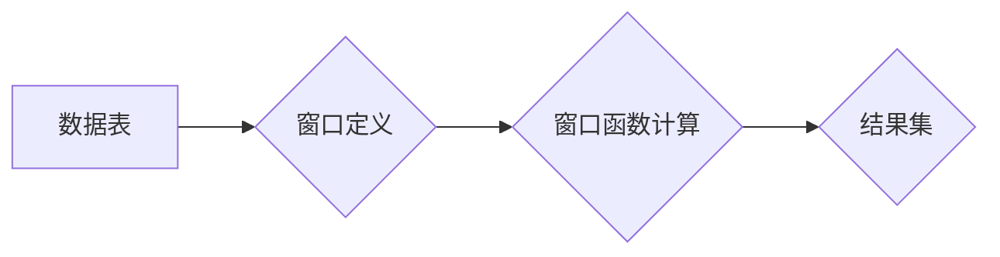

## 窗口函数 原理与代码实例讲解

> 关键词：窗口函数、SQL、数据分析、滑动窗口、聚合函数、数据透视

### 1. 背景介绍

在数据分析领域，我们经常需要对数据进行分组、聚合和排序操作，以获得更深入的洞察。传统的 SQL 聚合函数（如 `SUM`、`AVG`、`COUNT`）只能对整个分组进行操作，无法对分组内的特定子集进行分析。为了解决这一问题，SQL 引入了窗口函数，它允许我们对分组内的子集进行计算，并根据窗口定义的规则进行排序和分组。

窗口函数在数据分析中具有广泛的应用场景，例如：

* **计算滚动平均值:**  例如，分析股票价格的趋势，需要计算过去一定时间段内的平均价格。
* **排名和排序:**  例如，根据销售额对产品进行排名，或者根据考试成绩对学生进行排序。
* **计算累积和:**  例如，计算商品销售的累积总额，或者计算用户注册的累积人数。
* **数据透视:**  例如，根据时间段和地区对销售数据进行分组和汇总。

### 2. 核心概念与联系

窗口函数的核心概念是“窗口”，它定义了一个数据子集，该子集包含了当前行及其相邻行。窗口函数可以对这个窗口内的数据进行计算，并返回每个窗口内的结果。

**窗口函数的组成部分:**

* **窗口函数名称:**  例如 `ROW_NUMBER()`、`RANK()`、`DENSE_RANK()`、`AVG()`、`SUM()` 等。
* **窗口定义:**  使用 `PARTITION BY` 和 `ORDER BY` 子句定义窗口的范围和排序规则。
* **数据列:**  窗口函数操作的数据列。

**Mermaid 流程图:**



### 3. 核心算法原理 & 具体操作步骤

#### 3.1  算法原理概述

窗口函数的计算过程可以概括为以下步骤：

1. **确定窗口:** 根据 `PARTITION BY` 和 `ORDER BY` 子句定义窗口的范围和排序规则。
2. **计算窗口函数:** 对每个窗口内的数据进行计算，例如求平均值、排名等。
3. **返回结果:** 返回每个窗口内的计算结果。

#### 3.2  算法步骤详解

1. **数据分组:** 根据 `PARTITION BY` 子句将数据分组。
2. **数据排序:**  根据 `ORDER BY` 子句对每个分组内的行进行排序。
3. **窗口定义:**  根据窗口函数的类型和 `ROWS` 或 `RANGE` 子句定义窗口的范围。
4. **窗口函数计算:** 对每个窗口内的数据进行计算，并返回每个窗口内的结果。

#### 3.3  算法优缺点

**优点:**

* **灵活:** 可以根据不同的需求定义窗口的范围和排序规则。
* **高效:**  窗口函数的计算过程通常比使用子查询更有效率。
* **简洁:**  窗口函数可以简化 SQL 查询语句，提高代码的可读性和可维护性。

**缺点:**

* **学习曲线:**  窗口函数的概念和语法相对复杂，需要一定的学习时间。
* **性能瓶颈:**  对于大型数据集，窗口函数的计算可能会导致性能瓶颈。

#### 3.4  算法应用领域

窗口函数在数据分析、金融、电商、医疗等领域都有广泛的应用场景，例如：

* **数据分析:** 计算滚动平均值、排名、累积和等。
* **金融:** 计算股票价格的移动平均线、风险评估等。
* **电商:** 计算商品销量排名、用户购买趋势等。
* **医疗:** 计算患者住院时间、疾病发病率等。

### 4. 数学模型和公式 & 详细讲解 & 举例说明

#### 4.1  数学模型构建

窗口函数的数学模型可以抽象为一个滑动窗口，该窗口包含了当前行及其相邻行。窗口函数的计算过程可以看作是对这个滑动窗口内的数据进行聚合操作。

#### 4.2  公式推导过程

窗口函数的具体公式取决于所使用的窗口函数类型。例如，`AVG()` 函数的计算公式如下：

$$
AVG(column) = \frac{\sum_{i=1}^{n} column_i}{n}
$$

其中：

* `column` 是要计算平均值的列。
* `n` 是窗口内数据的个数。
* `column_i` 是窗口内第 i 行的数据。

#### 4.3  案例分析与讲解

假设我们有一个包含股票价格数据的表 `stock_prices`，其中包含 `date`、`price` 两个列。我们想要计算过去 7 天的滚动平均价格。可以使用以下 SQL 查询语句：

```sql
SELECT date, price, AVG(price) OVER (ORDER BY date ASC ROWS BETWEEN 6 PRECEDING AND CURRENT ROW) AS rolling_avg
FROM stock_prices;
```

在这个查询语句中，`AVG(price) OVER (ORDER BY date ASC ROWS BETWEEN 6 PRECEDING AND CURRENT ROW)` 是一个窗口函数，它计算了过去 7 天的平均价格。

* `AVG(price)` 是窗口函数名称。
* `ORDER BY date ASC` 是排序规则，按照日期升序排序。
* `ROWS BETWEEN 6 PRECEDING AND CURRENT ROW` 是窗口定义，定义了一个包含当前行及其前 6 行的数据窗口。

### 5. 项目实践：代码实例和详细解释说明

#### 5.1  开发环境搭建

本示例使用 MySQL 数据库和 Python 语言进行开发。

* **MySQL:** 下载并安装 MySQL 数据库服务器。
* **Python:** 下载并安装 Python 语言环境。
* **MySQL Connector/Python:** 安装 MySQL Connector/Python 库，用于连接 MySQL 数据库。

#### 5.2  源代码详细实现

```python
import mysql.connector

# 连接 MySQL 数据库
mydb = mysql.connector.connect(
  host="localhost",
  user="your_username",
  password="your_password",
  database="your_database"
)

# 创建游标对象
mycursor = mydb.cursor()

# 执行 SQL 查询语句
sql = """
SELECT date, price, AVG(price) OVER (ORDER BY date ASC ROWS BETWEEN 6 PRECEDING AND CURRENT ROW) AS rolling_avg
FROM stock_prices;
"""
mycursor.execute(sql)

# 获取查询结果
results = mycursor.fetchall()

# 打印查询结果
for row in results:
  print(row)

# 关闭数据库连接
mydb.close()
```

#### 5.3  代码解读与分析

1. **连接数据库:** 使用 `mysql.connector.connect()` 函数连接 MySQL 数据库。
2. **创建游标:** 使用 `mydb.cursor()` 函数创建游标对象，用于执行 SQL 查询语句。
3. **执行 SQL 查询:** 使用 `mycursor.execute()` 函数执行 SQL 查询语句。
4. **获取查询结果:** 使用 `mycursor.fetchall()` 函数获取查询结果。
5. **打印查询结果:** 使用循环遍历查询结果，并打印每个结果行。
6. **关闭数据库连接:** 使用 `mydb.close()` 函数关闭数据库连接。

#### 5.4  运行结果展示

运行上述代码后，将输出包含 `date`、`price` 和 `rolling_avg` 三列的数据，其中 `rolling_avg` 列表示过去 7 天的滚动平均价格。

### 6. 实际应用场景

#### 6.1  电商平台

* **商品销量排名:**  根据商品销量计算排名，并展示热门商品。
* **用户购买趋势分析:**  分析用户在不同时间段内的购买行为，例如每天、每周、每月。
* **库存管理:**  根据历史销售数据预测未来库存需求，并进行库存优化。

#### 6.2  金融行业

* **股票价格分析:**  计算股票价格的移动平均线、波动率等指标，进行股票趋势分析。
* **风险评估:**  根据历史数据计算风险指标，评估投资风险。
* **欺诈检测:**  分析用户交易行为，识别异常交易行为，进行欺诈检测。

#### 6.3  医疗行业

* **疾病发病率分析:**  根据时间和地区分析疾病发病率，进行疾病预防和控制。
* **患者住院时间分析:**  分析患者住院时间分布，优化医疗资源配置。
* **医疗费用分析:**  分析不同疾病的医疗费用，进行医疗费用控制。

#### 6.4  未来应用展望

随着数据量的不断增长和分析需求的不断变化，窗口函数将在未来发挥更加重要的作用。例如：

* **实时数据分析:**  窗口函数可以用于对实时数据进行分析，例如监控网站流量、分析社交媒体趋势等。
* **机器学习:**  窗口函数可以作为机器学习算法的输入特征，例如用于预测股票价格、识别语音等。
* **数据可视化:**  窗口函数可以用于生成更直观的图表和数据可视化效果。

### 7. 工具和资源推荐

#### 7.1  学习资源推荐

* **MySQL 官方文档:** https://dev.mysql.com/doc/refman/8.0/en/window-functions.html
* **SQLZoo:** https://sqlzoo.net/
* **W3Schools SQL 教程:** https://www.w3schools.com/sql/

#### 7.2  开发工具推荐

* **MySQL Workbench:** https://dev.mysql.com/downloads/workbench/
* **DataGrip:** https://www.jetbrains.com/datagrip/
* **Dbeaver:** https://dbeaver.io/

#### 7.3  相关论文推荐

* **Window Functions: A Survey**
* **Efficient Window Functions for Data Stream Processing**
* **Window Functions in SQL: A Comprehensive Guide**

### 8. 总结：未来发展趋势与挑战

#### 8.1  研究成果总结

窗口函数是 SQL 中强大的数据分析工具，它可以对分组内的子集进行计算，并根据窗口定义的规则进行排序和分组。窗口函数的应用场景广泛，在数据分析、金融、电商、医疗等领域都有重要作用。

#### 8.2  未来发展趋势

* **更灵活的窗口定义:**  未来窗口函数可能会支持更灵活的窗口定义，例如基于时间间隔、地理位置等条件进行分组。
* **更强大的计算能力:**  未来窗口函数可能会支持更强大的计算能力，例如支持自定义函数、并行计算等。
* **更广泛的应用场景:**  随着数据量的不断增长和分析需求的不断变化，窗口函数将在未来更多领域得到应用。

#### 8.3  面临的挑战

* **性能优化:**  对于大型数据集，窗口函数的计算可能会导致性能瓶颈，需要进一步优化算法和数据结构。
* **易用性提升:**  窗口函数的语法相对复杂，需要进一步简化语法，提高易用性。
* **标准化规范:**  目前不同数据库系统对窗口函数的支持程度不同，需要制定统一的标准规范，促进窗口函数的普及和应用。

#### 8.4  研究展望

未来研究方向包括：

* **开发更高效的窗口函数算法:**  例如基于并行计算、数据压缩等技术的算法。
* **设计更易于使用的窗口函数语法:**  例如使用更直观的语言描述窗口定义。
* **探索窗口函数在新的应用场景中的潜力:**  例如在机器学习、数据可视化等领域。

### 9. 附录：常见问题与解答

**问题 1:**  窗口函数的计算结果如何与原始数据关联？

**答案:**  窗口函数的计算结果会返回一个新的列，该列包含每个窗口内的计算结果。

**问题 2:**  如何定义窗口的范围？

**答案:**  可以使用 `PARTITION BY` 和 `ORDER BY` 子句定义窗口的范围。

* `PARTITION BY` 子句将数据分组。
* `ORDER BY` 子句对每个分组内的行进行排序。

**问题 3:**  窗口函数的性能如何？

**答案:**  窗口函数的性能通常比使用子查询更有效率，但对于大型数据集，可能会导致性能瓶颈。

**问题 4