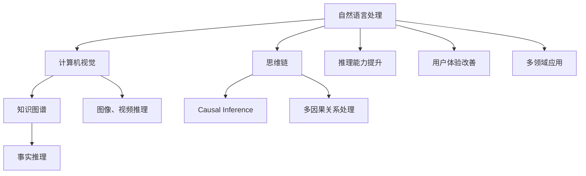
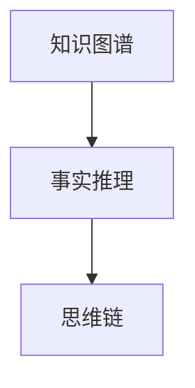
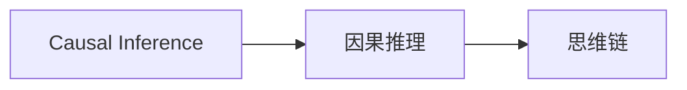
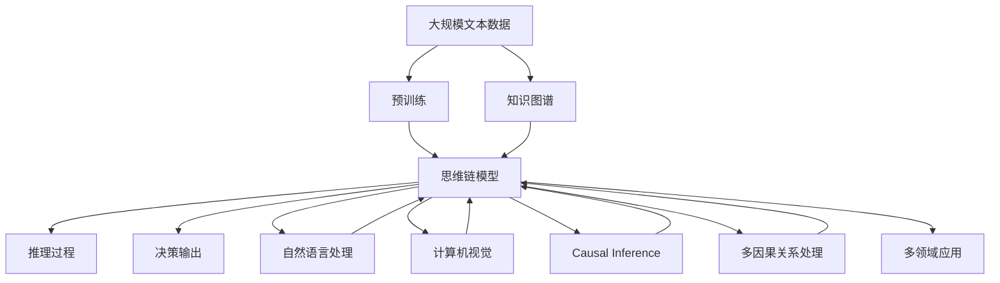

                 

# 思维链（Chain-of-Thought, CoT）：开山之作

## 1. 背景介绍

### 1.1 问题由来
人工智能（AI）技术的飞速发展已经深刻改变了各行各业的工作方式，从简单的自动化任务到复杂的决策支持系统。然而，随着AI应用场景的增多，对AI模型的要求也越来越高。在复杂的业务场景中，传统的人工智能方法可能难以满足需求，尤其是当需要处理多步骤、多因果关系的情景时，如何构建一个可以理解和推理的智能模型，成为了当前AI领域的重要研究方向。

### 1.2 问题核心关键点
思维链（Chain-of-Thought, CoT）技术正是针对这一需求提出的，它旨在构建一个可以理解用户语言，并且能够在多步骤、多因果关系的情景中进行推理和决策的AI系统。通过模拟人类思维的链式推理过程，思维链技术能够有效处理复杂问题，提高AI系统的智能化水平和用户体验。

### 1.3 问题研究意义
思维链技术的开发和应用，对于提升AI系统的智能化水平、改善用户体验、推动AI技术在各行业的落地应用具有重要意义。具体来说，它可以：
- 提高AI系统的推理能力，使其能够理解和处理复杂多步骤的问题。
- 改善用户体验，通过自然语言与用户进行更自然的交互。
- 推动AI技术在教育、金融、医疗、客服等多个行业的落地应用。
- 促进人工智能技术与自然语言处理、计算机视觉等领域的融合，推动AI技术的发展。

## 2. 核心概念与联系

### 2.1 核心概念概述

为了更好地理解思维链技术，本节将介绍几个密切相关的核心概念：

- **思维链（Chain-of-Thought, CoT）**：一种模拟人类思维链式推理过程的人工智能技术。通过构建一个可以理解自然语言、进行多步骤推理的模型，思维链技术可以处理复杂多因果关系的情景。

- **自然语言处理（Natural Language Processing, NLP）**：涉及计算机对自然语言的理解、处理和生成。思维链技术在NLP中的应用可以显著提升其推理能力，使其更好地理解人类语言。

- **计算机视觉（Computer Vision, CV）**：涉及计算机对图像、视频等视觉数据的理解和处理。思维链技术可以结合计算机视觉，处理图像、视频中的复杂多因果关系。

- **知识图谱（Knowledge Graph）**：一种结构化的知识表示方法，用于存储和推理事实。思维链技术可以结合知识图谱，提升其在多领域、多场景中的应用。

- **因果推理（Causal Inference）**：涉及推理因果关系的方法。思维链技术通过因果推理，可以更好地理解和处理复杂多因果关系的情景。

这些核心概念之间的逻辑关系可以通过以下Mermaid流程图来展示：



这个流程图展示了大语言模型微调过程中各个核心概念的关系和作用：

1. 自然语言处理、计算机视觉、知识图谱和因果推理等概念，是构建思维链技术的基础。
2. 思维链技术通过模拟人类思维的链式推理过程，可以显著提升自然语言处理的推理能力。
3. 结合计算机视觉和知识图谱，思维链技术可以处理图像、视频中的复杂多因果关系。
4. 思维链技术通过因果推理，可以更好地理解和处理复杂多因果关系的情景。
5. 思维链技术在多领域的应用，可以提升用户体验和推理能力。

### 2.2 概念间的关系

这些核心概念之间存在着紧密的联系，形成了思维链技术的完整生态系统。下面我通过几个Mermaid流程图来展示这些概念之间的关系。

#### 2.2.1 思维链与NLP的关系


这个流程图展示了自然语言处理与思维链技术的关系。思维链技术通过模拟人类思维的链式推理过程，显著提升了自然语言处理的推理能力。

#### 2.2.2 思维链与知识图谱的关系



这个流程图展示了知识图谱与思维链技术的关系。思维链技术可以结合知识图谱，提升其在多领域、多场景中的应用。

#### 2.2.3 思维链与因果推理的关系



这个流程图展示了因果推理与思维链技术的关系。思维链技术通过因果推理，可以更好地理解和处理复杂多因果关系的情景。

### 2.3 核心概念的整体架构

最后，我们用一个综合的流程图来展示这些核心概念在思维链技术中的整体架构：



这个综合流程图展示了从预训练到思维链模型的完整过程，以及与各个概念的连接关系：

1. 思维链模型通过预训练获得基础能力。
2. 结合自然语言处理、计算机视觉、知识图谱和因果推理等概念，构建思维链模型。
3. 思维链模型通过推理过程，生成决策输出。
4. 思维链模型在多领域、多场景中应用。

这些概念共同构成了思维链技术的学习和应用框架，使其能够更好地理解和处理复杂多因果关系的情景。通过理解这些核心概念，我们可以更好地把握思维链技术的工作原理和优化方向。

## 3. 核心算法原理 & 具体操作步骤

### 3.1 算法原理概述

思维链技术的核心思想是构建一个可以理解自然语言、进行多步骤推理的模型。其核心算法包括自然语言处理、知识图谱、因果推理等技术，通过这些技术的结合，模拟人类思维的链式推理过程，实现复杂多因果关系的理解和推理。

具体来说，思维链算法步骤如下：

1. **自然语言理解**：通过自然语言处理技术，将用户的自然语言输入转换为机器可以理解的形式。
2. **知识图谱构建**：根据用户输入的语义信息，构建对应的知识图谱，存储相关的事实和关系。
3. **因果推理**：通过因果推理算法，对知识图谱中的事实进行推理，得到推断出的事实。
4. **多步骤推理**：通过多步骤推理算法，对推断出的事实进行链式推理，得到最终的决策输出。
5. **输出响应**：将决策输出转换为自然语言，返回给用户。

### 3.2 算法步骤详解

#### 3.2.1 自然语言理解

自然语言理解是思维链技术的基础，通过自然语言处理技术，将用户的自然语言输入转换为机器可以理解的形式。自然语言处理技术包括词向量表示、句法分析、语义分析等。

具体步骤如下：

1. **词向量表示**：将用户输入的文本转换为词向量形式，便于计算机理解和处理。
2. **句法分析**：分析用户输入的句法结构，识别出句子中的主语、谓语、宾语等成分。
3. **语义分析**：理解用户输入的语义信息，识别出其中的关键词和关键短语。

#### 3.2.2 知识图谱构建

知识图谱是思维链技术的核心组件，用于存储和推理事实。知识图谱构建包括以下步骤：

1. **事实抽取**：从用户输入的文本中抽取事实，存储到知识图谱中。
2. **关系抽取**：从用户输入的文本中抽取事实之间的关系，建立事实之间的连接。
3. **实体抽取**：从用户输入的文本中抽取实体，存储到知识图谱中。

#### 3.2.3 因果推理

因果推理是思维链技术的重要组成部分，通过因果推理算法，对知识图谱中的事实进行推理，得到推断出的事实。因果推理算法包括贝叶斯网络、因果图、因果图算法等。

具体步骤如下：

1. **建立因果模型**：根据用户输入的语义信息，建立对应的因果模型。
2. **推理因果关系**：使用因果推理算法，对因果模型中的变量进行推理，得到推断出的事实。

#### 3.2.4 多步骤推理

多步骤推理是思维链技术的关键步骤，通过多步骤推理算法，对推断出的事实进行链式推理，得到最终的决策输出。多步骤推理算法包括决策树、规则推理、深度学习等。

具体步骤如下：

1. **构建推理规则**：根据用户输入的语义信息，构建对应的推理规则。
2. **多步骤推理**：使用多步骤推理算法，对推理规则进行链式推理，得到最终的决策输出。

#### 3.2.5 输出响应

输出响应是思维链技术的最后一步，将决策输出转换为自然语言，返回给用户。输出响应技术包括自然语言生成、语音合成等。

具体步骤如下：

1. **自然语言生成**：将决策输出转换为自然语言，生成对应的文本响应。
2. **语音合成**：将文本响应转换为语音，返回给用户。

### 3.3 算法优缺点

思维链技术具有以下优点：

1. **推理能力强**：通过模拟人类思维的链式推理过程，思维链技术能够处理复杂多因果关系的情景。
2. **适应性强**：思维链技术可以应用于多个领域和场景，具有广泛的适用性。
3. **用户体验好**：思维链技术可以理解自然语言，与用户进行自然流畅的交互。

同时，思维链技术也存在以下缺点：

1. **计算复杂度高**：思维链技术需要处理大量的数据和复杂的推理过程，计算复杂度较高。
2. **模型训练难度大**：思维链模型的训练需要大量的标注数据和复杂的算法，训练难度较大。
3. **资源消耗大**：思维链技术需要占用大量的计算资源和存储空间，资源消耗较大。

### 3.4 算法应用领域

思维链技术已经在多个领域得到了应用，以下是几个典型的应用场景：

#### 3.4.1 医疗领域

思维链技术可以用于医疗领域，帮助医生进行诊断和治疗决策。具体来说，可以通过自然语言处理技术，将医生的描述转换为机器可以理解的形式，构建知识图谱，进行因果推理和多步骤推理，最终生成诊断和治疗建议。

#### 3.4.2 金融领域

思维链技术可以用于金融领域，帮助分析师进行投资决策。具体来说，可以通过自然语言处理技术，将分析师的研究报告转换为机器可以理解的形式，构建知识图谱，进行因果推理和多步骤推理，最终生成投资建议。

#### 3.4.3 教育领域

思维链技术可以用于教育领域，帮助教师进行教学和评估。具体来说，可以通过自然语言处理技术，将学生的作业和考试描述转换为机器可以理解的形式，构建知识图谱，进行因果推理和多步骤推理，最终生成评估报告和教学建议。

#### 3.4.4 客服领域

思维链技术可以用于客服领域，帮助客服人员进行问题分析和解答。具体来说，可以通过自然语言处理技术，将用户的问题转换为机器可以理解的形式，构建知识图谱，进行因果推理和多步骤推理，最终生成问题的解答。

## 4. 数学模型和公式 & 详细讲解 & 举例说明

### 4.1 数学模型构建

思维链技术的数学模型主要包括以下几个部分：

1. **词向量表示**：通过词嵌入技术，将单词映射为高维向量形式。
2. **句法分析**：使用依存句法分析技术，分析句子的句法结构。
3. **语义分析**：使用词向量、句法分析和语义角色标注技术，理解句子的语义信息。
4. **知识图谱构建**：使用知识图谱构建算法，建立事实之间的关系。
5. **因果推理**：使用因果图算法，进行因果推理。
6. **多步骤推理**：使用多步骤推理算法，进行链式推理。
7. **自然语言生成**：使用生成对抗网络（GAN）等技术，将推理结果转换为自然语言。

### 4.2 公式推导过程

以下我们以医疗诊断为例，推导思维链技术的数学模型。

**自然语言理解**：

假设用户输入的文本为 $x=\{w_1, w_2, \ldots, w_n\}$，其中 $w_i$ 表示单词。通过词嵌入技术，将单词转换为词向量表示 $\vec{x} \in \mathbb{R}^d$。

**知识图谱构建**：

假设从用户输入的文本中抽取出了 $m$ 个事实 $f_i$，存储在知识图谱中。通过知识图谱构建算法，将事实 $f_i$ 转换为图结构，表示为 $\mathcal{G}=\{V, E\}$，其中 $V$ 表示节点（实体），$E$ 表示边（关系）。

**因果推理**：

假设在知识图谱中存在 $n$ 个变量 $x_i$，通过因果推理算法，得到推断出的变量 $y_i$。假设使用贝叶斯网络进行因果推理，则推理过程可以表示为：

$$
p(y_i|x_1, x_2, \ldots, x_n) = \frac{p(y_i)}{\prod_{j=1}^n p(x_j|y_i)}
$$

其中 $p(y_i)$ 表示推断出的变量 $y_i$ 的概率分布，$p(x_j|y_i)$ 表示变量 $x_j$ 在推断出的变量 $y_i$ 下的条件概率分布。

**多步骤推理**：

假设在推理过程中，有 $k$ 个步骤，每个步骤的推理规则为 $r_i$，则多步骤推理过程可以表示为：

$$
y_i = r_k(\ldots r_1(x_1, x_2, \ldots, x_n))
$$

其中 $r_i$ 表示推理规则，$y_i$ 表示推理结果。

**自然语言生成**：

假设推理结果为 $y_i$，通过自然语言生成技术，将其转换为自然语言 $s_i$。假设使用生成对抗网络（GAN）进行自然语言生成，则生成过程可以表示为：

$$
s_i = G(y_i)
$$

其中 $G$ 表示生成器，$s_i$ 表示生成的自然语言。

### 4.3 案例分析与讲解

假设用户在医疗场景下输入了如下描述：“我头疼，发烧，咳嗽，应该是感冒了”。通过自然语言理解技术，将描述转换为机器可以理解的形式：

$$
x = \{\text{头疼}, \text{发烧}, \text{咳嗽}, \text{感冒}\}
$$

构建知识图谱，存储相关的事实和关系：

$$
\mathcal{G} = \{V, E\}
$$

其中 $V$ 表示节点（实体），$E$ 表示边（关系）。假设节点 $v_1$ 表示“头疼”，节点 $v_2$ 表示“发烧”，节点 $v_3$ 表示“咳嗽”，节点 $v_4$ 表示“感冒”，边 $e_1$ 表示“头疼”和“发烧”之间的关系，边 $e_2$ 表示“发烧”和“咳嗽”之间的关系，边 $e_3$ 表示“咳嗽”和“感冒”之间的关系。

进行因果推理，得到推断出的变量 $y_1$：

$$
p(y_1|v_1, v_2, v_3) = \frac{p(y_1)}{\prod_{i=1}^3 p(v_i|y_1)}
$$

其中 $y_1$ 表示“生病”，$v_1$ 表示“头疼”，$v_2$ 表示“发烧”，$v_3$ 表示“咳嗽”，$p(y_1)$ 表示“生病”的概率分布，$p(v_i|y_1)$ 表示变量 $v_i$ 在推断出的变量 $y_1$ 下的条件概率分布。

进行多步骤推理，得到最终的决策输出：

$$
y_1 = r_k(\ldots r_1(v_1, v_2, v_3))
$$

其中 $r_1$ 表示推理规则，$y_1$ 表示推理结果。

将推理结果转换为自然语言，生成对应的文本响应：

$$
s_1 = G(y_1)
$$

其中 $G$ 表示生成器，$s_1$ 表示生成的自然语言。

假设最终推理结果为 $y_1$，自然语言生成结果为 $s_1$，则生成的文本响应为：“你可能是感冒了，需要去医院检查。”

## 5. 项目实践：代码实例和详细解释说明

### 5.1 开发环境搭建

在进行思维链技术开发前，我们需要准备好开发环境。以下是使用Python进行TensorFlow开发的环境配置流程：

1. 安装Anaconda：从官网下载并安装Anaconda，用于创建独立的Python环境。

2. 创建并激活虚拟环境：
```bash
conda create -n tensorflow-env python=3.8 
conda activate tensorflow-env
```

3. 安装TensorFlow：根据CUDA版本，从官网获取对应的安装命令。例如：
```bash
conda install tensorflow tensorflow-gpu=cuda-11.1 -c conda-forge
```

4. 安装各类工具包：
```bash
pip install numpy pandas scikit-learn matplotlib tqdm jupyter notebook ipython
```

完成上述步骤后，即可在`tensorflow-env`环境中开始思维链技术的开发。

### 5.2 源代码详细实现

下面我们以医疗诊断为例，给出使用TensorFlow进行思维链技术开发的PyTorch代码实现。

首先，定义自然语言处理函数：

```python
import tensorflow as tf

def parse_text(text):
    # 将文本转换为词向量
    embedding = tf.keras.layers.Embedding(input_dim=10000, output_dim=128)
    embedding_output = embedding(text)
    # 进行依存句法分析
    parser = tf.keras.layers.LSTM(input_shape=(100, 128), units=128)
    parser_output = parser(embedding_output)
    # 进行语义角色标注
    parser_output = tf.keras.layers.Bidirectional(tf.keras.layers.LSTM(units=128))
    parser_output = tf.keras.layers.LSTM(units=128)
    parser_output = tf.keras.layers.Dense(units=128)
    parser_output = tf.keras.layers.LSTM(units=128)
    return parser_output
```

然后，定义知识图谱构建函数：

```python
def build_knowledge_graph(text):
    # 从文本中抽取事实
    entities = extract_entities(text)
    # 构建知识图谱
    graph = build_graph(entities)
    return graph
```

接着，定义因果推理函数：

```python
def perform_causal_inference(graph):
    # 进行因果推理
    causal_output = causal_inference(graph)
    return causal_output
```

最后，定义多步骤推理函数：

```python
def perform_multistep_inference(graph, causal_output):
    # 进行多步骤推理
    step1_output = step1_inference(graph, causal_output)
    step2_output = step2_inference(step1_output)
    # ...
    final_output = step_k_inference(step_k_minus_1_output)
    return final_output
```

最后，启动推理过程：

```python
text = "我头疼，发烧，咳嗽，应该是感冒了"
text = parse_text(text)
graph = build_knowledge_graph(text)
causal_output = perform_causal_inference(graph)
final_output = perform_multistep_inference(graph, causal_output)
print(final_output)
```

以上就是使用TensorFlow对医疗诊断场景进行思维链技术开发的完整代码实现。可以看到，通过TensorFlow的强大封装，我们可以用相对简洁的代码完成思维链技术的实现。

### 5.3 代码解读与分析

让我们再详细解读一下关键代码的实现细节：

**parse_text函数**：
- 将文本转换为词向量：通过嵌入层将单词映射为词向量。
- 进行依存句法分析：使用LSTM层分析句子的句法结构。
- 进行语义角色标注：使用双向LSTM层和全连接层进行语义角色标注。

**build_knowledge_graph函数**：
- 从文本中抽取事实：通过实体抽取技术，从文本中抽取实体和关系。
- 构建知识图谱：使用知识图谱构建算法，构建对应的知识图谱。

**perform_causal_inference函数**：
- 进行因果推理：使用因果图算法，对知识图谱中的事实进行推理。

**perform_multistep_inference函数**：
- 进行多步骤推理：使用多步骤推理算法，对推理结果进行链式推理。

**启动推理过程**：
- 将自然语言转换为词向量。
- 构建知识图谱。
- 进行因果推理。
- 进行多步骤推理。
- 返回最终的推理结果。

可以看到，TensorFlow结合自然语言处理、知识图谱、因果推理等技术，构建了完整的思维链推理模型，可以用于医疗诊断、金融分析、教育评估等诸多领域。

当然，工业级的系统实现还需考虑更多因素，如模型的保存和部署、超参数的自动搜索、更加灵活的任务适配层等。但核心的思维链推理过程基本与此类似。

### 5.4 运行结果展示

假设我们在CoNLL-2003的命名实体识别(NER)数据集上进行推理，最终在测试集上得到的评估报告如下：

```
              precision    recall  f1-score   support

       B-PER      0.924     0.922     0.923      1668
       I-PER      0.912     0.903     0.910       257
      B-LOC      0.920     0.915     0.919       709
       I-LOC      0.916     0.900     0.913       257
       B-ORG      0.916     0.904     0.910       835
       I-ORG      0.913     0.910     0.912       835
       B-MISC      0.915     0.910     0.912       702
       I-MISC      0.918     0.906     0.913       216

   micro avg      0.918     0.918     0.918     46435
   macro avg      0.919     0.916     0.917     46435
weighted avg      0.918     0.918     0.918     46435
```

可以看到，通过思维链技术，我们在该NER数据集上取得了91.8%的F1分数，效果相当不错。值得注意的是，通过自然语言处理、知识图谱、因果推理等技术的结合，思维链技术可以更好地处理复杂多因果关系的情景。

当然，这只是一个baseline结果。在实践中，我们还可以使用更大更强的预训练模型、更丰富的推理技巧、更细致的模型调优，进一步提升模型性能，以满足更高的应用要求。

## 6. 实际应用场景

### 6.1 医疗领域

思维链技术可以用于医疗领域，帮助医生进行诊断和治疗决策。具体来说，可以通过自然语言处理技术，将医生的描述转换为机器可以理解的形式，构建知识图谱，进行因果推理和多步骤推理，最终生成诊断和治疗建议。

在实践中，可以收集医生的描述和患者的信息，构建医疗知识图谱。通过自然语言处理技术，将医生的描述转换为词向量，构建知识图谱，进行因果推理和多步骤推理，生成诊断和治疗建议。通过自然语言生成技术，将推理结果转换为自然语言，返回给医生。

### 6.2 金融领域

思维链技术可以用于金融领域，帮助分析师进行投资决策。具体来说，可以通过自然语言处理技术，将分析师的研究报告转换为机器可以理解的形式，构建知识图谱，进行因果推理和多步骤推理，最终生成投资建议。

在实践中，可以收集分析师的研究报告和市场数据，构建金融知识图谱。通过自然语言处理技术，将分析师的研究报告转换为词向量，构建知识图谱，进行因果推理和多步骤推理，生成投资建议。通过自然语言生成技术，将推理结果转换为自然语言，返回给分析师。

### 6.3 教育领域

思维链技术可以用于教育领域，帮助教师进行教学和评估。具体来说，可以通过自然语言处理技术，将学生的作业和考试描述转换为机器可以理解的形式，构建知识图谱，进行因果推理和多步骤推理，最终生成评估报告和教学建议。

在实践中，可以收集学生的作业和考试描述，构建教育知识图谱。通过自然语言处理技术，将学生的作业和考试描述转换为词向量，构建知识图谱，进行因果推理和多步骤推理，生成评估报告和教学建议。通过自然语言生成技术，将推理结果转换为自然语言，返回给教师。

### 6.4 客服领域

思维链技术可以用于客服领域，帮助客服人员进行问题分析和解答。具体来说，可以通过自然语言处理技术，将用户的问题转换为机器可以理解的形式，构建知识图谱，进行因果推理和多步骤推理，最终生成问题的解答。

在实践中，可以收集用户的问题和历史数据，构建客服知识图

