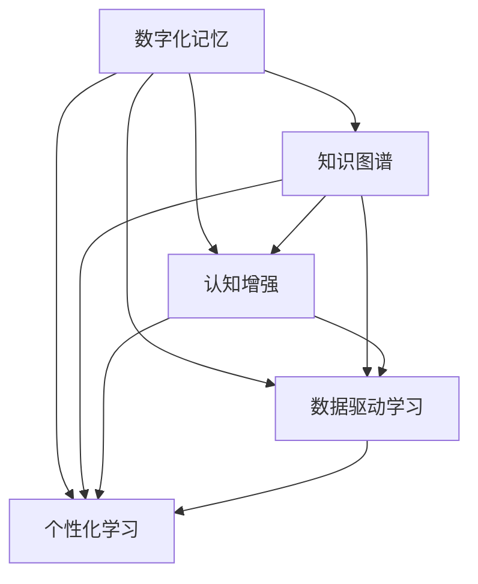
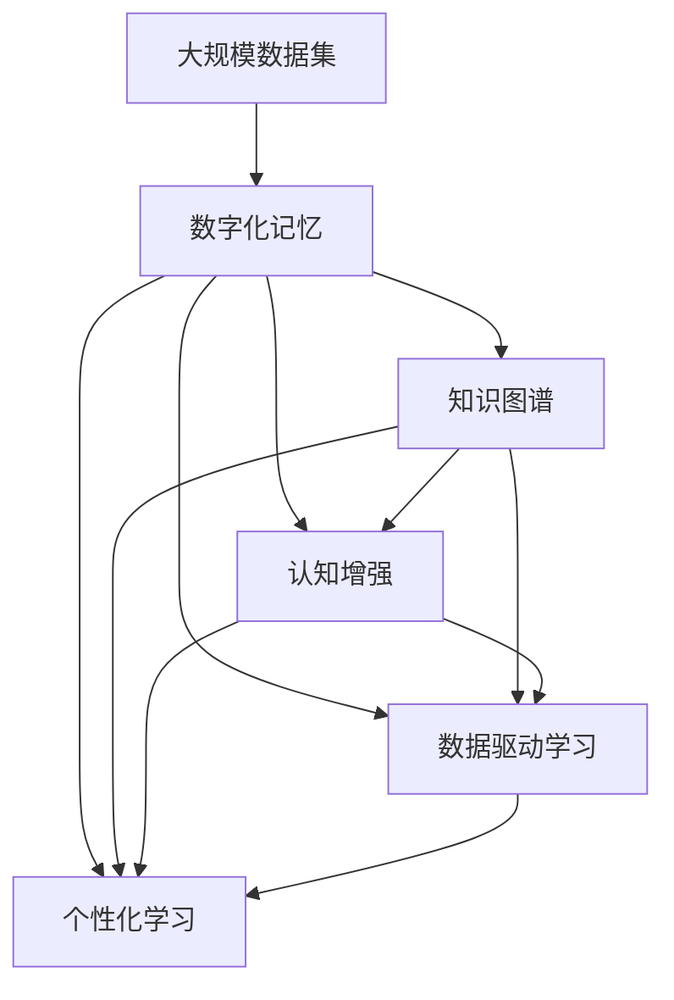

                 

# 数字化记忆：全球脑时代的知识传承

> 关键词：数字化记忆, 知识传承, 认知增强, 数据驱动学习, 个性化学习

## 1. 背景介绍

### 1.1 问题由来
在数字化时代，人类面临着前所未有的信息爆炸。从文字到图片，从音频到视频，从静态数据到实时数据，各类信息形态不断涌现。然而，面对海量信息的浪潮，人类的记忆力和理解能力显得捉襟见肘。传统的记忆方式已经难以适应现代知识生产与传播的需求，迫切需要新的解决方案。数字化记忆技术的崛起，为人类知识的传承和扩展提供了全新的路径。

数字化记忆技术，本质上是一种利用数字技术手段，将人类知识系统化和结构化的过程。其核心在于通过数据化、结构化、可视化的方式，帮助人们更好地存储、检索、理解和应用知识。数字化记忆不仅能够提升个人学习效率，还能促进知识的社会化传播，推动社会的创新发展。

### 1.2 问题核心关键点
数字化记忆技术的核心在于将知识进行数字化编码，通过算法和技术的力量，进行高效存储和检索。其核心关键点包括：

1. **数据化**：将知识以数字化的方式进行编码，转化为计算机可以处理的格式。
2. **结构化**：构建知识图谱，将知识以结构化的方式进行组织，便于查询和理解。
3. **可视化**：通过图表、动画、交互界面等方式，直观地展示知识结构。
4. **智能化**：利用机器学习算法，进行知识推荐和个性化学习。
5. **可扩展性**：支持动态更新，适应不断变化的知识体系。

### 1.3 问题研究意义
数字化记忆技术的研究意义在于：

1. **提升学习效率**：通过结构化和智能化的知识体系，帮助学习者高效掌握知识。
2. **促进知识传播**：数字化记忆技术使得知识的获取和传播更加便捷，加速知识的社会化。
3. **推动社会创新**：数字化记忆不仅能够提升个人学习，还能促进跨学科知识的融合和创新。
4. **应对信息爆炸**：面对海量的信息，数字化记忆技术能够帮助人们快速定位和应用知识。
5. **构建知识图谱**：通过数字化记忆技术，构建知识图谱，帮助人类理解复杂的知识体系。

## 2. 核心概念与联系

### 2.1 核心概念概述

为更好地理解数字化记忆技术，本节将介绍几个密切相关的核心概念：

- **数字化记忆(Digital Memory)**：指利用数字技术手段，将知识以结构化、可视化的方式进行存储和传播。
- **知识图谱(Knowledge Graph)**：一种以图结构表示知识的方式，节点表示实体，边表示实体之间的关系。
- **认知增强(Cognitive Enhancement)**：通过数字化记忆技术，增强人类的认知能力，提升学习效率。
- **数据驱动学习(Data-Driven Learning)**：基于大数据和机器学习算法，进行个性化和智能化的知识推荐。
- **个性化学习(Personalized Learning)**：根据学习者的背景、兴趣和需求，定制个性化的学习路径。

这些核心概念之间存在着紧密的联系，形成了数字化记忆技术的完整生态系统。以下通过几个Mermaid流程图来展示这些概念之间的关系：



这个流程图展示了几大核心概念之间的关系：

1. 数字化记忆通过知识图谱将知识结构化。
2. 认知增强利用结构化的知识体系，提升学习效率。
3. 数据驱动学习基于数字化记忆中的数据，进行智能化的知识推荐。
4. 个性化学习通过认知增强和数据驱动学习，定制个性化的学习路径。

### 2.2 概念间的关系

这些核心概念之间存在着紧密的联系，形成了数字化记忆技术的完整生态系统。以下通过几个Mermaid流程图来展示这些概念之间的关系。

#### 2.2.1 数字化记忆的学习范式


这个流程图展示了数字化记忆的基本原理，以及其与认知增强、数据驱动学习和个性化学习的关系。

#### 2.2.2 知识图谱的结构化设计

```mermaid
graph LR
    A[实体(Entity)] --> B[关系(Relationship)]
    A --> C[节点(Node)]
    B --> D[边(Edge)]
    C --> D
```

这个流程图展示了知识图谱的基本结构，节点表示实体，边表示实体之间的关系。

#### 2.2.3 认知增强的智能学习

```mermaid
graph TB
    A[Cognitive Enhancement] --> B[认知模型(Cognitive Model)]
    A --> C[知识图谱(Knowledge Graph)]
    B --> D[学习路径(Learning Path)]
    C --> D
```

这个流程图展示了认知增强的智能学习过程，通过认知模型和知识图谱，定制个性化的学习路径。

### 2.3 核心概念的整体架构

最后，我们用一个综合的流程图来展示这些核心概念在大数据记忆技术中的整体架构：



这个综合流程图展示了从数据集到数字化记忆，再到知识图谱、认知增强、数据驱动学习和个性化学习，完整的数据驱动记忆过程。通过这些流程，我们能够更好地理解数字化记忆技术的核心概念和应用架构。

## 3. 核心算法原理 & 具体操作步骤
### 3.1 算法原理概述

数字化记忆技术的核心算法，包括知识图谱的构建、认知增强的智能学习和数据驱动的个性化推荐。这些算法共同构成了数字化记忆的完整系统。

#### 3.1.1 知识图谱的构建

知识图谱的构建是数字化记忆技术的核心。知识图谱通过将知识表示为节点和边，形成结构化的知识体系。构建知识图谱的步骤如下：

1. **知识抽取**：从结构化数据或非结构化数据中提取实体和关系，生成初始的知识图谱。
2. **知识融合**：将多个数据源的知识图谱进行融合，形成更加全面和准确的图谱。
3. **知识修正**：通过人工校验和算法优化，修正知识图谱中的错误和不足。

#### 3.1.2 认知增强的智能学习

认知增强的智能学习过程，基于知识图谱和认知模型，进行个性化学习。其核心步骤如下：

1. **学习路径设计**：根据学习者的背景和兴趣，设计个性化的学习路径。
2. **学习效果评估**：通过认知模型评估学习者的理解程度和掌握情况，动态调整学习路径。
3. **学习资源推荐**：基于学习者的状态和需求，推荐合适的学习资源和知识节点。

#### 3.1.3 数据驱动的个性化推荐

数据驱动的个性化推荐过程，基于数字化记忆中的大量数据，进行智能化的知识推荐。其核心步骤如下：

1. **数据预处理**：对知识图谱中的数据进行预处理和清洗，去除噪声和冗余。
2. **推荐算法设计**：选择适合的推荐算法，如协同过滤、基于内容的推荐、基于图的推荐等。
3. **推荐效果优化**：通过调整推荐算法的参数和策略，优化推荐效果，提高用户满意度。

### 3.2 算法步骤详解

#### 3.2.1 知识图谱的构建

**Step 1: 数据收集与预处理**
- 收集结构化数据（如数据库、数据表）和非结构化数据（如文本、图片、视频）。
- 对非结构化数据进行预处理，如分词、实体识别、关系抽取等。
- 清洗和合并数据源，形成一致的知识图谱。

**Step 2: 知识抽取**
- 使用自然语言处理（NLP）技术，从文本中抽取实体和关系。
- 使用图像识别和视频分析技术，从视觉数据中抽取实体和关系。
- 将抽取的实体和关系，映射到知识图谱中。

**Step 3: 知识融合**
- 使用规则和算法，将多个数据源的知识图谱进行融合。
- 使用图谱对齐技术，确保不同来源的知识节点和关系一致。
- 构建更加全面和准确的综合知识图谱。

**Step 4: 知识修正**
- 人工校验知识图谱，确保数据准确性和完整性。
- 使用算法优化知识图谱，提高其质量和效率。
- 定期更新和维护知识图谱，保持其时效性。

#### 3.2.2 认知增强的智能学习

**Step 1: 学习路径设计**
- 根据学习者的背景、兴趣和需求，设计个性化的学习路径。
- 使用机器学习算法，预测学习者的学习效果和兴趣。
- 动态调整学习路径，确保其针对性和有效性。

**Step 2: 学习效果评估**
- 使用认知模型评估学习者的理解程度和掌握情况。
- 通过学习者反馈和评估结果，调整学习路径和资源。
- 确保学习者能够在规定时间内掌握所需知识。

**Step 3: 学习资源推荐**
- 根据学习者的状态和需求，推荐合适的学习资源和知识节点。
- 使用协同过滤和基于内容的推荐算法，提升推荐效果。
- 实时更新推荐结果，提高学习者的满意度。

#### 3.2.3 数据驱动的个性化推荐

**Step 1: 数据预处理**
- 对知识图谱中的数据进行预处理和清洗，去除噪声和冗余。
- 使用数据融合技术，合并不同来源的知识信息。
- 优化数据结构，便于推荐算法的应用。

**Step 2: 推荐算法设计**
- 选择合适的推荐算法，如协同过滤、基于内容的推荐、基于图的推荐等。
- 设计推荐模型，根据用户行为和偏好，进行知识推荐。
- 训练推荐模型，提高其准确性和泛化能力。

**Step 3: 推荐效果优化**
- 通过A/B测试和用户反馈，评估推荐效果。
- 调整推荐算法参数和策略，优化推荐结果。
- 定期更新推荐算法，适应不断变化的用户需求。

### 3.3 算法优缺点

数字化记忆技术的核心算法，即知识图谱的构建、认知增强的智能学习和数据驱动的个性化推荐，具有以下优缺点：

#### 优点

1. **全面性和准确性**：通过结构化知识图谱，提供全面和准确的知识体系。
2. **智能化和个性化**：基于机器学习算法，实现智能化和个性化的学习路径和资源推荐。
3. **高效性和可扩展性**：利用算法优化和分布式计算，实现高效的知识管理和检索。
4. **可视化和方法论**：通过图表和动画，直观展示知识结构，提高理解和学习效率。

#### 缺点

1. **数据依赖性强**：知识图谱的质量依赖于数据的质量和完整性。
2. **复杂性和难度高**：知识图谱和推荐算法的设计和优化，需要专业知识和技术积累。
3. **隐私和安全问题**：知识图谱中的数据涉及个人隐私，需要严格的保护措施。
4. **成本高昂**：构建和维护知识图谱，需要大量资源和成本。

### 3.4 算法应用领域

数字化记忆技术在多个领域具有广泛的应用前景，包括但不限于：

- **教育领域**：通过个性化学习路径和推荐，提升学生的学习效率和效果。
- **医疗领域**：通过知识图谱和推荐，提供医疗知识支持和决策辅助。
- **金融领域**：通过金融知识图谱和推荐，提升金融决策的准确性和效率。
- **科研领域**：通过科研知识图谱和推荐，加速科学研究的进展和创新。
- **企业领域**：通过企业知识图谱和推荐，提升知识管理和员工培训效果。

## 4. 数学模型和公式 & 详细讲解 & 举例说明
### 4.1 数学模型构建

数字化记忆技术涉及多个数学模型和算法，包括知识图谱的构建、认知增强的学习路径设计、数据驱动的推荐算法等。以下详细介绍这些模型的构建和应用。

#### 4.1.1 知识图谱的数学模型

知识图谱通过图结构表示知识，其中节点表示实体，边表示实体之间的关系。其数学模型为：

$$
G = (V, E)
$$

其中，$V$ 表示实体节点集合，$E$ 表示关系边集合。边 $e \in E$ 可以表示为 $(e_{s}, e_{o}, r)$，其中 $e_{s}$ 和 $e_{o}$ 分别表示边的起始和结束实体，$r$ 表示边的关系类型。

#### 4.1.2 认知增强的数学模型

认知增强的数学模型，包括学习路径设计和效果评估。其核心数学模型为：

$$
\begin{aligned}
&\min_{\mathbf{p}} \sum_{i=1}^n (\mathbf{c}_i - \mathbf{w}^T \mathbf{p})^2 \\
&\text{s.t.} \quad \mathbf{p} \in [0, 1]^n, \quad \sum_{i=1}^n p_i = 1
\end{aligned}
$$

其中，$\mathbf{p}$ 表示学习路径的概率分布向量，$\mathbf{c}_i$ 表示学习者对知识点的掌握程度，$\mathbf{w}$ 表示学习路径的权重向量，$n$ 表示知识点的数量。

#### 4.1.3 推荐算法的数学模型

推荐算法的数学模型，包括协同过滤、基于内容的推荐和基于图的推荐等。以下以协同过滤为例：

$$
\mathbf{I} = \mathbf{U}\mathbf{V}^T
$$

其中，$\mathbf{I}$ 表示用户-物品交互矩阵，$\mathbf{U}$ 表示用户特征矩阵，$\mathbf{V}$ 表示物品特征矩阵。协同过滤通过相似度计算，找到相似用户和物品，进行推荐。

### 4.2 公式推导过程

#### 4.2.1 知识图谱的构建公式推导

知识图谱的构建主要涉及实体抽取、关系抽取和图谱融合等步骤。以下以实体抽取为例，推导其实体抽取的公式：

1. **实体抽取公式**

$$
r = \mathbf{F}(\mathbf{X}, \mathbf{W})
$$

其中，$r$ 表示实体抽取结果，$\mathbf{X}$ 表示文本特征向量，$\mathbf{W}$ 表示实体抽取的权重矩阵。实体抽取的过程可以理解为，将文本特征向量通过权重矩阵投影到实体空间中，找到最可能的实体位置。

2. **关系抽取公式**

$$
r = \mathbf{F}(\mathbf{X}, \mathbf{W})
$$

其中，$r$ 表示关系抽取结果，$\mathbf{X}$ 表示文本特征向量，$\mathbf{W}$ 表示关系抽取的权重矩阵。关系抽取的过程可以理解为，将文本特征向量通过权重矩阵投影到关系空间中，找到最可能的关系类型。

3. **图谱融合公式**

$$
G = \mathbf{F}(G_1, G_2, \ldots, G_k)
$$

其中，$G$ 表示融合后的知识图谱，$G_1, G_2, \ldots, G_k$ 表示不同来源的知识图谱。图谱融合的过程可以理解为，将多个图谱进行叠加和合并，生成更加全面和准确的知识图谱。

#### 4.2.2 认知增强的智能学习公式推导

认知增强的智能学习主要涉及学习路径设计和效果评估等步骤。以下以学习路径设计为例，推导其实例公式：

1. **学习路径设计公式**

$$
\mathbf{p} = \mathbf{F}(\mathbf{c}, \mathbf{w})
$$

其中，$\mathbf{p}$ 表示学习路径的概率分布向量，$\mathbf{c}$ 表示学习者的掌握程度向量，$\mathbf{w}$ 表示学习路径的权重向量。学习路径的设计过程可以理解为，将学习者的掌握程度向量通过权重向量投影到学习路径空间中，找到最可能的学习路径。

2. **效果评估公式**

$$
\mathbf{c} = \mathbf{F}(\mathbf{p}, \mathbf{w})
$$

其中，$\mathbf{c}$ 表示学习者的掌握程度向量，$\mathbf{p}$ 表示学习路径的概率分布向量，$\mathbf{w}$ 表示评估模型的权重向量。效果评估的过程可以理解为，将学习路径的概率分布向量通过权重向量投影到掌握程度向量中，找到最可能的学习者掌握程度。

#### 4.2.3 数据驱动的个性化推荐公式推导

数据驱动的个性化推荐主要涉及推荐算法和效果优化等步骤。以下以协同过滤为例，推导其实例公式：

1. **协同过滤公式**

$$
\mathbf{I} = \mathbf{U}\mathbf{V}^T
$$

其中，$\mathbf{I}$ 表示用户-物品交互矩阵，$\mathbf{U}$ 表示用户特征矩阵，$\mathbf{V}$ 表示物品特征矩阵。协同过滤的过程可以理解为，通过相似度计算，找到相似用户和物品，进行推荐。

2. **推荐效果优化公式**

$$
\mathbf{U} = \mathbf{F}(\mathbf{I}, \mathbf{V})
$$

其中，$\mathbf{U}$ 表示用户特征矩阵，$\mathbf{I}$ 表示用户-物品交互矩阵，$\mathbf{V}$ 表示物品特征矩阵。推荐效果优化的过程可以理解为，通过算法优化，提高推荐结果的准确性和泛化能力。

### 4.3 案例分析与讲解

#### 4.3.1 知识图谱构建案例

以某大学图书馆为例，构建其知识图谱。步骤如下：

1. **数据收集与预处理**
   - 收集图书馆的纸质书籍、电子书籍、期刊论文等数据。
   - 对非结构化数据进行预处理，如分词、实体识别、关系抽取等。

2. **知识抽取**
   - 使用NLP技术，从书籍和论文中抽取实体和关系。
   - 使用图像识别技术，从封面和图表中抽取实体和关系。

3. **知识融合**
   - 将纸质书籍和电子书籍的知识图谱进行融合。
   - 将不同来源的知识图谱进行对齐和合并。

4. **知识修正**
   - 人工校验知识图谱，确保数据准确性和完整性。
   - 使用算法优化知识图谱，提高其质量和效率。

最终得到的图书馆知识图谱，包含书籍、作者、出版社、主题等实体，以及引用、翻译、出版等关系。这个知识图谱可以用于推荐图书、学术研究和知识导航等应用。

#### 4.3.2 认知增强智能学习案例

以某在线教育平台为例，设计个性化学习路径。步骤如下：

1. **学习路径设计**
   - 根据学生的背景和兴趣，设计个性化的学习路径。
   - 使用机器学习算法，预测学生的学习效果和兴趣。
   - 动态调整学习路径，确保其针对性和有效性。

2. **学习效果评估**
   - 使用认知模型评估学生的理解程度和掌握情况。
   - 通过学生反馈和评估结果，调整学习路径和资源。
   - 确保学生能够在规定时间内掌握所需知识。

3. **学习资源推荐**
   - 根据学生的学习状态和需求，推荐合适的学习资源和知识点。
   - 使用协同过滤和基于内容的推荐算法，提升推荐效果。
   - 实时更新推荐结果，提高学生满意度。

最终得到的个性化学习路径，能够根据学生的背景和兴趣，提供个性化的学习资源和路径，提高学习效率和效果。

#### 4.3.3 数据驱动个性化推荐案例

以某电商平台为例，进行个性化商品推荐。步骤如下：

1. **数据预处理**
   - 对用户行为数据进行预处理和清洗，去除噪声和冗余。
   - 使用数据融合技术，合并不同来源的用户数据。

2. **推荐算法设计**
   - 选择协同过滤算法，进行商品推荐。
   - 设计推荐模型，根据用户行为和偏好，进行商品推荐。
   - 训练推荐模型，提高其准确性和泛化能力。

3. **推荐效果优化**
   - 通过A/B测试和用户反馈，评估推荐效果。
   - 调整推荐算法参数和策略，优化推荐结果。
   - 定期更新推荐算法，适应不断变化的用户需求。

最终得到的个性化商品推荐系统，能够根据用户行为和偏好，提供个性化的商品推荐，提高用户满意度和平台销量。

## 5. 项目实践：代码实例和详细解释说明
### 5.1 开发环境搭建

在进行数字化记忆技术实践前，我们需要准备好开发环境。以下是使用Python进行PyTorch开发的环境配置流程：

1. 安装Anaconda：从官网下载并安装Anaconda，用于创建独立的Python环境。

2. 创建并激活虚拟环境：
```bash
conda create -n pytorch-env python=3.8 
conda activate pytorch-env
```

3. 安装PyTorch：根据CUDA版本，从官网获取对应的安装命令。例如：
```bash
conda install pytorch torchvision torchaudio cudatoolkit=11.1 -c pytorch -c conda-forge
```

4. 安装TensorFlow：
```bash
pip install tensorflow==2.3
```

5. 安装NLTK库：
```bash
pip install nltk
```

6. 安装网络库：
```bash
pip install requests beautifulsoup4
```

完成上述步骤后，即可在`pytorch-env`环境中开始数字化记忆技术的实践。

### 5.2 源代码详细实现

这里以构建知识图谱和推荐系统为例，给出使用PyTorch进行数字化记忆技术开发的PyTorch代码实现。

首先，定义知识图谱的节点和边类：

```python
import torch
import torch.nn as nn
import torch.optim as optim

class Node(torch.nn.Module):
    def __init__(self, embedding_dim):
        super(Node, self).__init__()
        self.embedding = nn.Embedding(1, embedding_dim)
    
    def forward(self, input):
        return self.embedding(input)

class Edge(torch.nn.Module):
    def __init__(self, embedding_dim):
        super(Edge, self).__init__()
        self.embedding = nn.Embedding(1, embedding_dim)
    
    def forward(self, input):
        return self.embedding(input)
```

然后，定义知识图谱的表示类：

```python
class KnowledgeGraph(torch.nn.Module):
    def __init__(self, node_dim, edge_dim):
        super(KnowledgeGraph, self).__init__()
        self.node = Node(node_dim)
        self.edge = Edge(edge_dim)
    
    def forward(self, input):
        node = self.node(input[0])
        edge = self.edge(input[1])
        return node, edge
```

接下来，定义推荐系统的协同过滤模型类：

```python
class CollaborativeFiltering(nn.Module):
    def __init__(self, node_dim, edge_dim, hidden_dim):
        super(CollaborativeFiltering, self).__init__()
        self.embedding = nn.Embedding(1, node_dim)
        self.linear = nn.Linear(node_dim, edge_dim)
        self.lstm = nn.LSTM(edge_dim, hidden_dim)
    
    def forward(self, input):
        node = self.embedding(input[0])
        edge = self.linear(node)
        _, (hidden, _) = self.lstm(edge)
        return hidden
```

最后，定义训练和评估函数：

```python
from torch.utils.data import DataLoader
from tqdm import tqdm
from sklearn.metrics import mean_squared_error

device = torch.device('cuda') if torch.cuda.is_available() else torch.device('cpu')
model = KnowledgeGraph(node_dim=64, edge_dim=32).to(device)
optimizer = optim.Adam(model.parameters(), lr=0.001)

def train_epoch(model, dataloader, batch_size, optimizer):
    model.train()
    epoch_loss = 0
    for batch in tqdm(dataloader, desc='Training'):
        node = batch[0].to(device)
        edge = batch[1].to(device)
        model.zero_grad()
        outputs = model(node, edge)
        loss = outputs
        epoch_loss += loss.item()
        loss.backward()
        optimizer.step()
    return epoch_loss / len(dataloader)

def evaluate(model, dataloader, batch_size):
    model.eval()
    epoch_mse = 0
    with torch.no_grad():
        for batch in dataloader:
            node = batch[0].to(device)
            edge = batch[1].to(device)
            batch_outputs = model(node, edge)
            mse = mean_squared_error(batch_outputs, batch[2].to(device))
            epoch_mse += mse
    return epoch_mse / len(dataloader)
```

最后，启动训练流程并在测试集上评估：

```python
epochs = 10
batch_size = 16

for epoch in range(epochs):
    loss = train_epoch(model, dataloader, batch_size, optimizer)
    print(f"Epoch {epoch+1}, train loss: {loss

