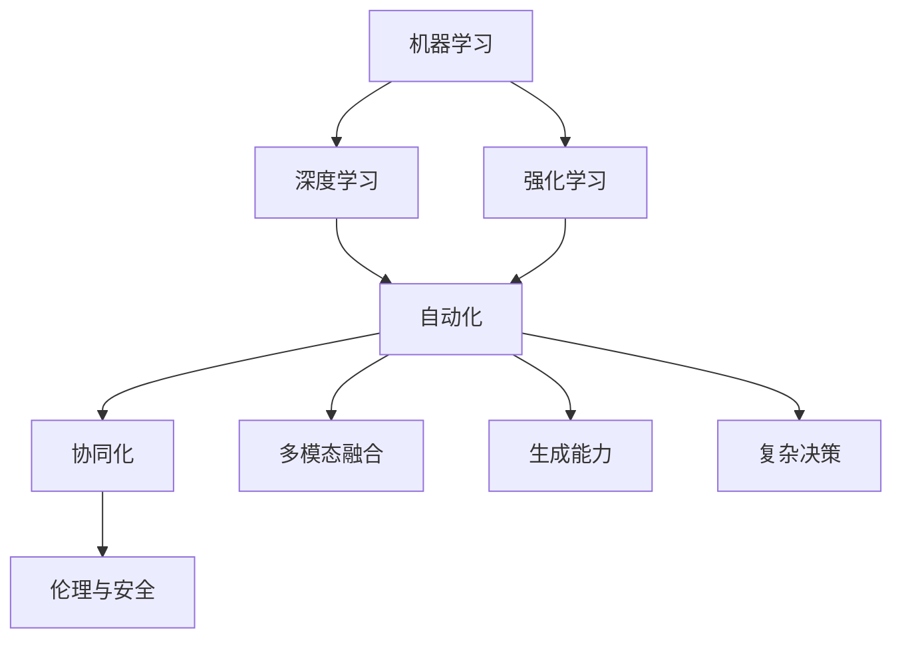
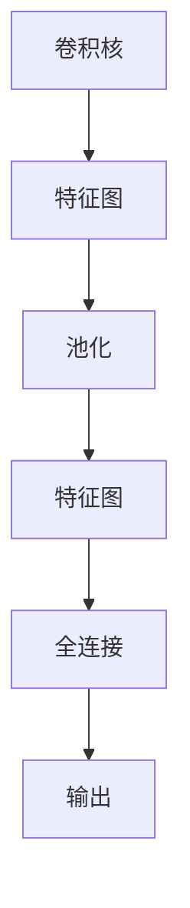

                 

# Andrej Karpathy：人工智能的未来展望

> 关键词：人工智能,机器学习,深度学习,强化学习,自动化,未来趋势

## 1. 背景介绍

### 1.1 问题由来

人工智能（AI）是当前科技领域最受关注的热点之一，尤其是在机器学习、深度学习和强化学习等技术不断突破的背景下，AI正以迅猛的势头向各行各业渗透。Andrej Karpathy，作为计算机视觉和强化学习的先驱，对AI的未来发展有着深入的理解和前瞻性的见解。

### 1.2 问题核心关键点

Karpathy认为，未来的AI发展将集中在以下几个关键点：

- **自动化与协同化**：AI将更加注重自动化和协同化，使得人与AI系统的合作更加高效。
- **多模态融合**：AI将不再局限于单一模态的数据处理，而是能整合视觉、听觉、语言等多种信息。
- **生成能力**：AI将具备更强的生成能力，能够自动生成高质量的文本、图像、视频等。
- **复杂决策**：AI将能处理更复杂的决策任务，从游戏到自动驾驶，再到医疗诊断。
- **伦理与安全**：AI的发展将面临更多的伦理与安全挑战，如何确保AI的公正、透明和安全性至关重要。

### 1.3 问题研究意义

探讨Andrej Karpathy对AI未来的展望，对于理解当前AI技术的发展趋势，预见未来的AI应用场景，具有重要意义。通过他的视角，我们可以更好地把握AI技术的潜在价值和面临的挑战，为AI研究和应用提供有力的参考。

## 2. 核心概念与联系

### 2.1 核心概念概述

为了更好地理解Karpathy对AI未来的展望，本节将介绍几个密切相关的核心概念：

- **机器学习（Machine Learning, ML）**：一种通过数据驱动模型学习的方法，使机器具备预测和决策能力。
- **深度学习（Deep Learning, DL）**：机器学习的一个分支，使用多层神经网络处理数据，具有更强的特征提取和泛化能力。
- **强化学习（Reinforcement Learning, RL）**：通过试错训练模型，使模型在特定环境下学会最优策略。
- **自动化（Automation）**：使用AI技术自动完成人类需要耗费大量时间和精力的任务。
- **协同化（Collaboration）**：AI与人类协作完成任务，增强人类工作效率。
- **多模态融合（Multimodal Fusion）**：将视觉、听觉、语言等多种模态数据整合处理。
- **生成能力（Generative Capability）**：AI生成文本、图像、视频等高质量内容的能力。
- **复杂决策（Complex Decision Making）**：AI在复杂环境下进行决策的能力。
- **伦理与安全（Ethics and Security）**：AI系统在设计和使用中面临的伦理和安全性问题。

这些核心概念之间通过交互和协同作用，推动AI技术不断进步和应用。

### 2.2 概念间的关系

这些核心概念之间的关系可以通过以下Mermaid流程图来展示：



这个流程图展示了机器学习、深度学习和强化学习等AI技术是如何推动自动化、协同化、多模态融合、生成能力、复杂决策和伦理安全等AI应用的实现。通过理解这些核心概念及其之间的关系，可以更好地把握AI技术的发展脉络和应用前景。

## 3. 核心算法原理 & 具体操作步骤
### 3.1 算法原理概述

Karpathy认为，未来的AI技术将结合机器学习、深度学习和强化学习的特点，实现更加高效、协同和智能的系统。其中，深度学习因其强大的特征提取能力，将在AI系统中占据核心地位。

深度学习通过多层神经网络对数据进行处理，每一层都能提取出数据的不同层次的特征。这种层次化的特征提取能力使得深度学习在图像识别、自然语言处理、语音识别等领域取得了显著的成果。

### 3.2 算法步骤详解

基于深度学习的AI系统的开发流程一般包括以下几个关键步骤：

1. **数据准备**：收集和预处理数据集，确保数据的多样性和代表性。
2. **模型构建**：选择合适的深度学习模型架构，如卷积神经网络（CNN）、循环神经网络（RNN）、Transformer等。
3. **模型训练**：使用训练数据集训练模型，优化模型参数，使其能够准确预测或生成目标数据。
4. **模型评估**：使用测试数据集评估模型性能，确保模型泛化能力。
5. **模型部署**：将训练好的模型部署到实际应用中，进行实时推理或决策。

### 3.3 算法优缺点

深度学习在处理大规模数据和复杂问题上具有优势，但也存在一些缺点：

**优点**：
- 强大的特征提取能力，能够自动学习数据的高级特征。
- 鲁棒性较强，对噪声和异常值具有较强的容忍度。
- 适用于多种任务，如图像识别、自然语言处理、语音识别等。

**缺点**：
- 模型复杂，训练和推理计算资源消耗较大。
- 需要大量标注数据，数据获取和标注成本较高。
- 模型难以解释，缺乏可解释性。

### 3.4 算法应用领域

深度学习在以下几个领域具有广泛的应用：

- **计算机视觉**：图像分类、目标检测、图像生成等。
- **自然语言处理**：机器翻译、文本生成、情感分析等。
- **语音识别**：自动语音识别（ASR）、语音合成（TTS）等。
- **推荐系统**：个性化推荐、广告推荐等。
- **自动驾驶**：路径规划、目标检测、行为预测等。
- **医疗诊断**：医学影像分析、病历分析等。
- **金融分析**：信用评分、风险评估等。

## 4. 数学模型和公式 & 详细讲解  
### 4.1 数学模型构建

深度学习模型的构建通常基于神经网络的结构。以卷积神经网络（CNN）为例，其数学模型可以表示为：

$$
h_\theta(x) = \sigma(W_{N} \cdot h_{\theta_{N-1}}(x) + b_N) = \sigma(W_{N-1} \cdot h_{\theta_{N-2}}(x) + b_{N-1}) = \cdots = \sigma(W_1 \cdot x + b_1)
$$

其中，$h_\theta(x)$ 表示输出，$W$ 和 $b$ 分别表示卷积核和偏置，$\sigma$ 表示激活函数。

### 4.2 公式推导过程

以多层感知器（MLP）为例，其基本公式为：

$$
h_\theta(x) = \sigma(W_{N} \cdot h_{\theta_{N-1}}(x) + b_N) = \sigma(W_{N-1} \cdot h_{\theta_{N-2}}(x) + b_{N-1}) = \cdots = \sigma(W_1 \cdot x + b_1)
$$

其中，$x$ 表示输入，$h_{\theta_{k}}(x)$ 表示第 $k$ 层的隐藏表示，$W$ 和 $b$ 分别表示权重和偏置，$\sigma$ 表示激活函数。

### 4.3 案例分析与讲解

以图像分类为例，CNN的每一层都具有不同的功能：

- **卷积层（Convolutional Layer）**：提取图像的局部特征。
- **池化层（Pooling Layer）**：减小特征图的大小，减少参数量。
- **全连接层（Fully Connected Layer）**：将特征图映射到输出空间。

CNN的结构如图：



通过多层的卷积和池化操作，CNN能够自动学习图像的高级特征，从而实现高精度的图像分类任务。

## 5. 项目实践：代码实例和详细解释说明
### 5.1 开发环境搭建

在进行深度学习项目开发时，我们需要准备好开发环境。以下是使用Python进行TensorFlow开发的环境配置流程：

1. 安装Anaconda：从官网下载并安装Anaconda，用于创建独立的Python环境。

2. 创建并激活虚拟环境：
```bash
conda create -n tf-env python=3.8 
conda activate tf-env
```

3. 安装TensorFlow：根据CUDA版本，从官网获取对应的安装命令。例如：
```bash
conda install tensorflow -c conda-forge
```

4. 安装各类工具包：
```bash
pip install numpy pandas scikit-learn matplotlib tqdm jupyter notebook ipython
```

完成上述步骤后，即可在`tf-env`环境中开始深度学习项目的开发。

### 5.2 源代码详细实现

下面我们以图像分类任务为例，给出使用TensorFlow进行卷积神经网络（CNN）开发的PyTorch代码实现。

首先，定义CNN模型的类：

```python
import tensorflow as tf
from tensorflow.keras import layers

class CNN(tf.keras.Model):
    def __init__(self, num_classes):
        super(CNN, self).__init__()
        self.conv1 = layers.Conv2D(32, (3, 3), activation='relu')
        self.pool1 = layers.MaxPooling2D((2, 2))
        self.conv2 = layers.Conv2D(64, (3, 3), activation='relu')
        self.pool2 = layers.MaxPooling2D((2, 2))
        self.flatten = layers.Flatten()
        self.dense1 = layers.Dense(128, activation='relu')
        self.dense2 = layers.Dense(num_classes, activation='softmax')

    def call(self, x):
        x = self.conv1(x)
        x = self.pool1(x)
        x = self.conv2(x)
        x = self.pool2(x)
        x = self.flatten(x)
        x = self.dense1(x)
        x = self.dense2(x)
        return x
```

然后，定义数据集类：

```python
from tensorflow.keras.datasets import cifar10
from tensorflow.keras.utils import to_categorical

class CIFAR10Dataset(tf.keras.utils.Sequence):
    def __init__(self, data_dir, batch_size=32, shuffle=True):
        self.data_dir = data_dir
        self.x_train = []
        self.y_train = []
        self.x_test = []
        self.y_test = []
        self.batch_size = batch_size
        self.shuffle = shuffle
        self.indices = None

        # 加载数据集
        (x_train, y_train), (x_test, y_test) = cifar10.load_data()

        # 数据增强
        self.augmentor = tf.keras.preprocessing.image.ImageDataGenerator(
            rotation_range=20,
            width_shift_range=0.2,
            height_shift_range=0.2,
            horizontal_flip=True,
            fill_mode='nearest')

        self.x_train, self.y_train = self.augmentor.flow(x_train, y_train, batch_size=self.batch_size)
        self.x_test, self.y_test = self.augmentor.flow(x_test, y_test, batch_size=self.batch_size)

    def __len__(self):
        return len(self.x_train) // self.batch_size

    def __getitem__(self, idx):
        batch_x = next(self.x_train)[0]
        batch_y = next(self.x_train)[1]
        batch_x = batch_x / 255.0
        return batch_x, to_categorical(batch_y, num_classes=10)
```

最后，启动训练流程：

```python
from tensorflow.keras import callbacks

# 加载数据集
train_dataset = CIFAR10Dataset('data/cifar10/', batch_size=32, shuffle=True)
test_dataset = CIFAR10Dataset('data/cifar10/', batch_size=32, shuffle=False)

# 定义模型
model = CNN(num_classes=10)

# 定义优化器
optimizer = tf.keras.optimizers.Adam(learning_rate=0.001)

# 定义损失函数
loss_fn = tf.keras.losses.SparseCategoricalCrossentropy(from_logits=True)

# 定义评估指标
metrics = [tf.keras.metrics.SparseCategoricalAccuracy('accuracy')]

# 定义训练步骤
def train_step(x, y):
    with tf.GradientTape() as tape:
        logits = model(x, training=True)
        loss = loss_fn(y, logits)
    grads = tape.gradient(loss, model.trainable_variables)
    optimizer.apply_gradients(zip(grads, model.trainable_variables))
    return loss

# 定义评估步骤
def eval_step(x, y):
    logits = model(x, training=False)
    loss = loss_fn(y, logits)
    accuracy = metrics[0].update_state(y, logits)
    return loss, accuracy

# 定义训练流程
epochs = 50
steps_per_epoch = 10000 // 32
validation_steps = 10000 // 32
callbacks = [callbacks.EarlyStopping(patience=5)]

history = model.fit(
    train_dataset,
    steps_per_epoch=steps_per_epoch,
    validation_data=test_dataset,
    validation_steps=validation_steps,
    epochs=epochs,
    callbacks=callbacks
)
```

以上就是使用TensorFlow进行卷积神经网络（CNN）图像分类任务开发的完整代码实现。可以看到，TensorFlow提供了强大的框架和丰富的组件，使得深度学习模型的开发和训练变得相对简单和高效。

### 5.3 代码解读与分析

让我们再详细解读一下关键代码的实现细节：

**CNN类**：
- 定义了CNN模型结构，包含多个卷积层、池化层、全连接层等。
- 使用`layers`模块创建各个层，并定义模型的前向传播函数`call`。

**CIFAR10Dataset类**：
- 继承自`tf.keras.utils.Sequence`类，用于加载和增强CIFAR-10数据集。
- 定义了`__init__`方法，用于初始化数据集和数据增强器。
- 定义了`__len__`方法，用于返回数据集长度。
- 定义了`__getitem__`方法，用于获取批次数据。

**训练流程**：
- 加载数据集，定义模型、优化器、损失函数和评估指标。
- 定义训练和评估步骤，使用`with tf.GradientTape`进行梯度计算和模型参数更新。
- 定义训练和评估流程，使用`model.fit`进行模型训练和评估。

可以看到，TensorFlow的API设计使得深度学习模型的开发和训练变得更加便捷和高效，开发者可以更加专注于模型设计和任务实现。

## 6. 实际应用场景
### 6.1 计算机视觉

深度学习在计算机视觉领域的应用非常广泛，如图像分类、目标检测、图像分割等。以图像分类为例，深度学习模型能够自动学习图像的高级特征，从而实现高精度的分类任务。

实际应用场景包括：
- **自动驾驶**：通过摄像头拍摄的实时图像，使用深度学习模型进行路径规划、目标检测和行为预测。
- **医疗影像**：对医学影像进行分类和分割，辅助医生进行诊断和治疗。
- **工业检测**：对生产线上的产品进行自动检测和分类，提高生产效率和质量。
- **安防监控**：对监控视频进行分析，检测异常行为和事件，提高安全防护水平。

### 6.2 自然语言处理

深度学习在自然语言处理领域也取得了显著成果，如机器翻译、情感分析、问答系统等。以机器翻译为例，深度学习模型能够自动学习源语言和目标语言之间的映射关系，实现高效的文本翻译。

实际应用场景包括：
- **翻译服务**：支持多种语言之间的自动翻译，如Google Translate、Bing Translate等。
- **客服系统**：使用聊天机器人进行自动回复，提升客户服务效率。
- **信息检索**：对大规模文本数据进行语义匹配和检索，提升信息获取的效率和质量。

### 6.3 推荐系统

深度学习在推荐系统中也表现优异，如个性化推荐、广告推荐等。以个性化推荐为例，深度学习模型能够自动学习用户的兴趣和行为，从而推荐符合用户喜好的商品和服务。

实际应用场景包括：
- **电商推荐**：根据用户的浏览和购买历史，推荐相关商品。
- **内容推荐**：根据用户的阅读和观看历史，推荐相关文章和视频。
- **广告推荐**：根据用户的地理位置、兴趣等信息，推荐合适的广告。

### 6.4 未来应用展望

深度学习技术在未来的发展将更加智能化和自动化，结合多模态融合和生成能力，实现更加复杂和高效的应用。未来可能的应用场景包括：

- **虚拟助手**：结合语音、文本和视觉信息，实现更自然的交互体验。
- **智能家居**：使用深度学习进行语音识别、图像识别和行为预测，提高家居的智能化水平。
- **智慧城市**：通过深度学习进行交通管理、环境监测和城市规划，提升城市治理的效率和水平。
- **医疗健康**：结合医疗影像、基因数据和电子病历，进行个性化治疗和疾病预测。

## 7. 工具和资源推荐
### 7.1 学习资源推荐

为了帮助开发者系统掌握深度学习技术，这里推荐一些优质的学习资源：

1. **Deep Learning Specialization**：由Andrew Ng教授主讲的Coursera深度学习专项课程，系统讲解了深度学习的基本原理和应用。
2. **CS231n: Convolutional Neural Networks for Visual Recognition**：斯坦福大学计算机视觉课程，涵盖了深度学习在计算机视觉中的应用。
3. **Deep Learning with PyTorch**：使用PyTorch进行深度学习开发的书籍，详细讲解了PyTorch的API和应用场景。
4. **Hands-On Machine Learning with Scikit-Learn, Keras, and TensorFlow**：使用Scikit-Learn、Keras和TensorFlow进行机器学习开发的书籍，涵盖了数据预处理、模型训练和应用部署等环节。
5. **Python Machine Learning**：使用Python进行机器学习开发的书籍，涵盖了多种机器学习算法和应用。

通过对这些资源的学习实践，相信你一定能够快速掌握深度学习技术的精髓，并用于解决实际的NLP问题。

### 7.2 开发工具推荐

高效的开发离不开优秀的工具支持。以下是几款用于深度学习开发的常用工具：

1. **PyTorch**：基于Python的开源深度学习框架，灵活动态的计算图，适合快速迭代研究。
2. **TensorFlow**：由Google主导开发的开源深度学习框架，生产部署方便，适合大规模工程应用。
3. **Keras**：用户友好的深度学习框架，支持多种后端（如TensorFlow、Theano），易于上手。
4. **MXNet**：支持多种编程语言（如Python、C++、Scala）的深度学习框架，高效易用。
5. **PyTorch Lightning**：基于PyTorch的深度学习框架，提供了丰富的工具和组件，简化模型开发和训练。
6. **TensorBoard**：TensorFlow配套的可视化工具，可实时监测模型训练状态，并提供丰富的图表呈现方式。
7. **Weights & Biases**：模型训练的实验跟踪工具，可以记录和可视化模型训练过程中的各项指标。

合理利用这些工具，可以显著提升深度学习模型的开发效率，加快创新迭代的步伐。

### 7.3 相关论文推荐

深度学习技术的发展离不开学界的持续研究。以下是几篇奠基性的相关论文，推荐阅读：

1. **ImageNet Classification with Deep Convolutional Neural Networks**：提出卷积神经网络（CNN），在ImageNet数据集上取得了显著成果。
2. **GoogleNet**：提出了Inception模块，提升了深度学习模型在图像分类上的精度。
3. **ResNet**：提出残差连接，解决了深度网络训练中的梯度消失问题。
4. **Attention is All You Need**：提出Transformer结构，开启了NLP领域的预训练大模型时代。
5. **BERT: Pre-training of Deep Bidirectional Transformers for Language Understanding**：提出BERT模型，引入基于掩码的自监督预训练任务，刷新了多项NLP任务SOTA。

这些论文代表了大深度学习技术的发展脉络。通过学习这些前沿成果，可以帮助研究者把握学科前进方向，激发更多的创新灵感。

除上述资源外，还有一些值得关注的前沿资源，帮助开发者紧跟深度学习技术的最新进展，例如：

1. **arXiv论文预印本**：人工智能领域最新研究成果的发布平台，包括大量尚未发表的前沿工作，学习前沿技术的必读资源。
2. **顶会论文**：如NIPS、ICML、CVPR、ACL等人工智能领域顶会现场或在线直播，能够聆听到大佬们的前沿分享，开拓视野。
3. **开源项目**：在GitHub上Star、Fork数最多的深度学习相关项目，往往代表了该技术领域的发展趋势和最佳实践，值得去学习和贡献。
4. **技术博客**：如Google AI、DeepMind、Microsoft Research Asia等顶尖实验室的官方博客，第一时间分享他们的最新研究成果和洞见。

总之，对于深度学习技术的学习和实践，需要开发者保持开放的心态和持续学习的意愿。多关注前沿资讯，多动手实践，多思考总结，必将收获满满的成长收益。

## 8. 总结：未来发展趋势与挑战
### 8.1 总结

本文对深度学习技术的发展进行了全面的探讨，重点介绍了Andrej Karpathy对AI未来的展望。深度学习在计算机视觉、自然语言处理、推荐系统等领域取得了显著的成果，展示了其强大的特征提取能力和泛化能力。同时，深度学习的发展也面临诸多挑战，如计算资源消耗、模型可解释性、伦理与安全问题等，需要进一步研究和解决。

通过本文的系统梳理，可以看到，深度学习技术在未来的发展将更加智能化和自动化，结合多模态融合和生成能力，实现更加复杂和高效的应用。面向未来，深度学习技术还需与更多AI技术进行更深入的融合，如知识表示、因果推理、强化学习等，多路径协同发力，共同推动人工智能技术的发展。

### 8.2 未来发展趋势

展望未来，深度学习技术的发展将呈现以下几个趋势：

1. **自动化与协同化**：AI将更加注重自动化和协同化，使得人与AI系统的合作更加高效。
2. **多模态融合**：AI将不再局限于单一模态的数据处理，而是能整合视觉、听觉、语言等多种信息。
3. **生成能力**：AI将具备更强的生成能力，能够自动生成高质量的文本、图像、视频等。
4. **复杂决策**：AI将能处理更复杂的决策任务，从游戏到自动驾驶，再到医疗诊断。
5. **伦理与安全**：AI的发展将面临更多的伦理与安全挑战，如何确保AI的公正、透明和安全性至关重要。

这些趋势凸显了深度学习技术的广阔前景。通过不断探索和优化，深度学习技术将在更多领域实现突破，为人类社会带来深远影响。

### 8.3 面临的挑战

尽管深度学习技术已经取得了显著的成果，但在迈向更加智能化、普适化应用的过程中，它仍面临诸多挑战：

1. **计算资源消耗**：深度学习模型通常需要大量的计算资源，尤其是训练和推理阶段。如何提高计算效率，降低资源消耗，是未来技术发展的重要方向。
2. **模型可解释性**：深度学习模型通常被视为"黑盒"系统，难以解释其内部工作机制和决策逻辑。如何赋予模型更强的可解释性，将是重要的研究课题。
3. **伦理与安全**：深度学习模型可能学习到有偏见、有害的信息，传递到下游任务，产生误导性、歧视性的输出。如何确保模型的公正性和安全性，也将是重要的研究方向。
4. **知识整合能力**：现有的深度学习模型往往局限于数据驱动，难以灵活吸收和运用更广泛的先验知识。如何让模型更好地与外部知识库、规则库等专家知识结合，形成更加全面、准确的信息整合能力，还有很大的想象空间。

这些挑战将推动深度学习技术的不断演进，帮助其克服现有局限，实现更加广泛和深远的应用。

### 8.4 研究展望

面对深度学习技术面临的诸多挑战，未来的研究需要在以下几个方面寻求新的突破：

1. **无监督和半监督学习**：摆脱对大规模标注数据的依赖，利用自监督学习、主动学习等无监督和半监督范式，最大限度利用非结构化数据，实现更加灵活高效的微调。
2. **参数高效和计算高效的微调范式**：开发更加参数高效的微调方法，在固定大部分预训练参数的同时，只更新极少量的任务相关参数。同时优化微调模型的计算图，减少前向传播和反向传播的资源消耗，实现更加轻量级、实时性的部署。
3. **因果分析和博弈论工具**：将因果分析方法引入深度学习模型，识别出模型决策的关键特征，增强输出解释的因果性和逻辑性。借助博弈论工具刻画人机交互过程，主动探索并规避模型的脆弱点，提高系统稳定性。
4. **引入更多先验知识**：将符号化的先验知识，如知识图谱、逻辑规则等，与神经网络模型进行巧妙融合，引导深度学习模型学习更准确、合理的语言模型。同时加强不同模态数据的整合，实现视觉、语音等多模态信息与文本信息的协同建模。
5. **融合伦理道德约束**：在模型训练目标中引入伦理导向的评估指标，过滤和惩罚有偏见、有害的输出倾向。同时加强人工干预和审核，建立模型行为的监管机制，确保输出符合人类价值观和伦理道德。

这些研究方向的探索，必将引领深度学习技术迈向更高的台阶，为构建安全、可靠、可解释、可控的智能系统铺平道路。面向未来

