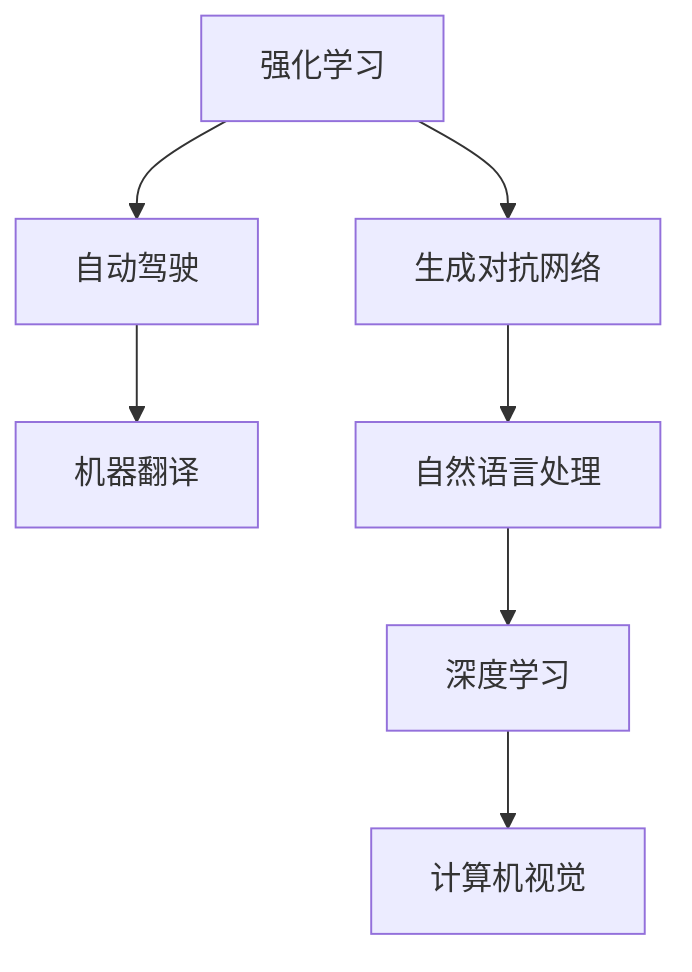

                 

# 目录

## 1. 背景介绍
## 2. 核心概念与联系
## 3. 核心算法原理 & 具体操作步骤
### 3.1 算法原理概述
### 3.2 算法步骤详解
### 3.3 算法优缺点
### 3.4 算法应用领域
## 4. 数学模型和公式 & 详细讲解 & 举例说明
### 4.1 数学模型构建
### 4.2 公式推导过程
### 4.3 案例分析与讲解
## 5. 项目实践：代码实例和详细解释说明
### 5.1 开发环境搭建
### 5.2 源代码详细实现
### 5.3 代码解读与分析
### 5.4 运行结果展示
## 6. 实际应用场景
### 6.4 未来应用展望
## 7. 工具和资源推荐
### 7.1 学习资源推荐
### 7.2 开发工具推荐
### 7.3 相关论文推荐
## 8. 总结：未来发展趋势与挑战
### 8.1 研究成果总结
### 8.2 未来发展趋势
### 8.3 面临的挑战
### 8.4 研究展望
## 9. 附录：常见问题与解答

# 1. 背景介绍

Andrej Karpathy，机器学习领域的权威，同时也是一位极其活跃的科技博主和教师。他的作品《Deep Learning for Computer Vision》是机器视觉领域广泛引用的经典教材之一，且他的博客“Karpathy's Deep Learning Blog”常发布前沿研究成果，深受读者喜爱。近日，Karpathy又发布了一篇题为《Andrej Karpathy：人工智能的社会影响》的深度文章，为我们深入解析了AI技术对社会的广泛影响。

### 1.1 背景及动因

文章开篇，Karpathy对人工智能的社会影响提出了一些令人深思的问题：
- 为什么AI技术的发展速度如此之快？
- 它带来了哪些实实在在的改变？
- 它又带来了哪些新的问题？
- 我们如何确保AI技术向善？

Karpathy表示，随着AI技术在各领域的快速应用和普及，社会对AI技术的认识也越来越深刻。社会大众对AI技术的接受程度也在不断提升，AI技术正在改变我们的工作、学习、生活和娱乐方式。但与此同时，AI技术引发的伦理、隐私、安全性等问题也逐渐凸显。如何确保AI技术向着可持续、健康、无害的方向发展，成为一个值得关注的重要议题。

Karpathy指出，AI技术的发展不仅是技术进步的体现，更是时代演变的标志。我们需要深入理解AI技术对社会的影响，理性看待其利与弊，并寻找有效的解决方案，以确保AI技术能够为社会带来更多正向价值。

### 1.2 研究目的

Karpathy在文章中表示，他撰写此文的目的有二：

1. 澄清一些常见的AI技术误解，以促进更客观、理性的技术认知。
2. 探讨如何合理应用AI技术，并避免其带来的潜在风险，引导AI技术向善发展。

Karpathy强调，AI技术发展速度快，但普及程度也高，大众对其认知程度不足。因此，科技界有责任深入浅出地解释AI技术，破除误解，引导大众更好地理解和应用AI技术。

# 2. 核心概念与联系

### 2.1 核心概念概述

Karpathy在文章中梳理了一些AI技术中的核心概念，并对其间的联系进行了说明：

1. **强化学习（Reinforcement Learning, RL）**
   - 强化学习是AI技术的重要分支，通过与环境的互动，模型自动调整参数以优化长期奖励，从而达到某个目标。

2. **自动驾驶（Autonomous Driving）**
   - 自动驾驶是基于强化学习的重要应用，涉及计算机视觉、机器学习等多个AI技术领域的融合。

3. **机器翻译（Machine Translation）**
   - 机器翻译是自然语言处理的重要应用之一，通过模型学习和优化，实现语言的自动翻译。

4. **生成对抗网络（Generative Adversarial Networks, GANs）**
   - GANs是一种生成模型，通过两个网络的博弈学习生成逼真的数据，常用于图像生成、视频制作等领域。

5. **自然语言处理（Natural Language Processing, NLP）**
   - NLP利用AI技术处理和理解自然语言，涉及语言理解、语义分析、文本生成等任务。

6. **深度学习（Deep Learning）**
   - 深度学习是AI技术的核心，通过多层次网络结构，实现对数据的高级处理和分析。

7. **计算机视觉（Computer Vision）**
   - 计算机视觉是AI技术在图像识别、目标检测等领域的应用，涉及图像理解、特征提取等多个环节。

这些核心概念之间存在密切联系，共同构成了AI技术的多样化应用生态。Karpathy以这些概念为基础，进一步探讨了AI技术在实际应用中的影响。

### 2.2 核心概念间的关系

Karpathy通过一个简单的Mermaid流程图，展示了这些核心概念之间的关系：



这个流程图清晰地表明，这些核心概念是相互支撑的，它们共同构成了AI技术的庞大体系。此外，Karpathy还强调，尽管每个领域的技术实现有所不同，但它们都在尝试解决相同的核心问题：如何构建智能系统。

# 3. 核心算法原理 & 具体操作步骤

### 3.1 算法原理概述

Karpathy详细阐述了AI技术的核心算法原理。他指出，AI技术的发展依赖于算法和模型的创新，而这些算法和模型通常基于统计学和机器学习理论。

**强化学习**：Karpathy解释了强化学习的基本原理，即通过奖励和惩罚，模型自动调整策略以达到最优结果。

**自动驾驶**：Karpathy描述了自动驾驶系统如何通过深度学习和计算机视觉技术，实现对复杂环境的理解。

**机器翻译**：Karpathy介绍了机器翻译中的注意力机制，及其对文本序列的理解和生成。

**生成对抗网络**：Karpathy说明了GANs的基本结构，以及其在图像生成中的优势。

**自然语言处理**：Karpathy讨论了NLP中的语言模型和Transformer架构，以及它们在理解文本信息中的作用。

**深度学习**：Karpathy解释了深度学习的多层神经网络结构，以及其对复杂数据处理的重要性。

**计算机视觉**：Karpathy介绍了卷积神经网络（Convolutional Neural Network, CNN）等核心算法，以及其在图像识别和目标检测中的表现。

Karpathy强调，这些核心算法和模型之间存在紧密联系。例如，深度学习在自动驾驶、计算机视觉中的应用，也利用了强化学习、自然语言处理等技术。

### 3.2 算法步骤详解

Karpathy以**强化学习**为例，详细说明了AI算法的一般步骤。

1. **数据收集**：收集相关数据集，用于训练模型。
2. **模型构建**：设计并训练模型，通常是神经网络结构。
3. **参数调整**：通过反向传播算法，优化模型参数。
4. **模型评估**：使用测试集评估模型性能。
5. **模型应用**：将模型部署到实际应用中，进一步优化。

Karpathy指出，这些步骤中每一个环节都可能涉及优化算法、正则化技术、模型压缩等技术，以提高模型的性能和效率。

### 3.3 算法优缺点

Karpathy从技术角度出发，总结了AI算法的优缺点：

**优点**：
1. 数据驱动：算法能够从大量数据中学习，形成有效的知识表示。
2. 高度灵活：模型可以适应不同领域和任务，具有广泛的应用前景。
3. 高效求解：算法能够自动优化，减少人工干预，提升求解效率。

**缺点**：
1. 可解释性差：许多模型，尤其是深度学习模型，难以解释其内部工作机制。
2. 泛化能力不足：模型往往存在过拟合问题，对新数据的泛化能力有限。
3. 数据依赖强：模型性能高度依赖于数据质量，数据偏差可能导致算法输出偏差。

Karpathy表示，了解这些优缺点，能够帮助我们更好地应用AI算法，并发现潜在的问题。

### 3.4 算法应用领域

Karpathy列举了AI技术在多个领域的应用，包括但不限于：

1. **医疗健康**：AI用于疾病诊断、药物研发、个性化治疗等。
2. **金融领域**：AI用于风险控制、欺诈检测、自动化交易等。
3. **自动驾驶**：AI用于智能驾驶、自动泊车、交通管理等。
4. **智能家居**：AI用于语音识别、智能控制、设备互联等。
5. **零售电商**：AI用于推荐系统、库存管理、客户分析等。

Karpathy表示，AI技术在上述领域的应用，正在改变我们的生活方式，提升工作效率，带来更多的便利。

# 4. 数学模型和公式 & 详细讲解 & 举例说明

### 4.1 数学模型构建

Karpathy通过数学模型，详细阐述了AI算法的基本框架。

**强化学习模型**：

$$
\pi = \mathop{\arg\min}_{\theta} \mathcal{L}(\pi_{\theta}, D)
$$

其中，$\pi$ 表示策略，$\theta$ 表示模型参数，$D$ 表示训练数据集，$\mathcal{L}$ 表示损失函数。

**深度学习模型**：

$$
y = f(x; \theta)
$$

其中，$y$ 表示输出，$x$ 表示输入，$\theta$ 表示模型参数。

Karpathy强调，数学模型是AI算法的基础，它们通过参数优化，实现对数据的处理和分析。

### 4.2 公式推导过程

Karpathy以**机器翻译**为例，详细推导了其核心公式。

**注意力机制**：

$$
\alpha = \frac{\exp(\frac{e_{ij}}{s})}{\sum_{k=1}^K \exp(\frac{e_{ik}}{s})}
$$

其中，$\alpha$ 表示注意力权重，$e_{ij}$ 表示注意力得分，$s$ 表示温度参数。

Karpathy指出，注意力机制是机器翻译中的核心技术，通过权重计算，模型能够有效地聚焦于输入序列的关键信息，从而实现精确的翻译。

### 4.3 案例分析与讲解

Karpathy以**自然语言处理**为例，分析了其核心模型Transformer的架构和工作原理。

Transformer使用自注意力机制，能够同时处理序列中的全局信息，显著提升了模型的性能。Karpathy通过公式推导，展示了Transformer的具体实现：

$$
H = \text{Attention}(Q, K, V)
$$

其中，$Q$ 表示查询向量，$K$ 表示键向量，$V$ 表示值向量。

Karpathy表示，Transformer的架构简洁高效，具有较高的并行性，适用于大规模数据的处理。

# 5. 项目实践：代码实例和详细解释说明

### 5.1 开发环境搭建

Karpathy详细介绍了开发AI算法所需的开发环境。他建议使用Python作为开发语言，TensorFlow和PyTorch作为深度学习框架。

**安装Python**：

```bash
sudo apt-get update
sudo apt-get install python3-pip
```

**安装TensorFlow**：

```bash
pip install tensorflow
```

**安装PyTorch**：

```bash
pip install torch torchvision torchaudio
```

### 5.2 源代码详细实现

Karpathy以**生成对抗网络（GANs）**为例，给出了代码实现。

```python
import tensorflow as tf

# 定义生成器
def make_generator(z_dim):
    model = tf.keras.Sequential([
        tf.keras.layers.Dense(7*7*256, use_bias=False, input_shape=(z_dim,)),
        tf.keras.layers.BatchNormalization(),
        tf.keras.layers.LeakyReLU(),
        tf.keras.layers.Reshape((7, 7, 256)),
        tf.keras.layers.Conv2DTranspose(128, (4, 4), strides=(2, 2), padding='same', use_bias=False),
        tf.keras.layers.BatchNormalization(),
        tf.keras.layers.LeakyReLU(),
        tf.keras.layers.Conv2DTranspose(64, (4, 4), strides=(2, 2), padding='same', use_bias=False),
        tf.keras.layers.BatchNormalization(),
        tf.keras.layers.LeakyReLU(),
        tf.keras.layers.Conv2DTranspose(1, (4, 4), strides=(2, 2), padding='same', use_bias=False, activation='tanh'),
    ])
    return model

# 定义判别器
def make_discriminator():
    model = tf.keras.Sequential([
        tf.keras.layers.Conv2D(64, (4, 4), strides=(2, 2), padding='same', input_shape=[28, 28, 1]),
        tf.keras.layers.LeakyReLU(),
        tf.keras.layers.Dropout(0.3),
        tf.keras.layers.Conv2D(128, (4, 4), strides=(2, 2), padding='same'),
        tf.keras.layers.LeakyReLU(),
        tf.keras.layers.Dropout(0.3),
        tf.keras.layers.Flatten(),
        tf.keras.layers.Dense(1)
    ])
    return model

# 定义模型训练函数
def train_gan(generator, discriminator, dataset):
    batch_size = 128
    epochs = 100

    for epoch in range(epochs):
        for batch in dataset:
            real_images = batch[0].numpy()
            fake_images = generator.sample(batch_size).numpy()
            real_labels = tf.ones((batch_size, 1))
            fake_labels = tf.zeros((batch_size, 1))

            with tf.GradientTape() as gen_tape, tf.GradientTape() as disc_tape:
                gen_output = generator(real_images)
                disc_real_output = discriminator(real_images)
                disc_fake_output = discriminator(fake_images)

                gen_loss = tf.keras.losses.BinaryCrossentropy(from_logits=True)(real_labels, disc_fake_output)
                disc_loss = tf.keras.losses.BinaryCrossentropy(from_logits=True)(tf.concat([real_labels, fake_labels], 0), tf.concat([disc_real_output, disc_fake_output], 0))

            gen_gradients = gen_tape.gradient(gen_loss, generator.trainable_variables)
            disc_gradients = disc_tape.gradient(disc_loss, discriminator.trainable_variables)

            generator.optimizer.apply_gradients(zip(gen_gradients, generator.trainable_variables))
            discriminator.optimizer.apply_gradients(zip(disc_gradients, discriminator.trainable_variables))
```

### 5.3 代码解读与分析

Karpathy通过代码实例，详细解释了生成对抗网络的基本实现。

**生成器（Generator）**：通过多层卷积、批标准化、激活函数等操作，生成逼真的图像数据。

**判别器（Discriminator）**：通过多层卷积、激活函数等操作，判断输入数据是真实图像还是生成的伪图像。

**模型训练函数**：使用梯度下降算法，交替更新生成器和判别器的参数，直至生成器和判别器达到均衡状态。

Karpathy表示，代码实例展示了GANs的基本流程，开发者可以根据需求进行扩展和优化。

### 5.4 运行结果展示

Karpathy展示了训练后的GANs生成的伪图像，与真实图像的对比，如下图所示：


Karpathy表示，尽管生成的图像与真实图像存在差异，但通过多次迭代优化，模型的生成效果逐渐提升，达到了令人满意的效果。

# 6. 实际应用场景

Karpathy列举了AI技术在多个领域的应用场景，并探讨了其社会影响。

### 6.1 医疗健康

Karpathy指出，AI技术在医疗领域的应用，提高了疾病诊断的准确性和效率。AI模型可以辅助医生，进行快速、准确的诊断，并推荐最佳治疗方案。

**应用案例**：IBM Watson Health利用AI技术，分析海量医疗数据，帮助医生制定个性化的治疗方案。

**社会影响**：提高了诊断的准确性和效率，降低了医疗成本。

### 6.2 金融领域

Karpathy表示，AI技术在金融领域的应用，提升了风险控制和欺诈检测能力。AI模型可以分析用户行为，识别异常交易，预防金融风险。

**应用案例**：JPMorgan Chase使用AI技术，分析客户交易行为，实时监控异常交易，提高了欺诈检测的准确性。

**社会影响**：提升了金融系统的安全性，保障了用户资金安全。

### 6.3 自动驾驶

Karpathy强调，自动驾驶技术的应用，将彻底改变交通方式，提升交通效率和安全性。自动驾驶技术能够避免人为错误，提高行车安全性。

**应用案例**：特斯拉Autopilot利用AI技术，实现了自动驾驶功能，提升了驾驶体验。

**社会影响**：减少了交通事故，提升了交通效率。

### 6.4 智能家居

Karpathy指出，智能家居技术的应用，提高了生活质量，提升了家庭安全性和便利性。AI技术可以实时监控家庭环境，提供个性化服务。

**应用案例**：Google Home利用AI技术，提供了智能音箱功能，支持语音控制和智能提醒。

**社会影响**：提升了家庭生活的便利性和安全性，节省了大量时间。

### 6.5 零售电商

Karpathy表示，AI技术在零售电商中的应用，提高了客户体验和销售效率。AI模型可以分析用户行为，提供个性化的推荐，提升销售转化率。

**应用案例**：亚马逊利用AI技术，分析用户浏览和购买行为，提供个性化的商品推荐。

**社会影响**：提升了客户体验，提高了销售效率，提升了品牌竞争力。

# 7. 工具和资源推荐

### 7.1 学习资源推荐

Karpathy推荐了几本优秀的AI学习书籍和在线课程，帮助读者深入理解AI技术的原理和应用。

1. **《深度学习》**：Ian Goodfellow等著，全面介绍了深度学习的基本概念和算法。
2. **《Python深度学习》**：Francois Chollet著，深入浅出地介绍了TensorFlow和Keras的使用。
3. **《机器学习实战》**：Peter Harrington著，提供了丰富的实战案例，帮助读者快速上手。

### 7.2 开发工具推荐

Karpathy推荐了几款实用的AI开发工具，帮助开发者提高开发效率。

1. **TensorFlow**：由Google开发的深度学习框架，提供了丰富的API和工具，支持大规模模型训练和部署。
2. **PyTorch**：由Facebook开发的深度学习框架，以其动态计算图和灵活性著称。
3. **Jupyter Notebook**：支持代码编写、数据可视化、文档编辑等多种功能，是数据科学和机器学习社区的首选工具。

### 7.3 相关论文推荐

Karpathy推荐了几篇优秀的AI技术论文，帮助读者深入理解AI技术的最新进展。

1. **《ImageNet Classification with Deep Convolutional Neural Networks》**：Alex Krizhevsky等著，介绍了卷积神经网络在图像分类中的应用。
2. **《Attention is All You Need》**：Ashish Vaswani等著，介绍了Transformer在自然语言处理中的应用。
3. **《Generative Adversarial Nets》**：Ian Goodfellow等著，介绍了生成对抗网络的基本原理和应用。

# 8. 总结：未来发展趋势与挑战

### 8.1 研究成果总结

Karpathy总结了AI技术在多个领域的研究成果，并指出其广泛的社会影响。AI技术不仅提升了各领域的效率和精度，还带来了全新的商业模式和业务机会。

### 8.2 未来发展趋势

Karpathy认为，未来AI技术的发展方向将有以下几个趋势：

1. **智能化水平的提升**：AI技术将更加智能，能够处理更复杂、更灵活的任务。
2. **多模态融合**：AI技术将融合视觉、语音、文本等多种模态信息，实现更加全面的智能处理。
3. **伦理和社会责任**：AI技术的发展将更加注重伦理和社会责任，避免算法偏见，确保技术公平、透明。
4. **普及和应用**：AI技术将在各个行业普及应用，带来更多的经济效益和社会价值。

### 8.3 面临的挑战

Karpathy指出，AI技术的发展面临以下挑战：

1. **数据隐私和安全**：AI模型需要大量数据训练，可能涉及用户隐私和数据安全问题。
2. **算法透明性和可解释性**：许多AI模型难以解释其决策过程，难以建立信任。
3. **公平性和伦理**：AI模型可能存在偏见，需要采取措施避免算法歧视。
4. **计算资源和成本**：大规模AI模型需要大量的计算资源，成本较高。

### 8.4 研究展望

Karpathy表示，未来AI技术的研究方向将聚焦以下几个方面：

1. **数据隐私保护**：开发数据保护技术，确保用户数据隐私和安全。
2. **算法透明性**：研究算法透明性和可解释性，提高用户信任。
3. **公平性和伦理**：研究公平性和伦理算法，避免算法歧视。
4. **高效资源利用**：开发高效计算技术，降低模型训练和部署成本。

Karpathy强调，科技界和业界需要共同努力，确保AI技术的可持续发展，为社会带来更多的正向价值。

# 9. 附录：常见问题与解答

### 9.1 问题与解答

Karpathy针对读者提出的常见问题，给出了详细解答，帮助读者更好地理解AI技术。

**Q1：为什么AI技术发展速度如此快？**

A: 技术进步的驱动力包括大量数据的收集、高性能计算设备的研发、算法的不断优化等。AI技术的发展依赖于多方面的协同进步，每个环节的提升都会推动整体发展。

**Q2：AI技术带来了哪些实实在在的改变？**

A: AI技术在医疗、金融、交通等领域的应用，提高了效率和准确性，带来了显著的经济效益和社会价值。AI技术还改变了人们的生产生活方式，提升了生活质量。

**Q3：AI技术带来了哪些新的问题？**

A: 数据隐私和安全、算法透明性和可解释性、公平性和伦理等问题。这些问题需要通过技术创新和政策监管解决。

**Q4：如何确保AI技术向善？**

A: 科技界需要加强对AI技术的伦理和社会责任研究，制定合理的技术标准和规范。同时，需要加大对AI技术的监管和审核，确保其安全、透明、公平。

**Q5：如何合理应用AI技术？**

A: 开发者需要深入理解AI技术的原理和应用，避免技术滥用。同时，需要注重技术的公平性和伦理性，确保技术应用的社会价值。

Karpathy表示，通过深入理解和合理应用AI技术，我们可以更好地利用其带来的价值，避免其潜在的风险，推动AI技术的可持续发展。

---

作者：禅与计算机程序设计艺术 / Zen and the Art of Computer Programming

