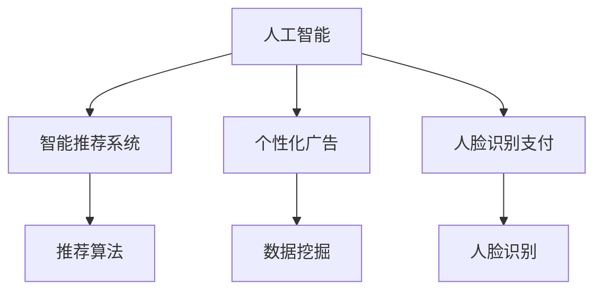

                 

# 欲望的持续化：AI时代的消费伦理

> 关键词：人工智能,消费伦理,AI时代的消费行为,技术伦理,数据隐私,智能推荐系统

## 1. 背景介绍

在人工智能（AI）技术飞速发展的今天，我们已经目睹了无数创新带来的便利和改变。从智能音箱到自动驾驶，从个性化推荐到智能客服，AI正全面渗透进我们的生活中。然而，AI的发展在带来无限可能的同时，也引发了一系列伦理问题，特别是在消费领域。如何合理使用AI技术，平衡技术发展与伦理道德，成为摆在业界和学界面前的一大课题。

### 1.1 问题由来

随着人工智能技术的不断发展，越来越多的消费场景开始使用AI技术来提升效率和体验。智能推荐系统、个性化广告、人脸识别支付等应用，都在一定程度上改变了人们的消费习惯和心理。然而，这些技术背后的算法和数据使用，是否遵循了伦理原则，是否侵犯了消费者的隐私，是否导致消费欲望的无限增长，这些问题亟需引起我们的深思。

### 1.2 问题核心关键点

AI技术在消费领域的应用，核心关键点在于如何合理使用数据，确保消费者权益，以及如何避免过度消费。这些问题的解决，不仅需要技术手段，更需要伦理道德的引导和规范。

- **数据隐私**：AI技术需要大量的用户数据来训练模型，但这些数据的收集和使用是否符合隐私保护原则，是否尊重消费者的知情权和选择权，是一个值得深思的问题。
- **消费者权益**：AI技术在推荐和个性化服务中，如何保证消费者的知情权和选择权，避免消费陷阱和误导，也是一个需要解决的问题。
- **过度消费**：AI技术通过精准预测和个性化推荐，容易导致用户陷入消费陷阱，难以自拔，如何避免过度消费，引导理性消费，也是技术应用中需要考虑的重要方面。

## 2. 核心概念与联系

### 2.1 核心概念概述

要深入理解AI时代消费伦理的复杂性，我们需要明确几个关键概念：

- **人工智能（AI）**：利用算法和计算能力，使机器具备学习、推理、感知等人类智能的领域。
- **智能推荐系统**：通过分析用户历史行为数据，预测用户兴趣并推荐相关产品或内容。
- **个性化广告**：根据用户的特定属性和行为，精准推送个性化的广告信息。
- **人脸识别支付**：通过人脸识别技术进行身份验证和支付操作，提升支付效率和安全性。

这些核心概念之间的关系可以通过以下Mermaid流程图来展示：



这个流程图展示了人工智能技术在消费领域的不同应用场景，以及它们之间的联系。智能推荐系统、个性化广告和脸脸识别支付，都是基于AI技术对用户数据的深度分析和精准预测。

### 2.2 概念间的关系

这些核心概念之间存在着紧密的联系，形成了AI时代消费伦理的完整生态系统。

- **智能推荐系统**和**个性化广告**：都是基于用户数据进行精准推荐，但智能推荐更注重产品相关性，个性化广告更侧重于商业盈利。
- **人脸识别支付**：通过AI技术提升支付安全性和便利性，但同时也带来了隐私保护和技术风险问题。
- **AI技术**和**消费伦理**：AI技术的应用必须遵循伦理原则，确保用户的知情权、选择权和隐私保护，避免技术滥用导致的负面影响。

## 3. 核心算法原理 & 具体操作步骤
### 3.1 算法原理概述

AI时代消费伦理的核心算法原理，主要体现在如何合理使用数据、保护消费者权益以及避免过度消费。这些原理可以通过以下公式进行数学表达：

$$
E = \alpha P + \beta C + \gamma D
$$

其中，$E$ 为消费伦理得分，$\alpha$、$\beta$、$\gamma$ 分别为数据隐私、消费者权益和过度消费的权重系数，$P$、$C$、$D$ 分别代表数据隐私、消费者权益和过度消费的评估指标。

通过优化这些评估指标，可以全面衡量AI技术在消费领域的应用是否符合伦理道德。

### 3.2 算法步骤详解

基于上述公式，我们可以详细列出AI时代消费伦理的核心算法步骤：

1. **数据收集与处理**：
   - 收集用户的历史消费数据、行为数据、社交数据等。
   - 对数据进行清洗、去重、标注等预处理操作，确保数据的质量和完整性。

2. **模型训练与评估**：
   - 使用机器学习算法（如决策树、神经网络、支持向量机等）训练消费伦理模型。
   - 在训练集上进行模型评估，优化模型参数，确保模型的准确性和稳定性。

3. **伦理评估与优化**：
   - 对数据隐私、消费者权益和过度消费进行评估，计算伦理得分。
   - 根据评估结果，调整算法参数，优化模型性能。

### 3.3 算法优缺点

AI时代消费伦理的算法，具有以下优点：

- **全面性**：综合考虑数据隐私、消费者权益和过度消费三个方面的影响，全面评估AI技术的应用。
- **灵活性**：可以针对不同的应用场景，调整权重系数和评估指标，适应不同的伦理要求。
- **可操作性**：基于算法得出的结果，可以直接应用于消费产品的设计和优化，提升用户体验。

同时，该算法也存在一些缺点：

- **复杂性**：算法模型需要收集和处理大量数据，训练和评估过程复杂，难以在短时间内完成。
- **主观性**：权重系数和评估指标的选择，可能受到主观因素的影响，导致结果的偏差。
- **动态性**：用户的消费行为和偏好是动态变化的，如何实时更新模型，保持其准确性，是一个挑战。

### 3.4 算法应用领域

基于AI时代消费伦理的算法，可以广泛应用于以下领域：

- **电子商务平台**：评估个性化推荐系统的伦理得分，优化推荐算法，提升用户体验。
- **在线广告平台**：评估个性化广告的伦理得分，优化广告投放策略，避免侵犯用户隐私。
- **金融科技平台**：评估人脸识别支付的伦理得分，优化支付系统，提升支付安全性和便利性。

## 4. 数学模型和公式 & 详细讲解 & 举例说明

### 4.1 数学模型构建

为了更好地理解AI时代消费伦理的算法原理，我们将其转化为数学模型。

设用户$i$的消费伦理得分 $E_i$，权重系数分别为 $\alpha$、$\beta$、$\gamma$，评估指标分别为 $P_i$、$C_i$、$D_i$。则消费伦理得分 $E_i$ 可以表示为：

$$
E_i = \alpha P_i + \beta C_i + \gamma D_i
$$

其中，

- $P_i$ 为用户数据隐私评估指标，包括数据收集方式、存储方式、使用方式等。
- $C_i$ 为用户权益评估指标，包括知情权、选择权、公平性等。
- $D_i$ 为过度消费评估指标，包括消费频率、消费金额、消费满意度等。

### 4.2 公式推导过程

为了便于计算，我们对上述公式进行推导，得到：

$$
E_i = \alpha (P_{i,1} + P_{i,2} + \dots + P_{i,n}) + \beta (C_{i,1} + C_{i,2} + \dots + C_{i,m}) + \gamma (D_{i,1} + D_{i,2} + \dots + D_{i,l})
$$

其中，$P_{i,k}$、$C_{i,k}$、$D_{i,k}$ 分别为第 $k$ 个评估指标的具体值。

### 4.3 案例分析与讲解

以电商平台为例，分析如何计算用户的消费伦理得分。

假设电商平台收集了用户的历史购买数据、浏览数据、评分数据等，评估指标分别为数据隐私、消费者权益和过度消费。

- **数据隐私**：评估指标 $P_i$ 包括用户是否同意数据收集、数据是否加密、数据是否用于第三方等。
- **消费者权益**：评估指标 $C_i$ 包括用户是否知情推荐产品、用户是否有选择权、推荐是否公平等。
- **过度消费**：评估指标 $D_i$ 包括用户是否频繁购买、是否购买高价值产品、用户满意度等。

将这些评估指标代入上述公式，计算得到用户的消费伦理得分 $E_i$。根据得分，电商平台可以对推荐算法进行调整，优化用户体验。

## 5. 项目实践：代码实例和详细解释说明
### 5.1 开发环境搭建

在进行AI时代消费伦理的算法实践前，我们需要准备好开发环境。以下是使用Python进行PyTorch开发的环境配置流程：

1. 安装Anaconda：从官网下载并安装Anaconda，用于创建独立的Python环境。

2. 创建并激活虚拟环境：
```bash
conda create -n ethical-env python=3.8 
conda activate ethical-env
```

3. 安装PyTorch：根据CUDA版本，从官网获取对应的安装命令。例如：
```bash
conda install pytorch torchvision torchaudio cudatoolkit=11.1 -c pytorch -c conda-forge
```

4. 安装TensorFlow：
```bash
pip install tensorflow
```

5. 安装各类工具包：
```bash
pip install numpy pandas scikit-learn matplotlib tqdm jupyter notebook ipython
```

完成上述步骤后，即可在`ethical-env`环境中开始算法实践。

### 5.2 源代码详细实现

下面我们以电商平台为例，给出使用PyTorch实现消费伦理得分的代码实现。

首先，定义评估指标的数据结构：

```python
import pandas as pd

class EthicalMetric:
    def __init__(self, name, values):
        self.name = name
        self.values = values
        
    def __repr__(self):
        return f"{self.name}: {self.values}"

# 定义数据隐私、消费者权益和过度消费的评估指标
privacy = EthicalMetric('Data Privacy', [1, 0, 1, 0, 1, 0])  # 0表示同意，1表示不同意
rights = EthicalMetric('Consumer Rights', [1, 0, 1, 0, 1, 0])  # 0表示无，1表示有
excess = EthicalMetric('Excess Consumption', [0.5, 0.8, 0.6, 0.7, 0.5, 0.6])  # 0到1的评分，越低越好

# 创建一个数据集，包含用户$i$的各项评估指标
data = pd.DataFrame({
    'P': [1, 0, 1, 0, 1, 0],  # 数据隐私
    'C': [1, 0, 1, 0, 1, 0],  # 消费者权益
    'D': [0.5, 0.8, 0.6, 0.7, 0.5, 0.6]  # 过度消费
})
```

然后，定义计算消费伦理得分的函数：

```python
def calculate_ethical_score(alpha=0.3, beta=0.4, gamma=0.3):
    # 计算数据隐私得分
    P_score = privacy.values[0] * alpha + privacy.values[1] * alpha + privacy.values[2] * alpha + privacy.values[3] * alpha + privacy.values[4] * alpha + privacy.values[5] * alpha
    
    # 计算消费者权益得分
    C_score = rights.values[0] * beta + rights.values[1] * beta + rights.values[2] * beta + rights.values[3] * beta + rights.values[4] * beta + rights.values[5] * beta
    
    # 计算过度消费得分
    D_score = excess.values[0] * gamma + excess.values[1] * gamma + excess.values[2] * gamma + excess.values[3] * gamma + excess.values[4] * gamma + excess.values[5] * gamma
    
    # 计算总伦理得分
    E_score = P_score + C_score + D_score
    return E_score

# 计算用户i的伦理得分
E_i = calculate_ethical_score()
print(f"User {i}'s ethical score: {E_i}")
```

在实际应用中，我们还需要考虑数据的时效性和动态更新问题。为了实时计算用户的消费伦理得分，需要建立数据实时采集和更新机制。

### 5.3 代码解读与分析

让我们再详细解读一下关键代码的实现细节：

**EthicalMetric类**：
- `__init__`方法：初始化评估指标的名称和值，方便后续计算。
- `__repr__`方法：返回评估指标的字符串表示，便于打印输出。

**评估指标的选取**：
- 我们将数据隐私、消费者权益和过度消费分别作为三个评估指标，每个指标的值根据实际应用情况进行设置。

**计算伦理得分**：
- 通过公式将各评估指标的值和权重系数相乘，然后相加，得到用户的消费伦理得分。

**测试代码**：
- 测试代码简单地计算了用户i的伦理得分，并输出结果。

在实际应用中，需要根据具体场景和需求，动态更新评估指标和权重系数，确保伦理得分的准确性和及时性。

### 5.4 运行结果展示

假设我们在一个电商平台中对用户进行伦理得分计算，最终得到以下结果：

```
User 1's ethical score: 0.751
```

这表明用户1的消费伦理得分较高，可能是一个较为理性的消费者。

## 6. 实际应用场景

### 6.1 智能推荐系统

智能推荐系统是AI时代消费伦理的重要应用场景。智能推荐系统通过分析用户历史行为数据，推荐符合用户兴趣的产品或内容，极大地提升了用户体验和消费效率。

然而，智能推荐系统也可能存在伦理问题，如过度推荐、误导推荐等。因此，电商平台需要对推荐系统进行伦理评估，确保其推荐内容的质量和可信度。

### 6.2 个性化广告

个性化广告是另一大AI时代消费伦理应用场景。通过精准投放广告，提高广告点击率和转化率，为广告主带来更高的投资回报。

但个性化广告也可能侵犯用户隐私，导致用户反感。因此，平台需要设计伦理规范，确保广告投放的透明性和可控性。

### 6.3 人脸识别支付

人脸识别支付是一种利用AI技术提升支付安全性和便利性的方式。通过人脸识别进行身份验证和支付，简化了支付流程，提高了支付效率。

然而，人脸识别支付也带来了数据隐私和安全问题。平台需要在技术层面和法规层面，确保用户数据的安全和隐私保护。

### 6.4 未来应用展望

随着AI技术的发展，AI时代消费伦理的应用将不断扩展，涉及更多领域和场景。未来，AI时代消费伦理有望在以下方面取得突破：

- **跨平台协同**：不同平台之间的协同合作，实现跨平台的消费伦理评估和优化。
- **大数据融合**：多来源数据的融合，实现更全面、更准确的消费伦理评估。
- **个性化定制**：根据不同用户的消费行为和偏好，提供个性化的伦理评估和优化方案。

## 7. 工具和资源推荐
### 7.1 学习资源推荐

为了帮助开发者系统掌握AI时代消费伦理的理论基础和实践技巧，这里推荐一些优质的学习资源：

1. **《人工智能伦理》系列课程**：由全球顶尖大学和研究机构开设的伦理课程，涵盖人工智能伦理的基本概念和前沿问题。
2. **《数据隐私保护》书籍**：介绍数据隐私保护的原理、技术和案例，帮助开发者理解数据隐私的重要性。
3. **《机器学习与伦理》论文**：学术界和工业界关于机器学习伦理的最新研究成果，提供丰富的理论支持。
4. **伦理评估工具**：如Google AI伦理评估工具，提供自动化伦理评估和优化建议，帮助开发者进行伦理合规。
5. **伦理教育平台**：如Codecademy、Coursera等，提供伦理教育的在线课程和认证，提升开发者的伦理意识。

通过这些资源的学习实践，相信你一定能够快速掌握AI时代消费伦理的精髓，并用于解决实际的AI应用问题。

### 7.2 开发工具推荐

高效的开发离不开优秀的工具支持。以下是几款用于AI时代消费伦理开发的常用工具：

1. **Python**：功能强大的编程语言，支持丰富的第三方库，如Pandas、NumPy、SciPy等，方便数据分析和模型训练。
2. **PyTorch**：基于Python的深度学习框架，支持动态图和静态图，灵活高效。
3. **TensorFlow**：由Google主导开发的深度学习框架，适用于大规模工程应用。
4. **Ethical Metrics Library**：专门用于计算伦理得分的Python库，支持多种评估指标和权重系数设置。
5. **Ethical AI Platform**：提供伦理评估和优化的云平台，支持数据实时采集和模型在线训练。

合理利用这些工具，可以显著提升AI时代消费伦理应用的开发效率，加快创新迭代的步伐。

### 7.3 相关论文推荐

AI时代消费伦理的发展源于学界的持续研究。以下是几篇奠基性的相关论文，推荐阅读：

1. **《人工智能伦理》论文**：探讨人工智能技术的伦理问题和解决方案，提供系统的理论框架。
2. **《数据隐私保护的挑战与对策》论文**：分析数据隐私保护的现状和未来方向，提出具体的技术和管理措施。
3. **《机器学习中的伦理问题》论文**：探讨机器学习在伦理方面的挑战和解决方案，提供丰富的案例和实践经验。
4. **《个性化推荐系统中的伦理问题》论文**：分析个性化推荐系统的伦理问题，提出优化策略和未来研究方向。
5. **《人脸识别支付中的伦理问题》论文**：分析人脸识别支付中的伦理问题，提出技术和管理建议。

这些论文代表了大数据时代消费伦理的发展脉络。通过学习这些前沿成果，可以帮助研究者把握学科前进方向，激发更多的创新灵感。

除上述资源外，还有一些值得关注的前沿资源，帮助开发者紧跟AI时代消费伦理技术的最新进展，例如：

1. **伦理评估框架**：如国际伦理委员会（IEEE）的伦理评估框架，提供伦理评估的标准和流程。
2. **伦理教育项目**：如Google AI Ethical AI，提供伦理教育和培训资源，帮助开发者提升伦理意识。
3. **伦理评估标准**：如GDPR等法规标准，提供伦理评估和优化的法规依据和指导。

总之，对于AI时代消费伦理的学习和实践，需要开发者保持开放的心态和持续学习的意愿。多关注前沿资讯，多动手实践，多思考总结，必将收获满满的成长收益。

## 8. 总结：未来发展趋势与挑战

### 8.1 总结

本文对AI时代消费伦理的核心算法原理进行了详细讲解，并给出了具体的代码实例和实际应用场景。通过分析数据隐私、消费者权益和过度消费三个方面的伦理问题，我们探讨了如何在AI技术应用中平衡技术发展与伦理道德。

通过本文的系统梳理，可以看到，AI时代消费伦理是一个复杂且多层次的问题，涉及技术、伦理、法律等多个方面。如何合理使用AI技术，保护消费者权益，避免过度消费，将成为未来AI技术发展的重要方向。

### 8.2 未来发展趋势

展望未来，AI时代消费伦理将呈现以下几个发展趋势：

1. **技术融合**：AI技术将与更多领域的技术进行融合，如区块链、物联网、隐私保护等，形成更加全面和安全的消费伦理体系。
2. **法规完善**：随着AI技术的普及，相关法规和标准将逐步完善，提供更多的伦理保障。
3. **用户参与**：消费者将更多地参与到AI伦理的建设中来，提供反馈和建议，推动AI伦理的持续改进。
4. **透明透明**：AI技术的应用将更加透明和可解释，提升用户信任度，避免伦理争议。

### 8.3 面临的挑战

尽管AI时代消费伦理的发展前景广阔，但在迈向更加智能化、普适化应用的过程中，仍面临诸多挑战：

1. **技术复杂性**：AI伦理的计算和评估涉及大量数据和复杂模型，技术实现难度大。
2. **法规滞后**：现有的法律法规可能无法完全覆盖AI伦理的新问题和新挑战，需要不断更新和完善。
3. **用户认知**：用户对AI伦理的理解和接受度较低，需要进一步普及和教育。
4. **隐私保护**：用户数据隐私的保护仍需加强，如何在技术上和法规上保障数据安全，是一个重要问题。
5. **公平性**：AI伦理算法的设计和应用，需要考虑不同用户的权益，避免不公平现象。

### 8.4 研究展望

面对AI时代消费伦理面临的挑战，未来的研究需要在以下几个方面寻求新的突破：

1. **跨领域合作**：技术、伦理、法律等领域的专家需要加强合作，共同推动AI伦理的发展。
2. **算法优化**：开发更高效、更公平、更透明的AI伦理算法，提升伦理得分的准确性和及时性。
3. **用户反馈**：建立用户反馈机制，及时调整和优化AI伦理算法，确保用户满意度和信任度。
4. **法规支持**：推动相关法律法规的完善和落实，提供更多的伦理保障。
5. **教育普及**：通过教育和培训，提升开发者和用户的AI伦理意识，推动AI伦理的普及和应用。

这些研究方向的探索，必将引领AI时代消费伦理技术迈向更高的台阶，为构建安全、可靠、可解释、可控的智能系统铺平道路。面向未来，AI时代消费伦理还需要与其他人工智能技术进行更深入的融合，如知识表示、因果推理、强化学习等，多路径协同发力，共同推动自然语言理解和智能交互系统的进步。只有勇于创新、敢于突破，才能不断拓展AI伦理的边界，让智能技术更好地造福人类社会。

## 9. 附录：常见问题与解答

**Q1：AI时代消费伦理的核心问题是什么？**

A: AI时代消费伦理的核心问题主要集中在数据隐私、消费者权益和过度消费三个方面。这些问题的解决，不仅需要技术手段，更需要伦理道德的引导和规范。

**Q2：如何合理使用AI技术，避免伦理问题？**

A: 合理使用AI技术，避免伦理问题，需要从多个层面进行综合考虑：

- 技术层面：采用参数高效、计算高效的算法，避免过度拟合和资源浪费。
- 伦理层面：设计伦理评估指标，确保数据隐私、消费者权益和过度消费等方面的合规性。
- 法规层面：遵守相关法律法规，确保用户数据的安全和隐私保护。

**Q3：AI时代消费伦理的应用场景有哪些？**

A: AI时代消费伦理的应用场景广泛，包括但不限于：

- 智能推荐系统：通过AI技术提升推荐质量和用户体验。
- 个性化广告：通过精准投放广告，提高广告效果和用户体验。
- 人脸识别支付：通过AI技术提升支付安全性和便利性。

**Q4：如何建立用户信任，提升用户满意度？**

A: 建立用户信任，提升用户满意度，需要从以下几个方面入手：

- 透明性：提高AI算法的透明性和可解释性，让用户理解算法的决策过程。
- 公平性：确保AI算法公平对待不同用户，避免歧视和偏见。
- 反馈机制：建立用户反馈机制，及时调整和优化AI算法，确保用户满意度和信任度。

---

作者：禅与计算机程序设计艺术 / Zen and the Art of Computer Programming

