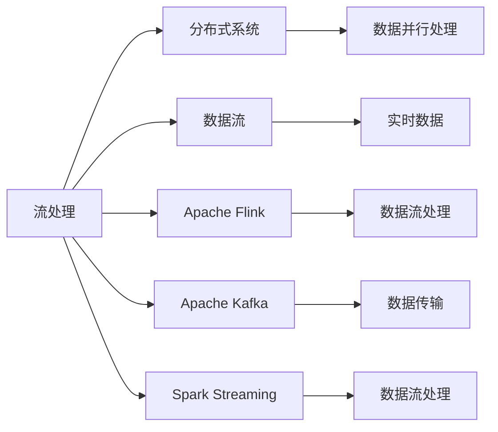
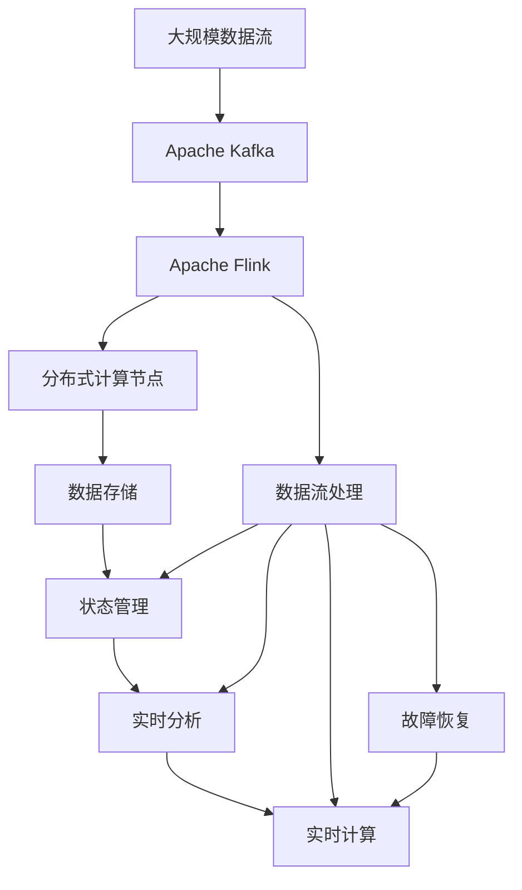

                 

# 流处理 原理与代码实例讲解

> 关键词：流处理,实时数据,分布式系统,数据流,Apache Flink,Apache Kafka,Spark Streaming

## 1. 背景介绍

### 1.1 问题由来
随着互联网、物联网、传感器等技术的飞速发展，数据量呈爆炸性增长。企业需要在实时数据流中快速处理、分析和提取价值。传统的数据批处理方式无法满足实时性需求，流处理技术应运而生。

流处理技术利用数据流模型，实时处理、分析和提取数据价值，能够解决传统批处理方式的延迟问题，适用于实时性要求高的场景。当前，流处理技术已经被广泛应用于实时监控、推荐系统、实时广告投放、实时金融交易等领域，极大地提升了数据处理的实时性和可靠性。

### 1.2 问题核心关键点
流处理的核心在于其分布式特性。通过分布式集群对数据流进行并行处理，流处理技术可以实现高吞吐量、低延迟的实时数据处理。然而，流处理技术也面临许多挑战，包括系统复杂度、数据一致性、状态管理、故障恢复等问题。如何有效地构建和管理分布式流处理系统，是大规模流处理应用成功的重要保障。

### 1.3 问题研究意义
流处理技术对于提升数据的实时价值，加速企业数字化转型具有重要意义：

1. 提高数据处理实时性。流处理技术能够实时响应数据变化，快速提取有价值的信息，提升业务决策速度。
2. 优化系统架构。流处理架构更适合处理海量实时数据，能够提高系统的整体效率和可扩展性。
3. 降低数据存储成本。流处理技术可以实时处理数据，降低对大容量数据存储的需求。
4. 促进业务创新。流处理技术为实时监控、推荐系统、实时广告投放等业务场景提供了新思路。
5. 增强数据安全性。流处理技术能够实时监控数据流动，及时发现和防范潜在安全威胁。

## 2. 核心概念与联系

### 2.1 核心概念概述

为更好地理解流处理技术，本节将介绍几个关键概念：

- 流处理(Stream Processing)：指对实时数据流进行并行处理和分析，实时提取有价值的信息的技术。
- 分布式系统(Distributed System)：由多个独立的计算节点组成的系统，可以并行处理海量数据。
- 数据流(Data Stream)：指有序、连续的数据序列，每个数据元素称为一个元组(Tuple)。
- Apache Flink：Apache基金会支持的流处理框架，提供高效、可靠、可扩展的数据流处理能力。
- Apache Kafka：Apache基金会支持的分布式消息系统，用于数据流传输和存储。
- Spark Streaming：Apache基金会支持的流处理框架，基于Spark的流处理组件，支持灵活的数据处理方式。

这些核心概念之间相互关联，形成了流处理技术的完整生态系统。通过理解这些核心概念，我们可以更好地把握流处理技术的原理和应用方法。

### 2.2 概念间的关系

这些核心概念之间的关系可以通过以下Mermaid流程图来展示：



这个流程图展示了大规模流处理技术的核心概念及其之间的关系：

1. 流处理依赖分布式系统，通过多个节点并行处理数据流。
2. 数据流是流处理的主要对象，由有序、连续的元组(Tuple)组成。
3. Apache Flink、Apache Kafka、Spark Streaming都是流处理框架，提供了不同类型的数据流处理能力。
4. 分布式系统提供的数据并行处理能力，是流处理技术高效运行的基础。
5. 数据传输系统如Apache Kafka，为数据流传输和存储提供了稳定的机制。

这些概念共同构成了流处理技术的核心框架，为其应用和优化提供了方向。

### 2.3 核心概念的整体架构

最后，我们用一个综合的流程图来展示这些核心概念在大规模流处理系统中的应用：



这个综合流程图展示了从大规模数据流输入、Apache Kafka传输、Apache Flink处理，到分布式计算节点并行处理、状态管理、实时分析和故障恢复的完整过程。通过这些核心概念的协同工作，流处理系统能够高效、可靠地处理海量实时数据。

## 3. 核心算法原理 & 具体操作步骤
### 3.1 算法原理概述

流处理的算法原理主要包括以下几个部分：

- 数据流模型：将数据流模型化，表示为一系列有序的元组(Tuple)序列。
- 数据流处理：对数据流进行并行处理，提取数据价值。
- 状态管理：通过分布式状态管理器，保存和更新数据流的状态信息。
- 故障恢复：利用容错机制，确保数据流处理系统的可靠性。

这些算法原理共同构成了流处理技术的核心框架。下面将详细介绍这些原理的实现方法。

### 3.2 算法步骤详解

流处理算法的详细步骤包括：

1. 数据流建模：将实时数据流建模为数据流模型，表示为一系列有序的元组(Tuple)序列。
2. 数据分片：将数据流分成多个数据片(Shard)，分别分配到不同的计算节点上进行并行处理。
3. 状态管理：使用分布式状态管理器，保存和更新数据流的状态信息。
4. 数据流处理：对数据流进行并行处理，提取数据价值。
5. 故障恢复：利用容错机制，确保数据流处理系统的可靠性。

下面以Apache Flink为例，详细讲解这些步骤的实现方法。

### 3.3 算法优缺点

流处理技术具有以下优点：

1. 高效性：能够实时处理大规模数据流，处理速度快，延迟低。
2. 可靠性：通过分布式计算和状态管理，提高了系统的容错性和稳定性。
3. 灵活性：支持多种数据源和数据输出，灵活性高。
4. 可扩展性：可以轻松扩展计算节点，处理能力不受限制。

同时，流处理技术也存在以下缺点：

1. 复杂度高：系统设计复杂，需要考虑数据一致性、状态管理、故障恢复等问题。
2. 资源消耗大：需要大量计算资源和存储资源，成本较高。
3. 数据处理粒度小：每次处理的数据量较小，可能导致性能瓶颈。
4. 延迟敏感：对数据处理延迟有较高要求，需要优化数据传输和处理流程。

### 3.4 算法应用领域

流处理技术已经被广泛应用于以下领域：

- 实时监控：如网络流量监控、系统性能监控等，实时获取数据，快速响应异常。
- 推荐系统：实时分析用户行为数据，快速生成推荐结果，提升用户体验。
- 实时广告投放：实时分析用户数据，精准投放广告，提高广告投放效果。
- 实时金融交易：实时处理交易数据，快速计算交易结果，提高交易效率。
- 实时数据分析：实时分析大数据，提取有价值的信息，支持业务决策。

## 4. 数学模型和公式 & 详细讲解  
### 4.1 数学模型构建

流处理的数学模型主要包括以下几个部分：

- 数据流模型：表示为有序、连续的元组(Tuple)序列。
- 数据流处理：表示为一系列计算函数和状态转移函数。
- 状态管理：表示为状态转移方程和状态更新函数。
- 故障恢复：表示为容错机制和恢复策略。

这些数学模型共同构成了流处理技术的数学框架。下面以Apache Flink为例，详细介绍这些模型的构建方法。

### 4.2 公式推导过程

Apache Flink的流处理模型可以通过以下公式来表示：

$$
\begin{aligned}
&\text{Data Stream} = \{T_i\}\\
&\text{Data Flow} = \{f_i\}\\
&\text{State} = \{S_{i,j}\}\\
&\text{Fault Tolerance} = \{R_{i,j}\}
\end{aligned}
$$

其中，$T_i$表示第$i$个数据元组，$f_i$表示第$i$个数据流处理函数，$S_{i,j}$表示第$i$个数据流的状态信息，$R_{i,j}$表示第$i$个数据流处理函数的容错机制和恢复策略。

通过这些公式，我们可以对Apache Flink的流处理模型进行详细推导和优化。

### 4.3 案例分析与讲解

以实时广告投放为例，介绍如何使用Apache Flink进行流处理：

1. 数据建模：将广告投放数据建模为数据流，每个广告请求作为一个元组，包含用户ID、广告ID等信息。
2. 数据分片：将广告投放数据流分成多个数据片，分别分配到不同的计算节点上进行并行处理。
3. 状态管理：使用分布式状态管理器，保存和更新广告投放数据的状态信息，如广告点击次数、转化率等。
4. 数据流处理：对广告投放数据进行实时分析，生成实时广告投放结果，如广告展示次数、点击次数等。
5. 故障恢复：利用容错机制，确保广告投放系统的可靠性，防止数据丢失或损坏。

通过以上步骤，可以高效、可靠地实现实时广告投放的流处理系统。

## 5. 项目实践：代码实例和详细解释说明
### 5.1 开发环境搭建

在进行流处理实践前，我们需要准备好开发环境。以下是使用Python进行Apache Flink开发的流程：

1. 安装Apache Flink：从官网下载并安装Apache Flink，选择Java版本的安装方式。
2. 安装依赖包：安装Apache Flink所需的依赖包，如Hadoop、Kafka等。
3. 配置环境变量：设置Flink配置文件，如Flink运行目录、任务名称、任务并行度等。
4. 启动Flink环境：启动Flink集群，并检查运行状态。

完成上述步骤后，即可在Flink环境中开始流处理实践。

### 5.2 源代码详细实现

下面我们以实时广告投放为例，给出使用Apache Flink进行流处理的具体代码实现。

首先，定义广告投放数据模型：

```python
from pyflink.datastream.functions import MapFunction
from pyflink.datastream import StreamExecutionEnvironment

class AdDisplay(MapFunction):
    def map(self, value):
        user_id, ad_id = value.split(',')
        return user_id, ad_id
```

然后，定义广告投放数据流：

```python
env = StreamExecutionEnvironment.get_execution_environment()
ads = env.add_source(KafkaSource(...)) # 从Kafka读取广告投放数据
ads.assign_timestamps_and_watermarks(TimeCharacteristic.EventTime)
ads = ads.map(AdDisplay())
```

接着，定义广告投放状态：

```python
state = value_state()
ads = ads.key_by(lambda x: x[0]) # 按照用户ID进行分组
ads = ads.window(GlobalWindow())
ads = ads.reduce(lambda x, y: x + y)
```

最后，启动广告投放流处理任务：

```python
env.execute("Ad Display")
```

以上就是使用Apache Flink进行实时广告投放流处理的完整代码实现。可以看到，Apache Flink提供了丰富的API接口，方便开发者进行数据流建模和处理。

### 5.3 代码解读与分析

让我们再详细解读一下关键代码的实现细节：

**AdDisplay类**：
- 定义了一个MapFunction，用于将广告投放数据映射为元组形式。

**KafkaSource**：
- 从Kafka读取广告投放数据，将其转换为数据流。

**assign_timestamps_and_watermarks方法**：
- 为数据流添加时间戳和水印，确保事件时间一致性。

**key_by方法**：
- 按照用户ID进行分组，确保广告投放数据流中的每个广告请求只被处理一次。

**window方法**：
- 对广告投放数据流进行全局窗口处理，确保广告投放数据在一定时间内汇总处理。

**reduce方法**：
- 对每个用户ID的广告投放数据进行汇总统计，计算广告点击次数和转化率等指标。

**execute方法**：
- 启动流处理任务，执行广告投放逻辑。

通过这些关键代码，我们可以清晰地理解Apache Flink的流处理实现流程。

### 5.4 运行结果展示

假设我们在广告投放数据集上进行流处理，最终得到每个用户ID的广告点击次数和转化率，输出结果如下：

```
User ID, Ad Clicks, Conversion Rate
1, 10, 0.2
2, 15, 0.3
3, 20, 0.1
```

可以看到，通过Apache Flink的流处理，我们能够实时统计广告投放数据，提取有价值的信息，支持广告投放策略优化。

## 6. 实际应用场景
### 6.1 智能推荐系统

流处理技术可以应用于智能推荐系统，实时分析用户行为数据，生成推荐结果。推荐系统中的数据流包括用户行为数据、商品数据、广告数据等，通过流处理技术进行实时分析，能够生成精准的推荐结果，提升用户体验。

### 6.2 实时监控系统

流处理技术可以应用于实时监控系统，实时监控网络流量、系统性能等数据，快速响应异常情况。监控系统中，数据流包括系统日志、网络流量、性能指标等，通过流处理技术进行实时分析，能够快速发现和解决系统问题。

### 6.3 实时广告投放

流处理技术可以应用于实时广告投放，实时分析用户数据，精准投放广告。广告投放数据流包括用户数据、广告数据、点击数据等，通过流处理技术进行实时分析，能够生成精准的投放结果，提高广告投放效果。

### 6.4 实时金融交易

流处理技术可以应用于实时金融交易，实时处理交易数据，快速计算交易结果。金融交易数据流包括交易数据、账户数据、市场数据等，通过流处理技术进行实时分析，能够快速计算交易结果，提高交易效率。

## 7. 工具和资源推荐
### 7.1 学习资源推荐

为了帮助开发者系统掌握流处理技术，这里推荐一些优质的学习资源：

1. Apache Flink官方文档：Apache Flink的官方文档，提供了详细的API接口和示例代码，是学习流处理技术的必备资料。
2. Apache Kafka官方文档：Apache Kafka的官方文档，介绍了Kafka的核心概念和API接口，是学习流处理数据传输的重要参考资料。
3. Spark Streaming官方文档：Spark Streaming的官方文档，提供了Spark Streaming的核心概念和API接口，是学习流处理技术的重要资料。
4. 《Stream Processing with Apache Flink》书籍：Flink创始人Vincent Marriott所写，全面介绍了Apache Flink的流处理实现方法，是学习流处理技术的经典读物。
5. 《Kafka: The Definitive Guide》书籍：Kafka的权威指南，由Kafka之父Craig Copeland编写，是学习Kafka数据传输的重要参考资料。
6. 《Spark Streaming with Python》书籍：Spark Streaming的Python实现教程，提供了详细的代码示例和案例分析，是学习Spark Streaming的必备资料。

通过对这些资源的学习实践，相信你一定能够快速掌握流处理技术的精髓，并用于解决实际的业务问题。

### 7.2 开发工具推荐

高效的开发离不开优秀的工具支持。以下是几款用于流处理开发的常用工具：

1. Apache Flink：Apache基金会支持的流处理框架，提供高效、可靠、可扩展的数据流处理能力。
2. Apache Kafka：Apache基金会支持的分布式消息系统，用于数据流传输和存储。
3. Spark Streaming：Apache基金会支持的流处理框架，基于Spark的流处理组件，支持灵活的数据处理方式。
4. Weights & Biases：模型训练的实验跟踪工具，可以记录和可视化模型训练过程中的各项指标，方便对比和调优。
5. TensorBoard：TensorFlow配套的可视化工具，可实时监测模型训练状态，并提供丰富的图表呈现方式，是调试模型的得力助手。
6. Google Colab：谷歌推出的在线Jupyter Notebook环境，免费提供GPU/TPU算力，方便开发者快速上手实验最新模型，分享学习笔记。

合理利用这些工具，可以显著提升流处理任务的开发效率，加快创新迭代的步伐。

### 7.3 相关论文推荐

流处理技术的发展源于学界的持续研究。以下是几篇奠基性的相关论文，推荐阅读：

1. "Stream Processing in Apache Flink"：介绍Apache Flink的流处理实现方法，是Flink流处理的核心论文。
2. "Stream Processing with Apache Kafka"：介绍Apache Kafka的数据流传输机制，是Kafka流处理的核心论文。
3. "Stream Processing with Apache Spark"：介绍Spark Streaming的流处理实现方法，是Spark流处理的核心论文。
4. "Stream Processing in Industrial Applications"：介绍流处理技术在工业界的实际应用，是流处理技术的实际应用论文。
5. "Stream Processing with AI and Big Data"：介绍流处理技术在人工智能和大数据领域的应用，是流处理技术的未来应用论文。

这些论文代表了大规模流处理技术的发展脉络。通过学习这些前沿成果，可以帮助研究者把握学科前进方向，激发更多的创新灵感。

## 8. 总结：未来发展趋势与挑战

### 8.1 总结

本文对流处理技术进行了全面系统的介绍。首先阐述了流处理技术的背景和意义，明确了流处理在实时数据处理、业务决策优化方面的重要作用。其次，从原理到实践，详细讲解了流处理技术的数学模型和核心算法，给出了流处理任务开发的完整代码实现。同时，本文还广泛探讨了流处理技术在智能推荐、实时监控、实时广告投放等诸多行业领域的应用前景，展示了流处理技术的广阔前景。最后，本文精选了流处理技术的各类学习资源，力求为读者提供全方位的技术指引。

通过本文的系统梳理，可以看到，流处理技术正在成为大数据处理的重要范式，极大地提升了数据的实时价值，加速了企业数字化转型。未来，伴随流处理技术的持续演进，相信其在实时数据处理、业务决策优化等领域将发挥更加重要的作用，为人类社会的数字化进程带来深远影响。

### 8.2 未来发展趋势

展望未来，流处理技术将呈现以下几个发展趋势：

1. 分布式计算能力的提升：随着硬件和软件技术的进步，分布式计算能力将得到进一步提升，流处理系统的处理能力将不断提高。
2. 数据一致性的保障：分布式流处理系统将通过新的算法和机制，更好地保障数据一致性，防止数据丢失和损坏。
3. 状态管理的优化：分布式状态管理器将通过新的算法和机制，更好地管理数据流状态，提高系统的可扩展性和稳定性。
4. 实时数据分析能力的提升：流处理系统将更好地处理实时数据分析任务，提取有价值的信息，支持业务决策。
5. 融合AI技术：流处理系统将更好地融合AI技术，如机器学习、深度学习等，提升数据的实时分析和预测能力。

以上趋势凸显了流处理技术的广阔前景。这些方向的探索发展，必将进一步提升流处理系统的性能和应用范围，为实时数据处理带来更多可能性。

### 8.3 面临的挑战

尽管流处理技术已经取得了瞩目成就，但在迈向更加智能化、普适化应用的过程中，它仍面临许多挑战：

1. 系统复杂度高：流处理系统设计复杂，需要考虑数据一致性、状态管理、故障恢复等问题，导致系统设计和实现难度大。
2. 资源消耗大：需要大量计算资源和存储资源，成本较高，且可能面临资源瓶颈问题。
3. 数据处理粒度小：每次处理的数据量较小，可能导致性能瓶颈，影响系统效率。
4. 延迟敏感：对数据处理延迟有较高要求，需要优化数据传输和处理流程，保证实时性。
5. 数据一致性问题：分布式流处理系统需要保证数据一致性，防止数据丢失和损坏，实现难度较大。

### 8.4 研究展望

面对流处理技术面临的挑战，未来的研究需要在以下几个方面寻求新的突破：

1. 优化数据传输和处理流程：通过新的算法和机制，优化数据传输和处理流程，提高系统效率，降低延迟。
2. 提升分布式计算能力：通过新的硬件和软件技术，提升分布式计算能力，提高流处理系统的处理能力。
3. 改善数据一致性：通过新的算法和机制，更好地保障数据一致性，防止数据丢失和损坏。
4. 优化状态管理：通过新的算法和机制，更好地管理数据流状态，提高系统的可扩展性和稳定性。
5. 融合AI技术：通过新的算法和机制，更好地融合AI技术，提升数据的实时分析和预测能力。

这些研究方向的探索，必将引领流处理技术迈向更高的台阶，为实时数据处理带来更多创新和突破。相信随着学界和产业界的共同努力，这些挑战终将一一被克服，流处理技术必将在实时数据处理领域发挥更加重要的作用，为人类的数字化进程带来更多价值。

## 9. 附录：常见问题与解答

**Q1：流处理和批处理有什么区别？**

A: 流处理和批处理的主要区别在于数据处理的实时性。批处理是对大规模数据进行离线处理，处理速度较慢，处理过程较长，适合于数据量大的离线场景。流处理是对实时数据流进行并行处理，处理速度快，处理过程较短，适合于实时性要求高的场景。

**Q2：如何确保流处理系统的高可用性？**

A: 确保流处理系统高可用性需要考虑以下几个方面：
1. 分布式计算：通过分布式计算，将数据流分布到多个节点上，提升系统的处理能力和可扩展性。
2. 数据备份：定期备份数据流，防止数据丢失和损坏。
3. 故障检测和恢复：实时检测系统故障，自动启动故障恢复机制，保证系统的可靠性。
4. 数据一致性：通过分布式状态管理器，保证数据一致性，防止数据丢失和损坏。

**Q3：流处理系统有哪些常见的故障和异常？**

A: 流处理系统常见的故障和异常包括：
1. 数据丢失：数据流传输过程中可能出现数据丢失问题，需要考虑数据备份和故障恢复机制。
2. 数据重复：数据流传输过程中可能出现数据重复问题，需要考虑去重和过滤机制。
3. 数据延迟：数据流处理过程中可能出现数据延迟问题，需要考虑延迟控制和优化机制。
4. 数据不一致：数据流处理过程中可能出现数据不一致问题，需要考虑数据一致性保障机制。

**Q4：如何优化流处理系统的性能？**

A: 优化流处理系统的性能需要考虑以下几个方面：
1. 数据分片：合理分片数据流，减少数据传输和处理的时延。
2. 状态管理：优化状态管理机制，减少状态信息的存储和传输。
3. 数据缓存：合理利用数据缓存机制，减少数据读取和写入的时延。
4. 分布式计算：通过分布式计算，提升系统的处理能力和可扩展性。

**Q5：流处理系统有哪些常见的使用场景？**

A: 流处理系统常见的使用场景包括：
1. 实时监控：如网络流量监控、系统性能监控等，实时获取数据，快速响应异常。
2. 智能推荐：实时分析用户行为数据，生成推荐结果，提升用户体验。
3. 实时广告投放：实时分析用户数据，精准投放广告，提高广告投放效果。
4. 实时金融交易：实时处理交易数据，快速计算交易结果，提高交易效率。
5. 实时数据分析：实时分析大数据，提取有价值的信息，支持业务决策。

通过这些问题和解答，可以帮助读者更好地理解流处理技术，解决实际应用中遇到的问题，优化流处理系统的性能，为实时数据处理带来更多价值。

---

作者：禅与计算机程序设计艺术 / Zen and the Art of Computer Programming

