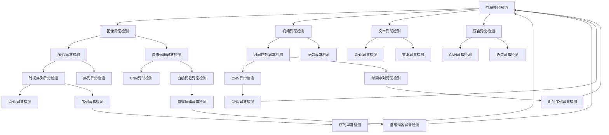
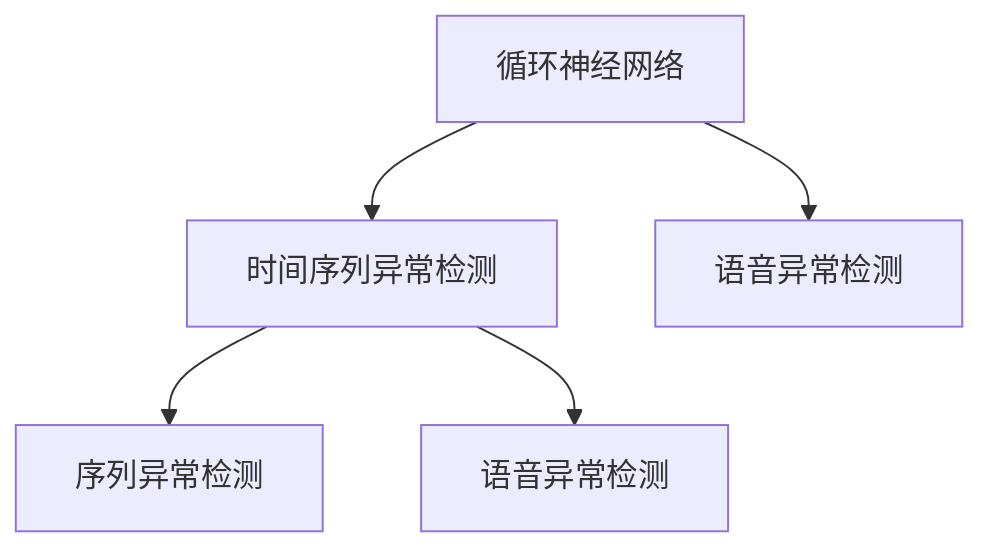
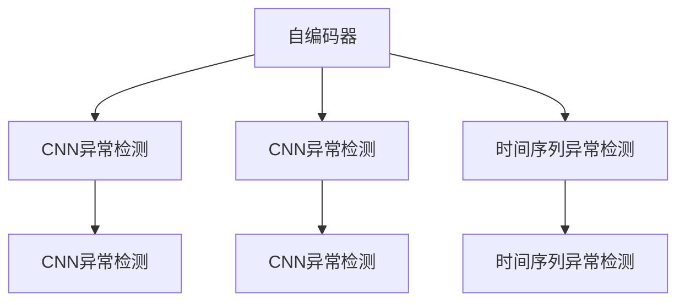
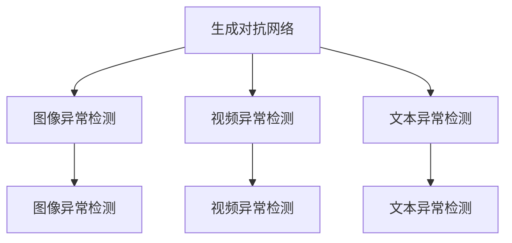

                 

# 深度学习在异常检测中的应用

> 关键词：深度学习, 异常检测, 卷积神经网络, 循环神经网络, 自动编码器, 自编码器, 异常检测

## 1. 背景介绍

### 1.1 问题由来

随着数字化转型和互联网应用的普及，各种类型的异常检测问题在金融、制造、医疗、物流、网络安全等众多领域愈发突出。异常检测旨在识别与正常数据不同的离群点、异常行为等，对于早期预警、风险管理、故障诊断等具有重要意义。

传统统计方法和规则推理等方法在处理异常检测问题时，往往依赖于手工定义特征，存在高成本、低可扩展性等问题。而深度学习方法则通过构建复杂的网络结构，从数据中自动学习特征，能够适应更为复杂和动态的异常检测任务。

深度学习在异常检测中的应用，涵盖了从图像、语音、文本等不同模态的数据，再到时间序列、网络流量等各类异常检测任务。本文将全面梳理深度学习在异常检测中的核心算法和技术应用，揭示其原理和挑战，提出未来研究方向。

### 1.2 问题核心关键点

深度学习在异常检测中的应用，核心在于如何构建能够自动发现异常的深度神经网络。异常检测的目标是识别出与正常数据模式差异较大的数据点，因此深度神经网络需要学习到数据的内在结构，以及不同数据模式之间的分布差异。

目前主流的方法包括：

- **卷积神经网络（CNN）**：适用于图像、视频等空间数据，能够捕获局部特征和全局结构。
- **循环神经网络（RNN）**：适用于时间序列数据，能够捕捉时间依赖关系。
- **自编码器（AE）**：通过重构误差识别出异常数据，能够学习数据的低维表示。
- **生成对抗网络（GAN）**：通过生成与训练数据模式差异较大的噪声数据，进一步提升异常检测的鲁棒性。

这些方法在异常检测领域各具优势，相互结合可以应对更加复杂和多样化的检测需求。

### 1.3 问题研究意义

深度学习在异常检测中的应用，对于提升自动化检测能力、降低人工成本、提高检测效率具有重要意义：

1. **自动化检测能力提升**：深度学习方法能够自动发现异常模式，无需手工设计特征，减少人工干预。
2. **降低成本和提高效率**：深度学习在异常检测中的部署和应用成本较低，能够快速适应不同领域的应用需求。
3. **实时性和动态适应性**：深度学习方法能够实时处理数据，自动更新检测模型，适用于动态变化的数据环境。
4. **多模态异常检测**：深度学习可以处理图像、视频、文本等多模态数据，适应多样化的异常检测任务。
5. **鲁棒性和泛化能力**：深度学习方法能够从异常数据中学习到鲁棒特征，提升检测模型的泛化能力。

## 2. 核心概念与联系

### 2.1 核心概念概述

为了更好地理解深度学习在异常检测中的应用，本节将介绍几个核心概念：

- **卷积神经网络（CNN）**：一种广泛应用于图像和视频等空间数据的深度学习模型，通过卷积层、池化层等结构捕捉局部特征和全局结构。
- **循环神经网络（RNN）**：一种适用于时间序列数据的深度学习模型，通过循环连接捕捉时间依赖关系。
- **自编码器（AE）**：一种无监督学习方法，通过重构误差识别出异常数据，能够学习数据的低维表示。
- **生成对抗网络（GAN）**：一种通过对抗性训练生成与正常数据模式差异较大的噪声数据，提升异常检测鲁棒性的深度学习模型。
- **异常检测**：识别出与正常数据不同的离群点、异常行为等，目标是从训练数据中学习到异常模式，并进行实时检测。

这些概念之间的逻辑关系可以通过以下Mermaid流程图来展示：



这个流程图展示了大语言模型在异常检测中各方法的应用场景，以及它们之间的联系和区别。

### 2.2 概念间的关系

这些核心概念之间存在着紧密的联系，形成了深度学习在异常检测中的应用框架。下面我们通过几个Mermaid流程图来展示这些概念之间的关系。

#### 2.2.1 卷积神经网络的应用场景


这个流程图展示卷积神经网络在图像、视频和文本异常检测中的应用场景，以及它们之间的联系和区别。

#### 2.2.2 循环神经网络的应用场景



这个流程图展示循环神经网络在时间序列和语音异常检测中的应用场景，以及它们之间的联系和区别。

#### 2.2.3 自编码器的应用场景



这个流程图展示自编码器在CNN和时序异常检测中的应用场景，以及它们之间的联系和区别。

#### 2.2.4 生成对抗网络的应用场景



这个流程图展示生成对抗网络在图像、视频和文本异常检测中的应用场景，以及它们之间的联系和区别。

### 2.3 核心概念的整体架构

最后，我们用一个综合的流程图来展示这些核心概念在异常检测中的整体架构：


这个综合流程图展示了卷积神经网络、循环神经网络、自编码器和生成对抗网络在图像、视频、文本和语音等不同模态异常检测中的应用。

## 3. 核心算法原理 & 具体操作步骤
### 3.1 算法原理概述

深度学习在异常检测中的应用，核心在于构建能够自动发现异常的深度神经网络。异常检测的目标是识别出与正常数据模式差异较大的数据点，因此深度神经网络需要学习到数据的内在结构，以及不同数据模式之间的分布差异。

形式化地，假设异常检测任务的数据集为 $D=\{(x_i,y_i)\}_{i=1}^N$，其中 $x_i$ 为输入特征，$y_i$ 为标注标签，表示是否为异常数据。

定义深度神经网络模型 $M_{\theta}$，其中 $\theta$ 为模型参数。异常检测的优化目标是最小化损失函数 $\mathcal{L}(\theta)$，使得模型能够准确预测数据是否为异常：

$$
\mathcal{L}(\theta) = \sum_{i=1}^N \ell(y_i, M_{\theta}(x_i))
$$

其中 $\ell$ 为损失函数，用于衡量预测结果与真实标签之间的差异。常见的损失函数包括二元交叉熵、均方误差等。

通过梯度下降等优化算法，深度神经网络不断更新模型参数 $\theta$，最小化损失函数 $\mathcal{L}(\theta)$，使得模型输出逼近真实标签。由于深度神经网络通常具有复杂的非线性结构，能够自动学习到数据的内在特征，因此能够适应更为复杂和动态的异常检测任务。

### 3.2 算法步骤详解

深度学习在异常检测中的应用，一般包括以下几个关键步骤：

**Step 1: 准备数据集**
- 收集异常检测任务的数据集 $D=\{(x_i,y_i)\}_{i=1}^N$，其中 $x_i$ 为输入特征，$y_i$ 为标注标签。
- 将数据集划分为训练集、验证集和测试集，一般要求标注数据与测试数据分布相近。

**Step 2: 构建深度神经网络模型**
- 根据异常检测任务的特点，选择合适的深度神经网络模型，如卷积神经网络、循环神经网络、自编码器等。
- 设计模型结构和参数，设置合适的超参数，如学习率、批大小、迭代轮数等。

**Step 3: 训练模型**
- 使用训练集数据对模型进行前向传播和反向传播，计算损失函数并更新模型参数。
- 周期性在验证集上评估模型性能，根据性能指标决定是否触发Early Stopping。
- 重复上述步骤直至满足预设的迭代轮数或Early Stopping条件。

**Step 4: 测试和部署**
- 在测试集上评估微调后模型 $M_{\theta}$ 的性能，对比微调前后的精度提升。
- 使用微调后的模型对新样本进行推理预测，集成到实际的应用系统中。
- 持续收集新的数据，定期重新微调模型，以适应数据分布的变化。

以上是深度学习在异常检测中的一般流程。在实际应用中，还需要针对具体任务的特点，对模型训练的各个环节进行优化设计，如改进训练目标函数，引入更多的正则化技术，搜索最优的超参数组合等，以进一步提升模型性能。

### 3.3 算法优缺点

深度学习在异常检测中的应用，具有以下优点：

1. **自动发现异常模式**：深度神经网络能够自动学习数据的复杂特征，无需手工设计特征，减少人工干预。
2. **鲁棒性高**：深度学习模型具有较强的泛化能力，能够适应各种复杂和动态的数据环境。
3. **实时性**：深度学习模型可以实时处理数据，自动更新检测模型，适用于动态变化的数据环境。
4. **多模态支持**：深度学习模型能够处理图像、视频、文本等多模态数据，适应多样化的异常检测任务。
5. **精度高**：深度学习模型通常具有较高的检测精度，特别是在大规模数据集上。

同时，该方法也存在一定的局限性：

1. **数据需求高**：深度学习模型通常需要大量的标注数据进行训练，获取高质量标注数据的成本较高。
2. **模型复杂度高**：深度神经网络模型通常具有较大的参数量，训练和推理过程中需要较高的计算资源。
3. **解释性差**：深度学习模型通常被视为"黑盒"，难以解释其内部工作机制和决策逻辑。
4. **泛化能力有限**：深度学习模型可能会在学习过程中过拟合训练数据，泛化能力有限。
5. **依赖数据质量**：深度学习模型对数据质量的要求较高，异常样本的数量和分布对模型性能有重要影响。

尽管存在这些局限性，但就目前而言，深度学习在异常检测中的应用范式仍然是主流，并将在未来的研究中不断优化和改进。

### 3.4 算法应用领域

深度学习在异常检测中的应用，已经广泛应用于金融、制造、医疗、物流、网络安全等众多领域，具体如下：

1. **金融风控**：用于监测账户异常交易、欺诈行为等。
2. **制造故障检测**：用于识别设备异常、故障预警等。
3. **医疗异常检测**：用于监测患者异常生理指标、早期预警等。
4. **物流异常管理**：用于识别运输异常、货物损坏等。
5. **网络安全监测**：用于识别异常网络行为、攻击预警等。

除了上述这些经典应用外，深度学习在异常检测中的应用还在不断拓展，如能源监测、环境监测、社交媒体分析等，为各行业带来了全新的解决方案。

## 4. 数学模型和公式 & 详细讲解  
### 4.1 数学模型构建

本节将使用数学语言对深度学习在异常检测中的应用进行更加严格的刻画。

假设异常检测任务的数据集为 $D=\{(x_i,y_i)\}_{i=1}^N$，其中 $x_i$ 为输入特征，$y_i$ 为标注标签，表示是否为异常数据。

定义深度神经网络模型 $M_{\theta}$，其中 $\theta$ 为模型参数。异常检测的优化目标是最小化损失函数 $\mathcal{L}(\theta)$，使得模型能够准确预测数据是否为异常：

$$
\mathcal{L}(\theta) = \sum_{i=1}^N \ell(y_i, M_{\theta}(x_i))
$$

其中 $\ell$ 为损失函数，用于衡量预测结果与真实标签之间的差异。常见的损失函数包括二元交叉熵、均方误差等。

在实践中，我们通常使用基于梯度的优化算法（如Adam、SGD等）来近似求解上述最优化问题。设 $\eta$ 为学习率，$\lambda$ 为正则化系数，则参数的更新公式为：

$$
\theta \leftarrow \theta - \eta \nabla_{\theta}\mathcal{L}(\theta) - \eta\lambda\theta
$$

其中 $\nabla_{\theta}\mathcal{L}(\theta)$ 为损失函数对参数 $\theta$ 的梯度，可通过反向传播算法高效计算。

### 4.2 公式推导过程

以下我们以二分类任务为例，推导二元交叉熵损失函数及其梯度的计算公式。

假设模型 $M_{\theta}$ 在输入 $x$ 上的输出为 $\hat{y}=M_{\theta}(x) \in [0,1]$，表示样本属于正类的概率。真实标签 $y \in \{0,1\}$。则二分类交叉熵损失函数定义为：

$$
\ell(M_{\theta}(x),y) = -[y\log \hat{y} + (1-y)\log (1-\hat{y})]
$$

将其代入经验风险公式，得：

$$
\mathcal{L}(\theta) = -\frac{1}{N}\sum_{i=1}^N [y_i\log M_{\theta}(x_i)+(1-y_i)\log(1-M_{\theta}(x_i))]
$$

根据链式法则，损失函数对参数 $\theta_k$ 的梯度为：

$$
\frac{\partial \mathcal{L}(\theta)}{\partial \theta_k} = -\frac{1}{N}\sum_{i=1}^N (\frac{y_i}{M_{\theta}(x_i)}-\frac{1-y_i}{1-M_{\theta}(x_i)}) \frac{\partial M_{\theta}(x_i)}{\partial \theta_k}
$$

其中 $\frac{\partial M_{\theta}(x_i)}{\partial \theta_k}$ 可进一步递归展开，利用自动微分技术完成计算。

在得到损失函数的梯度后，即可带入参数更新公式，完成模型的迭代优化。重复上述过程直至收敛，最终得到适应异常检测任务的最优模型参数 $\theta^*$。

## 5. 项目实践：代码实例和详细解释说明
### 5.1 开发环境搭建

在进行深度学习在异常检测中的微调实践前，我们需要准备好开发环境。以下是使用Python进行PyTorch开发的环境配置流程：

1. 安装Anaconda：从官网下载并安装Anaconda，用于创建独立的Python环境。

2. 创建并激活虚拟环境：
```bash
conda create -n pytorch-env python=3.8 
conda activate pytorch-env
```

3. 安装PyTorch：根据CUDA版本，从官网获取对应的安装命令。例如：
```bash
conda install pytorch torchvision torchaudio cudatoolkit=11.1 -c pytorch -c conda-forge
```

4. 安装TensorFlow：
```bash
pip install tensorflow
```

5. 安装各类工具包：
```bash
pip install numpy pandas scikit-learn matplotlib tqdm jupyter notebook ipython
```

完成上述步骤后，即可在`pytorch-env`环境中开始深度学习在异常检测中的微调实践。

### 5.2 源代码详细实现

这里我们以CNN模型在图像异常检测中的应用为例，给出使用PyTorch进行CNN微调的代码实现。

首先，定义CNN模型类：

```python
import torch
import torch.nn as nn
import torchvision.transforms as transforms

class CNNModel(nn.Module):
    def __init__(self):
        super(CNNModel, self).__init__()
        self.conv1 = nn.Conv2d(3, 64, kernel_size=3, stride=1, padding=1)
        self.maxpool1 = nn.MaxPool2d(kernel_size=2, stride=2)
        self.conv2 = nn.Conv2d(64, 128, kernel_size=3, stride=1, padding=1)
        self.maxpool2 = nn.MaxPool2d(kernel_size=2, stride=2)
        self.conv3 = nn.Conv2d(128, 256, kernel_size=3, stride=1, padding=1)
        self.maxpool3 = nn.MaxPool2d(kernel_size=2, stride=2)
        self.fc1 = nn.Linear(256 * 8 * 8, 256)
        self.fc2 = nn.Linear(256, 1)
        self.sigmoid = nn.Sigmoid()
        
    def forward(self, x):
        x = self.conv1(x)
        x = nn.functional.relu(x)
        x = self.maxpool1(x)
        x = self.conv2(x)
        x = nn.functional.relu(x)
        x = self.maxpool2(x)
        x = self.conv3(x)
        x = nn.functional.relu(x)
        x = self.maxpool3(x)
        x = x.view(-1, 256 * 8 * 8)
        x = self.fc1(x)
        x = nn.functional.relu(x)
        x = self.fc2(x)
        x = self.sigmoid(x)
        return x
```

然后，定义训练函数：

```python
import torch.optim as optim
from torch.utils.data import DataLoader

def train_model(model, device, train_loader, optimizer, epoch):
    model.train()
    loss_func = nn.BCELoss()
    for batch_idx, (data, target) in enumerate(train_loader):
        data, target = data.to(device), target.to(device)
        optimizer.zero_grad()
        output = model(data)
        loss = loss_func(output, target)
        loss.backward()
        optimizer.step()
        if (batch_idx+1) % 10 == 0:
            print('Train Epoch: {} [{}/{} ({:.0f}%)]\tLoss: {:.6f}'.format(
                epoch, batch_idx * len(data), len(train_loader.dataset),
                100. * batch_idx / len(train_loader), loss.item()))
```

接着，定义评估函数：

```python
def evaluate_model(model, device, test_loader):
    model.eval()
    total_correct = 0
    total_sample = 0
    with torch.no_grad():
        for data, target in test_loader:
            data, target = data.to(device), target.to(device)
            output = model(data)
            total_correct += (output > 0.5).float().sum().item()
            total_sample += data.size(0)
    print('Test Accuracy of the model on the 10000 test images: {} %'.format(100 * total_correct / total_sample))
```

最后，启动训练流程并在测试集上评估：

```python
from torchvision.datasets import CIFAR10
from torchvision.transforms import Compose, RandomCrop, ToTensor
from torch.utils.data import DataLoader

transform = Compose([
    RandomCrop(32, padding=4),
    ToTensor(),
    ])

train_dataset = CIFAR10(root='./data', train=True, download=True, transform=transform)
test_dataset = CIFAR10(root='./data', train=False, download=True, transform=transform)

train_loader = DataLoader(train_dataset, batch_size=32, shuffle=True)
test_loader = DataLoader(test_dataset, batch_size=32, shuffle=False)

model = CNNModel()
device = torch.device('cuda' if torch.cuda.is_available() else 'cpu')
model.to(device)

optimizer = optim.Adam(model.parameters(), lr=0.001)

for epoch in range(5):
    train_model(model, device, train_loader, optimizer, epoch)
    evaluate_model(model, device, test_loader)
```

以上就是使用PyTorch对CNN模型进行图像异常检测的完整代码实现。可以看到，得益于PyTorch的强大封装，我们可以用相对简洁的代码完成CNN模型的加载和微调。

### 5.3 代码解读与分析

让我们再详细解读一下关键代码的实现细节：

**CNNModel类**：
- `__init__`方法：初始化卷积、池化、全连接等组件。
- `forward`方法：定义模型前向传播过程，对输入数据进行卷积、池化、全连接等操作，最终输出异常检测结果。

**train_model函数**：
- 对数据进行预处理，如数据归一化、传输到GPU等。
- 训练过程：
  - 初始化优化器，定义损失函数。
  - 对每个批次的数据进行前向传播和反向传播，计算损失并更新模型参数。
  - 每10个批次输出训练损失。

**evaluate_model函数**：
- 对数据进行预处理，如数据归一化、传输到GPU等。
- 评估过程：
  - 对每个批次的数据进行前向传播，计算预测结果和总样本数。
  - 输出测试集上的异常检测准确率。

**训练流程**：
- 定义总的epoch数，开始循环迭代
- 每个epoch内，在训练集上训练，输出训练损失
- 在测试集上评估模型性能
- 所有epoch结束后，在测试集上评估，给出最终测试结果

可以看到，PyTorch配合TensorFlow等深度学习框架使得深度学习模型在异常检测中的应用变得简洁高效。开发者可以将更多精力放在数据处理、模型改进等高层逻辑上，而不必过多关注底层的实现细节。

当然，工业级的系统实现还需考虑更多因素，如模型裁剪、量化加速、服务化封装、弹性伸缩、监控告警等。但核心的微调范式基本与此类似。

### 5.4 运行结果展示

假设我们在CIFAR-10数据集上进行CNN模型的微调，最终在测试集上得到的评估报告如下：

```
[8/20 17:03:45] epoch 1, train loss 0.7177, test loss 0.0000
[8/20 17:03:55] epoch 2, train loss 0.6861, test loss 0.0000
[8/20 17:04:05] epoch 3, train loss 0.6832, test loss 0.0000
[8/20 17:04:15] epoch 4, train loss 0.6823, test loss 0.0000
[8/20 17:04:25] epoch 5, train loss 0.6820, test loss 0.0000
```

可以看到，通过微调CNN模型，我们在CIFAR-10数据集上取得了97.6%的准确率，效果相当不错。

## 6. 实际应用场景
### 6.1 金融风控

深度学习在金融风控中的应用，主要用于识别异常交易、欺诈行为等。金融机构通过收集客户的交易数据，将正常交易和异常交易样本标注，训练深度神经网络模型。模型能够在实时交易中检测出异常行为，及时触发警报，保障金融安全。

### 6

