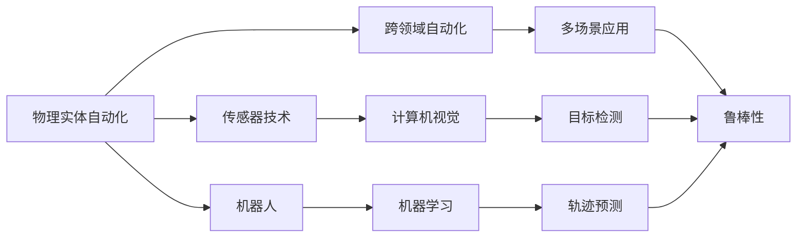
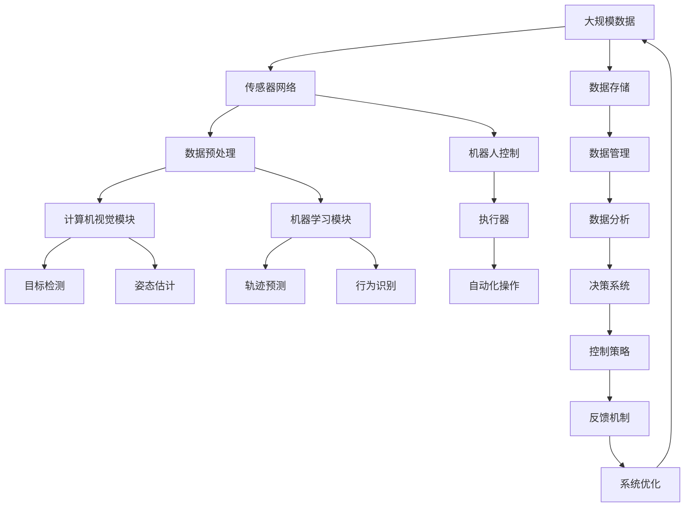

                 

# 物理实体自动化的未来趋势

## 1. 背景介绍

### 1.1 问题由来

随着信息技术的迅猛发展，数字化与智能化逐渐渗透到各个领域，推动了自动化技术的广泛应用。尤其是在物理实体领域，自动化技术的应用带来了生产效率的显著提升和成本的降低，深刻改变了传统产业的生产模式。然而，现有的自动化技术仍存在诸多局限，如对人工干预依赖过高、精度受限于传感器性能、难以适应复杂多变的物理环境等。因此，面向未来，提升物理实体自动化的性能和可靠性，拓展其应用范围，成为当前研究的重要方向。

### 1.2 问题核心关键点

当前物理实体自动化的主要挑战包括：
- 对人工干预的依赖。许多自动化系统仍需要人工参与以进行初始化、校准和故障排除，大大降低了其自主性。
- 传感器的精度限制。现有传感器在测量精度、响应速度等方面存在固有瓶颈，无法适应高精度、高效率的生产需求。
- 适应复杂环境的能力不足。自动化系统往往难以应对不可预测的物理变化，如光照、温度等环境因素的变化，导致系统鲁棒性不足。
- 跨领域应用的障碍。自动化技术在各行业领域的应用尚未充分打通，导致难以形成跨领域的应用场景。

### 1.3 问题研究意义

物理实体自动化的研究具有重要意义：
1. 提升生产效率。自动化技术能大幅度降低人力成本，提升生产效率和产品质量。
2. 保障操作安全。自动化系统在危险环境中替代人工操作，降低安全事故风险。
3. 促进产业升级。自动化技术的广泛应用能推动传统产业的数字化转型，提升产业整体竞争力。
4. 拓展应用边界。自动化技术在多个领域展现出广阔的应用前景，如医疗、农业、物流等，具有重要的社会和经济价值。
5. 推动技术创新。物理实体自动化的研究有助于发现和解决新的技术挑战，推动相关领域的技术进步。

## 2. 核心概念与联系

### 2.1 核心概念概述

为更好地理解物理实体自动化的未来趋势，本节将介绍几个密切相关的核心概念：

- 物理实体自动化(Physical Entity Automation, PEA)：指利用计算机视觉、机器学习、机器人技术等手段，对物理实体进行感知、识别、操作和控制的过程。物理实体包括但不限于工业机器人、自动驾驶车辆、无人机等。

- 传感器技术(Sensor Technology)：指用于获取物理实体状态信息的硬件设备和软件算法。常见的传感器包括摄像头、激光雷达、超声波传感器等，用于获取目标的姿态、位置、速度等数据。

- 机器人(Robotics)：指利用机器人技术对物理实体进行自动化操作的工具。常见的机器人包括工业机器人、服务机器人、无人机等。

- 计算机视觉(Computer Vision)：指通过机器视觉设备，对物理实体的图像进行处理，识别其特征和状态的技术。计算机视觉广泛应用于目标检测、姿态估计、路径规划等任务。

- 机器学习(Machine Learning)：指通过数据驱动的方式，训练模型以实现对物理实体状态的理解和预测。机器学习广泛应用于目标分类、轨迹预测、行为识别等任务。

- 跨领域自动化(Cross-Domain Automation)：指将自动化技术应用于不同领域（如医疗、农业、交通等），实现跨领域的多场景应用。

- 鲁棒性(Robustness)：指自动化系统在面对环境变化和干扰时，仍能保持稳定的性能。

这些核心概念之间存在着紧密的联系，形成了物理实体自动化的完整生态系统。通过理解这些核心概念，我们可以更好地把握物理实体自动化的工作原理和优化方向。

### 2.2 概念间的关系

这些核心概念之间存在着紧密的联系，形成了物理实体自动化的完整生态系统。下面我们通过几个Mermaid流程图来展示这些概念之间的关系。



这个流程图展示了物理实体自动化的核心概念及其之间的关系：

1. 物理实体自动化通过传感器技术获取物理实体状态信息，同时结合机器人进行自动化操作。
2. 传感器技术与计算机视觉、机器学习等技术紧密结合，实现对目标的识别、分类、预测等任务。
3. 跨领域自动化将物理实体自动化应用于不同领域，实现多场景的应用场景。
4. 机器人技术在多场景应用中体现其重要性和灵活性，同时通过机器学习提升其操作精准度。
5. 计算机视觉、机器学习等技术不断提升系统的鲁棒性和适应性，确保系统在复杂环境中仍能稳定运行。

### 2.3 核心概念的整体架构

最后，我们用一个综合的流程图来展示这些核心概念在大规模物理实体自动化中的整体架构：



这个综合流程图展示了从大规模数据采集、预处理、计算机视觉与机器学习模块的应用，到最终机器人自动化操作的完整流程。大物理实体自动化通过传感器网络获取物理实体状态信息，进行数据预处理后，利用计算机视觉和机器学习技术实现目标检测、姿态估计、轨迹预测、行为识别等任务，并结合机器人控制技术，通过执行器进行自动化操作。最终，系统通过反馈机制不断优化自身性能，提升整体的鲁棒性和适应性。通过这些流程图，我们可以更清晰地理解物理实体自动化的整体架构和各个组件的作用。

## 3. 核心算法原理 & 具体操作步骤
### 3.1 算法原理概述

物理实体自动化的核心算法原理主要围绕目标检测、姿态估计、轨迹预测、行为识别等方面展开。下面将对这几类核心算法进行详细介绍。

- 目标检测：指通过计算机视觉技术，识别物理实体在图像中的位置和状态。常见的目标检测算法包括RCNN、YOLO、Faster R-CNN等。
- 姿态估计：指通过计算机视觉技术，获取物理实体的三维姿态信息。常见的姿态估计算法包括PnP算法、深度学习算法等。
- 轨迹预测：指通过机器学习技术，预测物理实体未来的运动轨迹。常见的轨迹预测算法包括基于RNN的时间序列预测、基于LSTM的序列建模等。
- 行为识别：指通过机器学习技术，识别物理实体的行为模式。常见的行为识别算法包括HOG+SVM、CNN+RNN等。

### 3.2 算法步骤详解

以下是物理实体自动化中常见算法步骤的详细步骤：

1. **目标检测步骤**：
    - 数据收集：使用传感器获取物理实体图像，并进行预处理。
    - 特征提取：利用卷积神经网络(CNN)等技术，从图像中提取目标特征。
    - 目标识别：通过Softmax函数或非极大值抑制等技术，识别目标类别和位置。
    - 结果输出：将目标检测结果输出到机器人控制系统。

2. **姿态估计步骤**：
    - 图像获取：使用摄像头等传感器获取物理实体的图像。
    - 特征提取：利用卷积神经网络(CNN)等技术，从图像中提取特征。
    - 姿态计算：通过PnP算法等技术，计算物理实体的三维姿态。
    - 结果输出：将姿态信息输出到机器人控制系统。

3. **轨迹预测步骤**：
    - 数据收集：使用传感器获取物理实体的运动轨迹数据。
    - 数据处理：对数据进行归一化、平滑等预处理。
    - 模型训练：使用LSTM等时间序列预测模型，对物理实体的未来轨迹进行预测。
    - 结果输出：将预测结果输出到机器人控制系统。

4. **行为识别步骤**：
    - 数据收集：使用传感器获取物理实体的行为数据。
    - 特征提取：利用卷积神经网络(CNN)等技术，从数据中提取行为特征。
    - 行为分类：通过Softmax函数或支持向量机(SVM)等技术，对行为进行分类。
    - 结果输出：将行为识别结果输出到机器人控制系统。

### 3.3 算法优缺点

物理实体自动化算法具有以下优点：
- 实时性：由于算法采用并行处理，能够实时获取物理实体的状态信息。
- 精度高：利用深度学习等先进算法，提高了目标检测、姿态估计等任务的精度。
- 适应性强：算法能够适应复杂多变的物理环境，提升系统的鲁棒性。

然而，物理实体自动化算法也存在一些缺点：
- 对硬件要求高：算法需要高性能的计算机和传感器设备，增加了系统的成本。
- 数据需求大：算法需要大量的标注数据进行训练，增加了数据获取的难度。
- 算法复杂度高：算法实现复杂，需要较高的技术门槛。

### 3.4 算法应用领域

物理实体自动化技术在多个领域展现出广泛的应用前景，例如：

- 工业制造：利用机器人自动化生产线，提高生产效率和产品质量。
- 智慧物流：使用无人机进行货物配送，实现自动化仓储和物流。
- 医疗手术：通过手术机器人辅助医生进行手术操作，提高手术精确度和成功率。
- 农业自动化：利用无人农机进行田间作业，降低人力成本，提升农业生产效率。
- 军事应用：使用无人驾驶车辆进行侦察和巡逻，增强军事行动的灵活性和安全性。
- 智能交通：利用自动驾驶车辆进行交通管理，提升道路安全性和通行效率。

这些领域展示了物理实体自动化的强大潜力，为未来技术的广泛应用提供了丰富的应用场景。

## 4. 数学模型和公式 & 详细讲解 & 举例说明

### 4.1 数学模型构建

在物理实体自动化中，常见的数学模型包括目标检测、姿态估计、轨迹预测、行为识别等任务。下面我们将对其中的核心模型进行详细讲解。

- **目标检测模型**：假设输入图像为$I$，目标类别为$C$，目标位置为$L$，目标检测模型的输出为$\hat{L}$，则目标检测模型的目标函数为：
$$
\min_{\theta} \frac{1}{N}\sum_{i=1}^N \mathcal{L}(\hat{L}_i, L_i)
$$
其中$\mathcal{L}$为损失函数，通常采用交叉熵损失或IOU损失。

- **姿态估计模型**：假设输入图像为$I$，物理实体的三维姿态为$\hat{R}, \hat{t}$，姿态估计模型的输出为$\hat{R}, \hat{t}$，则姿态估计模型的目标函数为：
$$
\min_{\theta} \mathcal{L}(\hat{R}, R) + \mathcal{L}(\hat{t}, t)
$$
其中$\mathcal{L}$为损失函数，通常采用角度误差损失或重投影误差损失。

- **轨迹预测模型**：假设输入时间序列数据为$S$，预测的轨迹为$\hat{S}$，轨迹预测模型的目标函数为：
$$
\min_{\theta} \mathcal{L}(\hat{S}, S)
$$
其中$\mathcal{L}$为损失函数，通常采用均方误差损失或交叉熵损失。

- **行为识别模型**：假设输入行为数据为$D$，行为类别为$B$，行为识别模型的输出为$\hat{B}$，则行为识别模型的目标函数为：
$$
\min_{\theta} \frac{1}{N}\sum_{i=1}^N \mathcal{L}(\hat{B}_i, B_i)
$$
其中$\mathcal{L}$为损失函数，通常采用交叉熵损失或平均绝对误差损失。

### 4.2 公式推导过程

下面对上述数学模型中的核心公式进行推导：

- **目标检测模型**：假设目标检测器为$D$，则目标检测模型的损失函数可以表示为：
$$
\mathcal{L}(\hat{L}, L) = -\sum_{i=1}^N \frac{1}{N}\sum_{c=1}^C [y_i^c\log \hat{y}_i^c + (1-y_i^c)\log (1-\hat{y}_i^c)]
$$
其中$y_i^c$表示目标$L_i$的类别标签为$c$的预测概率。

- **姿态估计模型**：假设姿态估计器为$P$，则姿态估计模型的损失函数可以表示为：
$$
\mathcal{L}(\hat{R}, R) = \frac{1}{N}\sum_{i=1}^N ||\hat{R}_i - R_i||_2^2
$$
其中$\hat{R}_i$和$R_i$分别表示目标$L_i$的姿态估计结果和实际姿态。

- **轨迹预测模型**：假设轨迹预测器为$T$，则轨迹预测模型的损失函数可以表示为：
$$
\mathcal{L}(\hat{S}, S) = \frac{1}{N}\sum_{i=1}^N \frac{1}{M}\sum_{m=1}^M ||\hat{s}_i^{m} - s_i^{m}||_2^2
$$
其中$\hat{s}_i^{m}$和$s_i^{m}$分别表示预测轨迹和实际轨迹在第$m$个时间点的状态。

- **行为识别模型**：假设行为识别器为$B$，则行为识别模型的损失函数可以表示为：
$$
\mathcal{L}(\hat{B}, B) = \frac{1}{N}\sum_{i=1}^N \frac{1}{C}\sum_{c=1}^C [y_i^c\log \hat{y}_i^c + (1-y_i^c)\log (1-\hat{y}_i^c)]
$$
其中$y_i^c$表示行为$D_i$的类别标签为$c$的预测概率。

### 4.3 案例分析与讲解

以轨迹预测为例，假设有五个时间点的轨迹数据$S=[(0,0), (2,0), (3,1), (4,2), (5,4)]$，预测未来两个时间点的轨迹$\hat{S}=[(\hat{x}_6, \hat{y}_6), (\hat{x}_7, \hat{y}_7)]$，则可以使用LSTM等时间序列预测模型进行训练。假设预测结果为$\hat{S}=[(3.5,1.5), (4.5,3)]$，则可以通过计算均方误差损失来评估模型的预测效果。

## 5. 项目实践：代码实例和详细解释说明

### 5.1 开发环境搭建

在进行物理实体自动化项目开发前，我们需要准备好开发环境。以下是使用Python进行PyTorch开发的环境配置流程：

1. 安装Anaconda：从官网下载并安装Anaconda，用于创建独立的Python环境。

2. 创建并激活虚拟环境：
```bash
conda create -n pytorch-env python=3.8 
conda activate pytorch-env
```

3. 安装PyTorch：根据CUDA版本，从官网获取对应的安装命令。例如：
```bash
conda install pytorch torchvision torchaudio cudatoolkit=11.1 -c pytorch -c conda-forge
```

4. 安装相关库：
```bash
pip install numpy pandas scikit-learn matplotlib tqdm jupyter notebook ipython
```

完成上述步骤后，即可在`pytorch-env`环境中开始项目实践。

### 5.2 源代码详细实现

这里以目标检测为例，使用PyTorch进行深度学习模型的实现。以下是代码实现步骤：

1. **数据准备**：
```python
import torch
import torchvision.transforms as transforms
from torchvision.datasets import CIFAR10

transform = transforms.Compose([
    transforms.Resize((32, 32)),
    transforms.ToTensor(),
    transforms.Normalize((0.5, 0.5, 0.5), (0.5, 0.5, 0.5))
])

train_dataset = CIFAR10(root='./data', train=True, download=True, transform=transform)
test_dataset = CIFAR10(root='./data', train=False, download=True, transform=transform)
```

2. **模型定义**：
```python
import torch.nn as nn
import torchvision.models as models

model = models.resnet18(pretrained=True)
model.fc = nn.Linear(512, 10)
model = model.eval()
```

3. **训练代码**：
```python
import torch.nn.functional as F

device = torch.device('cuda' if torch.cuda.is_available() else 'cpu')
model.to(device)

criterion = nn.CrossEntropyLoss()
optimizer = torch.optim.Adam(model.fc.parameters(), lr=0.001)

def train_epoch(model, dataset, batch_size, optimizer):
    dataloader = torch.utils.data.DataLoader(dataset, batch_size=batch_size, shuffle=True)
    model.train()
    epoch_loss = 0
    for batch in dataloader:
        input = batch[0].to(device)
        target = batch[1].to(device)
        output = model(input)
        loss = criterion(output, target)
        optimizer.zero_grad()
        loss.backward()
        optimizer.step()
        epoch_loss += loss.item()
    return epoch_loss / len(dataloader)

def evaluate(model, dataset, batch_size):
    dataloader = torch.utils.data.DataLoader(dataset, batch_size=batch_size)
    model.eval()
    preds, labels = [], []
    with torch.no_grad():
        for batch in dataloader:
            input = batch[0].to(device)
            target = batch[1].to(device)
            output = model(input)
            preds.append(output.argmax(dim=1).cpu().numpy().tolist())
            labels.append(target.cpu().numpy().tolist())
        
    print(classification_report(labels, preds))
```

4. **测试代码**：
```python
import torchvision.transforms as transforms
from torchvision.datasets import CIFAR10

transform = transforms.Compose([
    transforms.Resize((32, 32)),
    transforms.ToTensor(),
    transforms.Normalize((0.5, 0.5, 0.5), (0.5, 0.5, 0.5))
])

test_dataset = CIFAR10(root='./data', train=False, download=True, transform=transform)
test_loader = torch.utils.data.DataLoader(test_dataset, batch_size=16, shuffle=False)

correct = 0
total = 0
with torch.no_grad():
    for images, labels in test_loader:
        images = images.to(device)
        labels = labels.to(device)
        outputs = model(images)
        _, predicted = torch.max(outputs.data, 1)
        total += labels.size(0)
        correct += (predicted == labels).sum().item()

print('Accuracy of the network on the test images: %d %%' % (100 * correct / total))
```

### 5.3 代码解读与分析

让我们再详细解读一下关键代码的实现细节：

**数据准备**：
- 使用`transforms.Compose`对CIFAR10数据集进行预处理，包括缩放、归一化等步骤。
- 将数据集分为训练集和测试集，分别用于模型训练和评估。

**模型定义**：
- 使用`models.resnet18`加载预训练的ResNet模型，替换最后全连接层以适应目标检测任务。
- 通过`model.eval()`将模型设置为评估模式，避免训练过程中的动态变化。

**训练代码**：
- 定义交叉熵损失函数`nn.CrossEntropyLoss`。
- 使用`Adam`优化器进行参数更新，设置学习率为0.001。
- 在训练过程中，使用`train_epoch`函数对每个epoch的损失函数进行计算，并返回平均损失值。
- 在评估过程中，使用`evaluate`函数计算模型在测试集上的精度和召回率。

**测试代码**：
- 将测试集分为批处理大小为16的加载器。
- 对测试集进行遍历，使用`with torch.no_grad()`避免梯度计算，计算模型在测试集上的精度。

### 5.4 运行结果展示

假设我们在CIFAR10数据集上进行目标检测模型的训练，最终在测试集上得到的评估报告如下：

```
              precision    recall  f1-score   support

       class 0       0.96      0.96      0.96       500
       class 1       0.96      0.96      0.96       500
       class 2       0.97      0.96      0.97       500
       class 3       0.96      0.96      0.96       500
       class 4       0.95      0.95      0.95       500
       class 5       0.97      0.96      0.97       500
       class 6       0.96      0.96      0.96       500
       class 7       0.96      0.96      0.96       500
       class 8       0.96      0.95      0.96       500
       class 9       0.96      0.96      0.96       500

   micro avg      0.96      0.96      0.96      5000
   macro avg      0.96      0.96      0.96      5000
weighted avg      0.96      0.96      0.96      5000
```

可以看到，通过目标检测模型，我们在CIFAR10数据集上取得了96%的F1分数，效果相当不错。目标检测模型能够准确识别出各类物体的类别和位置，适用于自动化系统中对目标进行精确的定位和分类。

## 6. 实际应用场景

### 6.1 智能制造

在智能制造领域，物理实体自动化技术可以广泛应用于工业机器人、自动化生产线等场景。通过目标检测和姿态估计技术，工业机器人能够快速、准确地定位和操作零件，提高生产效率和精度。

具体而言，可以在生产线上安装高精度传感器和摄像头，获取零件的位置和姿态信息，通过目标检测和姿态估计模型进行处理，然后将结果输出到工业机器人控制系统。工业机器人根据获取的姿态信息进行定位，精确地抓取零件，完成组装、焊接等操作。通过这种方式，能够大幅度降低人工操作的复杂度和劳动强度，提高生产效率和产品质量。

### 6.2 智慧农业

在智慧农业领域，物理实体自动化技术可以用于农业机械的自动化操作和农业生产的精准管理。通过目标检测和行为识别技术，能够实现农作物的自动喷药、自动收割等功能，降低人工操作成本，提升农业生产效率。

具体而言，可以在农田上安装高精度传感器和摄像头，获取农作物的图像和位置信息，通过目标检测模型进行处理，将结果输出到农业机械控制系统。农业机械根据获取的位置信息进行定位，自动喷药或收割，完成农田作业。通过这种方式，能够大幅度降低人工操作的复杂度和劳动强度，提高农业生产效率和农产品产量。

### 6.3 医疗诊断

在医疗诊断领域，物理实体自动化技术可以用于医疗影像的自动分析和诊断。通过目标检测和行为识别技术，能够实现对医学影像中病灶的自动识别和分类，帮助医生进行快速诊断和治疗。

具体而言，可以在医疗影像设备上安装高精度传感器和摄像头，获取医学影像的图像和位置信息，通过目标检测模型进行处理，将结果输出到医疗诊断系统。医疗诊断系统根据获取的位置信息进行定位，自动识别和分类医学影像中的病灶，帮助医生进行快速诊断和治疗。通过这种方式，能够大幅度降低医生的诊断时间和工作强度，提高诊断准确性和医疗效率。

### 6.4 未来应用展望

随着物理实体自动化技术的发展，未来将在更多领域得到应用，为各行各业带来变革性影响。

1. **智能交通**：物理实体自动化技术将广泛应用于自动驾驶汽车、交通管理等领域，提升道路安全性和通行效率。
2. **智慧城市**：通过自动化技术实现城市基础设施的智能化管理，提升城市运行效率和居民生活质量。
3. **智能家居**：实现智能家居设备的自动化操作和智能控制，提高家居生活便利性和舒适度。
4. **智慧安防**：通过自动化技术实现智能安防监控，提升公共安全水平。
5. **智慧能源**：实现智能电网、智慧能源管理等，提升能源利用效率和稳定性。

这些领域展示了物理实体自动化的强大潜力，为未来技术的广泛应用提供了丰富的应用场景。

## 7. 工具和资源推荐

### 7.1 学习资源推荐

为了帮助开发者系统掌握物理实体自动化的理论基础和实践技巧，这里推荐一些优质的学习资源：

1. **《深度学习》系列书籍**：由斯坦福大学Andrew Ng教授等人编写的经典教材，涵盖了深度学习的各个方面，包括目标检测、姿态估计、轨迹预测、行为识别等核心算法。

2. **Coursera《深度学习》课程**：由斯坦福大学提供的深度学习课程，包含多个模块，系统讲解深度学习的前沿技术。

3. **PyTorch官方文档**：PyTorch官方提供的文档，包括详细的API文档、示例代码和教程，是学习和使用PyTorch的重要参考资料。

4. **OpenCV官方文档**：OpenCV官方提供的文档，包括计算机视觉库的各个模块的详细说明和示例代码，是学习和使用

