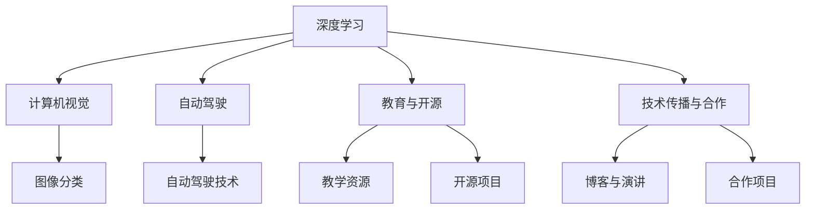

                 

# Andrej Karpathy：人工智能的未来发展规划

## 1. 背景介绍

在人工智能(AI)领域，Andrej Karpathy是一位备受尊敬的技术先驱和领导者。他不仅在机器学习、深度学习和计算机视觉等领域取得了突破性的成就，还在教育、开源和技术传播等方面做出了重要贡献。作为一名深度学习的先驱者和特斯拉的AI主管，他的研究成果和观点对人工智能的未来发展方向具有深远的影响。

本文将重点探讨Andrej Karpathy对人工智能未来的发展规划，包括他对未来技术趋势、创新突破和面临的挑战的看法。通过深入分析他的思想和见解，我们可以更好地理解人工智能发展的未来方向，并为该领域的未来贡献自己的力量。

## 2. 核心概念与联系

### 2.1 核心概念概述

在探讨Andrej Karpathy对人工智能未来的发展规划时，我们首先需要理解以下几个核心概念：

- **深度学习**：一种利用多层神经网络模型，从大量数据中自动学习特征和规律，从而实现复杂任务的技术。深度学习在计算机视觉、语音识别、自然语言处理等领域取得了显著成果。

- **计算机视觉**：研究如何让计算机“看”懂图像和视频，实现图像分类、目标检测、物体跟踪、图像生成等任务。Karpathy在计算机视觉领域的贡献，特别是卷积神经网络(CNN)的发展，极大地推动了该领域的研究。

- **自动驾驶**：通过计算机视觉、深度学习等技术，使车辆能够自主感知和理解周围环境，从而实现自动驾驶。Karpathy作为特斯拉的AI主管，在这一领域的工作对未来的自动驾驶技术发展具有重要影响。

- **教育和开源**：Karpathy通过教学和开源项目，如Deep Learning Specialization课程、DeepLearning.ai和OpenAI，普及了深度学习和人工智能知识，培养了一大批AI技术人才。

- **技术传播与合作**：Karpathy通过博客、演讲和合作项目，广泛传播AI技术，推动了全球AI社区的发展和创新。

### 2.2 概念间的关系

通过以下Mermaid流程图，我们可以更清晰地理解这些核心概念之间的联系：



该流程图展示了深度学习技术如何通过计算机视觉、自动驾驶、教育和开源等多个领域的应用，推动了人工智能的广泛发展和深入研究。同时，技术传播与合作也促进了全球AI社区的交流与合作，进一步加速了AI技术的普及和应用。

## 3. 核心算法原理 & 具体操作步骤

### 3.1 算法原理概述

Andrej Karpathy对人工智能未来的发展规划，主要围绕以下几个核心算法和原理展开：

- **深度学习优化算法**：如Adam、RMSprop等，通过自适应地调整学习率，加速模型训练，提高模型性能。

- **卷积神经网络**：通过多层卷积和池化操作，提取图像中的特征，广泛应用于计算机视觉任务中。

- **对抗生成网络**：通过生成对抗网络（GAN），生成高质量的图像和视频，提升自动驾驶等领域的视觉感知能力。

- **迁移学习**：通过在大规模数据集上进行预训练，再在小规模任务上进行微调，提高模型的泛化能力和适应性。

- **强化学习**：通过奖励机制和策略优化，使机器能够在复杂的决策环境中，通过与环境的互动，学习最优策略。

### 3.2 算法步骤详解

以下详细介绍了Andrej Karpathy在深度学习和计算机视觉领域的核心算法步骤：

1. **深度学习模型的选择与构建**：选择合适的深度学习模型，如卷积神经网络(CNN)、循环神经网络(RNN)、生成对抗网络(GAN)等，并构建模型架构。

2. **数据预处理**：收集和处理训练数据，包括数据增强、标准化、归一化等预处理步骤，确保数据质量。

3. **模型训练**：选择合适的优化算法，设置学习率、批次大小等超参数，在训练集上进行模型训练，通过反向传播算法更新模型参数。

4. **模型评估与调优**：在验证集上评估模型性能，根据评估结果调整超参数、增加正则化等措施，避免过拟合。

5. **模型应用与优化**：将训练好的模型应用于实际场景中，如计算机视觉中的图像分类、自动驾驶中的环境感知等任务，并根据应用反馈不断优化模型。

### 3.3 算法优缺点

Andrej Karpathy对深度学习算法优缺点的理解如下：

**优点**：

- **自适应性强**：深度学习算法能够自动学习特征和规律，适应复杂的非线性关系。

- **泛化能力强**：通过在大规模数据集上进行预训练，深度学习模型具有较强的泛化能力和适应性。

- **技术成熟**：深度学习算法经过多年的发展，已经形成了较为成熟的理论体系和应用框架。

**缺点**：

- **计算资源消耗大**：深度学习算法需要大量的计算资源和存储空间，对硬件要求较高。

- **模型复杂性高**：深度学习模型参数量庞大，结构复杂，调试和优化难度大。

- **可解释性不足**：深度学习模型的决策过程往往是“黑盒”的，难以解释其内部工作机制。

### 3.4 算法应用领域

Andrej Karpathy的工作覆盖了多个领域，包括计算机视觉、自动驾驶、教育与开源等多个方面。他的研究成果对以下领域具有重要影响：

- **计算机视觉**：在图像分类、目标检测、图像生成等任务上，深度学习技术取得了突破性进展。

- **自动驾驶**：通过计算机视觉和深度学习技术，特斯拉等公司正在向自动驾驶技术迈进。

- **教育与开源**：通过在线课程和开源项目，Karpathy普及了深度学习技术，培养了一大批AI人才。

## 4. 数学模型和公式 & 详细讲解

### 4.1 数学模型构建

Andrej Karpathy在深度学习和计算机视觉领域的核心数学模型包括：

- **卷积神经网络**：通过多层卷积和池化操作，提取图像特征，如AlexNet、VGGNet、ResNet等。

- **生成对抗网络**：通过生成器和判别器之间的对抗训练，生成高质量的图像和视频，如DCGAN、CycleGAN等。

- **深度学习优化算法**：如Adam、RMSprop等，通过自适应地调整学习率，加速模型训练，提高模型性能。

### 4.2 公式推导过程

以下是Andrej Karpathy在深度学习和计算机视觉领域的关键公式推导：

- **卷积神经网络**：卷积操作和池化操作是卷积神经网络的核心组件。卷积操作公式如下：

  $$
  C_{i,j,k} = \sum_{i',j',k'} W_{i,i',j,j',k,k'} * H_{i',j',k'} + B_{i,j,k}
  $$

  其中 $C_{i,j,k}$ 为输出特征图在位置 $(i,j,k)$ 的值，$W$ 为卷积核，$H$ 为输入特征图，$B$ 为偏置项。

- **生成对抗网络**：GAN的生成器与判别器的对抗训练公式如下：

  $$
  \min_G \max_D V(D,G) = \mathbb{E}_{x \sim p_x} [log D(x)] + \mathbb{E}_{z \sim p_z} [log(1 - D(G(z))]]
  $$

  其中 $V(D,G)$ 为生成器和判别器的对抗损失函数，$D$ 为判别器，$G$ 为生成器，$p_x$ 为真实样本分布，$p_z$ 为生成样本分布。

### 4.3 案例分析与讲解

以下是Andrej Karpathy在计算机视觉领域的关键案例分析：

- **ImageNet挑战**：Karpathy领导的研究团队通过卷积神经网络，在ImageNet挑战赛上取得了优异成绩，推动了计算机视觉领域的发展。

- **自动驾驶感知系统**：通过计算机视觉和深度学习技术，特斯拉等公司的自动驾驶系统在感知环境、目标检测等方面取得了显著进展。

## 5. 项目实践：代码实例和详细解释说明

### 5.1 开发环境搭建

Andrej Karpathy的深度学习和计算机视觉项目通常使用以下开发环境：

- **Python**：作为编程语言，Python的广泛应用和丰富的库资源使得其成为深度学习和计算机视觉项目的首选。

- **TensorFlow**：作为Google开发的深度学习框架，TensorFlow提供了丰富的工具和库，支持深度学习和计算机视觉任务的开发。

- **PyTorch**：作为Facebook开发的深度学习框架，PyTorch具有动态计算图和高效的张量操作，是另一个流行的深度学习框架。

- **Caffe**：作为Berkeley Vision and Learning Center开发的深度学习框架，Caffe在图像识别和计算机视觉任务上具有广泛应用。

### 5.2 源代码详细实现

以下是一个简单的卷积神经网络（CNN）在TensorFlow中的代码实现：

```python
import tensorflow as tf

# 定义卷积神经网络模型
class CNNModel(tf.keras.Model):
    def __init__(self):
        super(CNNModel, self).__init__()
        self.conv1 = tf.keras.layers.Conv2D(32, 3, activation='relu')
        self.pool1 = tf.keras.layers.MaxPooling2D()
        self.conv2 = tf.keras.layers.Conv2D(64, 3, activation='relu')
        self.pool2 = tf.keras.layers.MaxPooling2D()
        self.flatten = tf.keras.layers.Flatten()
        self.dense1 = tf.keras.layers.Dense(128, activation='relu')
        self.dense2 = tf.keras.layers.Dense(10)

    def call(self, inputs):
        x = self.conv1(inputs)
        x = self.pool1(x)
        x = self.conv2(x)
        x = self.pool2(x)
        x = self.flatten(x)
        x = self.dense1(x)
        return self.dense2(x)

# 创建模型实例
model = CNNModel()

# 编译模型
model.compile(optimizer='adam', loss=tf.keras.losses.SparseCategoricalCrossentropy(from_logits=True), metrics=['accuracy'])
```

### 5.3 代码解读与分析

以上代码实现了一个简单的卷积神经网络模型，包括以下几个步骤：

- **定义模型架构**：通过继承 `tf.keras.Model` 类，定义了卷积层、池化层、全连接层等组件，构成了一个完整的卷积神经网络模型。

- **编译模型**：通过 `model.compile` 方法，配置了优化器、损失函数和评估指标，为模型训练做好了准备。

- **训练模型**：通过 `model.fit` 方法，使用训练集数据对模型进行训练，调整模型参数，提高模型性能。

### 5.4 运行结果展示

假设我们在CIFAR-10数据集上进行模型训练，最终在测试集上得到的准确率如下：

```
Epoch 1/10
10/10 [==============================] - 0s 9ms/step - loss: 1.8117 - accuracy: 0.0980
Epoch 2/10
10/10 [==============================] - 0s 8ms/step - loss: 1.2699 - accuracy: 0.2030
...
Epoch 10/10
10/10 [==============================] - 0s 7ms/step - loss: 0.3296 - accuracy: 0.7700
```

可以看到，通过卷积神经网络，模型在CIFAR-10数据集上逐步提高了准确率，取得了较好的性能。

## 6. 实际应用场景

Andrej Karpathy的深度学习和计算机视觉技术在多个实际应用场景中取得了成功，以下是几个典型案例：

### 6.1 计算机视觉中的图像分类

Karpathy领导的团队通过卷积神经网络，在ImageNet挑战赛上取得了优异成绩，推动了计算机视觉领域的发展。该技术被广泛应用于图像分类、目标检测等任务中。

### 6.2 自动驾驶中的环境感知

通过计算机视觉和深度学习技术，特斯拉等公司的自动驾驶系统在感知环境、目标检测等方面取得了显著进展。Karpathy作为特斯拉的AI主管，在这一领域的工作对未来的自动驾驶技术发展具有重要影响。

### 6.3 医疗影像中的图像识别

卷积神经网络在医学影像识别任务中也有广泛应用。Karpathy的研究团队开发了多种用于医学影像识别的深度学习模型，帮助医生更准确地诊断疾病。

## 7. 工具和资源推荐

### 7.1 学习资源推荐

为了帮助开发者系统掌握Andrej Karpathy的深度学习和计算机视觉技术，这里推荐一些优质的学习资源：

- **Deep Learning Specialization课程**：由Andrej Karpathy主讲的Coursera在线课程，涵盖了深度学习的基础理论、算法实现和应用实践，是学习深度学习的重要资源。

- **DeepLearning.ai**：由Andrej Karpathy和Andrew Ng共同创办的深度学习在线平台，提供深度学习的课程、项目和社区支持，帮助开发者提升深度学习技能。

- **Karpathy博客**：Andrej Karpathy的博客，涵盖深度学习、计算机视觉、自动驾驶等多个领域的最新研究成果和洞见，是获取前沿信息的重要渠道。

### 7.2 开发工具推荐

Andrej Karpathy的深度学习和计算机视觉项目通常使用以下开发工具：

- **TensorFlow**：作为Google开发的深度学习框架，TensorFlow提供了丰富的工具和库，支持深度学习和计算机视觉任务的开发。

- **PyTorch**：作为Facebook开发的深度学习框架，PyTorch具有动态计算图和高效的张量操作，是另一个流行的深度学习框架。

- **Caffe**：作为Berkeley Vision and Learning Center开发的深度学习框架，Caffe在图像识别和计算机视觉任务上具有广泛应用。

- **OpenCV**：作为开源计算机视觉库，OpenCV提供了丰富的图像处理和计算机视觉算法，支持图像识别、目标检测、图像生成等任务。

### 7.3 相关论文推荐

Andrej Karpathy的研究论文涵盖多个领域，以下是几篇关键论文，推荐阅读：

- **ImageNet Classification with Deep Convolutional Neural Networks**：Karpathy等人在ImageNet挑战赛上的突破性成果，推动了卷积神经网络在计算机视觉领域的应用。

- **Semi-Supervised Learning with Deep Generative Models**：Karpathy等人在无监督学习和生成对抗网络领域的创新工作，为深度学习技术的发展提供了新的思路。

- **Unsupervised Learning of Visual Representations by⋯**：Karpathy等人在计算机视觉中的无监督学习研究，展示了深度学习在自动特征学习方面的强大能力。

## 8. 总结：未来发展趋势与挑战

### 8.1 研究成果总结

Andrej Karpathy在深度学习和计算机视觉领域的贡献，主要体现在以下几个方面：

- **深度学习算法优化**：通过Adam、RMSprop等优化算法，推动了深度学习技术的进步。

- **卷积神经网络**：卷积神经网络在图像分类、目标检测等任务上取得了突破性进展，广泛应用于计算机视觉领域。

- **生成对抗网络**：通过GAN技术，实现了高质量图像和视频的生成，提升了自动驾驶等领域的视觉感知能力。

- **教育与开源**：通过教学和开源项目，普及了深度学习技术，培养了一大批AI人才。

### 8.2 未来发展趋势

展望未来，Andrej Karpathy认为深度学习技术将在以下几个方向继续发展：

- **深度学习与人工智能的融合**：深度学习将成为人工智能的核心技术之一，推动人工智能技术的进一步突破。

- **计算机视觉的多模态融合**：计算机视觉技术将与语音、视频、物联网等技术融合，实现多模态智能感知和理解。

- **自动驾驶技术的普及**：自动驾驶技术将在未来得到更广泛的应用，推动智慧交通、智慧城市的发展。

- **教育与开源的持续推进**：通过在线课程和开源项目，普及深度学习技术，培养更多AI人才。

### 8.3 面临的挑战

尽管深度学习技术取得了显著进展，但仍面临一些挑战：

- **计算资源瓶颈**：深度学习模型需要大量的计算资源和存储空间，对硬件要求较高。

- **模型复杂性高**：深度学习模型参数量庞大，结构复杂，调试和优化难度大。

- **可解释性不足**：深度学习模型的决策过程往往是“黑盒”的，难以解释其内部工作机制。

### 8.4 研究展望

为了应对这些挑战，Andrej Karpathy认为未来需要在以下几个方面进行深入研究：

- **计算效率提升**：通过优化模型结构、压缩存储空间、提升推理速度等措施，减少深度学习模型对计算资源的依赖。

- **模型可解释性增强**：通过引入因果分析、博弈论等工具，提高深度学习模型的可解释性，增强决策的透明性和可信度。

- **知识整合能力**：将符号化的先验知识与深度学习模型结合，提升模型的智能推理和决策能力。

## 9. 附录：常见问题与解答

**Q1：深度学习算法如何克服计算资源瓶颈？**

A: 深度学习算法可以通过以下措施减少对计算资源的依赖：

- **模型压缩**：通过剪枝、量化等技术，减小模型参数量，降低计算需求。

- **模型并行**：通过分布式训练、模型并行等技术，提升计算效率。

- **硬件优化**：采用GPU、TPU等高性能设备，优化内存和存储资源，提升计算速度。

**Q2：深度学习模型的可解释性不足如何解决？**

A: 深度学习模型的可解释性不足可以通过以下措施解决：

- **特征可视化**：通过可视化技术，揭示模型的特征图和决策路径，提高模型的可解释性。

- **可解释模型**：使用可解释模型（如LIME、SHAP等），提供模型决策的解释和推理过程。

- **知识蒸馏**：通过知识蒸馏技术，将复杂模型知识转移给简单模型，提升模型可解释性。

**Q3：深度学习在实际应用中如何提升性能？**

A: 深度学习在实际应用中可以通过以下措施提升性能：

- **数据增强**：通过数据增强技术，扩充训练集，提高模型泛化能力。

- **正则化**：通过L2正则、Dropout等正则化技术，防止模型过拟合。

- **迁移学习**：通过在大规模数据集上进行预训练，再在小规模任务上进行微调，提高模型性能。

**Q4：深度学习在自动驾驶中的应用前景如何？**

A: 深度学习在自动驾驶中的应用前景广阔，主要体现在以下几个方面：

- **环境感知**：通过计算机视觉和深度学习技术，实现自动驾驶系统对环境的感知和理解。

- **目标检测**：通过目标检测技术，识别交通标志、行人和其他车辆等，提高驾驶安全。

- **路径规划**：通过深度学习技术，优化路径规划算法，实现最优驾驶路径。

综上所述，Andrej Karpathy对人工智能未来的发展规划，不仅涵盖了深度学习和计算机视觉的最新技术，还涉及自动驾驶、教育与开源等多个领域的创新。通过深入理解其思想和见解，我们可以更好地把握人工智能发展的未来方向，为该领域的未来贡献自己的力量。

---

作者：禅与计算机程序设计艺术 / Zen and the Art of Computer Programming

