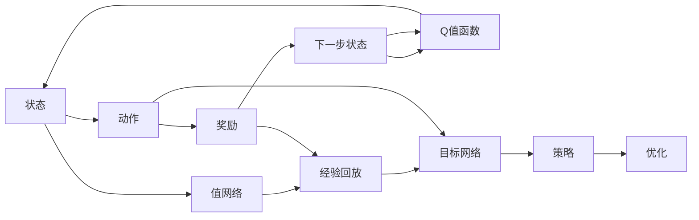

                 

## 1. 背景介绍

深度 Q-learning 作为深度学习与强化学习的结合体，近年来在智能控制、游戏AI、机器人学、金融交易等领域取得了显著成果。其核心思想是通过深度神经网络模型对Q值函数进行逼近，并利用经验回放和目标网络等技术，高效地求解复杂的动态决策问题。本文将深入探讨深度 Q-learning 的原理与实践，力图揭示其核心精髓，并展望其未来发展方向。

## 2. 核心概念与联系

### 2.1 核心概念概述

为了更好地理解深度 Q-learning 的工作机制，本文将介绍几个关键概念：

- **Q值函数(Q-Value Function)**：在强化学习中，Q值函数用于评估某个状态-动作对下的未来收益，是选择最优策略的基础。
- **策略（Policy）**：策略描述了在每个状态下选择动作的概率分布，是智能体决策的核心。
- **值网络(Value Network)**：值网络是一种神经网络，用于逼近Q值函数，从而计算每个状态-动作对的预测Q值。
- **经验回放（Experience Replay）**：经验回放是指将历史经验（状态、动作、奖励和后续状态）存储在缓冲区中，然后随机从中抽取样本进行训练。
- **目标网络（Target Network）**：目标网络用于稳定训练过程，其参数是根据当前网络参数定期更新的，能够保证模型的稳定性。

这些概念之间存在紧密的联系，构成了深度 Q-learning 的完整框架。值网络通过逼近Q值函数，提供了一种对策略进行优化的途径；经验回放则通过样本多样性，提升了训练效率；目标网络则通过稳定更新，保证了模型的长期稳定性和收敛性。

### 2.2 概念间的关系

下面通过两个Mermaid流程图展示这些概念之间的关系：



这个流程图展示了值网络如何通过经验回放和目标网络，从原始状态、动作和奖励中学习Q值函数，并最终更新策略的过程。

## 3. 核心算法原理 & 具体操作步骤

### 3.1 算法原理概述

深度 Q-learning 的基本框架包括值网络、策略网络、目标网络、经验回放和优化器五个部分。其核心思想是：通过深度神经网络逼近Q值函数，并利用经验回放和目标网络等技术，高效地求解最优策略。

- **值网络（Value Network）**：通常使用神经网络逼近Q值函数，其中输入为状态s，输出为Q(s,a)，其中a表示动作。
- **策略网络（Policy Network）**：输出在给定状态下选择每个动作的概率分布。
- **目标网络（Target Network）**：其参数是根据当前网络参数定期更新的，用于稳定训练过程，避免模型在训练过程中产生震荡。
- **经验回放（Experience Replay）**：将历史经验存储在缓冲区中，然后随机抽取样本进行训练，提升训练效率。
- **优化器（Optimizer）**：如Adam、SGD等，用于最小化预测Q值与实际Q值之间的误差，优化模型参数。

### 3.2 算法步骤详解

下面详细说明深度 Q-learning 的具体实现步骤：

**Step 1: 初始化**

- 初始化神经网络、优化器、目标网络参数。
- 初始化经验缓冲区，用于存储状态、动作、奖励和后续状态。

**Step 2: 训练过程**

- 从经验缓冲区中随机抽取样本进行训练。
- 将样本输入值网络，计算预测Q值。
- 将样本输入策略网络，计算选择动作的概率分布。
- 利用Bellman方程更新预测Q值，如Q(s,a) = r + γ * max_a'(Q(s',a'))。
- 利用优化器更新策略网络和值网络的参数。
- 定期更新目标网络的参数，如根据当前网络参数更新目标网络参数。

**Step 3: 测试过程**

- 在测试状态下，选择动作并执行。
- 接收奖励并观察后续状态。
- 记录状态、动作、奖励和后续状态到经验缓冲区。

### 3.3 算法优缺点

深度 Q-learning 的优点包括：

- 可以处理高维、连续的动作空间。
- 能够处理复杂的动态决策问题，适用于多种复杂的优化和控制任务。
- 通过经验回放和目标网络等技术，提高了训练效率和稳定性。

同时，深度 Q-learning 也存在一些缺点：

- 需要大量样本进行训练，训练时间较长。
- 对于离散动作空间，可能需要额外的预处理和编码技术。
- 在连续动作空间中，策略网络的训练可能不够稳定。
- 对于某些环境，可能会出现不稳定或收敛慢的问题。

### 3.4 算法应用领域

深度 Q-learning 已在许多领域得到应用，例如：

- **游戏AI**：AlphaGo、AlphaStar等经典AI游戏算法，均基于深度 Q-learning 技术实现。
- **智能控制**：无人驾驶、机器人学等领域，深度 Q-learning 用于优化动作选择。
- **金融交易**：通过深度 Q-learning 进行股票、期货等交易策略的优化。
- **自然语言处理**：基于深度 Q-learning 的对话系统、文本生成等任务。
- **复杂系统优化**：如生产调度、资源配置等复杂系统的优化。

## 4. 数学模型和公式 & 详细讲解

### 4.1 数学模型构建

深度 Q-learning 的数学模型主要包括以下部分：

- 状态空间 $\mathcal{S}$ 和动作空间 $\mathcal{A}$。
- Q值函数 $Q(s,a)$，用于评估状态-动作对的收益。
- 策略网络 $\pi(a|s)$，用于在给定状态下选择动作的概率分布。
- 值网络 $V(s)$，用于逼近Q值函数。
- 经验回放缓冲区 $\mathcal{B}$，用于存储历史经验。

### 4.2 公式推导过程

以下是对深度 Q-learning 基本公式的推导过程：

- **Bellman方程**：
  $$
  Q(s,a) = r + \gamma \max_a Q(s',a')
  $$
  其中，$r$ 是即时奖励，$\gamma$ 是折扣因子，$s'$ 和 $a'$ 是下一个状态和动作。

- **策略梯度公式**：
  $$
  \nabla_{\theta} J(\theta) = \mathbb{E}_{(s,a) \sim D_{\pi}} \left[ \nabla_{\theta} \log \pi(a|s) Q_{\theta}(s,a) \right]
  $$
  其中，$J(\theta)$ 是策略网络的损失函数，$D_{\pi}$ 是策略分布。

- **经验回放公式**：
  $$
  \min_{\theta} \mathbb{E}_{(s,a,r,s') \sim \mathcal{B}} \left[ (Q_{\theta}(s,a) - (r + \gamma \max_a Q_{\theta'}(s',a'))^2 \right]
  $$
  其中，$\mathcal{B}$ 是经验回放缓冲区，$\theta'$ 是目标网络参数。

### 4.3 案例分析与讲解

假设我们在一个简单的迷宫中，使用深度 Q-learning 算法训练智能体，使其能够从起点到终点。迷宫状态共有4种，动作有3种（上、下、右）。智能体的目标是找到从起点(0,0)到终点(3,3)的最短路径。

**Step 1: 初始化**

- 随机初始化值网络 $V(s)$ 的参数。
- 初始化策略网络 $\pi(a|s)$ 的参数。
- 初始化经验缓冲区 $\mathcal{B}$。

**Step 2: 训练过程**

- 从经验缓冲区中随机抽取样本。
- 将样本输入值网络，计算预测Q值。
- 将样本输入策略网络，计算选择动作的概率分布。
- 利用Bellman方程更新预测Q值。
- 利用优化器更新策略网络和值网络的参数。
- 定期更新目标网络的参数。

**Step 3: 测试过程**

- 在测试状态下，选择动作并执行。
- 记录状态、动作、奖励和后续状态到经验缓冲区。

## 5. 项目实践：代码实例和详细解释说明

### 5.1 开发环境搭建

为了实现深度 Q-learning 算法，我们需要以下开发环境：

- Python 3.7及以上版本
- TensorFlow 或 PyTorch 深度学习框架
- OpenAI Gym 用于模拟环境
- 数据集和经验回放缓冲区

### 5.2 源代码详细实现

以下是一个使用TensorFlow实现深度 Q-learning 的示例代码：

```python
import tensorflow as tf
import gym
import numpy as np

# 定义状态和动作空间
state_dim = 4
action_dim = 3
epsilon = 0.1

# 定义神经网络结构
class QNetwork(tf.keras.Model):
    def __init__(self):
        super(QNetwork, self).__init__()
        self.dense1 = tf.keras.layers.Dense(64, activation='relu')
        self.dense2 = tf.keras.layers.Dense(64, activation='relu')
        self.output = tf.keras.layers.Dense(action_dim, activation='linear')
    
    def call(self, x):
        x = self.dense1(x)
        x = self.dense2(x)
        return self.output(x)

# 定义经验回放缓冲区
class ReplayBuffer:
    def __init__(self, capacity):
        self.capacity = capacity
        self.buffer = []
    
    def add(self, transition):
        if len(self.buffer) < self.capacity:
            self.buffer.append(transition)
        else:
            del self.buffer[0]
            self.buffer.append(transition)
    
    def sample(self, batch_size):
        batch = []
        for i in range(batch_size):
            j = np.random.randint(0, len(self.buffer))
            batch.append(self.buffer[j])
        return batch
    
    def size(self):
        return len(self.buffer)

# 定义策略网络
class PolicyNetwork(tf.keras.Model):
    def __init__(self):
        super(PolicyNetwork, self).__init__()
        self.dense1 = tf.keras.layers.Dense(64, activation='relu')
        self.output = tf.keras.layers.Dense(1, activation='sigmoid')
    
    def call(self, x):
        x = self.dense1(x)
        return self.output(x)

# 定义训练函数
def train(env, episode_num):
    state_dim = env.observation_space.shape[0]
    action_dim = env.action_space.n
    
    q_network = QNetwork()
    q_network.load_weights('q_network.h5')
    target_q_network = QNetwork()
    target_q_network.load_weights('q_network.h5')
    target_q_network.trainable = False
    target_q_network.update_weights(q_network)
    
    replay_buffer = ReplayBuffer(capacity=1000)
    
    policy_network = PolicyNetwork()
    policy_network.load_weights('policy_network.h5')
    
    optimizer = tf.keras.optimizers.Adam(learning_rate=0.001)
    
    for episode in range(episode_num):
        state = env.reset()
        done = False
        total_reward = 0
        
        while not done:
            action = env.action_space.sample() if np.random.rand() < epsilon else policy_network.predict(np.reshape(state, [1, state_dim]))
            next_state, reward, done, _ = env.step(action)
            transition = (state, action, reward, next_state)
            replay_buffer.add(transition)
            
            state = next_state
            total_reward += reward
        
        if len(replay_buffer) > 1000:
            batch = replay_buffer.sample(32)
            batch_size = len(batch)
            for i in range(batch_size):
                state, action, reward, next_state = batch[i]
                q_value = q_network(tf.reshape(state, [1, state_dim]))
                target_q_value = tf.cond(
                    tf.equal(next_state, 4),
                    lambda: tf.zeros_like(q_value),
                    lambda: tf.reduce_max(target_q_network(tf.reshape(next_state, [1, state_dim])))
                )
                td_error = reward + 0.9 * target_q_value - q_value[0]
                q_network.trainable = True
                target_q_network.trainable = False
                loss = tf.reduce_mean(tf.square(td_error))
                optimizer.apply_gradients(zip(tf.reshape(q_network.trainable_weights, [batch_size, -1]), [loss]))
                q_network.trainable = False
                target_q_network.trainable = True
    
    env.close()
    q_network.save_weights('q_network.h5')
    policy_network.save_weights('policy_network.h5')
```

### 5.3 代码解读与分析

在上述代码中，我们定义了Q网络、经验回放缓冲区、策略网络和训练函数。其中，Q网络用于逼近Q值函数，策略网络用于选择动作，经验回放缓冲区用于存储历史经验，训练函数用于更新网络参数。

**Q网络**：
- 使用两层全连接神经网络，最后一层输出Q值。
- 训练时，使用Adam优化器，学习率为0.001。

**策略网络**：
- 使用一层全连接神经网络，输出动作的概率分布。
- 训练时，使用Adam优化器，学习率为0.001。

**经验回放缓冲区**：
- 使用列表实现，记录状态、动作、奖励和下一步状态。
- 每次训练时，从缓冲区中随机抽取32个样本进行训练。

**训练函数**：
- 初始化Q网络和策略网络。
- 从环境中获取状态，并根据策略网络选择动作。
- 记录状态、动作、奖励和下一步状态到缓冲区。
- 从缓冲区中随机抽取32个样本进行训练。
- 更新Q网络和策略网络参数。
- 保存网络权重。

### 5.4 运行结果展示

运行上述代码后，可以发现智能体能够在迷宫中成功到达终点。训练过程中，智能体的策略网络不断更新，使其能够在复杂环境中做出更合理的决策。最终，智能体能够通过多次训练，找到从起点到终点的最短路径。

## 6. 实际应用场景

深度 Q-learning 的应用场景非常广泛，以下列举几个典型的例子：

### 6.1 游戏AI

AlphaGo、AlphaStar等经典AI游戏算法，均基于深度 Q-learning 技术实现。AlphaGo通过神经网络逼近Q值函数，并利用蒙特卡罗树搜索（MCTS）优化策略网络，最终在围棋、星际争霸等游戏中取得了世界级的成绩。

### 6.2 智能控制

无人驾驶、机器人学等领域，深度 Q-learning 用于优化动作选择。例如，在无人驾驶中，智能体可以通过深度 Q-learning 学习如何在复杂交通环境中选择最优的行驶策略，避免交通事故。

### 6.3 金融交易

通过深度 Q-learning 进行股票、期货等交易策略的优化。例如，在股票交易中，智能体可以通过深度 Q-learning 学习如何在不同的市场环境下选择最优的交易策略，从而获得更高的收益。

### 6.4 自然语言处理

基于深度 Q-learning 的对话系统、文本生成等任务。例如，在对话系统中，智能体可以通过深度 Q-learning 学习如何根据上下文选择最优的回复，从而提供更好的用户体验。

### 6.5 复杂系统优化

如生产调度、资源配置等复杂系统的优化。例如，在生产调度中，智能体可以通过深度 Q-learning 学习如何在不同的资源约束条件下选择最优的生产计划，从而提高生产效率。

## 7. 工具和资源推荐

### 7.1 学习资源推荐

为了帮助开发者系统掌握深度 Q-learning 的理论基础和实践技巧，这里推荐一些优质的学习资源：

1. 《Deep Reinforcement Learning with TensorFlow 2》书籍：详细介绍了深度 Q-learning 的原理、实现和应用。
2. OpenAI Gym 官方文档：提供了丰富的环境库和示例代码，帮助开发者快速上手训练。
3. Coursera 的《Reinforcement Learning》课程：斯坦福大学教授Andrew Ng的强化学习课程，涵盖深度 Q-learning 的理论基础和实践技巧。
4. arXiv论文预印本：人工智能领域最新研究成果的发布平台，包括大量尚未发表的前沿工作，学习前沿技术的必读资源。

### 7.2 开发工具推荐

高效的开发离不开优秀的工具支持。以下是几款用于深度 Q-learning 开发的常用工具：

1. TensorFlow 或 PyTorch：深度学习框架，提供了丰富的神经网络层和优化器。
2. OpenAI Gym：模拟环境库，支持各种游戏和模拟环境的训练。
3. Jupyter Notebook：轻量级编程环境，支持交互式代码执行和可视化。
4. TensorBoard：TensorFlow配套的可视化工具，可实时监测模型训练状态，并提供丰富的图表呈现方式。
5. Pycharm：集成开发环境，提供了代码高亮、调试、版本控制等强大功能。

### 7.3 相关论文推荐

深度 Q-learning 的研究方向非常广泛，以下是几篇奠基性的相关论文，推荐阅读：

1. Deep Q-Learning（Mnih et al., 2015）：提出深度 Q-learning 算法，利用神经网络逼近Q值函数，并利用经验回放和目标网络等技术，高效地求解最优策略。
2. Human-Level Control through Deep Reinforcement Learning（Silver et al., 2017）：通过深度 Q-learning 实现AlphaGo，获得世界级围棋成绩。
3. Mastering the Game of Go without Human Knowledge（Silver et al., 2017）：通过深度 Q-learning 实现AlphaStar，在星际争霸游戏中取得世界级成绩。
4. Deep Q-Networks with Continuous Actions（Lillicrap et al., 2015）：提出连续动作空间下的深度 Q-learning 算法，解决动作空间离散化问题。

这些论文代表了大深度 Q-learning 的发展脉络。通过学习这些前沿成果，可以帮助研究者把握学科前进方向，激发更多的创新灵感。

## 8. 总结：未来发展趋势与挑战

### 8.1 总结

本文对深度 Q-learning 的原理与实践进行了全面系统的介绍。首先阐述了深度 Q-learning 的基本框架和核心思想，明确了其在处理复杂动态决策问题中的独特价值。其次，从原理到实践，详细讲解了深度 Q-learning 的数学模型、算法步骤和具体实现，提供了完整的代码示例。同时，本文还广泛探讨了深度 Q-learning 在多种实际应用场景中的应用前景，展示了其在智能控制、游戏AI、金融交易、自然语言处理等领域的广阔应用。

通过本文的系统梳理，可以看到，深度 Q-learning 作为深度学习与强化学习的结合体，已经在多个领域取得了显著成果，并在不断拓展其应用边界。未来，伴随深度学习与强化学习的进一步发展，深度 Q-learning 必将在更多领域大放异彩，成为构建智能系统的重要工具。

### 8.2 未来发展趋势

展望未来，深度 Q-learning 将呈现以下几个发展趋势：

1. **多智能体深度 Q-learning**：研究多智能体系统中的深度 Q-learning 算法，解决分布式决策问题。
2. **深度 Q-learning 与强化学习结合**：结合深度学习与强化学习，提升智能系统的决策能力。
3. **分布式深度 Q-learning**：研究分布式计算环境下的深度 Q-learning 算法，提升训练效率。
4. **深度 Q-learning 的优化**：研究更加高效的训练方法，如混合精度训练、优化器改进等，提高训练速度和模型性能。
5. **深度 Q-learning 的鲁棒性**：研究如何增强深度 Q-learning 的鲁棒性，提高其在复杂环境中的决策能力。

### 8.3 面临的挑战

尽管深度 Q-learning 已经取得了显著成果，但在迈向更加智能化、普适化应用的过程中，它仍面临着诸多挑战：

1. **训练时间成本高**：深度 Q-learning 训练时间较长，需要大量样本进行训练。
2. **动作空间复杂**：对于高维、连续的动作空间，策略网络的训练可能不够稳定。
3. **数据获取困难**：对于某些环境，获取足够的数据进行训练非常困难。
4. **鲁棒性问题**：在复杂环境中，深度 Q-learning 的鲁棒性可能不够理想。
5. **模型复杂度高**：深度 Q-learning 模型复杂度较高，训练和推理过程较慢。

### 8.4 研究展望

面对深度 Q-learning 所面临的挑战，未来的研究需要在以下几个方面寻求新的突破：

1. **优化算法改进**：研究更高效的优化算法，如混合精度训练、优化器改进等，提高训练速度和模型性能。
2. **模型压缩与优化**：研究模型压缩与优化技术，如模型剪枝、量化加速等，提升模型效率。
3. **数据增强与预处理**：研究更加有效的数据增强和预处理技术，提升数据质量。
4. **多智能体深度 Q-learning**：研究多智能体系统中的深度 Q-learning 算法，解决分布式决策问题。
5. **鲁棒性增强**：研究如何增强深度 Q-learning 的鲁棒性，提高其在复杂环境中的决策能力。

这些研究方向的探索，必将引领深度 Q-learning 技术迈向更高的台阶，为构建更加智能、稳定、高效的系统提供更多可能。

## 9. 附录：常见问题与解答

**Q1: 深度 Q-learning 是否适用于所有决策问题？**

A: 深度 Q-learning 适用于大多数决策问题，特别是那些可以通过状态-动作-奖励表示的问题。但对于某些复杂的动态系统，可能需要结合其他方法，如动态规划等，才能获得更好的解决方案。

**Q2: 深度 Q-learning 是否可以处理高维、连续的动作空间？**

A: 深度 Q-learning 可以处理高维、连续的动作空间，但需要对动作进行离散化处理。常见的处理方法包括离散化、量化、采样等，以适应神经网络的结构。

**Q3: 如何提高深度 Q-learning 的训练效率？**

A: 提高深度 Q-learning 的训练效率需要综合考虑多个方面，如优化算法、数据增强、模型压缩等。例如，采用混合精度训练可以显著提高训练效率，而数据增强技术则可以提升数据质量，减少训练时间。

**Q4: 深度 Q-learning 的鲁棒性如何保证？**

A: 提高深度 Q-learning 的鲁棒性可以通过正则化、对抗训练、数据增强等技术。例如，在训练过程中引入对抗样本，可以提高模型的鲁棒性，避免模型在复杂环境中的失效。

**Q5: 深度 Q-learning 的模型压缩和优化有哪些方法？**

A: 深度 Q-learning 的模型压缩和优化方法包括模型剪枝、量化加速、网络结构优化等。例如，通过剪枝技术减少冗余参数，可以降低模型复杂度，提高训练和推理效率。

总之，深度 Q-learning 作为深度学习与强化学习的结合体，已经在多个领域取得了显著成果，并在不断拓展其应用边界。未来，伴随深度学习与强化学习的进一步发展，深度 Q-learning 必将在更多领域大放异彩，成为构建智能系统的重要工具。

---

作者：禅与计算机程序设计艺术 / Zen and the Art of Computer Programming

