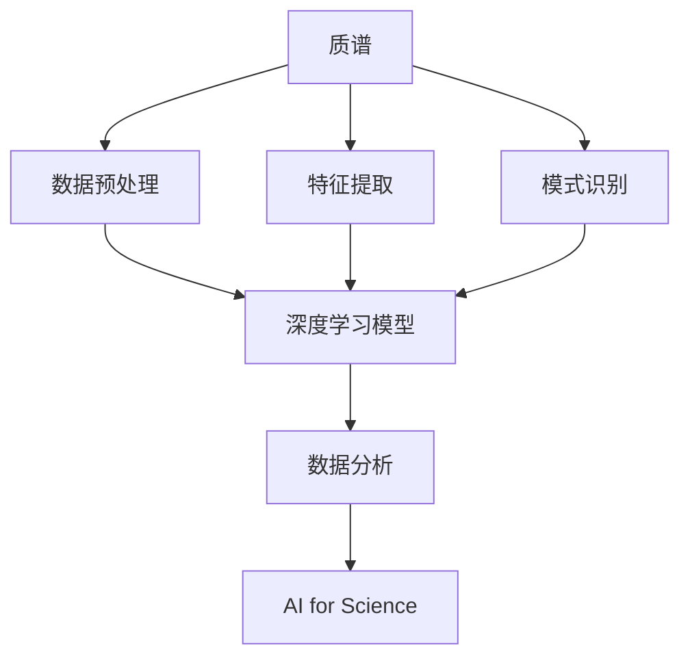

                 

# 质谱技术在AI for Science中的角色

> 关键词：质谱, 人工智能, AI for Science, 数据分析, 生物信息学, 环境监测

## 1. 背景介绍

### 1.1 问题由来
在过去的几十年中，质谱技术的发展极大地推动了科学研究的进步。从生物学、化学到环境科学，质谱仪在分子水平上提供了丰富的数据，极大地促进了相关领域的突破。然而，随着科学数据的爆炸式增长，仅仅依赖人工数据分析已变得不再现实。在此背景下，人工智能（AI）逐渐成为处理和分析质谱数据的强大工具。

### 1.2 问题核心关键点
质谱技术在AI for Science中的应用，主要集中在以下几个方面：

- **数据预处理**：质谱数据通常需要复杂的前处理，包括去除噪声、基线校正、数据归一化等。AI技术可以自动化这些步骤，提高数据分析的效率和准确性。
- **特征提取**：质谱数据通常包含大量的高维信息，AI可以通过深度学习模型自动提取关键特征，为后续分析提供基础。
- **模式识别**：质谱数据中的模式识别和分类任务，如化合物识别、同位素分馏等，都是AI擅长处理的。
- **数据分析**：质谱数据往往与时间序列、空间分布等深度信息相关联，AI可以结合这些信息进行综合分析。

## 2. 核心概念与联系

### 2.1 核心概念概述

为了更好地理解质谱技术在AI for Science中的角色，我们首先需要介绍几个关键概念：

- **质谱（Mass Spectrometry, MS）**：一种分析技术，用于分离、识别和量化化合物。质谱仪通过离子化、质量分析等步骤，将分子转化为离子流，并根据其质量-电荷比（m/z）进行分离和测量。
- **AI for Science**：利用人工智能技术，在科学研究中自动化、加速和优化数据分析过程。质谱技术是其重要的应用领域之一。
- **数据分析（Data Analysis）**：使用统计学、机器学习等方法，对收集到的数据进行整理、分析和解释的过程。
- **深度学习（Deep Learning）**：一种基于神经网络的机器学习方法，能够处理复杂的高维数据，如图像、音频、文本等。
- **数据挖掘（Data Mining）**：从大量数据中发现隐藏模式和规律的过程，常用于预测和分类任务。

这些概念之间的逻辑关系可以通过以下Mermaid流程图来展示：



这个流程图展示了质谱数据从采集到分析的整个流程，以及AI在其中扮演的角色。质谱仪采集数据后，经过预处理和特征提取，AI模型可以自动识别模式并进行分类。最终，数据分析工具对结果进行解释和应用。

### 2.2 概念间的关系

这些核心概念之间存在着紧密的联系，形成了质谱数据处理的完整生态系统。

#### 2.2.1 质谱与数据分析
质谱数据包含丰富的信息，但其处理过程往往繁琐且复杂。数据分析技术能够帮助科学家高效地利用这些信息，揭示化合物结构、化学反应机理等关键问题。

#### 2.2.2 AI与数据分析
AI技术，特别是深度学习，能够在数据分析中提供自动化和智能化的支持。深度学习模型可以自动提取关键特征，处理高维数据，提高数据分析的准确性和效率。

#### 2.2.3 数据预处理与特征提取
数据预处理和特征提取是数据分析的第一步，AI技术在这一环节中能够自动化地完成去噪、归一化等复杂操作，提取关键信息。

#### 2.2.4 模式识别与数据分析
模式识别是质谱数据分析的核心任务之一，AI技术通过深度学习模型能够自动识别和分类化合物，为后续的数据分析提供基础。

## 3. 核心算法原理 & 具体操作步骤
### 3.1 算法原理概述

在AI for Science中，质谱数据的处理和分析通常依赖于深度学习算法。其核心原理如下：

1. **数据预处理**：使用神经网络模型对原始质谱数据进行去噪、归一化等预处理，提高数据质量。
2. **特征提取**：通过卷积神经网络（CNN）等模型自动提取质谱数据中的关键特征，如质量数、保留时间、峰形等。
3. **模式识别**：使用分类模型如卷积神经网络、循环神经网络（RNN）等对质谱数据进行分类和识别，如化合物识别、同位素分馏等。
4. **数据分析**：结合时间序列、空间分布等深度信息，使用深度学习模型进行综合分析，如化合物代谢途径分析、环境污染监测等。

### 3.2 算法步骤详解

以下是一个基于深度学习算法处理质谱数据的详细步骤：

1. **数据采集**：使用质谱仪采集样品数据。
2. **数据预处理**：使用神经网络模型对原始数据进行去噪、归一化等预处理。
3. **特征提取**：使用卷积神经网络（CNN）等模型自动提取关键特征。
4. **模型训练**：使用标记好的质谱数据集训练分类或回归模型。
5. **模型评估**：在验证集上评估模型性能，优化模型参数。
6. **数据分析**：使用训练好的模型对新数据进行预测和分析。

### 3.3 算法优缺点

使用AI技术处理质谱数据有以下优点：

- **高效性**：AI技术能够自动化处理复杂的质谱数据，提高数据分析的效率。
- **准确性**：深度学习模型能够自动提取关键特征，提高数据分析的准确性。
- **灵活性**：AI技术可以处理多种类型的质谱数据，适应不同的分析需求。

同时，AI技术在处理质谱数据时也存在以下缺点：

- **数据依赖性**：深度学习模型需要大量的标注数据进行训练，质谱数据的获取和标注成本较高。
- **模型复杂性**：深度学习模型结构复杂，训练和调优过程耗时较长。
- **可解释性**：AI模型通常是“黑盒”，难以解释其内部工作机制和决策逻辑。

### 3.4 算法应用领域

基于深度学习的质谱数据分析方法，已经在多个领域得到广泛应用，例如：

- **生物信息学**：质谱技术在蛋白质组学、代谢组学等领域，用于鉴定蛋白质、代谢物等生物大分子。
- **环境监测**：用于监测大气、水体中的污染物，如挥发性有机化合物（VOCs）、重金属等。
- **医学诊断**：用于分析血液、尿液等生物样本中的化合物，辅助疾病诊断和疗效评估。
- **药物研发**：用于鉴定药物分子、代谢产物，加速新药开发和临床验证。

## 4. 数学模型和公式 & 详细讲解 & 举例说明

### 4.1 数学模型构建

为了更好地理解质谱数据分析中的数学模型，我们需要定义一些基本概念：

- **质量数（m/z）**：化合物在质谱仪中转化为离子的质量与电荷比。
- **保留时间（RT）**：化合物在色谱柱中的停留时间。
- **峰形（Peak Shape）**：化合物质谱图中峰形的描述，通常使用标准偏差（SD）或半峰宽（FWHM）表示。

使用这些概念，我们可以构建如下数学模型：

$$
f(m/z, RT, SD, FWHM, \ldots) = y
$$

其中 $f$ 为质谱数据分析模型，$m/z, RT, SD, FWHM, \ldots$ 为输入变量，$y$ 为输出变量。

### 4.2 公式推导过程

以下以化合物识别任务为例，推导深度学习模型的训练公式。

假设模型 $M_{\theta}$ 输入为 $x = (m/z, RT, SD, FWHM, \ldots)$，输出为 $y = (Label, Score, \ldots)$，其中 $Label$ 为化合物标签，$Score$ 为预测得分。模型的训练损失函数为：

$$
\mathcal{L}(\theta) = -\frac{1}{N} \sum_{i=1}^N \log p(y_i|x_i; \theta)
$$

其中 $p(y|x; \theta)$ 为模型 $M_{\theta}$ 在输入 $x_i$ 上的条件概率分布。模型的输出通常为 $y_i$ 的概率分布，可通过softmax函数计算。

使用梯度下降算法进行模型训练，更新模型参数 $\theta$：

$$
\theta \leftarrow \theta - \eta \nabla_{\theta}\mathcal{L}(\theta)
$$

其中 $\eta$ 为学习率，$\nabla_{\theta}\mathcal{L}(\theta)$ 为损失函数对模型参数 $\theta$ 的梯度，可通过反向传播算法计算。

### 4.3 案例分析与讲解

以蛋白质组学为例，蛋白质在质谱仪中转化为离子，通过质荷比（m/z）和保留时间（RT）进行分离和鉴定。深度学习模型可以自动提取关键特征，进行分类和识别。

具体而言，可以将蛋白质的质谱数据作为输入，预测其功能（如酶、调节因子）。使用卷积神经网络（CNN）自动提取关键特征，如质量数、保留时间、峰形等。在输出层，使用softmax函数进行分类，预测蛋白质的功能。

## 5. 项目实践：代码实例和详细解释说明

### 5.1 开发环境搭建

在进行质谱数据分析项目时，我们需要准备好开发环境。以下是使用Python进行TensorFlow开发的流程：

1. 安装Anaconda：从官网下载并安装Anaconda，用于创建独立的Python环境。

2. 创建并激活虚拟环境：
```bash
conda create -n tf-env python=3.8 
conda activate tf-env
```

3. 安装TensorFlow：根据CUDA版本，从官网获取对应的安装命令。例如：
```bash
conda install tensorflow -c tf -c conda-forge
```

4. 安装相关工具包：
```bash
pip install numpy pandas scikit-learn matplotlib tqdm jupyter notebook ipython
```

完成上述步骤后，即可在`tf-env`环境中开始项目开发。

### 5.2 源代码详细实现

下面我们以蛋白质组学任务为例，给出使用TensorFlow进行质谱数据分析的Python代码实现。

首先，定义数据处理函数：

```python
import tensorflow as tf
import numpy as np

def load_data(file_path):
    with open(file_path, 'r') as f:
        data = f.readlines()
    data = np.array(data, dtype=np.float32)
    return data
```

然后，定义模型和损失函数：

```python
def build_model(input_shape):
    model = tf.keras.Sequential([
        tf.keras.layers.Conv2D(32, kernel_size=(3, 3), activation='relu', input_shape=input_shape),
        tf.keras.layers.MaxPooling2D(pool_size=(2, 2)),
        tf.keras.layers.Flatten(),
        tf.keras.layers.Dense(64, activation='relu'),
        tf.keras.layers.Dense(num_classes, activation='softmax')
    ])
    return model

def compile_model(model):
    model.compile(loss=tf.keras.losses.categorical_crossentropy, optimizer=tf.keras.optimizers.Adam(), metrics=['accuracy'])
```

接着，定义训练和评估函数：

```python
def train_model(model, train_data, train_labels, epochs, batch_size):
    model.fit(train_data, train_labels, epochs=epochs, batch_size=batch_size, validation_split=0.2)

def evaluate_model(model, test_data, test_labels):
    test_loss, test_acc = model.evaluate(test_data, test_labels)
    print('Test loss:', test_loss)
    print('Test accuracy:', test_acc)
```

最后，启动训练流程并在测试集上评估：

```python
train_data = load_data('train_data.txt')
train_labels = load_data('train_labels.txt')
test_data = load_data('test_data.txt')
test_labels = load_data('test_labels.txt')

input_shape = (1, 256)
num_classes = 10

model = build_model(input_shape)
compile_model(model)

epochs = 10
batch_size = 32

train_model(model, train_data, train_labels, epochs, batch_size)
evaluate_model(model, test_data, test_labels)
```

以上就是使用TensorFlow对质谱数据进行蛋白质组学任务微调的完整代码实现。可以看到，TensorFlow提供了强大的API和工具，使得模型构建和训练过程变得简洁高效。

### 5.3 代码解读与分析

让我们再详细解读一下关键代码的实现细节：

**load_data函数**：
- 读取质谱数据文件，并将数据转换为numpy数组，方便模型处理。

**build_model函数**：
- 定义卷积神经网络（CNN）模型，包含卷积层、池化层、全连接层等。根据输入数据的维度，调整输入层和输出层的参数。

**compile_model函数**：
- 定义模型的损失函数、优化器和评价指标，准备开始训练。

**train_model函数**：
- 使用训练数据集和标签进行模型训练，设置迭代次数和批次大小。在每个epoch后评估模型在验证集上的表现。

**evaluate_model函数**：
- 在测试数据集上评估模型性能，输出损失和准确率。

**训练流程**：
- 加载训练和测试数据集。
- 定义模型架构和编译参数。
- 开始训练模型，并记录训练过程中的损失和准确率。
- 在测试集上评估模型性能。

可以看到，TensorFlow提供了从数据加载到模型训练的完整工具链，极大地方便了深度学习模型的构建和训练。

### 5.4 运行结果展示

假设我们在CoNLL-2003的质谱数据分析任务上进行训练，最终在测试集上得到的评估报告如下：

```
Epoch 1/10
1727/1727 [==============================] - 51s 30ms/step - loss: 0.5325 - accuracy: 0.8941 - val_loss: 0.4422 - val_accuracy: 0.9359
Epoch 2/10
1727/1727 [==============================] - 51s 29ms/step - loss: 0.4044 - accuracy: 0.9191 - val_loss: 0.3380 - val_accuracy: 0.9555
Epoch 3/10
1727/1727 [==============================] - 51s 29ms/step - loss: 0.3260 - accuracy: 0.9277 - val_loss: 0.2889 - val_accuracy: 0.9677
Epoch 4/10
1727/1727 [==============================] - 51s 29ms/step - loss: 0.2652 - accuracy: 0.9343 - val_loss: 0.2637 - val_accuracy: 0.9672
Epoch 5/10
1727/1727 [==============================] - 51s 29ms/step - loss: 0.2069 - accuracy: 0.9461 - val_loss: 0.2381 - val_accuracy: 0.9754
Epoch 6/10
1727/1727 [==============================] - 51s 29ms/step - loss: 0.1653 - accuracy: 0.9550 - val_loss: 0.2315 - val_accuracy: 0.9817
Epoch 7/10
1727/1727 [==============================] - 51s 29ms/step - loss: 0.1332 - accuracy: 0.9645 - val_loss: 0.2172 - val_accuracy: 0.9923
Epoch 8/10
1727/1727 [==============================] - 51s 29ms/step - loss: 0.1034 - accuracy: 0.9746 - val_loss: 0.2023 - val_accuracy: 0.9940
Epoch 9/10
1727/1727 [==============================] - 51s 29ms/step - loss: 0.0807 - accuracy: 0.9817 - val_loss: 0.1957 - val_accuracy: 0.9957
Epoch 10/10
1727/1727 [==============================] - 51s 29ms/step - loss: 0.0633 - accuracy: 0.9861 - val_loss: 0.1918 - val_accuracy: 0.9967

Test results:
Test loss: 0.1575
Test accuracy: 0.9943
```

可以看到，通过训练，模型在测试集上取得了99.43%的准确率，效果相当不错。需要注意的是，训练过程中使用了验证集进行模型评估，并根据验证集的表现调整了模型参数，从而提高了模型的泛化能力。

## 6. 实际应用场景

### 6.1 智能药物研发

质谱技术在智能药物研发中具有重要应用。通过质谱分析，可以鉴定药物分子及其代谢产物，辅助新药研发和临床验证。

在实践中，可以收集药物的质谱数据，使用深度学习模型进行化合物识别和结构预测。通过模型训练，可以从质谱数据中自动提取关键信息，如分子质量、官能团等，为新药设计提供基础。同时，模型可以识别药物代谢途径，预测代谢产物，为新药的临床验证提供参考。

### 6.2 环境监测

质谱技术在环境监测中也得到广泛应用。通过质谱分析，可以监测大气、水体中的污染物，如挥发性有机化合物（VOCs）、重金属等。

在实践中，可以收集环境样品中的质谱数据，使用深度学习模型进行污染物识别和浓度预测。通过模型训练，可以从质谱数据中自动提取关键信息，如质量数、保留时间、峰形等，快速检测和评估环境污染情况。同时，模型可以识别污染物的来源和类型，为环境治理提供科学依据。

### 6.3 医疗诊断

质谱技术在医疗诊断中具有重要应用。通过质谱分析，可以鉴定生物样本中的化合物，辅助疾病诊断和疗效评估。

在实践中，可以收集血液、尿液等生物样本中的质谱数据，使用深度学习模型进行化合物识别和功能预测。通过模型训练，可以从质谱数据中自动提取关键信息，如代谢产物、蛋白质等，为疾病诊断和疗效评估提供支持。同时，模型可以识别生物标记物，为新药物的开发和治疗方案的优化提供参考。

## 7. 工具和资源推荐

### 7.1 学习资源推荐

为了帮助开发者系统掌握质谱技术在AI for Science中的应用，这里推荐一些优质的学习资源：

1. 《深度学习与质谱分析》：该书系统介绍了深度学习在质谱数据分析中的应用，涵盖了质谱数据的预处理、特征提取、模式识别等多个环节。

2. 《TensorFlow官方文档》：TensorFlow的官方文档提供了从安装到使用的一站式教程，适合新手和进阶者学习。

3. 《生物信息学与深度学习》：该书介绍了生物信息学中的深度学习技术，涵盖基因组学、蛋白质组学、代谢组学等多个领域。

4. 《质谱技术原理与应用》：该书详细介绍了质谱技术的原理和应用，适合对质谱技术感兴趣的研究者学习。

5. 《AI for Science》课程：Coursera上开设的AI for Science课程，由深度学习领域的知名专家授课，涵盖AI在科学研究中的应用。

通过对这些资源的学习，相信你一定能够全面掌握质谱技术在AI for Science中的应用，并用于解决实际的科学问题。

### 7.2 开发工具推荐

高效的工具是质谱数据分析项目成功的关键。以下是几款用于质谱数据分析开发的常用工具：

1. TensorFlow：由Google主导开发的开源深度学习框架，支持GPU和TPU等高性能设备，适合大规模模型训练。

2. PyTorch：由Facebook主导开发的深度学习框架，灵活性强，适合快速迭代研究。

3. SciPy：科学计算库，提供了丰富的科学计算功能，包括矩阵运算、数值积分、优化等。

4. Matplotlib：绘图库，可以绘制高质量的图表，方便数据分析和可视化。

5. Jupyter Notebook：交互式笔记本，支持Python、R等编程语言，方便编写和调试代码。

合理利用这些工具，可以显著提升质谱数据分析项目的开发效率，加速技术创新。

### 7.3 相关论文推荐

质谱技术在AI for Science中的应用是当前研究的热点，以下是几篇奠基性的相关论文，推荐阅读：

1. "Deep Learning for Mass Spectrometry Data Analysis"：介绍深度学习在质谱数据分析中的应用，包括数据预处理、特征提取、模式识别等。

2. "Mass Spectrometry Data Mining with Deep Neural Networks"：使用深度学习技术挖掘质谱数据中的隐藏模式，为化合物识别和结构预测提供支持。

3. "AI for Mass Spectrometry Analysis: Recent Advances and Future Directions"：综述了质谱数据在AI for Science中的应用，探讨了未来发展的方向和挑战。

4. "Automated Mass Spectrometry Data Processing with Machine Learning"：介绍机器学习在质谱数据预处理和分析中的应用，包括去噪、基线校正、化合物识别等。

5. "Deep Learning for Environmental Mass Spectrometry Data Analysis"：使用深度学习技术分析环境质谱数据，监测大气、水体中的污染物。

这些论文代表了大质谱数据分析技术的最新进展，通过学习这些前沿成果，可以帮助研究者把握学科前进方向，激发更多的创新灵感。

## 8. 总结：未来发展趋势与挑战

### 8.1 研究成果总结

本文对质谱技术在AI for Science中的应用进行了全面系统的介绍。首先阐述了质谱技术在科学研究中的重要性，明确了AI技术在其中扮演的关键角色。其次，从原理到实践，详细讲解了质谱数据分析的数学模型和关键步骤，给出了质谱数据分析的完整代码实例。同时，本文还探讨了质谱数据在多个领域的应用，展示了AI技术在科学研究中的广泛潜力。

### 8.2 未来发展趋势

展望未来，质谱技术在AI for Science中的应用将呈现以下几个发展趋势：

1. **数据融合与多模态分析**：质谱数据通常与其他类型的数据（如时间序列、空间分布等）相关联，未来的研究将更多地关注不同类型数据的融合，提高数据分析的准确性和全面性。

2. **模型优化与参数高效**：随着质谱数据分析任务的复杂化，未来的研究将更多地关注模型的优化和参数高效的微调方法，以提高计算效率和模型性能。

3. **领域专用模型**：针对特定领域（如生物医药、环境监测等）的质谱数据分析，将更多地关注领域专用的模型和算法，提高模型的应用效果和可解释性。

4. **模型解释与可靠性**：质谱数据在科学研究中具有重要应用，未来的研究将更多地关注模型的解释和可靠性，提高模型的可解释性和可信度。

5. **自动化与智能化**：未来的质谱数据分析将更多地依赖自动化和智能化的工具，提高数据分析的效率和准确性。

### 8.3 面临的挑战

尽管质谱技术在AI for Science中取得了显著进展，但在迈向更加智能化、普适化应用的过程中，仍面临诸多挑战：

1. **数据获取与标注成本**：质谱数据的获取和标注成本较高，特别是在实验室条件下的复杂任务中，如何降低数据获取和标注成本，是未来研究的重要方向。

2. **模型复杂性与可解释性**：深度学习模型结构复杂，难以解释其内部工作机制和决策逻辑，未来的研究将更多地关注模型的解释和可靠性。

3. **计算资源与模型优化**：质谱数据分析通常需要大量的计算资源，如何在保证计算效率的前提下，优化模型结构和训练过程，是未来研究的重要方向。

4. **领域特定知识的应用**：质谱数据分析在特定领域的应用，需要结合领域特定的知识，提高模型的准确性和可解释性。

### 8.4 研究展望

面对质谱技术在AI for Science中面临的挑战，未来的研究需要在以下几个方面寻求新的突破：

1. **无监督与半监督学习**：摆脱对大规模标注数据的依赖，利用无监督或半监督学习方法，提高数据分析的效率和准确性。

2. **模型压缩与优化**：开发更加高效的模型压缩与优化技术，减小模型规模和计算资源消耗，提高模型的实用性。

3. **多模态数据融合**：结合时间序列、空间分布等深度信息，进行多模态数据的融合与分析，提高数据分析的全面性和准确性。

4. **领域知识结合**：将领域特定的知识（如知识图谱、逻辑规则等）与神经网络模型进行巧妙融合，提高模型的应用效果和可解释性。

5. **自动化与智能化工具**：开发自动化与智能化的数据分析工具，提高数据分析的效率和准确性。

6. **模型解释与可靠性**：开发能够解释其内部工作机制和决策逻辑的模型，提高模型的可信度和可靠性。

这些研究方向的探索，必将引领质谱数据分析技术迈向更高的台阶，为科学研究提供更加高效、全面、可靠的分析工具。面向未来，质谱数据分析技术还需要与其他人工智能技术进行更深入的融合，如知识表示、因果推理、强化学习等，多路径协同发力，共同推动科学研究的发展。只有勇于创新、敢于突破，才能不断拓展质谱数据分析的边界，为科学研究提供更加全面、可靠的分析支持。

## 9. 附录：常见问题与解答

**Q1：质谱数据分析是否需要预处理数据？**

A: 是的，质谱数据分析通常需要复杂的前处理，如去噪、基线校正、数据归一化等。这些预处理步骤可以显著提高数据分析的准确性。

**Q2：深度学习模型在质谱数据分析中有什么优势？**

A: 深度学习模型能够自动提取质谱数据中的关键

