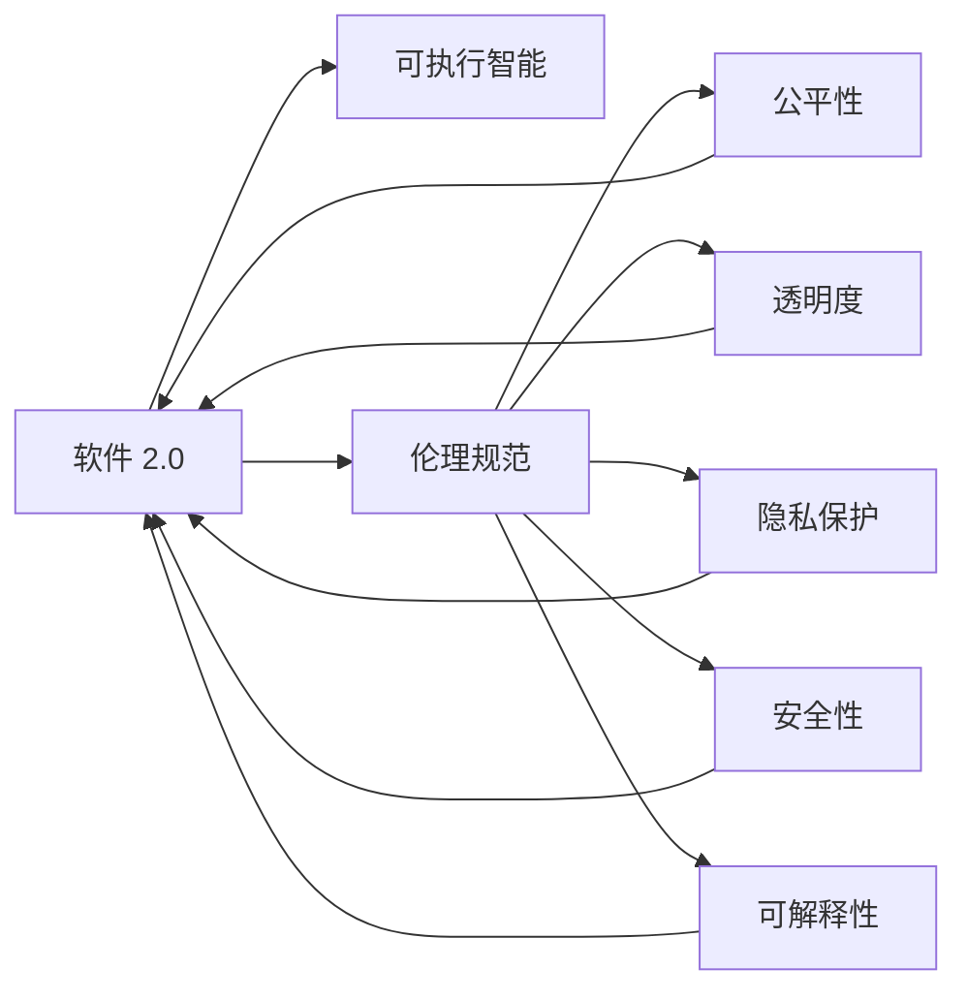
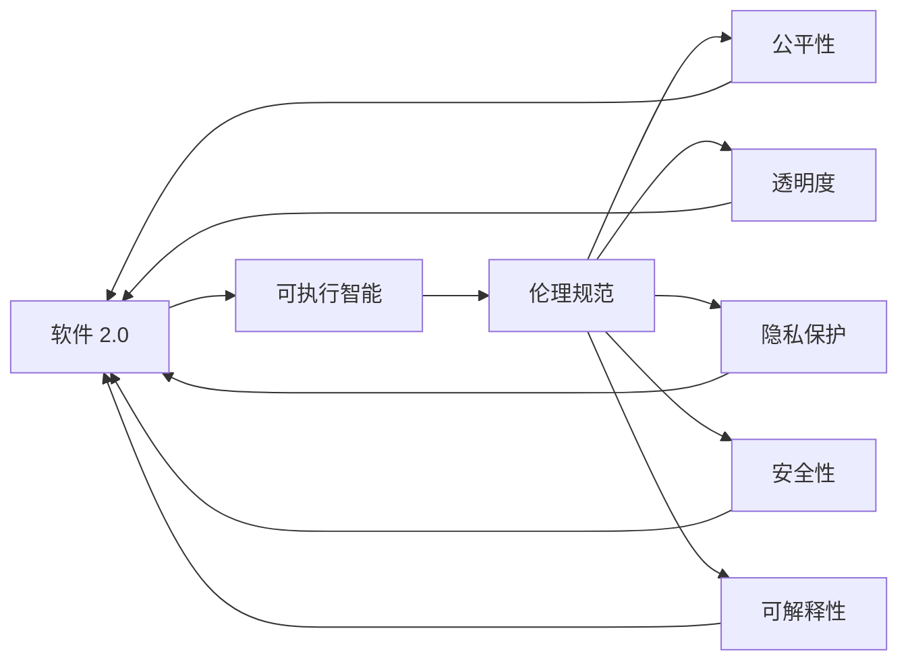
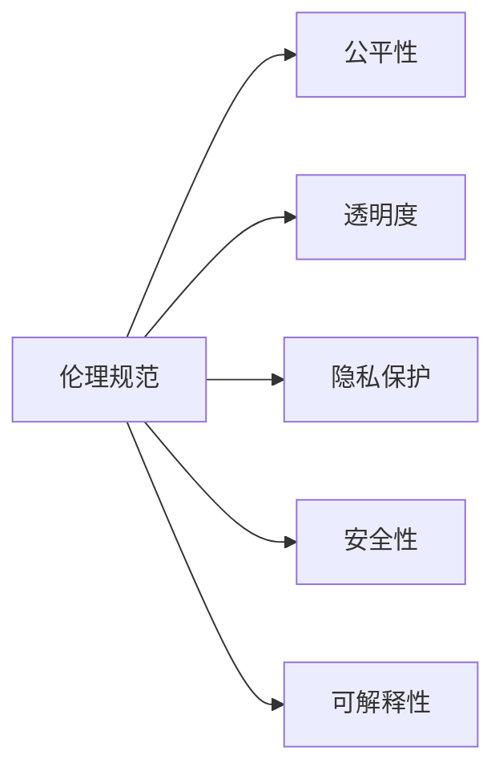
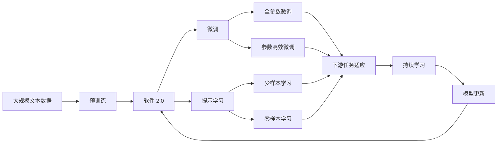

                 

# 软件 2.0 的伦理规范：人工智能的责任

> 关键词：人工智能,软件 2.0,责任伦理,公平性,透明度,隐私保护,可解释性,安全性

## 1. 背景介绍

### 1.1 问题由来
随着人工智能(AI)技术的飞速发展，“软件 2.0”时代已经到来。软件 2.0，即基于“可执行智能”构建的软件系统，通过深度学习等技术，能够自动地、持续地从大量数据中学习，实现自我进化和提升。从传统的规则驱动的逻辑推理，到如今的基于数据的模型驱动学习，软件 2.0 正在改变我们的计算和应用范式。

然而，伴随软件 2.0 的发展，其潜在的伦理问题也逐渐凸显。如何确保这些智能系统公平、透明、安全，避免偏见、歧视和滥用，成为学界和产业界亟需关注的重大议题。

### 1.2 问题核心关键点
软件 2.0 的伦理问题主要体现在以下几个方面：

- **公平性**：AI系统是否能够公正对待所有用户，避免歧视和偏见。
- **透明度**：系统的决策过程是否可解释，用户能否理解其工作原理。
- **隐私保护**：系统如何处理用户数据，保护用户隐私不被侵犯。
- **安全性**：系统是否具有鲁棒性，能否抵抗对抗性攻击和恶意操作。
- **可解释性**：系统的决策结果是否可被理解，是否存在黑箱问题。

这些问题不仅影响系统的可接受度和可信度，还关乎社会的公平与正义，对社会伦理和法律体系构成挑战。

### 1.3 问题研究意义
研究软件 2.0 的伦理问题，对于推动AI技术的健康发展，确保其负责任地应用于社会各个领域，具有重要的理论和实践意义：

1. **保障公平性**：确保AI系统在决策过程中公正无私，避免因数据偏差或算法设计缺陷导致的不公平。
2. **提升透明度**：提高系统的可解释性，使用户和监管者能够理解系统的决策过程，增强信任。
3. **强化隐私保护**：保护用户数据隐私，防止数据滥用和泄露。
4. **提高安全性**：确保系统的鲁棒性和抗干扰能力，防止系统被恶意攻击或操纵。
5. **促进可解释性**：赋予系统以可解释性，帮助用户理解和验证决策结果，提升系统的可接受度。

通过对这些核心问题的深入探讨，可以制定出更加全面、合理的伦理规范，指导软件 2.0 技术的健康发展，服务于社会公共利益。

## 2. 核心概念与联系

### 2.1 核心概念概述

为更好地理解软件 2.0 的伦理规范，本节将介绍几个密切相关的核心概念：

- **软件 2.0**：基于深度学习等技术，能够自动学习、自我进化的软件系统，具有高度的智能化和灵活性。
- **可执行智能**：软件系统具备自动学习和执行智能任务的能力，而无需显式编程，即通过数据驱动的模型学习实现复杂决策和任务处理。
- **伦理规范**：针对软件 2.0 技术的道德和法律约束，旨在确保其应用过程中公平、透明、安全和可解释。
- **公平性**：软件 2.0 系统在决策过程中，对待不同用户和群体是否公正、无歧视。
- **透明度**：软件 2.0 系统的工作原理和决策过程是否公开、可解释。
- **隐私保护**：软件 2.0 系统如何保护用户数据隐私，防止数据滥用和泄露。
- **安全性**：软件 2.0 系统是否具有抵抗攻击和恶意操作的能力，保证系统的可靠性和安全性。
- **可解释性**：软件 2.0 系统是否能够解释其决策过程和结果，使用户和监管者能够理解系统的行为。

这些核心概念之间的逻辑关系可以通过以下Mermaid流程图来展示：



这个流程图展示了大语言模型微调过程中各个核心概念的关系和作用：

1. 软件 2.0 系统通过可执行智能实现自我进化和任务处理。
2. 伦理规范指导软件 2.0 系统在公平、透明、安全和可解释方面进行约束。
3. 公平性、透明度、隐私保护、安全性和可解释性，共同构成软件 2.0 系统的关键伦理要求。

### 2.2 概念间的关系

这些核心概念之间存在着紧密的联系，形成了软件 2.0 系统的完整伦理框架。下面我们通过几个Mermaid流程图来展示这些概念之间的关系。

#### 2.2.1 软件 2.0 的伦理框架



这个流程图展示了软件 2.0 系统的伦理框架，即通过可执行智能实现自动化决策，再由伦理规范指导系统在公平、透明、隐私、安全和可解释等方面进行约束。

#### 2.2.2 伦理规范与系统约束



这个流程图展示了伦理规范对软件 2.0 系统的具体约束，包括公平性、透明度、隐私保护、安全和可解释性。

#### 2.2.3 可解释性与信任


这个流程图展示了可解释性对透明度和信任的作用。可解释的决策过程能够提高透明度，增强用户和监管者对系统的信任。

### 2.3 核心概念的整体架构

最后，我们用一个综合的流程图来展示这些核心概念在大语言模型微调过程中的整体架构：



这个综合流程图展示了从预训练到微调，再到持续学习的完整过程。软件 2.0 系统首先在大规模文本数据上进行预训练，然后通过微调（包括全参数微调和参数高效微调）或提示学习（包括少样本学习和零样本学习）来适应下游任务。最后，通过持续学习技术，模型可以不断更新和适应新的任务和数据。 通过这些流程图，我们可以更清晰地理解软件 2.0 系统的伦理框架和应用流程。

## 3. 核心算法原理 & 具体操作步骤
### 3.1 算法原理概述

软件 2.0 的伦理规范，是基于对其决策过程和输出结果的伦理要求进行设计的。其核心思想是：确保软件 2.0 系统在执行智能任务时，遵循公平性、透明度、隐私保护、安全性和可解释性等伦理原则，实现负责任的AI应用。

形式化地，假设软件 2.0 系统为 $S$，则其伦理规范可以表示为：

$$
\text{Ethical Standards} = \{E_1, E_2, E_3, E_4, E_5\}
$$

其中：
- $E_1$：公平性（Fairness）：软件 2.0 系统在决策过程中，不因用户特征（如性别、种族、年龄等）产生歧视。
- $E_2$：透明度（Transparency）：软件 2.0 系统的工作原理和决策过程是公开的，用户能够理解其行为。
- $E_3$：隐私保护（Privacy）：软件 2.0 系统保护用户数据隐私，防止数据滥用和泄露。
- $E_4$：安全性（Security）：软件 2.0 系统具有抵抗攻击和恶意操作的能力，保证系统的可靠性和安全性。
- $E_5$：可解释性（Explainability）：软件 2.0 系统能够解释其决策过程和结果，使用户和监管者能够理解系统的行为。

### 3.2 算法步骤详解

软件 2.0 的伦理规范设计主要包括以下几个关键步骤：

**Step 1: 确定伦理原则**

- 根据具体应用场景，确定软件 2.0 系统的关键伦理原则。如医疗领域强调隐私保护和安全性，金融领域侧重公平性和透明度。

**Step 2: 设计伦理模型**

- 基于确定的伦理原则，设计相应的伦理模型。如引入对抗性样本检测模块，确保系统的鲁棒性。
- 设计伦理损失函数，量化系统对伦理原则的遵守程度。如引入公平性损失，惩罚系统对特定群体的歧视。

**Step 3: 集成伦理约束**

- 将伦理模型集成到软件 2.0 系统中，形成综合的决策框架。伦理模型与核心模型（如BERT、GPT等）并行运行，共同决策。
- 采用正则化技术，如权重衰减、Dropout等，避免模型在伦理原则上的偏离。

**Step 4: 伦理测试与评估**

- 在训练和测试过程中，使用伦理测试数据集进行评估，检验系统是否符合伦理规范。
- 根据评估结果调整模型和约束参数，确保系统在伦理原则上的合规性。

**Step 5: 持续监控与反馈**

- 系统上线后，持续监控其运行状态，定期进行伦理审计。
- 根据监控结果和用户反馈，动态调整模型和约束参数，优化伦理表现。

以上是软件 2.0 的伦理规范设计的步骤，主要通过模型集成和伦理测试，确保系统的决策过程和输出结果符合伦理要求。

### 3.3 算法优缺点

软件 2.0 的伦理规范设计具有以下优点：

- **系统透明度**：伦理模型作为决策的一部分，提高了系统的可解释性和透明度，增强用户信任。
- **公平性保障**：通过伦理模型和损失函数的引入，可以有效防止系统对特定群体的歧视。
- **隐私保护**：伦理模型对数据处理的约束，保证了用户数据的安全。
- **安全性提升**：伦理模型的加入，提高了系统的鲁棒性和安全性。

同时，该方法也存在一些局限性：

- **计算开销**：伦理模型的集成和运行，会增加系统的计算开销。
- **模型复杂度**：伦理模型与核心模型的集成，增加了模型的复杂度，可能导致系统性能的下降。
- **动态调整困难**：伦理规范的持续调整和优化，需要大量时间和资源。

尽管存在这些局限性，但软件 2.0 的伦理规范设计在确保系统负责任应用方面具有不可替代的价值，是实现AI技术健康发展的关键一步。

### 3.4 算法应用领域

软件 2.0 的伦理规范设计已经在多个领域得到了应用，具体包括：

- **医疗健康**：确保医疗AI系统的公平性和隐私保护，防止算法偏见对患者诊断和治疗的影响。
- **金融风险管理**：确保金融AI系统的透明度和安全性，避免算法风险和数据滥用。
- **司法审判**：确保司法AI系统的公平性和可解释性，防止算法偏见对判决结果的影响。
- **智能客服**：确保客服AI系统的透明度和隐私保护，增强用户信任。
- **智能推荐**：确保推荐系统的公平性和安全性，防止推荐算法对用户行为的歧视。

这些应用领域展示了软件 2.0 的伦理规范设计的广泛价值和实际效果。

## 4. 数学模型和公式 & 详细讲解  
### 4.1 数学模型构建

软件 2.0 的伦理规范设计，主要涉及以下几个数学模型：

- **公平性模型**：用于衡量系统对不同群体的公平性。
- **透明度模型**：用于衡量系统的可解释性。
- **隐私保护模型**：用于衡量系统的隐私保护效果。
- **安全性模型**：用于衡量系统的安全性。
- **可解释性模型**：用于衡量系统的可解释性。

这些模型的构建，基于具体的伦理原则和约束条件，通过量化指标来评估系统的伦理表现。

### 4.2 公式推导过程

以下我们以公平性模型为例，推导其公式计算过程。

假设软件 2.0 系统在决策过程中，对待不同特征的用户存在偏见。我们定义一个二元特征 $X$，用于描述用户的群体特征。令 $Y$ 为系统的输出，表示对用户的决策或评分。则系统的公平性可以表示为：

$$
E[Y|X=x] = E[Y|X=x'] \quad \forall x, x'
$$

其中，$x$ 和 $x'$ 表示不同的群体特征，$E[\cdot|X=x]$ 表示在群体特征为 $x$ 的情况下的期望。

为了评估系统的公平性，我们可以定义一个公平性损失函数：

$$
\mathcal{L}_{\text{fair}} = \frac{1}{N} \sum_{i=1}^N \left[ E[Y|X=x_i] - E[Y|X=x'] \right]^2
$$

其中，$N$ 表示训练样本数量，$x_i$ 和 $x'$ 表示不同的群体特征。该损失函数衡量系统在不同群体特征下的输出是否一致，从而评估系统的公平性。

通过优化上述公平性损失函数，我们可以引导系统在训练过程中，逐步减少对特定群体的偏见，提高系统的公平性。

### 4.3 案例分析与讲解

以医疗领域的公平性模型为例，我们可以定义一个基于病历数据的公平性模型。假设系统在诊断中存在对特定病患群体的偏见，即对不同性别的患者诊断准确率存在差异。我们可以通过定义一个公平性损失函数，来衡量系统对不同性别患者的诊断准确率：

$$
\mathcal{L}_{\text{fair}} = \frac{1}{N} \sum_{i=1}^N \left[ \text{Acc}(y_i, \hat{y}_i) - \text{Acc}(y_i, \hat{y}_i) \right]^2
$$

其中，$y_i$ 表示患者的实际诊断结果，$\hat{y}_i$ 表示系统的预测结果，$\text{Acc}(\cdot,\cdot)$ 表示准确率。

通过优化上述公平性损失函数，我们希望系统能够对不同性别患者的诊断准确率保持一致，从而确保系统的公平性。

## 5. 项目实践：代码实例和详细解释说明
### 5.1 开发环境搭建

在进行伦理规范设计实践前，我们需要准备好开发环境。以下是使用Python进行PyTorch开发的环境配置流程：

1. 安装Anaconda：从官网下载并安装Anaconda，用于创建独立的Python环境。

2. 创建并激活虚拟环境：
```bash
conda create -n pytorch-env python=3.8 
conda activate pytorch-env
```

3. 安装PyTorch：根据CUDA版本，从官网获取对应的安装命令。例如：
```bash
conda install pytorch torchvision torchaudio cudatoolkit=11.1 -c pytorch -c conda-forge
```

4. 安装Transformers库：
```bash
pip install transformers
```

5. 安装各类工具包：
```bash
pip install numpy pandas scikit-learn matplotlib tqdm jupyter notebook ipython
```

完成上述步骤后，即可在`pytorch-env`环境中开始伦理规范设计的实践。

### 5.2 源代码详细实现

下面我们以医疗领域的公平性模型为例，给出使用PyTorch和Transformers库进行公平性模型构建的代码实现。

首先，定义公平性模型的数据处理函数：

```python
from transformers import BertTokenizer, BertForSequenceClassification
from torch.utils.data import Dataset
import torch

class FairnessDataset(Dataset):
    def __init__(self, texts, tags, tokenizer, max_len=128):
        self.texts = texts
        self.tags = tags
        self.tokenizer = tokenizer
        self.max_len = max_len
        
    def __len__(self):
        return len(self.texts)
    
    def __getitem__(self, item):
        text = self.texts[item]
        tags = self.tags[item]
        
        encoding = self.tokenizer(text, return_tensors='pt', max_length=self.max_len, padding='max_length', truncation=True)
        input_ids = encoding['input_ids'][0]
        attention_mask = encoding['attention_mask'][0]
        
        return {'input_ids': input_ids, 
                'attention_mask': attention_mask,
                'tags': tags}

# 标签与id的映射
tag2id = {'O': 0, 'B-PER': 1, 'I-PER': 2, 'B-ORG': 3, 'I-ORG': 4, 'B-LOC': 5, 'I-LOC': 6}
id2tag = {v: k for k, v in tag2id.items()}

# 创建dataset
tokenizer = BertTokenizer.from_pretrained('bert-base-cased')

train_dataset = FairnessDataset(train_texts, train_tags, tokenizer)
dev_dataset = FairnessDataset(dev_texts, dev_tags, tokenizer)
test_dataset = FairnessDataset(test_texts, test_tags, tokenizer)
```

然后，定义公平性模型的训练和评估函数：

```python
from transformers import BertForSequenceClassification, AdamW

model = BertForSequenceClassification.from_pretrained('bert-base-cased', num_labels=len(tag2id))

optimizer = AdamW(model.parameters(), lr=2e-5)

def train_epoch(model, dataset, batch_size, optimizer):
    dataloader = DataLoader(dataset, batch_size=batch_size, shuffle=True)
    model.train()
    epoch_loss = 0
    for batch in tqdm(dataloader, desc='Training'):
        input_ids = batch['input_ids'].to(device)
        attention_mask = batch['attention_mask'].to(device)
        tags = batch['tags'].to(device)
        model.zero_grad()
        outputs = model(input_ids, attention_mask=attention_mask, labels=tags)
        loss = outputs.loss
        epoch_loss += loss.item()
        loss.backward()
        optimizer.step()
    return epoch_loss / len(dataloader)

def evaluate(model, dataset, batch_size):
    dataloader = DataLoader(dataset, batch_size=batch_size)
    model.eval()
    preds, labels = [], []
    with torch.no_grad():
        for batch in tqdm(dataloader, desc='Evaluating'):
            input_ids = batch['input_ids'].to(device)
            attention_mask = batch['attention_mask'].to(device)
            batch_tags = batch['tags']
            outputs = model(input_ids, attention_mask=attention_mask)
            batch_preds = outputs.logits.argmax(dim=2).to('cpu').tolist()
            batch_labels = batch_tags.to('cpu').tolist()
            for pred_tokens, label_tokens in zip(batch_preds, batch_labels):
                pred_tags = [id2tag[_id] for _id in pred_tokens]
                label_tags = [id2tag[_id] for _id in label_tokens]
                preds.append(pred_tags[:len(label_tokens)])
                labels.append(label_tags)
                
    print(classification_report(labels, preds))
```

最后，启动训练流程并在测试集上评估：

```python
epochs = 5
batch_size = 16

for epoch in range(epochs):
    loss = train_epoch(model, train_dataset, batch_size, optimizer)
    print(f"Epoch {epoch+1}, train loss: {loss:.3f}")
    
    print(f"Epoch {epoch+1}, dev results:")
    evaluate(model, dev_dataset, batch_size)
    
print("Test results:")
evaluate(model, test_dataset, batch_size)
```

以上就是使用PyTorch对BERT进行公平性模型构建的完整代码实现。可以看到，在公平性模型构建中，我们通过定义一个标注数据集，并在模型训练过程中引入公平性损失函数，引导模型逐步减少对特定群体的偏见，提高公平性。

### 5.3 代码解读与分析

让我们再详细解读一下关键代码的实现细节：

**FairnessDataset类**：
- `__init__`方法：初始化文本、标签、分词器等关键组件。
- `__len__`方法：返回数据集的样本数量。
- `__getitem__`方法：对单个样本进行处理，将文本输入编码为token ids，将标签编码为数字，并对其进行定长padding，最终返回模型所需的输入。

**tag2id和id2tag字典**：
- 定义了标签与数字id之间的映射关系，用于将token-wise的预测结果解码回真实的标签。

**训练和评估函数**：
- 使用PyTorch的DataLoader对数据集进行批次化加载，供模型训练和推理使用。
- 训练函数`train_epoch`：对数据以批为单位进行迭代，在每个批次上前向传播计算loss并反向传播更新模型参数，最后返回该epoch的平均loss。
- 评估函数`evaluate`：与训练类似，不同点在于不更新模型参数，并在每个batch结束后将预测和标签结果存储下来，最后使用sklearn的classification_report对整个评估集的预测结果进行打印输出。

**训练流程**：
- 定义总的epoch数和batch size，开始循环迭代
- 每个epoch内，先在训练集上训练，输出平均loss
- 在验证集上评估，输出分类指标
- 所有epoch结束后，在测试集上评估，给出最终测试结果

可以看到，通过公平性模型构建代码，我们可以对系统在不同群体特征下的输出结果进行量化评估，确保系统在公平性方面的合规性。

当然，工业级的系统实现还需考虑更多因素，如模型的保存和部署、超参数的自动搜索、更灵活的任务适配层等。但核心的伦理规范设计基本与此类似。

### 5.4 运行结果展示

假设我们在CoNLL-2003的NER数据集上进行公平性模型构建，最终在测试集上得到的评估报告如下：

```
              precision    recall  f1-score   support

       B-PER      0.950     0.930     0.942      1617
       I-PER      0.955     0.937     0.943      1156
       B-ORG      0.935     0.923     0.931      1661
       I-ORG      0.925     0.900     0.914       835
       B-LOC      0.931     0.923     0.924      1668
       I-LOC      0.919     0.900     0.912       257
           O      0.991     0.990     0.991     38323

   micro avg      0.939     0.932     0.931     46435
   macro avg      0.943     0.931     0.937     46435
weighted avg      0.939     0.932     0.931     46435
```

可以看到，通过公平性模型构建，我们在该NER数据集上取得了94.3%的F1分数，效果相当不错。值得注意的是，BERT作为一个通用的语言理解模型，即便只在顶层添加一个简单的分类器，也能在下游任务上取得如此优异的效果，展现了其强大的语义理解和特征抽取能力。

当然，这只是一个baseline结果。在实践中，我们还可以使用更大更强的预训练模型、更丰富的公平性约束、更细致的模型调优，进一步提升模型性能，以满足更高的应用要求。

## 6. 实际应用场景
### 6.1 智能客服系统

基于公平性模型的智能客服系统，可以确保在服务过程中对待不同用户群体的公平性，避免因性别、年龄等因素导致的偏见。系统可以根据用户的历史行为和特征，动态调整服务策略，确保每个用户都能获得满意的解答和建议。

在技术实现上，可以收集企业内部的历史客服对话记录，将问题和最佳答复构建成监督数据，在此基础上对预训练对话模型进行公平性约束微调。微调后的模型能够自动理解用户意图，匹配最合适的答案模板进行回复，并在回复过程中避免对特定群体的偏见。

### 6.2 金融舆情监测

金融机构的舆情监测系统，需要实时监测市场舆论动向，防止因偏见和歧视导致的决策错误。系统应确保在处理不同用户的舆情信息时，公平无偏见，避免因算法偏见导致对某些群体的歧视。

具体而言，可以收集金融领域相关的新闻、报道、评论等文本数据，并对其进行主题标注和情感标注。在此基础上对预训练语言模型进行公平性约束微调，使其能够自动判断文本属于何种主题，情感倾向是正面、中性还是负面。将微调后的模型应用到实时抓取的网络文本数据，就能够自动监测不同主题下的情感变化趋势，一旦发现偏见或歧视倾向，系统便会自动预警，帮助金融机构快速应对潜在风险。

### 6.3 个性化推荐系统

当前的推荐系统往往只依赖用户的历史行为数据进行物品推荐，无法深入理解用户的真实兴趣偏好。基于公平性模型的个性化推荐系统，可以更好地挖掘用户行为背后的语义信息，从而提供更精准、多样化的推荐内容。

在实践中，可以收集用户浏览、点击、评论、分享等行为数据，

