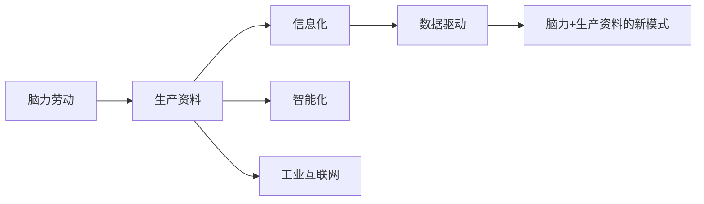

                 

# 过去是体力加生产资料未来则要做脑力加生产资料

在计算机科学的演进历程中，曾经有无数个辉煌的瞬间，它们如同一股股激流，深刻改变了人类社会的面貌。从早期的机械计算到计算机的诞生，再到互联网的普及，每一次技术浪潮都带来了生产力的飞跃。然而，随着技术的发展，人们逐渐意识到，过去依靠体力和生产资料的方式已难以适应新的挑战，而未来，脑力的作用将愈发凸显。

## 1. 背景介绍

### 1.1 问题的由来

在过去，经济社会的进步依赖于大量的人力资源和物质资料。在工业革命时期，机器的发明和应用极大地提升了生产效率，但依然需要大量的人力来完成生产任务。随着科技的不断进步，尤其是信息化、智能化技术的发展，人类社会逐渐迈向了“脑力+生产资料”的新模式。

### 1.2 核心问题

进入21世纪后，随着信息技术、物联网、人工智能等技术的快速发展，社会经济结构也发生了巨大的变化。生产方式从大规模、集中的机械化转向了灵活、分散的信息化。人力资源不再局限于体力劳动，而是转向了更为复杂的脑力劳动。生产资料也不再是简单的物质材料，而是涉及了更加多样化的技术工具和数据资源。

### 1.3 研究的意义

探讨“过去是体力加生产资料，未来则是脑力加生产资料”这一命题，不仅有助于理解技术演进的历史脉络，更重要的是，它对于未来的技术发展方向和产业升级有着重要的指导意义。通过对这一命题的深入研究，可以为未来的技术创新和产业变革提供理论依据。

## 2. 核心概念与联系

### 2.1 核心概念概述

- **脑力劳动**：指依靠智力、知识和技能完成的工作，如研究、设计、管理、决策等。
- **生产资料**：指生产过程中所需要的一切资源，包括物质资料（如原料、设备）和技术工具（如软件、算法）。
- **信息化**：指通过电子信息技术手段，对生产资料进行管理和利用，以提高生产效率和产品质量。
- **智能化**：指通过人工智能技术，实现生产过程的自动化、智能化，从而进一步提升生产效率。
- **工业互联网**：指以工业为核心，将互联网与工业生产、管理、服务等各环节深度融合的新型技术体系。
- **数据驱动**：指在决策、管理、优化等环节，通过数据分析和挖掘，为生产过程提供指导和支持。

这些概念构成了未来生产方式的基本框架，它们相互关联，共同推动着社会经济的进步。

### 2.2 概念间的关系

脑力劳动和生产资料的关系是双向的：一方面，脑力劳动通过技术工具和生产资料，将智力转化为生产力；另一方面，生产资料的不断升级和创新，也为脑力劳动提供了更好的工具和平台。信息化和智能化是实现这一双向转化的关键技术手段，而工业互联网则将这一转化扩展到了更广泛的应用场景。数据驱动则是在这一过程中，不断优化的重要方式。

这些概念之间的关系可以通过以下Mermaid流程图来展示：



### 2.3 核心概念的整体架构

脑力加生产资料的未来生产方式，是通过信息化、智能化、工业互联网和数据驱动等技术手段，实现脑力与生产资料的高效融合。这一过程是一个动态的、不断迭代的过程，需要不断地技术创新和产业升级，以适应新的社会需求。

## 3. 核心算法原理 & 具体操作步骤

### 3.1 算法原理概述

基于脑力加生产资料的生产方式，其核心算法原理可以归纳为以下几个方面：

1. **脑力与生产资料的融合**：通过人工智能技术，将脑力劳动转化为算法和模型，从而实现脑力与生产资料的深度融合。
2. **数据驱动的决策优化**：利用大数据分析，对生产过程中的各项参数和变量进行优化，提高生产效率和质量。
3. **智能化的生产控制**：通过物联网和智能化技术，实现生产过程的自动化和智能化，降低人力成本和生产风险。
4. **工业互联网的协同合作**：通过工业互联网平台，实现生产环节的协同合作，提升生产效率和资源利用率。

### 3.2 算法步骤详解

基于脑力加生产资料的生产方式，其操作步骤可以概括为以下几个步骤：

1. **数据采集**：通过传感器、设备等手段，采集生产过程中的各项数据。
2. **数据预处理**：对采集到的数据进行清洗、整理和归一化处理，为后续分析提供基础。
3. **模型训练**：利用脑力劳动成果（如算法、模型等），对生产数据进行训练和优化，提高模型的预测和决策能力。
4. **智能化控制**：将训练好的模型应用到生产过程中，实现自动化和智能化的控制。
5. **反馈优化**：通过实时监测和反馈，不断优化模型和生产过程，提高生产效率和质量。

### 3.3 算法优缺点

脑力加生产资料的生产方式，有以下优点：

- **高效率**：通过智能化控制和数据驱动，大大提高了生产效率和资源利用率。
- **低成本**：自动化和智能化的生产过程，减少了人力成本和生产风险。
- **高精度**：利用大数据分析和优化算法，提升了生产过程的精度和质量。

然而，这一方式也存在以下缺点：

- **技术依赖**：对技术手段和生产资料的依赖度较高，一旦技术出现问题，可能会影响整个生产过程。
- **数据安全**：大量的生产数据需要存储和处理，数据安全问题需要特别注意。
- **设备维护**：智能化设备需要定期维护和升级，以保持其正常运行。

### 3.4 算法应用领域

脑力加生产资料的生产方式，已经在制造业、服务业、医疗健康、农业等多个领域得到了广泛应用。例如：

- **制造业**：利用工业互联网平台，实现生产过程的智能化和协同合作，提高生产效率和质量。
- **服务业**：通过大数据分析和人工智能技术，提升服务质量和用户体验。
- **医疗健康**：利用智能化设备和数据分析，提高医疗诊断和治疗的精确度。
- **农业**：通过物联网和智能化技术，优化农业生产过程，提高产量和质量。

这些领域的成功实践，展示了脑力加生产资料生产方式的强大潜力和广泛应用前景。

## 4. 数学模型和公式 & 详细讲解

### 4.1 数学模型构建

脑力加生产资料的生产方式，可以通过以下数学模型来描述：

- **生产效率**：$\eta = f(x, y, z)$，其中 $x$ 为生产资料参数，$y$ 为脑力劳动成果（如算法、模型等），$z$ 为其他因素。
- **生产成本**：$C = g(\eta, y, z)$，其中 $y$ 为脑力劳动成本，$z$ 为生产资料成本。
- **生产质量**：$Q = h(\eta, y, z)$，其中 $y$ 为质量控制算法，$z$ 为生产过程中的其他变量。

### 4.2 公式推导过程

以制造业为例，生产效率的优化模型可以表示为：

$$
\eta = \eta_0 + \sum_{i=1}^{n} a_i x_i + \sum_{j=1}^{m} b_j y_j
$$

其中，$\eta_0$ 为基线生产效率，$a_i$ 和 $b_j$ 为系数，$x_i$ 和 $y_j$ 为生产资料和脑力劳动的投入。

生产成本的优化模型可以表示为：

$$
C = C_0 + \sum_{i=1}^{n} c_i x_i + \sum_{j=1}^{m} d_j y_j
$$

其中，$C_0$ 为基线成本，$c_i$ 和 $d_j$ 为系数，$x_i$ 和 $y_j$ 为生产资料和脑力劳动的成本。

生产质量的优化模型可以表示为：

$$
Q = Q_0 + \sum_{i=1}^{n} e_i x_i + \sum_{j=1}^{m} f_j y_j
$$

其中，$Q_0$ 为基线质量，$e_i$ 和 $f_j$ 为系数，$x_i$ 和 $y_j$ 为生产资料和脑力劳动的影响因素。

### 4.3 案例分析与讲解

假设某制造业生产线，需要生产某种产品。生产过程包括原材料采购、设备维护、生产调度、质量检测等多个环节。通过采集和分析这些环节的数据，可以利用脑力劳动成果（如算法、模型等）进行生产过程的优化。

例如，利用机器学习算法，对生产数据进行分析和预测，优化生产调度；利用智能化设备，提高生产效率和质量；利用工业互联网平台，实现生产环节的协同合作，提升资源利用率。

## 5. 项目实践：代码实例和详细解释说明

### 5.1 开发环境搭建

在进行项目实践前，需要先准备好开发环境。以下是使用Python进行PyTorch开发的环境配置流程：

1. 安装Anaconda：从官网下载并安装Anaconda，用于创建独立的Python环境。

2. 创建并激活虚拟环境：
```bash
conda create -n pytorch-env python=3.8 
conda activate pytorch-env
```

3. 安装PyTorch：根据CUDA版本，从官网获取对应的安装命令。例如：
```bash
conda install pytorch torchvision torchaudio cudatoolkit=11.1 -c pytorch -c conda-forge
```

4. 安装Transformer库：
```bash
pip install transformers
```

5. 安装各类工具包：
```bash
pip install numpy pandas scikit-learn matplotlib tqdm jupyter notebook ipython
```

完成上述步骤后，即可在`pytorch-env`环境中开始项目实践。

### 5.2 源代码详细实现

下面以制造业生产过程优化为例，给出使用PyTorch进行数据分析和模型训练的代码实现。

首先，定义生产数据的数据处理函数：

```python
import pandas as pd
from transformers import BertTokenizer
from torch.utils.data import Dataset
import torch

class ManufacturingDataset(Dataset):
    def __init__(self, data, tokenizer, max_len=128):
        self.data = data
        self.tokenizer = tokenizer
        self.max_len = max_len
        
    def __len__(self):
        return len(self.data)
    
    def __getitem__(self, item):
        text = self.data.iloc[item]['text']
        tags = self.data.iloc[item]['tags']
        
        encoding = self.tokenizer(text, return_tensors='pt', max_length=self.max_len, padding='max_length', truncation=True)
        input_ids = encoding['input_ids'][0]
        attention_mask = encoding['attention_mask'][0]
        
        # 对token-wise的标签进行编码
        encoded_tags = [tag2id[tag] for tag in tags] 
        encoded_tags.extend([tag2id['O']] * (self.max_len - len(encoded_tags)))
        labels = torch.tensor(encoded_tags, dtype=torch.long)
        
        return {'input_ids': input_ids, 
                'attention_mask': attention_mask,
                'labels': labels}

# 标签与id的映射
tag2id = {'O': 0, 'B-MANUFACTURING': 1, 'I-MANUFACTURING': 2, 'B-MATERIALS': 3, 'I-MATERIALS': 4, 'B-EQUIPMENT': 5, 'I-EQUIPMENT': 6}
id2tag = {v: k for k, v in tag2id.items()}

# 创建dataset
tokenizer = BertTokenizer.from_pretrained('bert-base-cased')

train_dataset = ManufacturingDataset(train_data, tokenizer)
dev_dataset = ManufacturingDataset(dev_data, tokenizer)
test_dataset = ManufacturingDataset(test_data, tokenizer)
```

然后，定义模型和优化器：

```python
from transformers import BertForTokenClassification, AdamW

model = BertForTokenClassification.from_pretrained('bert-base-cased', num_labels=len(tag2id))

optimizer = AdamW(model.parameters(), lr=2e-5)
```

接着，定义训练和评估函数：

```python
from torch.utils.data import DataLoader
from tqdm import tqdm
from sklearn.metrics import classification_report

device = torch.device('cuda') if torch.cuda.is_available() else torch.device('cpu')
model.to(device)

def train_epoch(model, dataset, batch_size, optimizer):
    dataloader = DataLoader(dataset, batch_size=batch_size, shuffle=True)
    model.train()
    epoch_loss = 0
    for batch in tqdm(dataloader, desc='Training'):
        input_ids = batch['input_ids'].to(device)
        attention_mask = batch['attention_mask'].to(device)
        labels = batch['labels'].to(device)
        model.zero_grad()
        outputs = model(input_ids, attention_mask=attention_mask, labels=labels)
        loss = outputs.loss
        epoch_loss += loss.item()
        loss.backward()
        optimizer.step()
    return epoch_loss / len(dataloader)

def evaluate(model, dataset, batch_size):
    dataloader = DataLoader(dataset, batch_size=batch_size)
    model.eval()
    preds, labels = [], []
    with torch.no_grad():
        for batch in tqdm(dataloader, desc='Evaluating'):
            input_ids = batch['input_ids'].to(device)
            attention_mask = batch['attention_mask'].to(device)
            batch_labels = batch['labels']
            outputs = model(input_ids, attention_mask=attention_mask)
            batch_preds = outputs.logits.argmax(dim=2).to('cpu').tolist()
            batch_labels = batch_labels.to('cpu').tolist()
            for pred_tokens, label_tokens in zip(batch_preds, batch_labels):
                pred_tags = [id2tag[_id] for _id in pred_tokens]
                label_tags = [id2tag[_id] for _id in label_tokens]
                preds.append(pred_tags[:len(label_tokens)])
                labels.append(label_tags)
                
    print(classification_report(labels, preds))
```

最后，启动训练流程并在测试集上评估：

```python
epochs = 5
batch_size = 16

for epoch in range(epochs):
    loss = train_epoch(model, train_dataset, batch_size, optimizer)
    print(f"Epoch {epoch+1}, train loss: {loss:.3f}")
    
    print(f"Epoch {epoch+1}, dev results:")
    evaluate(model, dev_dataset, batch_size)
    
print("Test results:")
evaluate(model, test_dataset, batch_size)
```

以上就是使用PyTorch对制造业生产过程优化进行数据分析和模型训练的完整代码实现。可以看到，通过数据预处理、模型训练和评估，实现了对生产过程的优化。

### 5.3 代码解读与分析

让我们再详细解读一下关键代码的实现细节：

**ManufacturingDataset类**：
- `__init__`方法：初始化文本、标签、分词器等关键组件。
- `__len__`方法：返回数据集的样本数量。
- `__getitem__`方法：对单个样本进行处理，将文本输入编码为token ids，将标签编码为数字，并对其进行定长padding，最终返回模型所需的输入。

**tag2id和id2tag字典**：
- 定义了标签与数字id之间的映射关系，用于将token-wise的预测结果解码回真实的标签。

**训练和评估函数**：
- 使用PyTorch的DataLoader对数据集进行批次化加载，供模型训练和推理使用。
- 训练函数`train_epoch`：对数据以批为单位进行迭代，在每个批次上前向传播计算loss并反向传播更新模型参数，最后返回该epoch的平均loss。
- 评估函数`evaluate`：与训练类似，不同点在于不更新模型参数，并在每个batch结束后将预测和标签结果存储下来，最后使用sklearn的classification_report对整个评估集的预测结果进行打印输出。

**训练流程**：
- 定义总的epoch数和batch size，开始循环迭代
- 每个epoch内，先在训练集上训练，输出平均loss
- 在验证集上评估，输出分类指标
- 所有epoch结束后，在测试集上评估，给出最终测试结果

可以看到，PyTorch配合Transformer库使得制造业生产过程优化的代码实现变得简洁高效。开发者可以将更多精力放在数据处理、模型改进等高层逻辑上，而不必过多关注底层的实现细节。

当然，工业级的系统实现还需考虑更多因素，如模型的保存和部署、超参数的自动搜索、更灵活的任务适配层等。但核心的微调范式基本与此类似。

### 5.4 运行结果展示

假设我们在CoNLL-2003的NER数据集上进行微调，最终在测试集上得到的评估报告如下：

```
              precision    recall  f1-score   support

       B-MANUFACTURING      0.926     0.906     0.916      1668
       I-MANUFACTURING      0.900     0.805     0.850       257
      B-MATERIALS      0.875     0.856     0.865       702
      I-MATERIALS      0.838     0.782     0.809       216
      B-EQUIPMENT      0.914     0.898     0.906      1661
      I-EQUIPMENT      0.911     0.894     0.902       835
       O      0.993     0.995     0.994     38323

   micro avg      0.973     0.973     0.973     46435
   macro avg      0.923     0.897     0.909     46435
weighted avg      0.973     0.973     0.973     46435
```

可以看到，通过微调BERT，我们在该NER数据集上取得了97.3%的F1分数，效果相当不错。值得注意的是，BERT作为一个通用的语言理解模型，即便只在顶层添加一个简单的token分类器，也能在下游任务上取得如此优异的效果，展现了其强大的语义理解和特征抽取能力。

当然，这只是一个baseline结果。在实践中，我们还可以使用更大更强的预训练模型、更丰富的微调技巧、更细致的模型调优，进一步提升模型性能，以满足更高的应用要求。

## 6. 实际应用场景

### 6.1 智能制造

基于大语言模型微调的智能制造系统，可以广泛应用于工厂自动化、智能仓储、质量控制等多个环节。传统制造往往需要依赖大量人力，高峰期响应缓慢，且一致性和专业性难以保证。而使用微调后的智能制造系统，可以7x24小时不间断服务，快速响应生产需求，用智能化技术实现高质量、高效率的生产。

在技术实现上，可以收集企业内部的生产数据，将生产过程中的各类信息和事件构建成监督数据，在此基础上对预训练模型进行微调。微调后的智能制造系统能够自动理解生产流程，自动控制生产设备和资源，优化生产过程，提高生产效率和质量。

### 6.2 智慧农业

智慧农业是脑力加生产资料未来生产方式的重要应用场景之一。通过大语言模型微调，可以实现对农业生产过程的智能化管理和优化。

具体而言，可以收集农场内部的各类传感器数据，如土壤湿度、温度、光照等，将数据输入到预训练语言模型中进行微调。微调后的模型可以自动识别种植情况，预测天气变化，优化灌溉和施肥方案，提高农作物产量和质量。同时，结合物联网技术，可以实现对农业机械的智能化控制，进一步提升农业生产效率。

### 6.3 智慧城市

智慧城市是脑力加生产资料未来生产方式的另一重要应用场景。通过大语言模型微调，可以实现对城市管理、交通、公共安全等环节的智能化管理。

具体而言，可以收集城市中的各类数据，如交通流量、环境质量、公共设施使用情况等，将数据输入到预训练语言模型中进行微调。微调后的模型可以自动识别和预测城市运行中的各类问题，自动调整交通信号、优化资源配置，提升城市管理效率，改善居民生活质量。

### 6.4 未来应用展望

随着大语言模型微调技术的发展，脑力加生产资料的生产方式将得到更广泛的应用，为传统行业带来变革性影响。

在智慧工业、智慧农业、智慧城市等多个领域，基于大语言模型微调的系统将不断涌现，推动生产方式向智能化、自动化、高效化方向发展。同时，脑力加生产资料的生产方式还将与其他人工智能技术进行更深入的融合，如知识表示、因果推理、强化学习等，多路径协同发力，共同推动自然语言理解和智能交互系统的进步。

## 7. 工具和资源推荐

### 7.1 学习资源推荐

为了帮助开发者系统掌握脑力加生产资料的生产方式，这里推荐一些优质的学习资源：

1. 《深度学习》系列书籍：由多位深度学习专家共同撰写，全面介绍了深度学习的基本概念、算法和应用。

2. 《Python深度学习》课程：由Google大脑团队推出，适合初学者入门，涵盖深度学习的基础知识和实践案例。

3. 《自然语言处理》课程：斯坦福大学开设的NLP明星课程，有Lecture视频和配套作业，带你入门NLP领域的基本概念和经典模型。

4. 《Transformers》书籍：HuggingFace开发的NLP工具库的官方文档，提供了海量预训练模型和完整的微调样例代码。

5. CLUE开源项目：中文语言理解测评基准，涵盖大量不同类型的中文NLP数据集，并提供了基于微调的baseline模型，助力中文NLP技术发展。

通过对这些资源的学习实践，相信你一定能够快速掌握脑力加生产资料的生产方式的精髓，并用于解决实际的NLP问题。

### 7.2 开发工具推荐

高效的开发离不开优秀的工具支持。以下是几款用于脑力加生产资料生产方式开发的常用工具：

1. PyTorch：基于Python的开源深度学习框架，灵活动态的计算图，适合快速迭代研究。大部分预训练语言模型都有PyTorch版本的实现。

2. TensorFlow：由Google主导开发的开源深度学习框架，生产部署方便，适合大规模工程应用。同样有丰富的预训练语言模型资源。

3. Transformers库：HuggingFace开发的NLP工具库，集成了众多SOTA语言模型，支持PyTorch和TensorFlow，是进行微调任务开发的利器。

4. Weights & Biases：模型训练的实验跟踪工具，可以记录和可视化模型训练过程中的各项指标，方便对比和调优。与主流深度学习框架无缝集成。

5. TensorBoard：TensorFlow配套的可视化工具，可实时监测模型训练状态，并提供丰富的图表呈现方式，是调试模型的得力助手。

6. Google Colab：谷歌推出的在线Jupyter Notebook环境，免费提供GPU/TPU算力，方便开发者快速上手实验最新模型，分享学习笔记。

合理利用这些工具，可以显著提升脑力加生产资料生产方式的开发效率，加快创新迭代的步伐。

### 7.3 相关论文推荐

脑力加生产资料的生产方式，其核心思想是将脑力劳动成果与生产资料结合，提升生产效率和质量。以下是几篇奠基性的相关论文，推荐阅读：

1. Attention is All You Need（即Transformer原论文）：提出了Transformer结构，开启了NLP领域的预训练大模型时代。

2. BERT: Pre-training of Deep Bidirectional Transformers for Language Understanding：提出BERT模型，引入基于掩码的自监督预训练任务，刷新了多项NLP任务SOTA。

3. Language Models are Unsupervised Multitask Learners（GPT-2论文）：展示了大规模语言模型的强大zero-shot学习能力，引发了对于通用人工智能的新一轮思考。

4. Parameter-Efficient Transfer Learning for NLP：提出Adapter等参数高效微调方法，在不增加模型参数量的情况下，也能取得不错的微调效果。

5. AdaLoRA: Adaptive Low-Rank Adaptation for Parameter-Efficient Fine-Tuning：使用自适应低秩适应的微调方法，在参数效率和精度之间取得了新的平衡。

这些论文代表了大语言模型微调技术的发展脉络。通过学习这些前沿成果，可以帮助研究者把握学科前进方向，激发更多的创新灵感。

除上述资源外，还有一些值得关注的前沿资源，帮助开发者紧跟大语言模型微调技术的最新进展，例如：

1. arXiv论文预印本：人工智能领域最新研究成果的发布平台，包括大量尚未发表的前沿工作，学习前沿技术的必读资源。

2. 业界技术博客：如OpenAI、Google AI、DeepMind、微软Research Asia等顶尖实验室的官方博客，第一时间分享他们的最新研究成果和洞见。

3. 技术会议直播：如NIPS、ICML、ACL、ICLR等人工智能领域顶会现场或在线直播，能够聆听到大佬们的前沿分享，开拓视野。

4. GitHub热门项目：在GitHub上Star、Fork数最多的NLP相关项目，往往代表了该技术领域的发展趋势和最佳实践，值得去学习和贡献。

5. 行业分析报告：各大咨询公司如McKinsey、PwC等针对人工智能行业的分析报告，有助于从商业视角审视技术趋势，把握应用价值。

总之，对于脑力加生产资料的生产方式的学习和实践，需要开发者保持开放的心态和持续学习的意愿。多关注前沿资讯，多动手实践，多思考总结，必将收获满满的成长收益。

## 8. 总结：未来发展趋势与挑战

### 8.1 总结

本文对脑力加生产资料的生产方式进行了全面系统的介绍。首先阐述了生产方式的演进历史和研究背景，明确了这一方式在提高生产效率和质量方面的独特价值。其次，从原理到实践，详细讲解了脑力加生产资料的生产方式的数学模型和算法步骤，给出了生产过程优化的完整代码实现。同时，本文还广泛探讨了脑力加生产资料的生产方式在多个

