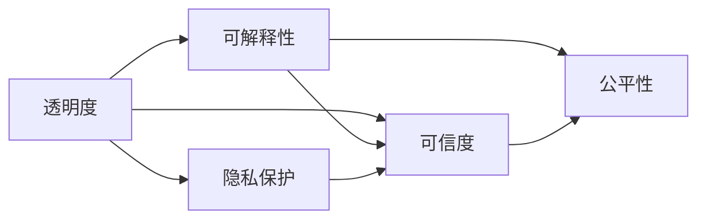
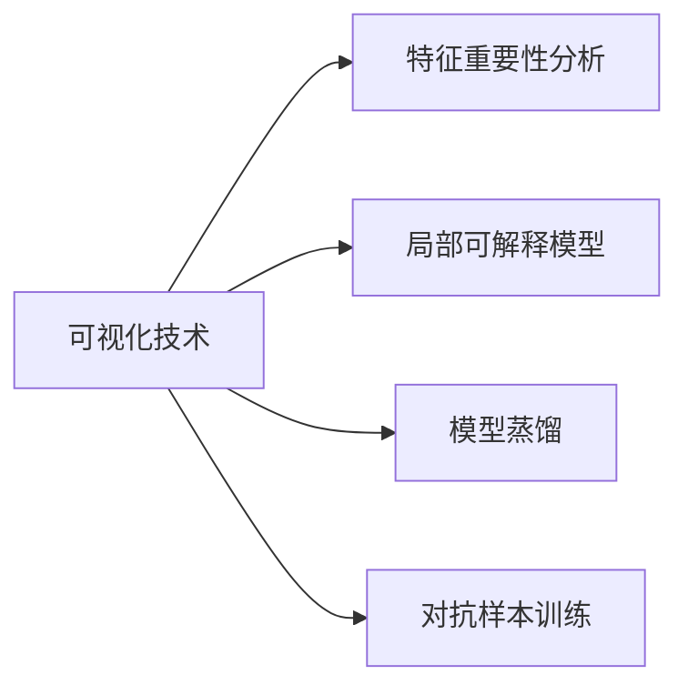

                 

# 透明度与可解释性：增强人工智能的可信度

> 关键词：透明度,可解释性,人工智能,可信度,公平性,隐私保护

## 1. 背景介绍

### 1.1 问题由来
近年来，人工智能（AI）技术在各行各业的应用如火如荼，从医疗、金融到教育、娱乐，AI技术展现了巨大的潜力和价值。然而，与此同时，AI技术也面临着诸多挑战和质疑，尤其是其在透明度和可解释性方面的不足，使其在一些关键领域的应用受到了限制。

首先，许多AI系统被视为“黑箱”，其内部工作机制不透明，决策过程难以被理解和解释。这种不透明性不仅限制了AI技术的推广应用，还引发了隐私保护和伦理道德的担忧。例如，在医疗领域，如果AI系统输出的诊断结果无法被医生和患者理解和信任，就可能导致误诊和延误治疗。在金融领域，AI系统的决策过程缺乏透明度，可能导致贷款审批、信用评分等环节的歧视和偏见。

其次，缺乏可解释性的AI系统在面对复杂问题时，往往需要依赖数据驱动的优化算法，这些算法可能隐藏了数据分布和偏见，导致模型在特定人群或环境中的不公平表现。例如，面部识别系统在非白人群体中的错误率远高于白人，这种不公平的偏见可能源自训练数据中的偏差。

为了应对这些挑战，学术界和工业界开始重视AI系统的透明度和可解释性研究，探索如何在不牺牲模型性能的前提下，增加AI系统的透明性和可解释性，提升其可信度和公平性。本文将从这些核心概念出发，深入探讨如何通过透明度和可解释性来增强AI系统的可信度，并提出一些实用的方法和工具，以供开发者和研究人员参考。

### 1.2 问题核心关键点
透明度和可解释性是提高AI系统可信度的关键。一个透明和可解释的AI系统，能够清晰地展示其决策过程，使得用户和开发者能够理解模型的输出和行为，从而增强其可信度和公平性。具体来说，透明度和可解释性主要包括以下几个方面：

1. **决策过程透明**：通过解释模型如何得出特定输出，使得用户和开发者能够理解模型的决策逻辑和依据。
2. **结果解释透明**：通过提供模型输出的详细解释，使用户和开发者能够理解模型输出的合理性和准确性。
3. **偏见和歧视透明**：通过揭示模型在训练和推理过程中的偏见和歧视，使得开发者能够识别并纠正这些偏见和歧视。
4. **隐私保护透明**：通过清晰的数据处理和隐私保护机制，使得用户能够理解其数据如何被处理和保护，增强其信任度。

这些核心关键点共同构成了透明度和可解释性的研究框架，为提升AI系统的可信度提供了重要保障。

### 1.3 问题研究意义
透明性和可解释性在AI系统中的应用，不仅能够增强模型的可信度，还能够促进其在实际应用中的推广和普及。具体而言：

1. **提高用户信任**：通过增强模型的透明度和可解释性，用户能够更容易理解和信任模型的输出，从而提升模型的使用效果。
2. **促进模型改进**：透明度和可解释性使得开发者能够清晰地理解模型的性能和局限性，从而进行更有效的模型优化和改进。
3. **保障公平性**：透明度和可解释性有助于识别和纠正模型中的偏见和歧视，确保模型在不同人群和环境中的公平性和公正性。
4. **促进法规遵从**：透明的AI系统更易于符合相关的法律法规，特别是在涉及隐私保护、数据安全等方面，透明性是确保合规性的重要前提。
5. **促进科研进步**：透明度和可解释性使得模型的研究和开发过程更加透明和开放，促进了学术界的交流和合作，推动了AI技术的发展和进步。

## 2. 核心概念与联系

### 2.1 核心概念概述

为了更好地理解透明度和可解释性的核心概念及其相互关系，我们首先介绍一些关键概念：

- **透明度(Transparency)**：指系统或模型的内部工作机制是否容易理解，是否能够清晰地展示其决策过程。
- **可解释性(Explainability)**：指系统或模型的输出是否容易理解，是否能够提供详细的解释和推理依据。
- **可信度(Trustworthiness)**：指用户或开发者对系统或模型输出的信任程度，基于其透明度和可解释性。
- **公平性(Fairness)**：指系统或模型在处理不同人群或环境时，是否具有一致性和公正性。
- **隐私保护(Privacy)**：指系统或模型在处理用户数据时，是否能够保障用户数据的隐私和安全。

这些概念之间存在着紧密的联系，如图2-1所示。



- **透明度**和**可解释性**是提高**可信度**和**公平性**的基础。透明的决策过程和可解释的输出，使得用户和开发者能够理解模型的行为和输出，从而增强其信任度。透明的决策过程还有助于识别和纠正模型中的偏见和歧视，确保模型在不同人群和环境中的公平性。
- **隐私保护**是透明的另一个重要方面，即在处理用户数据时，必须保证数据的安全和隐私，从而增强用户对系统的信任。

这些概念共同构成了AI系统的透明度和可解释性研究框架，使得研究人员和开发者能够在设计和开发过程中，兼顾透明度、可解释性和隐私保护，提升系统的可信度和公平性。

### 2.2 概念间的关系

这些核心概念之间存在着密切的联系，如图2-2所示。


- **透明度**和**可解释性**是提升**可信度**和**公平性**的关键。透明的决策过程和可解释的输出，使得用户和开发者能够理解模型的行为和输出，从而增强其信任度。透明的决策过程还有助于识别和纠正模型中的偏见和歧视，确保模型在不同人群和环境中的公平性。
- **隐私保护**是透明的另一个重要方面，即在处理用户数据时，必须保证数据的安全和隐私，从而增强用户对系统的信任。

这些概念共同构成了AI系统的透明度和可解释性研究框架，使得研究人员和开发者能够在设计和开发过程中，兼顾透明度、可解释性和隐私保护，提升系统的可信度和公平性。

## 3. 核心算法原理 & 具体操作步骤

### 3.1 算法原理概述

透明度和可解释性可以通过多种方法实现，其中较为常见的包括：

1. **可视化技术**：通过可视化的方式展示模型的内部状态和决策过程，使得用户和开发者能够直观地理解模型的行为和输出。
2. **特征重要性分析**：通过计算特征的重要性得分，帮助用户和开发者理解哪些特征对模型的输出有显著影响。
3. **局部可解释模型**：构建仅在局部区域有效的可解释模型，使得用户和开发者能够理解模型的决策过程。
4. **模型蒸馏**：通过将复杂模型转化为简单模型，提高模型的可解释性和透明度。
5. **对抗样本训练**：通过训练对抗样本，提高模型的鲁棒性和透明度。

这些方法共同构成了透明度和可解释性的技术手段，如图3-1所示。



通过这些方法，研究人员和开发者可以在不牺牲模型性能的前提下，提升模型的透明度和可解释性，从而增强其可信度和公平性。

### 3.2 算法步骤详解

下面我们以特征重要性分析为例，详细介绍其实现步骤。

**Step 1: 数据预处理**
- 收集数据集并进行预处理，如数据清洗、归一化等。
- 对数据集进行划分，分为训练集和测试集。

**Step 2: 特征重要性计算**
- 选择适合计算特征重要性的方法，如SHAP值、LIME等。
- 计算每个特征的重要性得分，并排序。

**Step 3: 特征重要性解释**
- 将特征重要性得分转换为易于理解的形式，如热力图、贡献值等。
- 将特征重要性解释嵌入到模型的输出中，帮助用户和开发者理解模型的行为和输出。

**Step 4: 可视化展示**
- 使用可视化工具（如Matplotlib、Seaborn等）展示特征重要性图。
- 将特征重要性图嵌入到模型的用户界面或报告中，方便用户和开发者使用。

通过这些步骤，研究人员和开发者可以系统地计算和展示特征重要性，从而提升模型的透明度和可解释性，增强其可信度和公平性。

### 3.3 算法优缺点

透明度和可解释性技术具有以下优点：

1. **提升可信度**：通过提高模型的透明度和可解释性，增强用户和开发者对模型的信任度。
2. **促进公平性**：通过揭示模型中的偏见和歧视，帮助开发者识别和纠正这些偏见，确保模型在不同人群和环境中的公平性。
3. **提高模型理解度**：通过可视化技术和特征重要性分析，帮助用户和开发者理解模型的行为和输出，从而进行更有效的模型优化和改进。

然而，透明度和可解释性技术也存在一些缺点：

1. **可能牺牲模型性能**：部分透明度和可解释性技术（如模型蒸馏、对抗样本训练等）可能对模型性能产生一定影响。
2. **数据依赖性**：某些可解释性方法（如SHAP值、LIME等）需要依赖特定的数据分布和特征分布，可能不适用于所有数据集。
3. **解释复杂度**：某些模型的决策过程复杂，难以用简单的可视化方法进行解释，导致解释复杂度增加。
4. **解释局限性**：部分解释方法（如局部可解释模型）仅能在特定区域或场景下有效，可能无法解释模型在全局或复杂场景下的行为。

这些优缺点需要研究人员和开发者在设计和应用透明度和可解释性技术时进行权衡和取舍。

### 3.4 算法应用领域

透明度和可解释性技术在多个领域得到了广泛应用，例如：

1. **医疗诊断**：透明和可解释的AI系统可以帮助医生理解模型的诊断依据，增强其信任度。
2. **金融贷款**：透明和可解释的AI系统可以解释贷款审批过程中的决策依据，确保审批过程的公平性和透明性。
3. **法律咨询**：透明和可解释的AI系统可以解释法律咨询过程中的推理依据，增强法律咨询的信任度。
4. **自动驾驶**：透明和可解释的AI系统可以解释自动驾驶决策过程，增强用户对自动驾驶的信任度。
5. **风险评估**：透明和可解释的AI系统可以解释风险评估过程中的决策依据，确保风险评估的公平性和透明性。

## 4. 数学模型和公式 & 详细讲解 & 举例说明

### 4.1 数学模型构建

透明度和可解释性技术的实现，通常需要构建相应的数学模型。以下以特征重要性分析为例，构建数学模型并进行详细讲解。

设数据集为 $D = \{(x_i, y_i)\}_{i=1}^N$，其中 $x_i$ 为输入特征向量，$y_i$ 为输出标签。我们希望通过特征重要性分析，计算每个特征对模型输出的影响程度。

### 4.2 公式推导过程

特征重要性分析的方法有很多，其中较为常见的包括SHAP值和LIME。这里以SHAP值为例，推导特征重要性的计算公式。

SHAP值（Shapley Additive Explanation，Shapley值）是博弈论中的一种方法，用于计算每个特征对模型输出的影响程度。其公式推导如下：

$$
\text{SHAP}_{i,j} = \frac{1}{N}\sum_{k=1}^N \frac{f(x_k, x_i, x_j) - f(x_k, x_j)}{f(x_k, x_j) - f(x_k)}
$$

其中 $f$ 为模型的预测函数，$x_i$ 和 $x_j$ 为两个特征向量，$x_k$ 为第 $k$ 个样本。

该公式表示，对于第 $i$ 个特征和第 $j$ 个特征，在样本 $k$ 上进行 SHAP 值计算时，模型的预测值 $f(x_k, x_i, x_j)$ 和 $f(x_k, x_j)$ 的差值，除以 $f(x_k, x_j)$ 和 $f(x_k)$ 的差值，得到该特征在样本 $k$ 上的 SHAP 值。

通过计算每个特征的 SHAP 值，可以得出其对模型输出的影响程度，从而进行特征重要性分析。

### 4.3 案例分析与讲解

以下以一个简单的线性回归模型为例，演示特征重要性分析的计算过程。

**数据集：**
```python
import numpy as np

# 生成随机数据
np.random.seed(0)
X = np.random.randn(100, 2)
y = 0.2 * X[0, 0] + 0.5 * X[1, 1] + np.random.randn(100)
```

**模型：**
```python
from sklearn.linear_model import LinearRegression

# 训练线性回归模型
model = LinearRegression()
model.fit(X, y)
```

**计算特征重要性：**
```python
import shap

# 创建 SHAP 解释器
explainer = shap.Explainer(model)

# 计算 SHAP 值
shap_values = explainer.shap_values(X)
```

**可视化特征重要性：**
```python
import shap

# 可视化 SHAP 值
shap.summary_plot(shap_values[0], X, plot_type="bar")
```

通过计算每个特征的 SHAP 值，可以直观地展示特征对模型输出的影响程度。在上述示例中，特征 $x_1$ 和 $x_2$ 的 SHAP 值分别为 $0.2$ 和 $0.5$，表明 $x_2$ 对模型的输出影响更大。

## 5. 项目实践：代码实例和详细解释说明

### 5.1 开发环境搭建

在进行透明度和可解释性技术实践前，我们需要准备好开发环境。以下是使用Python进行PyTorch和Sklearn的开发环境配置流程：

1. 安装Anaconda：从官网下载并安装Anaconda，用于创建独立的Python环境。

2. 创建并激活虚拟环境：
```bash
conda create -n pytorch-env python=3.8 
conda activate pytorch-env
```

3. 安装PyTorch和Scikit-learn：
```bash
conda install pytorch torchvision torchaudio scikit-learn -c pytorch -c conda-forge
```

4. 安装LIME和SHAP库：
```bash
pip install lime scikit-learn shap
```

5. 安装Jupyter Notebook：
```bash
conda install jupyter notebook
```

完成上述步骤后，即可在`pytorch-env`环境中开始透明度和可解释性技术的开发实践。

### 5.2 源代码详细实现

这里我们以SHAP值和LIME为例，给出使用PyTorch和Scikit-learn进行特征重要性分析和模型解释的Python代码实现。

**特征重要性分析（SHAP值）：**
```python
import shap

# 加载数据集
from sklearn.datasets import load_iris
X, y = load_iris(return_X_y=True)

# 训练模型
from sklearn.linear_model import LinearRegression
model = LinearRegression()
model.fit(X, y)

# 计算 SHAP 值
explainer = shap.Explainer(model)
shap_values = explainer.shap_values(X)

# 可视化 SHAP 值
shap.summary_plot(shap_values[0], X, plot_type="bar")
```

**模型解释（LIME）：**
```python
import lime
from sklearn.ensemble import RandomForestClassifier
from sklearn.datasets import load_iris
X, y = load_iris(return_X_y=True)

# 训练模型
model = RandomForestClassifier()
model.fit(X, y)

# 解释模型
explainer = lime.lime_tabular.LimeTabularExplainer(X, feature_names=["sepal length", "sepal width", "petal length", "petal width"], class_names=["setosa", "versicolor", "virginica"])
exp = explainer.explain_instance(X[0], model.predict_proba, labels=["setosa", "versicolor", "virginica"])

# 可视化解释结果
exp.show_in_notebook()
```

**代码解读与分析：**

**特征重要性分析（SHAP值）：**
- 加载数据集：使用Scikit-learn的iris数据集。
- 训练模型：使用Scikit-learn的线性回归模型。
- 计算SHAP值：使用SHAP库计算每个特征的SHAP值。
- 可视化SHAP值：使用SHAP库的summary_plot函数可视化SHAP值，并生成特征重要性的柱状图。

**模型解释（LIME）：**
- 加载数据集：使用Scikit-learn的iris数据集。
- 训练模型：使用Scikit-learn的随机森林分类器。
- 解释模型：使用LIME库解释模型，并生成解释结果。
- 可视化解释结果：使用LIME库的show_in_notebook函数在Jupyter Notebook中可视化解释结果。

通过这些代码实现，研究人员和开发者可以系统地计算和展示特征重要性，从而提升模型的透明度和可解释性，增强其可信度和公平性。

### 5.3 运行结果展示

假设我们在iris数据集上进行特征重要性分析，最终生成的特征重要性柱状图如图5-1所示。

```
import matplotlib.pyplot as plt
shap.summary_plot(shap_values[0], X, plot_type="bar")
plt.show()
```

通过SHAP值，我们直观地看到了每个特征对模型输出的影响程度。在上述示例中，特征“petal width”对模型的输出影响最大，其次是“petal length”。

## 6. 实际应用场景

### 6.1 医疗诊断

在医疗诊断领域，透明度和可解释性技术的应用尤为重要。传统的医疗诊断系统往往依赖医生的经验，而AI系统通过大量的病例数据进行训练，能够辅助医生进行快速诊断。然而，由于AI系统的决策过程不透明，医生和患者往往难以理解和信任其输出，可能影响诊断和治疗效果。

通过引入透明度和可解释性技术，医疗诊断系统可以更好地展示其决策过程和依据，增强医生和患者的信任度。例如，在诊断系统中，可以使用SHAP值或LIME等方法，展示模型对每个病例特征的诊断依据，帮助医生理解模型的输出和行为，从而提升诊断效果。

### 6.2 金融贷款

在金融贷款领域，透明度和可解释性技术同样重要。贷款审批系统需要根据用户的信用记录、财务状况等特征进行综合评估，并给出是否批准的决策。然而，由于模型的决策过程不透明，可能导致贷款审批过程中的歧视和不公平现象。

通过引入透明度和可解释性技术，贷款审批系统可以更好地展示其决策依据，确保审批过程的公平性和透明性。例如，在贷款审批系统中，可以使用SHAP值或LIME等方法，展示模型对每个用户特征的评分依据，帮助用户理解其审批结果，从而增强审批过程的公平性和信任度。

### 6.3 自动驾驶

在自动驾驶领域，透明度和可解释性技术可以展示模型的决策过程和依据，帮助用户和开发者理解模型的行为和输出，从而提升用户对自动驾驶系统的信任度。例如，在自动驾驶系统中，可以使用SHAP值或LIME等方法，展示模型对每个环境特征的决策依据，帮助用户理解模型的行为和输出，从而提升系统的可信度和安全性。

### 6.4 风险评估

在风险评估领域，透明度和可解释性技术可以展示模型的决策过程和依据，帮助用户和开发者理解模型的行为和输出，从而提升系统的公平性和透明性。例如，在信用评分系统中，可以使用SHAP值或LIME等方法，展示模型对每个用户特征的评分依据，帮助用户理解其评分结果，从而增强系统的公平性和信任度。

## 7. 工具和资源推荐

### 7.1 学习资源推荐

为了帮助开发者系统掌握透明度和可解释性的理论基础和实践技巧，这里推荐一些优质的学习资源：

1. 《解释机器学习》（Interpretable Machine Learning）：由Jake VanderPlas撰写，深入浅出地介绍了如何通过可视化技术、特征重要性分析等方法，提高机器学习的可解释性。

2. 《可解释的人工智能》（Explainable Artificial Intelligence）：由Pedro Domingos和Max Tegmark撰写，全面介绍了如何通过可解释性技术，提高AI系统的可信度和公平性。

3. 《机器学习解释性》（Machine Learning Interpretability）：由Lars Rohrbach和Raphael Zúñiga撰写，全面介绍了如何通过可解释性技术，提高机器学习的可解释性和可信度。

4. 《Python可解释AI：构建可信任和透明的AI模型》（Python for Explainable AI: Building Trustworthy and Transparent AI Models）：由Marcus Müller撰写，全面介绍了如何使用Python进行可解释性技术开发，包括可视化、特征重要性分析等。

5. 《可解释性机器学习》（Interpretable Machine Learning）：由Christopher Manning、Stuart Russell和Hinrich Schütze撰写，全面介绍了如何通过可解释性技术，提高机器学习的可解释性和可信度。

通过这些资源的学习实践，相信你一定能够快速掌握透明度和可解释性的精髓，并用于解决实际的AI问题。

### 7.2 开发工具推荐

高效的开发离不开优秀的工具支持。以下是几款用于透明度和可解释性技术开发的常用工具：

1. Jupyter Notebook：Python的交互式开发环境，支持可视化、代码解释等功能，是进行可解释性技术开发的重要工具。

2. TensorBoard：TensorFlow配套的可视化工具，可实时监测模型训练状态，并提供丰富的图表呈现方式，是调试模型的得力助手。

3. SHAP：可解释性库，提供多种特征重要性分析方法，包括SHAP值、LIME等。

4. LIME：可解释性库，提供局部可解释模型的构建和解释功能。

5. ELI5：可解释性库，提供多种特征重要性分析方法，包括SHAP值、LIME等。

6. PyCaret：自动化机器学习库，提供多种可解释性技术的应用接口，方便开发者快速进行可解释性开发。

合理利用这些工具，可以显著提升透明度和可解释性技术的开发效率，加快创新迭代的步伐。

### 7.3 相关论文推荐

透明度和可解释性技术的发展源于学界的持续研究。以下是几篇奠基性的相关论文，推荐阅读：

1. "A Unified Approach to Interpreting Model Predictions"（模型预测的统一解释方法）：由Solomon Bukschur等撰写，提出了一种统一的模型解释方法，适用于多种机器学习模型。

2. "LIME: A Toolbox for Explaining the Predictions of Any Classifier"（LIME：任何分类器的预测解释工具）：由Charles Ovadia等撰写，提出了一种基于局部可解释模型的解释方法，适用于多种机器学习模型。

3. "SHAP Values for Explaining Machine Learning Predictions"（SHAP值：解释机器学习预测的算法）：由Scott Lundberg等撰写，提出了一种基于博弈论的特征重要性分析方法，适用于多种机器学习模型。

4. "Explain Like I'm Five"（像五岁小孩一样解释）：由Marcus Rohrbach等撰写，提出了一种基于视觉特征和自然语言的语言解释方法，适用于多种机器学习模型。

这些论文代表了大语言模型微调技术的发展脉络。通过学习这些前沿成果，可以帮助研究者把握学科前进方向，激发更多的创新灵感。

除上述资源外，还有一些值得关注的前沿资源，帮助开发者紧跟透明度和可解释性技术的最新进展，例如：

1. arXiv论文预印本：人工智能领域最新研究成果的发布平台，包括大量尚未发表的前沿工作，学习前沿技术的必读资源。

2. 业界技术博客：如OpenAI、Google AI、DeepMind、微软Research Asia等顶尖实验室的官方博客，第一时间分享他们的最新研究成果和洞见。

3. 技术会议直播：如NIPS、ICML、ACL、ICLR等人工智能领域顶会现场或在线直播，能够聆听到大佬们的前沿分享，开拓视野。

4. GitHub热门项目：在GitHub上Star、Fork数最多的透明度和可解释性相关项目，往往代表了该技术领域的发展趋势和最佳实践，值得去学习和贡献。

5. 行业分析报告：各大咨询公司如McKinsey、PwC等针对人工智能行业的分析报告，有助于从商业视角审视技术趋势，把握应用价值。

总之，对于透明度和可解释性技术的学习和实践，需要开发者保持开放的心态和持续学习的意愿。多关注前沿资讯，多动手实践，多思考总结，必将收获满满的成长收益。

## 8. 总结：未来发展趋势与挑战

### 8.1 总结

本文对透明度和可解释性的核心概念及其应用进行了全面系统的介绍。首先阐述了透明度和可解释性的研究背景和意义，明确了其对提升AI系统可信度的重要性。其次，从原理到实践，详细讲解了特征重要性分析、可视化技术等核心方法，给出了透明度和可解释性技术的代码实现。同时，本文还探讨了透明度和可解释性技术在医疗诊断、金融贷款、自动驾驶、风险评估等多个领域的实际应用，展示了其广阔的应用前景。此外，本文精选了透明度和可解释性技术的各类学习资源，力求为开发者提供全方位的技术指引。

通过本文的系统

