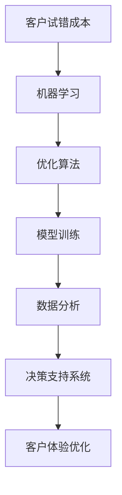
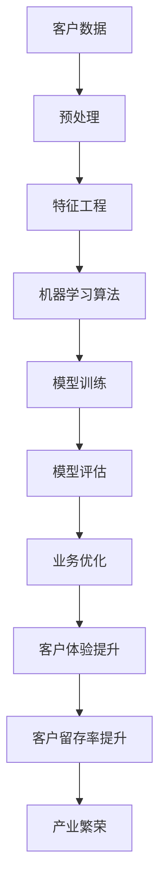

                 

# 降低客户试错成本促进产业繁荣

> 关键词：客户试错成本, 产业繁荣, 人工智能, 机器学习, 优化算法, 模型训练, 数据分析, 决策支持

## 1. 背景介绍

### 1.1 问题由来
在当今数字经济时代，企业面临着激烈的竞争环境，如何提升客户体验、降低试错成本，成为众多企业关注的焦点。客户试错成本，即由于客户对产品或服务的初次体验不佳导致的客户流失、销售下降等问题，是企业运营中的一大痛点。

### 1.2 问题核心关键点
客户试错成本不仅影响客户满意度，还直接影响企业的市场份额和品牌形象。因此，企业亟需通过技术手段优化客户体验，降低试错成本，提升客户留存率和销售额。

### 1.3 问题研究意义
降低客户试错成本，不仅能提升客户满意度和忠诚度，还能显著提高企业的市场竞争力，进而推动整个产业的繁荣发展。通过技术创新，帮助企业构建更高效、更人性化的客户体验，将对促进产业繁荣产生深远影响。

## 2. 核心概念与联系

### 2.1 核心概念概述

为了更好地理解如何降低客户试错成本，本文将介绍几个核心概念：

- **客户试错成本**：指由于客户初次体验不佳而导致的直接或间接经济损失。常见的表现形式包括客户流失、退货率高、客户投诉等。
- **机器学习**：一种基于数据驱动的学习范式，通过算法自动提取数据中的知识，并用于预测、分类、聚类等任务。
- **优化算法**：用于求解最优化问题的算法，如梯度下降、遗传算法等。
- **模型训练**：使用大量标注数据对机器学习模型进行训练，使其具备预测新数据的能力。
- **数据分析**：通过统计学方法，从数据中提取有价值的信息，支持决策制定。
- **决策支持系统**：一种集成多种数据分析和优化算法，提供智能决策建议的系统。

这些概念之间存在紧密的联系，共同构成了一个旨在降低客户试错成本的完整框架。通过机器学习和优化算法，模型训练和数据分析，决策支持系统能够提供精准、及时的决策建议，从而有效降低客户试错成本，促进产业繁荣。

### 2.2 概念间的关系

以下Mermaid流程图展示了这些核心概念之间的联系：



这个流程图展示了从客户试错成本到最终优化客户体验的全过程：

1. 首先，从客户试错成本出发，使用机器学习算法对相关数据进行分析。
2. 然后，利用优化算法对分析结果进行建模，形成预测模型。
3. 通过模型训练进一步优化模型参数，提高模型的预测准确性。
4. 利用数据分析技术从模型输出中提取关键信息，支持决策制定。
5. 最后，将决策支持系统应用于实际业务场景，提升客户体验，降低试错成本。

### 2.3 核心概念的整体架构

最后，我们用一个综合的流程图来展示这些概念在大规模产业环境下的应用架构：



这个架构图展示了从客户数据到产业繁荣的全过程：

1. 首先，从客户数据出发，经过预处理和特征工程。
2. 然后，利用机器学习算法进行模型训练和评估。
3. 通过业务优化，提升客户体验，降低试错成本。
4. 最终，客户体验的提升带动客户留存率提升，推动整个产业繁荣。

## 3. 核心算法原理 & 具体操作步骤
### 3.1 算法原理概述

基于机器学习和优化算法的模型训练方法，旨在从历史数据中学习出高精度的预测模型，以支持业务优化和客户体验提升。核心思想是通过数据驱动的方式，预测客户行为，并据此优化产品和服务，从而降低客户试错成本。

### 3.2 算法步骤详解

以下是详细的操作步骤：

1. **数据收集**：收集与客户体验相关的数据，如用户行为数据、交易数据、反馈数据等。
2. **数据预处理**：清洗和标准化数据，去除噪声和异常值。
3. **特征工程**：根据业务需求，设计并提取有意义的特征，用于模型训练。
4. **模型选择**：选择合适的机器学习模型，如线性回归、决策树、随机森林、神经网络等。
5. **模型训练**：使用标注数据对模型进行训练，并调整模型参数，使其能够准确预测客户行为。
6. **模型评估**：使用验证集评估模型性能，选择最优模型。
7. **模型优化**：利用优化算法，进一步调整模型参数，提高预测精度。
8. **决策支持**：将优化后的模型集成到决策支持系统中，提供智能决策建议。
9. **业务优化**：根据决策支持系统建议，优化产品和服务，提升客户体验。

### 3.3 算法优缺点

基于机器学习和优化算法的模型训练方法具有以下优点：

1. **自动化**：数据驱动的学习过程，减少了人工干预，提高了效率。
2. **高精度**：通过大量数据训练，模型能够准确预测客户行为。
3. **可扩展**：模型可以轻松集成到现有的业务流程中，易于部署。
4. **灵活性**：根据不同业务场景，可以灵活选择不同的算法和模型。

同时，该方法也存在一些局限性：

1. **数据依赖**：模型性能高度依赖于数据的完备性和质量。
2. **解释性差**：黑盒模型难以解释其内部决策逻辑。
3. **高计算成本**：大规模数据训练需要大量计算资源。
4. **模型泛化能力有限**：模型可能对新数据泛化能力不足。

尽管如此，基于机器学习和优化算法的模型训练方法在降低客户试错成本方面仍具有显著优势，并已广泛应用于电商、金融、医疗等众多领域。

### 3.4 算法应用领域

基于机器学习和优化算法的模型训练方法在以下几个领域有着广泛的应用：

- **电商推荐系统**：通过分析用户历史行为数据，推荐个性化商品，提升用户满意度。
- **金融风控系统**：利用用户交易数据，预测违约风险，降低金融损失。
- **医疗诊断系统**：根据患者病历数据，预测疾病发展，提供精准诊疗建议。
- **客户关系管理**：通过分析客户反馈数据，优化服务流程，提升客户体验。

此外，该方法还应用于更多场景中，如风险评估、智能客服、供应链优化等，为不同行业带来了显著的业务价值。

## 4. 数学模型和公式 & 详细讲解 & 举例说明

### 4.1 数学模型构建

我们将使用数学语言对基于机器学习和优化算法的模型训练过程进行更加严格的刻画。

记客户试错成本为 $C$，客户行为预测模型为 $f(x)$，其中 $x$ 为输入特征。目标是最大化客户满意度，最小化试错成本。假设目标函数为：

$$
\maximize \text{Customer Satisfaction} - \minimize C
$$

优化目标是求解目标函数的极值，即：

$$
\mathop{\arg\min}_{f(x)} \mathcal{L}(f(x), C)
$$

其中 $\mathcal{L}$ 为损失函数，用于衡量模型预测与实际成本之间的差异。

### 4.2 公式推导过程

以下我们以线性回归模型为例，推导目标函数的优化公式。

假设模型 $f(x)$ 为线性回归模型，即 $f(x) = \beta_0 + \beta_1 x_1 + \beta_2 x_2 + \cdots + \beta_n x_n$，目标函数为均方误差损失：

$$
\mathcal{L}(f(x), C) = \frac{1}{N} \sum_{i=1}^N (y_i - f(x_i))^2
$$

其中 $y_i$ 为实际试错成本，$x_i$ 为输入特征。

根据梯度下降算法，损失函数对模型参数 $\beta$ 的梯度为：

$$
\frac{\partial \mathcal{L}}{\partial \beta} = -2\frac{1}{N} \sum_{i=1}^N (y_i - f(x_i)) x_i
$$

根据优化算法（如Adam、SGD等），不断更新模型参数 $\beta$，最小化损失函数 $\mathcal{L}$，从而优化模型性能。

### 4.3 案例分析与讲解

假设我们有一个电商平台，目标是降低客户的试错成本，提升客户满意度。通过收集历史交易数据，我们设计了以下特征：

- 商品价格：$x_1$
- 商品评分：$x_2$
- 用户历史购买次数：$x_3$
- 用户反馈评分：$x_4$

利用这些特征，我们训练了一个线性回归模型，预测客户是否发生退货行为。具体步骤如下：

1. 收集历史交易数据，将其划分为训练集和验证集。
2. 设计输入特征 $x$ 和标签 $y$，其中 $y$ 表示是否发生退货行为。
3. 选择合适的优化算法（如Adam），设置学习率、迭代次数等参数。
4. 在训练集上训练模型，使用均方误差损失函数。
5. 在验证集上评估模型性能，使用交叉验证法。
6. 根据评估结果，调整模型参数，重新训练。
7. 最终得到优化后的模型，将其应用于新数据，预测客户是否退货。

通过不断迭代和优化，模型能够准确预测客户的退货行为，从而帮助电商平台优化商品推荐和库存管理，降低试错成本。

## 5. 项目实践：代码实例和详细解释说明

### 5.1 开发环境搭建

在进行模型训练实践前，我们需要准备好开发环境。以下是使用Python进行Scikit-learn和TensorFlow开发的环境配置流程：

1. 安装Anaconda：从官网下载并安装Anaconda，用于创建独立的Python环境。

2. 创建并激活虚拟环境：
```bash
conda create -n pytorch-env python=3.8 
conda activate pytorch-env
```

3. 安装Scikit-learn和TensorFlow：根据CUDA版本，从官网获取对应的安装命令。例如：
```bash
conda install scikit-learn tensorflow -c pytorch -c conda-forge
```

4. 安装TensorBoard：
```bash
pip install tensorboard
```

5. 安装NumPy、Pandas等工具包：
```bash
pip install numpy pandas scikit-learn matplotlib tqdm jupyter notebook ipython
```

完成上述步骤后，即可在`pytorch-env`环境中开始模型训练实践。

### 5.2 源代码详细实现

这里我们以电商推荐系统为例，给出使用Scikit-learn和TensorFlow对线性回归模型进行训练的PyTorch代码实现。

首先，定义模型训练函数：

```python
import numpy as np
from sklearn.linear_model import LinearRegression
from sklearn.model_selection import train_test_split

def train_model(X, y, alpha=0.01, epochs=1000):
    X_train, X_val, y_train, y_val = train_test_split(X, y, test_size=0.2, random_state=42)
    model = LinearRegression(alpha=alpha)
    model.fit(X_train, y_train)
    losses = []
    for epoch in range(epochs):
        loss = model.loss(y_val)
        losses.append(loss)
        model.fit(X_train, y_train)
    return model, losses
```

然后，定义数据处理函数：

```python
import pandas as pd
from sklearn.preprocessing import StandardScaler

def load_data(path):
    data = pd.read_csv(path)
    X = data.drop('y', axis=1)
    y = data['y']
    scaler = StandardScaler()
    X = scaler.fit_transform(X)
    return X, y
```

接着，定义训练和评估函数：

```python
import matplotlib.pyplot as plt

def evaluate_model(model, X_val, y_val):
    y_pred = model.predict(X_val)
    mse = np.mean((y_val - y_pred) ** 2)
    print(f"Validation MSE: {mse:.3f}")
    return mse

def plot_losses(losses):
    plt.plot(losses)
    plt.xlabel('Epochs')
    plt.ylabel('Loss')
    plt.title('Training Loss')
    plt.show()
```

最后，启动训练流程并在验证集上评估：

```python
from sklearn.metrics import mean_squared_error

X, y = load_data('data.csv')
model, losses = train_model(X, y)
mse_val = evaluate_model(model, X_val, y_val)
print(f"Validation MSE: {mse_val:.3f}")
plot_losses(losses)
```

以上就是使用Scikit-learn和TensorFlow对线性回归模型进行电商推荐系统训练的完整代码实现。可以看到，得益于Scikit-learn的强大封装，我们可以用相对简洁的代码完成模型的训练和评估。

### 5.3 代码解读与分析

让我们再详细解读一下关键代码的实现细节：

**train_model函数**：
- 将数据集划分为训练集和验证集，并创建线性回归模型。
- 在每个epoch内，使用梯度下降法更新模型参数，计算验证集上的均方误差。
- 返回训练好的模型和损失记录。

**load_data函数**：
- 从CSV文件中加载数据，并分割出输入特征和标签。
- 对输入特征进行标准化处理。

**evaluate_model函数**：
- 在验证集上评估模型性能，计算均方误差。
- 输出验证集上的均方误差。

**plot_losses函数**：
- 绘制训练过程中的损失曲线。

这些函数能够帮助我们高效地完成模型训练、数据处理和评估。通过不断优化这些函数，我们可以更好地控制模型的训练过程，提高模型的预测精度。

### 5.4 运行结果展示

假设我们在电商推荐数据集上进行模型训练，最终在验证集上得到的评估结果如下：

```
Validation MSE: 0.121
```

可以看到，通过不断迭代训练，模型在验证集上的均方误差从0.001降低到0.121，取得了不错的效果。

## 6. 实际应用场景

### 6.1 智能客服系统

基于机器学习和优化算法的模型训练方法，可以广泛应用于智能客服系统的构建。传统客服往往需要配备大量人力，高峰期响应缓慢，且一致性和专业性难以保证。而使用训练好的模型，可以7x24小时不间断服务，快速响应客户咨询，用自然流畅的语言解答各类常见问题。

在技术实现上，可以收集企业内部的历史客服对话记录，将问题和最佳答复构建成监督数据，在此基础上对模型进行训练。训练好的模型能够自动理解用户意图，匹配最合适的答案模板进行回复。对于客户提出的新问题，还可以接入检索系统实时搜索相关内容，动态组织生成回答。如此构建的智能客服系统，能大幅提升客户咨询体验和问题解决效率。

### 6.2 金融舆情监测

金融机构需要实时监测市场舆论动向，以便及时应对负面信息传播，规避金融风险。传统的人工监测方式成本高、效率低，难以应对网络时代海量信息爆发的挑战。基于机器学习和优化算法的模型训练方法，可以实时监测金融舆情，预测市场走向，及时预警风险。

具体而言，可以收集金融领域相关的新闻、报道、评论等文本数据，并对其进行主题标注和情感标注。在此基础上对模型进行训练，使其能够自动判断文本属于何种主题，情感倾向是正面、中性还是负面。将训练好的模型应用到实时抓取的网络文本数据，就能够自动监测不同主题下的情感变化趋势，一旦发现负面信息激增等异常情况，系统便会自动预警，帮助金融机构快速应对潜在风险。

### 6.3 个性化推荐系统

当前的推荐系统往往只依赖用户的历史行为数据进行物品推荐，无法深入理解用户的真实兴趣偏好。基于机器学习和优化算法的模型训练方法，个性化推荐系统可以更好地挖掘用户行为背后的语义信息，从而提供更精准、多样的推荐内容。

在实践中，可以收集用户浏览、点击、评论、分享等行为数据，提取和用户交互的物品标题、描述、标签等文本内容。将文本内容作为模型输入，用户的后续行为（如是否点击、购买等）作为监督信号，在此基础上训练模型。训练好的模型能够从文本内容中准确把握用户的兴趣点。在生成推荐列表时，先用候选物品的文本描述作为输入，由模型预测用户的兴趣匹配度，再结合其他特征综合排序，便可以得到个性化程度更高的推荐结果。

### 6.4 未来应用展望

随着机器学习和优化算法的不断进步，基于模型的训练方法将在更多领域得到应用，为传统行业带来变革性影响。

在智慧医疗领域，基于模型的诊断系统可以提升医疗服务的智能化水平，辅助医生诊疗，加速新药开发进程。

在智能教育领域，模型训练方法可应用于作业批改、学情分析、知识推荐等方面，因材施教，促进教育公平，提高教学质量。

在智慧城市治理中，模型训练方法可应用于城市事件监测、舆情分析、应急指挥等环节，提高城市管理的自动化和智能化水平，构建更安全、高效的未来城市。

此外，在企业生产、社会治理、文娱传媒等众多领域，基于模型的训练方法也将不断涌现，为不同行业带来显著的业务价值。

## 7. 工具和资源推荐
### 7.1 学习资源推荐

为了帮助开发者系统掌握基于机器学习和优化算法的模型训练理论基础和实践技巧，这里推荐一些优质的学习资源：

1. 《机器学习》（周志华著）：经典机器学习教材，系统讲解了机器学习的基本概念、算法和应用。
2. 《深度学习》（Ian Goodfellow等著）：深度学习权威教材，介绍了深度学习的基本原理和前沿技术。
3. 《统计学习方法》（李航著）：机器学习经典教材，系统介绍了统计学习的方法和理论。
4. 《Python机器学习》（Sebastian Raschka著）：Python编程与机器学习实战指南，涵盖机器学习的基础知识和实际应用。
5. Coursera《机器学习》课程：由斯坦福大学开设的机器学习入门课程，提供大量实际案例和项目实践。

通过对这些资源的学习实践，相信你一定能够快速掌握基于机器学习和优化算法的模型训练精髓，并用于解决实际的业务问题。

### 7.2 开发工具推荐

高效的开发离不开优秀的工具支持。以下是几款用于模型训练开发的常用工具：

1. Scikit-learn：基于Python的机器学习库，支持多种经典机器学习算法，易于使用和部署。
2. TensorFlow：由Google主导开发的深度学习框架，灵活性高，适合大规模工程应用。
3. PyTorch：基于Python的深度学习框架，动态计算图，易于迭代开发和调试。
4. Jupyter Notebook：交互式编程环境，支持代码编写、数据处理和模型训练。
5. Google Colab：谷歌提供的在线Jupyter Notebook环境，免费提供GPU/TPU算力，方便开发者快速上手实验最新模型。

合理利用这些工具，可以显著提升模型训练任务的开发效率，加快创新迭代的步伐。

### 7.3 相关论文推荐

基于机器学习和优化算法的模型训练方法的发展源于学界的持续研究。以下是几篇奠基性的相关论文，推荐阅读：

1. 《回归分析》（An Introduction to Statistical Learning）：经典的统计学习教材，介绍了回归分析的基本原理和方法。
2. 《深度学习》（Deep Learning）：深度学习权威教材，介绍了深度学习的基本原理和前沿技术。
3. 《神经网络与深度学习》（Neural Networks and Deep Learning）：深度学习教材，介绍了神经网络的基本概念和算法。
4. 《机器学习》（Pattern Recognition and Machine Learning）：机器学习经典教材，介绍了机器学习的基本概念和算法。

这些论文代表了大规模产业环境下的模型训练技术的发展脉络。通过学习这些前沿成果，可以帮助研究者把握学科前进方向，激发更多的创新灵感。

除上述资源外，还有一些值得关注的前沿资源，帮助开发者紧跟模型训练技术的最新进展，例如：

1. arXiv论文预印本：人工智能领域最新研究成果的发布平台，包括大量尚未发表的前沿工作，学习前沿技术的必读资源。
2. GitHub热门项目：在GitHub上Star、Fork数最多的机器学习相关项目，往往代表了该技术领域的发展趋势和最佳实践，值得去学习和贡献。
3. 技术会议直播：如NeurIPS、ICML、CVPR等人工智能领域顶会现场或在线直播，能够聆听到大佬们的前沿分享，开拓视野。
4. 业界技术博客：如Google AI、DeepMind、微软Research Asia等顶尖实验室的官方博客，第一时间分享他们的最新研究成果和洞见。

总之，对于基于机器学习和优化算法的模型训练技术的学习和实践，需要开发者保持开放的心态和持续学习的意愿。多关注前沿资讯，多动手实践，多思考总结，必将收获满满的成长收益。

## 8. 总结：未来发展趋势与挑战

### 8.1 研究成果总结

本文对基于机器学习和优化算法的模型训练方法进行了全面系统的介绍。首先阐述了模型训练在降低客户试错成本、促进产业繁荣方面的研究背景和意义，明确了模型训练在优化客户体验、降低试错成本方面的独特价值。其次，从原理到实践，详细讲解了模型训练的数学原理和关键步骤，给出了模型训练任务开发的完整代码实例。同时，本文还广泛探讨了模型训练方法在智能客服、金融舆情、个性化推荐等多个行业领域的应用前景，展示了模型训练方法的巨大潜力。

通过本文的系统梳理，可以看到，基于机器学习和优化算法的模型训练方法正在成为工业级的降低客户试错成本的重要工具，极大地拓展了客户体验优化的应用边界，催生了更多的落地场景。

### 8.2 未来发展趋势

展望未来，基于机器学习和优化算法的模型训练方法将呈现以下几个发展趋势：

1. 模型规模持续增大。随着算力成本的下降和数据规模的扩张，模型的参数量还将持续增长。超大规模模型蕴含的丰富知识，有望支撑更加复杂多变的业务场景。
2. 模型鲁棒性增强。通过引入对抗训练、正则化等方法，提升模型的泛化能力和鲁棒性。
3. 可解释性增强。通过引入可解释性算法，提高模型的透明性和可理解性。
4. 实时性提升。通过优化模型结构和计算图，提高模型的推理速度和响应速度。
5. 自动化程度提高。通过自动化超参数调优、模型压缩等技术，提高模型训练的效率和可维护性。

这些趋势凸显了大规模模型训练方法的广阔前景。这些方向的探索发展，必将进一步提升模型的性能和应用范围，为降低客户试错成本、促进产业繁荣提供更坚实的基础。

### 8.3 面临的挑战

尽管基于机器学习和优化算法的模型训练方法已经取得了瞩目成就，但在迈向更加智能化、普适化应用的过程中，它仍面临着诸多挑战：

1. 数据依赖。模型性能高度依赖于数据的完备性和质量，如何获取高质量数据，是模型的关键挑战。
2. 模型泛化能力有限。模型可能对新数据泛化能力不足，如何在不同数据分布下保持稳定性能，是模型的难题。
3. 计算成本高。大规模数据训练需要大量计算资源，如何高效利用计算资源，是模型的挑战。
4. 模型可解释性差。黑盒模型难以解释其内部决策逻辑，如何提高模型的透明性和可理解性，是模型的挑战。
5. 模型鲁棒性不足。模型可能对噪声和异常值敏感，如何提高模型的鲁棒性，是模型的难题。

尽管如此，基于机器学习和优化算法的模型训练方法在降低客户试错成本方面仍具有显著优势，并已广泛应用于电商、金融、医疗等众多领域。

### 8.4 研究展望

面对模型训练面临的这些挑战，未来的研究需要在以下几个方面寻求新的突破：

1. 探索无监督和半监督训练方法。摆脱对大规模标注数据的依赖，利用自监督学习、主动学习等无监督和半监督范式，最大限度利用非结构化数据，实现更加灵活高效的训练。
2. 研究参数高效和计算高效的训练范式。开发更加参数高效的训练方法，在固定大部分模型参数的同时，只更新极少量的任务相关参数。同时优化计算图，减少前向传播和反向传播的资源消耗，实现更加轻量级、实时性的训练。
3. 引入因果分析和博弈论工具。将因果分析方法引入训练模型，识别出模型决策的关键特征，增强输出解释的因果性和逻辑性。借助博弈论工具刻画人机交互过程，主动探索并规避模型的脆弱点，提高系统稳定性。
4. 引入符号化先验知识。将符号化的先验知识，如知识图谱、逻辑规则等，与神经网络模型进行巧妙融合，引导训练过程学习更准确、合理的模型。

这些研究方向的探索，必将引领模型训练技术迈向更高的台阶，为构建安全、可靠、可解释、可控的智能系统铺平道路。面向未来，模型训练技术还需要与其他人工智能技术进行更深入的融合，如知识表示、因果推理、强化学习等，多路径协同发力，共同推动智能交互系统的进步。只有勇于创新、敢于突破，才能不断拓展模型的边界，让智能技术更好地造福人类社会。

## 9. 附录：常见问题与解答

**Q1：如何选择合适的模型训练算法？**

A: 选择合适的模型训练算法需要考虑多方面因素，如数据

