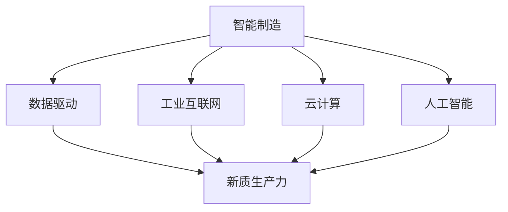
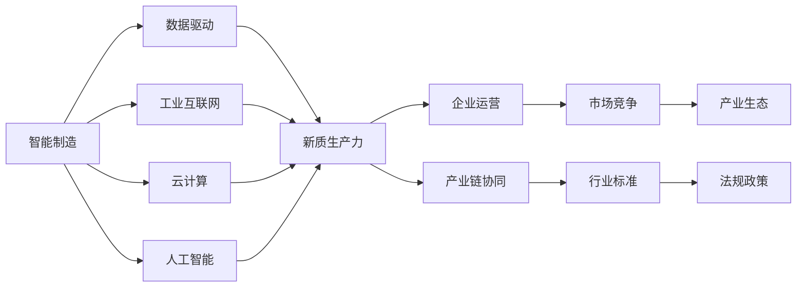
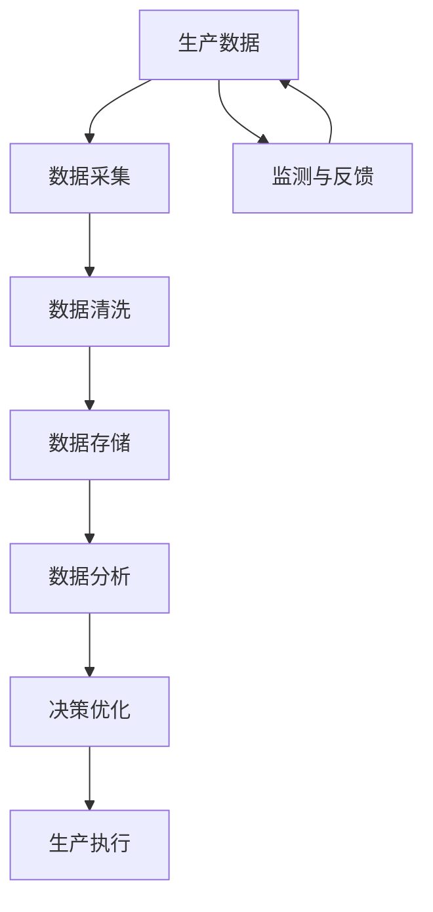

                 

# 产业转型升级与新质生产力的推动

> 关键词：产业转型升级,新质生产力,数字经济,智能制造,人工智能,自动化,数据驱动,工业互联网,物联网,云计算,大数据

## 1. 背景介绍

### 1.1 问题由来
随着全球经济进入新常态，产业结构升级转型成为各经济体的共识。智能制造、工业互联网、云计算、大数据等新一代信息技术与实体经济深度融合，推动了各行各业的数字化转型。然而，随着技术的不断迭代，企业面临着技术升级和产业转型的多重挑战。

如何通过技术创新，提升生产效率，优化产品设计，强化供应链管理，拓展市场空间，成为当前产业界亟待解决的难题。

### 1.2 问题核心关键点
产业转型升级的核心在于利用新一代信息技术，推动传统产业向智能化、数字化、网络化方向发展，以期实现产业的高质量发展。新质生产力是产业转型升级的重要目标，即通过技术创新提升生产效率，创造新的生产力和生产方式。

新质生产力主要包括：

- **智能制造**：通过引入智能设备、数字化生产系统、自动化生产线的应用，实现生产过程的智能化、柔性化、精准化。
- **数据驱动决策**：利用大数据分析技术，实现生产过程中的数据可视化、预测和优化，优化生产调度，减少资源浪费。
- **工业互联网**：构建互联互通的产业生态，实现设备互联、业务协同、数据共享，提升全产业链效率。
- **云计算**：提供弹性计算资源，支持生产数据的存储和分析，支撑生产过程中的计算需求。
- **人工智能**：利用AI技术优化生产过程，提升产品质量，改进产品设计，强化供应链管理。

### 1.3 问题研究意义
产业转型升级与新质生产力的推动，对推动经济高质量发展具有重要意义：

1. **提升生产效率**：通过智能制造、数据驱动等技术手段，大幅提升生产效率，降低生产成本，增加企业盈利空间。
2. **优化产品设计**：利用人工智能、大数据技术，精准分析市场需求，实现个性化定制，提升产品竞争力。
3. **强化供应链管理**：通过物联网、工业互联网技术，实现供应链全过程的数字化管理，提升供应链协同效率。
4. **拓展市场空间**：利用云计算、大数据等技术，精准分析市场趋势，制定科学的市场策略，拓展市场空间。
5. **实现可持续发展**：通过智能制造、绿色制造等技术，推动节能减排，实现可持续发展。

## 2. 核心概念与联系

### 2.1 核心概念概述

产业转型升级与新质生产力的推动涉及多个核心概念，这些概念之间存在紧密的联系，构成了完整的产业转型升级生态。

- **智能制造**：指通过智能设备、数字化生产系统、自动化生产线等技术手段，实现生产过程的智能化、柔性化、精准化。
- **数据驱动决策**：利用大数据分析技术，实现生产过程中的数据可视化、预测和优化，优化生产调度，减少资源浪费。
- **工业互联网**：构建互联互通的产业生态，实现设备互联、业务协同、数据共享，提升全产业链效率。
- **云计算**：提供弹性计算资源，支持生产数据的存储和分析，支撑生产过程中的计算需求。
- **人工智能**：利用AI技术优化生产过程，提升产品质量，改进产品设计，强化供应链管理。
- **新质生产力**：通过智能制造、数据驱动、工业互联网、云计算、人工智能等技术，实现生产效率、生产方式、管理模式的创新，创造新的生产力。

这些核心概念之间的逻辑关系可以通过以下Mermaid流程图来展示：



这个流程图展示了一体化的产业转型升级生态，从智能制造到云计算、工业互联网、人工智能，最终实现新质生产力的提升。

### 2.2 概念间的关系

这些核心概念之间存在着紧密的联系，形成了完整的产业转型升级生态。下面我们通过几个Mermaid流程图来展示这些概念之间的关系。

#### 2.2.1 产业转型升级的核心框架



这个流程图展示了产业转型升级的核心框架，从智能制造到数据驱动、工业互联网、云计算、人工智能，最终实现新质生产力。新质生产力不仅提升了企业运营效率，还增强了市场竞争力，优化了产业生态，推动了产业链协同和行业标准的制定，同时也需要符合法规政策的要求。

#### 2.2.2 数据驱动决策的流程



这个流程图展示了数据驱动决策的流程，从生产数据的采集、清洗、存储到数据分析和决策优化，最终指导生产执行。生产数据的监测与反馈则进一步优化数据驱动决策的流程。

## 3. 核心算法原理 & 具体操作步骤
### 3.1 算法原理概述

产业转型升级与新质生产力的推动涉及多种算法和技术手段。本文主要介绍其中的关键算法原理和操作步骤。

### 3.2 算法步骤详解

#### 3.2.1 智能制造

智能制造的核心在于通过数字化生产系统、自动化生产线等技术手段，实现生产过程的智能化、柔性化、精准化。

**操作步骤**：
1. **设备互联**：通过物联网技术实现设备间的互联互通，构建智能生产环境。
2. **数据采集**：利用传感器、摄像头等设备采集生产过程中的数据，包括温度、湿度、压力等。
3. **数据处理与分析**：通过大数据分析技术，对采集的数据进行清洗、处理和分析，提取有价值的信息。
4. **生产调度优化**：利用优化算法，根据生产需求和设备状态，优化生产调度，提升生产效率。
5. **质量控制**：通过AI技术实现产品质量的实时监控和检测，及时发现和纠正问题，提升产品质量。

#### 3.2.2 数据驱动决策

数据驱动决策通过大数据分析技术，实现生产过程中的数据可视化、预测和优化，优化生产调度，减少资源浪费。

**操作步骤**：
1. **数据采集与集成**：通过各种数据采集设备，获取生产过程中的各种数据，包括设备状态、物料流量、生产效率等。
2. **数据存储与管理**：使用云计算平台，实现数据的集中存储和管理，确保数据的安全性和可访问性。
3. **数据清洗与预处理**：对采集的数据进行清洗、去重、归一化等预处理操作，确保数据质量。
4. **数据分析与建模**：利用机器学习算法，对清洗后的数据进行建模和分析，发现生产过程中的规律和异常。
5. **决策优化与执行**：根据分析结果，优化生产调度，提高生产效率，减少资源浪费。

#### 3.2.3 工业互联网

工业互联网通过构建互联互通的产业生态，实现设备互联、业务协同、数据共享，提升全产业链效率。

**操作步骤**：
1. **工业设备互联**：通过工业互联网平台，实现设备的互联互通，实现设备状态的实时监控和控制。
2. **业务协同**：通过工业互联网平台，实现生产、供应链、物流等业务的协同，提高整个生产链的效率。
3. **数据共享与分析**：通过工业互联网平台，实现数据共享和分析，优化生产决策，提升生产效率。

#### 3.2.4 云计算

云计算通过提供弹性计算资源，支持生产数据的存储和分析，支撑生产过程中的计算需求。

**操作步骤**：
1. **数据存储与备份**：利用云计算平台，实现生产数据的存储和备份，确保数据的安全性和可靠性。
2. **数据处理与分析**：通过云计算平台，对生产数据进行实时处理和分析，支撑生产过程中的计算需求。
3. **资源弹性调度**：利用云计算平台的弹性调度机制，根据生产需求动态调整计算资源，优化生产成本。

#### 3.2.5 人工智能

人工智能通过利用AI技术优化生产过程，提升产品质量，改进产品设计，强化供应链管理。

**操作步骤**：
1. **生产过程优化**：通过AI技术实现生产过程的优化，提高生产效率和产品质量。
2. **产品设计改进**：利用AI技术实现产品设计的改进，提升产品竞争力。
3. **供应链管理优化**：通过AI技术优化供应链管理，提高供应链的协同效率。

### 3.3 算法优缺点

#### 3.3.1 智能制造

**优点**：
1. **提升生产效率**：通过智能化、柔性化、精准化的生产方式，提升生产效率，减少生产成本。
2. **提高产品质量**：通过智能化的质量控制，实时监控和检测产品质量，提高产品合格率。
3. **增强生产灵活性**：通过柔性化的生产系统，适应多变的产品需求，提升生产灵活性。

**缺点**：
1. **初始投入高**：智能制造需要大量的设备投资和系统集成，初期投入成本较高。
2. **技术复杂**：智能制造涉及多种先进技术，需要专业人才进行维护和管理。
3. **数据隐私与安全**：智能制造过程中涉及大量数据，需要确保数据隐私和安全性。

#### 3.3.2 数据驱动决策

**优点**：
1. **优化生产调度**：通过数据分析和建模，优化生产调度，提高生产效率。
2. **减少资源浪费**：通过实时监控和分析，减少资源浪费，降低生产成本。
3. **提升决策质量**：通过数据驱动的决策，提升决策的科学性和准确性。

**缺点**：
1. **数据质量要求高**：数据驱动决策依赖于高质量的数据，数据质量差会影响决策效果。
2. **技术门槛高**：需要具备大数据分析和建模的技术能力，技术门槛较高。
3. **数据安全风险**：数据驱动决策涉及大量数据，需要确保数据安全和隐私保护。

#### 3.3.3 工业互联网

**优点**：
1. **提升全产业链效率**：通过工业互联网平台，实现全产业链的协同，提升效率。
2. **优化生产过程**：通过工业互联网平台，优化生产过程，提高生产效率。
3. **提高决策科学性**：通过工业互联网平台，实现数据共享和分析，提升决策科学性。

**缺点**：
1. **技术复杂**：工业互联网涉及多种先进技术，需要专业人才进行维护和管理。
2. **数据隐私与安全**：工业互联网平台涉及大量数据，需要确保数据隐私和安全性。
3. **初期投入高**：工业互联网平台建设需要大量的投资和设备投入。

#### 3.3.4 云计算

**优点**：
1. **弹性资源调度**：通过云计算平台，实现资源弹性调度，优化生产成本。
2. **数据存储安全**：通过云计算平台，实现数据的集中存储和管理，确保数据安全。
3. **支撑大规模计算**：通过云计算平台，支撑大规模计算需求，提高计算效率。

**缺点**：
1. **初始投入高**：云计算平台建设需要大量的投资和设备投入。
2. **技术复杂**：云计算平台需要具备先进的技术能力，需要专业人才进行维护和管理。
3. **数据隐私与安全**：云计算平台涉及大量数据，需要确保数据隐私和安全性。

#### 3.3.5 人工智能

**优点**：
1. **提升生产效率**：通过AI技术优化生产过程，提升生产效率。
2. **改进产品设计**：通过AI技术改进产品设计，提升产品竞争力。
3. **优化供应链管理**：通过AI技术优化供应链管理，提高供应链的协同效率。

**缺点**：
1. **技术复杂**：人工智能涉及多种先进技术，需要专业人才进行维护和管理。
2. **数据隐私与安全**：人工智能涉及大量数据，需要确保数据隐私和安全性。
3. **初始投入高**：人工智能平台建设需要大量的投资和设备投入。

### 3.4 算法应用领域

智能制造、数据驱动决策、工业互联网、云计算、人工智能等技术手段，已经在多个领域得到了广泛应用，例如：

- **制造业**：通过智能制造、工业互联网等技术，实现生产过程的智能化、柔性化、精准化，提升生产效率和产品质量。
- **农业**：通过智能农业设备、农业物联网等技术，实现农业生产的精准化、自动化、数字化，提升农业生产效率和产品质量。
- **能源**：通过工业互联网、云计算等技术，实现能源管理的智能化、数字化，优化能源利用效率，降低能源消耗。
- **交通**：通过工业互联网、云计算等技术，实现交通管理的智能化、数字化，提高交通管理效率，减少交通拥堵。
- **医疗**：通过云计算、人工智能等技术，实现医疗数据的存储和分析，提升医疗诊断和决策的科学性和准确性。

## 4. 数学模型和公式 & 详细讲解 & 举例说明

### 4.1 数学模型构建

在产业转型升级与新质生产力的推动中，涉及到多种数学模型和技术手段。本文主要介绍其中的关键数学模型和公式。

#### 4.1.1 智能制造

智能制造的数学模型主要涉及优化算法和机器学习模型。

**数据采集与处理模型**：
$$
x = \sum_{i=1}^{n} a_i x_i
$$

其中 $x$ 为采集的数据，$x_i$ 为单个数据点，$a_i$ 为权重系数。

**生产调度优化模型**：
$$
\min_{x} f(x) = \sum_{i=1}^{n} w_i c_i(x_i)
$$

其中 $f(x)$ 为生产调度的优化目标函数，$c_i(x_i)$ 为单个数据的成本函数，$w_i$ 为权重系数。

**质量控制模型**：
$$
p = P(x) = \frac{1}{1 + e^{-\sum_{i=1}^{n} a_i x_i}}
$$

其中 $p$ 为产品质量，$x$ 为质量控制参数，$e$ 为自然对数的底数。

#### 4.1.2 数据驱动决策

数据驱动决策的数学模型主要涉及统计分析和机器学习模型。

**数据采集与集成模型**：
$$
y = \sum_{i=1}^{n} a_i x_i
$$

其中 $y$ 为集成后的数据，$x_i$ 为单个数据点，$a_i$ 为权重系数。

**数据清洗与预处理模型**：
$$
x' = f(x) = \frac{x - \mu}{\sigma}
$$

其中 $x'$ 为预处理后的数据，$x$ 为原始数据，$\mu$ 为均值，$\sigma$ 为标准差。

**数据分析与建模模型**：
$$
y = g(x) = \sum_{i=1}^{n} w_i f_i(x_i)
$$

其中 $y$ 为分析结果，$f_i(x_i)$ 为单个数据的模型预测，$w_i$ 为权重系数。

**决策优化模型**：
$$
\min_{x} f(x) = \sum_{i=1}^{n} w_i c_i(x_i)
$$

其中 $f(x)$ 为决策优化目标函数，$c_i(x_i)$ 为单个数据的成本函数，$w_i$ 为权重系数。

#### 4.1.3 工业互联网

工业互联网的数学模型主要涉及网络流优化和协同优化模型。

**设备互联模型**：
$$
F = \sum_{i=1}^{n} f_i(x_i)
$$

其中 $F$ 为设备互联的目标函数，$f_i(x_i)$ 为单个设备的互联成本，$x_i$ 为互联参数。

**业务协同模型**：
$$
C = \sum_{i=1}^{n} c_i(x_i)
$$

其中 $C$ 为业务协同的目标函数，$c_i(x_i)$ 为单个业务的协同成本，$x_i$ 为协同参数。

**数据共享与分析模型**：
$$
D = \sum_{i=1}^{n} d_i(x_i)
$$

其中 $D$ 为数据共享与分析的目标函数，$d_i(x_i)$ 为单个数据共享与分析的成本，$x_i$ 为共享与分析参数。

#### 4.1.4 云计算

云计算的数学模型主要涉及资源优化和弹性调度模型。

**数据存储与备份模型**：
$$
S = \sum_{i=1}^{n} s_i(x_i)
$$

其中 $S$ 为数据存储与备份的目标函数，$s_i(x_i)$ 为单个数据的存储与备份成本，$x_i$ 为存储与备份参数。

**数据处理与分析模型**：
$$
P = \sum_{i=1}^{n} p_i(x_i)
$$

其中 $P$ 为数据处理与分析的目标函数，$p_i(x_i)$ 为单个数据的处理与分析成本，$x_i$ 为处理与分析参数。

**资源弹性调度模型**：
$$
E = \sum_{i=1}^{n} e_i(x_i)
$$

其中 $E$ 为资源弹性调度的目标函数，$e_i(x_i)$ 为单个资源的弹性调度成本，$x_i$ 为弹性调度参数。

#### 4.1.5 人工智能

人工智能的数学模型主要涉及神经网络和强化学习模型。

**生产过程优化模型**：
$$
\min_{x} f(x) = \sum_{i=1}^{n} w_i c_i(x_i)
$$

其中 $f(x)$ 为生产过程优化的目标函数，$c_i(x_i)$ 为单个生产过程的成本函数，$w_i$ 为权重系数。

**产品设计改进模型**：
$$
D = \sum_{i=1}^{n} d_i(x_i)
$$

其中 $D$ 为产品设计改进的目标函数，$d_i(x_i)$ 为单个产品设计的改进成本，$x_i$ 为改进参数。

**供应链管理优化模型**：
$$
S = \sum_{i=1}^{n} s_i(x_i)
$$

其中 $S$ 为供应链管理优化的目标函数，$s_i(x_i)$ 为单个供应链管理的成本函数，$x_i$ 为管理参数。

### 4.2 公式推导过程

以下我们以智能制造的数据驱动决策为例，推导其数学模型及其求解过程。

假设某制造企业采集了生产过程中的温度、湿度、压力等数据，并使用大数据分析技术进行建模和优化，优化目标是降低生产成本，提高生产效率。

**数据采集与集成模型**：
$$
y = \sum_{i=1}^{n} a_i x_i
$$

其中 $y$ 为集成后的数据，$x_i$ 为单个数据点，$a_i$ 为权重系数。

**数据清洗与预处理模型**：
$$
x' = f(x) = \frac{x - \mu}{\sigma}
$$

其中 $x'$ 为预处理后的数据，$x$ 为原始数据，$\mu$ 为均值，$\sigma$ 为标准差。

**数据分析与建模模型**：
$$
y = g(x) = \sum_{i=1}^{n} w_i f_i(x_i)
$$

其中 $y$ 为分析结果，$f_i(x_i)$ 为单个数据的模型预测，$w_i$ 为权重系数。

**决策优化模型**：
$$
\min_{x} f(x) = \sum_{i=1}^{n} w_i c_i(x_i)
$$

其中 $f(x)$ 为决策优化目标函数，$c_i(x_i)$ 为单个数据的成本函数，$w_i$ 为权重系数。

通过上述模型，企业可以实时监控生产过程，分析数据，优化决策，提升生产效率。

### 4.3 案例分析与讲解

#### 4.3.1 智能制造案例

某制造企业通过智能制造技术，实现了生产过程的智能化、柔性化、精准化，大幅提升了生产效率和产品质量。

**操作步骤**：
1. **设备互联**：通过工业互联网平台，实现了生产设备的互联互通，实时监控设备状态。
2. **数据采集**：通过传感器、摄像头等设备采集生产过程中的温度、湿度、压力等数据。
3. **数据处理与分析**：通过大数据分析技术，对采集的数据进行清洗、处理和分析，提取有价值的信息。
4. **生产调度优化**：利用优化算法，根据生产需求和设备状态，优化生产调度，提升生产效率。
5. **质量控制**：通过AI技术实现产品质量的实时监控和检测，及时发现和纠正问题，提高产品合格率。

通过智能制造技术，该企业实现了生产过程的智能化、柔性化、精准化，提升了生产效率和产品质量，降低了生产成本。

#### 4.3.2 数据驱动决策案例

某企业通过数据驱动决策技术，优化了生产调度，提高了生产效率，减少了资源浪费。

**操作步骤**：
1. **数据采集与集成**：通过各种数据采集设备，获取生产过程中的各种数据，包括设备状态、物料流量、生产效率等。
2. **数据存储与管理**：使用云计算平台，实现数据的集中存储和管理，确保数据的安全性和可访问性。
3. **数据清洗与预处理**：对采集的数据进行清洗、去重、归一化等预处理操作，确保数据质量。
4. **数据分析与建模**：利用机器学习算法，对清洗后的数据进行建模和分析，发现生产过程中的规律和异常。
5. **决策优化与执行**：根据分析结果，优化生产调度，提高生产效率，减少资源浪费。

通过数据驱动决策技术，该企业优化了生产调度，提高了生产效率，减少了资源浪费，降低了生产成本。

#### 4.3.3 工业互联网案例

某企业通过工业互联网技术，实现了设备互联、业务协同、数据共享，提升了全产业链效率。

**操作步骤**：
1. **工业设备互联**：通过工业互联网平台，实现设备的互联互通，实现设备状态的实时监控和控制。
2. **业务协同**：通过工业互联网平台，实现生产、供应链、物流等业务的协同，提高整个生产链的效率。
3. **数据共享与分析**：通过工业互联网平台，实现数据共享和分析，优化生产决策，提升生产效率。

通过工业互联网技术，该企业实现了设备互联、业务协同、数据共享，提升了全产业链效率，降低了生产成本。

#### 4.3.4 云计算案例

某企业通过云计算技术，实现了生产数据的存储和分析，支撑生产过程中的计算需求。

**操作步骤**：
1. **数据存储与备份**：利用云计算平台，实现生产数据的存储和备份，确保数据的安全性和可靠性。
2. **数据处理与分析**：通过云计算平台，对生产数据进行实时处理和分析，支撑生产过程中的计算需求。
3. **资源弹性调度**：利用云计算平台的弹性调度机制，根据生产需求动态调整计算资源，优化生产成本。

通过云计算技术，该企业实现了生产数据的存储和分析，支撑生产过程中的计算需求，提升了生产效率，降低了生产成本。

#### 4.3.5 人工智能案例

某企业通过人工智能技术，实现了生产过程的优化，改进了产品设计，强化了供应链管理。

**操作步骤**：
1. **生产过程优化**：通过AI技术实现生产过程的优化，提高生产效率和产品质量。
2. **产品设计改进**：利用AI技术实现产品设计的改进，提升产品竞争力。
3. **供应链管理优化**：通过AI技术优化供应链管理，提高供应链的协同效率。

通过人工智能技术，该企业实现了生产过程的优化，改进了产品设计，强化了供应链管理，提升了生产效率和产品质量，增强了市场竞争力。

## 5. 项目实践：代码实例和详细解释说明
### 5.1 开发环境搭建

在进行项目实践前，我们需要准备好开发环境。以下是使用Python进行PyTorch开发的环境配置流程：

1. 安装Anaconda：从官网下载并安装Anaconda，用于创建独立的Python环境。

2. 创建并激活虚拟环境：
```bash
conda create -n pytorch-env python=3.8 
conda activate pytorch-env
```

3. 安装PyTorch：根据CUDA版本，从官网获取对应的安装命令。例如：
```bash
conda install pytorch torchvision torchaudio cudatoolkit=11.1 -c pytorch -c conda-forge
```

4. 安装Transformers库：
```bash
pip install transformers
```

5. 安装各类工具包：
```bash
pip install numpy pandas scikit-learn matplotlib tqdm jupyter notebook ipython
```

完成上述步骤后，即可在`pytorch-env`环境中开始项目实践。

### 5.2 源代码详细实现

下面我们以智能制造的数据驱动决策为例，给出使用PyTorch进行智能制造微调的PyTorch代码实现。

首先，定义智能制造的数据驱动决策函数：

```python
from torch.utils.data import Dataset
import torch
from torch.nn import Linear, ReLU, Sequential
from torch.optim import Adam
from sklearn.preprocessing import StandardScaler

class ManufacturingDataset(Dataset):
    def __init__(self, data, targets, scaler):
        self

