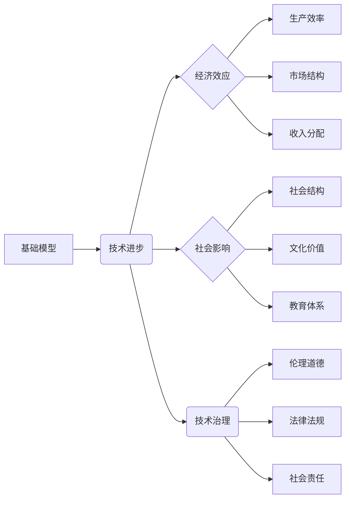

> 人工智能，基础模型，政治经济学，经济效应，技术治理，社会影响，伦理道德

# 基础模型的政治经济学效应

随着人工智能技术的飞速发展，基础模型（如Transformer）已经成为推动整个行业变革的核心动力。这些模型不仅改变了我们理解数据处理和计算的方式，也对经济系统、社会结构和伦理道德产生了深远的影响。本文将探讨基础模型的政治经济学效应，分析其带来的机遇与挑战。

## 1. 背景介绍

### 1.1 技术变革的浪潮

近年来，人工智能技术取得了突破性的进展，尤其是深度学习技术的发展，使得人工智能在图像识别、自然语言处理、语音识别等领域取得了显著的成果。基础模型，如BERT、GPT等，凭借其强大的处理能力和泛化能力，成为了人工智能领域的明星技术。

### 1.2 政治经济学的视角

政治经济学是一门研究经济活动与社会政治因素相互作用的学科。从政治经济学的角度来看，技术变革不仅仅是技术进步的结果，更是经济、政治、社会等多方面因素相互作用的结果。本文将从政治经济学的视角出发，探讨基础模型对经济系统和社会结构的影响。

## 2. 核心概念与联系

### 2.1 核心概念

- **基础模型**：一种在特定领域经过大规模数据预训练，能够执行复杂任务的人工智能模型。
- **技术治理**：对技术创新、应用和扩散过程中涉及的伦理、法律、社会、经济等方面的问题进行管理的机制。
- **经济效应**：技术变革对经济系统产生的影响，包括生产效率、市场结构、收入分配等。
- **社会影响**：技术变革对社会结构、文化价值、教育体系等方面产生的影响。

### 2.2 Mermaid 流程图



## 3. 核心算法原理 & 具体操作步骤

### 3.1 算法原理概述

基础模型通常采用深度神经网络架构，通过多层非线性变换，对输入数据进行特征提取和表示学习。以下是一些常见的基础模型：

- **Transformer**：基于自注意力机制，能够捕捉长距离依赖关系，适用于序列数据处理。
- **BERT**：结合Transformer和任务适配层，能够在各种自然语言处理任务上取得优异表现。
- **GPT**：基于Transformer的生成模型，能够生成自然语言文本。

### 3.2 算法步骤详解

1. **数据收集与预处理**：收集大规模数据集，进行清洗、标注和预处理。
2. **模型选择与训练**：选择合适的模型架构，在预处理后的数据上进行训练。
3. **模型评估与优化**：使用验证集评估模型性能，并调整超参数以优化模型。
4. **模型部署与应用**：将训练好的模型部署到实际应用场景中。

### 3.3 算法优缺点

#### 优点

- **强大的数据处理能力**：基础模型能够处理复杂的数据结构，如文本、图像、音频等。
- **泛化能力强**：基础模型在特定领域经过预训练，能够适应多种任务。
- **易于部署**：基础模型通常有成熟的框架和工具支持，易于部署和应用。

#### 缺点

- **计算资源需求大**：基础模型通常需要大量的计算资源进行训练和推理。
- **数据依赖性高**：基础模型的性能很大程度上取决于训练数据的质量和规模。
- **可解释性差**：基础模型的决策过程通常缺乏可解释性，难以理解其内部机制。

### 3.4 算法应用领域

基础模型在各个领域都有广泛的应用，包括：

- **自然语言处理**：文本分类、机器翻译、情感分析、问答系统等。
- **计算机视觉**：图像分类、目标检测、图像生成等。
- **语音识别**：语音识别、语音合成、语音翻译等。
- **推荐系统**：商品推荐、电影推荐、新闻推荐等。

## 4. 数学模型和公式 & 详细讲解 & 举例说明

### 4.1 数学模型构建

基础模型通常采用深度神经网络架构，以下是一些常用的数学公式：

- **损失函数**：用于衡量模型预测值与真实值之间的差异，如交叉熵损失、均方误差等。
- **梯度下降**：一种优化算法，通过梯度信息更新模型参数。
- **反向传播**：一种计算梯度的方法，用于计算损失函数对模型参数的梯度。

### 4.2 公式推导过程

以交叉熵损失函数为例，其公式为：

$$
L(\theta) = -\sum_{i=1}^{N} [y_i \log(\hat{y}_i)] + (1-y_i) \log(1-\hat{y}_i)
$$

其中，$y_i$ 为真实标签，$\hat{y}_i$ 为模型预测值，$N$ 为样本数量。

### 4.3 案例分析与讲解

假设我们有一个二分类问题，真实标签为 $y = [1, 0, 1, 0]$，模型预测值为 $\hat{y} = [0.2, 0.8, 0.6, 0.4]$。则交叉熵损失为：

$$
L(\theta) = -[1 \log(0.2) + 0 \log(0.8) + 1 \log(0.6) + 0 \log(0.4)] = 1.386
$$

## 5. 项目实践：代码实例和详细解释说明

### 5.1 开发环境搭建

为了进行基础模型的实践，我们需要搭建以下开发环境：

- **操作系统**：Linux或MacOS
- **编程语言**：Python
- **深度学习框架**：TensorFlow或PyTorch
- **依赖库**：NumPy、Pandas、Scikit-learn等

### 5.2 源代码详细实现

以下是一个简单的Transformer模型实现：

```python
import torch
import torch.nn as nn

class TransformerModel(nn.Module):
    def __init__(self, vocab_size, d_model, nhead, num_encoder_layers, num_decoder_layers):
        super(TransformerModel, self).__init__()
        self.embedding = nn.Embedding(vocab_size, d_model)
        self.transformer = nn.Transformer(d_model, nhead, num_encoder_layers, num_decoder_layers)
        self.fc = nn.Linear(d_model, vocab_size)

    def forward(self, src, tgt):
        src_embedding = self.embedding(src)
        tgt_embedding = self.embedding(tgt)
        output = self.transformer(src_embedding, tgt_embedding)
        output = self.fc(output)
        return output
```

### 5.3 代码解读与分析

这段代码定义了一个简单的Transformer模型，包括嵌入层、Transformer编码器/解码器和输出层。在训练过程中，我们可以使用交叉熵损失函数和梯度下降算法进行模型优化。

### 5.4 运行结果展示

运行上述代码，我们可以得到一个能够在给定源序列和目标序列之间进行翻译的模型。以下是一个简单的示例：

```python
model = TransformerModel(vocab_size=1000, d_model=512, nhead=8, num_encoder_layers=3, num_decoder_layers=3)
src = torch.tensor([[1, 2, 3, 4, 5], [6, 7, 8, 9, 10]])
tgt = torch.tensor([[1, 2], [3, 4], [5, 6], [7, 8], [9, 10]])
outputs = model(src, tgt)
```

## 6. 实际应用场景

### 6.1 自动驾驶

基础模型在自动驾驶领域有着广泛的应用，如：

- **环境感知**：使用视觉基础模型进行道路、行人、车辆等目标的检测和识别。
- **决策规划**：使用强化学习等技术，结合基础模型进行路径规划和行驶决策。
- **人机交互**：使用语音基础模型进行语音识别和合成，实现人机对话。

### 6.2 医疗诊断

基础模型在医疗诊断领域也有着重要的应用，如：

- **影像分析**：使用计算机视觉基础模型对医学影像进行分析，辅助医生进行疾病诊断。
- **文本分析**：使用自然语言处理基础模型分析病历、检验报告等文本数据，辅助医生进行诊断和治疗方案制定。
- **药物研发**：使用机器学习模型进行药物靶点预测和药物设计。

### 6.4 未来应用展望

未来，基础模型将在更多领域得到应用，如：

- **智能教育**：根据学生的学习情况，提供个性化的学习方案。
- **智能城市**：利用基础模型进行交通流量预测、环境监测等。
- **智能家居**：使用基础模型实现语音控制、智能识别等功能。

## 7. 工具和资源推荐

### 7.1 学习资源推荐

- **书籍**：
  - 《深度学习》
  - 《Python深度学习》
- **在线课程**：
  - fast.ai课程
  - Coursera上的深度学习课程
- **论文**：
  - Attention is All You Need
  - BERT: Pre-training of Deep Bidirectional Transformers for Language Understanding

### 7.2 开发工具推荐

- **编程语言**：Python
- **深度学习框架**：TensorFlow、PyTorch
- **数据处理工具**：NumPy、Pandas、Scikit-learn
- **可视化工具**：Matplotlib、Seaborn

### 7.3 相关论文推荐

- Attention is All You Need
- BERT: Pre-training of Deep Bidirectional Transformers for Language Understanding
- Generative Adversarial Nets
- Deep Learning for Coders

## 8. 总结：未来发展趋势与挑战

### 8.1 研究成果总结

本文从政治经济学的视角，探讨了基础模型的政治经济学效应，分析了其带来的机遇与挑战。我们探讨了基础模型的核心概念、算法原理、实际应用场景，并推荐了相关的学习资源和开发工具。

### 8.2 未来发展趋势

未来，基础模型将在更多领域得到应用，如自动驾驶、医疗诊断、智能教育等。同时，基础模型的技术也将不断进步，如：

- **模型压缩**：减小模型尺寸，提高推理速度。
- **模型可解释性**：提高模型的可解释性，增强用户对模型的信任。
- **知识融合**：将知识图谱、专家知识等与基础模型相结合，提高模型的智能化水平。

### 8.3 面临的挑战

基础模型的发展也面临着一些挑战，如：

- **数据隐私**：如何保护用户数据隐私，防止数据泄露。
- **算法偏见**：如何减少算法偏见，避免歧视和不公平现象。
- **技术伦理**：如何制定技术伦理规范，确保人工智能技术的可持续发展。

### 8.4 研究展望

未来，我们需要关注以下研究方向：

- **可解释人工智能**：提高模型的可解释性，增强用户对模型的信任。
- **公平人工智能**：减少算法偏见，避免歧视和不公平现象。
- **可解释和可解释的人工智能**：将可解释性和可解释性相结合，推动人工智能技术的可持续发展。

## 9. 附录：常见问题与解答

**Q1：什么是基础模型？**

A：基础模型是一种在特定领域经过大规模数据预训练，能够执行复杂任务的人工智能模型，如Transformer、BERT、GPT等。

**Q2：基础模型有哪些优点？**

A：基础模型具有强大的数据处理能力、泛化能力强、易于部署等优点。

**Q3：基础模型有哪些缺点？**

A：基础模型通常需要大量的计算资源，对数据依赖性高，可解释性差等。

**Q4：基础模型有哪些应用领域？**

A：基础模型在自然语言处理、计算机视觉、语音识别、推荐系统等各个领域都有广泛的应用。

**Q5：基础模型对经济和社会有哪些影响？**

A：基础模型对经济和社会产生了深远的影响，如提高了生产效率、改变了市场结构、影响了收入分配等。

作者：禅与计算机程序设计艺术 / Zen and the Art of Computer Programming