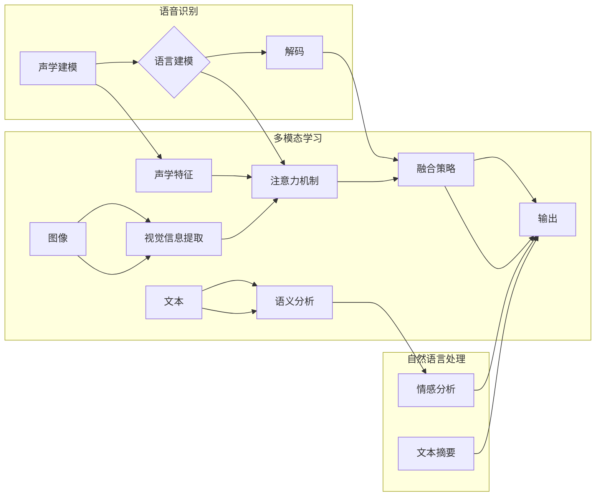

> 语音识别，多模态学习，深度学习，注意力机制，Transformer，预训练，融合策略，NLP，计算机视觉

# 多模态大模型：技术原理与实战 语音多模态技术

> 关键词：语音识别，多模态学习，深度学习，注意力机制，Transformer，预训练，融合策略，NLP，计算机视觉

## 1. 背景介绍

随着信息技术的飞速发展，人类已经进入了一个多模态信息融合的时代。多模态学习（Multimodal Learning）作为一种融合来自不同感知模态（如文本、图像、语音等）信息的技术，正逐渐成为人工智能领域的研究热点。语音多模态技术作为多模态学习的一个重要分支，结合了语音识别和自然语言处理（NLP）的强大能力，为构建更加智能、人性化的系统提供了新的可能性。

本文将深入探讨多模态大模型在语音多模态技术中的应用，从技术原理到实际操作，全面解析其背后的发展脉络和应用前景。

## 2. 核心概念与联系

### 2.1 核心概念

#### 2.1.1 多模态学习

多模态学习是指将来自不同感知模态的数据进行融合，以获得更丰富的信息表达和更强的认知能力。在语音多模态技术中，通常涉及以下几种模态：

- **语音**：包括语音波形、声谱图、倒谱系数等声学特征。
- **文本**：包括语音对应的文本内容，如字幕、对话记录等。
- **图像**：包括与语音相关的图像，如说话者的面部表情、环境图像等。

#### 2.1.2 语音识别

语音识别（Speech Recognition）是指将语音信号转换为文本信息的技术。它通常包括以下几个步骤：

- **声学建模**：将语音信号转换为声学特征。
- **语言建模**：根据声学特征生成文本序列。
- **解码**：将语言模型生成的文本序列转换为最终输出的文本。

#### 2.1.3 自然语言处理

自然语言处理（Natural Language Processing，NLP）是指使用计算机技术和算法对自然语言进行理解和处理的技术。在语音多模态技术中，NLP主要用于将文本信息进行语义分析、情感分析等。

#### 2.1.4 注意力机制

注意力机制（Attention Mechanism）是一种在深度神经网络中用于分配注意力资源到不同输入元素的方法。在多模态学习任务中，注意力机制可以帮助模型更加关注与当前任务相关的模态信息。

#### 2.1.5 Transformer

Transformer是一种基于自注意力机制的深度神经网络模型，在语音识别、机器翻译等领域取得了显著成果。它能够有效处理序列到序列任务，因此在语音多模态技术中也得到了广泛应用。

### 2.2 核心概念原理和架构的 Mermaid 流程图



## 3. 核心算法原理 & 具体操作步骤

### 3.1 算法原理概述

多模态大模型在语音多模态技术中的应用主要基于以下原理：

- **数据融合**：将不同模态的数据进行融合，以获得更丰富的信息表达。
- **特征提取**：使用深度学习模型从不同模态的数据中提取特征。
- **融合策略**：设计合适的融合策略将不同模态的特征进行整合。
- **任务优化**：针对具体任务进行模型优化，以提高性能。

### 3.2 算法步骤详解

#### 3.2.1 数据准备

1. 收集语音数据、文本数据和图像数据。
2. 对数据集进行预处理，如语音信号降噪、文本分词、图像缩放等。

#### 3.2.2 特征提取

1. 使用深度学习模型从语音数据中提取声学特征。
2. 使用深度学习模型从文本数据中提取语义特征。
3. 使用深度学习模型从图像数据中提取视觉特征。

#### 3.2.3 融合策略

1. 使用注意力机制将不同模态的特征进行加权融合。
2. 使用多任务学习框架同时进行语音识别和文本语义分析。

#### 3.2.4 任务优化

1. 使用交叉验证等方法选择最佳的模型结构和超参数。
2. 使用数据增强等方法提高模型的泛化能力。

### 3.3 算法优缺点

#### 3.3.1 优点

- 提高模型对复杂任务的适应性。
- 增强模型对噪声和异常值的鲁棒性。
- 提高模型在特定领域的性能。

#### 3.3.2 缺点

- 需要大量标注数据。
- 模型复杂度高，训练成本高。
- 不同模态之间可能存在歧义性。

### 3.4 算法应用领域

多模态大模型在语音多模态技术中的应用领域包括：

- 语音识别
- 语音合成
- 语音问答
- 语音助手
- 情感分析
- 智能客服
- 健康监测

## 4. 数学模型和公式 & 详细讲解 & 举例说明

### 4.1 数学模型构建

多模态大模型的数学模型可以表示为：

$$
\hat{y} = f(\theta, x_{\text{audio}}, x_{\text{text}}, x_{\text{image}})
$$

其中：

- $\hat{y}$ 是模型预测的输出。
- $\theta$ 是模型参数。
- $x_{\text{audio}}$ 是语音数据。
- $x_{\text{text}}$ 是文本数据。
- $x_{\text{image}}$ 是图像数据。
- $f$ 是模型的前向传播函数。

### 4.2 公式推导过程

以语音识别任务为例，假设语音数据经过声学建模和语言建模后，得到的文本序列为 $y_{\text{seq}}$，则模型的前向传播函数可以表示为：

$$
\hat{y}_{\text{seq}} = \text{Decoder}(y_{\text{seq}}, \theta)
$$

其中：

- $\text{Decoder}$ 是解码器模型。
- $y_{\text{seq}}$ 是语言模型生成的文本序列。
- $\theta$ 是模型参数。

### 4.3 案例分析与讲解

以下是一个使用TensorFlow和Keras实现的语音识别模型示例：

```python
import tensorflow as tf
from tensorflow.keras.models import Sequential
from tensorflow.keras.layers import Embedding, LSTM, Dense, Bidirectional

# 定义模型
model = Sequential([
    Embedding(input_dim=vocab_size, output_dim=128, input_length=max_length),
    Bidirectional(LSTM(256)),
    Dense(num_classes, activation='softmax')
])

# 编译模型
model.compile(optimizer='adam', loss='sparse_categorical_crossentropy', metrics=['accuracy'])

# 训练模型
model.fit(x_train, y_train, epochs=10, batch_size=32, validation_data=(x_val, y_val))

# 评估模型
test_loss, test_acc = model.evaluate(x_test, y_test)
```

在这个示例中，我们使用了一个双向LSTM模型进行语音识别。模型首先使用嵌入层将文本序列转换为向量表示，然后使用双向LSTM层提取序列特征，最后使用全连接层进行分类。

## 5. 项目实践：代码实例和详细解释说明

### 5.1 开发环境搭建

为了进行多模态大模型的项目实践，需要搭建以下开发环境：

- 操作系统：Linux或MacOS
- 编程语言：Python
- 框架：TensorFlow或PyTorch
- 依赖库：TensorFlow/Keras、PyTorch、NumPy、SciPy等

### 5.2 源代码详细实现

以下是一个使用TensorFlow和Keras实现的语音识别模型的完整示例：

```python
import tensorflow as tf
from tensorflow.keras.models import Sequential
from tensorflow.keras.layers import Embedding, LSTM, Dense, Bidirectional

# 定义模型
model = Sequential([
    Embedding(input_dim=vocab_size, output_dim=128, input_length=max_length),
    Bidirectional(LSTM(256)),
    Dense(num_classes, activation='softmax')
])

# 编译模型
model.compile(optimizer='adam', loss='sparse_categorical_crossentropy', metrics=['accuracy'])

# 训练模型
model.fit(x_train, y_train, epochs=10, batch_size=32, validation_data=(x_val, y_val))

# 评估模型
test_loss, test_acc = model.evaluate(x_test, y_test)
```

### 5.3 代码解读与分析

在这个示例中，我们使用了一个双向LSTM模型进行语音识别。模型首先使用嵌入层将文本序列转换为向量表示，然后使用双向LSTM层提取序列特征，最后使用全连接层进行分类。

- `Embedding` 层将文本序列转换为向量表示，其中 `input_dim` 表示词汇表的大小，`output_dim` 表示每个词向量的大小，`input_length` 表示序列的最大长度。

- `Bidirectional(LSTM(256))` 层使用双向LSTM对序列特征进行提取，其中 `256` 表示LSTM层的隐藏层大小。

- `Dense(num_classes, activation='softmax')` 层使用全连接层对特征进行分类，其中 `num_classes` 表示类别数量。

### 5.4 运行结果展示

运行上述代码后，模型将在训练集上进行训练，并在验证集上进行验证。最终在测试集上评估模型的性能，输出损失和准确率。

## 6. 实际应用场景

多模态大模型在语音多模态技术中的应用场景包括：

- **智能客服**：通过语音识别和自然语言处理技术，实现智能客服的语音交互功能。

- **语音助手**：结合语音识别和自然语言处理技术，实现语音助手的功能，如语音指令识别、语音回复等。

- **语音翻译**：结合语音识别和机器翻译技术，实现实时语音翻译功能。

- **语音搜索**：结合语音识别和自然语言处理技术，实现语音搜索功能。

- **语音识别助手**：结合语音识别和语音合成技术，实现语音识别助手的功能，如语音笔记、语音邮件等。

## 7. 工具和资源推荐

### 7.1 学习资源推荐

- 《深度学习》：Goodfellow等著，详细介绍了深度学习的基本原理和常用模型。
- 《TensorFlow技术解析》：深入浅出地介绍了TensorFlow框架的使用方法。
- 《PyTorch深度学习实战》：介绍了PyTorch框架的使用方法，并提供了丰富的实战案例。
- 《Natural Language Processing with Python》：介绍了自然语言处理的基本概念和常用工具。
- 《Speech Recognition with Python》：介绍了使用Python进行语音识别的方法和工具。

### 7.2 开发工具推荐

- TensorFlow：Google开发的开源深度学习框架。
- PyTorch：Facebook开发的开源深度学习框架。
- Keras：基于TensorFlow和PyTorch的Python深度学习库。
- scikit-learn：Python的机器学习库。
- NLTK：Python的自然语言处理库。

### 7.3 相关论文推荐

- **语音识别**：
  - DeepSpeech 2: End-to-End Speech Recognition in English and Mandarin (Hinton et al., 2016)
  - Attention is All You Need (Vaswani et al., 2017)
- **自然语言处理**：
  -BERT: Pre-training of Deep Bidirectional Transformers for Language Understanding (Devlin et al., 2018)
  - Generative Pre-trained Transformer (GPT-2) (Radford et al., 2019)

## 8. 总结：未来发展趋势与挑战

### 8.1 研究成果总结

多模态大模型在语音多模态技术中的应用取得了显著成果，为构建更加智能、人性化的系统提供了新的可能性。然而，仍有许多挑战需要克服，如模型复杂度、计算资源消耗、数据标注成本等。

### 8.2 未来发展趋势

未来，多模态大模型在语音多模态技术中的应用将呈现以下发展趋势：

- **模型轻量化**：通过模型压缩、量化等技术，降低模型复杂度和计算资源消耗。
- **实时性提升**：通过优化算法和硬件加速，提高模型的实时性。
- **个性化定制**：根据用户需求，定制个性化的多模态大模型。
- **跨模态迁移**：将多模态大模型应用于更多跨模态任务。

### 8.3 面临的挑战

多模态大模型在语音多模态技术中面临以下挑战：

- **数据标注成本高**：需要大量标注数据来训练模型。
- **模型复杂度高**：模型参数数量庞大，训练成本高。
- **计算资源消耗大**：模型训练和推理需要大量的计算资源。
- **跨模态融合难题**：不同模态的数据存在差异，融合困难。

### 8.4 研究展望

未来，多模态大模型在语音多模态技术的研究将主要集中在以下几个方面：

- **数据高效利用**：探索无监督和半监督学习，降低对标注数据的依赖。
- **模型高效训练**：研究模型压缩、量化等技术，降低模型复杂度和训练成本。
- **跨模态融合**：探索更有效的跨模态融合策略，提高模型性能。
- **可解释性和安全性**：提高模型的可解释性和安全性，增强用户对模型的信任。

通过不断探索和创新，相信多模态大模型在语音多模态技术中的应用将取得更加显著的成果，为构建更加智能、人性化的系统做出更大的贡献。

## 9. 附录：常见问题与解答

**Q1：多模态大模型在语音多模态技术中的应用有哪些优点？**

A：多模态大模型在语音多模态技术中的应用具有以下优点：

- 提高模型的鲁棒性，降低对噪声和异常值的敏感度。
- 增强模型对复杂任务的适应性。
- 提高模型在特定领域的性能。

**Q2：如何解决多模态融合中的歧义性问题？**

A：解决多模态融合中的歧义性问题可以采取以下方法：

- 使用注意力机制，将注意力分配到与当前任务相关的模态。
- 使用多任务学习框架，同时进行多个任务，提高模型对歧义性的处理能力。
- 使用对抗训练，提高模型对不同模态之间差异的识别能力。

**Q3：多模态大模型在语音多模态技术中的应用有哪些局限性？**

A：多模态大模型在语音多模态技术中的应用存在以下局限性：

- 需要大量标注数据。
- 模型复杂度高，训练成本高。
- 不同模态之间可能存在歧义性。

**Q4：如何降低多模态大模型的计算资源消耗？**

A：降低多模态大模型的计算资源消耗可以采取以下方法：

- 使用模型压缩技术，降低模型复杂度。
- 使用量化技术，将浮点模型转换为定点模型。
- 使用模型并行技术，将模型分解为多个部分，并行计算。

**Q5：多模态大模型在语音多模态技术中的应用前景如何？**

A：多模态大模型在语音多模态技术中的应用前景非常广阔。随着技术的不断发展，相信多模态大模型将为构建更加智能、人性化的系统做出更大的贡献。

---

作者：禅与计算机程序设计艺术 / Zen and the Art of Computer Programming