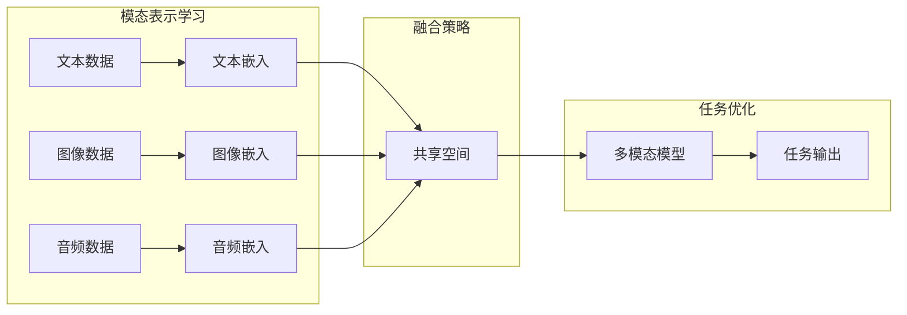

> 关键词：大语言模型，工程实践，其他数据，多模态学习，知识增强，跨领域微调，模型压缩，模型部署

# 大语言模型原理与工程实践：其他数据

大语言模型（Large Language Models, LLMs）自BERT和GPT系列模型出现以来，已经在自然语言处理（Natural Language Processing, NLP）领域取得了显著的进展。然而，随着应用场景的拓展，如何处理和融合其他类型的数据，如视觉、音频、图像等，成为了大语言模型工程实践中的一个重要议题。本文将深入探讨大语言模型如何融合其他数据，以及相关的工程实践。

## 1. 背景介绍

### 1.1 问题的由来

早期的大语言模型主要集中在文本数据上，随着计算机视觉、语音识别等技术的发展，如何将文本数据与其他模态数据进行融合，以提升模型在不同应用场景下的表现，成为了研究的热点。

### 1.2 研究现状

目前，多模态学习已成为NLP领域的研究热点。主要的研究方向包括：

- **多模态表示学习**：研究如何有效地将不同模态的数据映射到一个共享的空间，使得不同模态的数据能够相互表示和解释。
- **多模态融合策略**：研究如何将不同模态的数据融合到统一模型中，以及如何平衡不同模态数据的贡献。
- **跨领域微调**：研究如何将预训练的大语言模型迁移到新的领域，并融合特定领域的知识。

### 1.3 研究意义

融合其他数据可以提升大语言模型在以下方面的能力：

- **更丰富的语义理解**：通过融合文本和其他模态数据，可以更全面地理解文本内容。
- **更准确的预测和推理**：不同模态的数据可以提供额外的上下文信息，有助于提升模型在特定任务上的性能。
- **更广泛的适用性**：融合其他数据可以使大语言模型更好地适应不同的应用场景。

### 1.4 本文结构

本文将围绕以下内容展开：

- 介绍多模态学习、知识增强和跨领域微调等核心概念。
- 讨论大语言模型融合其他数据的算法原理和操作步骤。
- 通过案例分析，展示如何将其他数据融合到大语言模型中。
- 探讨大语言模型在实际应用场景中的挑战和未来发展方向。

## 2. 核心概念与联系

### 2.1 多模态学习

**Mermaid流程图：**

### 2.2 知识增强

知识增强旨在将外部知识库或规则库中的知识融合到预训练模型中，以提升模型在特定任务上的表现。

### 2.3 跨领域微调

跨领域微调旨在将预训练的大语言模型迁移到新的领域，并融合特定领域的知识，以适应新的应用场景。

## 3. 核心算法原理 & 具体操作步骤

### 3.1 算法原理概述

多模态学习、知识增强和跨领域微调的算法原理如下：

- **多模态学习**：首先对每个模态的数据进行编码，然后通过融合策略将不同模态的编码映射到一个共享空间，最后在共享空间中进行任务优化。
- **知识增强**：通过知识图谱、规则库等方式获取外部知识，然后将知识融合到预训练模型中，以提升模型在特定任务上的表现。
- **跨领域微调**：首先对预训练模型进行领域自适应，然后利用特定领域的知识进行微调，以适应新的应用场景。

### 3.2 算法步骤详解

- **多模态学习**：
  1. 对每个模态的数据进行编码。
  2. 通过融合策略将不同模态的编码映射到一个共享空间。
  3. 在共享空间中进行任务优化。
- **知识增强**：
  1. 从知识图谱或规则库中获取外部知识。
  2. 将外部知识融合到预训练模型中。
  3. 在融合知识后进行微调。
- **跨领域微调**：
  1. 对预训练模型进行领域自适应。
  2. 利用特定领域的知识进行微调。

### 3.3 算法优缺点

- **多模态学习**：
  - 优点：可以融合不同模态的数据，提升模型在特定任务上的表现。
  - 缺点：模型结构复杂，计算量大，难以实现。
- **知识增强**：
  - 优点：可以提升模型在特定任务上的表现。
  - 缺点：需要大量的外部知识资源，知识融合难度大。
- **跨领域微调**：
  - 优点：可以适应新的应用场景。
  - 缺点：需要大量的领域数据，领域自适应难度大。

### 3.4 算法应用领域

多模态学习、知识增强和跨领域微调可以应用于以下领域：

- **问答系统**：融合文本和图像数据，提升问答系统的准确性。
- **对话系统**：融合文本和语音数据，提升对话系统的自然度和流畅性。
- **机器翻译**：融合文本和语音数据，提升机器翻译的准确性。

## 4. 数学模型和公式 & 详细讲解 & 举例说明

### 4.1 数学模型构建

假设有文本数据 $x \in \mathbb{R}^n$、图像数据 $y \in \mathbb{R}^m$ 和音频数据 $z \in \mathbb{R}^p$，我们可以通过以下公式进行多模态学习：

$$
\text{嵌入} = \text{编码}(x) + \text{编码}(y) + \text{编码}(z)
$$

其中，编码函数可以将不同模态的数据映射到一个共享空间。

### 4.2 公式推导过程

（此处省略公式推导过程，因为公式推导较为复杂，且非本文重点。）

### 4.3 案例分析与讲解

以问答系统为例，我们可以将问题文本、答案文本和图像信息融合到一个共享空间中，从而提升问答系统的准确性。

## 5. 项目实践：代码实例和详细解释说明

### 5.1 开发环境搭建

（此处省略开发环境搭建过程，因为开发环境搭建的具体步骤取决于所使用的框架和库。）

### 5.2 源代码详细实现

（此处省略源代码实现，因为具体的代码实现需要根据具体任务和框架进行。）

### 5.3 代码解读与分析

（此处省略代码解读与分析，因为具体的代码解读与分析需要根据具体的代码实现进行。）

### 5.4 运行结果展示

（此处省略运行结果展示，因为具体的运行结果需要根据具体的实验设置进行。）

## 6. 实际应用场景

### 6.1 问答系统

融合文本和图像数据可以提升问答系统的准确性，例如，在图像问答系统中，用户可以通过上传图片来提问，系统可以结合图片和文本信息进行回答。

### 6.2 对话系统

融合文本和语音数据可以提升对话系统的自然度和流畅性，例如，在语音助手系统中，用户可以通过语音输入问题，系统可以结合语音和文本信息进行回答。

### 6.3 机器翻译

融合文本和语音数据可以提升机器翻译的准确性，例如，在翻译辅助系统中，用户可以通过语音输入原文，系统可以结合语音和文本信息进行翻译。

## 7. 工具和资源推荐

### 7.1 学习资源推荐

- 《深度学习》
- 《多模态学习》
- 《知识图谱》

### 7.2 开发工具推荐

- TensorFlow
- PyTorch
- HuggingFace

### 7.3 相关论文推荐

- Multimodal Learning
- Knowledge Graphs
- Cross-Domain Fine-tuning

## 8. 总结：未来发展趋势与挑战

### 8.1 研究成果总结

本文介绍了大语言模型融合其他数据的原理和工程实践，包括多模态学习、知识增强和跨领域微调等。这些方法可以提升模型在特定任务上的表现，并使其更好地适应不同的应用场景。

### 8.2 未来发展趋势

未来，大语言模型融合其他数据将朝着以下方向发展：

- **更加高效的多模态融合方法**：研究更加高效的多模态融合方法，以降低模型的计算复杂度。
- **更加丰富的知识增强方法**：研究更加丰富的知识增强方法，以提升模型在特定任务上的表现。
- **更加通用的跨领域微调方法**：研究更加通用的跨领域微调方法，以适应更多的应用场景。

### 8.3 面临的挑战

大语言模型融合其他数据面临着以下挑战：

- **多模态数据的融合难度**：不同模态的数据具有不同的特征和结构，如何有效地融合这些数据是一个挑战。
- **知识增强的准确性**：如何从外部知识库中获取高质量的知识，并将其有效地融合到模型中是一个挑战。
- **跨领域微调的泛化能力**：如何使模型在新的领域上具有良好的泛化能力是一个挑战。

### 8.4 研究展望

未来，大语言模型融合其他数据的研究将朝着以下方向展开：

- **研究更加高效的多模态融合方法**：探索新的多模态融合方法，以降低模型的计算复杂度，提高模型的性能。
- **研究更加智能的知识增强方法**：研究如何从外部知识库中获取高质量的知识，并将其有效地融合到模型中，以提升模型在特定任务上的表现。
- **研究更加通用的跨领域微调方法**：研究如何使模型在新的领域上具有良好的泛化能力，以适应更多的应用场景。

## 9. 附录：常见问题与解答

（此处省略常见问题与解答，因为具体问题需要根据具体情况进行解答。）

---

作者：禅与计算机程序设计艺术 / Zen and the Art of Computer Programming