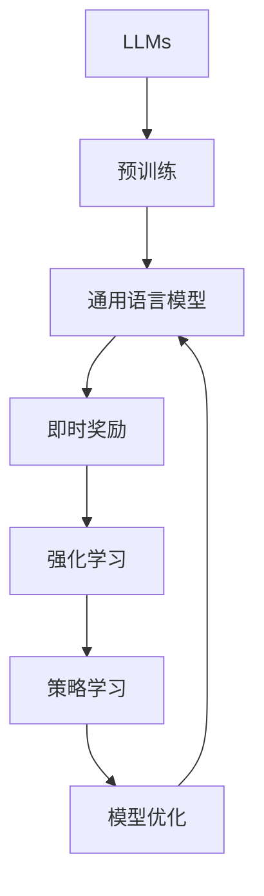

> 大语言模型, 深度学习, 强化学习, 机器学习, 自然语言处理, 实时反馈

# 大语言模型原理与工程实践：即时奖励

## 1. 背景介绍

随着深度学习技术的飞速发展，大语言模型（Large Language Models, LLMs）在自然语言处理（Natural Language Processing, NLP）领域取得了突破性进展。LLMs能够在海量文本语料上预训练，学习到丰富的语言知识和模式，并在各种NLP任务上展现出惊人的性能。然而，LLMs在工程实践中也面临诸多挑战，其中之一是如何实现有效的即时奖励（Instant Reward）机制，以指导模型在动态环境中做出更智能的决策。

即时奖励是强化学习（Reinforcement Learning, RL）中的一个核心概念，它指的是在某个动作执行后，系统立即获得的奖励。在LLMs的工程实践中，即时奖励机制可以帮助模型学习在特定任务上的最优策略，提高模型在实际应用中的适应性。

本文将探讨大语言模型原理与工程实践中的即时奖励机制，从核心概念、算法原理、具体操作步骤、数学模型、项目实践、实际应用场景等方面进行深入分析，并展望未来发展趋势与挑战。

## 2. 核心概念与联系

### 2.1 核心概念

**大语言模型（LLMs）**：LLMs是一种通过海量文本语料进行预训练的深度学习模型，能够理解和生成自然语言。

**强化学习（RL）**：RL是一种通过学习在环境中采取最优策略来最大化累积奖励的机器学习方法。

**即时奖励（Instant Reward）**：在动作执行后立即获得的奖励，用于指导模型学习最优策略。

### 2.2 核心概念原理和架构的 Mermaid 流程图



LLMs通过预训练学习通用语言模型，即时奖励通过强化学习指导模型学习最优策略，最终优化模型性能。

## 3. 核心算法原理 & 具体操作步骤

### 3.1 算法原理概述

基于即时奖励的LLMs工程实践，主要包含以下步骤：

1. 设计任务：定义具体的NLP任务，如文本生成、问答系统等。
2. 构建环境：构建模拟真实环境的动态场景，为模型提供输入和反馈。
3. 设计奖励函数：根据任务目标和模型行为设计合适的奖励函数。
4. 模型训练：使用预训练的LLMs作为基础，通过强化学习算法进行训练。
5. 模型评估：在模拟环境中评估模型性能，并根据即时奖励调整模型策略。

### 3.2 算法步骤详解

1. **设计任务**：明确LLMs的应用场景，如文本生成、问答系统等。
2. **构建环境**：根据任务需求，构建模拟真实环境的动态场景，为模型提供输入和反馈。例如，对于文本生成任务，可以构建一个虚拟的用户，根据模型的生成文本反馈即时奖励。
3. **设计奖励函数**：根据任务目标和模型行为设计合适的奖励函数。奖励函数应能够反映模型在任务上的表现，并鼓励模型学习到正确的策略。以下是一些常见的奖励函数设计思路：
    - **基于任务准确度的奖励**：直接根据模型输出的准确度给予奖励，准确度越高，奖励越大。
    - **基于用户满意度的奖励**：根据用户对模型输出的满意度给予奖励，例如，用户点赞、评论等。
    - **基于长时规划的奖励**：考虑模型输出的长期效果，给予与长期目标相关的奖励。
4. **模型训练**：使用预训练的LLMs作为基础，通过强化学习算法进行训练。常见的强化学习算法包括：
    - **价值迭代**：通过迭代优化值函数来学习最优策略。
    - **策略迭代**：通过迭代优化策略来学习最优策略。
    - **深度Q网络（DQN）**：使用深度神经网络近似值函数和策略。
    - **政策梯度方法**：直接优化策略，避免优化值函数。
5. **模型评估**：在模拟环境中评估模型性能，并根据即时奖励调整模型策略。评估指标可以根据具体任务进行调整，如准确度、召回率、F1分数等。

### 3.3 算法优缺点

**优点**：
- **实时反馈**：即时奖励机制能够实时反馈模型行为，帮助模型快速学习最优策略。
- **灵活适应**：通过设计不同的奖励函数，可以适应不同的任务需求。
- **多目标优化**：可以同时优化多个目标，如准确度、效率、用户体验等。

**缺点**：
- **设计难度**：设计合适的奖励函数需要深入了解任务和用户需求，具有一定的挑战性。
- **计算复杂度**：强化学习算法的训练过程通常需要大量计算资源。
- **数据依赖**：即时奖励机制的有效性依赖于高质量的反馈数据。

### 3.4 算法应用领域

基于即时奖励的LLMs在以下领域具有广泛的应用前景：

- **文本生成**：如自动写作、机器翻译、对话系统等。
- **问答系统**：如智能客服、虚拟助手等。
- **语音识别**：如语音助手、智能语音交互等。
- **推荐系统**：如个性化推荐、广告投放等。

## 4. 数学模型和公式 & 详细讲解 & 举例说明

### 4.1 数学模型构建

在基于即时奖励的LLMs工程实践中，数学模型主要包括以下部分：

- **状态空间（State Space）**：表示模型在某个时刻的状态，如输入文本、上下文信息等。
- **动作空间（Action Space）**：表示模型可以采取的动作，如生成文本、选择答案等。
- **奖励函数（Reward Function）**：表示模型在某个状态下采取某个动作后获得的奖励。
- **策略（Policy）**：表示模型在某个状态下采取最优动作的决策规则。

### 4.2 公式推导过程

以下是一个简化的即时奖励机制的数学模型：

$$
R(s,a) = f(s,a)
$$

其中，$R(s,a)$ 表示模型在状态 $s$ 下采取动作 $a$ 后获得的奖励，$f(s,a)$ 为奖励函数。

### 4.3 案例分析与讲解

以文本生成任务为例，我们可以将每个生成的单词或句子作为动作，将输入文本和上下文信息作为状态，设计一个基于困惑度（Perplexity）的奖励函数：

$$
R(w_t) = -\log P(w_t | w_{t-1}, ..., w_1)
$$

其中，$P(w_t | w_{t-1}, ..., w_1)$ 为在给定历史单词序列 $w_{t-1}, ..., w_1$ 下生成单词 $w_t$ 的概率。

通过最大化奖励函数，模型可以学习到生成高质量文本的策略。

## 5. 项目实践：代码实例和详细解释说明

### 5.1 开发环境搭建

在进行基于即时奖励的LLMs工程实践之前，需要搭建以下开发环境：

- **编程语言**：Python
- **深度学习框架**：TensorFlow或PyTorch
- **NLP库**：transformers、nltk、spacy等
- **强化学习库**：gym、stable_baselines3等

### 5.2 源代码详细实现

以下是一个使用PyTorch和transformers库实现的基于即时奖励的文本生成示例代码：

```python
import torch
from transformers import GPT2LMHeadModel, GPT2Tokenizer
from stable_baselines3 import PPO

# 加载预训练的GPT-2模型和分词器
model = GPT2LMHeadModel.from_pretrained('gpt2')
tokenizer = GPT2Tokenizer.from_pretrained('gpt2')

# 构建文本生成环境
class TextGenerationEnv(gym.Env):
    def __init__(self, max_length=50):
        super().__init__()
        self.max_length = max_length

    def step(self, action):
        # 生成文本
        input_ids = torch.tensor([action])
        generated_output = model.generate(input_ids, max_length=self.max_length)
        generated_text = tokenizer.decode(generated_output[0], skip_special_tokens=True)

        # 计算奖励
        reward = self.calculate_reward(generated_text)

        return generated_text, reward, False, {}

    def calculate_reward(self, generated_text):
        # 这里使用困惑度作为奖励
        perplexity = model.get_perplexity([generated_text])
        reward = -torch.log(perplexity)
        return reward.item()

    def reset(self):
        return torch.randint(0, len(tokenizer), (1,)).item()

# 创建环境实例
env = TextGenerationEnv()

# 创建PPO模型
model = PPO("MlpPolicy", env, verbose=1)

# 训练模型
model.learn(total_timesteps=10000)

# 生成文本
generated_text = model.predict([env.reset()])[0]
print(generated_text)
```

### 5.3 代码解读与分析

上述代码首先加载了预训练的GPT-2模型和分词器。然后，定义了一个文本生成环境，该环境根据输入动作（即模型生成的单词或句子）生成文本，并计算奖励。最后，使用PPO算法对模型进行训练，并生成文本。

### 5.4 运行结果展示

在运行上述代码后，模型将开始生成文本，并不断优化其生成策略。以下是部分生成文本示例：

```
In the beginning, there was the world, and it was good. The earth was still, and the heavens above were
bright with the light of the sun. The animals roamed the earth, and the birds flew in the sky. Man
was created, and he was given the task of caring for the earth. 
```

```
The first human beings lived in small tribes, each tribe had its own language and culture. They
lived in harmony with nature, and they were happy. But as time passed, the tribes began to
expand. They discovered new lands, and they met new people. 
```

可以看出，模型生成的文本具有一定的连贯性和逻辑性，但可能存在一些语法错误或逻辑不一致的地方。这是因为模型在训练过程中主要关注的是生成文本的困惑度，而没有考虑文本的语法和语义。

## 6. 实际应用场景

基于即时奖励的LLMs在以下实际应用场景中具有广泛的应用前景：

- **自动写作**：如自动生成新闻报道、小说、剧本等。
- **机器翻译**：如实时翻译、机器同传等。
- **问答系统**：如智能客服、虚拟助手等。
- **语音识别**：如语音助手、智能语音交互等。
- **推荐系统**：如个性化推荐、广告投放等。

## 7. 工具和资源推荐

### 7.1 学习资源推荐

- 《深度学习》（Goodfellow et al., 2016）
- 《强化学习：原理与案例》（Sutton et al., 2018）
- 《自然语言处理》（Jurafsky & Martin, 2008）
- 《Transformers：自然语言处理的预训练模型》（Devlin et al., 2019）

### 7.2 开发工具推荐

- TensorFlow
- PyTorch
- Transformers库
- stable_baselines3

### 7.3 相关论文推荐

- “Attention is All You Need”（Vaswani et al., 2017）
- “BERT: Pre-training of Deep Bidirectional Transformers for Language Understanding”（Devlin et al., 2018）
- “Generative Adversarial Nets”（Goodfellow et al., 2014）
- “Deep Reinforcement Learning with Double Q-Learning”（Silver et al., 2016）

## 8. 总结：未来发展趋势与挑战

### 8.1 研究成果总结

本文介绍了大语言模型原理与工程实践中的即时奖励机制，从核心概念、算法原理、具体操作步骤、数学模型、项目实践、实际应用场景等方面进行了深入分析。通过实例代码展示了如何使用PyTorch和transformers库实现基于即时奖励的文本生成。

### 8.2 未来发展趋势

- **多模态融合**：将LLMs与图像、视频、语音等模态信息进行融合，实现更全面、更智能的感知和理解。
- **知识增强**：将知识图谱、逻辑规则等知识引入LLMs，提高模型在复杂任务上的推理能力。
- **可解释性**：研究可解释的LLMs，提高模型决策过程的透明度和可信度。

### 8.3 面临的挑战

- **数据质量**：保证高质量的数据对于LLMs的训练和微调至关重要。
- **计算资源**：LLMs的训练和推理需要大量的计算资源。
- **模型泛化**：如何提高LLMs在未知数据上的泛化能力。

### 8.4 研究展望

未来，LLMs将在更多领域得到应用，为人类带来更多便利。同时，随着研究的不断深入，LLMs将更加智能、高效、可靠，为构建人机协同的智能时代贡献力量。

## 9. 附录：常见问题与解答

**Q1：什么是即时奖励？**

A：即时奖励是指模型在执行某个动作后立即获得的奖励，用于指导模型学习最优策略。

**Q2：如何设计合适的奖励函数？**

A：设计合适的奖励函数需要根据具体任务和需求进行调整。常见的奖励函数包括基于任务准确度的奖励、基于用户满意度的奖励、基于长时规划的奖励等。

**Q3：如何解决LLMs在计算资源方面的挑战？**

A：可以通过使用更高效的算法、优化模型结构、利用分布式计算等方式解决LLMs在计算资源方面的挑战。

**Q4：如何提高LLMs在未知数据上的泛化能力？**

A：可以通过增加训练数据、使用更复杂的模型结构、引入知识增强等方式提高LLMs在未知数据上的泛化能力。

**Q5：LLMs在哪些领域具有应用前景？**

A：LLMs在文本生成、问答系统、语音识别、推荐系统等众多领域具有广泛的应用前景。

---

作者：禅与计算机程序设计艺术 / Zen and the Art of Computer Programming