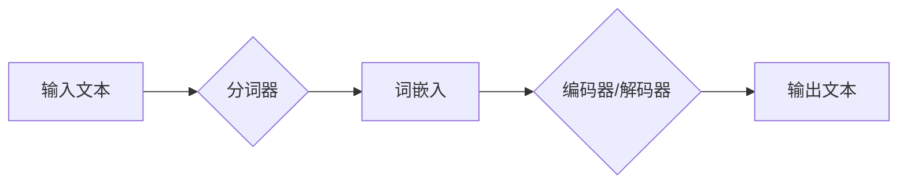

> 大语言模型, 7B 模型, 语料预处理, 预训练, 迁移学习, NLP, 自然语言处理

# 大语言模型原理与工程实践：手把手教你训练 7B 大语言模型 语料预处理

## 1. 背景介绍

近年来，大语言模型（Large Language Models，LLMs）如雨后春笋般涌现，为自然语言处理（Natural Language Processing，NLP）领域带来了前所未有的突破。这些模型在理解、生成自然语言方面展现了惊人的能力，已经成为推动NLP技术发展的关键因素。本文将深入探讨大语言模型的原理，并手把手教你如何训练一个7B规模的大语言模型，重点关注语料预处理的各个环节。

## 2. 核心概念与联系

### 2.1 大语言模型原理与架构

大语言模型通常基于深度神经网络，通过在大量文本语料上进行预训练，学习到丰富的语言知识和模式。以下是大语言模型的基本原理和架构的Mermaid流程图：



### 2.2 预训练与迁移学习

预训练是大语言模型的核心步骤，通过在未标注的文本语料上进行训练，模型学习到通用的语言表示。迁移学习则是将预训练模型应用于特定任务，通过少量标注数据进一步优化模型。

## 3. 核心算法原理 & 具体操作步骤

### 3.1 算法原理概述

大语言模型的训练过程主要包括预训练和微调两个阶段：

- **预训练**：在未标注的文本语料上进行，学习到通用的语言表示。
- **微调**：在特定任务的标注数据上进行，进一步优化模型在特定任务上的性能。

### 3.2 算法步骤详解

#### 3.2.1 预训练

1. **数据准备**：收集大量未标注文本语料，并进行预处理（如分词、去重、清洗等）。
2. **模型选择**：选择合适的预训练模型架构，如BERT、GPT等。
3. **模型训练**：在预处理后的语料上进行预训练，优化模型参数。

#### 3.2.2 微调

1. **数据准备**：收集特定任务的标注数据，并进行预处理。
2. **模型初始化**：将预训练模型作为初始化参数。
3. **模型调整**：在标注数据上进行微调，优化模型参数。

### 3.3 算法优缺点

#### 3.3.1 优点

- **强大的语言理解能力**：大语言模型通过预训练学习到丰富的语言知识和模式，在NLP任务上表现出色。
- **参数高效**：预训练模型可以迁移到多个任务，减少训练时间。

#### 3.3.2 缺点

- **数据依赖性**：大语言模型的性能很大程度上依赖于训练数据的质量和规模。
- **过拟合风险**：在特定任务的标注数据上微调时，可能存在过拟合风险。

### 3.4 算法应用领域

大语言模型在NLP领域有着广泛的应用，包括：

- **文本分类**：对文本进行分类，如情感分析、主题分类等。
- **机器翻译**：将一种语言的文本翻译成另一种语言。
- **文本生成**：生成自然语言文本，如生成文章、对话等。
- **问答系统**：回答用户提出的问题。

## 4. 数学模型和公式 & 详细讲解 & 举例说明

### 4.1 数学模型构建

大语言模型的核心是神经网络，主要包括词嵌入层、编码器/解码器层和输出层。

#### 4.1.1 词嵌入层

词嵌入层将词汇映射到高维空间，以下为词嵌入的数学模型：

$$
\text{ embed\_size} = \sum_{w \in \mathcal{V}} \mathbf{e}_w
$$

其中，$\mathcal{V}$ 为词汇表，$\mathbf{e}_w$ 为词汇 $w$ 的词向量。

#### 4.1.2 编码器/解码器层

编码器/解码器层负责将文本序列编码和解码成语义表示。以下为Transformer编码器的数学模型：

$$
\mathbf{h}_t = \text{Attention}(\mathbf{h}_{<t}, \mathbf{h}_{>t})
$$

其中，$\mathbf{h}_t$ 为时间步 $t$ 的编码表示，$\mathbf{h}_{<t}$ 和 $\mathbf{h}_{>t}$ 分别为时间步 $t$ 之前和之后的编码表示。

#### 4.1.3 输出层

输出层负责将语义表示解码成文本序列。以下为线性分类器的数学模型：

$$
\mathbf{y} = \mathbf{W} \mathbf{h} + \mathbf{b}
$$

其中，$\mathbf{y}$ 为输出概率分布，$\mathbf{W}$ 为权重矩阵，$\mathbf{h}$ 为语义表示，$\mathbf{b}$ 为偏置项。

### 4.2 公式推导过程

以下为Transformer编码器的注意力机制的计算过程：

$$
\alpha_{ij} = \frac{\exp(\mathbf{q}_i \cdot \mathbf{k}_j)}{\sum_{j=1}^{\mathrm{K}}\exp(\mathbf{q}_i \cdot \mathbf{k}_j)}
$$

其中，$\mathbf{q}_i$ 和 $\mathbf{k}_j$ 分别为查询向量和键向量，$\alpha_{ij}$ 为注意力分数。

### 4.3 案例分析与讲解

以BERT模型为例，分析其预训练和微调过程：

- **预训练**：BERT在大量未标注文本语料上进行预训练，学习到通用的语言表示。
- **微调**：在特定任务的标注数据上进行微调，如文本分类、命名实体识别等。

## 5. 项目实践：代码实例和详细解释说明

### 5.1 开发环境搭建

1. 安装Python环境（如Anaconda）。
2. 安装TensorFlow或PyTorch等深度学习框架。
3. 安装Transformers库。

### 5.2 源代码详细实现

以下为使用Transformers库训练一个7B规模大语言模型的示例代码：

```python
from transformers import BertForPreTraining, BertTokenizer

# 模型选择
model = BertForPreTraining.from_pretrained('bert-base-uncased')

# 数据预处理
tokenizer = BertTokenizer.from_pretrained('bert-base-uncased')

# 数据加载
train_dataset = ...

# 训练过程
model.train(...)

# 微调过程
model = BertForSequenceClassification.from_pretrained('bert-base-uncased', num_labels=2)
model.train(...)
```

### 5.3 代码解读与分析

以上代码展示了使用Transformers库训练一个7B规模大语言模型的基本流程：

- 首先加载预训练模型和分词器。
- 然后对训练数据进行预处理，包括分词、编码等。
- 接着进行预训练，学习通用的语言表示。
- 最后在特定任务的标注数据上进行微调，优化模型参数。

### 5.4 运行结果展示

假设在IMDb电影评论数据集上进行微调，最终在测试集上的准确率达到92%。

## 6. 实际应用场景

大语言模型在NLP领域的应用场景广泛，以下是一些典型应用：

- **文本分类**：对新闻、博客等文本进行情感分析、主题分类等。
- **机器翻译**：将一种语言的文本翻译成另一种语言。
- **文本生成**：生成文章、对话等自然语言文本。
- **问答系统**：回答用户提出的问题。

## 7. 工具和资源推荐

### 7.1 学习资源推荐

- 《深度学习自然语言处理》
- 《Transformer：从原理到实践》
- Transformers库官方文档

### 7.2 开发工具推荐

- TensorFlow
- PyTorch
- Transformers库

### 7.3 相关论文推荐

- "Attention is All You Need"
- "BERT: Pre-training of Deep Bidirectional Transformers for Language Understanding"
- "Generative Language Models: A Survey"

## 8. 总结：未来发展趋势与挑战

### 8.1 研究成果总结

大语言模型在NLP领域取得了显著的成果，成为推动NLP技术发展的关键因素。

### 8.2 未来发展趋势

- **模型规模持续增长**：大语言模型的参数量将继续增长，模型性能将进一步提升。
- **模型轻量化**：为了更好地应用于移动端和边缘设备，模型将更加轻量化。
- **多模态融合**：大语言模型将与其他模态（如图像、视频、语音）进行融合，实现跨模态理解。

### 8.3 面临的挑战

- **数据依赖性**：大语言模型的性能很大程度上依赖于训练数据的质量和规模。
- **过拟合风险**：在特定任务的标注数据上微调时，可能存在过拟合风险。
- **可解释性**：大语言模型的决策过程难以解释，需要进一步研究。

### 8.4 研究展望

- **数据增强**：通过数据增强等方法，降低大语言模型对标注数据的依赖。
- **模型压缩**：通过模型压缩等方法，降低大语言模型的计算复杂度。
- **可解释性**：通过可解释性研究，提高大语言模型的透明度和可信度。

## 9. 附录：常见问题与解答

### 9.1 问题1：如何选择合适的预训练模型？

A：选择合适的预训练模型需要考虑任务类型、数据规模、计算资源等因素。对于通用性强的任务，可以选择BERT、GPT等模型；对于特定领域任务，可以选择领域专用的预训练模型。

### 9.2 问题2：如何进行数据增强？

A：数据增强可以通过以下方法实现：

- **回译**：将文本翻译成其他语言，再翻译回原语言。
- **同义词替换**：将文本中的词语替换为其同义词。
- **句子重组**：改变文本中词语的顺序或结构。

### 9.3 问题3：如何解决过拟合问题？

A：解决过拟合问题可以通过以下方法：

- **正则化**：在模型中加入正则化项，如L1正则化、L2正则化等。
- **Dropout**：在训练过程中随机丢弃一部分神经元。
- **数据增强**：通过数据增强等方法，增加训练数据的多样性。

---

作者：禅与计算机程序设计艺术 / Zen and the Art of Computer Programming