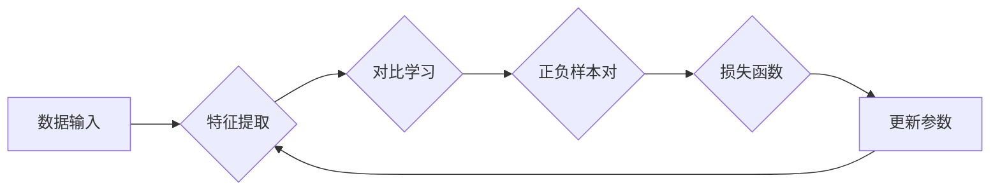

# 对比学习:无监督预训练的软件2.0利器

> 关键词：对比学习，无监督预训练，特征学习，多模态学习，领域自适应，自监督学习，计算机视觉，自然语言处理

## 1. 背景介绍

随着深度学习技术的飞速发展，计算机视觉和自然语言处理等领域取得了显著的进步。然而，这些进展很大程度上依赖于大量的标注数据，这给数据标注带来了巨大的成本和时间开销。为了解决这一问题，无监督预训练成为了研究的热点。其中，对比学习作为无监督预训练的核心技术，通过学习区分相似和不同数据的表示，为构建无需标注数据的模型提供了新的思路。

## 2. 核心概念与联系

### 2.1 核心概念

- **对比学习（Contrastive Learning）**：一种无监督学习框架，旨在学习区分相似和不同数据的表示。通过对比正负样本对的差异，对比学习能够帮助模型学习到更有区分度的特征表示。

- **无监督预训练（Unsupervised Pre-training）**：在无标注数据上进行预训练，学习通用特征表示，提高模型对下游任务的泛化能力。

- **特征学习（Feature Learning）**：通过学习将数据映射到低维空间的过程，从而提取数据中的重要特征。

- **多模态学习（Multimodal Learning）**：处理和整合来自不同模态的数据（如文本、图像、声音等），以获得更全面的数据表示。

- **领域自适应（Domain Adaptation）**：将预训练模型从一个领域迁移到另一个领域，尤其是在标注数据稀缺的情况下。

- **自监督学习（Self-supervised Learning）**：利用数据内在结构进行监督学习，无需外部标注数据。

### 2.2 架构的 Mermaid 流程图



### 2.3 核心概念联系

对比学习是构建无监督预训练模型的关键技术，通过特征学习提取区分度高的特征表示。在多模态学习场景中，对比学习可以用于整合不同模态的数据特征。领域自适应则可以将预训练模型迁移到新的领域，而自监督学习则可以进一步降低对标注数据的依赖。

## 3. 核心算法原理 & 具体操作步骤

### 3.1 算法原理概述

对比学习的基本思想是通过对比正负样本对的差异来学习特征表示。在无监督预训练场景中，通常使用自监督的方式，如信息瓶颈（Information Bottleneck）或噪声对比学习（Noise Contrastive Learning）等。

- **信息瓶颈（Information Bottleneck）**：通过最小化原始数据分布和特征分布之间的互信息，迫使特征表示能够捕捉数据分布的丰富信息。

- **噪声对比学习（Noise Contrastive Learning）**：在对比学习过程中引入噪声，使得模型能够更好地学习区分相似和不同数据的特征表示。

### 3.2 算法步骤详解

1. **数据预处理**：对输入数据进行标准化、归一化等预处理操作，以便模型更好地学习。

2. **特征提取**：使用预训练的模型或自定义的特征提取网络提取输入数据的特征表示。

3. **正负样本对生成**：对于每个数据样本，随机选择一个与其相似的样本和一个不同的样本作为正负样本对。

4. **对比学习**：通过对比正负样本对的差异，学习特征表示。具体方法包括信息瓶颈或噪声对比学习。

5. **损失函数**：计算正负样本对的损失，如三元组损失或多标签分类损失。

6. **参数更新**：根据损失函数更新模型参数，优化特征表示。

7. **迭代**：重复步骤2-6，直至满足预设的迭代次数或性能指标。

### 3.3 算法优缺点

**优点**：

- 无需标注数据，降低了数据获取成本。

- 能够学习到有区分度的特征表示，提高了模型的泛化能力。

- 在多模态学习和领域自适应等领域有广泛应用。

**缺点**：

- 需要大量的计算资源和时间。

- 模型参数优化较为复杂。

- 对噪声敏感，需要精心设计噪声引入方法。

### 3.4 算法应用领域

对比学习在计算机视觉和自然语言处理等领域有广泛的应用，包括：

- 图像分类和分割

- 文本分类和情感分析

- 语音识别和语言模型

- 多模态学习和领域自适应

## 4. 数学模型和公式 & 详细讲解 & 举例说明

### 4.1 数学模型构建

以噪声对比学习为例，其数学模型如下：

$$
\begin{align*}
\ell(\theta) &= \mathbb{E}_{(x,y) \sim D} \ell(y(x), z) \\
y(x) &= \text{sign}(\phi(x) \cdot \phi(z)) \\
\ell &= \max(\log P(y=+1|x,z), \log(1 - P(y=-1|x,z)))
\end{align*}
$$

其中，$D$ 表示数据分布，$\phi(x)$ 和 $\phi(z)$ 分别表示数据 $x$ 和 $z$ 的特征表示，$y$ 表示标签，$\text{sign}$ 表示符号函数。

### 4.2 公式推导过程

- $y(x)$ 表示对 $x$ 和 $z$ 的特征表示进行点积后，根据结果判断它们是否相似。

- $\ell$ 表示损失函数，用于衡量正负样本对的差异。

- $\ell(y(x), z)$ 表示根据 $y(x)$ 判断 $x$ 和 $z$ 是否相似时的损失。

### 4.3 案例分析与讲解

以下是一个使用对比学习进行图像分类的案例：

- 数据集：CIFAR-10
- 预训练模型：ResNet18
- 对比学习模型：MoCo

首先，使用MoCo算法预训练ResNet18模型，学习图像的特征表示。然后，在CIFAR-10数据集上进行微调，得到最终的分类模型。

## 5. 项目实践：代码实例和详细解释说明

### 5.1 开发环境搭建

1. 安装Python和PyTorch库。

2. 下载CIFAR-10数据集。

3. 下载预训练的ResNet18模型和MoCo算法。

### 5.2 源代码详细实现

```python
# 以下代码仅为示例，具体实现可能需要根据实际需求进行调整。

import torch
import torch.nn as nn
import torchvision.models as models
from torchvision import datasets, transforms
from torch.utils.data import DataLoader
from moCo import MoCo

# 加载数据集
transform = transforms.Compose([
    transforms.ToTensor(),
    transforms.Normalize((0.5, 0.5, 0.5), (0.5, 0.5, 0.5))
])
train_dataset = datasets.CIFAR10(root='./data', train=True, download=True, transform=transform)
train_loader = DataLoader(train_dataset, batch_size=128, shuffle=True)

# 加载预训练模型
model = models.resnet18(pretrained=True)
model.fc = nn.Linear(model.fc.in_features, 10)

# 加载MoCo模型
moco = MoCo(1280, 4096, 128)

# 训练MoCo模型
for epoch in range(100):
    # 训练
    moco.train(train_loader)
    # 评估
    moco.eval()

# 微调
model.train()
for epoch in range(100):
    for data, target in train_loader:
        optimizer.zero_grad()
        output = model(data)
        loss = nn.CrossEntropyLoss(output, target)
        loss.backward()
        optimizer.step()

# 保存模型
torch.save(model.state_dict(), 'model.pth')
```

### 5.3 代码解读与分析

- 加载CIFAR-10数据集并进行预处理。

- 加载预训练的ResNet18模型，并修改其全连接层以适应10个类别。

- 加载MoCo模型，用于预训练特征表示。

- 训练MoCo模型，学习图像的特征表示。

- 微调预训练模型，在CIFAR-10数据集上进行分类。

- 保存微调后的模型。

## 6. 实际应用场景

对比学习在计算机视觉和自然语言处理等领域有广泛的应用，以下列举一些实际应用场景：

- **图像分类**：使用对比学习学习图像的特征表示，提高分类模型的性能。

- **目标检测**：使用对比学习学习目标的位置和特征，提高检测模型的精度。

- **文本分类**：使用对比学习学习文本的特征表示，提高分类模型的性能。

- **情感分析**：使用对比学习学习文本的情感特征，提高情感分析模型的精度。

- **多模态学习**：使用对比学习整合不同模态的数据特征，提高多模态模型的性能。

- **领域自适应**：使用对比学习将预训练模型迁移到新的领域，提高模型在新领域的性能。

## 7. 工具和资源推荐

### 7.1 学习资源推荐

1. 《对比学习：从原理到实践》系列博文

2. 《深度学习：原理与算法》

3. 《计算机视觉：算法与应用》

### 7.2 开发工具推荐

1. PyTorch

2. TensorFlow

3. PyTorch Lightning

4. Hugging Face Transformers

### 7.3 相关论文推荐

1. "Unsupervised Learning of Visual Representations by Solving Jigsaw Puzzles"

2. "Contrastive Multiview Coding"

3. "Instance Discrimination for Visual Recognition"

4. "Unsupervised Representation Learning by Predicting Image Rotations"

5. "MoCo: A Unified Approach to Efficient Contrastive Learning of Visual Representations"

## 8. 总结：未来发展趋势与挑战

### 8.1 研究成果总结

对比学习作为一种无监督预训练技术，在计算机视觉和自然语言处理等领域取得了显著的成果。它通过学习区分相似和不同数据的特征表示，为构建无需标注数据的模型提供了新的思路。

### 8.2 未来发展趋势

1. 对比学习将与其他无监督学习技术相结合，如自监督学习、生成对抗网络等。

2. 对比学习将应用于更多领域，如语音处理、多模态学习等。

3. 对比学习将与其他深度学习技术相结合，如图神经网络、强化学习等。

### 8.3 面临的挑战

1. 如何设计有效的对比学习损失函数。

2. 如何提高对比学习模型的泛化能力。

3. 如何解决对比学习模型对噪声敏感的问题。

4. 如何将对比学习应用于更多领域和任务。

### 8.4 研究展望

对比学习作为一种无监督预训练技术，在计算机视觉和自然语言处理等领域具有巨大的应用潜力。未来，随着研究的不断深入，对比学习将在更多领域发挥重要作用，推动人工智能技术的发展。

## 9. 附录：常见问题与解答

**Q1：对比学习的原理是什么？**

A：对比学习的基本思想是通过学习区分相似和不同数据的特征表示。它通过对比正负样本对的差异，学习特征表示，从而提高模型的泛化能力。

**Q2：对比学习有哪些应用场景？**

A：对比学习在计算机视觉、自然语言处理、语音处理等领域有广泛的应用，如图像分类、目标检测、文本分类、情感分析等。

**Q3：对比学习有哪些挑战？**

A：对比学习的挑战包括设计有效的损失函数、提高模型的泛化能力、解决模型对噪声敏感的问题等。

**Q4：如何解决对比学习模型的噪声问题？**

A：可以通过引入噪声对比学习等方法解决对比学习模型的噪声问题。噪声对比学习在对比学习过程中引入噪声，使得模型能够更好地学习区分相似和不同数据的特征表示。

作者：禅与计算机程序设计艺术 / Zen and the Art of Computer Programming