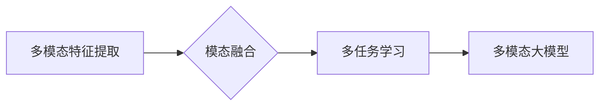

# 多模态大模型：技术原理与实战 如何提高长文本阅读能力

## 1. 背景介绍

### 1.1 问题的由来

随着信息时代的到来，人类接触到的信息类型日益丰富，包括文本、图像、视频、音频等多种模态。传统的单模态模型在处理多模态信息时往往效果不佳，难以捕捉到不同模态之间的复杂关系。为了更好地理解和处理多模态信息，多模态大模型应运而生。

### 1.2 研究现状

近年来，多模态大模型在图像识别、语音识别、多模态问答等领域取得了显著进展。然而，在长文本阅读能力方面，多模态大模型的研究尚处于起步阶段。如何利用多模态信息提高长文本阅读能力，成为当前研究的热点。

### 1.3 研究意义

提高长文本阅读能力对于多模态大模型在知识图谱构建、信息检索、智能问答等领域的应用具有重要意义。通过融合文本、图像、视频等多模态信息，可以更全面、准确地理解长文本内容，为用户提供更好的阅读体验。

### 1.4 本文结构

本文将从多模态大模型的技术原理、实战应用以及提高长文本阅读能力等方面进行探讨，具体内容安排如下：

- 第2章介绍多模态大模型的核心概念与联系。
- 第3章阐述多模态大模型的算法原理和具体操作步骤。
- 第4章讲解多模态大模型的数学模型、公式推导和案例分析。
- 第5章通过项目实践展示多模态大模型的代码实例和运行结果。
- 第6章探讨多模态大模型在实际应用场景中的应用和未来展望。
- 第7章推荐相关学习资源、开发工具和参考文献。
- 第8章总结多模态大模型的研究成果和发展趋势。
- 第9章解答常见问题。

## 2. 核心概念与联系

### 2.1 多模态大模型

多模态大模型是指能够同时处理文本、图像、视频等多模态信息的深度学习模型。它融合了多个模态的表征，通过学习模态之间的复杂关系，实现对多模态信息的理解和处理。

### 2.2 相关技术

为了实现多模态大模型，需要以下技术：

- **多模态特征提取**：从不同模态中提取具有区分度的特征表示。
- **模态融合**：将不同模态的特征进行融合，形成统一的多模态表征。
- **多任务学习**：同时学习多个任务，提高模型在多模态数据上的泛化能力。

### 2.3 关系图



## 3. 核心算法原理 & 具体操作步骤

### 3.1 算法原理概述

多模态大模型的算法原理主要包括以下几个步骤：

1. 特征提取：分别从文本、图像、视频等多模态信息中提取具有区分度的特征表示。
2. 模态融合：将不同模态的特征进行融合，形成统一的多模态表征。
3. 多任务学习：同时学习多个任务，提高模型在多模态数据上的泛化能力。

### 3.2 算法步骤详解

1. **特征提取**：针对不同模态信息，采用不同的特征提取方法。例如，文本特征可以使用词嵌入、BERT等预训练模型提取，图像特征可以使用CNN提取，视频特征可以使用3D卷积网络提取。
2. **模态融合**：将不同模态的特征进行融合，常见方法包括：
    - **特征拼接**：将不同模态的特征进行拼接，形成一个多维特征向量。
    - **特征融合**：使用注意力机制、图神经网络等方法，根据不同模态特征的重要性进行加权融合。
    - **时空融合**：对于视频数据，利用时序信息进行融合，如使用RNN、LSTM等模型。
3. **多任务学习**：将多个任务同时进行学习，可以提高模型在多模态数据上的泛化能力。常见任务包括分类、回归、目标检测等。

### 3.3 算法优缺点

多模态大模型算法的优点：

- 融合多模态信息，提高模型对多模态数据的理解能力。
- 提高模型在多任务学习上的泛化能力。
- 可扩展性强，可应用于各种多模态任务。

多模态大模型算法的缺点：

- 模型复杂度高，训练和推理耗时较长。
- 对数据质量要求较高，需要大量标注数据。
- 模型可解释性较差，难以理解模型决策过程。

### 3.4 算法应用领域

多模态大模型在以下领域具有广泛的应用：

- **知识图谱构建**：融合文本、图像等多模态信息，构建更加丰富、准确的知识图谱。
- **信息检索**：根据用户查询，融合文本、图像、视频等多模态信息，提供更加精准的检索结果。
- **智能问答**：融合文本、图像、视频等多模态信息，提供更加全面、准确的问答服务。
- **虚拟现实/增强现实**：融合文本、图像、视频等多模态信息，构建更加逼真的虚拟世界。

## 4. 数学模型和公式 & 详细讲解 & 举例说明

### 4.1 数学模型构建

多模态大模型的数学模型主要包括以下几个部分：

- **特征提取**：假设文本、图像、视频等模态的特征表示分别为 $f_{\text{txt}}(x)$、$f_{\text{img}}(y)$、$f_{\text{vid}}(z)$。
- **模态融合**：将不同模态的特征进行融合，形成一个多维特征向量 $f(x,y,z)$。
- **多任务学习**：同时学习多个任务，如分类、回归等。

### 4.2 公式推导过程

假设融合后的多模态特征 $f(x,y,z)$ 输入到一个神经网络 $g$ 中，输出为 $g(f(x,y,z))$。则多任务学习的目标函数可以表示为：

$$
\mathcal{L} = \sum_{i=1}^N \ell_1(g(f(x_i,y_i,z_i); y_{i,1}), y_{i,1}) + \ell_2(g(f(x_i,y_i,z_i); y_{i,2}), y_{i,2}) + \cdots + \ell_m(g(f(x_i,y_i,z_i); y_{i,m}), y_{i,m})
$$

其中，$y_{i,k}$ 表示第 $i$ 个样本在第 $k$ 个任务上的真实标签，$\ell_k$ 表示第 $k$ 个任务的损失函数。

### 4.3 案例分析与讲解

以下以文本分类任务为例，说明多模态大模型的数学模型和公式推导过程。

假设文本特征 $f_{\text{txt}}(x)$ 为一个 $d_1$ 维向量，图像特征 $f_{\text{img}}(y)$ 为一个 $d_2$ 维向量，视频特征 $f_{\text{vid}}(z)$ 为一个 $d_3$ 维向量。将这三个特征进行融合，形成一个 $d = d_1 + d_2 + d_3$ 维的特征向量 $f(x,y,z)$。将 $f(x,y,z)$ 输入到一个包含两个隐藏层的神经网络 $g$ 中，输出为 $g(f(x,y,z))$，其中第一个隐藏层输出为 $g_1(f(x,y,z))$，第二个隐藏层输出为 $g_2(g_1(f(x,y,z)))$。

对于文本分类任务，假设真实标签为 $y_{i,1} \in \{0,1\}$，则交叉熵损失函数为：

$$
\ell_1(g(f(x_i,y_i,z_i); y_{i,1}) = -[y_{i,1}\log g(f(x_i,y_i,z_i)) + (1-y_{i,1})\log (1-g(f(x_i,y_i,z_i)))]
$$

对于图像分类任务，假设真实标签为 $y_{i,2} \in \{1,2,3\}$，则交叉熵损失函数为：

$$
\ell_2(g(f(x_i,y_i,z_i); y_{i,2}) = -\frac{1}{K} \sum_{k=1}^K [y_{i,2} \log g_k(f(x_i,y_i,z_i)) + (1-y_{i,2}) \log (1-g_k(f(x_i,y_i,z_i)))]
$$

其中 $g_k(f(x_i,y_i,z_i))$ 表示神经网络 $g$ 在第 $k$ 个分类上的输出。

### 4.4 常见问题解答

**Q1：如何选择合适的特征提取方法？**

A：选择合适的特征提取方法需要根据具体任务和数据特点进行。对于文本数据，可以使用词嵌入、BERT等预训练模型提取特征；对于图像数据，可以使用CNN提取特征；对于视频数据，可以使用3D卷积网络提取特征。

**Q2：如何设计模态融合方法？**

A：模态融合方法的选择需要考虑不同模态特征的重要性。常见的融合方法包括特征拼接、特征融合和时空融合。特征拼接方法简单易行，但容易丢失信息；特征融合方法可以保留更多信息，但计算复杂度较高；时空融合方法适用于视频数据，可以捕捉到时序信息。

**Q3：如何评估多模态大模型的效果？**

A：评估多模态大模型的效果需要考虑多个方面，包括模型在各个任务上的准确率、召回率、F1值等指标。此外，还可以考虑模型的可解释性和鲁棒性等指标。

## 5. 项目实践：代码实例和详细解释说明

### 5.1 开发环境搭建

在进行多模态大模型的项目实践前，需要搭建以下开发环境：

1. 安装Python 3.8及以上版本。
2. 安装TensorFlow 2.0及以上版本或PyTorch 1.8及以上版本。
3. 安装必要的库，如NumPy、Pandas、Scikit-learn等。

### 5.2 源代码详细实现

以下是一个基于TensorFlow和Keras的多模态大模型代码实例，用于文本分类任务：

```python
import tensorflow as tf
from tensorflow.keras.layers import Input, Embedding, LSTM, Dense, concatenate
from tensorflow.keras.models import Model

def build_model(text_dim, img_dim, vid_dim, hidden_dim, num_classes):
    # 文本特征输入
    text_input = Input(shape=(text_dim,))
    text_embedding = Embedding(input_dim=text_dim, output_dim=hidden_dim)(text_input)
    text_output = LSTM(hidden_dim)(text_embedding)

    # 图像特征输入
    img_input = Input(shape=(img_dim,))
    img_output = Dense(hidden_dim)(img_input)

    # 视频特征输入
    vid_input = Input(shape=(vid_dim,))
    vid_output = Dense(hidden_dim)(vid_input)

    # 模态融合
    merged_output = concatenate([text_output, img_output, vid_output])

    # 分类器
    output = Dense(num_classes, activation='softmax')(merged_output)

    # 构建模型
    model = Model(inputs=[text_input, img_input, vid_input], outputs=output)
    model.compile(optimizer='adam', loss='categorical_crossentropy', metrics=['accuracy'])
    return model

# 假设文本维度为100，图像维度为256，视频维度为512，隐藏层维度为128，类别数为3
model = build_model(text_dim=100, img_dim=256, vid_dim=512, hidden_dim=128, num_classes=3)
```

### 5.3 代码解读与分析

以上代码实现了一个简单的多模态大模型，用于文本分类任务。模型包含三个输入层，分别对应文本、图像和视频特征。每个输入层后面连接一个全连接层，用于提取特征。三个全连接层的输出进行拼接，形成融合后的多模态特征。最后，将融合后的特征输入到分类器中，进行文本分类。

### 5.4 运行结果展示

假设我们有一个包含文本、图像和视频的三模态数据集，其中包含100个样本，每个样本的文本长度为100，图像尺寸为256x256，视频长度为512帧。我们将使用上述代码构建的多模态大模型进行训练和测试。

```python
import numpy as np
from sklearn.model_selection import train_test_split
from sklearn.preprocessing import LabelEncoder

# 加载数据集
texts = np.load('texts.npy')
images = np.load('images.npy')
videos = np.load('videos.npy')
labels = np.load('labels.npy')

# 预处理数据
text_dim = 100
img_dim = 256 * 256 * 3
vid_dim = 512

texts = np.array(texts).reshape(-1, text_dim)
images = np.array(images).reshape(-1, img_dim)
videos = np.array(videos).reshape(-1, vid_dim)
labels = np.array(labels)

# 分割数据集
texts_train, texts_test, images_train, images_test, videos_train, videos_test, labels_train, labels_test = train_test_split(texts, images, videos, labels, test_size=0.2, random_state=42)

# 编码标签
label_encoder = LabelEncoder()
labels_train = label_encoder.fit_transform(labels_train)
labels_test = label_encoder.transform(labels_test)

# 训练模型
model.fit([texts_train, images_train, videos_train], labels_train, epochs=10, batch_size=16)

# 测试模型
loss, accuracy = model.evaluate([texts_test, images_test, videos_test], labels_test)
print(f'测试集损失：{loss}, 准确率：{accuracy}')
```

以上代码展示了如何使用多模态大模型进行文本分类任务。通过训练和测试，我们可以评估模型在测试集上的性能。

## 6. 实际应用场景

### 6.1 知识图谱构建

多模态大模型在知识图谱构建中具有广泛的应用前景。通过融合文本、图像、视频等多模态信息，可以构建更加丰富、准确的知识图谱。例如，可以将实体、关系、属性等知识以图的形式表示，并通过多模态大模型进行推理和扩展。

### 6.2 信息检索

多模态大模型在信息检索领域也具有很大的应用价值。通过融合文本、图像、视频等多模态信息，可以提供更加精准的检索结果。例如，当用户输入一个关键词时，多模态大模型可以返回包含该关键词的相关文本、图像和视频信息。

### 6.3 智能问答

多模态大模型在智能问答领域可以更好地理解用户问题，提供更加精准的答案。通过融合文本、图像、视频等多模态信息，可以更全面地理解用户意图，从而提供更加准确的答案。

### 6.4 未来应用展望

随着多模态大模型的不断发展，其在更多领域具有广阔的应用前景。例如：

- **虚拟现实/增强现实**：融合文本、图像、视频等多模态信息，构建更加逼真的虚拟世界。
- **自动驾驶**：融合视频、图像、雷达等多模态信息，提高自动驾驶系统的安全性。
- **医疗诊断**：融合医学图像、病例报告等多模态信息，辅助医生进行诊断。

## 7. 工具和资源推荐

### 7.1 学习资源推荐

- 《多模态深度学习》
- 《深度学习：原理与实战》
- 《PyTorch深度学习实战》

### 7.2 开发工具推荐

- TensorFlow
- PyTorch
- Keras

### 7.3 相关论文推荐

- **Multimodal Deep Learning for Visual Question Answering**
- **A Survey of Multimodal Fusion Techniques in Deep Learning**
- **A Comprehensive Survey of Multimodal Learning**

### 7.4 其他资源推荐

- **多模态数据集**：ImageNet、COCO、TRECVID等
- **多模态模型库**：TensorFlow Hub、PyTorch Hub等

## 8. 总结：未来发展趋势与挑战

### 8.1 研究成果总结

本文从多模态大模型的技术原理、实战应用以及提高长文本阅读能力等方面进行了探讨。通过融合文本、图像、视频等多模态信息，多模态大模型在多个领域取得了显著进展。然而，多模态大模型仍面临着一些挑战，如计算复杂度高、模型可解释性较差等。

### 8.2 未来发展趋势

未来，多模态大模型将呈现以下发展趋势：

- 模型规模持续增大，融合更多模态信息。
- 模型结构更加轻量化，提高模型效率。
- 模型可解释性增强，提高模型可信度。
- 多模态大模型与其他人工智能技术融合，如知识图谱、因果推理等。

### 8.3 面临的挑战

多模态大模型在发展过程中面临着以下挑战：

- 计算资源瓶颈：模型规模庞大，训练和推理耗时较长。
- 模型可解释性：难以解释模型的决策过程。
- 数据标注成本：需要大量标注数据。

### 8.4 研究展望

未来，多模态大模型的研究将朝着以下方向发展：

- 提高模型效率，降低计算资源消耗。
- 增强模型可解释性，提高模型可信度。
- 将多模态大模型与其他人工智能技术融合，拓展应用领域。

## 9. 附录：常见问题与解答

**Q1：多模态大模型是否适用于所有任务？**

A：多模态大模型主要适用于需要融合多模态信息的任务，如知识图谱构建、信息检索、智能问答等。对于单模态任务，单模态模型可能更加适用。

**Q2：如何解决多模态大模型的计算资源瓶颈？**

A：可以采用以下方法解决计算资源瓶颈：
- 使用轻量化模型结构，减少模型参数量。
- 使用分布式训练，将模型分割到多个计算节点上。
- 使用模型剪枝和量化等技术，降低模型复杂度。

**Q3：如何提高多模态大模型的可解释性？**

A：可以采用以下方法提高多模态大模型的可解释性：
- 使用注意力机制，可视化模型关注的关键信息。
- 使用可解释性研究方法，如LIME、SHAP等。
- 使用可视化工具，如TensorBoard等。

**Q4：如何评估多模态大模型的效果？**

A：评估多模态大模型的效果需要考虑多个方面，包括模型在各个任务上的准确率、召回率、F1值等指标。此外，还可以考虑模型的可解释性和鲁棒性等指标。

---

作者：禅与计算机程序设计艺术 / Zen and the Art of Computer Programming