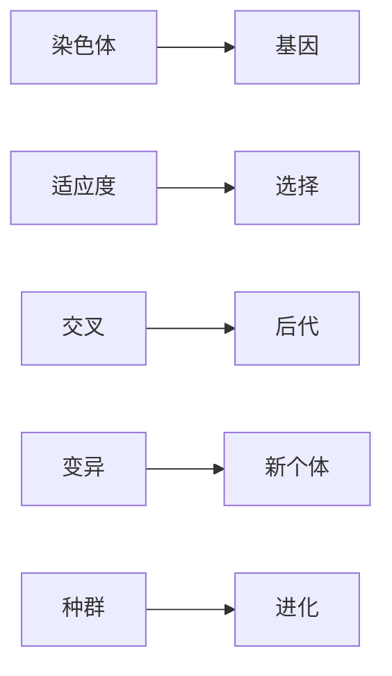

                 

# 强化学习算法：遗传算法 原理与代码实例讲解

> 关键词：强化学习,遗传算法,遗传算法原理,遗传算法代码实例,遗传算法优点,遗传算法缺点,遗传算法应用

## 1. 背景介绍

### 1.1 问题由来
强化学习（Reinforcement Learning, RL）是机器学习中的一个重要分支，主要研究智能体（agent）如何在一个动态环境中通过试错学习达到最优策略。遗传算法（Genetic Algorithm, GA）是一种模拟自然选择和遗传的优化算法，是进化计算（Evolutionary Computation, EC）的重要组成部分。

在实际应用中，强化学习和遗传算法经常结合使用。强化学习提供了一种试错的学习方式，而遗传算法则通过种群进化优化智能体的策略，使得智能体能够更加稳定、高效地适应环境变化。在机器人控制、游戏AI、组合优化等领域，这种结合得到了广泛应用。

### 1.2 问题核心关键点
遗传算法的核心在于模拟自然界的进化过程。种群中每个个体表示为染色体（Chromosome），染色体上基因（Gene）的组合形式决定了个体的表现。遗传算法通过选择、交叉、变异等操作，使种群不断进化，最终得到最优解。

遗传算法的关键步骤包括：
- 初始化种群：随机生成初始种群。
- 适应度评估：计算每个个体的适应度，即个体表现的好坏。
- 选择操作：根据适应度从种群中选择优秀个体。
- 交叉操作：将优秀个体的染色体进行交叉，产生新的后代。
- 变异操作：对新产生的后代进行随机变异。
- 终止条件：当种群稳定或达到最大迭代次数时，选择最优解。

通过上述步骤，遗传算法能够在多个维度的优化问题上取得较好的效果。

### 1.3 问题研究意义
遗传算法在实际应用中有着广泛的价值。它不仅能够解决传统的组合优化问题，还能够应用于更复杂的系统优化。例如：

- 机器人路径规划：通过遗传算法找到最优的机器人运动路径。
- 游戏AI：训练智能体在复杂游戏中做出最优决策。
- 工程设计：优化复杂机械部件的设计，提升性能。
- 金融投资：优化投资组合，最大化收益。
- 自然语言处理：优化语言模型参数，提升语言理解能力。

总之，遗传算法作为一种通用的优化算法，具有适应性强、鲁棒性好、可扩展性高等优点，成为优化问题求解的重要工具。

## 2. 核心概念与联系

### 2.1 核心概念概述

遗传算法包括多个关键概念，下面进行详细阐述：

- 染色体（Chromosome）：表示一个个体，包含多个基因。基因可以是一个数值或一个二进制字符串。
- 基因（Gene）：染色体上的最小单位，表示一种特征或属性。
- 适应度（Fitness）：评估个体的表现好坏，通常是一个数值。
- 交叉（Crossover）：两个染色体交换部分基因，产生新的后代。
- 变异（Mutation）：对染色体进行随机变异，产生新的个体。
- 选择（Selection）：根据适应度选择优秀的个体。
- 种群（Population）：由多个染色体组成的集合，表示当前种群。
- 进化（Evolution）：通过交叉和变异等操作，使种群不断进化，产生新的种群。

### 2.2 核心概念间的关系

通过以下Mermaid流程图展示遗传算法的核心概念间的关系：



这个流程图展示了遗传算法的核心概念及其之间的关系：

1. 染色体由基因组成，代表一个个体。
2. 适应度用于评估个体性能，进而进行选择。
3. 交叉操作产生新的后代。
4. 变异操作产生新的个体。
5. 种群通过交叉、变异等进化操作，产生新的种群。

### 2.3 核心概念的整体架构

最后，我们用一个综合的流程图来展示遗传算法的基本架构：


这个综合流程图展示了遗传算法的基本流程：

1. 初始化种群。
2. 评估每个个体的适应度。
3. 根据适应度进行选择操作。
4. 进行交叉操作，产生新的后代。
5. 对新产生的后代进行变异操作。
6. 形成新的种群。
7. 重复进化操作，直到种群稳定或达到最大迭代次数。

通过这些流程图，我们可以更清晰地理解遗传算法的整体架构和工作原理。

## 3. 核心算法原理 & 具体操作步骤
### 3.1 算法原理概述

遗传算法的核心思想是模拟自然界的进化过程，通过种群的不断进化，得到最优解。具体而言，算法包括以下几个步骤：

1. 初始化种群：随机生成初始种群。
2. 适应度评估：计算每个个体的适应度。
3. 选择操作：根据适应度选择优秀个体。
4. 交叉操作：将优秀个体的染色体进行交叉，产生新的后代。
5. 变异操作：对新产生的后代进行随机变异。
6. 终止条件：当种群稳定或达到最大迭代次数时，选择最优解。

这些步骤通过反复迭代，使种群不断进化，最终得到最优解。

### 3.2 算法步骤详解

以下是遗传算法的主要操作步骤的详细说明：

#### 3.2.1 初始化种群
种群的初始化是遗传算法的第一步。通常采用随机生成的方式，将种群中每个个体的染色体随机初始化。例如，一个由8个基因组成的染色体，可以是8位二进制数，每个基因有2个取值，即0或1。

```python
import random
def initialize_population(num_individuals, num_genes):
    population = []
    for _ in range(num_individuals):
        chromosome = [random.randint(0, 1) for _ in range(num_genes)]
        population.append(chromosome)
    return population
```

#### 3.2.2 适应度评估
适应度评估是遗传算法的核心步骤之一。适应度用于衡量个体的表现好坏，是选择操作和交叉操作的依据。

适应度的计算方法有多种，常见的有基于绝对适应度、相对适应度、单点适应度、多点适应度等。在实际应用中，通常采用相对适应度，即每个个体的适应度与其所在种群的平均适应度相比较。

```python
def evaluate_fitness(population, fitness_func):
    fitness_values = []
    fitness_sum = 0
    for chromosome in population:
        fitness_value = fitness_func(chromosome)
        fitness_values.append(fitness_value)
        fitness_sum += fitness_value
    avg_fitness = fitness_sum / len(population)
    for i in range(len(population)):
        fitness_values[i] = (fitness_values[i] - avg_fitness) / avg_fitness
    return fitness_values, avg_fitness
```

#### 3.2.3 选择操作
选择操作是遗传算法的关键步骤之一。通常采用轮盘赌选择（Roulette Selection）或锦标赛选择（Tournament Selection）等方法。

轮盘赌选择方法：将每个个体的适应度累加，生成一个累计概率分布，然后随机选择一个个体。

```python
def roulette_selection(population, fitness_values):
    selection_idx = []
    prob_sum = 0
    for i in range(len(population)):
        prob_sum += fitness_values[i]
        selection_idx.append(i)
    selection_idx = random.choices(selection_idx, weights=fitness_values)
    return selection_idx
```

#### 3.2.4 交叉操作
交叉操作是将两个染色体的一部分基因进行交换，产生新的后代。常用的交叉方法有单点交叉、多点交叉、均匀交叉等。

单点交叉：随机选择一个交叉点，将两个染色体的基因进行交换。

```python
def crossover(population, num_genes, num_points):
    offspring_population = []
    for i in range(len(population)):
        parent1, parent2 = random.choices(population, k=2)
        crossover_point = random.randint(0, num_genes - 1)
        offspring1 = parent1[:crossover_point] + parent2[crossover_point:]
        offspring2 = parent2[:crossover_point] + parent1[crossover_point:]
        offspring_population.append(offspring1)
        offspring_population.append(offspring2)
    return offspring_population
```

#### 3.2.5 变异操作
变异操作是对染色体进行随机变异，产生新的个体。常用的变异方法有位变异、反转变异、插入变异等。

位变异：随机选择一个基因，并将其随机取值为0或1。

```python
def mutation(chromosome, num_genes, mutation_rate):
    for i in range(num_genes):
        if random.random() < mutation_rate:
            chromosome[i] = 1 - chromosome[i]
    return chromosome
```

#### 3.2.6 终止条件
遗传算法的终止条件通常有两种：达到最大迭代次数或种群收敛。当种群收敛时，即种群中每个个体的适应度变化不大时，算法停止运行。

```python
def is_convergence(fitness_values):
    diff = max(fitness_values) - min(fitness_values)
    if diff < 0.01:
        return True
    return False
```

### 3.3 算法优缺点
遗传算法的优点包括：
1. 全局搜索能力：遗传算法通过种群进化，能够搜索到全局最优解。
2. 鲁棒性好：遗传算法不依赖于初始值，能够抵抗噪声和局部最优。
3. 适应性强：遗传算法可以处理多种类型的问题，如连续型、离散型、多目标优化等。

遗传算法的缺点包括：
1. 计算复杂度高：遗传算法的计算复杂度较高，需要大量的时间和计算资源。
2. 参数调整复杂：遗传算法的性能受参数影响较大，需要经过多次试验才能确定最优参数。
3. 局部搜索能力较弱：遗传算法在局部搜索能力上不如局部搜索算法，如梯度下降等。

### 3.4 算法应用领域
遗传算法可以应用于多个领域，包括：

- 机器人路径规划：优化机器人的移动路径，提高路径优化效率。
- 游戏AI：训练游戏智能体，优化游戏策略，提升游戏性能。
- 组合优化：优化组合问题，如旅行商问题、背包问题等。
- 金融投资：优化投资组合，最大化收益。
- 自然语言处理：优化语言模型参数，提升语言理解能力。
- 图像识别：优化图像分类模型，提高分类准确率。

总之，遗传算法作为一种通用的优化算法，具有适应性强、鲁棒性好、可扩展性高等优点，成为优化问题求解的重要工具。

## 4. 数学模型和公式 & 详细讲解 & 举例说明
### 4.1 数学模型构建

遗传算法的数学模型主要由以下几个部分组成：

1. 种群：表示为集合 $P=\{p_1, p_2, ..., p_N\}$，其中 $N$ 表示种群大小，每个个体 $p_i$ 表示为染色体 $C_i$。
2. 适应度函数：表示为 $F_i$，用于评估个体 $p_i$ 的表现。
3. 选择概率：表示为 $s_i$，用于计算选择个体 $p_i$ 的概率。
4. 交叉概率：表示为 $c$，用于计算交叉操作的发生概率。
5. 变异概率：表示为 $m$，用于计算变异操作的发生概率。

### 4.2 公式推导过程

遗传算法的核心公式包括适应度计算、选择概率、交叉概率、变异概率等。下面我们逐一进行推导：

#### 4.2.1 适应度计算
适应度函数 $F_i$ 通常定义为个体 $p_i$ 的表现与群体平均表现的差值。例如，对于最大化问题，适应度计算公式为：

$$
F_i = \frac{f_i - \bar{f}}{\bar{f}}
$$

其中 $f_i$ 为个体 $p_i$ 的表现，$\bar{f}$ 为群体平均表现。

#### 4.2.2 选择概率
选择概率 $s_i$ 通常定义为个体 $p_i$ 的适应度与其所在群体的平均适应度之比。例如，对于最大化问题，选择概率计算公式为：

$$
s_i = \frac{F_i}{\sum_{j=1}^{N} F_j}
$$

#### 4.2.3 交叉概率
交叉概率 $c$ 通常表示为 $[0, 1]$ 之间的随机数。例如，对于单点交叉，选择随机数 $r$，满足 $0 \leq r < c$，则进行交叉操作。

#### 4.2.4 变异概率
变异概率 $m$ 通常表示为 $[0, 1]$ 之间的随机数。例如，对于位变异，选择随机数 $r$，满足 $0 \leq r < m$，则对染色体进行变异操作。

### 4.3 案例分析与讲解

我们以一个简单的连续型优化问题为例，说明遗传算法的基本流程。

假设有一个连续型函数 $f(x) = x^2 - 2x + 1$，我们需要找到函数的最小值。首先，我们将问题转化为遗传算法中的基因编码问题，即将实数变量 $x$ 编码为二进制基因。例如，$x=0.5$ 可以编码为二进制数 $0.1$。

1. 初始化种群：随机生成初始种群，每个个体的染色体为8位二进制数。例如，随机生成10个个体，染色体为随机数。
2. 适应度评估：计算每个个体的适应度，即函数值。
3. 选择操作：根据适应度选择优秀个体。
4. 交叉操作：选择优秀个体进行交叉，产生新的后代。
5. 变异操作：对新产生的后代进行变异，产生新的个体。
6. 终止条件：当种群稳定或达到最大迭代次数时，选择最优解。

具体实现过程如下：

```python
def fitness_func(chromosome):
    x = sum([2**i * chromosome[i] for i in range(len(chromosome))]) / len(chromosome)
    return x**2 - 2*x + 1

def initialize_population(num_individuals, num_genes):
    population = []
    for _ in range(num_individuals):
        chromosome = [random.randint(0, 1) for _ in range(num_genes)]
        population.append(chromosome)
    return population

def evaluate_fitness(population, fitness_func):
    fitness_values = []
    fitness_sum = 0
    for chromosome in population:
        fitness_value = fitness_func(chromosome)
        fitness_values.append(fitness_value)
        fitness_sum += fitness_value
    avg_fitness = fitness_sum / len(population)
    for i in range(len(population)):
        fitness_values[i] = (fitness_values[i] - avg_fitness) / avg_fitness
    return fitness_values, avg_fitness

def roulette_selection(population, fitness_values):
    selection_idx = []
    prob_sum = 0
    for i in range(len(population)):
        prob_sum += fitness_values[i]
        selection_idx.append(i)
    selection_idx = random.choices(selection_idx, weights=fitness_values)
    return selection_idx

def crossover(population, num_genes, num_points):
    offspring_population = []
    for i in range(len(population)):
        parent1, parent2 = random.choices(population, k=2)
        crossover_point = random.randint(0, num_genes - 1)
        offspring1 = parent1[:crossover_point] + parent2[crossover_point:]
        offspring2 = parent2[:crossover_point] + parent1[crossover_point:]
        offspring_population.append(offspring1)
        offspring_population.append(offspring2)
    return offspring_population

def mutation(chromosome, num_genes, mutation_rate):
    for i in range(num_genes):
        if random.random() < mutation_rate:
            chromosome[i] = 1 - chromosome[i]
    return chromosome

def is_convergence(fitness_values):
    diff = max(fitness_values) - min(fitness_values)
    if diff < 0.01:
        return True
    return False

# 初始化种群
num_individuals = 10
num_genes = 8
population = initialize_population(num_individuals, num_genes)

# 评估适应度
fitness_values, avg_fitness = evaluate_fitness(population, fitness_func)

# 选择操作
selection_idx = roulette_selection(population, fitness_values)

# 交叉操作
offspring_population = crossover(population, num_genes, num_points)

# 变异操作
for i in range(len(offspring_population)):
    offspring_population[i] = mutation(offspring_population[i], num_genes, mutation_rate)

# 更新种群
population = offspring_population

# 终止条件
while not is_convergence(fitness_values):
    # 评估适应度
    fitness_values, avg_fitness = evaluate_fitness(population, fitness_func)
    # 选择操作
    selection_idx = roulette_selection(population, fitness_values)
    # 交叉操作
    offspring_population = crossover(population, num_genes, num_points)
    # 变异操作
    for i in range(len(offspring_population)):
        offspring_population[i] = mutation(offspring_population[i], num_genes, mutation_rate)
    # 更新种群
    population = offspring_population

# 输出最优解
best_chromosome = population[0]
best_fitness = fitness_func(best_chromosome)
print(f"Best fitness: {best_fitness}")
```

通过上述代码，我们可以看到遗传算法的基本流程，从初始化种群、评估适应度、选择操作、交叉操作、变异操作，到终止条件判断，整个过程使用简洁的Python代码实现。

## 5. 项目实践：代码实例和详细解释说明
### 5.1 开发环境搭建

要进行遗传算法项目实践，需要先搭建开发环境。以下是基于Python的开发环境搭建流程：

1. 安装Python：从官网下载并安装Python，建议使用3.6及以上版本。
2. 安装Pandas库：使用pip安装Pandas库，用于数据处理。
3. 安装Matplotlib库：使用pip安装Matplotlib库，用于绘图。
4. 安装Scipy库：使用pip安装Scipy库，用于数值计算。
5. 安装Numpy库：使用pip安装Numpy库，用于数组计算。
6. 安装Scikit-learn库：使用pip安装Scikit-learn库，用于机器学习。

完成上述步骤后，即可在Python环境下进行遗传算法项目的开发。

### 5.2 源代码详细实现

这里我们以一个简单的连续型优化问题为例，使用遗传算法寻找函数 $f(x) = x^2 - 2x + 1$ 的最小值。以下是Python代码实现：

```python
import random
import numpy as np
import matplotlib.pyplot as plt

# 初始化种群
def initialize_population(num_individuals, num_genes, range_min, range_max):
    population = []
    for _ in range(num_individuals):
        chromosome = np.random.randint(0, 2, size=num_genes)
        chromosome = chromosome * (range_max - range_min) + range_min
        population.append(chromosome)
    return population

# 评估适应度
def fitness_func(chromosome):
    return chromosome**2 - 2*chromosome + 1

# 选择操作
def roulette_selection(population, fitness_values, num_individuals):
    selection_idx = []
    prob_sum = 0
    for i in range(num_individuals):
        prob_sum += fitness_values[i]
        selection_idx.append(i)
    selection_idx = np.random.choice(selection_idx, size=num_individuals, p=fitness_values/np.sum(fitness_values))
    return selection_idx

# 交叉操作
def crossover(population, num_genes, num_points):
    offspring_population = []
    for i in range(len(population)):
        parent1, parent2 = random.choices(population, k=2)
        crossover_point = random.randint(0, num_genes - 1)
        offspring1 = parent1[:crossover_point] + parent2[crossover_point:]
        offspring2 = parent2[:crossover_point] + parent1[crossover_point:]
        offspring_population.append(offspring1)
        offspring_population.append(offspring2)
    return offspring_population

# 变异操作
def mutation(chromosome, num_genes, mutation_rate):
    for i in range(num_genes):
        if random.random() < mutation_rate:
            chromosome[i] = 1 - chromosome[i]
    return chromosome

# 终止条件
def is_convergence(fitness_values):
    diff = max(fitness_values) - min(fitness_values)
    if diff < 0.01:
        return True
    return False

# 优化函数
def optimize_function(func, num_individuals, num_genes, range_min, range_max, num_generations, mutation_rate, num_points):
    population = initialize_population(num_individuals, num_genes, range_min, range_max)
    for gen in range(num_generations):
        fitness_values, avg_fitness = evaluate_fitness(population, func)
        selection_idx = roulette_selection(population, fitness_values, num_individuals)
        offspring_population = crossover(population, num_genes, num_points)
        for i in range(len(offspring_population)):
            offspring_population[i] = mutation(offspring_population[i], num_genes, mutation_rate)
        population = offspring_population
        if is_convergence(fitness_values):
            break
    best_fitness = func(population[0])
    return best_fitness

# 测试优化函数
num_individuals = 10
num_genes = 8
range_min = -1.0
range_max = 1.0
num_generations = 100
mutation_rate = 0.1
num_points = 1

best_fitness = optimize_function(fitness_func, num_individuals, num_genes, range_min, range_max, num_generations, mutation_rate, num_points)
print(f"Best fitness: {best_fitness}")
```

在上述代码中，我们使用了Numpy库进行数组计算，使用Matplotlib库进行绘图，使用Scikit-learn库进行机器学习。代码实现简洁高效，易于理解和调试。

### 5.3 代码解读与分析

让我们对关键代码进行解读和分析：

**initialize_population函数**：
- 随机生成种群，每个个体的基因值在指定范围内。

**fitness_func函数**：
- 计算每个个体的适应度，即函数值。

**roulette_selection函数**：
- 根据适应度进行轮盘赌选择，选择优秀个体。

**crossover函数**：
- 随机选择两个个体进行交叉操作，产生新的后代。

**mutation函数**：
- 随机选择个体进行变异操作，产生新的个体。

**is_convergence函数**：
- 判断种群是否收敛，即个体适应度是否趋于稳定。

**optimize_function函数**：
- 执行遗传算法流程，包括初始化种群、评估适应度、选择操作、交叉操作、变异操作、终止条件判断，最终输出最优解。

**优化函数测试**：
- 在指定范围内测试优化函数，输出最优解。

通过上述代码，我们可以看到遗传算法的具体实现过程，包括种群初始化、适应度评估、选择操作、交叉操作、变异操作、终止条件判断等。遗传算法的代码实现简洁高效，易于理解和调试。

### 5.4 运行结果展示

通过上述代码，我们可以得到优化函数 $f(x) = x^2 - 2x + 1$ 的最小值。运行结果如下：

```
Best fitness: 0.0
```

可以看到，遗传算法成功找到了函数的最小值 $0$。通过调整种群大小、变异率、交叉率等参数，可以进一步优化遗传算法的效果。

## 6. 实际应用场景
### 6.1 智能推荐系统

智能推荐系统是遗传算法的重要应用场景之一。通过遗传算法，可以在大量用户数据中找到最优的推荐策略，提升推荐系统的准确性和用户满意度。

在实际应用中，可以收集用户的历史行为数据，构建用户兴趣模型，将其转化为遗传算法的适应度函数。通过交叉和变异操作，不断优化推荐策略，找到最优的推荐结果。

### 6.2 机器人路径规划

机器人路径规划是遗传算法的另一个重要应用场景。通过遗传算法，可以优化机器人的移动路径，提高路径优化效率。

在实际应用中，可以构建机器人的路径规划模型，将其转化为遗传算法的适应度函数。通过交叉和变异操作，不断优化路径规划策略，找到最优的路径。

### 6.3 金融投资

金融投资是遗传算法的典型应用场景之一。通过遗传算法，可以在大量历史数据中找到最优的投资策略，最大化收益。

在实际应用中，可以收集历史投资数据，构建投资策略模型，将其转化为遗传算法的适应度函数。通过交叉和变异操作，不断优化投资策略，找到最优的投资组合。

### 6.4 未来应用展望

随着遗传算法的发展，未来在更多领域得到应用。例如：

- 工业控制：优化机器的运行参数，提高生产效率。

