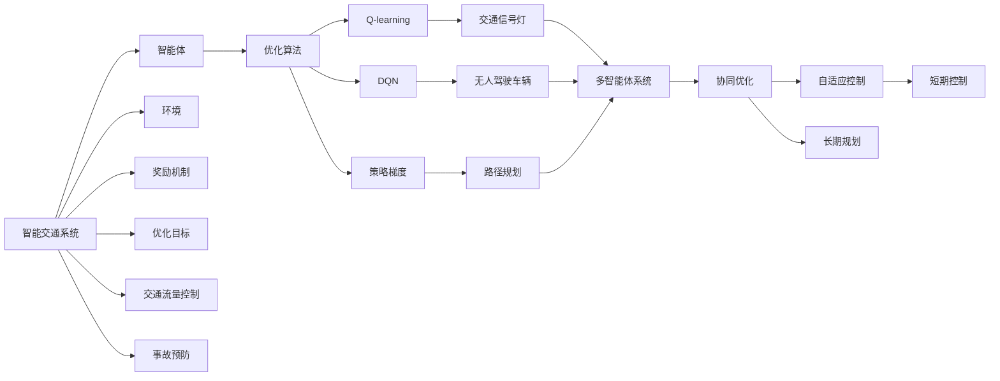
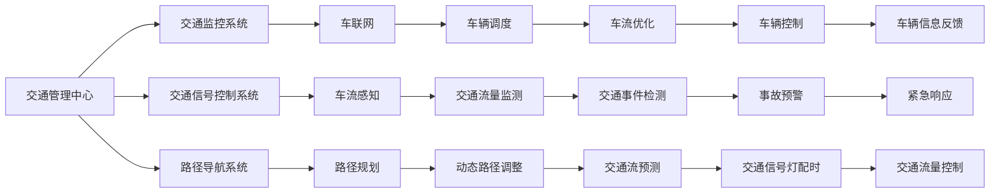
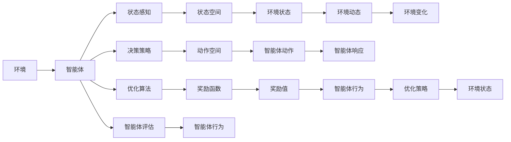
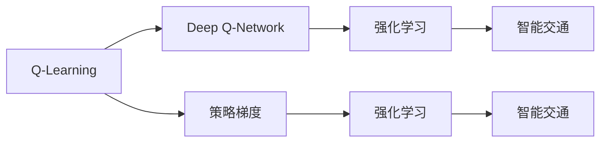
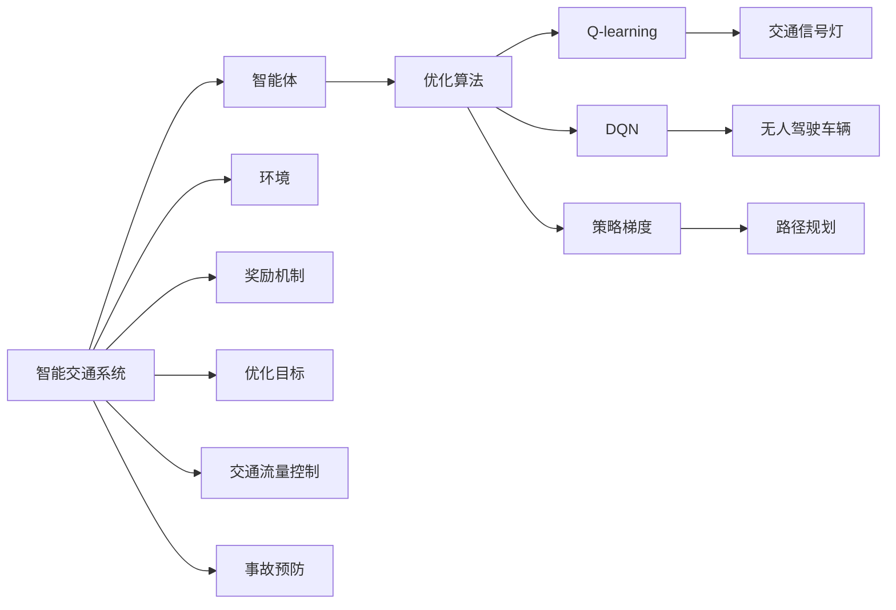

                 

# 强化学习：在智能交通系统中的应用

> 关键词：强化学习,智能交通系统,交通流量控制,车联网,自动驾驶,优化算法,车辆调度,系统仿真

## 1. 背景介绍

### 1.1 问题由来
近年来，随着城市化进程的加快和汽车保有量的激增，城市交通拥堵问题日益凸显。面对高峰期车流密集、路口拥堵、交通信号配时不合理等问题，如何提高城市交通系统的效率和安全性，成为了城市规划和管理的一个重要课题。传统的基于规则的交通管理策略已经难以满足复杂的城市交通需求，迫切需要引入更为灵活和智能的交通管理技术。

强化学习（Reinforcement Learning, RL）作为一种基于试错的学习范式，通过智能体与环境的互动，优化决策策略以实现特定目标。其核心思想是：通过不断的试错和奖惩机制，使智能体学会在复杂环境中做出最优决策。强化学习在自动驾驶、机器人控制、推荐系统等领域已取得显著成果，但在智能交通系统中的应用仍处于起步阶段。本文将介绍强化学习在智能交通系统中的关键应用，探讨其原理和实施策略。

### 1.2 问题核心关键点
强化学习在智能交通系统中的应用，主要围绕以下几个核心关键点展开：

1. **智能交通系统（ITS）**：包括车联网、交通信号控制、车辆调度、路径规划、事故预防等，涵盖交通管理、监控、导航等多个方面。

2. **智能体（Agent）**：在智能交通系统中，智能体可以是无人驾驶车辆、交通信号灯、交通监控系统等，通过学习决策策略，优化交通流和交通信号配时。

3. **环境（Environment）**：智能体所处的交通环境，包括道路、车辆、行人、交通信号灯等，智能体需要从中获取状态信息，做出最优决策。

4. **奖励机制（Reward）**：定义智能体在每个状态下的奖励，如减少交通拥堵、提升通行效率、节约能源等。

5. **优化目标**：根据智能体的行为，优化其决策策略，以实现减少拥堵、提高效率、保障安全等目标。

6. **优化算法**：基于强化学习的优化算法，如Q-learning、Deep Q-Network（DQN）、策略梯度等，用于训练智能体的决策策略。

这些核心关键点构成了强化学习在智能交通系统中的应用框架，其核心思想是利用智能体的试错能力，通过与环境的互动，逐步优化决策策略，实现智能交通系统的高效和智能管理。

### 1.3 问题研究意义
强化学习在智能交通系统中的应用，对于提升城市交通系统的管理水平，缓解交通拥堵，保障交通安全，具有重要意义：

1. **提升交通效率**：通过优化交通信号配时和车辆调度，可以显著提高交通流量，减少拥堵，提升通行效率。

2. **保障交通安全**：通过智能交通信号控制和事故预防系统，能够提高事故响应速度和处理效率，降低交通事故率。

3. **节能减排**：优化交通流量和路径规划，减少不必要的行驶距离和时间浪费，有利于环境保护和节能减排。

4. **资源优化**：通过智能调度和管理，合理分配交通资源，提升交通系统的整体效率和效益。

5. **用户体验提升**：智能交通系统能够实时响应用户需求，提供更为个性化的出行服务，提升用户满意度。

6. **技术创新**：强化学习技术的应用，推动了智能交通系统技术的发展，为未来交通管理的智能化、自动化提供了新的可能性。

## 2. 核心概念与联系

### 2.1 核心概念概述

为更好地理解强化学习在智能交通系统中的应用，本节将介绍几个密切相关的核心概念：

- **智能交通系统（ITS）**：涵盖交通管理、监控、导航等多个方面，利用先进的信息技术、数据通信技术、传感器技术等，实现对道路、车辆、交通信号灯等的智能监控和管理。

- **智能体（Agent）**：在智能交通系统中，智能体可以是无人驾驶车辆、交通信号灯、交通监控系统等，通过学习决策策略，优化交通流和交通信号配时。

- **环境（Environment）**：智能体所处的交通环境，包括道路、车辆、行人、交通信号灯等，智能体需要从中获取状态信息，做出最优决策。

- **奖励机制（Reward）**：定义智能体在每个状态下的奖励，如减少交通拥堵、提升通行效率、节约能源等。

- **优化目标**：根据智能体的行为，优化其决策策略，以实现减少拥堵、提高效率、保障安全等目标。

- **优化算法**：基于强化学习的优化算法，如Q-learning、Deep Q-Network（DQN）、策略梯度等，用于训练智能体的决策策略。

- **多智能体系统（MAS）**：涉及多个智能体之间复杂的交互和协作，如车联网、多智能体协同控制等。

- **协同优化**：通过智能体之间的合作，实现系统的整体优化，如交通信号灯群协调控制、车辆队列管理等。

- **自适应控制**：智能体根据环境变化和目标需求，动态调整决策策略，如交通信号灯自适应配时、车辆自适应路径规划等。

- **长期规划与短期控制**：结合长期规划和短期控制，实现智能交通系统的动态优化，如路径规划与交通信号控制结合。

这些核心概念之间的逻辑关系可以通过以下Mermaid流程图来展示：



这个流程图展示了大语言模型微调过程中各个核心概念的关系和作用：

1. 智能交通系统通过智能体和环境互动，优化决策策略，实现系统目标。
2. 智能体在环境中获取状态信息，通过优化算法，动态调整决策策略。
3. 多智能体系统涉及智能体之间的交互和协作，实现系统的整体优化。
4. 自适应控制和长期规划与短期控制，实现系统的动态优化。
5. 交通流量控制和事故预防，是智能交通系统的具体应用场景。

### 2.2 概念间的关系

这些核心概念之间存在着紧密的联系，形成了智能交通系统应用的完整生态系统。下面我们通过几个Mermaid流程图来展示这些概念之间的关系。

#### 2.2.1 智能交通系统基本架构



这个流程图展示了智能交通系统的基本架构，涵盖了交通管理中心、监控系统、信号控制系统、路径导航系统等多个关键组件。智能体通过与环境互动，获取状态信息，实现系统优化。

#### 2.2.2 强化学习在智能交通中的应用流程



这个流程图展示了强化学习在智能交通系统中的应用流程，智能体通过状态感知、决策策略、动作空间，与环境互动，获取状态信息，实现优化策略的动态调整。

#### 2.2.3 强化学习在智能交通中的算法



这个流程图展示了强化学习在智能交通系统中的主要算法，包括Q-learning、Deep Q-Network、策略梯度等，这些算法通过优化智能体的决策策略，实现智能交通系统的优化。

### 2.3 核心概念的整体架构

最后，我们用一个综合的流程图来展示这些核心概念在智能交通系统中的应用架构：



这个综合流程图展示了从智能交通系统到智能体的整个应用架构，智能体通过与环境互动，优化决策策略，实现交通系统的整体优化。

## 3. 核心算法原理 & 具体操作步骤
### 3.1 算法原理概述

强化学习在智能交通系统中的应用，本质上是智能体在交通环境中通过试错学习，动态调整决策策略的过程。其核心思想是：通过不断的试错和奖惩机制，使智能体学会在复杂环境中做出最优决策。

形式化地，假设智能体在每个时间步 $t$ 的状态为 $s_t$，动作为 $a_t$，状态-动作对的奖励为 $r_t$，智能体的策略为 $\pi(a_t|s_t)$。智能体的目标是最大化长期累积奖励 $J(\pi) = \mathbb{E}\left[\sum_{t=1}^{\infty}\gamma^{t-1}r_t\right]$，其中 $\gamma$ 为折扣因子，表示未来奖励的权重。

强化学习的核心算法，如Q-learning、DQN、策略梯度等，通过估计状态-动作对的价值函数 $Q(s,a)$，或状态价值函数 $V(s)$，或动作价值函数 $A(s)$，指导智能体做出最优决策。这些价值函数可以通过模型预测或基于经验的数据进行估计。

### 3.2 算法步骤详解

强化学习在智能交通系统中的应用一般包括以下几个关键步骤：

**Step 1: 准备环境**

- 设计智能交通系统的环境，包括道路、车辆、行人、交通信号灯等，智能体通过环境感知获取状态信息。
- 定义状态空间、动作空间、奖励函数，以及智能体的优化目标。

**Step 2: 设计优化算法**

- 选择合适的优化算法，如Q-learning、DQN、策略梯度等，设置相关参数，如学习率、折扣因子等。
- 定义智能体的决策策略，可以是基于经验规则、模型预测，或基于深度学习的决策网络。

**Step 3: 训练智能体**

- 随机初始化智能体的策略参数，在环境中进行试错学习。
- 通过不断的交互，智能体根据奖励机制更新策略参数，逐步优化决策策略。

**Step 4: 部署智能体**

- 将训练好的智能体部署到实际交通系统中，执行交通流量控制、车辆调度等任务。
- 实时监控智能体的行为，根据环境变化动态调整策略。

**Step 5: 评估和优化**

- 评估智能体的性能，通过指标如交通流量、通行效率、事故率等进行衡量。
- 根据评估结果，优化智能体的策略参数，提升智能体的性能。

### 3.3 算法优缺点

强化学习在智能交通系统中的应用具有以下优点：

1. **自适应性强**：通过试错学习，智能体能够动态调整决策策略，适应环境变化和需求。

2. **鲁棒性好**：强化学习算法能够处理非线性、非平稳的动态环境，具有较强的鲁棒性。

3. **灵活度高**：强化学习可以通过调整奖励机制、优化算法等，灵活地适应不同的交通场景和需求。

4. **无需大量标注数据**：强化学习通过试错学习，能够在实际环境中进行训练，无需大量标注数据。

5. **实时性高**：强化学习算法能够实时响应交通环境的变化，进行动态决策。

6. **可扩展性好**：强化学习可以应用于不同规模的交通系统，从简单的交通信号灯控制到复杂的智能交通系统。

但强化学习在智能交通系统中的应用也存在一些局限性：

1. **计算开销大**：强化学习算法需要大量的计算资源，尤其是深度强化学习算法，如DQN等。

2. **收敛慢**：在复杂环境中，智能体可能需要大量的试错次数才能收敛，导致训练时间长。

3. **策略复杂**：强化学习算法的策略复杂度高，需要精心设计环境、奖励函数和优化算法。

4. **可解释性差**：强化学习算法的决策过程不透明，难以解释智能体的行为和决策逻辑。

5. **稳定性问题**：智能体的决策策略在实际应用中可能不稳定，需要进行持续优化和维护。

6. **安全和伦理问题**：强化学习算法在实际应用中可能存在安全隐患和伦理问题，需要进行严格监管和控制。

### 3.4 算法应用领域

强化学习在智能交通系统中的应用领域广泛，以下是几个典型应用场景：

1. **交通信号控制**：通过强化学习算法，智能体可以实时调整交通信号灯的配时，优化交通流量，减少拥堵。

2. **无人驾驶车辆控制**：无人驾驶车辆通过强化学习算法，动态调整行驶策略，实现安全、高效的行驶。

3. **车辆调度与路径规划**：在智能交通系统中，通过强化学习算法，智能体可以动态调整车辆调度策略，优化路径规划，提高通行效率。

4. **交通流量预测与优化**：通过强化学习算法，智能体可以预测交通流量，优化交通流控制，实现交通系统的整体优化。

5. **事故预防与应急响应**：通过强化学习算法，智能体可以实时监测交通事件，进行应急响应，减少事故率和响应时间。

6. **智能交通监控与导航**：通过强化学习算法，智能体可以实现交通监控、导航等功能的智能优化，提升用户体验。

这些应用场景展示了强化学习在智能交通系统中的广泛应用，通过智能体的动态决策策略，实现交通系统的优化和智能化管理。

## 4. 数学模型和公式 & 详细讲解  
### 4.1 数学模型构建

在强化学习中，常用的数学模型包括状态-动作对价值函数 $Q(s,a)$、状态价值函数 $V(s)$、动作价值函数 $A(s)$ 等。假设智能体在状态 $s_t$ 下采取动作 $a_t$，获得奖励 $r_{t+1}$，下一状态为 $s_{t+1}$。则智能体在状态 $s$ 下采取动作 $a$ 的Q值定义为：

$$
Q(s,a) = \mathbb{E}[r_{t+1} + \gamma Q(s_{t+1},a_{t+1}) | s_t = s, a_t = a]
$$

其中 $Q(s,a)$ 为状态-动作对的价值函数，$r_{t+1}$ 为下一时间步的奖励，$\gamma$ 为折扣因子。状态价值函数 $V(s)$ 定义为：

$$
V(s) = \mathbb{E}[ \sum_{t=0}^{\infty}\gamma^t r_t | s_0 = s]
$$

动作价值函数 $A(s)$ 定义为：

$$
A(s) = \mathbb{E}[\sum_{t=0}^{\infty}\gamma^t r_t | s_0 = s, a_0 = \pi(s)]
$$

### 4.2 公式推导过程

以下我们以Q-learning算法为例，推导强化学习在智能交通系统中的优化过程。

Q-learning算法通过估计状态-动作对的Q值函数 $Q(s,a)$，实现智能体的最优决策。Q值函数的更新公式为：

$$
Q(s,a) \leftarrow Q(s,a) + \alpha [r + \gamma \max Q(s',a') - Q(s,a)]
$$

其中 $\alpha$ 为学习率，$r$ 为即时奖励，$s'$ 和 $a'$ 为下一状态和动作，$Q(s',a')$ 为下一状态-动作对的Q值。

在实际应用中，可以使用深度学习模型，如神经网络，估计Q值函数，实现DQN算法。DQN算法通过深度Q网络（Deep Q Network）估计Q值函数，避免了传统Q-learning算法中的状态爆炸问题，能够在复杂环境中实现高效的优化。

### 4.3 案例分析与讲解

以交通信号灯控制为例，分析强化学习算法的应用。假设智能体（交通信号灯）在每个时间步 $t$ 的状态为 $s_t$，动作为 $a_t$（绿灯、黄灯、红灯），奖励为 $r_t$（通行效率、等待时间等），智能体的目标是最大化长期累积奖励。通过Q-learning算法，智能体可以实时调整信号灯配时，优化交通流量。

假设智能体的状态空间为 $\{0,1,2,3\}$，表示不同方向的交通流量。动作空间为 $\{1,2,3\}$，表示绿灯、黄灯、红灯。奖励函数为 $r_{t+1} = \min(\frac{s_{t+1}}{10}, 10 - \frac{s_{t+1}}{10})$，表示通行效率和等待时间。智能体的优化目标为 $\max_{\pi} \mathbb{E}\left[\sum_{t=1}^{\infty}\gamma^{t-1}r_t\right]$。

通过Q-learning算法，智能体可以通过不断试错，逐步优化信号灯配时，实现交通流量的优化。例如，智能体可以通过观察不同方向交通流量的变化，动态调整信号灯配时，减少拥堵，提升通行效率。

## 5. 项目实践：代码实例和详细解释说明
### 5.1 开发环境搭建

在进行强化学习实践前，我们需要准备好开发环境。以下是使用Python进行PyTorch开发的环境配置流程：

1. 安装Anaconda：从官网下载并安装Anaconda，用于创建独立的Python环境。

2. 创建并激活虚拟环境：
```bash
conda create -n reinforcement-env python=3.8 
conda activate reinforcement-env
```

3. 安装PyTorch：根据CUDA版本，从官网获取对应的安装命令。例如：
```bash
conda install pytorch torchvision torchaudio cudatoolkit=11.1 -c pytorch -c conda-forge
```

4. 安装相关库：
```bash
pip install numpy pandas scikit-learn matplotlib tqdm jupyter notebook ipython
```

完成上述步骤后，即可在`reinforcement-env`环境中开始强化学习实践。

### 5.2 源代码详细实现

这里以交通信号控制为例，使用PyTorch实现Q-learning算法。

首先，定义交通信号控制的状态和动作：

```python
import torch
import torch.nn as nn
import torch.optim as optim

class StateAction:
    def __init__(self):
        self.state = {'north': 0, 'east': 1, 'south': 2, 'west': 3}
        self.actions = {'north': 1, 'east': 2, 'south': 3, 'west': 4}
        self.num_states = len(self.state)
        self.num_actions = len(self.actions)
```

然后，定义交通信号控制的状态-动作对和奖励函数：

```python
class TrafficLight:
    def __init__(self, state):
        self.state = state
        self.traffic_lights = {'north': 0, 'east': 0, 'south': 0, 'west': 0}
        self.actions = {'north': 1, 'east': 2, 'south': 3, 'west': 4}

    def get_state(self):
        return self.state

    def set_state(self, state):
        self.state = state
        self.traffic_lights = {'north': 0, 'east': 0, 'south': 0, 'west': 0}

    def get_reward(self, action):
        if action == self.actions['north']:
            self.traffic_lights['north'] += 1
        elif action == self.actions['east']:
            self.traffic_lights['east'] += 1
        elif action == self.actions['south']:
            self.traffic_lights['south'] += 1
        elif action == self.actions['west']:
            self.traffic_lights['west'] += 1
        return -1 / (self.traffic_lights['north'] + self.traffic_lights['east'] + self.traffic_lights['south'] + self.traffic_lights['west'])
```

接着，定义Q-learning算法的模型和训练函数：

```python
class QNetwork(nn.Module):
    def __init__(self, state_size, action_size):
        super(QNetwork, self).__init__()
        self.fc1 = nn.Linear(state_size, 64)
        self.fc2 = nn.Linear(64, action_size)

    def forward(self, x):
        x = torch.relu(self.fc1(x))
        x = self.fc2(x)
        return x

def q_learning(env, state_size, action_size, learning_rate, discount_factor, episode_number):
    model = QNetwork(state_size, action_size)
    optimizer = optim.Adam(model.parameters(), lr=learning_rate)
    for episode in range(episode_number):
        state = torch.tensor(env.get_state(), dtype=torch.float).unsqueeze(0)
        while True:
            action_probs = model(state)
            action = torch.multinomial(torch.exp(action_probs), 1)[0].item()
            next_state, reward, done, _ = env.step(action)
            if done:
                break
            next_state = torch.tensor(next_state, dtype=torch.float).unsqueeze(0)
            q_next = model(next_state).unsqueeze(0)
            q_pred = model(state).unsqueeze(0)
            target = reward + discount_factor * torch.max(q_next, dim=1).values
            loss = nn.MSELoss()(q_pred, target)
            optimizer.zero_grad()
            loss.backward()
            optimizer.step()
            state = next_state
    return model

```

最后，启动Q-learning算法的训练流程：

```python
env = TrafficLight({})
state_size = 4
action_size = 4
learning_rate = 0.01
discount_factor = 0.9
episode_number = 10000

model = q_learning(env, state_size, action_size, learning_rate, discount_factor, episode_number)
```

以上就是使用PyTorch实现Q-learning算法的完整代码实现。可以看到，通过定义状态、动作、奖励函数，以及Q-learning算法的模型和训练函数，即可实现交通信号控制。

### 5.3 代码解读与分析

让我们再详细解读一下关键代码的实现细节：

**StateAction类**：
- 定义了状态和动作的映射关系，以及状态和动作的数量。

**TrafficLight类**：
- 实现了交通信号控制的状态、动作和奖励函数。
- 通过状态、动作的变化，动态调整交通信号灯配时，并计算奖励。

**QNetwork类**：
- 定义了基于深度学习的Q值函数估计模型，包含两个全连接层。

**q_learning函数**：
- 实现Q-learning算法，通过不断试错和奖励机制更新模型参数。

**训练流程**：
- 初始化模型、优化器和环境。
- 在每个epoch中，不断迭代，通过状态感知、动作选择、奖励获取，更新模型参数。
- 当达到预设的epoch数量时，训练结束。

可以看到，PyTorch配合深度学习技术，使得强化学习算法的实现变得简洁高效。开发者可以将更多精力放在模型改进、算法优化等高层逻辑上，而不必过多关注底层的实现细节。

当然，工业级的系统实现还需考虑更多因素，如模型压缩、分布式训练、超参数自动搜索等，但核心的强化学习算法基本与此类似。通过合理的训练和优化，智能体能够逐步适应复杂交通环境，实现交通流量的优化和智能化管理。

## 6. 实际应用场景
### 6.1 智能交通系统

强化学习在智能交通系统中的应用，不仅限于交通信号控制，还可以应用于更广泛的交通管理场景。以下是几个典型的实际应用场景：

1. **车辆自适应巡航控制**：通过强化学习算法，无人驾驶车辆能够动态调整车速，实现自适应巡航控制，避免与其他车辆发生碰撞。

2. **交通流量预测与优化**：通过强化学习算法，智能体可以预测交通流量，动态调整信号

