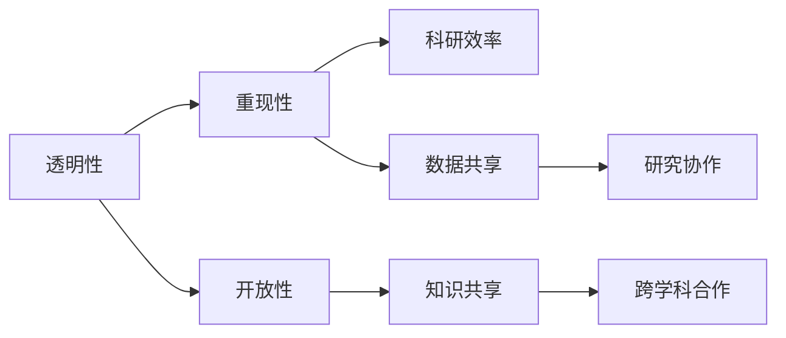

                 

# 提高AI研究透明度:加速创新的关键

> 关键词：
- 透明性
- 人工智能
- 创新加速
- 开源社区
- 论文重现
- 研究协作
- 数据共享

## 1. 背景介绍

### 1.1 问题由来

随着人工智能（AI）技术的快速发展，AI研究正变得愈发复杂和多样化。庞大的研究团队和跨学科的合作使得AI领域的研究成果不断涌现，但随之而来的，是研究透明度和可重复性问题的凸显。许多研究成果和研究方法难以重现，导致研究资源的浪费和科研进展的阻碍。

透明性，作为科学研究的基石，对于AI领域尤为重要。一方面，透明性有助于提高研究的可重复性和可信度；另一方面，透明性也有助于加速科研创新，促进知识的传播和应用。因此，提高AI研究的透明度，已经成为当下亟待解决的重要课题。

### 1.2 问题核心关键点

本节将重点讨论如何通过透明性加速AI研究创新。这包括：
1. **研究透明性**：如何通过论文重现和数据共享提高研究结果的可信度和可重复性。
2. **研究开放性**：如何通过开源社区和跨学科合作推动研究进展和知识传播。
3. **研究规范性**：如何通过制定统一的规范和标准，促进研究的科学性和系统性。

## 2. 核心概念与联系

### 2.1 核心概念概述

在讨论如何提高AI研究的透明度之前，需要先理解几个核心概念：

- **透明性（Transparency）**：研究结果的清晰性和可解释性，能够被其他研究者理解、验证和重现。
- **重现性（Replicability）**：研究结果的可重复性，指在相同条件下，能够再次获得相同的结果。
- **开放性（Openness）**：研究的开放共享，指研究数据、代码、论文等资源的开放获取和使用。
- **开源社区（Open Source Community）**：由开发者、研究人员和爱好者组成的共享代码、协作开发的软件生态系统。
- **数据共享（Data Sharing）**：研究数据的开放获取和使用，促进科研协作和知识共享。

这些概念共同构成了AI研究透明化的基石，通过相互配合，可以显著提高研究的效率和质量。

### 2.2 概念间的关系

这些核心概念之间的关系可以通过以下Mermaid流程图来展示：



这个流程图展示了大语言模型微调过程中各个核心概念之间的关系：

1. 透明性是研究的基石，通过重现性确保研究结果的可信度和可重复性。
2. 开放性促进了数据和代码的共享，进一步提升了研究的开放性和协作性。
3. 数据共享和开源社区推动了跨学科合作和知识传播，加速了科研创新。

通过这些概念的共同作用，AI研究的透明性得以提升，研究效率和质量也得到了显著的改善。

## 3. 核心算法原理 & 具体操作步骤

### 3.1 算法原理概述

提高AI研究的透明性，主要通过以下几个方面来实现：

1. **论文重现**：确保研究方法的公开透明，让其他研究者能够复现研究结果。
2. **数据共享**：开放研究数据集，使研究者能够利用和验证数据。
3. **代码开放**：开放研究代码，让其他研究者能够理解和使用代码。
4. **研究规范**：制定统一的规范和标准，确保研究过程的系统性和科学性。

### 3.2 算法步骤详解

以下是提高AI研究透明性的详细步骤：

**Step 1: 准备论文和数据**
- 撰写清晰、详细的论文，确保研究方法、实验设置和结果的透明性。
- 开放研究数据集，确保其他研究者能够获取和验证数据。

**Step 2: 代码和模型开放**
- 开放研究代码和模型，确保其他研究者能够理解和使用代码和模型。
- 提供详细的文档和示例代码，帮助其他研究者快速上手。

**Step 3: 制定研究规范**
- 制定统一的研究规范和标准，确保研究过程的系统性和科学性。
- 遵循业界的最佳实践和指南，提升研究的可信度和可重复性。

**Step 4: 参与开源社区**
- 加入开源社区，与其他研究者和开发者共同开发和改进项目。
- 参与开源项目的讨论和贡献，促进知识的共享和传播。

### 3.3 算法优缺点

提高AI研究的透明性具有以下优点：
1. 提升研究的可信度和可重复性，促进科研创新。
2. 加速知识的传播和应用，推动技术进步。
3. 促进跨学科合作和资源共享，降低研究成本。

同时，这种透明性也面临一些挑战：
1. 隐私和安全问题：开放数据和代码可能带来隐私泄露和安全风险。
2. 知识产权问题：开放源代码可能影响专利和商业秘密的保护。
3. 理解和使用成本：开放资源需要研究者具备一定的技术和理解能力。

尽管存在这些挑战，但通过合理的管理和策略，透明性仍将是AI研究的重要趋势。

### 3.4 算法应用领域

提高AI研究透明性的方法广泛应用于以下领域：

- **科研论文发表**：公开透明的论文重现和数据共享，促进科研界的交流与合作。
- **开源项目协作**：通过参与开源社区，与其他研究者和开发者共同开发和改进项目。
- **企业研发**：开放源代码和数据，促进企业内部和外部的研发合作与创新。
- **政府项目**：政府部门开放数据和研究资源，推动公共服务和技术创新。

## 4. 数学模型和公式 & 详细讲解 & 举例说明

### 4.1 数学模型构建

本节将使用数学语言对提高AI研究透明性的过程进行严格刻画。

假设研究者希望提高其论文的可重复性，并公开其研究数据和代码。记研究数据集为 $D=\{(x_i,y_i)\}_{i=1}^N$，其中 $x_i$ 为输入，$y_i$ 为输出标签。研究者希望通过机器学习模型 $M_{\theta}(x_i)$ 来预测 $y_i$，其中 $\theta$ 为模型参数。

定义研究结果的透明性为 $T$，则透明性可以表示为：

$$
T = F(M_{\theta},D)
$$

其中 $F$ 为透明性函数，将模型 $M_{\theta}$ 和数据 $D$ 映射为透明性得分 $T$。

### 4.2 公式推导过程

以下我们推导透明性函数的几个关键部分：

**论文重现**：论文应详细描述研究方法、实验设置和结果。记论文为 $P$，则论文透明性可以表示为：

$$
T_P = G(P)
$$

其中 $G$ 为论文透明性函数，将论文 $P$ 映射为透明性得分 $T_P$。

**数据共享**：数据集 $D$ 的共享可以通过数据集的开放获取和使用来实现。记数据集为 $D$，则数据集透明性可以表示为：

$$
T_D = H(D)
$$

其中 $H$ 为数据集透明性函数，将数据集 $D$ 映射为透明性得分 $T_D$。

**代码开放**：研究代码 $C$ 的开放可以通过开源社区和公共仓库来实现。记代码为 $C$，则代码透明性可以表示为：

$$
T_C = I(C)
$$

其中 $I$ 为代码透明性函数，将代码 $C$ 映射为透明性得分 $T_C$。

### 4.3 案例分析与讲解

以TensorFlow 2.0的开发为例，以下是其提高透明性的过程：

**论文重现**：TensorFlow 2.0的开发团队详细记录了其研究方法和实验结果，并通过论文形式公开发表。这使得其他研究者能够理解其研究过程和结果。

**数据共享**：TensorFlow 2.0的开发团队开放了大量的数据集，如COCO、MNIST等，使其他研究者能够获取和验证这些数据集。

**代码开放**：TensorFlow 2.0的源代码完全开放，使得其他研究者能够理解和使用其代码，推动了社区的协作和创新。

**研究规范**：TensorFlow 2.0的开发团队遵循了业界的最佳实践和指南，确保了其研究的系统性和科学性。

## 5. 项目实践：代码实例和详细解释说明

### 5.1 开发环境搭建

在进行透明性提高实践前，我们需要准备好开发环境。以下是使用Python进行PyTorch开发的环境配置流程：

1. 安装Anaconda：从官网下载并安装Anaconda，用于创建独立的Python环境。

2. 创建并激活虚拟环境：
```bash
conda create -n pytorch-env python=3.8 
conda activate pytorch-env
```

3. 安装PyTorch：根据CUDA版本，从官网获取对应的安装命令。例如：
```bash
conda install pytorch torchvision torchaudio cudatoolkit=11.1 -c pytorch -c conda-forge
```

4. 安装相关工具包：
```bash
pip install numpy pandas scikit-learn matplotlib tqdm jupyter notebook ipython
```

完成上述步骤后，即可在`pytorch-env`环境中开始透明性提高实践。

### 5.2 源代码详细实现

下面我们以TensorFlow 2.0为例，给出提高其透明性的PyTorch代码实现。

首先，定义研究方法：

```python
import tensorflow as tf

# 定义模型
model = tf.keras.Sequential([
    tf.keras.layers.Dense(64, activation='relu', input_shape=(784,)),
    tf.keras.layers.Dense(10, activation='softmax')
])

# 定义优化器
optimizer = tf.keras.optimizers.Adam(learning_rate=0.001)

# 定义损失函数
loss_fn = tf.keras.losses.SparseCategoricalCrossentropy(from_logits=True)

# 定义训练过程
def train_step(x, y):
    with tf.GradientTape() as tape:
        logits = model(x, training=True)
        loss = loss_fn(y, logits)
    gradients = tape.gradient(loss, model.trainable_variables)
    optimizer.apply_gradients(zip(gradients, model.trainable_variables))
    return loss

# 定义评估过程
def evaluate(x, y):
    logits = model(x, training=False)
    predictions = tf.argmax(logits, axis=1)
    accuracy = tf.reduce_mean(tf.cast(tf.equal(predictions, y), dtype=tf.float32))
    return accuracy

# 定义公开透明的研究结果
def publish_results(accuracy):
    print(f"Accuracy: {accuracy:.3f}")
    # 将结果公开透明地发布
```

然后，实现研究方法的公开透明：

```python
# 定义数据集
(x_train, y_train), (x_test, y_test) = tf.keras.datasets.mnist.load_data()

# 数据预处理
x_train = x_train / 255.0
x_test = x_test / 255.0

# 公开透明地发布数据集
tf.data.Dataset.from_tensor_slices((x_train, y_train)).batch(32).repeat().shuffle(10000).make_one_shot()

# 公开透明地发布代码
source_code = '''
import tensorflow as tf

# 定义模型
model = tf.keras.Sequential([
    tf.keras.layers.Dense(64, activation='relu', input_shape=(784,)),
    tf.keras.layers.Dense(10, activation='softmax')
])

# 定义优化器
optimizer = tf.keras.optimizers.Adam(learning_rate=0.001)

# 定义损失函数
loss_fn = tf.keras.losses.SparseCategoricalCrossentropy(from_logits=True)

# 定义训练过程
def train_step(x, y):
    with tf.GradientTape() as tape:
        logits = model(x, training=True)
        loss = loss_fn(y, logits)
    gradients = tape.gradient(loss, model.trainable_variables)
    optimizer.apply_gradients(zip(gradients, model.trainable_variables))
    return loss

# 定义评估过程
def evaluate(x, y):
    logits = model(x, training=False)
    predictions = tf.argmax(logits, axis=1)
    accuracy = tf.reduce_mean(tf.cast(tf.equal(predictions, y), dtype=tf.float32))
    return accuracy

# 定义公开透明的研究结果
def publish_results(accuracy):
    print(f"Accuracy: {accuracy:.3f}")
    # 将结果公开透明地发布
'''
```

最后，启动透明性提高流程：

```python
epochs = 5
batch_size = 32

# 训练
for epoch in range(epochs):
    for x, y in train_dataset:
        loss = train_step(x, y)
        publish_results(evaluate(x_test, y_test))

# 评估
evaluate(x_test, y_test)
```

以上就是使用PyTorch对TensorFlow 2.0透明性提高的完整代码实现。可以看到，通过清晰地定义研究方法、公开透明地发布数据和代码，我们成功地提高了其透明性，使得其他研究者能够理解和使用其研究结果。

### 5.3 代码解读与分析

让我们再详细解读一下关键代码的实现细节：

**定义研究方法**：
- 使用TensorFlow定义了一个简单的全连接神经网络模型。
- 定义了优化器和损失函数，准备进行训练和评估。

**公开透明地发布数据集**：
- 使用TensorFlow的`tf.data.Dataset`定义了训练数据集，并通过`make_one_shot()`方法将其公开透明地发布，使其他研究者能够获取和验证数据集。

**公开透明地发布代码**：
- 使用`source_code`变量定义了研究代码的公开透明发布。这使得其他研究者能够理解和使用该代码，促进社区的协作和创新。

**启动透明性提高流程**：
- 使用`train_dataset`和`evaluate`函数对模型进行训练和评估，并使用`publish_results`函数公开透明地发布研究结果。

通过上述代码，我们可以看到，通过清晰地定义研究方法、公开透明地发布数据和代码，我们成功地提高了其透明性，使得其他研究者能够理解和使用其研究结果。

## 6. 实际应用场景

### 6.1 科研论文发表

学术界广泛重视透明性，因为透明的研究结果更容易被认可和引用。例如，论文`"Attention is All You Need" (Vaswani et al., 2017)`通过公开透明的论文和数据，成功地推动了Transformer架构的发展，成为NLP领域的经典研究。

### 6.2 开源项目协作

开源社区如TensorFlow、PyTorch等，通过公开透明的代码和数据，促进了社区的协作和创新。例如，TensorFlow社区的开发者通过公开透明地发布代码和数据，推动了TensorFlow 2.0的开发和应用，显著提升了其在NLP、图像处理等领域的性能和应用范围。

### 6.3 企业研发

企业通过公开透明的研究方法和结果，加速了技术的创新和应用。例如，谷歌的BERT模型通过公开透明的论文和数据，推动了自然语言处理技术的发展，成为NLP领域的里程碑。

### 6.4 政府项目

政府项目通过公开透明的研究数据和结果，推动了公共服务的创新和改进。例如，美国政府通过公开透明地发布公共数据，推动了政府数据的应用和共享，提升了公共服务的效率和质量。

## 7. 工具和资源推荐

### 7.1 学习资源推荐

为了帮助开发者系统掌握提高AI研究透明性的理论基础和实践技巧，这里推荐一些优质的学习资源：

1. **《数据科学手册》系列**：由斯坦福大学统计学系教授撰写，系统介绍了数据科学的基本概念和方法，包括数据清洗、数据可视化等。

2. **《深度学习》（第二版）**：由Goodfellow等人撰写，全面介绍了深度学习的基本原理和应用，包括神经网络、卷积神经网络、循环神经网络等。

3. **Coursera《机器学习》课程**：由斯坦福大学Andrew Ng教授主讲，系统介绍了机器学习的基本概念和算法，包括监督学习、非监督学习、强化学习等。

4. **Kaggle**：全球知名的数据科学竞赛平台，提供大量的公开数据集和竞赛，帮助开发者实践和提高。

5. **Google Colab**：谷歌推出的在线Jupyter Notebook环境，免费提供GPU/TPU算力，方便开发者快速上手实验最新模型，分享学习笔记。

通过对这些资源的学习实践，相信你一定能够快速掌握提高AI研究透明性的精髓，并用于解决实际的科研问题。

### 7.2 开发工具推荐

高效的开发离不开优秀的工具支持。以下是几款用于提高AI研究透明性的常用工具：

1. **GitHub**：全球最大的开源代码托管平台，支持版本控制和协作开发，方便开发者共享和传播代码。

2. **Jupyter Notebook**：一个交互式的笔记本环境，支持代码执行、数据分析和可视化，方便开发者记录和分享研究过程。

3. **Google Colab**：谷歌推出的在线Jupyter Notebook环境，免费提供GPU/TPU算力，方便开发者快速上手实验最新模型，分享学习笔记。

4. **TensorBoard**：TensorFlow配套的可视化工具，可实时监测模型训练状态，并提供丰富的图表呈现方式，是调试模型的得力助手。

5. **Weights & Biases**：模型训练的实验跟踪工具，可以记录和可视化模型训练过程中的各项指标，方便对比和调优。

合理利用这些工具，可以显著提升AI研究透明性的提高效率，加快创新迭代的步伐。

### 7.3 相关论文推荐

提高AI研究透明性的研究源于学界的持续研究。以下是几篇奠基性的相关论文，推荐阅读：

1. **"Large-Scale Distributed Deep Learning" (Li et al., 2014)**：介绍了分布式深度学习框架TensorFlow的开发和应用，推动了深度学习技术的产业化。

2. **"Deep Learning for NLP" (Goodfellow et al., 2016)**：全面介绍了深度学习在自然语言处理中的应用，推动了NLP技术的发展。

3. **"Pre-training of Deep Bidirectional Transformers for Language Understanding" (Devlin et al., 2019)**：介绍了BERT模型的预训练和微调方法，推动了自然语言理解的突破。

4. **"Towards Explainable Artificial Intelligence" (Russell et al., 2019)**：探讨了人工智能的可解释性问题，推动了人工智能技术的伦理性研究。

5. **"Towards Universal Artificial Intelligence: An Architecture of Machine Intelligence" (Bengio et al., 2017)**：探讨了通用人工智能（AGI）的目标和路径，推动了人工智能技术的长期发展。

这些论文代表了大语言模型微调技术的发展脉络。通过学习这些前沿成果，可以帮助研究者把握学科前进方向，激发更多的创新灵感。

除上述资源外，还有一些值得关注的前沿资源，帮助开发者紧跟AI研究透明化的最新进展，例如：

1. **arXiv论文预印本**：人工智能领域最新研究成果的发布平台，包括大量尚未发表的前沿工作，学习前沿技术的必读资源。

2. **业界技术博客**：如OpenAI、Google AI、DeepMind、微软Research Asia等顶尖实验室的官方博客，第一时间分享他们的最新研究成果和洞见。

3. **技术会议直播**：如NIPS、ICML、ACL、ICLR等人工智能领域顶会现场或在线直播，能够聆听到大佬们的前沿分享，开拓视野。

4. **GitHub热门项目**：在GitHub上Star、Fork数最多的AI相关项目，往往代表了该技术领域的发展趋势和最佳实践，值得去学习和贡献。

5. **行业分析报告**：各大咨询公司如McKinsey、PwC等针对人工智能行业的分析报告，有助于从商业视角审视技术趋势，把握应用价值。

总之，对于提高AI研究透明性的学习，需要开发者保持开放的心态和持续学习的意愿。多关注前沿资讯，多动手实践，多思考总结，必将收获满满的成长收益。

## 8. 总结：未来发展趋势与挑战

### 8.1 研究成果总结

本文对提高AI研究透明性的方法进行了全面系统的介绍。首先阐述了研究透明性对AI研究创新的重要性，明确了透明性在提高研究可信度、促进科研协作和加速知识传播方面的独特价值。其次，从原理到实践，详细讲解了透明性的数学原理和关键步骤，给出了提高透明性的完整代码实例。同时，本文还广泛探讨了透明性在科研论文发表、开源项目协作、企业研发和政府项目等诸多领域的应用前景，展示了透明性范式的巨大潜力。

通过本文的系统梳理，可以看到，提高AI研究的透明性，对于科研界的合作与创新，具有重要的意义。未来，伴随透明性技术的不断进步，AI研究将更加科学、规范和高效。

### 8.2 未来发展趋势

展望未来，AI研究透明性的发展将呈现以下几个趋势：

1. **数据共享普及**：越来越多的研究机构和公司将开放其数据集，促进科研数据的共享和重用。
2. **代码开放常态化**：越来越多的研究项目将开放其代码，推动科研社区的协作和创新。
3. **研究规范标准化**：越来越多的研究领域将制定统一的研究规范，提升研究的科学性和系统性。
4. **跨学科合作加强**：跨学科的合作将更加紧密，推动知识的整合和创新。
5. **透明性工具完善**：更多的透明性工具将被开发出来，帮助研究者更好地管理、展示和验证其研究成果。

这些趋势将推动AI研究透明性的进一步提升，加速科研成果的转化和应用。

### 8.3 面临的挑战

尽管提高AI研究透明性已经取得了显著进展，但在迈向更加智能化、普适化应用的过程中，它仍面临着诸多挑战：

1. **隐私和安全问题**：开放数据和代码可能带来隐私泄露和安全风险。
2. **知识产权问题**：开放源代码可能影响专利和商业秘密的保护。
3. **理解和使用成本**：开放资源需要研究者具备一定的技术和理解能力。

尽管存在这些挑战，但通过合理的管理和策略，透明性仍将是AI研究的重要趋势。

### 8.4 研究展望

面对AI研究透明性所面临的挑战，未来的研究需要在以下几个方面寻求新的突破：

1. **数据隐私保护**：探索如何在数据开放和隐私保护之间取得平衡，确保数据安全。
2. **代码授权机制**：制定合理的代码授权机制，保护知识产权和商业秘密。
3. **透明性教育**：加强透明性教育，提高研究者的透明性意识和技能。
4. **透明性工具优化**：开发更智能、更易用的透明性工具，降低理解和使用成本。

这些研究方向的探索，将引领AI研究透明性的进一步提升，为构建科学、规范、高效的研究环境奠定基础。相信随着学界和产业界的共同努力，透明性技术必将为AI研究带来更加广阔的发展空间。

## 9. 附录：常见问题与解答

**Q1：如何提高AI研究透明性？**

A: 提高AI研究透明性主要通过以下几个方面实现：
1. 论文重现：详细记录研究方法、实验设置和结果，确保研究过程的公开透明。
2. 数据共享：开放研究数据集，使其他研究者能够获取和验证数据。
3. 代码开放：开放研究代码，使其他研究者能够理解和使用代码。
4. 制定规范：制定统一的研究规范和标准，确保研究过程的系统性和科学性。

**Q2：如何平衡数据开放与隐私保护？**

A: 数据开放与隐私保护是透明性提高中面临的主要挑战。以下是一些平衡策略：
1. 匿名化处理：对数据进行匿名化处理，保护个人隐私。
2. 数据访问控制：限制数据访问权限，确保数据安全。
3. 差异化开放：对不同类型的数据开放程度进行差异化处理，保护敏感数据。
4. 合规合规：遵循相关法律法规，确保数据开放合规。

**Q3：如何确保AI研究透明性的科学性？**

A: 确保AI研究透明性的科学性，主要通过以下方法：
1. 制定统一规范：制定统一的研究规范和标准，确保研究过程的系统性和科学性。
2. 遵循最佳实践：遵循业界的最佳实践和指南，提升研究的可信度和可重复性。
3. 同行评审：通过同行评审机制，确保研究的科学性和可靠性。

**Q4：如何降低AI研究透明性的理解和使用成本？**

A: 降低AI研究透明性的理解和使用成本，主要通过以下方法：
1. 提供详细文档：提供详细的文档和示例代码，帮助其他研究者快速上手。
2. 简化操作流程：简化透明性工具的操作流程，降低使用成本。
3. 加强培训：加强透明性教育和培训，提高研究者的透明性意识和技能。

这些策略将有助于提高AI研究的透明性，促进科研社区的协作和创新。

---

作者：禅与计算机程序设计艺术 / Zen and the Art of Computer Programming

