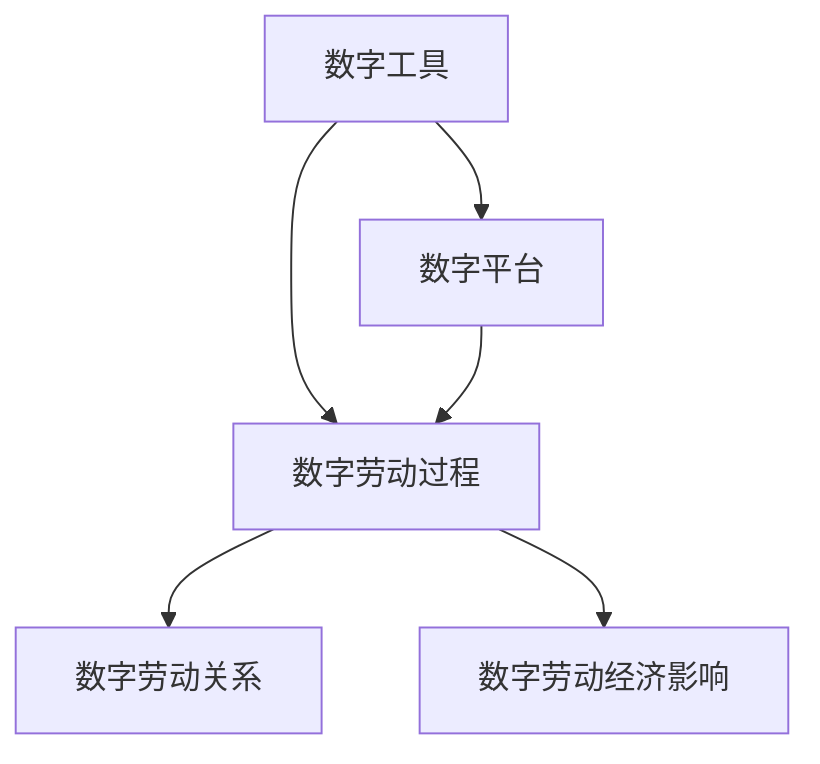

                 

## 1. 背景介绍

随着信息技术的发展，数字劳动已成为现代生产力的重要组成部分。数字劳动（Digital Labor）指的是通过数字化工具和平台进行的信息加工和知识创造活动。这种劳动形式涵盖从软件开发、数据分析、网络运营到内容创作等多个领域，成为推动经济和社会进步的关键力量。然而，数字劳动的社会和经济影响复杂而深远，值得深入探讨。本文将从多个角度分析数字劳动的特点、影响及应对策略，以期为相关研究提供新的视角。

### 1.1 数字劳动的兴起与发展

数字劳动的兴起与互联网技术的普及密不可分。随着个人电脑、智能手机、云计算等技术的普及，越来越多的工作岗位被数字化工具和平台所取代。尤其是移动互联网的兴起，使得数字劳动更加无处不在。从社交媒体运营、在线教育、电子商务到数字内容创作，数字劳动已经成为现代社会不可或缺的一部分。

数字劳动的兴起，不仅改变了传统的生产模式和就业结构，还对社会经济产生了深远影响。一方面，数字劳动提高了生产效率和劳动生产力，促进了经济增长；另一方面，数字劳动也对劳动关系、收入分配、就业安全等方面带来了新的挑战。

### 1.2 数字劳动的主要类型

数字劳动可以分为以下几种主要类型：

1. **软件开发与维护**：包括软件编码、测试、维护等。这些工作通常涉及复杂的算法和系统设计，需要较高的技术水平。
2. **数据分析与处理**：涉及数据收集、清洗、分析和可视化，是现代企业决策的重要支撑。
3. **内容创作**：包括博客写作、视频制作、音乐创作等，这些内容通过数字化平台广泛传播，具有较高的社会影响力。
4. **网络运营与维护**：包括网站管理、SEO优化、社交媒体运营等，这些工作需要较高的互联网技术和管理能力。
5. **数字客服与支持**：通过智能客服、在线咨询等方式为消费者提供服务，是现代服务业的重要组成部分。

这些不同类型的数字劳动，涵盖了从技术开发到内容创作，从数据分析到客户服务等多个领域，形成了庞大的数字劳动市场。

## 2. 核心概念与联系

### 2.1 核心概念概述

数字劳动涉及多个关键概念，包括数字工具、平台、劳动过程、劳动关系和经济影响等。为了更好地理解这些概念，我们首先对每个概念进行定义，并说明它们之间的联系。

- **数字工具**：指的是进行数字劳动所需的计算机软硬件设备，如个人电脑、智能手机、云服务器等。
- **数字平台**：是指提供数字化劳动服务和产品的在线平台，如软件开发平台、社交媒体、电商平台等。
- **数字劳动过程**：是指通过数字化工具和平台进行的劳动活动，如软件开发、数据分析、内容创作等。
- **数字劳动关系**：指数字劳动过程中产生的劳动关系，包括雇佣关系、合作关系等。
- **数字劳动经济影响**：指数字劳动对经济结构、就业市场、收入分配等方面的影响。

这些概念之间存在紧密的联系，共同构成了数字劳动的社会经济体系。通过数字化工具和平台，数字劳动得以实现，并进一步影响了劳动关系和经济结构。

### 2.2 概念间的关系

数字劳动的概念间关系可以通过以下Mermaid流程图来展示：



这个流程图展示了数字劳动的主要组成元素及其关系：

1. 数字工具和平台为数字劳动提供了技术基础和操作平台。
2. 数字劳动过程是通过这些工具和平台实现的实际劳动活动。
3. 数字劳动关系是在数字劳动过程中产生的劳动关系，如雇主与雇员、合作伙伴等。
4. 数字劳动经济影响是通过数字劳动关系和过程，对经济结构、就业市场、收入分配等方面产生的影响。

这些概念共同构成了数字劳动的社会经济体系，对社会各层面产生了广泛而深远的影响。

## 3. 核心算法原理 & 具体操作步骤

### 3.1 算法原理概述

数字劳动的计算过程可以通过算法进行优化和自动化。算法的核心目标是提高劳动生产率和效率，同时确保劳动过程的公平性和透明性。常见的数字劳动算法包括任务调度、数据处理、内容推荐等。

以内容推荐为例，算法通过分析用户行为和偏好，将内容与用户匹配，提高内容消费的个性化和满意度。具体来说，算法首先对用户行为数据进行分析，构建用户兴趣模型；然后根据模型预测用户可能感兴趣的内容，并进行推荐。

### 3.2 算法步骤详解

以内容推荐算法为例，其详细步骤包括：

1. **数据收集**：收集用户的历史行为数据，如浏览记录、搜索记录、评价记录等。
2. **数据预处理**：对收集到的数据进行清洗、去重、归一化等预处理操作。
3. **特征提取**：将预处理后的数据转化为算法能够理解的特征向量，如TF-IDF、词向量等。
4. **模型训练**：使用机器学习或深度学习模型对特征向量进行训练，构建用户兴趣模型。
5. **内容推荐**：根据用户模型对用户可能感兴趣的内容进行推荐。

这些步骤构成了内容推荐算法的基本流程，但实际应用中还需考虑数据隐私、推荐多样性、用户满意度等复杂问题。

### 3.3 算法优缺点

数字劳动算法的优点包括：

- **提高效率**：通过自动化和优化，算法能够显著提高劳动生产率和效率，降低人力成本。
- **个性化服务**：算法能够根据用户行为和偏好进行个性化推荐，提升用户体验。
- **数据驱动**：算法能够基于大量数据进行分析和决策，减少主观偏见。

但算法也存在一些缺点：

- **数据隐私**：在数据收集和处理过程中，可能侵犯用户隐私，引发法律和道德问题。
- **算法偏见**：算法可能会因为训练数据的不足或偏差，产生不公平或歧视性的推荐结果。
- **复杂性**：数字劳动算法往往涉及复杂的数学和编程，需要高水平的技术人才。

### 3.4 算法应用领域

数字劳动算法在多个领域都有广泛应用，包括：

1. **电子商务**：通过推荐算法提升用户购买转化率，优化库存管理。
2. **社交媒体**：根据用户兴趣推荐内容，提高用户活跃度和留存率。
3. **在线教育**：根据用户学习行为推荐课程，提高学习效果。
4. **金融服务**：通过分析用户交易行为推荐金融产品，提升用户体验。
5. **医疗健康**：根据患者病历和医疗数据推荐诊疗方案，提高医疗服务质量。

## 4. 数学模型和公式 & 详细讲解 & 举例说明

### 4.1 数学模型构建

数字劳动中的推荐算法可以通过协同过滤、基于内容的推荐、混合推荐等多种模型实现。以协同过滤为例，推荐系统可以构建用户-物品评分矩阵，利用用户历史评分数据和物品相似度进行推荐。

设用户集为 $U$，物品集为 $I$，用户对物品的评分矩阵为 $R_{UI}$，物品向量为 $V_I$，用户向量为 $V_U$。推荐算法的目标是通过最大化用户和物品的相似度得分，进行推荐。

### 4.2 公式推导过程

协同过滤算法的目标是最大化用户 $u$ 对物品 $i$ 的评分：

$$
\max_{R_{UI}, V_I, V_U} \sum_{i\in I} \sum_{u\in U} R_{UI} \cdot (V_I^T V_U)
$$

其中，$V_I^T V_U$ 表示物品和用户之间的相似度得分。

通过最大化相似度得分，推荐算法能够找到与用户 $u$ 兴趣相似的物品，进行推荐。

### 4.3 案例分析与讲解

假设有一个在线电影推荐系统，用户 $u$ 对电影 $i$ 的评分数据如表所示：

| User | Movie | Rating |
| ---- | ----- | ------ |
| A    | A1    | 4      |
| A    | A2    | 3      |
| A    | A3    | 5      |
| B    | B1    | 2      |
| B    | B2    | 1      |
| B    | B3    | 5      |

假设物品向量 $V_I$ 为 $(1,0,0)^T$，用户向量 $V_U$ 为 $(0.8,0.1,0.1)^T$，则物品和用户之间的相似度得分为 $V_I^T V_U = 0.8 \times 1 + 0.1 \times 0 + 0.1 \times 0 = 0.9$。

基于协同过滤算法，系统可以推荐与用户 $A$ 兴趣相似的电影，如 $A1$、$A2$、$A3$ 和 $B1$、$B2$、$B3$，从而提升用户的观影体验。

## 5. 项目实践：代码实例和详细解释说明

### 5.1 开发环境搭建

为了进行数字劳动算法实践，需要搭建一个包含计算资源和开发环境的平台。以下是搭建开发环境的步骤：

1. **硬件准备**：准备好高性能的个人电脑或云服务器，配置足够的CPU、内存和存储资源。
2. **软件安装**：安装Python、R等编程语言，安装相应的机器学习和深度学习库，如TensorFlow、PyTorch、Scikit-Learn等。
3. **工具配置**：配置好IDE（如Jupyter Notebook、PyCharm）和版本控制系统（如Git、SVN），方便代码管理和版本控制。
4. **数据准备**：准备好所需的数据集，如用户行为数据、物品属性数据等，并进行预处理和清洗。

### 5.2 源代码详细实现

以下是一个简单的基于协同过滤的推荐系统代码实现，使用Python和Scikit-Learn库：

```python
import numpy as np
from sklearn.neighbors import NearestNeighbors
from sklearn.metrics.pairwise import cosine_similarity

# 构建用户-物品评分矩阵
R = np.array([
    [4, 3, 5],
    [2, 1, 5]
])

# 构建物品向量
V_I = np.array([1, 0, 0])

# 构建用户向量
V_U = np.array([0.8, 0.1, 0.1])

# 计算物品和用户之间的相似度得分
score = V_I.dot(V_U)

# 获取用户评分较高的物品
index = np.argsort(R, axis=0)[-1]
recommendations = index[index < 3]

print("推荐结果为：", recommendations)
```

### 5.3 代码解读与分析

上述代码实现了基于协同过滤的推荐系统。其核心步骤包括：

1. **构建用户-物品评分矩阵**：将用户对物品的评分数据转化为矩阵形式，方便后续计算。
2. **构建物品向量和用户向量**：通过计算物品向量和用户向量的内积，得到物品和用户之间的相似度得分。
3. **计算推荐结果**：根据相似度得分，选择用户评分较高的物品进行推荐。

## 6. 实际应用场景

### 6.1 电子商务

数字劳动算法在电子商务中的应用非常广泛。电商平台通过推荐算法，能够提升用户购物体验，提高商品转化率。推荐算法可以根据用户浏览和购买历史，推荐相关商品，增加用户复购率。

### 6.2 社交媒体

社交媒体平台通过推荐算法，能够提高用户活跃度和留存率。推荐算法可以根据用户互动数据，推荐用户感兴趣的内容，增加用户粘性。

### 6.3 在线教育

在线教育平台通过推荐算法，能够提高课程推荐准确性，提升用户学习效果。推荐算法可以根据用户学习行为和历史评分数据，推荐相关课程，提高用户满意度。

### 6.4 金融服务

金融服务行业通过推荐算法，能够优化投资组合，提高用户投资收益。推荐算法可以根据用户交易数据，推荐相关金融产品，提升用户忠诚度。

## 7. 工具和资源推荐

### 7.1 学习资源推荐

为了深入学习数字劳动算法，以下是一些推荐的学习资源：

1. **Coursera《机器学习》课程**：由斯坦福大学Andrew Ng教授主讲的机器学习课程，涵盖机器学习基础和推荐算法。
2. **Kaggle数据科学竞赛平台**：提供大量数据集和竞赛任务，是学习推荐算法的实践平台。
3. **《推荐系统实践》书籍**：详细介绍推荐算法的基本原理和实现方法，是推荐算法学习的经典参考书。
4. **ArXiv论文预印本**：人工智能领域最新研究成果的发布平台，包含大量推荐算法的前沿论文。

### 7.2 开发工具推荐

数字劳动算法的开发离不开高性能计算和强大的编程工具。以下是一些推荐的开发工具：

1. **TensorFlow**：由Google开发的高性能深度学习框架，支持大规模分布式计算。
2. **PyTorch**：Facebook开发的深度学习框架，具有灵活性和易用性。
3. **Scikit-Learn**：Python科学计算库，提供丰富的机器学习算法实现。
4. **Jupyter Notebook**：用于编写和运行Python代码的交互式开发环境。

### 7.3 相关论文推荐

数字劳动算法涉及多个研究领域，以下是一些推荐的经典论文：

1. **《推荐系统》论文**：由Koren和Heckerman等人发表，详细介绍推荐算法的基本原理和实现方法。
2. **《协同过滤推荐算法》论文**：由Sarwar等人发表，介绍协同过滤推荐算法的原理和应用。
3. **《深度学习在推荐系统中的应用》论文**：由Bengio等人发表，探讨深度学习在推荐算法中的应用。

## 8. 总结：未来发展趋势与挑战

### 8.1 研究成果总结

数字劳动算法的研究已经取得了丰硕的成果，涵盖推荐系统、内容推荐、情感分析等多个领域。这些算法通过自动化和优化，显著提高了劳动生产率和效率，推动了数字经济的发展。

### 8.2 未来发展趋势

数字劳动算法的未来发展趋势包括：

1. **个性化推荐**：通过深度学习和自然语言处理技术，提升推荐算法的个性化和准确性。
2. **跨领域应用**：将推荐算法应用于更多领域，如医疗、金融、旅游等，推动跨领域应用的发展。
3. **实时推荐**：通过实时数据分析和计算，实现即时推荐，提高用户满意度和体验。
4. **多模态融合**：结合文本、图像、视频等多模态数据，实现更全面的推荐服务。
5. **联邦学习**：通过联邦学习技术，保护用户隐私的同时，提高推荐算法的效率和准确性。

### 8.3 面临的挑战

数字劳动算法虽然取得了不少进展，但也面临一些挑战：

1. **数据隐私**：在数据收集和处理过程中，可能侵犯用户隐私，引发法律和道德问题。
2. **算法偏见**：算法可能会因为训练数据的不足或偏差，产生不公平或歧视性的推荐结果。
3. **计算资源**：推荐算法需要大量的计算资源和存储空间，对硬件和网络带宽要求较高。
4. **模型复杂性**：推荐算法的模型设计复杂，需要高水平的技术人才。

### 8.4 研究展望

未来的研究可以从以下几个方向寻求新的突破：

1. **隐私保护技术**：研发隐私保护算法，确保数据收集和处理过程中用户的隐私安全。
2. **公平性和透明度**：引入公平性和透明性评估指标，确保算法推荐的公平性和可解释性。
3. **联邦学习和分布式计算**：结合联邦学习和分布式计算技术，提升算法的效率和公平性。
4. **多模态融合与知识图谱**：结合多模态数据和知识图谱，提升推荐算法的全面性和准确性。

总之，数字劳动算法的研究和应用正处于快速发展阶段。通过不断探索和创新，数字劳动算法必将在未来成为推动社会经济发展的关键力量。

## 9. 附录：常见问题与解答

**Q1：数字劳动算法的核心是什么？**

A: 数字劳动算法的核心是自动化和优化，通过算法实现劳动过程的自动化，提高劳动生产率和效率。

**Q2：数字劳动算法有哪些类型？**

A: 数字劳动算法包括协同过滤、基于内容的推荐、混合推荐等多种类型。

**Q3：数字劳动算法面临哪些挑战？**

A: 数字劳动算法面临数据隐私、算法偏见、计算资源、模型复杂性等挑战。

**Q4：数字劳动算法有哪些应用场景？**

A: 数字劳动算法在电子商务、社交媒体、在线教育、金融服务等多个领域有广泛应用。

**Q5：数字劳动算法未来的发展方向是什么？**

A: 数字劳动算法未来的发展方向包括个性化推荐、跨领域应用、实时推荐、多模态融合与联邦学习。

作者：禅与计算机程序设计艺术 / Zen and the Art of Computer Programming

