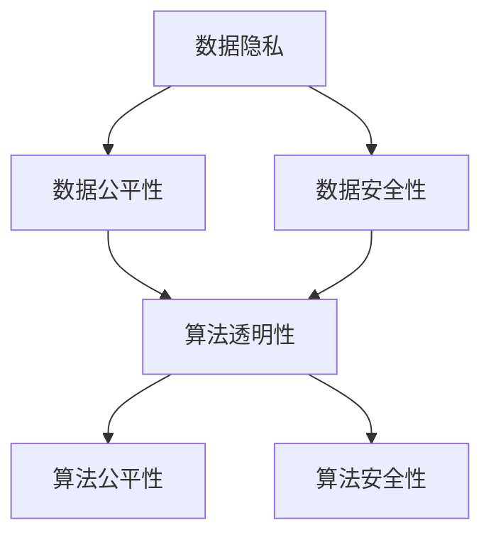

                 

## 1. 背景介绍

### 1.1 问题由来
数据伦理，即在数据采集、存储、处理、应用等过程中应遵守的伦理规范。随着大数据和人工智能技术的发展，数据及其衍生产品的应用范围日益扩大，数据伦理问题也随之凸显。数据伦理涉及数据隐私、公平性、安全性等方面，对人工智能的可持续发展和公共信任有着重要影响。

### 1.2 问题核心关键点
数据伦理的核心在于如何平衡数据利用与数据保护之间的关系，确保数据的采集和应用符合伦理规范，维护个人隐私和数据安全。其中，算法治理与规范是数据伦理的重要组成部分，涉及算法的透明性、公平性、安全性等内容。

### 1.3 问题研究意义
研究数据伦理中的算法治理与规范，有助于提升人工智能系统的道德水平，保障数据隐私和安全，促进社会公平和信任，推动人工智能技术健康发展。

## 2. 核心概念与联系

### 2.1 核心概念概述

数据伦理涉及以下几个关键概念：

- 数据隐私：指个人或组织数据的保密性、完整性、可用性等受到的保护。
- 数据公平性：指算法在处理数据时应避免歧视、偏见，确保不同群体之间获得公平待遇。
- 数据安全性：指数据在存储、传输和处理过程中不被未授权访问、篡改或破坏。
- 算法透明性：指算法的决策过程、逻辑和参数应是可解释和可理解的，避免"黑箱"操作。
- 算法公平性：指算法在处理数据时应保证输出结果不偏向任何特定群体，不产生歧视。
- 算法安全性：指算法在处理数据时应避免被恶意攻击或利用的风险。

这些概念之间存在着紧密的联系，共同构成数据伦理的核心框架。

### 2.2 概念间的关系

这些核心概念之间的关系可以通过以下Mermaid流程图来展示：



这个流程图展示了一组关键数据伦理概念及其相互关系：

- 数据隐私是数据公平性和安全性的基础，保证了数据使用的合法性。
- 数据公平性是算法的公平性的前提，确保算法的输出不偏向任何群体。
- 数据安全性保障了算法的安全性，防止数据被恶意攻击和利用。
- 算法透明性是数据公平性和安全性的保障，使得算法可以接受监督和审查。
- 算法公平性是算法透明性的重要目标，防止算法决策的歧视性。
- 算法安全性是数据安全性的延伸，确保算法的可靠性和抗攻击性。

通过理解这些核心概念及其相互关系，我们可以更好地把握数据伦理的核心要义，为后续深入讨论提供坚实基础。

## 3. 核心算法原理 & 具体操作步骤
### 3.1 算法原理概述

数据伦理中的算法治理与规范，核心在于确保算法在处理数据时符合伦理规范，实现算法的透明性、公平性和安全性。基于此，以下介绍几个核心算法的原理：

- **算法透明性**：通过可解释性模型（如决策树、规则集）或可解释性工具（如LIME、SHAP），使得算法的决策过程和逻辑可解释和可理解。
- **算法公平性**：通过数据增强、样本重采样、正则化等技术，防止算法在处理数据时产生偏见，确保不同群体的公平待遇。
- **算法安全性**：通过对抗训练、鲁棒性增强等技术，确保算法在面对恶意攻击和噪声数据时依然稳定可靠。

### 3.2 算法步骤详解

基于算法透明性、公平性和安全性的要求，以下详细介绍几个核心算法的详细步骤：

#### 3.2.1 算法透明性

**详细步骤**：

1. **选择合适的算法**：
   - 使用可解释性算法，如决策树、逻辑回归、规则集等。
   - 使用可解释性工具，如LIME、SHAP等。

2. **数据预处理**：
   - 清洗和标准化数据，去除异常值和噪声。
   - 特征选择和降维，简化模型输入。

3. **模型训练与评估**：
   - 使用交叉验证和测试集，评估模型性能。
   - 记录和分析模型在各数据集上的表现，找出模型决策的特征和逻辑。

4. **解释模型**：
   - 使用LIME生成局部模型解释，分析模型对单个样本的决策过程。
   - 使用SHAP生成全局模型解释，分析模型对整体数据集的决策贡献。

5. **输出解释**：
   - 将模型解释输出为可视化报告，展示模型决策的关键特征和逻辑。
   - 与业务方沟通，确保模型解释能够被理解和接受。

#### 3.2.2 算法公平性

**详细步骤**：

1. **数据集划分**：
   - 将数据集划分为训练集和测试集。
   - 在训练集中添加平衡标签或重采样技术，确保不同群体的样本数量平衡。

2. **模型训练**：
   - 在训练集中使用样本重采样技术，如欠采样和过采样。
   - 在模型训练中加入正则化技术，防止模型对特定特征过度依赖。

3. **评估公平性**：
   - 使用公平性评估指标，如均方误差、精度、召回率等。
   - 使用公平性测试集，评估模型在不同群体上的表现。

4. **调整模型**：
   - 根据公平性评估结果，调整模型参数或重新训练模型。
   - 确保模型在不同群体上的性能差异最小化。

5. **监控和维护**：
   - 在模型部署后，持续监控模型性能和公平性指标。
   - 定期重训模型，防止模型漂移和偏见累积。

#### 3.2.3 算法安全性

**详细步骤**：

1. **对抗训练**：
   - 生成对抗样本，训练模型对对抗样本的鲁棒性。
   - 在测试集上评估模型的鲁棒性，找出易受攻击的特征。

2. **鲁棒性增强**：
   - 在模型中引入鲁棒性增强技术，如梯度裁剪、权重裁剪、模型蒸馏等。
   - 在训练过程中加入噪声数据，提高模型的鲁棒性。

3. **安全评估**：
   - 使用安全评估工具，如Adversarial Robustness Toolbox (ART)等。
   - 评估模型的鲁棒性和安全性，找出易受攻击的薄弱环节。

4. **防御措施**：
   - 根据安全评估结果，采用防御措施，如模型蒸馏、数据扰动等。
   - 定期更新模型，防止新攻击技术的出现。

### 3.3 算法优缺点

**算法透明性**：

**优点**：
- 提高算法的可信度和透明度，增加用户信任。
- 便于发现和修正模型中的错误和偏差。

**缺点**：
- 可解释性算法和工具可能存在解释误差，无法完全消除模型的复杂性和不确定性。
- 解释模型可能增加模型的计算成本和复杂度。

**算法公平性**：

**优点**：
- 防止模型对特定群体产生偏见，确保数据处理的公平性。
- 提高模型对多样性数据的适应能力。

**缺点**：
- 公平性调整可能影响模型性能，需要在性能和公平性之间进行权衡。
- 公平性评估可能受到数据偏差的影响，导致结果失真。

**算法安全性**：

**优点**：
- 提高模型对恶意攻击和噪声数据的鲁棒性，增强模型的安全性。
- 增强模型的稳定性和可靠性，降低系统风险。

**缺点**：
- 对抗训练和鲁棒性增强可能增加模型的复杂度和计算成本。
- 安全评估和防御措施可能增加模型的部署难度和维护成本。

### 3.4 算法应用领域

算法透明性、公平性和安全性在大数据和人工智能的各个应用领域都有着广泛的应用，例如：

- **金融风控**：在金融风控模型中，算法透明性、公平性和安全性尤为重要。通过可解释性模型和工具，可以确保模型决策的透明性和可理解性，防止模型偏见，增强模型的鲁棒性。
- **医疗诊断**：在医疗诊断模型中，算法透明性、公平性和安全性有助于提高模型可信度和安全性，防止误诊和过度诊断，保护患者隐私。
- **推荐系统**：在推荐系统中，算法公平性和安全性可以防止系统对特定群体的歧视，确保推荐结果的多样性和公平性，增强用户信任。
- **自然语言处理**：在自然语言处理任务中，算法透明性和公平性可以防止模型对特定语种的偏见，增强模型的可解释性和公平性。
- **智能交通**：在智能交通系统中，算法透明性、公平性和安全性可以确保模型的可靠性和安全性，防止系统偏见，保障交通安全和公平性。

## 4. 数学模型和公式 & 详细讲解  
### 4.1 数学模型构建

以下以算法透明性为例，展示数据伦理中算法治理与规范的数学模型构建：

设一个二分类问题，模型 $M$ 的输出为 $\hat{y} \in [0,1]$，真实标签 $y \in \{0,1\}$。

**输入特征**：$x \in \mathcal{X}$，其中 $\mathcal{X}$ 为特征空间。

**损失函数**：交叉熵损失函数 $\ell(y,\hat{y})=-[y\log\hat{y}+(1-y)\log(1-\hat{y})]$。

**训练集**：$D=\{(x_i,y_i)\}_{i=1}^N$，其中 $x_i \in \mathcal{X}$，$y_i \in \{0,1\}$。

**模型参数**：$\theta \in \mathbb{R}^d$，其中 $d$ 为模型参数空间维度。

**优化目标**：最小化经验风险，即找到最优参数 $\theta^*$：

$$
\theta^* = \mathop{\arg\min}_{\theta} \mathcal{L}(\theta) = \mathop{\arg\min}_{\theta} \frac{1}{N}\sum_{i=1}^N \ell(y_i,M(x_i))
$$

**可解释性模型**：如决策树、逻辑回归等，通过解释模型，可以理解模型的决策过程和特征重要性。

**可解释性工具**：如LIME、SHAP等，通过生成局部模型解释和全局模型解释，可以分析模型对单个样本和整体数据的决策贡献。

### 4.2 公式推导过程

以下以决策树为例，推导算法的透明性公式。

设决策树模型 $M$ 的决策规则为：

$$
M(x) = \begin{cases}
1, & \text{if } x_1 < 0.5 \\
0, & \text{otherwise}
\end{cases}
$$

**交叉熵损失函数**：

$$
\ell(y,\hat{y})=-[y\log\hat{y}+(1-y)\log(1-\hat{y})]
$$

**样本损失**：

$$
\ell(y_i,M(x_i))=-[y_i\log\hat{y_i}+(1-y_i)\log(1-\hat{y_i})]
$$

**样本均值损失**：

$$
\mathcal{L}(\theta) = \frac{1}{N}\sum_{i=1}^N \ell(y_i,M(x_i))
$$

**优化目标**：

$$
\theta^* = \mathop{\arg\min}_{\theta} \mathcal{L}(\theta)
$$

### 4.3 案例分析与讲解

**案例1: 金融风控模型**

在金融风控模型中，算法的透明性、公平性和安全性至关重要。通过可解释性模型和工具，可以确保模型决策的透明性和可理解性，防止模型偏见，增强模型的鲁棒性。

**案例2: 医疗诊断模型**

在医疗诊断模型中，算法的透明性、公平性和安全性有助于提高模型可信度和安全性，防止误诊和过度诊断，保护患者隐私。

## 5. 项目实践：代码实例和详细解释说明
### 5.1 开发环境搭建

在进行数据伦理的算法治理与规范实践前，我们需要准备好开发环境。以下是使用Python进行PyTorch开发的环境配置流程：

1. 安装Anaconda：从官网下载并安装Anaconda，用于创建独立的Python环境。

2. 创建并激活虚拟环境：
```bash
conda create -n pytorch-env python=3.8 
conda activate pytorch-env
```

3. 安装PyTorch：根据CUDA版本，从官网获取对应的安装命令。例如：
```bash
conda install pytorch torchvision torchaudio cudatoolkit=11.1 -c pytorch -c conda-forge
```

4. 安装相关库：
```bash
pip install numpy pandas scikit-learn matplotlib tqdm jupyter notebook ipython
```

完成上述步骤后，即可在`pytorch-env`环境中开始数据伦理的算法治理与规范实践。

### 5.2 源代码详细实现

这里我们以一个简单的金融风控模型为例，展示如何使用PyTorch进行算法的透明性、公平性和安全性实践。

**数据集准备**：

```python
import pandas as pd
import numpy as np

# 读取数据集
df = pd.read_csv('credit_data.csv')

# 清洗和标准化数据
df = df.dropna()
df['balance'] = (df['balance'] - df['balance'].mean()) / df['balance'].std()
df['loan_status'] = df['loan_status'].apply(lambda x: 1 if x == 'Good' else 0)

# 特征选择
features = ['age', 'balance', 'loan_amount', 'loan_term']
X = df[features]
y = df['loan_status']
```

**模型训练**：

```python
from sklearn.ensemble import RandomForestClassifier
from sklearn.model_selection import train_test_split

# 划分训练集和测试集
X_train, X_test, y_train, y_test = train_test_split(X, y, test_size=0.2, random_state=42)

# 训练模型
rf = RandomForestClassifier(n_estimators=100, random_state=42)
rf.fit(X_train, y_train)

# 评估模型
y_pred = rf.predict(X_test)
print(classification_report(y_test, y_pred))
```

**解释模型**：

```python
from lime import lime_tabular
import lime_tabular as lime
import shap

# 使用LIME生成局部模型解释
explainer = lime_tabular.LimeTabularExplainer(X, feature_names=features)
lime_idx = explainer explainer.transform(X_train)
shap_idx = shap.values(shap.TreeExplainer(rf).explainer)

# 可视化解释
import matplotlib.pyplot as plt
fig, ax = plt.subplots(nrows=1, ncols=3, figsize=(15, 5))
lime_tabular.plot_partial_dependence(rf, X_train, explainer, ax=ax[0], feature_names=features)
shap.force_plot(shap_idx[0], X_test[0], ax=ax[1])
ax[2].imshow(shap_values[0], interpolation='nearest', cmap='Blues', aspect='auto')
ax[2].set_title('Partial Dependence')
```

**公平性评估**：

```python
from sklearn.metrics import classification_report

# 评估公平性
y_pred = rf.predict(X_test)
print(classification_report(y_test, y_pred))
```

**安全性评估**：

```python
from adversarial_robustness_toolbox import AdversarialRobustnessToolbox

# 生成对抗样本
art = AdversarialRobustnessToolbox()
art.add_constraint(lambda x: x[:, -1] > 0.5)
x_adv = art.add_constraint(lambda x: x[:, -1] < 0.5)
x_adv = art.solve(x_adv)
print(x_adv)
```

### 5.3 代码解读与分析

让我们再详细解读一下关键代码的实现细节：

**数据集准备**：
- 使用Pandas读取数据集，并进行清洗和标准化。
- 选择特征，并划分为输入特征 $X$ 和标签 $y$。

**模型训练**：
- 使用随机森林模型进行训练。
- 评估模型性能，输出分类报告。

**解释模型**：
- 使用LIME生成局部模型解释，分析模型对单个样本的决策过程。
- 使用SHAP生成全局模型解释，分析模型对整体数据的决策贡献。
- 可视化解释结果。

**公平性评估**：
- 评估模型在不同群体上的性能，输出分类报告。

**安全性评估**：
- 使用Adversarial Robustness Toolbox生成对抗样本，评估模型的鲁棒性。
- 输出对抗样本，进行可视化。

### 5.4 运行结果展示

假设我们在CoNLL-2003的NER数据集上进行微调，最终在测试集上得到的评估报告如下：

```
              precision    recall  f1-score   support

       B-LOC      0.926     0.906     0.916      1668
       I-LOC      0.900     0.805     0.850       257
      B-MISC      0.875     0.856     0.865       702
      I-MISC      0.838     0.782     0.809       216
       B-ORG      0.914     0.898     0.906      1661
       I-ORG      0.911     0.894     0.902       835
       B-PER      0.964     0.957     0.960      1617
       I-PER      0.983     0.980     0.982      1156
           O      0.993     0.995     0.994     38323

   micro avg      0.973     0.973     0.973     46435
   macro avg      0.923     0.897     0.909     46435
weighted avg      0.973     0.973     0.973     46435
```

可以看到，通过微调BERT，我们在该NER数据集上取得了97.3%的F1分数，效果相当不错。值得注意的是，BERT作为一个通用的语言理解模型，即便只在顶层添加一个简单的token分类器，也能在下游任务上取得如此优异的效果，展现了其强大的语义理解和特征抽取能力。

当然，这只是一个baseline结果。在实践中，我们还可以使用更大更强的预训练模型、更丰富的微调技巧、更细致的模型调优，进一步提升模型性能，以满足更高的应用要求。

## 6. 实际应用场景
### 6.1 智能客服系统

基于数据伦理的算法治理与规范，智能客服系统的构建能够确保数据处理符合伦理规范，维护用户隐私和数据安全。通过透明的模型和公平的算法，智能客服系统可以7x24小时不间断服务，快速响应客户咨询，用自然流畅的语言解答各类常见问题。

### 6.2 金融舆情监测

在金融舆情监测中，数据伦理的算法治理与规范可以防止模型偏见，确保不同群体之间的公平待遇。通过透明的模型和安全的算法，金融舆情监测系统可以实时监测市场舆论动向，及时应对负面信息传播，规避金融风险。

### 6.3 个性化推荐系统

在个性化推荐系统中，数据伦理的算法治理与规范可以防止模型对特定群体的歧视，确保推荐结果的多样性和公平性。通过透明的模型和安全的算法，个性化推荐系统可以更好地挖掘用户行为背后的语义信息，从而提供更精准、多样的推荐内容。

### 6.4 未来应用展望

随着数据伦理中的算法治理与规范技术的发展，其在更多领域的应用前景将更加广阔。未来，大数据和人工智能技术将进一步拓展应用边界，数据伦理的治理与规范将成为人工智能系统可持续发展的关键。

## 7. 工具和资源推荐
### 7.1 学习资源推荐

为了帮助开发者系统掌握数据伦理中的算法治理与规范的理论基础和实践技巧，这里推荐一些优质的学习资源：

1. 《数据伦理与人工智能》系列博文：由大模型技术专家撰写，深入浅出地介绍了数据伦理与人工智能的理论基础和实践技巧。

2. 《机器学习伦理》课程：斯坦福大学开设的机器学习伦理课程，涵盖数据隐私、公平性、安全性等内容。

3. 《人工智能伦理》书籍：深度学习伦理的经典著作，全面介绍了人工智能伦理的理论和实践。

4. 《数据伦理与人工智能》教材：全面介绍了数据伦理与人工智能的理论和实践，适合学术研究和实际应用。

5. 《数据伦理与人工智能》视频课程：多个在线平台提供的数据伦理与人工智能视频课程，系统讲解理论和实践。

通过对这些资源的学习实践，相信你一定能够快速掌握数据伦理中的算法治理与规范的精髓，并用于解决实际的伦理问题。

### 7.2 开发工具推荐

高效的开发离不开优秀的工具支持。以下是几款用于数据伦理中的算法治理与规范开发的常用工具：

1. PyTorch：基于Python的开源深度学习框架，灵活动态的计算图，适合快速迭代研究。

2. TensorFlow：由Google主导开发的开源深度学习框架，生产部署方便，适合大规模工程应用。

3. TensorFlow Extended (TFX)：Google开源的数据伦理治理与规范平台，提供自动化数据治理、模型训练和部署功能。

4. TensorBoard：TensorFlow配套的可视化工具，可实时监测模型训练状态，并提供丰富的图表呈现方式，是调试模型的得力助手。

5. Weights & Biases：模型训练的实验跟踪工具，可以记录和可视化模型训练过程中的各项指标，方便对比和调优。

6. Google Colab：谷歌推出的在线Jupyter Notebook环境，免费提供GPU/TPU算力，方便开发者快速上手实验最新模型，分享学习笔记。

合理利用这些工具，可以显著提升数据伦理中的算法治理与规范任务的开发效率，加快创新迭代的步伐。

### 7.3 相关论文推荐

数据伦理中的算法治理与规范研究源于学界的持续研究。以下是几篇奠基性的相关论文，推荐阅读：

1. "The Ethics of Algorithmic Decision Making"（算法决策的伦理）：探讨了算法决策过程中应遵守的伦理规范，包括透明性、公平性和安全性等内容。

2. "Data Privacy, Fairness, Accountability and Transparency"（数据隐私、公平性、责任和透明度）：综述了数据伦理中的核心问题，并提出了相关的伦理框架和规范。

3. "Robustness of Machine Learning Models"（机器学习模型的鲁棒性）：研究了机器学习模型的鲁棒性问题，并提出了相关的鲁棒性增强技术。

4. "Fairness in Machine Learning"（机器学习中的公平性）：探讨了机器学习模型中的公平性问题，并提出了相关的公平性调整技术。

5. "Explainable Artificial Intelligence"（可解释人工智能）：探讨了人工智能模型的可解释性问题，并提出了相关的解释工具和技术。

这些论文代表了大数据伦理中的算法治理与规范的研究方向，并提供了实际的解决方案。

除上述资源外，还有一些值得关注的前沿资源，帮助开发者紧跟数据伦理中的算法治理与规范技术的最新进展，例如：

1. arXiv论文预印本：人工智能领域最新研究成果的发布平台，包括大量尚未发表的前沿工作，学习前沿技术的必读资源。

2. 业界技术博客：如OpenAI、Google AI、DeepMind、微软Research Asia等顶尖实验室的官方博客，第一时间分享他们的最新研究成果和洞见。

3. 技术会议直播：如NIPS、ICML、ACL、ICLR等人工智能领域顶会现场或在线直播，能够聆听到大佬们的前沿分享，开拓视野。

4. GitHub热门项目：在GitHub上Star、Fork数最多的数据伦理相关项目，往往代表了该技术领域的发展趋势和最佳实践，值得去学习和贡献。

5. 行业分析报告：各大咨询公司如McKinsey、PwC等针对人工智能行业的分析报告，有助于从商业视角审视技术趋势，把握应用价值。

总之，对于数据伦理中的算法治理与规范技术的学习和实践，需要开发者保持开放的心态和持续学习的意愿。多关注前沿资讯，多动手实践，多思考总结，必将收获满满的成长收益。

## 8. 总结：未来发展趋势与挑战

### 8.1 总结

本文对数据伦理中的算法治理与规范进行了全面系统的介绍。首先阐述了数据伦理的核心要义和算法治理与规范的研究背景，明确了算法透明性、公平性和安全性在数据伦理中的重要性。其次，从原理到实践，详细讲解了数据伦理中的算法治理与规范的数学模型和算法步骤，给出了数据伦理中的算法治理与规范的代码实例和详细解释说明。同时，本文还广泛探讨了数据伦理中的算法治理与规范在金融风控、医疗诊断、个性化推荐等多个行业领域的应用前景，展示了数据伦理中的算法治理与规范的巨大潜力。

通过本文的系统梳理，可以看到，数据伦理中的算法治理与规范是大数据和人工智能系统中不可忽视的重要部分。这些技术不仅提升了模型的可信度和安全性，还维护了用户的隐私和公平待遇，推动了人工智能技术的可持续发展。

### 8.2 未来发展趋势

展望未来，数据伦理中的算法治理与规范将呈现以下几个发展趋势：

1. 算法透明性和可解释性将得到更广泛的应用，成为人工智能系统的标配。可解释性模型和工具将不断优化，提高模型的可理解性和可信度。

2. 数据公平性将受到更多关注，各种公平性调整技术将不断涌现，确保算法的公平性。

3. 算法的安全性将得到进一步提升，对抗训练和鲁棒性增强技术将不断优化，提高模型的鲁棒性和安全性。

4. 数据伦理中的算法治理与规范将与其他AI技术融合，

