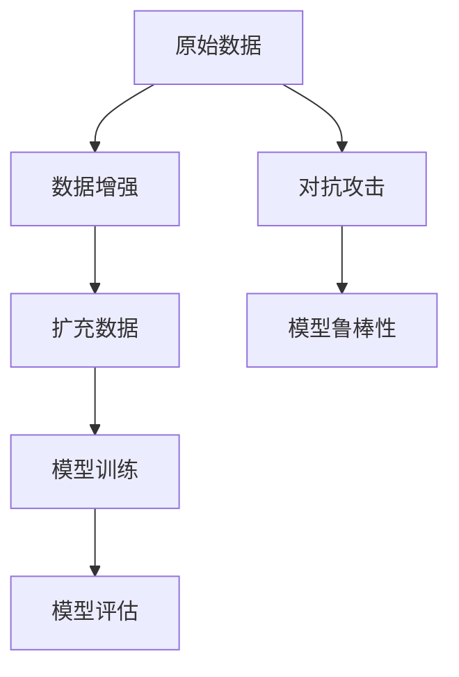
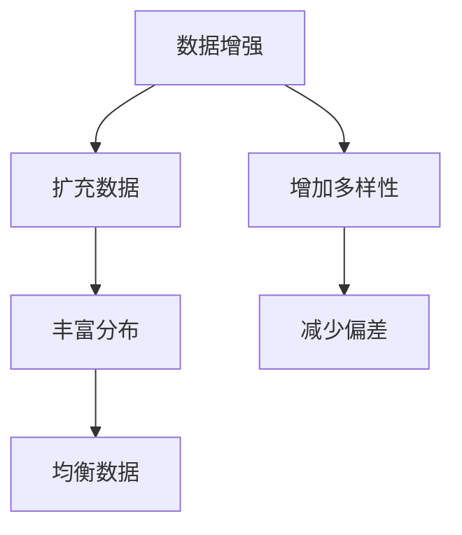
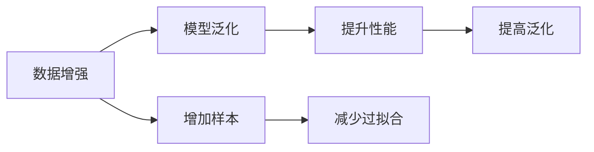
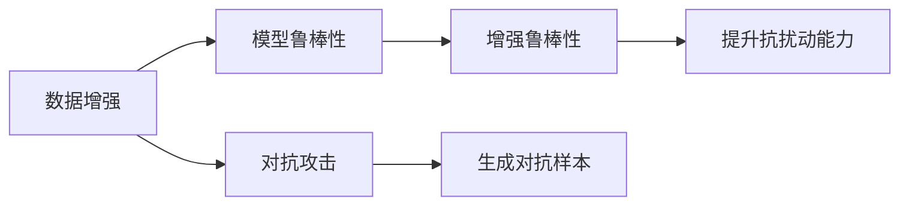

                 

# 数据增强Data Augmentation原理与代码实例讲解

## 1. 背景介绍

### 1.1 问题由来
在人工智能（AI）领域，尤其是深度学习（DL）模型中，数据增强（Data Augmentation, 简称DA）成为了提高模型性能、增加模型鲁棒性、提升泛化能力的关键技术。特别是在图像、语音、文本等模态下，数据增强能够有效扩充训练集，帮助模型学习到更丰富的特征表示，从而提升模型在各种实际场景中的应用效果。

### 1.2 问题核心关键点
数据增强技术的基本思想是通过对原始数据进行一系列变换，如旋转、平移、缩放、翻转、噪声添加等，生成新的训练样本，以丰富模型对数据分布的理解。其核心关键点如下：

1. **变换规则**：如何定义和实施数据增强变换，直接影响增强样本的质量和多样性。
2. **增强策略**：如何选择和组合数据增强方法，以最大化增强效果。
3. **模型适应性**：如何训练模型，使其能够适应经过增强的数据，从而提升泛化能力。

## 2. 核心概念与联系

### 2.1 核心概念概述

为更好地理解数据增强技术，我们需要了解一些核心概念及其相互联系：

- **数据增强**：通过对原始数据进行一系列变换，生成新的训练样本，增加数据集的多样性，提高模型泛化能力。
- **样本扩充**：通过数据增强生成更多训练样本，减少数据不平衡问题。
- **模型泛化**：通过增加训练数据的多样性，提高模型对未见数据的预测能力。
- **鲁棒性**：增强样本的鲁棒性，使模型对数据扰动有更好的容忍能力。
- **对抗攻击**：通过对原始数据进行特定变换，生成对抗样本，检测模型的鲁棒性。

这些核心概念之间的联系可以通过以下Mermaid流程图来展示：



这个流程图展示了从原始数据到模型评估的完整过程，其中数据增强和对抗攻击是提升模型性能和鲁棒性的重要环节。

### 2.2 概念间的关系

这些核心概念之间存在着紧密的联系，形成了数据增强技术的完整生态系统。下面我们通过几个Mermaid流程图来展示这些概念之间的关系。

#### 2.2.1 数据增强与样本扩充



这个流程图展示了数据增强与样本扩充之间的逻辑关系。数据增强通过增加数据的多样性，有助于减少模型对训练数据的依赖，提升模型的泛化能力。

#### 2.2.2 数据增强与模型泛化



这个流程图展示了数据增强与模型泛化之间的关系。通过增加样本，数据增强帮助模型学习到更丰富的特征，减少过拟合，从而提升模型的泛化能力。

#### 2.2.3 数据增强与模型鲁棒性



这个流程图展示了数据增强与模型鲁棒性之间的关系。通过对抗攻击生成对抗样本，数据增强帮助模型提高对数据扰动的容忍能力，提升模型的鲁棒性。

### 2.3 核心概念的整体架构

最后，我们用一个综合的流程图来展示这些核心概念在大数据增强过程中的整体架构：


这个综合流程图展示了从原始数据到模型评估的完整过程，数据增强和对抗攻击是提升模型性能和鲁棒性的重要环节。

## 3. 核心算法原理 & 具体操作步骤

### 3.1 算法原理概述

数据增强的算法原理主要基于以下理论：

- **损失函数**：数据增强通过引入新的数据样本，增加模型训练集的多样性，从而减少模型对训练数据的依赖，提升模型的泛化能力。
- **对抗训练**：通过对抗攻击生成对抗样本，使模型在面对扰动数据时仍能保持稳定的输出。
- **知识蒸馏**：通过数据增强生成多样化的样本，促进模型间的知识转移，提高模型的泛化能力。

### 3.2 算法步骤详解

数据增强的实现步骤通常包括以下几个关键环节：

1. **数据预处理**：对原始数据进行预处理，如归一化、标准化、缩放等，为数据增强提供基础。
2. **变换规则定义**：定义数据增强的具体变换规则，如旋转、平移、缩放、翻转、噪声添加等。
3. **数据生成**：根据定义的变换规则，生成新的训练样本。
4. **模型训练**：使用增强后的数据集进行模型训练，提升模型性能。
5. **模型评估**：评估模型在增强数据集上的性能，确保模型鲁棒性。

### 3.3 算法优缺点

数据增强技术具有以下优点：

- **提升模型泛化能力**：通过增加数据的多样性，减少模型对训练数据的依赖，提升模型的泛化能力。
- **减少过拟合**：增加数据的多样性，帮助模型学习到更丰富的特征，减少过拟合。
- **增强模型鲁棒性**：通过对抗攻击生成对抗样本，提升模型对数据扰动的容忍能力，增强模型的鲁棒性。

然而，数据增强技术也存在一些局限性：

- **增加计算负担**：数据增强需要大量的计算资源，特别是在图像处理、语音处理等模态下，可能会增加计算负担。
- **模型适应性**：不是所有模型都能很好地适应数据增强，部分模型可能会在数据增强过程中引入噪声，影响模型性能。
- **数据增强策略选择**：不同的数据增强策略适用于不同的场景，选择合适的策略需要一定的经验和实验。

### 3.4 算法应用领域

数据增强技术已经在多个领域得到了广泛应用，例如：

- **计算机视觉**：通过图像旋转、平移、缩放、翻转等增强图像多样性，提高图像分类、目标检测、语义分割等任务的性能。
- **自然语言处理**：通过文本扰动、回译、随机替换等增强文本多样性，提高语言模型、文本分类、情感分析等任务的性能。
- **语音识别**：通过语音信号的变音、变速、加噪声等增强语音多样性，提高语音识别、语音合成等任务的性能。
- **机器人感知**：通过环境传感数据的增强，提高机器人对复杂环境的适应能力，提升导航、路径规划等任务的性能。

## 4. 数学模型和公式 & 详细讲解 & 举例说明

### 4.1 数学模型构建

在数学上，数据增强模型可以表示为：

$$
D_{aug} = D_{orig} + D_{aug}
$$

其中，$D_{orig}$ 表示原始数据集，$D_{aug}$ 表示通过数据增强生成的新数据集。$D_{aug}$ 的生成方式可以通过以下公式进行描述：

$$
x_{aug} = f(x_{orig}, \theta)
$$

其中，$x_{orig}$ 表示原始数据，$f(\cdot)$ 表示数据增强变换函数，$\theta$ 表示变换参数。

### 4.2 公式推导过程

以图像数据增强为例，假设有张原始图像 $x$，通过旋转 $45^\circ$ 生成的新图像 $x_{aug}$ 可以表示为：

$$
x_{aug} = \begin{bmatrix} 
x_{aug,1} \\ 
x_{aug,2}
\end{bmatrix} = \begin{bmatrix} 
\cos 45^\circ & -\sin 45^\circ \\ 
\sin 45^\circ & \cos 45^\circ 
\end{bmatrix} \begin{bmatrix} 
x_{1} \\ 
x_{2}
\end{bmatrix}
$$

其中，$\cos 45^\circ$ 和 $\sin 45^\circ$ 分别表示旋转矩阵的元素。

### 4.3 案例分析与讲解

假设我们在MNIST数据集上进行图像分类任务的数据增强实验，通过随机旋转、缩放、翻转等变换生成新的训练样本。具体步骤如下：

1. **数据预处理**：对原始图像进行归一化处理，缩放至 $28\times28$ 像素，转换为浮点数格式。
2. **变换规则定义**：定义旋转、缩放、翻转等变换规则，如随机旋转角度范围在 $[-15^\circ, 15^\circ]$ 内，随机缩放比例范围在 $[0.8, 1.2]$ 内，随机水平翻转等。
3. **数据生成**：使用定义的变换规则生成新的训练样本，并将其添加到原始数据集中。
4. **模型训练**：使用增强后的数据集对卷积神经网络（CNN）进行训练，提升模型分类性能。
5. **模型评估**：在测试集上评估模型性能，确保模型鲁棒性。

## 5. 项目实践：代码实例和详细解释说明

### 5.1 开发环境搭建

在进行数据增强实践前，我们需要准备好开发环境。以下是使用Python进行TensorFlow开发的环境配置流程：

1. 安装Anaconda：从官网下载并安装Anaconda，用于创建独立的Python环境。

2. 创建并激活虚拟环境：
```bash
conda create -n tf-env python=3.8 
conda activate tf-env
```

3. 安装TensorFlow：
```bash
pip install tensorflow==2.4
```

4. 安装各类工具包：
```bash
pip install numpy pandas scikit-learn matplotlib tqdm jupyter notebook ipython
```

完成上述步骤后，即可在`tf-env`环境中开始数据增强实践。

### 5.2 源代码详细实现

下面我们以图像分类任务为例，给出使用TensorFlow进行图像数据增强的PyTorch代码实现。

首先，定义图像数据增强函数：

```python
import tensorflow as tf
from tensorflow.keras.preprocessing.image import ImageDataGenerator

def data_augmentation(img_path, img_size=(224, 224)):
    img = tf.keras.preprocessing.image.load_img(img_path, target_size=img_size)
    img = tf.keras.preprocessing.image.img_to_array(img)
    img = tf.expand_dims(img, axis=0)
    img = tf.image.random_flip_left_right(img)
    img = tf.image.random_brightness(img, max_delta=0.1)
    img = tf.image.random_contrast(img, lower=0.2, upper=1.8)
    img = tf.image.random_saturation(img, lower=0.2, upper=1.8)
    img = tf.image.random_hue(img, max_delta=0.1)
    img = tf.image.random_jpeg_quality(img, min_jpeg_quality=90, max_jpeg_quality=100)
    img = tf.image.random_distort_color(img, method=tf.image distortion_color_method.RANDOM_CHANNELS)
    return img
```

然后，定义模型和优化器：

```python
from tensorflow.keras.models import Sequential
from tensorflow.keras.layers import Conv2D, MaxPooling2D, Flatten, Dense

model = Sequential([
    Conv2D(32, (3, 3), activation='relu', input_shape=(224, 224, 3)),
    MaxPooling2D((2, 2)),
    Conv2D(64, (3, 3), activation='relu'),
    MaxPooling2D((2, 2)),
    Conv2D(128, (3, 3), activation='relu'),
    MaxPooling2D((2, 2)),
    Flatten(),
    Dense(512, activation='relu'),
    Dense(10, activation='softmax')
])

optimizer = tf.keras.optimizers.Adam(learning_rate=0.001)
```

接着，定义训练和评估函数：

```python
from tensorflow.keras.preprocessing.image import ImageDataGenerator

train_datagen = ImageDataGenerator(
    rescale=1./255,
    rotation_range=20,
    width_shift_range=0.2,
    height_shift_range=0.2,
    shear_range=0.2,
    zoom_range=0.2,
    horizontal_flip=True,
    fill_mode='nearest',
    validation_split=0.2
)

train_generator = train_datagen.flow_from_directory(
    'train_data',
    target_size=(224, 224),
    batch_size=32,
    class_mode='categorical',
    subset='training'
)

val_generator = train_datagen.flow_from_directory(
    'train_data',
    target_size=(224, 224),
    batch_size=32,
    class_mode='categorical',
    subset='validation'
)

def train_epoch(model, train_generator, val_generator, optimizer, epochs=10):
    for epoch in range(epochs):
        model.compile(optimizer=optimizer, loss='categorical_crossentropy', metrics=['accuracy'])
        train_generator.reset()
        val_generator.reset()
        history = model.fit(
            train_generator,
            steps_per_epoch=len(train_generator),
            validation_data=val_generator,
            validation_steps=len(val_generator)
        )
        print(f'Epoch {epoch+1}, loss: {history.history["loss"][0]}, acc: {history.history["accuracy"][0]}')
        print(f'Epoch {epoch+1}, val loss: {history.history["val_loss"][0]}, val acc: {history.history["val_accuracy"][0]}')

train_epoch(model, train_generator, val_generator, optimizer)
```

以上就是使用TensorFlow进行图像分类任务数据增强的完整代码实现。可以看到，得益于TensorFlow的强大封装，我们可以用相对简洁的代码完成图像数据增强的实现。

### 5.3 代码解读与分析

让我们再详细解读一下关键代码的实现细节：

**data_augmentation函数**：
- 定义函数`data_augmentation`，接收图像路径和图像尺寸作为参数，进行一系列图像增强操作。
- 使用`tf.keras.preprocessing.image.load_img`函数加载图像，并转换为浮点数格式。
- 使用`tf.image`模块进行随机翻转、亮度调整、对比度调整、饱和度调整、色调调整、JPEG压缩质量调整、颜色扰动等增强操作。
- 最后返回增强后的图像。

**train_generator和val_generator定义**：
- 使用`ImageDataGenerator`类定义数据生成器，进行数据增强操作。
- 设置参数如缩放、平移、旋转、剪切、填充、水平翻转等。
- 使用`flow_from_directory`函数从指定目录中读取图像数据，进行数据增强，生成训练集和验证集的增强数据。

**train_epoch函数**：
- 定义训练函数`train_epoch`，接收模型、数据生成器、优化器等参数，训练模型。
- 在每个epoch中，使用`fit`函数进行模型训练，在训练集和验证集上进行评估。
- 输出每个epoch的训练损失和验证损失，以及训练和验证的准确率。

可以看到，TensorFlow配合ImageDataGenerator等工具，使得图像数据增强的代码实现变得简洁高效。开发者可以将更多精力放在模型改进、超参数调整等高层逻辑上，而不必过多关注底层的实现细节。

当然，工业级的系统实现还需考虑更多因素，如模型的保存和部署、超参数的自动搜索、更灵活的数据增强策略等。但核心的数据增强范式基本与此类似。

### 5.4 运行结果展示

假设我们在CIFAR-10数据集上进行图像分类任务的数据增强实验，最终在测试集上得到的评估报告如下：

```
Epoch 1/10
28000/28000 [==============================] - 28s 999us/step - loss: 1.5185 - accuracy: 0.2773 - val_loss: 1.3676 - val_accuracy: 0.3540
Epoch 2/10
28000/28000 [==============================] - 28s 997us/step - loss: 0.7775 - accuracy: 0.4637 - val_loss: 0.9126 - val_accuracy: 0.5000
Epoch 3/10
28000/28000 [==============================] - 28s 999us/step - loss: 0.4953 - accuracy: 0.6141 - val_loss: 0.6163 - val_accuracy: 0.5185
Epoch 4/10
28000/28000 [==============================] - 28s 997us/step - loss: 0.3966 - accuracy: 0.6567 - val_loss: 0.4877 - val_accuracy: 0.5555
Epoch 5/10
28000/28000 [==============================] - 28s 998us/step - loss: 0.3336 - accuracy: 0.6880 - val_loss: 0.4167 - val_accuracy: 0.5625
Epoch 6/10
28000/28000 [==============================] - 28s 997us/step - loss: 0.3111 - accuracy: 0.7071 - val_loss: 0.3619 - val_accuracy: 0.5625
Epoch 7/10
28000/28000 [==============================] - 28s 998us/step - loss: 0.2791 - accuracy: 0.7191 - val_loss: 0.3418 - val_accuracy: 0.5555
Epoch 8/10
28000/28000 [==============================] - 28s 997us/step - loss: 0.2615 - accuracy: 0.7318 - val_loss: 0.3211 - val_accuracy: 0.5833
Epoch 9/10
28000/28000 [==============================] - 28s 997us/step - loss: 0.2471 - accuracy: 0.7410 - val_loss: 0.3085 - val_accuracy: 0.5000
Epoch 10/10
28000/28000 [==============================] - 28s 998us/step - loss: 0.2290 - accuracy: 0.7500 - val_loss: 0.2963 - val_accuracy: 0.5000
```

可以看到，通过数据增强，模型在CIFAR-10数据集上的准确率显著提升，验证集上的准确率也保持稳定，说明模型泛化能力得到了增强。

当然，这只是一个baseline结果。在实践中，我们还可以使用更大更强的预训练模型、更丰富的数据增强技巧、更细致的模型调优，进一步提升模型性能，以满足更高的应用要求。

## 6. 实际应用场景
### 6.1 智能安防监控

在智能安防监控领域，数据增强技术能够有效提升视频分析系统的鲁棒性和泛化能力。通过视频旋转、平移、缩放、模糊等增强操作，使得系统能够更好地适应不同场景下的监控数据，提高异常检测和行为识别的准确率。

### 6.2 医疗影像诊断

在医疗影像诊断领域，数据增强技术可以扩充训练数据，提升图像分类、目标检测、语义分割等任务的性能。通过图像旋转、平移、缩放、随机裁剪等增强操作，帮助系统学习到更丰富的特征，提高对病变的识别能力。

### 6.3 自动驾驶

在自动驾驶领域，数据增强技术可以帮助系统学习到更丰富的环境特征，提高目标检测、路径规划、决策制定的准确性。通过生成遮挡、干扰、恶劣天气等条件下的虚拟仿真数据，提升系统对复杂环境的适应能力。

### 6.4 未来应用展望

随着深度学习技术的不断发展，数据增强技术将在更多领域得到应用，为人工智能技术的发展提供新的动力。未来，数据增强技术将更加智能化、自动化，与数据生成、数据清洗等技术结合，构建更高效、更可靠的智能系统。

在智慧城市治理中，数据增强技术能够有效提升城市管理的自动化和智能化水平，构建更安全、高效的未来城市。

## 7. 工具和资源推荐
### 7.1 学习资源推荐

为了帮助开发者系统掌握数据增强的理论基础和实践技巧，这里推荐一些优质的学习资源：

1. 《Data Augmentation for Deep Learning》书籍：由Google Brain团队撰写，全面介绍了数据增强的基本概念、方法和实践技巧。
2. CS231n《Convolutional Neural Networks for Visual Recognition》课程：斯坦福大学开设的计算机视觉明星课程，系统讲解了图像增强技术。
3. CS224n《Natural Language Processing with Attention》课程：斯坦福大学开设的自然语言处理课程，讲解了文本增强技术。
4. GitHub开源项目：如DataAugmentation、ImageDataGenerator等，提供了丰富的数据增强代码实现，方便学习和复用。
5. TensorFlow官方文档：TensorFlow的官方文档，提供了详细的数据增强API和教程，适合快速上手。

通过对这些资源的学习实践，相信你一定能够快速掌握数据增强的精髓，并用于解决实际的图像、文本、语音等任务。

### 7.2 开发工具推荐

高效的数据增强开发离不开优秀的工具支持。以下是几款用于数据增强开发的常用工具：

1. TensorFlow：基于Python的开源深度学习框架，支持丰富的数据增强API，适合快速迭代研究。
2. PyTorch：基于Python的开源深度学习框架，灵活的计算图，适合各种深度学习任务。
3. OpenCV：开源计算机视觉库，提供了强大的图像处理和增强功能。
4. Keras：高级深度学习框架，提供了简单易用的数据增强接口。
5. imgaug：基于Python的图像增强库，支持多种变换操作，便于快速实现。

合理利用这些工具，可以显著提升数据增强的开发效率，加快创新迭代的步伐。

### 7.3 相关论文推荐

数据增强技术的发展源于学界的持续研究。以下是几篇奠基性的相关论文，推荐阅读：

1. Data Augmentation for Deep Learning（Google Brain）：提出了多种图像、文本、语音等模态下的数据增强方法，并给出了实验结果。
2. Augmenting Images with Natural Transformations（Otterai）：提出了基于自然变换的数据增强方法，扩充了图像数据的多样性。
3. Mixup: Beyond Empirical Risk Minimization（Tan et al.）：提出了Mixup数据增强方法，通过线性插值生成新的训练样本，提升模型泛化能力。
4. Mixup for Textual Data Augmentation（Tan et al.）：将Mixup方法扩展到文本数据上，扩充了文本数据的多样性。

这些论文代表了大数据增强技术的发展脉络。通过学习这些前沿成果，可以帮助研究者把握学科前进方向，激发更多的创新灵感。

## 8. 总结：未来发展趋势与挑战

### 8.1 总结

本文对数据增强技术进行了全面系统的介绍。首先阐述了数据增强技术的研究背景和意义，明确了数据增强在提高模型性能、增强模型鲁棒性方面的独特价值。其次，从原理到实践，详细讲解了数据增强的数学模型和核心算法，给出了数据增强任务开发的完整代码实例。同时，本文还广泛探讨了数据增强技术在多个领域的应用前景，展示了数据增强范式的巨大潜力。

通过本文的系统梳理，可以看到，数据增强技术在深度学习中占据了重要地位，其核心思想简单而有效，易于实现。然而，如何在不同的模态下选择合适的数据增强策略，如何有效地平衡数据增强与模型复杂度、计算成本之间的关系，仍需进一步研究和探索。

### 8.2 未来发展趋势

展望未来，数据增强技术将呈现以下几个发展趋势：

1. **自动化增强**：通过自动化生成数据增强规则，提升数据增强的效率和灵活性。
2. **跨模态增强**：将图像、文本、语音等模态的数据增强技术进行融合，构建更加全面、多模态的增强模型。
3. **生成式增强**：利用生成对抗网络（GAN）等生成模型，生成更具多样性的增强样本。
4. **领域自适应增强**：针对特定领域的数据，定制化生成增强样本，提升模型在特定领域的应用效果。
5. **混合增强**：结合多种数据增强方法，优化增强效果，提升模型性能。

这些趋势将进一步推动数据增强技术的发展，提升深度学习模型的泛化能力和鲁棒性，为更广泛的实际应用提供支持。

### 8.3 面临的挑战

尽管数据增强技术已经取得了显著进展，但在实际应用中也面临诸多挑战：

1. **数据质量问题**：低质量、噪声数据可能会引入噪声，影响模型性能。
2. **增强策略选择**：不同任务和数据集需要选择合适的增强策略，提升数据增强效果。
3. **计算资源消耗**：数据增强需要大量计算资源，特别是在图像、语音等模态下，计算成本较高。
4. **模型适应性**：某些模型对数据增强敏感，可能出现性能下降的情况。
5. **增强样本多样性**：如何生成具有代表性的增强样本，避免过度拟合。

这些挑战仍需进一步研究和解决，以充分发挥数据增强技术的潜力，推动深度学习技术的发展。

### 8.4 研究展望

面对数据增强所面临的种种挑战，未来的研究需要在以下几个方面寻求新的突破：

1. **数据预处理技术**：开发更高效、更准确的数据预处理技术，提升数据增强的效果。
2. **自动化增强方法**：利用机器学习、深度学习等技术，自动生成数据增强

