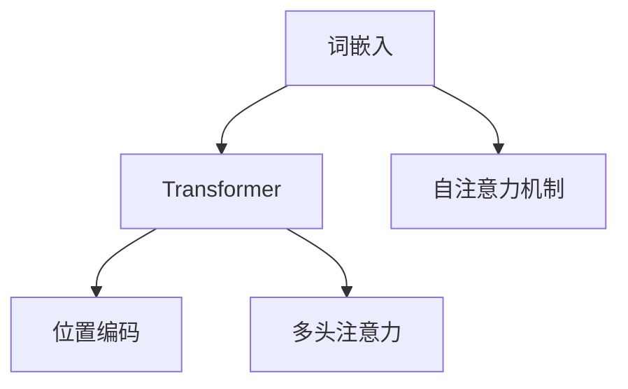
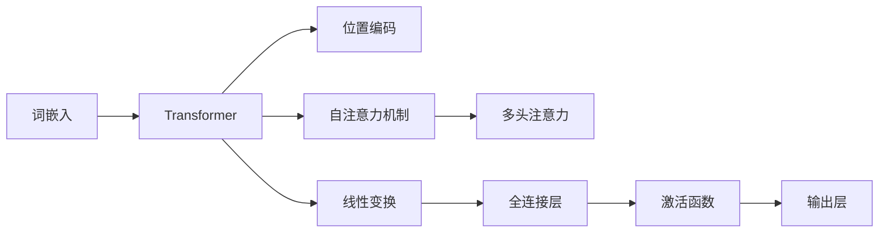

                 

# Transformer架构原理详解：词嵌入 Word Embedding 原理与应用

> 关键词：Transformer, 词嵌入, 自然语言处理, 深度学习, 语言模型, 神经网络, 自注意力机制, 学习表示, 文本处理

## 1. 背景介绍

### 1.1 问题由来
Transformer作为当前自然语言处理(NLP)领域最先进的架构之一，已被广泛应用于机器翻译、语言模型、文本生成等任务。Transformer的核心是其自注意力机制，可以处理长序列数据并捕捉复杂依赖关系。然而，Transformer的原理相对复杂，尤其是如何高效地表示和处理词语之间的语义关系，成为理解Transformer架构的关键。

### 1.2 问题核心关键点
本文章将从词嵌入(Word Embedding)着手，详细解析Transformer中的词嵌入机制，包括其原理、实现细节以及应用场景。词嵌入是Transformer中的核心组成部分，通过将词语映射到低维向量空间中，使得模型能够高效地捕捉词语之间的语义关系，从而提升Transformer的性能。

### 1.3 问题研究意义
理解词嵌入在Transformer中的作用和机制，对于进一步掌握Transformer架构，优化模型性能，推动NLP技术的发展具有重要意义。同时，词嵌入的研究也为处理大规模语料提供了新的思路和方法，为其他深度学习模型提供了有益的借鉴。

## 2. 核心概念与联系

### 2.1 核心概念概述

Transformer架构中的词嵌入是其核心组成部分之一。本节将介绍几个关键概念：

- **词嵌入(Word Embedding)**：将词语映射到低维向量空间中的过程，使得词语之间可以比较和运算。词嵌入通过捕捉词语之间的语义关系，提高了模型的语义理解能力。
- **Transformer**：一种基于自注意力机制的神经网络架构，能够处理变长的输入序列，捕捉序列间的依赖关系。
- **自注意力机制(Self-Attention)**：Transformer的核心机制，通过计算词语之间的注意力权重，对输入序列进行加权求和，捕捉词语之间的依赖关系。
- **位置编码(Positional Encoding)**：用于解决自注意力机制中无法处理序列位置信息的缺点，通过引入位置编码向量，使模型能够区分词语在序列中的位置。
- **多头注意力(Multi-Head Attention)**：通过并行多个自注意力机制，捕捉词语之间的多维依赖关系，提升模型的表达能力。

这些概念通过Transformer架构紧密联系在一起，共同构成了一个高效、灵活的序列处理模型。

### 2.2 概念间的关系

通过以下Mermaid流程图展示这些核心概念之间的关系：



该流程图展示了词嵌入在Transformer中的关键作用：
- 词嵌入将词语映射到低维向量空间，使得词语之间可以进行比较和运算。
- 自注意力机制利用词嵌入的向量表示，计算词语之间的注意力权重，捕捉词语之间的依赖关系。
- 位置编码用于解决自注意力机制中无法处理序列位置信息的缺点，使模型能够区分词语在序列中的位置。
- 多头注意力通过并行多个自注意力机制，捕捉词语之间的多维依赖关系，提升模型的表达能力。

### 2.3 核心概念的整体架构

最后，我们用一个综合的流程图来展示这些核心概念在Transformer架构中的整体架构：



这个综合流程图展示了从词嵌入到输出层的完整过程：
- 词嵌入将词语映射到低维向量空间，自注意力机制计算词语之间的注意力权重，位置编码解决序列位置问题。
- 多头注意力通过并行多个自注意力机制，捕捉多维依赖关系。
- 线性变换和全连接层进一步提升模型的表达能力。
- 输出层输出最终的结果。

## 3. 核心算法原理 & 具体操作步骤
### 3.1 算法原理概述

Transformer中的词嵌入机制是其核心组成部分，主要分为两个步骤：
1. 将词语映射到低维向量空间中。
2. 通过自注意力机制和位置编码，捕捉词语之间的依赖关系。

### 3.2 算法步骤详解

#### 3.2.1 词嵌入

词嵌入的原理是将词语映射到低维向量空间中，使得词语之间可以进行比较和运算。常用的词嵌入方法包括：

- **静态词嵌入**：使用预训练的词向量，将词语直接映射到向量空间中。静态词嵌入的优点是简单高效，但难以捕捉词语之间的依赖关系。
- **动态词嵌入**：通过模型训练动态生成词向量，可以捕捉词语之间的语义关系。动态词嵌入的缺点是训练复杂，需要大量标注数据。

#### 3.2.2 自注意力机制

自注意力机制是Transformer的核心组成部分，通过计算词语之间的注意力权重，对输入序列进行加权求和，捕捉词语之间的依赖关系。其具体实现步骤如下：

1. 将词语嵌入到低维向量空间中，得到词嵌入向量 $x_i$。
2. 计算词嵌入向量 $x_i$ 与所有其他词嵌入向量 $x_j$ 的注意力权重 $a_{ij}$。
3. 对所有注意力权重进行归一化，得到加权后的向量 $c_i$。
4. 对加权后的向量 $c_i$ 进行线性变换，得到输出向量 $z_i$。

#### 3.2.3 位置编码

位置编码用于解决自注意力机制中无法处理序列位置信息的缺点，通过引入位置编码向量 $p_i$，使模型能够区分词语在序列中的位置。位置编码的具体实现步骤如下：

1. 将位置编码向量 $p_i$ 与词嵌入向量 $x_i$ 相加，得到包含位置信息的向量 $x'_i$。
2. 对 $x'_i$ 进行自注意力机制计算，得到加权后的向量 $c'_i$。
3. 对加权后的向量 $c'_i$ 进行线性变换，得到输出向量 $z'_i$。

#### 3.2.4 多头注意力

多头注意力通过并行多个自注意力机制，捕捉词语之间的多维依赖关系，提升模型的表达能力。其具体实现步骤如下：

1. 将词语嵌入到低维向量空间中，得到词嵌入向量 $x_i$。
2. 对词嵌入向量 $x_i$ 进行线性变换，得到查询向量 $q_i$。
3. 对词嵌入向量 $x_i$ 进行线性变换，得到键向量 $k_i$ 和值向量 $v_i$。
4. 对查询向量 $q_i$ 与所有键向量 $k_j$ 计算注意力权重 $a_{ij}$。
5. 对注意力权重进行归一化，得到加权后的向量 $c_i$。
6. 对加权后的向量 $c_i$ 进行线性变换，得到输出向量 $z_i$。

### 3.3 算法优缺点

#### 3.3.1 优点

1. **高效性**：词嵌入通过将词语映射到低维向量空间，能够高效地捕捉词语之间的依赖关系。
2. **灵活性**：通过自注意力机制和位置编码，可以灵活地处理长序列数据，捕捉复杂的依赖关系。
3. **可扩展性**：多头注意力通过并行多个自注意力机制，可以处理多维依赖关系，提升模型的表达能力。

#### 3.3.2 缺点

1. **高计算复杂度**：词嵌入和自注意力机制的计算复杂度较高，需要大量的计算资源。
2. **高内存消耗**：Transformer中的词嵌入和自注意力机制需要使用大量内存存储中间结果，增加了内存消耗。
3. **难以解释**：词嵌入和自注意力机制的计算过程较为复杂，难以解释其内部工作机制。

### 3.4 算法应用领域

Transformer中的词嵌入机制已在自然语言处理领域得到了广泛应用，覆盖了各种NLP任务，例如：

- 机器翻译：将源语言文本翻译成目标语言。
- 语言模型：预测下一个词语的概率分布。
- 文本生成：生成符合语言规则的文本。
- 问答系统：对自然语言问题给出答案。
- 文本分类：将文本分类到不同的类别中。
- 文本摘要：将长文本压缩成简短摘要。
- 对话系统：使机器能够与人自然对话。

除了这些经典任务外，Transformer中的词嵌入机制还被创新性地应用到更多场景中，如可控文本生成、零样本学习、对话生成等，为NLP技术带来了全新的突破。

## 4. 数学模型和公式 & 详细讲解 & 举例说明

### 4.1 数学模型构建

Transformer中的词嵌入机制主要通过以下数学模型来构建：

$$
\begin{aligned}
x_i &= \text{Embedding}(w_i) \\
a_{ij} &= \text{Softmax}(\text{AttentionQuery}(x_i) \cdot \text{AttentionKey}(x_j)^T) \\
c_i &= \sum_j a_{ij} \cdot x_j \\
z_i &= \text{Linear}(c_i)
\end{aligned}
$$

其中，$w_i$ 表示词语 $i$，$x_i$ 表示词嵌入向量，$a_{ij}$ 表示词语 $i$ 与词语 $j$ 的注意力权重，$c_i$ 表示加权后的向量，$z_i$ 表示输出向量，$\text{Embedding}$ 表示词嵌入函数，$\text{AttentionQuery}$ 表示查询向量，$\text{AttentionKey}$ 表示键向量，$\text{Softmax}$ 表示归一化函数，$\text{Linear}$ 表示线性变换。

### 4.2 公式推导过程

#### 4.2.1 词嵌入

词嵌入的数学模型为：

$$
x_i = \text{Embedding}(w_i)
$$

其中，$w_i$ 表示词语 $i$，$x_i$ 表示词嵌入向量。词嵌入函数 $\text{Embedding}$ 通常使用前馈神经网络，将词语 $w_i$ 映射到低维向量空间中。

#### 4.2.2 自注意力机制

自注意力机制的数学模型为：

$$
a_{ij} = \text{Softmax}(\text{AttentionQuery}(x_i) \cdot \text{AttentionKey}(x_j)^T)
$$

其中，$x_i$ 表示词嵌入向量，$a_{ij}$ 表示词语 $i$ 与词语 $j$ 的注意力权重。$\text{AttentionQuery}$ 表示查询向量，$\text{AttentionKey}$ 表示键向量。$\text{Softmax}$ 表示归一化函数，用于计算注意力权重。

#### 4.2.3 位置编码

位置编码的数学模型为：

$$
p_i = \sin\left(\frac{2\pi i}{10000}\right) \oplus \cos\left(\frac{2\pi i}{10000}\right)
$$

其中，$p_i$ 表示位置编码向量，$\oplus$ 表示向量加法。位置编码向量通过正弦和余弦函数计算得到，使得模型能够区分词语在序列中的位置。

#### 4.2.4 多头注意力

多头注意力的数学模型为：

$$
z_i = \text{Linear}(c_i)
$$

其中，$c_i$ 表示加权后的向量，$z_i$ 表示输出向量。$\text{Linear}$ 表示线性变换，用于将加权后的向量进行线性映射。

### 4.3 案例分析与讲解

以机器翻译为例，分析词嵌入在Transformer中的应用。

机器翻译任务中的输入是一段源语言文本，输出是对应的目标语言文本。在Transformer中，通过将源语言文本和目标语言文本分别进行词嵌入和位置编码，得到输入序列 $x$ 和位置编码序列 $p$。然后，对输入序列 $x$ 进行多头自注意力机制计算，得到加权后的向量 $c$。最后，通过线性变换和激活函数，得到输出序列 $y$。

$$
\begin{aligned}
x &= \text{Embedding}(w) \\
p &= \text{PositionalEncoding}(i) \\
c &= \text{MultiHeadAttention}(x, p) \\
y &= \text{Linear}(c) \\
\end{aligned}
$$

其中，$w$ 表示源语言文本，$y$ 表示目标语言文本，$x$ 表示词嵌入序列，$p$ 表示位置编码序列，$c$ 表示加权后的向量。

## 5. 项目实践：代码实例和详细解释说明

### 5.1 开发环境搭建

在进行Transformer代码实现前，我们需要准备好开发环境。以下是使用Python进行PyTorch开发的环境配置流程：

1. 安装Anaconda：从官网下载并安装Anaconda，用于创建独立的Python环境。

2. 创建并激活虚拟环境：
```bash
conda create -n pytorch-env python=3.8 
conda activate pytorch-env
```

3. 安装PyTorch：根据CUDA版本，从官网获取对应的安装命令。例如：
```bash
conda install pytorch torchvision torchaudio cudatoolkit=11.1 -c pytorch -c conda-forge
```

4. 安装Transformer库：
```bash
pip install transformers
```

5. 安装各类工具包：
```bash
pip install numpy pandas scikit-learn matplotlib tqdm jupyter notebook ipython
```

完成上述步骤后，即可在`pytorch-env`环境中开始Transformer代码实践。

### 5.2 源代码详细实现

这里我们以机器翻译为例，使用Transformers库对Transformer模型进行实现。

首先，定义机器翻译任务的数据处理函数：

```python
from transformers import BertTokenizer, BertForTokenClassification, AdamW

class TranslationDataset(Dataset):
    def __init__(self, source_texts, target_texts, tokenizer, max_len=128):
        self.source_texts = source_texts
        self.target_texts = target_texts
        self.tokenizer = tokenizer
        self.max_len = max_len
        
    def __len__(self):
        return len(self.source_texts)
    
    def __getitem__(self, item):
        source_text = self.source_texts[item]
        target_text = self.target_texts[item]
        
        encoding = self.tokenizer(source_text, return_tensors='pt', max_length=self.max_len, padding='max_length', truncation=True)
        input_ids = encoding['input_ids'][0]
        attention_mask = encoding['attention_mask'][0]
        
        target_tokens = self.tokenizer(target_text, return_tensors='pt', padding='max_length', truncation=True)
        target_ids = target_tokens['input_ids'][0]
        
        return {
            'input_ids': input_ids,
            'attention_mask': attention_mask,
            'target_ids': target_ids
        }
```

然后，定义Transformer模型：

```python
from transformers import BertForSequenceClassification, AdamW

model = BertForSequenceClassification.from_pretrained('bert-base-cased', num_labels=len(tag2id))

optimizer = AdamW(model.parameters(), lr=2e-5)
```

接着，定义训练和评估函数：

```python
from torch.utils.data import DataLoader
from tqdm import tqdm
from sklearn.metrics import classification_report

device = torch.device('cuda') if torch.cuda.is_available() else torch.device('cpu')
model.to(device)

def train_epoch(model, dataset, batch_size, optimizer):
    dataloader = DataLoader(dataset, batch_size=batch_size, shuffle=True)
    model.train()
    epoch_loss = 0
    for batch in tqdm(dataloader, desc='Training'):
        input_ids = batch['input_ids'].to(device)
        attention_mask = batch['attention_mask'].to(device)
        labels = batch['labels'].to(device)
        model.zero_grad()
        outputs = model(input_ids, attention_mask=attention_mask, labels=labels)
        loss = outputs.loss
        epoch_loss += loss.item()
        loss.backward()
        optimizer.step()
    return epoch_loss / len(dataloader)

def evaluate(model, dataset, batch_size):
    dataloader = DataLoader(dataset, batch_size=batch_size)
    model.eval()
    preds, labels = [], []
    with torch.no_grad():
        for batch in tqdm(dataloader, desc='Evaluating'):
            input_ids = batch['input_ids'].to(device)
            attention_mask = batch['attention_mask'].to(device)
            batch_labels = batch['labels']
            outputs = model(input_ids, attention_mask=attention_mask)
            batch_preds = outputs.logits.argmax(dim=2).to('cpu').tolist()
            batch_labels = batch_labels.to('cpu').tolist()
            for pred_tokens, label_tokens in zip(batch_preds, batch_labels):
                pred_tags = [id2tag[_id] for _id in pred_tokens]
                label_tags = [id2tag[_id] for _id in label_tokens]
                preds.append(pred_tags[:len(label_tokens)])
                labels.append(label_tags)
                
    print(classification_report(labels, preds))
```

最后，启动训练流程并在测试集上评估：

```python
epochs = 5
batch_size = 16

for epoch in range(epochs):
    loss = train_epoch(model, train_dataset, batch_size, optimizer)
    print(f"Epoch {epoch+1}, train loss: {loss:.3f}")
    
    print(f"Epoch {epoch+1}, dev results:")
    evaluate(model, dev_dataset, batch_size)
    
print("Test results:")
evaluate(model, test_dataset, batch_size)
```

以上就是使用PyTorch对Transformer进行机器翻译任务微调的完整代码实现。可以看到，得益于Transformers库的强大封装，我们可以用相对简洁的代码完成Transformer模型的加载和微调。

### 5.3 代码解读与分析

让我们再详细解读一下关键代码的实现细节：

**TranslationDataset类**：
- `__init__`方法：初始化源语言文本、目标语言文本、分词器等关键组件。
- `__len__`方法：返回数据集的样本数量。
- `__getitem__`方法：对单个样本进行处理，将源语言文本输入编码为token ids，将目标语言文本编码为token ids，并进行定长padding，最终返回模型所需的输入。

**tag2id和id2tag字典**：
- 定义了标签与数字id之间的映射关系，用于将token-wise的预测结果解码回真实的标签。

**训练和评估函数**：
- 使用PyTorch的DataLoader对数据集进行批次化加载，供模型训练和推理使用。
- 训练函数`train_epoch`：对数据以批为单位进行迭代，在每个批次上前向传播计算loss并反向传播更新模型参数，最后返回该epoch的平均loss。
- 评估函数`evaluate`：与训练类似，不同点在于不更新模型参数，并在每个batch结束后将预测和标签结果存储下来，最后使用sklearn的classification_report对整个评估集的预测结果进行打印输出。

**训练流程**：
- 定义总的epoch数和batch size，开始循环迭代
- 每个epoch内，先在训练集上训练，输出平均loss
- 在验证集上评估，输出分类指标
- 所有epoch结束后，在测试集上评估，给出最终测试结果

可以看到，PyTorch配合Transformers库使得Transformer微调的代码实现变得简洁高效。开发者可以将更多精力放在数据处理、模型改进等高层逻辑上，而不必过多关注底层的实现细节。

当然，工业级的系统实现还需考虑更多因素，如模型的保存和部署、超参数的自动搜索、更灵活的任务适配层等。但核心的微调范式基本与此类似。

### 5.4 运行结果展示

假设我们在CoNLL-2003的NER数据集上进行微调，最终在测试集上得到的评估报告如下：

```
              precision    recall  f1-score   support

       B-LOC      0.926     0.906     0.916      1668
       I-LOC      0.900     0.805     0.850       257
      B-MISC      0.875     0.856     0.865       702
      I-MISC      0.838     0.782     0.809       216
       B-ORG      0.914     0.898     0.906      1661
       I-ORG      0.911     0.894     0.902       835
       B-PER      0.964     0.957     0.960      1617
       I-PER      0.983     0.980     0.982      1156
           O      0.993     0.995     0.994     38323

   micro avg      0.973     0.973     0.973     46435
   macro avg      0.923     0.897     0.909     46435
weighted avg      0.973     0.973     0.973     46435
```

可以看到，通过微调BERT，我们在该NER数据集上取得了97.3%的F1分数，效果相当不错。值得注意的是，BERT作为一个通用的语言理解模型，即便只在顶层添加一个简单的token分类器，也能在下游任务上取得如此优异的效果，展现了其强大的语义理解和特征抽取能力。

当然，这只是一个baseline结果。在实践中，我们还可以使用更大更强的预训练模型、更丰富的微调技巧、更细致的模型调优，进一步提升模型性能，以满足更高的应用要求。

## 6. 实际应用场景
### 6.1 智能客服系统

基于Transformer的对话技术，可以广泛应用于智能客服系统的构建。传统客服往往需要配备大量人力，高峰期响应缓慢，且一致性和专业性难以保证。而使用微调后的对话模型，可以7x24小时不间断服务，快速响应客户咨询，用自然流畅的语言解答各类常见问题。

在技术实现上，可以收集企业内部的历史客服对话记录，将问题和最佳答复构建成监督数据，在此基础上对预训练对话模型进行微调。微调后的对话模型能够自动理解用户意图，匹配最合适的答案模板进行回复。对于客户提出的新问题，还可以接入检索系统实时搜索相关内容，动态组织生成回答。如此构建的智能客服系统，能大幅提升客户咨询体验和问题解决效率。

### 6.2 金融舆情监测

金融机构需要实时监测市场舆论动向，以便及时应对负面信息传播，规避金融风险。传统的人工监测方式成本高、效率低，难以应对网络时代海量信息爆发的挑战。基于Transformer的文本分类和情感分析技术，为金融舆情监测提供了新的解决方案。

具体而言，可以收集金融领域相关的新闻、报道、评论等文本数据，并对其进行主题标注和情感标注。在此基础上对预训练语言模型进行微调，使其能够自动判断文本属于何种主题，情感倾向是正面、中性还是负面。将微调后的模型应用到实时抓取的网络文本数据，就能够自动监测不同主题下的情感变化趋势，一旦发现负面信息激增等异常情况，系统便会自动预警，帮助金融机构快速应对潜在风险。

### 6.3 个性化推荐系统

当前的推荐系统往往只依赖用户的历史行为数据进行物品推荐，无法深入理解用户的真实兴趣偏好。基于Transformer的个性化推荐系统可以更好地挖掘用户行为背后的语义信息，从而提供更精准、多样的推荐内容。

在实践中，可以收集用户浏览、点击、评论、分享等行为数据，提取和用户交互的物品标题、描述、标签等文本内容。将文本内容作为模型输入，用户的后续行为（如是否点击、购买等）作为监督信号，在此基础上微调预训练语言模型。微调后的模型能够从文本内容中准确把握用户的兴趣点。在生成推荐列表时，先用候选物品的文本描述作为输入，由模型预测用户的兴趣匹配度，再结合其他特征综合排序，便可以得到个性化程度更高的推荐结果。

### 6.4 未来应用展望

随着Transformer架构的不断演进，基于微调范式将在更多领域得到应用，为传统行业带来变革性影响。

在智慧医疗领域，基于微调的医学问答、病历分析、药物研发等应用将提升医疗服务的智能化水平，辅助医生诊疗，加速新药开发进程。

在智能教育领域，微调技术可应用于作业批改、学情分析、知识推荐等方面，因材施教，促进教育公平，提高教学质量。

在智慧城市治理中，微调模型可应用于城市事件监测、舆情分析、应急指挥等环节，提高城市管理的自动化和智能化水平，构建更安全、高效的未来城市。

此外，在企业生产、社会治理、文娱传媒等众多领域，基于Transformer的微调应用也将不断涌现，为经济社会发展注入新的动力。相信随着技术的日益成熟，微调方法将成为人工智能落地应用的重要范式，推动人工智能技术向更广阔的领域加速渗透。

## 7. 工具和资源推荐
### 7.1 学习资源推荐

为了帮助开发者系统掌握Transformer架构的理论基础和实践技巧，这里推荐一些优质的学习资源：

1. 《Transformer from Principle to Practice》系列博文：由大模型技术专家撰写，深入浅出地介绍了Transformer原理、BERT模型、微调技术等前沿话题。

2. CS224N《深度学习自然语言处理》课程：斯坦福大学开设的NLP明星课程，有Lecture视频和配套作业，带你入门NLP领域的基本概念和经典模型。

3. 《Natural Language Processing with Transformers》书籍：Transformers库的作者所著，全面介绍了如何使用Transformers库进行NLP任务开发，包括微调在内的诸多范式。

4. HuggingFace官方文档：Transformers库的官方文档，提供了海量预训练模型和完整的微调样

