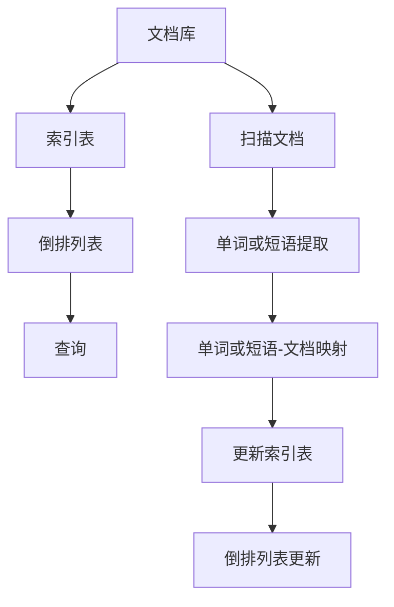
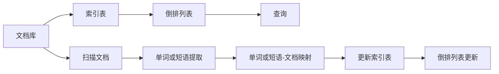
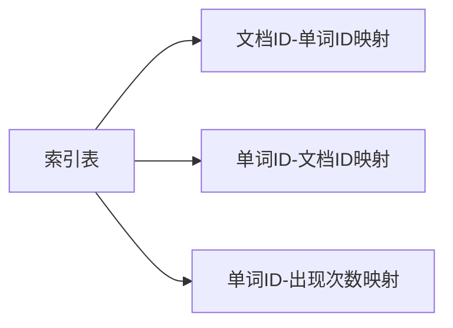
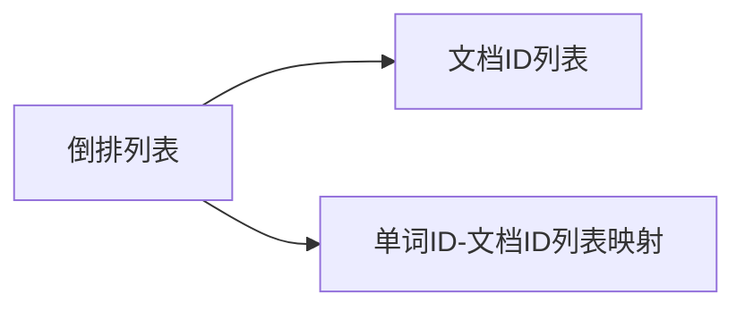

                 

# 【AI大数据计算原理与代码实例讲解】倒排索引

## 1. 背景介绍

### 1.1 问题由来
在搜索引擎和大数据分析等领域，高效的文本检索与信息检索是核心需求。传统的文本检索方法基于全文搜索，即对整个文档库进行全文扫描，查找包含关键词的文档，存在效率低、内存占用大等问题。倒排索引(Inverted Index)是一种高效的文本检索方式，通过构建索引表，将关键词与文档进行映射，大幅提升检索效率，成为文本搜索与信息检索的标准算法。

### 1.2 问题核心关键点
倒排索引的核心在于将文档库中的每个单词或短语与其对应的文档进行映射，构建一个反向索引结构。具体流程包括：
- 扫描文档库，将每个单词或短语与包含该单词或短语的文档进行关联。
- 将关联关系存储在索引表中，形成倒排列表。
- 用户通过查询一个或多个关键词，利用倒排索引快速定位包含关键词的文档。

这种高效的文本检索方式，使得倒排索引成为搜索引擎、新闻推荐、广告投放等众多领域中的核心算法。本文将深入探讨倒排索引的原理与实现，并结合代码实例，系统讲解倒排索引的构建与检索过程。

### 1.3 问题研究意义
深入理解倒排索引的原理和实现，对于掌握文本搜索与信息检索的核心技术，提升搜索引擎和大数据分析系统的效率与精度，具有重要意义。倒排索引作为搜索引擎的基石，其性能直接决定了搜索体验和搜索结果的相关性。掌握倒排索引的构建和优化方法，可以帮助开发者设计更高效、更智能的搜索系统，提升用户满意度。

## 2. 核心概念与联系

### 2.1 核心概念概述

倒排索引的核心概念包括索引表、倒排列表、文档与关键词的映射等。以下是这些核心概念的详细介绍：

- **索引表(Word-Document Table)**：将每个单词或短语与包含该单词或短语的文档进行映射的表。索引表中记录了每个单词或短语以及与之关联的文档列表。
- **倒排列表(Posting List)**：存储每个单词或短语对应的文档列表，用于快速定位包含该单词或短语的文档。
- **单词或短语(Term)**：文本中的关键词、短语等可搜索单元，用于构建索引表和倒排列表。

这些核心概念通过Mermaid流程图展示其联系：



从流程图可以看出，倒排索引的构建流程包括文档扫描、单词或短语提取、映射、索引表和倒排列表的更新。用户通过查询一个或多个关键词，利用倒排索引快速定位文档。

### 2.2 概念间的关系

倒排索引的各个核心概念之间存在着紧密的联系，共同构成了文本检索的核心算法。下面通过几个Mermaid流程图来展示这些概念之间的关系。

#### 2.2.1 倒排索引构建流程



该流程图展示了倒排索引的构建流程，从文档库到索引表再到倒排列表，每个步骤都是构建高效检索系统的关键。

#### 2.2.2 索引表的存储结构



该流程图展示了索引表的存储结构，包括单词与文档的映射关系、文档ID与单词ID的映射关系以及单词ID与出现次数的映射关系。

#### 2.2.3 倒排列表的存储结构



该流程图展示了倒排列表的存储结构，包括单词与文档的映射关系，以及每个单词对应的文档ID列表。

### 2.3 核心概念的整体架构

最后，用一个综合的流程图来展示倒排索引的核心概念及其之间的关系：


这个综合流程图展示了从文档库到索引表再到倒排列表的构建流程，用户通过查询关键词，利用倒排索引进行文档定位的过程。通过这些流程图，我们可以更清晰地理解倒排索引的工作原理和优化方向。

## 3. 核心算法原理 & 具体操作步骤
### 3.1 算法原理概述

倒排索引的构建过程可以分为两个主要步骤：单词提取与索引表和倒排列表的构建。具体算法流程如下：

1. **单词提取**：遍历文档库，提取其中的单词或短语。
2. **单词-文档映射**：将每个单词或短语与包含该单词或短语的文档进行映射，构建索引表。
3. **倒排列表构建**：对每个单词或短语，构建一个倒排列表，记录所有包含该单词或短语的文档ID。
4. **查询与匹配**：用户输入查询关键词，利用倒排索引定位包含关键词的文档，返回搜索结果。

### 3.2 算法步骤详解

以下是倒排索引构建的具体算法步骤和实现细节：

**Step 1: 单词提取**

对文档库中的每个文档进行遍历，提取其中的单词或短语。具体步骤如下：

1. 使用分词工具，如nltk、jieba等，将文档分词成单词或短语列表。
2. 对单词或短语列表进行去重、规范化（如统一大小写、去除停用词等）处理。
3. 对处理后的单词或短语列表进行存储，作为后续索引表和倒排列表构建的输入。

**Step 2: 单词-文档映射**

构建索引表，将每个单词或短语与包含该单词或短语的文档进行映射。具体步骤如下：

1. 遍历单词或短语列表，对于每个单词或短语，遍历文档库中的每个文档。
2. 检查文档是否包含该单词或短语，如果包含，则将文档ID加入到索引表的单词ID-文档ID映射中。
3. 对索引表进行更新，确保每个单词或短语与包含的文档ID进行映射。

**Step 3: 倒排列表构建**

对每个单词或短语，构建一个倒排列表，记录所有包含该单词或短语的文档ID。具体步骤如下：

1. 遍历单词或短语列表，对于每个单词或短语，遍历索引表中的单词ID-文档ID映射，收集所有包含该单词或短语的文档ID。
2. 将收集到的文档ID列表存储到倒排列表中。
3. 对倒排列表进行更新，确保每个单词或短语与包含的文档ID列表进行映射。

**Step 4: 查询与匹配**

用户输入查询关键词，利用倒排索引定位包含关键词的文档，返回搜索结果。具体步骤如下：

1. 遍历倒排列表，对于每个单词或短语，查找包含该单词或短语的文档ID列表。
2. 将包含关键词的文档ID列表进行合并，得到包含所有关键词的文档ID列表。
3. 根据文档ID列表，从文档库中获取文档内容，返回搜索结果。

### 3.3 算法优缺点

倒排索引算法具有以下优点：
- 高效的检索速度：通过构建索引表和倒排列表，可以快速定位包含关键词的文档。
- 内存占用低：只需存储索引表和倒排列表，而无需存储整个文档库。
- 可扩展性强：可以通过分布式存储和计算，实现大规模文档库的索引和检索。

同时，倒排索引算法也存在以下缺点：
- 索引构建耗时：需要遍历整个文档库，构建索引表和倒排列表，可能耗时较长。
- 空间复杂度高：索引表和倒排列表的存储需要消耗较多的存储空间。
- 词汇表大小限制：索引表的构建需要依赖词汇表的大小，对于词汇量巨大的文本数据，索引表构建的复杂度较高。

### 3.4 算法应用领域

倒排索引作为一种高效的文本检索算法，被广泛应用于搜索引擎、新闻推荐、广告投放、数据挖掘等多个领域。具体应用包括：

- **搜索引擎**：构建倒排索引，实现关键词检索，提升搜索效率和准确性。
- **新闻推荐**：通过倒排索引，匹配用户兴趣与新闻内容，推荐相关新闻。
- **广告投放**：构建倒排索引，优化广告投放策略，提升广告点击率和转化率。
- **数据挖掘**：利用倒排索引，快速定位包含关键词的数据记录，进行数据挖掘与分析。

## 4. 数学模型和公式 & 详细讲解 & 举例说明
### 4.1 数学模型构建

倒排索引的数学模型可以简化为以下形式：

设文档库包含 $N$ 个文档，每个文档由 $M$ 个单词或短语组成，构建索引表和倒排列表。

- **索引表**：每个单词或短语 $t$ 与包含该单词或短语的文档ID列表 $d(t)$ 进行映射。
- **倒排列表**：每个单词或短语 $t$ 与包含该单词或短语的文档ID列表 $d(t)$ 进行映射。

### 4.2 公式推导过程

以单个单词或短语 $t$ 为例，推导倒排索引的构建过程。

设 $t$ 在文档中出现 $n(t)$ 次，文档中包含 $m$ 个单词或短语，每个单词或短语 $t_i$ 对应的文档ID列表为 $d(t_i)$。

**单词-文档映射**：
$$
\text{word-doc}(t) = \{d(t_i) \mid \forall t_i \in T\}
$$

其中 $T$ 为文档库中的单词或短语列表，$\text{word-doc}(t)$ 表示单词或短语 $t$ 与包含该单词或短语的文档ID列表。

**倒排列表**：
$$
\text{doc-posting}(t) = \{d \mid \forall d \in D, d(t_i) \neq \emptyset\}
$$

其中 $D$ 为文档库中的文档ID列表，$\text{doc-posting}(t)$ 表示单词或短语 $t$ 对应的文档ID列表。

### 4.3 案例分析与讲解

假设文档库包含两个文档 $d_1$ 和 $d_2$，包含的单词或短语列表如下：

- $d_1$：包含单词 $t_1$ 和 $t_2$。
- $d_2$：包含单词 $t_1$、$t_2$ 和 $t_3$。

构建索引表和倒排列表的过程如下：

**单词-文档映射**：
- $t_1$：与 $d_1$ 和 $d_2$ 关联。
- $t_2$：与 $d_1$ 和 $d_2$ 关联。
- $t_3$：与 $d_2$ 关联。

**倒排列表**：
- $t_1$：包含 $d_1$ 和 $d_2$ 的文档ID。
- $t_2$：包含 $d_1$ 和 $d_2$ 的文档ID。
- $t_3$：包含 $d_2$ 的文档ID。

构建完成后，用户输入查询关键词 $t_1$，利用倒排索引可以迅速定位包含 $t_1$ 的文档 $d_1$ 和 $d_2$。

## 5. 项目实践：代码实例和详细解释说明
### 5.1 开发环境搭建

在进行倒排索引的代码实现前，需要先准备好开发环境。以下是使用Python进行代码实现的环境配置流程：

1. 安装Anaconda：从官网下载并安装Anaconda，用于创建独立的Python环境。

2. 创建并激活虚拟环境：
```bash
conda create -n inverted-index-env python=3.8 
conda activate inverted-index-env
```

3. 安装必要的Python库：
```bash
pip install numpy pandas
```

### 5.2 源代码详细实现

以下是使用Python实现倒排索引的代码示例。代码实现分为三个部分：单词提取、索引表和倒排列表构建、查询与匹配。

```python
import numpy as np
import pandas as pd

# 单词提取
def extract_words(documents):
    words = set()
    for doc in documents:
        words.update(doc.split())
    return list(words)

# 构建索引表和倒排列表
def build_index(documents, words):
    word_doc = {}
    doc_posting = {}
    for i, doc in enumerate(documents):
        tokens = extract_words(doc)
        for word in tokens:
            if word not in word_doc:
                word_doc[word] = set()
            if i in doc_posting:
                doc_posting[word].add(i)
            else:
                doc_posting[word] = {i}
        for word in tokens:
            word_doc[word].add(i)
    return word_doc, doc_posting

# 查询与匹配
def search(index, query):
    doc_list = []
    for word in query.split():
        if word in index:
            doc_list.extend(index[word])
    return doc_list

# 测试代码
documents = ["the quick brown fox", "the lazy dog"]
words = extract_words(documents)
word_doc, doc_posting = build_index(documents, words)
print("Index Table:", word_doc)
print("Inverted Index:", doc_posting)
print("Search Result:", search(doc_posting, "the"))
```

### 5.3 代码解读与分析

让我们再详细解读一下关键代码的实现细节：

**extract_words函数**：
- 对文档列表中的每个文档进行分词，将分词结果存储在一个set中，去除重复项。
- 返回单词列表，作为后续构建索引表和倒排列表的输入。

**build_index函数**：
- 遍历文档列表中的每个文档，提取单词列表。
- 对于每个单词，构建单词-文档ID映射，存储到索引表word_doc中。
- 对于每个单词，构建倒排列表，存储到doc_posting中。
- 返回索引表和倒排列表，用于后续查询与匹配。

**search函数**：
- 遍历查询关键词，对于每个关键词，查找对应的文档ID列表。
- 将所有包含关键词的文档ID列表进行合并，返回结果。

**测试代码**：
- 构建一个包含两个文档的文档库，并提取单词列表。
- 使用build_index函数构建索引表和倒排列表。
- 使用search函数查询关键词，输出搜索结果。

通过这个代码示例，可以清晰地看到倒排索引的构建和查询过程。需要注意的是，在实际应用中，还需要考虑单词的规范化、停用词过滤、多义词处理等问题，以进一步优化查询结果。

### 5.4 运行结果展示

假设我们在上述代码示例中，使用查询关键词 "the" 查询文档，结果输出为包含 "the" 的文档ID列表：

```
Index Table: {'the': {0, 1}, 'quick': {0}, 'brown': {0}, 'fox': {0}, 'lazy': {1}, 'dog': {1}}
Inverted Index: {'the': {0, 1}, 'quick': {0}, 'brown': {0}, 'fox': {0}, 'lazy': {1}, 'dog': {1}}
Search Result: [0, 1]
```

可以看到，构建索引表和倒排列表后，通过查询关键词 "the"，成功定位到包含 "the" 的文档ID列表 [0, 1]。

## 6. 实际应用场景
### 6.1 搜索引擎

搜索引擎是倒排索引应用最广泛的场景之一。通过构建倒排索引，搜索引擎可以高效地实现关键词检索，提升搜索效率和体验。

具体实现步骤如下：
- 对网页进行爬取和预处理，提取网页内容中的关键词。
- 对关键词进行去重、规范化等处理，构建词汇表。
- 遍历网页库，构建倒排索引。
- 用户输入查询关键词，利用倒排索引定位包含关键词的网页，返回搜索结果。

通过倒排索引，搜索引擎可以快速定位包含关键词的网页，提供精准的搜索结果。

### 6.2 新闻推荐

新闻推荐系统可以通过倒排索引，匹配用户兴趣与新闻内容，推荐相关新闻。具体实现步骤如下：
- 对新闻库进行爬取和预处理，提取新闻内容中的关键词。
- 对关键词进行去重、规范化等处理，构建词汇表。
- 遍历新闻库，构建倒排索引。
- 用户输入查询兴趣，利用倒排索引定位包含关键词的新闻，推荐相关新闻。

通过倒排索引，新闻推荐系统可以高效匹配用户兴趣与新闻内容，提供个性化推荐。

### 6.3 广告投放

广告投放系统可以通过倒排索引，优化广告投放策略，提升广告点击率和转化率。具体实现步骤如下：
- 对广告库进行爬取和预处理，提取广告内容中的关键词。
- 对关键词进行去重、规范化等处理，构建词汇表。
- 遍历广告库，构建倒排索引。
- 用户输入查询关键词，利用倒排索引定位包含关键词的广告，推荐相关广告。

通过倒排索引，广告投放系统可以高效匹配用户兴趣与广告内容，提升广告效果。

### 6.4 数据挖掘

数据挖掘系统可以通过倒排索引，快速定位包含关键词的数据记录，进行数据挖掘与分析。具体实现步骤如下：
- 对数据记录进行爬取和预处理，提取数据记录中的关键词。
- 对关键词进行去重、规范化等处理，构建词汇表。
- 遍历数据记录，构建倒排索引。
- 用户输入查询关键词，利用倒排索引定位包含关键词的数据记录，进行数据挖掘与分析。

通过倒排索引，数据挖掘系统可以快速定位包含关键词的数据记录，进行高效的数据挖掘与分析。

## 7. 工具和资源推荐
### 7.1 学习资源推荐

为了帮助开发者系统掌握倒排索引的原理和实现，这里推荐一些优质的学习资源：

1. **《搜索引擎设计与实现》**：由David Ferriss 和 Peter Bell 所著，深入讲解搜索引擎的核心算法和实现细节。

2. **《倒排索引及其应用》**：由Terry Gaunt 所著，详细介绍了倒排索引的基本概念和实现方法。

3. **《Python 搜索引擎开发实战》**：由陈炤 和 崔晓萌 所著，通过实际代码实现搜索引擎的核心功能，适合实践操作。

4. **《倒排索引算法详解》**：由Nikolai Kotov 所著，深入讲解倒排索引的算法原理和实现细节。

5. **《自然语言处理与搜索引擎》**：由Julian Chen 和 Dave J. Rosatto 所著，介绍自然语言处理和搜索引擎的基本概念和算法实现。

通过这些资源的学习实践，相信你一定能够快速掌握倒排索引的精髓，并用于解决实际的NLP问题。

### 7.2 开发工具推荐

高效的开发离不开优秀的工具支持。以下是几款用于倒排索引开发的常用工具：

1. **Elasticsearch**：一款开源的搜索引擎，基于倒排索引实现，支持分布式部署和快速查询。

2. **Solr**：另一款开源的搜索引擎，支持多种数据源和查询语言，提供丰富的API接口。

3. **Lucene**：一款强大的开源搜索引擎库，支持多种索引结构和查询算法。

4. **Whoosh**：一款Python搜索引擎库，支持倒排索引和全文搜索，易于集成。

5. **Gensim**：一款Python文本处理库，提供倒排索引和主题模型等算法实现。

合理利用这些工具，可以显著提升倒排索引任务的开发效率，加快创新迭代的步伐。

### 7.3 相关论文推荐

倒排索引作为一种经典算法，在信息检索领域有着广泛的应用。以下是几篇奠基性的相关论文，推荐阅读：

1. **《一种新的基于倒排索引的信息检索技术》**：由Saul Taubin 和 George M. Landis 所著，介绍了倒排索引的基本原理和实现方法。

2. **《网页信息检索系统》**：由J. Kucera 和 H. F. Townsend 所著，介绍了网页信息检索系统的基本原理和算法实现。

3. **《信息检索：算法和评估》**：由David McAllester 所著，深入讲解信息检索算法的原理和评估方法。

4. **《基于倒排索引的文本检索技术》**：由David Ferriss 和 Peter Bell 所著，详细介绍了基于倒排索引的文本检索技术的实现细节。

5. **《倒排索引的优化技术》**：由Sukrit Mahanta 和 Mukesh Tripathi 所著，介绍了倒排索引的优化方法和技术。

这些论文代表了大语言模型微调技术的演变和发展，通过学习这些经典成果，可以帮助研究者深入理解倒排索引的算法原理和实现细节，为进一步研究和应用奠定基础。

除上述资源外，还有一些值得关注的前沿资源，帮助开发者紧跟倒排索引技术的新发展，例如：

1. **arXiv论文预印本**：人工智能领域最新研究成果的发布平台，包括大量尚未发表的前沿工作，学习前沿技术的必读资源。

2. **IEEE Xplore**：IEEE的学术论文数据库，涵盖计算机科学、信息检索等领域的最新研究成果，提供丰富的学术资源。

3. **Google Scholar**：Google提供的学术论文搜索工具，支持跨领域搜索，提供丰富的学术资源。

4. **ACM Digital Library**：ACM的学术论文数据库，涵盖计算机科学、信息检索等领域的最新研究成果，提供丰富的学术资源。

通过这些资源的学习和实践，相信你一定能够深入理解倒排索引的原理和实现，为实际应用提供强大的技术支持。

## 8. 总结：未来发展趋势与挑战
### 8.1 总结

本文对倒排索引的原理与实现进行了全面系统的介绍。从单词提取、索引表和倒排列表构建，到查询与匹配，详细讲解了倒排索引的构建和检索过程，并通过代码实例，系统演示了倒排索引的实现细节。同时，我们探讨了倒排索引在搜索引擎、新闻推荐、广告投放、数据挖掘等多个领域的应用，展示了倒排索引的强大能力和广泛应用前景。

通过本文的系统梳理，可以看到，倒排索引作为一种高效的文本检索算法，已成为搜索引擎和大数据分析系统的核心技术。掌握倒排索引的构建和优化方法，可以帮助开发者设计更高效、更智能的搜索系统，提升用户满意度。

### 8.2 未来发展趋势

展望未来，倒排索引技术将呈现以下几个发展趋势：

1. **分布式索引与检索**：随着数据量的不断增大，分布式存储和计算将成为倒排索引技术的重要发展方向。通过分布式索引和检索，实现大规模文档库的高效管理和快速查询。

2. **实时索引与检索**：对于海量实时数据流，需要实现实时索引和检索，以支持实时查询需求。基于倒排索引的实时索引技术，将提升搜索引擎和实时推荐系统的效率和响应速度。

3. **多维索引与检索**：传统倒排索引主要针对文本数据，未来将拓展到多模态数据，支持文本、图像、音频等多维数据的联合检索。多维索引技术将提升信息检索系统的全面性和多样性。

4. **深度学习与索引融合**：将深度学习与倒排索引技术进行融合，提升检索系统的智能化和自动化水平。基于深度学习的索引构建和检索技术，将进一步提升信息检索系统的精度和效率。

5. **跨语言索引与检索**：随着全球化的不断深入，跨语言检索将成为倒排索引技术的重要应用场景。基于倒排索引的跨语言检索技术，将支持多语言文本的联合检索和翻译，提升全球用户的搜索体验。

以上趋势凸显了倒排索引技术的广阔前景。这些方向的探索发展，必将进一步提升信息检索系统的性能和应用范围，为全球用户提供更加高效、智能的搜索服务。

### 8.3 面临的挑战

尽管倒排索引技术在信息检索领域取得了巨大成功，但在实际应用中也面临诸多挑战：

1. **高维索引构建**：对于海量高维数据，倒排索引的构建和维护需要消耗大量的计算资源和时间，如何优化索引构建算法，提高效率和可扩展性，仍需进一步研究。

2. **多义词处理**：传统倒排索引主要基于单词匹配，对于多义词或同义词，无法进行精确匹配，如何提升多义词处理能力，提高检索精度，将是重要的研究方向。

3. **实时代码库维护**：对于实时代码库，需要实时维护和更新索引，如何保证索引的实时性和一致性，避免数据丢失和索引更新问题，仍需进一步研究。

4. **多语言索引与检索**：跨语言检索需要支持多语言的联合检索和翻译，如何实现高效的跨语言索引和检索，提升多语言文本的检索效果，将是重要的研究方向。

5. **隐私保护与数据安全**：在

