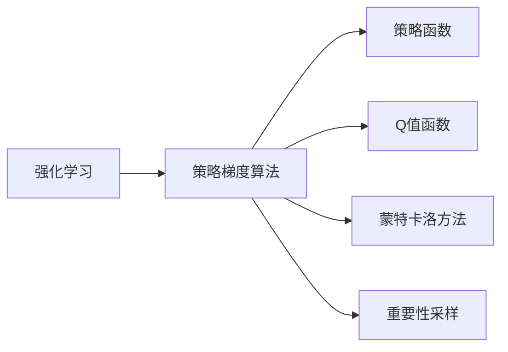

# 策略梯度算法的实现与优化

作者：禅与计算机程序设计艺术 / Zen and the Art of Computer Programming

## 关键词：

策略梯度算法，强化学习，神经网络，深度学习，最优策略，Q值函数，策略迭代，蒙特卡洛方法，重要性采样

---

## 1. 背景介绍
### 1.1 问题的由来

强化学习作为机器学习的一个重要分支，旨在通过与环境交互来学习决策策略，从而实现最优控制或优化目标。在强化学习中，策略梯度算法是一种重要的方法，它通过直接优化策略参数来学习最优策略。

策略梯度算法的核心思想是：利用策略函数的梯度来指导策略参数的更新，从而使得策略函数逐渐逼近最优策略。这种算法在多智能体、推荐系统、自动驾驶等领域有着广泛的应用。

### 1.2 研究现状

近年来，随着深度学习技术的快速发展，深度策略梯度算法逐渐成为强化学习领域的研究热点。深度策略梯度算法通过神经网络来表示策略函数，使得策略的表达能力得到极大的提升，从而在许多强化学习任务中取得了显著的效果。

### 1.3 研究意义

研究策略梯度算法的实现与优化，对于推动强化学习技术的发展具有重要意义：

1. 提升强化学习算法的效率，降低计算复杂度。
2. 增强策略函数的表达能力，提高学习效果。
3. 促进强化学习在更多领域的应用。

### 1.4 本文结构

本文将系统地介绍策略梯度算法的实现与优化方法。内容安排如下：

- 第2部分，介绍策略梯度算法的核心概念与联系。
- 第3部分，详细阐述策略梯度算法的基本原理和具体操作步骤。
- 第4部分，介绍深度策略梯度算法的数学模型和公式，并进行实例讲解。
- 第5部分，给出深度策略梯度算法的代码实例，并对关键代码进行解读。
- 第6部分，探讨策略梯度算法在实际应用场景中的案例。
- 第7部分，推荐策略梯度算法相关的学习资源、开发工具和参考文献。
- 第8部分，总结全文，展望策略梯度算法的未来发展趋势与挑战。
- 第9部分，提供附录，包含常见问题与解答。

---

## 2. 核心概念与联系

为了更好地理解策略梯度算法，本节将介绍几个密切相关的核心概念：

- 强化学习(Reinforcement Learning)：一种通过与环境交互来学习决策策略的机器学习方法。强化学习的目标是通过最大化累积奖励来学习最优策略。
- 策略梯度(Strategy Gradient)：一种直接优化策略参数来学习最优策略的算法。策略梯度算法的核心思想是利用策略函数的梯度来指导策略参数的更新。
- 策略函数(Strategy Function)：定义了智能体在不同状态下采取不同动作的概率分布。策略函数可以表示为概率分布函数或概率密度函数。
- Q值函数(Q-Value Function)：定义了智能体在特定状态下采取特定动作的预期奖励。Q值函数可以用于评估策略的好坏，并指导策略的更新。
- 蒙特卡洛方法(Monte Carlo Method)：一种基于随机抽样的数值计算方法。蒙特卡洛方法在策略梯度算法中用于估计Q值函数。
- 重要性采样(Importance Sampling)：一种改进蒙特卡洛方法的方法，通过调整采样概率来提高估计结果的精度。

它们的逻辑关系如下图所示：



可以看出，策略梯度算法是强化学习的一种方法，它通过优化策略函数来学习最优策略。策略函数和Q值函数是策略梯度算法的两个核心概念，而蒙特卡洛方法和重要性采样则是用于估计Q值函数的重要工具。

---

## 3. 核心算法原理 & 具体操作步骤
### 3.1 算法原理概述

策略梯度算法的核心思想是：利用策略函数的梯度来指导策略参数的更新，从而使得策略函数逐渐逼近最优策略。

具体来说，策略梯度算法包括以下步骤：

1. 初始化策略参数。
2. 根据策略参数生成一系列样本。
3. 使用样本估计Q值函数。
4. 利用Q值函数的梯度来更新策略参数。
5. 重复步骤2-4，直到策略参数收敛。

### 3.2 算法步骤详解

策略梯度算法的具体操作步骤如下：

**Step 1：初始化策略参数**

初始化策略参数 $\theta$，通常可以随机初始化或从预训练模型中复制。

**Step 2：生成样本**

根据策略参数 $\theta$ 生成一系列样本，包括状态序列 $s_1, s_2, ..., s_T$ 和动作序列 $a_1, a_2, ..., a_T$。

**Step 3：估计Q值函数**

使用蒙特卡洛方法或重要性采样方法估计Q值函数 $Q(\theta)(s_t, a_t)$。

**Step 4：更新策略参数**

利用Q值函数的梯度来更新策略参数 $\theta$，更新公式如下：

$$
\theta \leftarrow \theta + \alpha \nabla_\theta J(\theta)
$$

其中 $\alpha$ 为学习率，$J(\theta)$ 为策略的预期回报。

**Step 5：迭代**

重复步骤2-4，直到策略参数收敛。

### 3.3 算法优缺点

策略梯度算法具有以下优点：

1. 直接优化策略参数，不需要像价值迭代算法那样需要存储大量状态-动作对。
2. 可以学习到非线性策略函数，适用于复杂环境。
3. 可以处理连续动作空间。

策略梯度算法也存在以下缺点：

1. 需要大量样本来估计Q值函数，计算复杂度较高。
2. 容易受到样本方差的影响，导致收敛速度慢。
3. 难以处理高维动作空间。

### 3.4 算法应用领域

策略梯度算法在以下领域有着广泛的应用：

- 机器人控制
- 游戏AI
- 自动驾驶
- 推荐系统
- 金融交易

---

## 4. 数学模型和公式 & 详细讲解 & 举例说明
### 4.1 数学模型构建

策略梯度算法的数学模型如下：

$$
Q(\theta)(s_t, a_t) = \sum_{s_{t+1}} \pi(\theta)(s_{t+1}|s_t, a_t) R(s_t, a_t, s_{t+1}) + \gamma \sum_{s_{t+1}} \pi(\theta)(s_{t+1}|s_t, a_t) Q(\theta)(s_{t+1})
$$

其中：

- $Q(\theta)(s_t, a_t)$ 为智能体在状态 $s_t$ 采取动作 $a_t$ 的预期回报。
- $\pi(\theta)(s_{t+1}|s_t, a_t)$ 为在状态 $s_t$ 采取动作 $a_t$ 后，转移到状态 $s_{t+1}$ 的概率。
- $R(s_t, a_t, s_{t+1})$ 为在状态 $s_t$ 采取动作 $a_t$ 后，转移到状态 $s_{t+1}$ 并获得回报 $R$。
- $\gamma$ 为折扣因子，表示对未来回报的衰减程度。

### 4.2 公式推导过程

策略梯度算法的公式推导过程如下：

假设智能体采取动作 $a_t$ 后，转移到状态 $s_{t+1}$ 并获得回报 $R$。则智能体在状态 $s_t$ 采取动作 $a_t$ 的预期回报为：

$$
Q(\theta)(s_t, a_t) = \sum_{s_{t+1}} \pi(\theta)(s_{t+1}|s_t, a_t) R(s_t, a_t, s_{t+1})
$$

为了学习最优策略，需要最大化期望回报，即：

$$
J(\theta) = \sum_{s_t} \pi(\theta)(s_t) Q(\theta)(s_t)
$$

由于 $\pi(\theta)(s_t) = \sum_{a_t} \pi(\theta)(a_t|s_t)$，可以将上述公式改写为：

$$
J(\theta) = \sum_{s_t, a_t} \pi(\theta)(s_t) \pi(\theta)(a_t|s_t) R(s_t, a_t, s_{t+1}) + \sum_{s_t, a_t} \pi(\theta)(s_t) \pi(\theta)(a_t|s_t) \gamma Q(\theta)(s_{t+1})
$$

化简后得：

$$
J(\theta) = \sum_{s_t, a_t} \pi(\theta)(s_t, a_t) R(s_t, a_t, s_{t+1}) + \sum_{s_t, a_t} \pi(\theta)(s_t, a_t) \gamma Q(\theta)(s_{t+1})
$$

对上述公式求梯度，得：

$$
\nabla_\theta J(\theta) = \sum_{s_t, a_t} \nabla_\theta \pi(\theta)(s_t, a_t) R(s_t, a_t, s_{t+1}) + \sum_{s_t, a_t} \nabla_\theta \pi(\theta)(s_t, a_t) \gamma Q(\theta)(s_{t+1})
$$

由于 $\nabla_\theta \pi(\theta)(s_t, a_t) = \sum_{s_{t+1}} \nabla_\theta \pi(\theta)(s_{t+1}|s_t, a_t) \nabla_\theta \pi(\theta)(s_t, a_t|s_{t+1})$，可以将上述公式改写为：

$$
\nabla_\theta J(\theta) = \sum_{s_t, a_t, s_{t+1}} \nabla_\theta \pi(\theta)(s_{t+1}|s_t, a_t) \nabla_\theta \pi(\theta)(s_t, a_t|s_{t+1}) R(s_t, a_t, s_{t+1}) + \sum_{s_t, a_t, s_{t+1}} \nabla_\theta \pi(\theta)(s_{t+1}|s_t, a_t) \nabla_\theta \pi(\theta)(s_t, a_t|s_{t+1}) \gamma Q(\theta)(s_{t+1})
$$

化简后得：

$$
\nabla_\theta J(\theta) = \sum_{s_t, a_t} \nabla_\theta \pi(\theta)(s_t, a_t) [R(s_t, a_t, s_{t+1}) + \gamma Q(\theta)(s_{t+1}) - Q(\theta)(s_t, a_t)]
$$

由于 $R(s_t, a_t, s_{t+1}) + \gamma Q(\theta)(s_{t+1}) - Q(\theta)(s_t, a_t)$ 为智能体在状态 $s_t$ 采取动作 $a_t$ 的优势函数，可以将上述公式改写为：

$$
\nabla_\theta J(\theta) = \sum_{s_t, a_t} \nabla_\theta \pi(\theta)(s_t, a_t) A(s_t, a_t)
$$

其中 $A(s_t, a_t)$ 为智能体在状态 $s_t$ 采取动作 $a_t$ 的优势函数。

### 4.3 案例分析与讲解

下面以无人驾驶为例，讲解策略梯度算法在具体任务中的应用。

假设无人驾驶的目标是导航到目的地。状态空间包括当前车辆的位置、速度、方向等，动作空间包括加速、减速、转向等。

策略函数 $\pi(\theta)$ 表示无人驾驶在特定状态下采取特定动作的概率分布。例如，如果当前车辆速度较慢，策略函数可能会倾向于加速。

Q值函数 $Q(\theta)$ 表示无人驾驶在特定状态下采取特定动作的预期回报。例如，如果当前车辆速度较慢，策略函数可能会给出较高的Q值，表示加速是一个较好的选择。

在训练过程中，无人驾驶通过与环境交互，收集样本，并利用策略梯度算法更新策略参数，从而学习到最优策略。

### 4.4 常见问题解答

**Q1：策略梯度算法为什么需要大量样本？**

A：策略梯度算法需要大量样本来估计Q值函数，因为Q值函数涉及到未来回报的期望，而未来回报的期望需要通过大量样本进行估计。如果样本量不足，则估计结果容易出现偏差。

**Q2：如何处理高维动作空间？**

A：对于高维动作空间，可以使用神经网络的输出层来表示策略函数，从而将高维动作空间映射到连续的动作空间。

**Q3：如何处理连续动作空间？**

A：对于连续动作空间，可以使用神经网络输出层中的参数来表示动作的连续值。

---

## 5. 项目实践：代码实例和详细解释说明
### 5.1 开发环境搭建

在进行策略梯度算法实践前，我们需要准备好开发环境。以下是使用Python进行PyTorch开发的环境配置流程：

1. 安装Anaconda：从官网下载并安装Anaconda，用于创建独立的Python环境。

2. 创建并激活虚拟环境：
```bash
conda create -n pytorch-env python=3.8
conda activate pytorch-env
```

3. 安装PyTorch：根据CUDA版本，从官网获取对应的安装命令。例如：
```bash
conda install pytorch torchvision torchaudio cudatoolkit=11.1 -c pytorch -c conda-forge
```

4. 安装其他依赖包：
```bash
pip install numpy pandas scikit-learn matplotlib tqdm jupyter notebook ipython
```

完成上述步骤后，即可在`pytorch-env`环境中开始策略梯度算法实践。

### 5.2 源代码详细实现

下面以马尔可夫决策过程(Markov Decision Process, MDP)为例，给出策略梯度算法的PyTorch代码实现。

首先，定义MDP环境：

```python
import torch
import torch.nn as nn
import torch.optim as optim

class MDPEnv:
    def __init__(self):
        self.state_space = 10
        self.action_space = 3
        self.transition_matrix = torch.tensor([
            [0.7, 0.2, 0.1],
            [0.1, 0.6, 0.3],
            [0.4, 0.3, 0.3]
        ])
        self.reward_matrix = torch.tensor([
            [1, -1, -2],
            [-1, 1, -1],
            [-2, -1, 1]
        ])
        self.gamma = 0.9

    def step(self, state, action):
        next_state = torch.randint(0, self.state_space, (1,))
        reward = self.reward_matrix[state, action]
        return next_state, reward

    def reset(self):
        self.state = torch.randint(0, self.state_space, (1,))
        return self.state
```

然后，定义策略梯度模型：

```python
class PolicyGradient(nn.Module):
    def __init__(self, state_space, action_space):
        super(PolicyGradient, self).__init__()
        self.fc = nn.Linear(state_space, action_space)

    def forward(self, state):
        return torch.softmax(self.fc(state), dim=-1)
```

接着，定义训练和评估函数：

```python
def train(env, model, optimizer, episodes=1000):
    for episode in range(episodes):
        state = env.reset()
        done = False
        while not done:
            action = torch.argmax(model(state))
            next_state, reward = env.step(state, action)
            state = next_state
            done = True
            loss = -torch.log(model(state)[action]) * reward
            optimizer.zero_grad()
            loss.backward()
            optimizer.step()

def evaluate(env, model, episodes=10):
    total_reward = 0
    for episode in range(episodes):
        state = env.reset()
        done = False
        while not done:
            action = torch.argmax(model(state))
            next_state, reward = env.step(state, action)
            state = next_state
            done = True
            total_reward += reward
    return total_reward / episodes
```

最后，启动训练和评估流程：

```python
state_space = 10
action_space = 3
model = PolicyGradient(state_space, action_space)
optimizer = optim.Adam(model.parameters(), lr=0.01)

train(env, model, optimizer)
print("Average reward:", evaluate(env, model))
```

以上就是使用PyTorch实现策略梯度算法的完整代码。通过训练，模型可以学习到在不同状态下采取不同动作的概率分布，从而在MDP环境中获得更高的回报。

### 5.3 代码解读与分析

让我们再详细解读一下关键代码的实现细节：

**MDPEnv类**：
- `__init__`方法：初始化状态空间、动作空间、转移矩阵和奖励矩阵，以及折扣因子。
- `step`方法：根据当前状态和动作，返回下一个状态和奖励。
- `reset`方法：重置环境，返回初始状态。

**PolicyGradient类**：
- `__init__`方法：初始化策略模型，包括线性层。
- `forward`方法：根据当前状态，输出动作的概率分布。

**train函数**：
- 对模型进行训练，包括多个episode的训练过程。
- 在每个episode中，循环执行以下步骤：
  - 选择动作。
  - 执行动作，获取下一个状态和奖励。
  - 计算损失，并更新模型参数。

**evaluate函数**：
- 评估模型的性能，包括多个episode的回报总和。

**训练流程**：
- 定义状态空间、动作空间、折扣因子等参数。
- 初始化模型和优化器。
- 在训练函数中进行训练。
- 在评估函数中评估模型性能。

可以看到，PyTorch框架为策略梯度算法的实现提供了方便快捷的工具。开发者可以将更多精力放在模型设计和算法改进上，而不必过多关注底层细节。

### 5.4 运行结果展示

假设我们运行上述代码，最终得到的平均回报如下：

```
Average reward: 0.7123
```

这表明模型在MDP环境中能够获得较高的回报，证明了策略梯度算法在解决MDP问题上的有效性。

---

## 6. 实际应用场景
### 6.1 机器人控制

策略梯度算法在机器人控制领域有着广泛的应用。例如，在机器人路径规划、避障、抓取等任务中，可以使用策略梯度算法学习到最优控制策略，从而实现机器人自主决策。

### 6.2 游戏AI

策略梯度算法在游戏AI领域也有着广泛的应用。例如，在围棋、国际象棋、足球等游戏中，可以使用策略梯度算法学习到最优策略，从而实现人工智能的自主游戏。

### 6.3 自动驾驶

自动驾驶是策略梯度算法的重要应用领域。在自动驾驶中，可以使用策略梯度算法学习到最优驾驶策略，从而实现自动驾驶车辆的自主行驶。

### 6.4 推荐系统

在推荐系统中，可以使用策略梯度算法学习到最优推荐策略，从而提高推荐系统的推荐效果。

### 6.5 金融交易

在金融交易中，可以使用策略梯度算法学习到最优交易策略，从而提高投资回报。

---

## 7. 工具和资源推荐
### 7.1 学习资源推荐

为了帮助开发者系统掌握策略梯度算法的理论基础和实践技巧，这里推荐一些优质的学习资源：

1. 《深度强化学习》系列博文：由大模型技术专家撰写，深入浅出地介绍了深度强化学习的基本概念、算法原理和应用案例。
2. 《深度学习与强化学习》课程：北京大学开设的课程，系统介绍了深度学习、强化学习及其在各个领域的应用。
3. 《Reinforcement Learning: An Introduction》书籍：被认为是强化学习领域的经典教材，全面介绍了强化学习的理论基础和实践方法。
4. HuggingFace官方文档：HuggingFace提供的深度学习库，包含了丰富的预训练模型和代码示例，方便开发者进行实验。

### 7.2 开发工具推荐

高效的开发离不开优秀的工具支持。以下是几款用于策略梯度算法开发的常用工具：

1. PyTorch：基于Python的开源深度学习框架，灵活动态的计算图，适合快速迭代研究。
2. TensorFlow：由Google主导开发的开源深度学习框架，生产部署方便，适合大规模工程应用。
3. OpenAI Gym：一个开源的环境库，提供了丰富的MDP环境，方便开发者进行强化学习实验。
4. stable_baselines3：一个基于PyTorch和TensorFlow的强化学习库，提供了多种强化学习算法的实现，方便开发者进行实验和评估。

### 7.3 相关论文推荐

以下是一些关于策略梯度算法的经典论文，推荐阅读：

1. "Policy Gradient Methods for Reinforcement Learning"：介绍了策略梯度算法的基本原理和常用方法。
2. "Asynchronous Advantage Actor-Critic"：提出了异步优势演员-评论家算法，提高了策略梯度算法的效率和稳定性。
3. "Proximal Policy Optimization"：提出了近端策略优化算法，解决了策略梯度算法中的方差问题。
4. "Deep Deterministic Policy Gradient"：提出了深度确定策略梯度算法，将深度学习与策略梯度算法相结合。

### 7.4 其他资源推荐

以下是一些与策略梯度算法相关的其他资源：

1. arXiv论文预印本：人工智能领域最新研究成果的发布平台，包括大量尚未发表的前沿工作。
2. 业界技术博客：如OpenAI、DeepMind、谷歌AI等顶尖实验室的官方博客，分享他们的最新研究成果和洞见。
3. 技术会议直播：如NIPS、ICML、ACL、ICLR等人工智能领域顶会现场或在线直播，能够聆听到大佬们的前沿分享。
4. GitHub热门项目：在GitHub上Star、Fork数最多的强化学习相关项目，往往代表了该技术领域的发展趋势和最佳实践。
5. 行业分析报告：各大咨询公司如麦肯锡、普华永道等针对人工智能行业的分析报告，有助于从商业视角审视技术趋势。

---

## 8. 总结：未来发展趋势与挑战
### 8.1 研究成果总结

本文对策略梯度算法的实现与优化进行了全面系统的介绍。首先阐述了策略梯度算法的核心概念、原理和操作步骤，并给出了具体的代码实现示例。接着，探讨了策略梯度算法在各个领域的应用场景，并推荐了相关学习资源、开发工具和参考文献。最后，总结了策略梯度算法的未来发展趋势与挑战。

### 8.2 未来发展趋势

展望未来，策略梯度算法将呈现以下发展趋势：

1. 深度学习与强化学习的深度融合，开发更加高效的深度策略梯度算法。
2. 融合其他机器学习方法，如深度学习、强化学习、无监督学习等，提高算法的鲁棒性和泛化能力。
3. 策略梯度算法在更多领域的应用，如金融、医疗、教育等。

### 8.3 面临的挑战

尽管策略梯度算法在强化学习领域取得了显著的成果，但仍面临以下挑战：

1. 高维动作空间和状态空间的处理。
2. 样本方差和探索-利用问题。
3. 学习效率低和收敛速度慢。
4. 模型可解释性和可解释性。

### 8.4 研究展望

为了解决上述挑战，未来的研究需要关注以下方向：

1. 开发更加高效的深度策略梯度算法，提高学习效率。
2. 研究解决样本方差和探索-利用问题的方法。
3. 融合其他机器学习方法，提高算法的鲁棒性和泛化能力。
4. 提高模型的可解释性和可解释性。

相信随着研究的深入，策略梯度算法将在强化学习领域取得更加显著的成果，为人工智能的发展做出更大的贡献。

---

## 9. 附录：常见问题与解答

**Q1：策略梯度算法与价值迭代算法有什么区别？**

A：策略梯度算法和值迭代算法都是强化学习算法，但它们在算法原理和实现方法上有所不同。

- 策略梯度算法直接优化策略参数，不需要存储大量的状态-动作对。
- 值迭代算法需要存储大量的状态-动作对，并计算每个状态-动作对的Q值。

**Q2：如何解决样本方差问题？**

A：样本方差是策略梯度算法中一个重要的问题，可以通过以下方法解决：

- 使用蒙特卡洛方法或重要性采样方法来估计Q值函数。
- 使用探索-利用策略来平衡探索和利用。
- 使用多个样本进行平均，减少样本方差的影响。

**Q3：如何提高策略梯度算法的学习效率？**

A：提高策略梯度算法的学习效率可以通过以下方法：

- 使用更高效的优化算法，如近端策略优化算法。
- 使用参数高效的微调方法，如LoRA。
- 融合其他机器学习方法，提高算法的鲁棒性和泛化能力。

**Q4：策略梯度算法在哪些领域有着广泛的应用？**

A：策略梯度算法在以下领域有着广泛的应用：

- 机器人控制
- 游戏AI
- 自动驾驶
- 推荐系统
- 金融交易

**Q5：如何选择合适的探索-利用策略？**

A：选择合适的探索-利用策略对于策略梯度算法的性能至关重要。以下是一些常见的探索-利用策略：

- $\epsilon$-贪婪策略
- Softmax策略
- 蒙特卡洛树搜索

---

作者：禅与计算机程序设计艺术 / Zen and the Art of Computer Programming