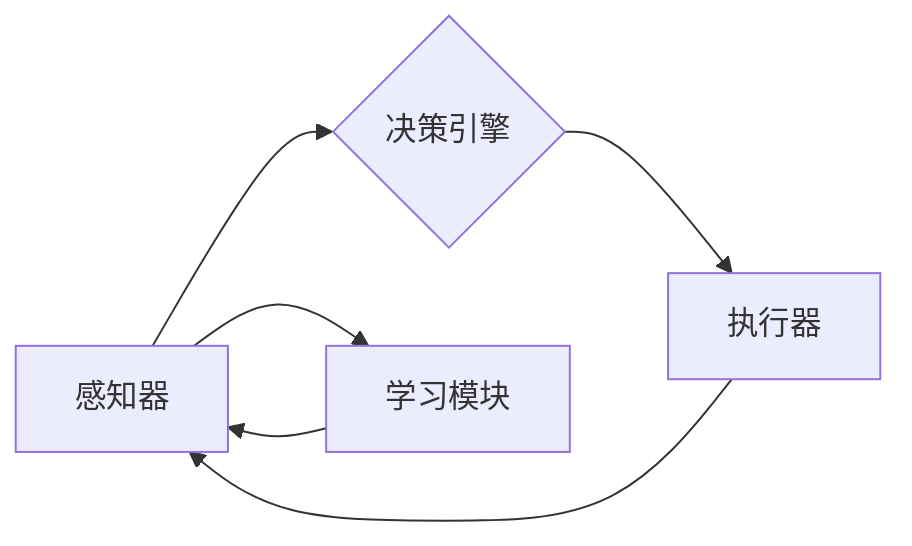

> AI Agent, 具身智能, 商业潜力, 市场前景, 机器学习, 人工智能, 智能决策, 自动化, 交互式体验

# AI Agent: AI的下一个风口 具身智能的商业潜力与市场前景

### 1. 背景介绍

人工智能（AI）技术的飞速发展，已经深刻地改变着我们的生活方式和工作方式。从智能助手到自动驾驶，从推荐系统到医疗诊断，AI的应用几乎无处不在。然而，随着技术的不断进步，一个新的AI风口正在悄然兴起——AI Agent。AI Agent，即人工智能代理，它是一种能够模拟人类智能行为的软件实体，能够在特定环境中进行自主决策和交互。本文将探讨AI Agent的核心概念、原理、应用场景以及其商业潜力和市场前景。

### 2. 核心概念与联系

#### 2.1 AI Agent的定义

AI Agent是一种具有感知、推理、学习和决策能力的软件实体。它能够感知环境中的信息，根据预设的规则或学习到的模式进行推理，并基于推理结果做出决策，从而影响环境状态。

#### 2.2 AI Agent的构成

一个典型的AI Agent通常包含以下组件：

- **感知器**：负责收集环境信息，如传感器数据、用户输入等。
- **决策引擎**：根据感知到的信息，结合预设规则或学习到的模式，生成行动指令。
- **执行器**：执行决策引擎生成的行动指令，如发送命令、移动机器人等。
- **学习模块**：通过学习环境反馈，优化感知器、决策引擎和执行器的性能。

#### 2.3 AI Agent的Mermaid流程图



### 3. 核心算法原理 & 具体操作步骤

#### 3.1 算法原理概述

AI Agent的核心算法原理主要包括以下几个方面：

- **机器学习**：通过机器学习算法，AI Agent可以从数据中学习环境模型、行为策略和决策规则。
- **强化学习**：通过与环境交互，AI Agent可以学习最优策略，以最大化长期奖励。
- **规划算法**：AI Agent可以提前规划未来的行动序列，以实现长期目标。
- **自然语言处理**：AI Agent可以理解和生成自然语言，实现与人类的自然交互。

#### 3.2 算法步骤详解

1. **数据收集与预处理**：收集AI Agent所需的环境数据，并进行预处理，如数据清洗、特征提取等。
2. **模型训练**：使用机器学习算法训练AI Agent的模型，如神经网络、决策树等。
3. **模型评估**：在测试集上评估模型的性能，根据评估结果调整模型参数。
4. **模型部署**：将训练好的模型部署到实际环境中，进行实时决策和执行。
5. **持续学习**：根据环境反馈，不断调整模型参数，优化AI Agent的性能。

#### 3.3 算法优缺点

**优点**：

- **自主性**：AI Agent能够在没有人类干预的情况下，自主地感知环境、做出决策和执行行动。
- **适应性**：AI Agent可以学习环境中的变化，并适应新的环境条件。
- **效率**：AI Agent可以自动化执行任务，提高工作效率。

**缺点**：

- **学习成本**：AI Agent的学习需要大量的数据和时间。
- **控制难度**：AI Agent的决策过程可能难以预测和控制。
- **伦理问题**：AI Agent的决策可能引发伦理道德问题。

#### 3.4 算法应用领域

AI Agent的应用领域非常广泛，包括但不限于：

- **智能客服**：通过自然语言处理技术，AI Agent可以与用户进行交互，提供24/7的客户服务。
- **自动驾驶**：AI Agent可以控制汽车在复杂道路环境中进行自主行驶。
- **智能家居**：AI Agent可以控制家中的电器设备，提供个性化服务。
- **智能医疗**：AI Agent可以辅助医生进行诊断和治疗。

### 4. 数学模型和公式 & 详细讲解 & 举例说明

#### 4.1 数学模型构建

AI Agent的数学模型通常包括以下几个部分：

- **状态空间**：表示AI Agent所处的环境状态。
- **动作空间**：表示AI Agent可以执行的动作。
- **奖励函数**：定义AI Agent行为的优劣。
- **策略函数**：将状态映射到动作。

#### 4.2 公式推导过程

以下是一个简单的Q-Learning算法的公式推导过程：

$$
Q(s, a) = \sum_{s'} Q(s', a) \cdot \pi(a'|s')
$$

其中，$Q(s, a)$ 表示在状态 $s$ 下执行动作 $a$ 的预期回报，$\pi(a'|s')$ 表示在状态 $s'$ 下执行动作 $a'$ 的概率。

#### 4.3 案例分析与讲解

以下是一个简单的智能客服AI Agent的案例分析：

- **状态**：用户输入的问题。
- **动作**：回答问题、转移至下一个问题、结束对话。
- **奖励函数**：根据用户满意度进行评分。
- **策略函数**：使用Q-Learning算法学习最优策略。

### 5. 项目实践：代码实例和详细解释说明

#### 5.1 开发环境搭建

为了实现上述智能客服AI Agent，我们需要以下开发环境：

- Python编程语言
- TensorFlow或PyTorch深度学习框架
- scikit-learn机器学习库

#### 5.2 源代码详细实现

以下是一个简单的智能客服AI Agent的Python代码实现：

```python
import numpy as np
import pandas as pd
from sklearn.preprocessing import LabelEncoder
from sklearn.model_selection import train_test_split
from sklearn.ensemble import RandomForestClassifier

# 加载数据
data = pd.read_csv('chat_data.csv')
X = data['question'].values
y = data['answer'].values

# 数据预处理
le = LabelEncoder()
X = le.fit_transform(X)
y = le.transform(y)
X_train, X_test, y_train, y_test = train_test_split(X, y, test_size=0.2, random_state=42)

# 训练模型
model = RandomForestClassifier()
model.fit(X_train, y_train)

# 评估模型
accuracy = model.score(X_test, y_test)
print(f"Accuracy: {accuracy:.2f}")

# 预测
question = input("Enter your question: ")
question_encoded = le.transform([question])
answer = model.predict(question_encoded)[0]
answer_decoded = le.inverse_transform([answer])[0]
print(f"Answer: {answer_decoded}")
```

#### 5.3 代码解读与分析

- 首先，我们使用Pandas库加载数据，并对问题进行编码。
- 然后，我们将数据划分为训练集和测试集，并使用随机森林分类器进行训练。
- 接着，我们评估模型的准确率，并使用模型对新的问题进行预测。
- 最后，我们解码预测结果，并输出答案。

### 6. 实际应用场景

#### 6.1 智能客服

AI Agent在智能客服领域的应用非常广泛，可以应用于以下场景：

- **客户咨询**：自动回答客户提出的问题，提高客服效率。
- **服务自动化**：自动处理常见的客户问题，减少人工客服工作量。
- **个性化服务**：根据客户需求提供个性化服务。

#### 6.2 自动驾驶

AI Agent在自动驾驶领域的应用可以包括：

- **感知环境**：通过传感器收集道路信息。
- **决策规划**：根据收集到的信息，规划行驶路线。
- **控制车辆**：控制车辆的转向、加速和制动。

#### 6.3 智能家居

AI Agent在智能家居领域的应用可以包括：

- **环境监测**：监测室内温度、湿度、光照等环境参数。
- **设备控制**：控制家电设备的开关、调节温度等。
- **安全监控**：监控家庭安全，及时报警。

### 6.4 未来应用展望

AI Agent的应用前景非常广阔，未来可能会在以下领域得到更广泛的应用：

- **智慧城市**：AI Agent可以用于交通管理、公共安全、环境保护等领域。
- **工业自动化**：AI Agent可以用于生产线的自动化控制。
- **教育**：AI Agent可以用于个性化教育、远程教育等领域。

### 7. 工具和资源推荐

#### 7.1 学习资源推荐

- **《人工智能：一种现代的方法》（Artificial Intelligence: A Modern Approach）**：这是一本经典的AI教材，适合初学者阅读。
- **《深度学习》（Deep Learning）**：这是一本关于深度学习的经典教材，适合有一定基础的读者阅读。
- **《强化学习：原理与应用》（Reinforcement Learning: An Introduction）**：这是一本关于强化学习的经典教材，适合对强化学习感兴趣的读者阅读。

#### 7.2 开发工具推荐

- **TensorFlow**：一个开源的深度学习框架，支持多种深度学习模型。
- **PyTorch**：一个开源的深度学习框架，具有良好的动态计算图。
- **scikit-learn**：一个开源的机器学习库，提供了多种机器学习算法。

#### 7.3 相关论文推荐

- **"The Quest for Artificial General Intelligence: A Survey of Advances"**：这篇论文综述了AGI的研究进展。
- **"DeepMind’s AlphaGo Master"**：这篇论文介绍了AlphaGo的原理和应用。
- **"A Brief Introduction to Reinforcement Learning"**：这篇论文介绍了强化学习的基本概念。

### 8. 总结：未来发展趋势与挑战

#### 8.1 研究成果总结

AI Agent作为AI领域的一个重要研究方向，已经取得了显著的成果。然而，AI Agent的发展仍然面临着许多挑战，如数据获取、模型优化、伦理道德等。

#### 8.2 未来发展趋势

未来，AI Agent的发展趋势主要包括以下几个方面：

- **多模态感知**：AI Agent将具备多模态感知能力，能够处理文本、图像、音频等多种类型的数据。
- **强化学习**：AI Agent将更加依赖于强化学习，以实现更复杂的决策和规划。
- **知识增强**：AI Agent将结合知识图谱等技术，实现更智能的决策和推理。

#### 8.3 面临的挑战

AI Agent的发展面临着以下挑战：

- **数据获取**：高质量的训练数据仍然是AI Agent发展的瓶颈。
- **模型优化**：如何设计更有效的模型和算法，是AI Agent发展的关键。
- **伦理道德**：AI Agent的决策可能引发伦理道德问题。

#### 8.4 研究展望

未来，AI Agent的研究需要从以下几个方面进行：

- **数据获取**：探索新的数据获取方法，如生成对抗网络、半监督学习等。
- **模型优化**：设计更有效的模型和算法，提高AI Agent的性能。
- **伦理道德**：制定AI Agent的伦理规范，确保AI Agent的决策符合伦理道德标准。

### 9. 附录：常见问题与解答

**Q1：AI Agent与智能助手有什么区别？**

A1：AI Agent是一种更通用的概念，它包括了智能助手的功能。智能助手通常专注于特定领域的任务，而AI Agent可以应用于更广泛的领域。

**Q2：AI Agent的决策过程如何保证其符合伦理道德标准？**

A2：为了确保AI Agent的决策符合伦理道德标准，我们需要从以下几个方面进行考虑：

- **设计AI Agent时，明确其目标和价值取向**。
- **建立AI Agent的决策规则和约束条件**。
- **对AI Agent的决策过程进行审计和监督**。

**Q3：AI Agent在哪些领域具有最大的商业潜力？**

A3：AI Agent在以下领域具有巨大的商业潜力：

- **金融服务**：如智能客服、风险管理、信用评估等。
- **医疗健康**：如疾病诊断、药物研发、健康管理等。
- **制造业**：如工业自动化、供应链管理、质量控制等。

**Q4：AI Agent的市场前景如何？**

A4：AI Agent的市场前景非常广阔。随着AI技术的不断发展，AI Agent将在更多领域得到应用，市场规模将持续增长。

---

作者：禅与计算机程序设计艺术 / Zen and the Art of Computer Programming