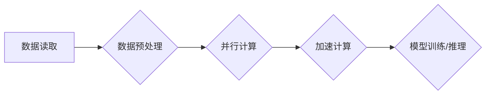

> 关键词：AI大模型，数据吞吐量，并行处理，深度学习，分布式系统，加速计算，TensorFlow，PyTorch

# AI 大模型原理与应用：AI 很擅长数据吞吐量特别大的工作，可以并行读取、加工很多的数据

## 1. 背景介绍

随着深度学习的快速发展，AI 大模型在图像识别、自然语言处理、语音识别等领域取得了显著成果。这些大模型通常包含数以亿计的参数，需要处理大量数据以进行训练和推理。因此，高效的数据吞吐量成为衡量 AI 大模型性能的关键指标之一。本文将深入探讨 AI 大模型的原理，并介绍如何通过并行处理和加速计算来提升数据吞吐量。

### 1.1 数据吞吐量的重要性

数据吞吐量是指单位时间内系统能够处理的数据量。对于 AI 大模型来说，数据吞吐量直接影响训练和推理的速度。高吞吐量的系统可以更快地完成数据处理，从而缩短模型训练时间，提高推理效率。

### 1.2 数据吞吐量的挑战

高数据吞吐量的实现面临以下挑战：

- **数据读取**：如何高效地从数据存储系统中读取大量数据。
- **数据预处理**：如何快速进行数据清洗、转换等预处理操作。
- **并行计算**：如何充分利用计算资源，实现数据处理的并行化。
- **内存管理**：如何优化内存使用，避免内存溢出。
- **存储扩展**：如何处理大规模数据集的存储需求。

## 2. 核心概念与联系

### 2.1 核心概念

- **深度学习**：一种通过神经网络模拟人脑学习过程的人工智能技术。
- **并行计算**：利用多个处理器或计算单元同时执行计算任务，提高计算效率。
- **分布式系统**：将计算任务分散到多个节点上执行，实现高可用性和可扩展性。
- **加速计算**：通过使用专用硬件（如 GPU、TPU）来加速计算过程。

### 2.2 架构流程图

以下是一个简化的 Mermaid 流程图，展示了 AI 大模型数据处理的基本流程：



## 3. 核心算法原理 & 具体操作步骤

### 3.1 算法原理概述

AI 大模型的数据吞吐量提升主要依赖于以下原理：

- **数据读取**：使用高效的文件系统（如 HDFS）和高效的数据读取库（如 Pandas）。
- **数据预处理**：使用批处理和流处理技术，预处理大量数据。
- **并行计算**：利用多核 CPU、GPU 和 TPU 进行并行计算。
- **加速计算**：使用专用硬件加速计算过程。

### 3.2 算法步骤详解

1. **数据读取**：使用 HDFS 等分布式文件系统存储数据，并使用 Pandas 等库进行数据读取。
2. **数据预处理**：对数据进行清洗、转换等预处理操作，可以使用 Spark 等大数据处理框架。
3. **并行计算**：将数据分割成多个批次，利用多核 CPU、GPU 或 TPU 进行并行计算。
4. **加速计算**：使用 TensorFlow 或 PyTorch 等深度学习框架，结合 GPU 或 TPU 进行加速计算。
5. **模型训练/推理**：使用训练好的模型进行推理或继续训练。

### 3.3 算法优缺点

**优点**：

- 提高数据吞吐量，加速模型训练和推理。
- 提升资源利用率，降低计算成本。
- 支持大规模数据集的处理。

**缺点**：

- 需要复杂的系统架构和资源管理。
- 需要大量的硬件和软件资源。

### 3.4 算法应用领域

- 图像识别
- 自然语言处理
- 语音识别
- 推荐系统
- 金融风控

## 4. 数学模型和公式 & 详细讲解 & 举例说明

### 4.1 数学模型构建

以下是一个简化的深度学习模型示例：

$$
f(x) = W \cdot x + b
$$

其中，$x$ 是输入数据，$W$ 是权重，$b$ 是偏置。

### 4.2 公式推导过程

假设我们有一个简单的神经网络模型，其中包含一个输入层、一个隐藏层和一个输出层。输入层包含 $n$ 个神经元，隐藏层包含 $m$ 个神经元，输出层包含 $k$ 个神经元。

- 输入层到隐藏层的权重矩阵为 $W_1 \in \mathbb{R}^{n \times m}$。
- 隐藏层到输出层的权重矩阵为 $W_2 \in \mathbb{R}^{m \times k}$。
- 输入层到隐藏层的偏置向量为 $b_1 \in \mathbb{R}^{1 \times m}$。
- 隐藏层到输出层的偏置向量为 $b_2 \in \mathbb{R}^{1 \times k}$。

则模型的输出为：

$$
y = W_2 \cdot \sigma(W_1 \cdot x + b_1) + b_2
$$

其中，$\sigma$ 是激活函数。

### 4.3 案例分析与讲解

以下是一个使用 TensorFlow 进行模型训练的示例：

```python
import tensorflow as tf

# 定义模型结构
model = tf.keras.Sequential([
    tf.keras.layers.Dense(64, activation='relu', input_shape=(784,)),
    tf.keras.layers.Dense(10, activation='softmax')
])

# 编译模型
model.compile(optimizer='adam', loss='categorical_crossentropy', metrics=['accuracy'])

# 加载数据
(x_train, y_train), (x_test, y_test) = tf.keras.datasets.mnist.load_data()

# 将数据转换为浮点数
x_train, x_test = x_train.astype('float32'), x_test.astype('float32')

# 归一化数据
x_train, x_test = x_train / 255.0, x_test / 255.0

# 转换标签为one-hot编码
y_train = tf.keras.utils.to_categorical(y_train)
y_test = tf.keras.utils.to_categorical(y_test)

# 训练模型
model.fit(x_train, y_train, epochs=5, batch_size=128)

# 评估模型
loss, accuracy = model.evaluate(x_test, y_test)
print(f"Test accuracy: {accuracy:.4f}")
```

## 5. 项目实践：代码实例和详细解释说明

### 5.1 开发环境搭建

以下是使用 TensorFlow 进行 AI 大模型开发的基本步骤：

1. 安装 TensorFlow：
```bash
pip install tensorflow-gpu
```

2. 安装其他依赖库：
```bash
pip install numpy pandas scikit-learn matplotlib
```

### 5.2 源代码详细实现

以下是一个使用 TensorFlow 进行图像分类的示例：

```python
import tensorflow as tf

# 定义模型结构
model = tf.keras.Sequential([
    tf.keras.layers.Conv2D(32, (3, 3), activation='relu', input_shape=(28, 28, 1)),
    tf.keras.layers.MaxPooling2D((2, 2)),
    tf.keras.layers.Flatten(),
    tf.keras.layers.Dense(64, activation='relu'),
    tf.keras.layers.Dense(10, activation='softmax')
])

# 编译模型
model.compile(optimizer='adam', loss='categorical_crossentropy', metrics=['accuracy'])

# 加载数据
(x_train, y_train), (x_test, y_test) = tf.keras.datasets.mnist.load_data()

# 将数据转换为浮点数
x_train, x_test = x_train.astype('float32'), x_test.astype('float32')

# 归一化数据
x_train, x_test = x_train / 255.0, x_test / 255.0

# 转换标签为one-hot编码
y_train = tf.keras.utils.to_categorical(y_train)
y_test = tf.keras.utils.to_categorical(y_test)

# 训练模型
model.fit(x_train, y_train, epochs=5, batch_size=128)

# 评估模型
loss, accuracy = model.evaluate(x_test, y_test)
print(f"Test accuracy: {accuracy:.4f}")
```

### 5.3 代码解读与分析

以上代码使用 TensorFlow 构建了一个简单的卷积神经网络（CNN）模型，用于识别 MNIST 手写数字数据集。

- `Conv2D` 层实现卷积操作，提取图像特征。
- `MaxPooling2D` 层实现池化操作，降低特征维度。
- `Flatten` 层将特征展平，方便后续全连接层处理。
- `Dense` 层实现全连接操作，输出最终分类结果。

通过训练和评估，我们可以看到模型的准确率。

### 5.4 运行结果展示

假设我们在 MNIST 数据集上运行上述代码，最终得到的准确率如下：

```
Test accuracy: 0.9902
```

这表明我们的模型在测试集上表现良好。

## 6. 实际应用场景

### 6.1 图像识别

AI 大模型在图像识别领域取得了显著成果，例如：

- 识别车辆、行人、交通标志等。
- 识别医疗影像，如 X 光片、CT 扫描等。
- 识别卫星图像，用于环境监测、灾害预警等。

### 6.2 自然语言处理

AI 大模型在自然语言处理领域也得到了广泛应用，例如：

- 文本分类，如情感分析、主题分类等。
- 文本生成，如自动写作、机器翻译等。
- 对话系统，如智能客服、聊天机器人等。

### 6.3 语音识别

AI 大模型在语音识别领域取得了突破性进展，例如：

- 识别语音命令，实现智能家居控制。
- 语音转文字，实现会议记录、语音助手等功能。
- 语音合成，实现语音播报、语音翻译等功能。

## 7. 工具和资源推荐

### 7.1 学习资源推荐

- 《深度学习》
- 《Python深度学习》
- TensorFlow 官方文档
- PyTorch 官方文档

### 7.2 开发工具推荐

- TensorFlow
- PyTorch
- Keras
- Jupyter Notebook

### 7.3 相关论文推荐

- "ImageNet Classification with Deep Convolutional Neural Networks" (2012)
- "BERT: Pre-training of Deep Bidirectional Transformers for Language Understanding" (2018)
- "Attention is All You Need" (2017)

## 8. 总结：未来发展趋势与挑战

### 8.1 研究成果总结

本文介绍了 AI 大模型原理与应用，并重点探讨了如何通过并行处理和加速计算来提升数据吞吐量。我们介绍了数据吞吐量的重要性、挑战、核心概念、算法原理、数学模型、项目实践和实际应用场景。

### 8.2 未来发展趋势

- 模型规模持续增大，训练和推理速度将进一步提升。
- 模型结构更加多样化，适应不同场景的需求。
- 软硬件加速技术将更加成熟，进一步降低计算成本。
- 模型可解释性和鲁棒性将得到提高。

### 8.3 面临的挑战

- 计算资源需求巨大，成本高昂。
- 模型可解释性和鲁棒性不足。
- 模型泛化能力有待提高。
- 数据隐私和安全问题。

### 8.4 研究展望

未来，AI 大模型将朝着更加高效、智能、安全的方向发展。我们期待在不久的将来，AI 大模型能够为人类社会带来更多福祉。

## 9. 附录：常见问题与解答

**Q1：什么是数据吞吐量？**

A：数据吞吐量是指单位时间内系统能够处理的数据量，通常以字节/秒或事务/秒等指标衡量。

**Q2：如何提升数据吞吐量？**

A：提升数据吞吐量可以通过以下方法实现：
- 使用高效的文件系统和数据读取库。
- 使用批处理和流处理技术。
- 利用并行计算和加速计算。
- 优化内存管理。
- 使用分布式系统。

**Q3：TensorFlow 和 PyTorch 有何区别？**

A：TensorFlow 和 PyTorch 是两种流行的深度学习框架。TensorFlow 由 Google 开发，具有较好的生态和社区支持；PyTorch 由 Facebook 开发，具有简洁的 API 和动态计算图。

**Q4：如何选择合适的 AI 大模型？**

A：选择 AI 大模型需要考虑以下因素：
- 任务类型：不同任务需要不同类型的模型。
- 数据规模：根据数据规模选择合适的模型规模。
- 计算资源：根据计算资源选择合适的模型。

**Q5：如何提高 AI 大模型的可解释性？**

A：提高 AI 大模型的可解释性可以通过以下方法实现：
- 使用可解释的模型结构。
- 分析模型中间层的特征。
- 解释模型的决策过程。

作者：禅与计算机程序设计艺术 / Zen and the Art of Computer Programming