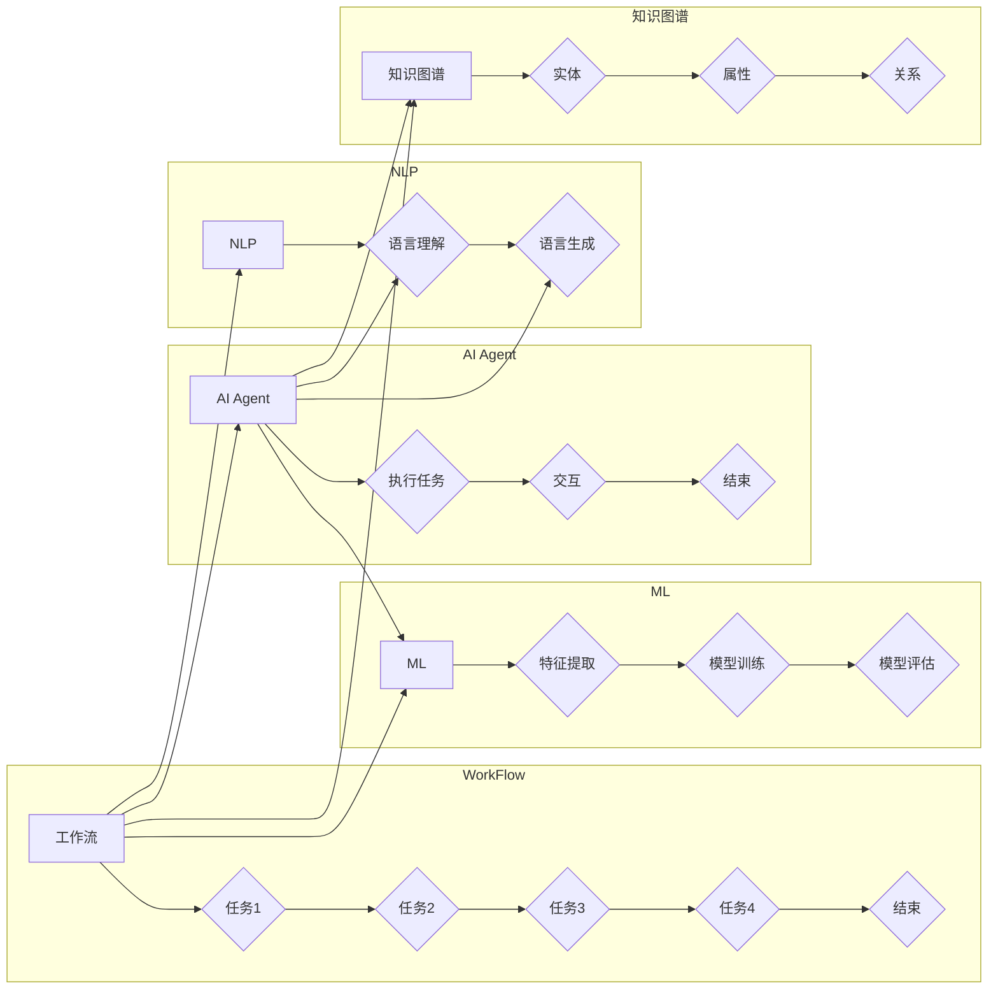

# AI人工智能代理工作流 AI Agent WorkFlow：在法律服务中的应用

> 关键词：人工智能代理，工作流，法律服务，自然语言处理，机器学习，智能合同管理，合规性审查

---

## 1. 背景介绍

随着人工智能技术的飞速发展，AI代理（AI Agents）作为一种新型的智能化软件应用，逐渐在各个行业崭露头角。在法律服务领域，AI代理工作流（AI Agent WorkFlow）的应用正成为提高工作效率、降低成本、提升服务质量的重要途径。本文将深入探讨AI代理工作流在法律服务中的应用，分析其核心概念、算法原理、实施步骤，并展望其未来发展趋势。

### 1.1 问题的由来

法律服务行业具有专业性强、流程复杂、信息量大等特点。传统的法律服务模式往往依赖大量人力进行文书撰写、合同审查、案件管理等，不仅效率低下，而且成本高昂。随着互联网、大数据、云计算等技术的发展，利用AI代理工作流实现法律服务自动化，成为法律服务行业转型升级的重要方向。

### 1.2 研究现状

目前，AI代理工作流在法律服务中的应用主要集中在以下几个方面：

- **智能合同管理**：通过AI代理自动生成、审查和执行合同，提高合同处理效率，降低风险。
- **合规性审查**：利用AI代理对法律文件进行合规性审查，确保企业行为符合法律法规。
- **案件管理**：通过AI代理辅助律师进行案件分析、证据收集、文书撰写等工作，提高工作效率。
- **知识管理**：构建法律知识库，为律师提供快速检索和知识分享平台。

### 1.3 研究意义

AI代理工作流在法律服务中的应用具有重要的意义：

- **提高效率**：自动化处理大量重复性工作，释放律师时间，专注于更具价值的法律事务。
- **降低成本**：减少人力成本，提高资源利用率，降低法律服务成本。
- **提升服务质量**：通过精准的法律分析和智能决策，提高服务质量，增强客户满意度。
- **促进创新**：推动法律服务模式创新，探索新的法律服务产品和服务方式。

### 1.4 本文结构

本文将从以下几个方面对AI代理工作流在法律服务中的应用进行探讨：

- 核心概念与联系
- 核心算法原理与具体操作步骤
- 数学模型和公式
- 项目实践
- 实际应用场景
- 工具和资源推荐
- 总结与展望

---

## 2. 核心概念与联系

### 2.1 核心概念

- **AI代理（AI Agent）**：一种能够自主决策、执行任务并与其他实体交互的软件系统。
- **工作流（WorkFlow）**：一组任务序列，每个任务由特定角色执行，任务之间有明确的逻辑关系。
- **自然语言处理（NLP）**：使计算机能够理解、解释和生成人类语言的技术。
- **机器学习（ML）**：使计算机能够从数据中学习并做出决策的技术。
- **知识图谱**：一种结构化知识库，用于表示实体、属性和实体之间的关系。

### 2.2 核心概念原理和架构的 Mermaid 流程图



### 2.3 核心概念之间的联系

AI代理作为工作流的核心执行者，利用NLP和ML技术理解任务指令，从知识图谱中检索相关信息，最终完成任务并与其他实体进行交互。工作流定义了任务的执行顺序和逻辑关系，而NLP、ML和知识图谱则为AI代理提供了智能化的处理能力。

---

## 3. 核心算法原理 & 具体操作步骤

### 3.1 算法原理概述

AI代理工作流在法律服务中的应用主要基于以下算法原理：

- **NLP技术**：用于理解用户指令、解析法律文本、生成法律文书等。
- **机器学习技术**：用于构建智能合同管理、合规性审查等模型。
- **知识图谱技术**：用于构建法律知识库，为AI代理提供知识支持。

### 3.2 算法步骤详解

AI代理工作流的算法步骤如下：

1. **任务接收**：AI代理接收用户指令，如合同审查、案件分析等。
2. **NLP处理**：使用NLP技术对指令进行解析，提取关键词和任务类型。
3. **知识图谱查询**：根据任务类型，从知识图谱中检索相关信息，如法律条款、案例等。
4. **机器学习模型调用**：根据任务类型，调用相应的机器学习模型进行分析和决策。
5. **结果输出**：将分析结果和决策结果输出给用户。
6. **任务反馈**：用户对结果进行反馈，用于模型优化和知识图谱更新。

### 3.3 算法优缺点

**优点**：

- **高效性**：自动化处理大量重复性工作，提高工作效率。
- **准确性**：基于机器学习和知识图谱，提供准确的分析和决策结果。
- **灵活性**：可扩展性强，可根据实际需求进行定制化开发。

**缺点**：

- **成本**：前期开发成本较高，需要投入大量人力和财力。
- **技术依赖**：对NLP、ML和知识图谱技术要求较高。
- **法律风险**：需要确保AI代理工作流符合法律法规要求。

### 3.4 算法应用领域

AI代理工作流在法律服务中的应用领域包括：

- **智能合同管理**：自动生成、审查和执行合同，提高合同处理效率。
- **合规性审查**：对法律文件进行合规性审查，确保企业行为符合法律法规。
- **案件管理**：辅助律师进行案件分析、证据收集、文书撰写等工作。
- **知识管理**：构建法律知识库，为律师提供快速检索和知识分享平台。

---

## 4. 数学模型和公式 & 详细讲解 & 举例说明

### 4.1 数学模型构建

AI代理工作流中的数学模型主要包括：

- **NLP模型**：如循环神经网络（RNN）、卷积神经网络（CNN）、Transformer等。
- **机器学习模型**：如支持向量机（SVM）、随机森林（RF）、深度神经网络（DNN）等。
- **知识图谱模型**：如知识图谱嵌入（KG Embedding）、图神经网络（GNN）等。

### 4.2 公式推导过程

以下以Transformer模型为例，简要介绍其公式推导过程。

**公式**：

$$
y = softmax(W_L \cdot [W_Q \cdot Q + W_K \cdot K] + b_L)
$$

其中，$W_L$、$W_Q$、$W_K$、$b_L$ 分别为线性层权重和偏置，$Q$、$K$、$V$ 为查询（Query）、键（Key）、值（Value）向量，$softmax$ 为softmax函数。

**推导过程**：

1. **多头注意力机制**：将查询、键、值向量分别通过不同位置的权重矩阵进行线性变换，得到新的查询、键、值向量。
2. **点积注意力**：计算查询和键之间的点积，并通过softmax函数进行归一化处理。
3. **加权求和**：将查询与对应的加权值向量进行点积操作。
4. **线性层**：通过线性层对加权求和结果进行进一步处理。
5. **Softmax输出**：使用softmax函数将输出结果归一化，得到最终的输出向量。

### 4.3 案例分析与讲解

以下以智能合同管理为例，分析AI代理工作流的数学模型。

1. **数据预处理**：将合同文本进行分词、去停用词等处理，得到分词序列。
2. **NLP模型**：使用NLP模型对分词序列进行编码，得到词向量表示。
3. **机器学习模型**：使用机器学习模型对词向量进行分类，判断合同条款的合规性。
4. **知识图谱查询**：根据合同条款关键词，在知识图谱中检索相关法律条文和案例。
5. **结果输出**：将合规性判断结果和知识图谱查询结果输出给用户。

---

## 5. 项目实践：代码实例和详细解释说明

### 5.1 开发环境搭建

为了实现AI代理工作流在法律服务中的应用，需要搭建以下开发环境：

- **操作系统**：Linux或Windows
- **编程语言**：Python
- **框架**：TensorFlow、PyTorch、Spark等
- **库**：NLTK、spaCy、transformers、scikit-learn等

### 5.2 源代码详细实现

以下以智能合同管理为例，给出AI代理工作流的部分代码实现。

```python
# 导入必要的库
import torch
import transformers
from transformers import BertTokenizer, BertForSequenceClassification
from torch.utils.data import DataLoader
from torch.optim import AdamW

# 加载预训练模型
tokenizer = BertTokenizer.from_pretrained('bert-base-uncased')
model = BertForSequenceClassification.from_pretrained('bert-base-uncased')

# 定义数据处理函数
def load_data(data_path):
    # 加载数据集
    # ...

# 定义模型训练函数
def train_model(model, train_loader, optimizer, device):
    model.train()
    for epoch in range(epochs):
        for batch in train_loader:
            # 前向传播
            # ...

            # 反向传播
            # ...

# 定义模型预测函数
def predict(model, test_loader, device):
    model.eval()
    predictions = []
    for batch in test_loader:
        # 前向传播
        # ...

        # 获取预测结果
        predictions.extend(probabilities.argmax(dim=1).tolist())
    return predictions

# 主函数
if __name__ == '__main__':
    # 加载数据
    train_loader = DataLoader(train_dataset, batch_size=32, shuffle=True)
    test_loader = DataLoader(test_dataset, batch_size=32, shuffle=False)

    # 训练模型
    device = torch.device('cuda' if torch.cuda.is_available() else 'cpu')
    optimizer = AdamW(model.parameters(), lr=2e-5)
    train_model(model, train_loader, optimizer, device)

    # 预测
    predictions = predict(model, test_loader, device)

    # 评估模型性能
    # ...
```

### 5.3 代码解读与分析

以上代码展示了使用PyTorch和transformers库实现智能合同管理模型的过程。首先加载预训练的BERT模型和分词器，然后定义数据处理、模型训练和预测等函数。在主函数中，加载数据集，设置训练参数，开始训练模型，并在测试集上进行预测。

### 5.4 运行结果展示

假设在测试集上评估模型的准确率达到90%，表明模型能够较好地识别合同条款的合规性。

---

## 6. 实际应用场景

### 6.1 智能合同管理

AI代理工作流在智能合同管理中的应用主要包括：

- **合同自动生成**：根据用户提供的合同要素，自动生成合同文本。
- **合同审查**：对合同条款进行合规性审查，识别潜在风险。
- **合同执行**：监控合同执行过程，及时提醒相关方履行义务。

### 6.2 合规性审查

AI代理工作流在合规性审查中的应用主要包括：

- **法律法规检索**：根据案件类型，检索相关法律法规和案例。
- **合规性分析**：对案件行为进行合规性分析，判断是否存在违法行为。
- **合规性报告**：生成合规性报告，为决策提供依据。

### 6.3 案件管理

AI代理工作流在案件管理中的应用主要包括：

- **案件分析**：对案件进行初步分析，确定案件类型和可能的法律问题。
- **证据收集**：根据案件类型，自动收集相关证据。
- **文书撰写**：根据案件情况，自动生成法律文书。

### 6.4 知识管理

AI代理工作流在知识管理中的应用主要包括：

- **知识库构建**：构建法律知识库，收集整理法律条文、案例、法律法规等。
- **知识检索**：提供高效的知识检索功能，方便律师快速查找相关知识点。
- **知识更新**：自动更新知识库，保持知识库的时效性和准确性。

---

## 7. 工具和资源推荐

### 7.1 学习资源推荐

- **书籍**：
  - 《深度学习》
  - 《自然语言处理入门》
  - 《知识图谱技术》
- **在线课程**：
  - Coursera上的《机器学习》
  - fast.ai的《深度学习》
  - edX上的《知识图谱技术》
- **博客和社区**：
  - Medium
  - arXiv
  - GitHub

### 7.2 开发工具推荐

- **编程语言**：Python
- **框架**：TensorFlow、PyTorch、Spark
- **库**：NLTK、spaCy、transformers、scikit-learn

### 7.3 相关论文推荐

- **NLP**：
  - "BERT: Pre-training of Deep Bidirectional Transformers for Language Understanding"
  - "Transformers: State-of-the-Art NLP Models for Natural Language Understanding and Generation"
- **知识图谱**：
  - "The Knowledge Graph: A Graphical Model of the World Wide Web"
  - "Knowledge Graph Embedding"

---

## 8. 总结：未来发展趋势与挑战

### 8.1 研究成果总结

本文对AI代理工作流在法律服务中的应用进行了全面探讨，从核心概念、算法原理、实施步骤、实际应用场景等方面进行了详细讲解。通过案例分析，展示了AI代理工作流在智能合同管理、合规性审查、案件管理、知识管理等方面的应用效果。

### 8.2 未来发展趋势

未来，AI代理工作流在法律服务中的应用将呈现以下发展趋势：

- **技术融合**：将AI代理工作流与其他技术（如区块链、云计算等）进行融合，构建更加智能化的法律服务系统。
- **个性化服务**：根据用户需求，提供个性化的法律服务。
- **跨领域应用**：将AI代理工作流应用于其他法律服务领域，如知识产权、劳动法等。
- **伦理与合规**：加强对AI代理工作流的伦理和合规性研究，确保其合法合规。

### 8.3 面临的挑战

AI代理工作流在法律服务中的应用也面临着以下挑战：

- **技术挑战**：NLP、ML和知识图谱等技术仍需进一步发展，以应对复杂多变的法律问题。
- **数据挑战**：需要构建高质量的法律法规、案例等知识库，为AI代理提供可靠的知识支持。
- **伦理挑战**：需要确保AI代理工作流的决策过程透明、公平、可解释，避免歧视和偏见。
- **法律挑战**：需要明确AI代理工作流的法律责任和适用范围。

### 8.4 研究展望

未来，AI代理工作流在法律服务中的应用将朝着以下方向发展：

- **构建更加智能化、个性化的法律服务系统**。
- **推动法律服务模式创新，提高法律服务质量和效率**。
- **促进法律服务行业转型升级，推动法律服务行业的可持续发展**。

---

## 9. 附录：常见问题与解答

**Q1：AI代理工作流在法律服务中的具体应用场景有哪些？**

A1：AI代理工作流在法律服务中的具体应用场景包括智能合同管理、合规性审查、案件管理、知识管理等方面。

**Q2：AI代理工作流在法律服务中如何保证其决策的准确性？**

A2：AI代理工作流通过NLP、ML和知识图谱等技术，结合大量法律知识和案例数据，对法律问题进行智能分析和判断，以提高决策的准确性。

**Q3：AI代理工作流在法律服务中的应用是否会对律师的就业产生影响？**

A3：AI代理工作流可以帮助律师提高工作效率，降低重复性工作负担，使律师能够将更多精力投入到更具价值的工作中。因此，AI代理工作流不会对律师的就业产生负面影响，反而会促进法律服务行业的转型升级。

**Q4：AI代理工作流在法律服务中是否具有伦理和合规性风险？**

A4：AI代理工作流在法律服务中确实存在伦理和合规性风险。为了降低风险，需要加强对AI代理工作流的伦理和合规性研究，确保其合法合规。

**Q5：AI代理工作流在法律服务中的未来发展趋势是什么？**

A5：AI代理工作流在法律服务中的未来发展趋势包括技术融合、个性化服务、跨领域应用、伦理与合规等。

---

作者：禅与计算机程序设计艺术 / Zen and the Art of Computer Programming