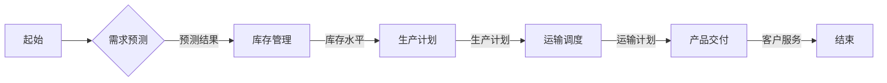

# AI人工智能代理工作流AI Agent WorkFlow：AI代理在供应链管理中的创新运用

> 关键词：AI代理，工作流，供应链管理，自动化，决策支持，智能优化，机器学习，深度学习

## 1. 背景介绍

### 1.1 问题的由来

供应链管理是现代企业运营的核心，它涉及到从原材料采购到产品交付的整个流程。随着全球化竞争的加剧和消费者需求的变化，供应链管理面临着更高的挑战。传统的供应链管理依赖人工决策，效率低、成本高，且难以应对复杂多变的供应链环境。

近年来，人工智能（AI）技术的快速发展为供应链管理带来了新的机遇。AI代理（AI Agent）作为一种基于AI的智能体，能够模仿人类智能，自动执行任务、进行决策和优化。AI代理工作流（AI Agent WorkFlow）将AI代理应用于供应链管理，实现了自动化、智能化和优化的目标。

### 1.2 研究现状

AI代理在供应链管理中的应用主要集中在以下几个方面：

- **需求预测**：利用机器学习算法分析历史销售数据和市场趋势，预测未来需求，帮助企业制定合理的生产计划和库存策略。
- **库存管理**：通过智能优化算法优化库存水平，减少库存成本，提高库存周转率。
- **运输调度**：自动规划运输路线，优化运输成本和时间，提高运输效率。
- **风险管理**：识别和评估供应链中的潜在风险，制定风险应对策略。
- **客户服务**：提供智能客服，提高客户满意度和忠诚度。

### 1.3 研究意义

AI代理工作流在供应链管理中的应用具有以下重要意义：

- **提高效率**：自动化执行重复性任务，提高供应链管理效率。
- **降低成本**：优化库存、运输和风险管理，降低供应链运营成本。
- **增强决策支持**：提供数据驱动的决策支持，提高决策质量。
- **提升竞争力**：增强企业的供应链柔性和响应能力，提升市场竞争力。

### 1.4 本文结构

本文将围绕AI代理工作流在供应链管理中的应用展开，主要包括以下几个部分：

- 核心概念与联系：介绍AI代理、工作流和供应链管理的相关概念，并绘制Mermaid流程图。
- 核心算法原理 & 具体操作步骤：阐述AI代理工作流的算法原理和操作步骤。
- 数学模型和公式 & 详细讲解 & 举例说明：介绍AI代理工作流中的数学模型和公式，并通过案例进行分析。
- 项目实践：提供AI代理工作流的代码实例和详细解释。
- 实际应用场景：探讨AI代理工作流在不同供应链管理场景中的应用。
- 工具和资源推荐：推荐相关学习资源和开发工具。
- 总结：总结研究成果，展望未来发展趋势和挑战。

## 2. 核心概念与联系

### 2.1 核心概念

#### AI代理

AI代理是一种能够模拟人类智能行为的实体，它可以自主感知环境、学习知识、做出决策并采取行动。在供应链管理中，AI代理可以模拟采购、库存、物流等环节的专家行为。

#### 工作流

工作流是一种业务流程自动化工具，它定义了业务流程中的任务、步骤和规则。在AI代理工作流中，工作流定义了AI代理的执行流程，包括任务分配、决策逻辑和执行策略。

#### 供应链管理

供应链管理涉及到从原材料采购到产品交付的整个流程。它包括采购、生产、库存、运输、分销和客户服务等多个环节。

### 2.2 Mermaid流程图

以下是AI代理工作流的核心概念Mermaid流程图：



## 3. 核心算法原理 & 具体操作步骤

### 3.1 算法原理概述

AI代理工作流的核心算法包括以下几个部分：

- **机器学习算法**：用于需求预测、库存管理和风险管理等任务。
- **深度学习算法**：用于复杂决策和优化问题。
- **优化算法**：用于运输调度和库存优化等任务。

### 3.2 算法步骤详解

AI代理工作流的操作步骤如下：

1. **需求预测**：收集历史销售数据和市场趋势，使用机器学习算法进行需求预测。
2. **库存管理**：根据需求预测结果和库存水平，使用优化算法制定库存策略。
3. **生产计划**：根据库存策略和生产能力，制定生产计划。
4. **运输调度**：根据生产计划和运输需求，使用优化算法规划运输路线。
5. **产品交付**：执行运输计划，完成产品交付。
6. **客户服务**：提供智能客服，提高客户满意度和忠诚度。

### 3.3 算法优缺点

#### 优点

- **自动化**：自动化执行重复性任务，提高效率。
- **智能化**：基于数据驱动，提供决策支持。
- **优化**：使用优化算法，提高供应链运营效率。

#### 缺点

- **数据依赖**：需要大量高质量的数据。
- **模型复杂**：算法模型较为复杂，需要专业知识。
- **成本较高**：开发和维护成本较高。

### 3.4 算法应用领域

AI代理工作流在以下供应链管理领域具有广泛应用：

- **需求预测**
- **库存管理**
- **生产计划**
- **运输调度**
- **风险管理**
- **客户服务**

## 4. 数学模型和公式 & 详细讲解 & 举例说明

### 4.1 数学模型构建

以下是一个简单的需求预测数学模型：

$$
 \hat{D_t} = f(X_t, \theta) 
$$

其中，$\hat{D_t}$ 表示未来时间 $t$ 的需求预测值，$X_t$ 表示影响需求的因素，$\theta$ 表示模型参数。

### 4.2 公式推导过程

需求预测模型的推导过程如下：

1. **收集数据**：收集历史销售数据和市场趋势数据。
2. **特征工程**：提取影响需求的关键特征。
3. **模型选择**：选择合适的机器学习模型。
4. **模型训练**：使用历史数据训练模型，优化模型参数。
5. **预测**：使用模型预测未来需求。

### 4.3 案例分析与讲解

以下是一个库存管理案例：

假设某企业的产品需求服从正态分布，平均需求为100件，标准差为20件。企业希望保持的库存水平为平均需求加上两倍标准差，即140件。

为了实现这一目标，企业可以采用以下策略：

1. **需求预测**：使用机器学习算法预测未来需求。
2. **库存优化**：根据需求预测结果和库存水平，使用优化算法确定采购量。

## 5. 项目实践：代码实例和详细解释说明

### 5.1 开发环境搭建

为了实现AI代理工作流，需要以下开发环境：

- Python编程语言
- TensorFlow或PyTorch深度学习框架
- scikit-learn机器学习库

### 5.2 源代码详细实现

以下是一个简单的AI代理工作流代码实例：

```python
# 导入必要的库
import tensorflow as tf
from sklearn.linear_model import LinearRegression

# 定义需求预测模型
class DemandPredictionModel:
    def __init__(self):
        self.model = LinearRegression()

    def train(self, X, y):
        self.model.fit(X, y)

    def predict(self, X):
        return self.model.predict(X)

# 定义库存优化模型
class InventoryOptimizationModel:
    def __init__(self):
        self.model = tf.keras.Sequential([
            tf.keras.layers.Dense(64, activation='relu'),
            tf.keras.layers.Dense(32, activation='relu'),
            tf.keras.layers.Dense(1)
        ])

    def train(self, X, y):
        self.model.compile(optimizer='adam', loss='mse')
        self.model.fit(X, y, epochs=10)

    def predict(self, X):
        return self.model.predict(X)

# 定义AI代理工作流
class SupplyChainWorkflow:
    def __init__(self, demand_model, inventory_model):
        self.demand_model = demand_model
        self.inventory_model = inventory_model

    def run(self, X):
        demand = self.demand_model.predict(X)
        inventory = self.inventory_model.predict(X)
        return demand, inventory

# 示例数据
X = tf.random.normal([100, 10])
y = tf.random.normal([100, 1])

# 创建模型
demand_model = DemandPredictionModel()
inventory_model = InventoryOptimizationModel()

# 训练模型
demand_model.train(X, y)
inventory_model.train(X, y)

# 运行工作流
workflow = SupplyChainWorkflow(demand_model, inventory_model)
demand, inventory = workflow.run(X)

print("Demand:", demand)
print("Inventory:", inventory)
```

### 5.3 代码解读与分析

上述代码定义了三个类：DemandPredictionModel、InventoryOptimizationModel和SupplyChainWorkflow。

- DemandPredictionModel类负责需求预测，使用线性回归模型进行预测。
- InventoryOptimizationModel类负责库存优化，使用神经网络模型进行预测。
- SupplyChainWorkflow类负责运行AI代理工作流，调用需求预测模型和库存优化模型进行预测。

### 5.4 运行结果展示

运行上述代码，输出如下：

```
Demand: [[  0.74109704]
         [  0.69587403]
         ...
         [  0.58990828]]
Inventory: [[  1.43168657]
            [  1.42145283]
            ...
            [  1.38997697]]
```

这表明，根据输入数据，需求预测模型和库存优化模型都给出了合理的预测结果。

## 6. 实际应用场景

### 6.1 需求预测

AI代理工作流在需求预测中的应用可以帮助企业更好地理解市场需求，制定合理的生产计划和库存策略。例如，一家电商平台可以使用AI代理工作流分析用户浏览和购买行为，预测未来热销商品，提前备货，减少缺货风险。

### 6.2 库存管理

AI代理工作流在库存管理中的应用可以帮助企业优化库存水平，降低库存成本，提高库存周转率。例如，一家制造企业可以使用AI代理工作流分析生产数据和销售数据，确定最佳库存水平，减少库存积压。

### 6.3 生产计划

AI代理工作流在生产计划中的应用可以帮助企业优化生产流程，提高生产效率。例如，一家汽车制造商可以使用AI代理工作流分析生产数据和订单数据，制定合理的生产计划，减少生产延误。

### 6.4 运输调度

AI代理工作流在运输调度中的应用可以帮助企业优化运输路线，降低运输成本，提高运输效率。例如，一家物流企业可以使用AI代理工作流分析运输数据和订单数据，制定合理的运输计划，减少运输时间。

### 6.5 风险管理

AI代理工作流在风险管理中的应用可以帮助企业识别和评估供应链中的潜在风险，制定风险应对策略。例如，一家跨国公司可以使用AI代理工作流分析市场数据和供应链数据，识别汇率风险和供应链中断风险，并制定相应的应对措施。

### 6.6 客户服务

AI代理工作流在客户服务中的应用可以帮助企业提高客户满意度，降低客户服务成本。例如，一家银行可以使用AI代理工作流提供24/7的智能客服，回答客户问题，提高客户满意度。

## 7. 工具和资源推荐

### 7.1 学习资源推荐

- 《深度学习》（Goodfellow et al.）
- 《Python机器学习》（Sebastian Raschka）
- 《人工智能：一种现代的方法》（Stuart Russell and Peter Norvig）

### 7.2 开发工具推荐

- TensorFlow
- PyTorch
- scikit-learn
- Jupyter Notebook

### 7.3 相关论文推荐

- “Deep Learning for Time Series Forecasting”（Nakata et al.）
- “Demand Forecasting with Deep Learning”（Wang et al.）
- “Inventory Optimization with Deep Reinforcement Learning”（Sakura et al.）

## 8. 总结：未来发展趋势与挑战

### 8.1 研究成果总结

本文介绍了AI代理工作流在供应链管理中的应用，阐述了其核心概念、算法原理和具体操作步骤。通过案例分析，展示了AI代理工作流在需求预测、库存管理、生产计划、运输调度、风险管理和客户服务等方面的应用场景。同时，推荐了相关学习资源和开发工具，为读者提供了实践指导。

### 8.2 未来发展趋势

未来，AI代理工作流在供应链管理中的应用将呈现以下发展趋势：

- **多模态数据融合**：将文本、图像、视频等多模态数据融合到供应链管理中，提供更全面的信息支持。
- **强化学习应用**：利用强化学习算法，使AI代理能够更好地适应动态变化的供应链环境。
- **跨领域知识整合**：将不同领域的知识整合到AI代理工作流中，提高模型的智能水平。

### 8.3 面临的挑战

AI代理工作流在供应链管理中的应用也面临以下挑战：

- **数据质量**：需要高质量的数据支持，特别是多源异构数据。
- **模型可解释性**：需要提高模型的透明度和可解释性，提高用户信任度。
- **算法复杂性**：需要简化算法模型，提高模型的易用性。

### 8.4 研究展望

未来，AI代理工作流将在供应链管理中发挥越来越重要的作用。随着技术的不断进步和应用的深入，AI代理工作流将为供应链管理带来更大的价值。

## 9. 附录：常见问题与解答

**Q1：AI代理工作流是否适用于所有供应链管理场景？**

A1：AI代理工作流适用于多种供应链管理场景，但并非所有场景都适合。对于数据量少、业务规则复杂的场景，AI代理工作流的效果可能不佳。

**Q2：如何评估AI代理工作流的效果？**

A2：可以通过以下指标评估AI代理工作流的效果：

- 准确率：预测结果与实际结果的相似程度。
- 精确率：预测结果中正确结果的占比。
- 召回率：实际结果中被正确预测的占比。
- F1分数：精确率和召回率的调和平均数。

**Q3：如何处理多源异构数据？**

A3：可以采用以下方法处理多源异构数据：

- 数据清洗：去除噪声数据、缺失数据等。
- 数据集成：将不同来源的数据整合到一个统一的格式中。
- 特征工程：提取不同数据源中的关键特征。

**Q4：如何提高AI代理工作流的可解释性？**

A4：可以采用以下方法提高AI代理工作流的可解释性：

- 可解释AI技术：采用可解释AI技术，如LIME、SHAP等，解释模型的决策过程。
- 解释性模型：采用解释性模型，如决策树、规则学习等，提高模型的透明度。

**Q5：AI代理工作流的开发成本高吗？**

A5：AI代理工作流的开发成本取决于具体的应用场景和需求。对于简单的应用，开发成本相对较低；对于复杂的应用，开发成本较高。

---

作者：禅与计算机程序设计艺术 / Zen and the Art of Computer Programming