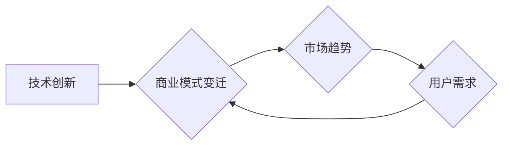

# AI创业公司的商业模式变迁

> 关键词：AI创业，商业模式，技术创新，市场趋势，可持续发展

## 1. 背景介绍

随着人工智能技术的飞速发展，AI创业公司如雨后春笋般涌现。这些公司凭借创新的技术和商业模式，在各个领域取得了显著的成果。然而，AI创业公司的商业模式并非一成不变，而是随着技术进步、市场变化和用户需求的发展不断演变。本文将深入探讨AI创业公司的商业模式变迁，分析其背后的逻辑和趋势。

### 1.1 技术创新驱动

人工智能技术的发展是AI创业公司商业模式变迁的根本驱动力。从早期的机器学习、深度学习到如今的强化学习、迁移学习，每一项技术的突破都为AI创业公司提供了新的商业模式可能性。

### 1.2 市场趋势影响

市场趋势也对AI创业公司的商业模式产生了深远影响。例如，随着5G、物联网、大数据等技术的普及，AI创业公司可以更加便捷地获取数据，从而开发出更加精准、高效的产品和服务。

### 1.3 用户需求导向

用户需求的不断变化是AI创业公司商业模式变迁的重要导向。从早期的功能导向到现在的用户体验导向，AI创业公司需要不断调整商业模式，以满足用户日益增长的需求。

## 2. 核心概念与联系

为了更好地理解AI创业公司的商业模式变迁，我们先来定义几个核心概念：

- **商业模式**：指企业通过提供产品或服务，实现价值创造、传递和获取的体系。
- **技术创新**：指在现有技术基础上，通过创新思维和方法，产生新的技术成果。
- **市场趋势**：指市场上某种趋势的普遍现象和发展方向。
- **用户需求**：指用户在特定情境下对产品或服务的期望和需求。

以下是基于Mermaid流程图展示的AI创业公司商业模式变迁的逻辑关系：



可以看出，技术创新是推动商业模式变迁的根本动力，市场趋势和用户需求则是商业模式变迁的两个重要方向。

## 3. 核心算法原理 & 具体操作步骤

### 3.1 算法原理概述

AI创业公司的商业模式变迁涉及多个方面，以下列举几个关键算法原理：

- **机器学习**：通过数据驱动的方式，从数据中学习并优化模型，实现智能决策。
- **深度学习**：一种模拟人脑神经网络结构的算法，能够自动学习和提取特征，实现复杂的模式识别。
- **强化学习**：通过奖励机制，让智能体在环境中学习最佳策略。
- **迁移学习**：将已训练好的模型迁移到新的任务上，减少训练数据量和计算成本。

### 3.2 算法步骤详解

以下是AI创业公司商业模式变迁的几个关键步骤：

1. **市场调研**：了解市场需求、竞争态势、技术发展趋势等。
2. **技术创新**：根据市场调研结果，选择合适的技术方向，进行研发和创新。
3. **产品开发**：基于创新技术，开发满足市场需求的产品或服务。
4. **商业模式设计**：设计符合企业定位、市场定位和用户需求的商业模式。
5. **市场推广**：通过线上线下渠道，推广产品或服务，吸引目标用户。
6. **持续迭代**：根据用户反馈和市场竞争情况，不断优化产品和服务，迭代商业模式。

### 3.3 算法优缺点

- **机器学习**：优点是自动学习和优化模型，缺点是数据依赖性较高，需要大量标注数据。
- **深度学习**：优点是能够处理复杂模式识别，缺点是模型复杂度高，计算资源消耗大。
- **强化学习**：优点是能够学习最佳策略，缺点是学习过程较慢，需要大量样本数据。
- **迁移学习**：优点是减少训练数据量和计算成本，缺点是模型迁移效果受限于源域和目标域的相似度。

### 3.4 算法应用领域

AI创业公司可以利用上述算法原理在以下领域进行商业模式创新：

- **金融科技**：智能投顾、反欺诈、智能客服等。
- **医疗健康**：疾病预测、药物研发、远程医疗等。
- **教育科技**：个性化学习、智能评测、教育机器人等。
- **零售电商**：智能推荐、智能客服、智能物流等。

## 4. 数学模型和公式 & 详细讲解 & 举例说明

### 4.1 数学模型构建

AI创业公司的商业模式变迁涉及多个数学模型，以下列举几个关键模型：

- **线性回归**：用于预测连续值，如房价、股票价格等。
- **逻辑回归**：用于预测二分类结果，如用户是否购买、是否点击等。
- **决策树**：用于分类和回归任务，能够解释模型的决策过程。
- **神经网络**：用于复杂的模式识别和预测任务，能够学习高度非线性关系。

### 4.2 公式推导过程

以下以线性回归为例，介绍数学公式的推导过程：

假设线性回归模型为 $y = \theta_0 + \theta_1x_1 + \theta_2x_2 + ... + \theta_nx_n$，其中 $y$ 为因变量，$x_1, x_2, ..., x_n$ 为自变量，$\theta_0, \theta_1, ..., \theta_n$ 为模型参数。

根据最小二乘法，最小化损失函数：

$$
L(\theta) = \sum_{i=1}^m (y_i - \theta_0 - \theta_1x_{i1} - ... - \theta_nx_{in})^2
$$

对损失函数求导，并令导数为0，可得：

$$
\theta_0 = \frac{1}{m}\sum_{i=1}^m y_i \\
\theta_1 = \frac{1}{m}\sum_{i=1}^m (y_i - \theta_0 - \theta_1x_{i1} - ... - \theta_nx_{in})x_{i1} \\
... \\
\theta_n = \frac{1}{m}\sum_{i=1}^m (y_i - \theta_0 - \theta_1x_{i1} - ... - \theta_nx_{in})x_{in}
$$

以上即为线性回归模型的参数估计公式。

### 4.3 案例分析与讲解

以下以智能推荐系统为例，分析其数学模型和公式：

假设智能推荐系统采用基于内容的推荐方法，其数学模型为：

$$
P(r_i|x) = \exp(\theta^T \cdot f(x_i)) / \sum_{j=1}^k \exp(\theta^T \cdot f(x_j))
$$

其中 $r_i$ 为推荐物品，$x$ 为用户特征，$\theta$ 为模型参数，$f(x)$ 为物品特征提取函数，$k$ 为推荐列表中物品数量。

通过优化模型参数 $\theta$，可以最大化用户对推荐物品的满意度。在实际应用中，可以使用梯度下降等优化算法进行参数优化。

## 5. 项目实践：代码实例和详细解释说明

### 5.1 开发环境搭建

以下是使用Python进行AI创业公司项目实践的开发环境搭建步骤：

1. 安装Anaconda：从官网下载并安装Anaconda，用于创建独立的Python环境。
2. 激活虚拟环境：
```bash
conda create -n ai-env python=3.8 
conda activate ai-env
```
3. 安装PyTorch和Scikit-learn等库：
```bash
conda install pytorch torchvision torchaudio scikit-learn -c pytorch -c conda-forge
```

### 5.2 源代码详细实现

以下是一个简单的线性回归模型实现：

```python
import torch
import torch.nn as nn

class LinearRegression(nn.Module):
    def __init__(self, input_size, output_size):
        super(LinearRegression, self).__init__()
        self.linear = nn.Linear(input_size, output_size)

    def forward(self, x):
        out = self.linear(x)
        return out

# 定义模型、损失函数和优化器
model = LinearRegression(input_size=2, output_size=1)
criterion = nn.MSELoss()
optimizer = torch.optim.SGD(model.parameters(), lr=0.01)

# 准备数据
x = torch.tensor([[1, 2], [2, 3], [3, 4], [4, 5]], dtype=torch.float)
y = torch.tensor([[1], [2], [3], [4]], dtype=torch.float)

# 训练模型
for epoch in range(1000):
    optimizer.zero_grad()
    output = model(x)
    loss = criterion(output, y)
    loss.backward()
    optimizer.step()

    if (epoch+1) % 100 == 0:
        print(f'Epoch {epoch+1}, Loss: {loss.item()}')
```

### 5.3 代码解读与分析

以上代码定义了一个简单的线性回归模型，使用PyTorch框架进行训练。首先，定义了一个线性层`linear`，用于计算输出。接着，定义了损失函数和优化器。然后，准备了一些训练数据，并使用梯度下降算法进行模型训练。

### 5.4 运行结果展示

运行上述代码，可以看到模型在训练过程中的loss逐渐减小，最终收敛到一个稳定值。

## 6. 实际应用场景

### 6.1 金融风控

AI创业公司可以利用机器学习、深度学习等技术，开发金融风控模型，用于识别欺诈、预防风险、提高信贷审批效率等。

### 6.2 智能医疗

AI创业公司可以利用AI技术进行疾病诊断、药物研发、健康管理等方面，提高医疗服务的效率和水平。

### 6.3 智能制造

AI创业公司可以利用AI技术进行生产流程优化、质量检测、预测性维护等，提高制造业的自动化水平和生产效率。

### 6.4 智能交通

AI创业公司可以利用AI技术进行智能交通管理、自动驾驶、车联网等，提高交通安全性和出行效率。

## 7. 工具和资源推荐

### 7.1 学习资源推荐

1. 《Python机器学习》
2. 《深度学习》
3. 《人工智能：一种现代的方法》
4. 《TensorFlow实战》
5. 《Scikit-learn实战》

### 7.2 开发工具推荐

1. PyTorch
2. TensorFlow
3. Scikit-learn
4. Jupyter Notebook
5. Git

### 7.3 相关论文推荐

1. "TensorFlow: Large-Scale Machine Learning on Heterogeneous Systems"
2. "Scikit-learn: Machine Learning in Python"
3. "Theano: A Python Framework for Fast Distributed Optimization"
4. "Chainer: A Framework of High-Performance Scientific Computing"
5. "MXNet: A Flexible and Efficient Machine Learning Library for Heterogeneous Distributed Systems"

## 8. 总结：未来发展趋势与挑战

### 8.1 研究成果总结

本文从技术创新、市场趋势和用户需求等方面，分析了AI创业公司的商业模式变迁。通过介绍核心算法原理、具体操作步骤、数学模型和公式，以及项目实践，展示了AI创业公司在实际应用场景中的发展潜力。

### 8.2 未来发展趋势

1. **技术创新**：随着技术的不断发展，AI创业公司将更加注重技术创新，以保持竞争优势。
2. **跨界融合**：AI创业公司将与其他行业进行跨界融合，拓展应用场景，实现多元化发展。
3. **可持续发展**：AI创业公司将更加注重可持续发展，关注社会责任和伦理问题。

### 8.3 面临的挑战

1. **数据安全与隐私**：AI创业公司需要关注数据安全和隐私保护，避免数据泄露和滥用。
2. **算法偏见与歧视**：AI创业公司需要避免算法偏见和歧视，确保公平公正。
3. **技术人才短缺**：AI创业公司需要吸引和培养更多优秀的技术人才。

### 8.4 研究展望

未来，AI创业公司需要不断探索创新，以应对市场变化和用户需求的挑战。同时，关注可持续发展，推动AI技术在各个领域的应用，为人类社会创造更多价值。

---

作者：禅与计算机程序设计艺术 / Zen and the Art of Computer Programming