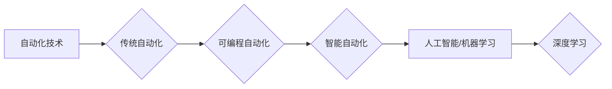

# AI在自动化领域的应用前景

> 关键词：人工智能，自动化，机器学习，深度学习，工业4.0，智能机器人，预测性维护，供应链优化

## 1. 背景介绍

随着人工智能（AI）和机器学习（ML）技术的飞速发展，自动化领域正经历着一场深刻的变革。从简单的自动化生产线到复杂的智能决策系统，AI正在逐渐渗透到各个自动化应用场景中。本文将探讨AI在自动化领域的应用前景，分析其核心概念与联系，并探讨具体算法原理、操作步骤、数学模型以及实际应用案例。

### 1.1 自动化的演进

自动化技术的演进经历了几个重要阶段：

- **传统自动化**：基于机械和电子技术，通过预设程序控制机器执行重复性任务。
- **可编程自动化**：引入编程语言，使机器能够执行更复杂的任务。
- **智能自动化**：结合AI和ML技术，使机器能够从数据中学习并自主做出决策。

### 1.2 人工智能的崛起

近年来，随着计算能力的提升和大数据的积累，深度学习等AI技术在图像识别、自然语言处理、决策优化等领域取得了突破性进展。这些技术的应用为自动化领域带来了新的可能性。

## 2. 核心概念与联系

### 2.1 核心概念

- **人工智能（AI）**：使机器能够模拟人类智能行为的技术，包括学习、推理、感知、理解等。
- **机器学习（ML）**：AI的一个子领域，通过数据学习规律和模式，从而做出预测或决策。
- **深度学习（DL）**：ML的一个子领域，使用多层神经网络模拟人脑学习过程。
- **自动化**：使机器或系统能够执行任务，减少人工干预。

### 2.2 Mermaid 流程图



### 2.3 核心联系

AI与自动化的结合，使得自动化系统不仅能够执行重复性任务，还能够进行决策、学习和优化。这种结合推动了自动化技术的快速发展。

## 3. 核心算法原理 & 具体操作步骤

### 3.1 算法原理概述

AI在自动化领域的应用主要基于以下算法：

- **监督学习（Supervised Learning）**：通过大量标注数据进行训练，使模型能够对未知数据进行预测。
- **无监督学习（Unsupervised Learning）**：通过无标签数据进行训练，使模型能够发现数据中的模式和结构。
- **强化学习（Reinforcement Learning）**：通过奖励和惩罚机制，使模型能够学习在特定环境中做出最优决策。

### 3.2 算法步骤详解

1. **数据收集**：收集相关数据，包括传感器数据、历史操作数据等。
2. **数据预处理**：对数据进行清洗、归一化等处理，为模型训练做准备。
3. **模型选择**：选择合适的AI模型，如神经网络、决策树、支持向量机等。
4. **模型训练**：使用训练数据对模型进行训练，优化模型参数。
5. **模型评估**：使用验证数据评估模型性能，调整模型参数。
6. **模型部署**：将训练好的模型部署到自动化系统中。

### 3.3 算法优缺点

#### 监督学习

优点：

- 能够在大量标注数据上取得较好的性能。
- 应用于各种分类和回归问题。

缺点：

- 需要大量标注数据。
- 对异常值敏感。

#### 无监督学习

优点：

- 不需要标注数据。
- 能够发现数据中的潜在模式。

缺点：

- 难以评估模型性能。
- 可能存在模式过拟合。

#### 强化学习

优点：

- 能够在复杂环境中学习做出最优决策。
- 应用于决策优化和机器人控制。

缺点：

- 训练过程可能非常耗时。
- 需要明确的奖励和惩罚机制。

### 3.4 算法应用领域

AI在自动化领域的应用领域包括：

- **预测性维护**：通过分析传感器数据预测设备故障，实现预防性维护。
- **供应链优化**：通过分析供应链数据优化库存、物流等环节。
- **智能机器人**：使机器人能够自主执行任务，如搬运、装配等。
- **质量控制**：通过图像识别技术检测产品质量问题。
- **智能调度**：优化生产线调度，提高生产效率。

## 4. 数学模型和公式 & 详细讲解 & 举例说明

### 4.1 数学模型构建

以下是一个简单的神经网络数学模型：

$$
y = f(W \cdot x + b)
$$

其中，$y$ 是输出，$x$ 是输入，$W$ 是权重，$b$ 是偏置，$f$ 是激活函数。

### 4.2 公式推导过程

神经网络的学习过程是通过反向传播算法进行的。具体推导过程如下：

1. 计算预测误差：$E = \frac{1}{2}(y_{\text{预测}} - y_{\text{真实}})^2$
2. 计算梯度：$\frac{\partial E}{\partial W} = (y_{\text{预测}} - y_{\text{真实}}) \cdot x$
3. 更新权重：$W_{\text{新}} = W_{\text{旧}} - \eta \cdot \frac{\partial E}{\partial W}$

### 4.3 案例分析与讲解

以下是一个使用神经网络进行图像分类的案例：

1. 数据收集：收集大量图像数据，并进行标注。
2. 数据预处理：对图像进行缩放、裁剪等处理。
3. 模型选择：选择合适的神经网络模型，如卷积神经网络（CNN）。
4. 模型训练：使用训练数据进行模型训练。
5. 模型评估：使用验证数据评估模型性能。
6. 模型部署：将训练好的模型部署到图像识别系统中。

通过以上步骤，神经网络能够学习到图像特征，并能够对未知图像进行分类。

## 5. 项目实践：代码实例和详细解释说明

### 5.1 开发环境搭建

1. 安装Python环境。
2. 安装TensorFlow或PyTorch等深度学习框架。
3. 安装必要的依赖库，如NumPy、Pandas等。

### 5.2 源代码详细实现

以下是一个使用TensorFlow实现图像分类的简单示例：

```python
import tensorflow as tf
from tensorflow.keras import datasets, layers, models

# 加载和预处理数据
(train_images, train_labels), (test_images, test_labels) = datasets.cifar10.load_data()

train_images = train_images.reshape((60000, 32, 32, 3)).astype('float32') / 255
test_images = test_images.reshape((10000, 32, 32, 3)).astype('float32') / 255

train_labels = tf.keras.utils.to_categorical(train_labels)
test_labels = tf.keras.utils.to_categorical(test_labels)

# 构建模型
model = models.Sequential()
model.add(layers.Conv2D(32, (3, 3), activation='relu', input_shape=(32, 32, 3)))
model.add(layers.MaxPooling2D((2, 2)))
model.add(layers.Conv2D(64, (3, 3), activation='relu'))
model.add(layers.MaxPooling2D((2, 2)))
model.add(layers.Conv2D(64, (3, 3), activation='relu'))

model.add(layers.Flatten())
model.add(layers.Dense(64, activation='relu'))
model.add(layers.Dense(10))

# 编译模型
model.compile(optimizer='adam',
              loss=tf.keras.losses.categorical_crossentropy,
              metrics=['accuracy'])

# 训练模型
model.fit(train_images, train_labels, epochs=10, validation_data=(test_images, test_labels))

# 评估模型
test_loss, test_acc = model.evaluate(test_images, test_labels, verbose=2)
print('\
Test accuracy:', test_acc)
```

### 5.3 代码解读与分析

以上代码使用TensorFlow构建了一个简单的卷积神经网络（CNN）模型，用于CIFAR-10图像分类任务。首先加载和预处理数据，然后构建模型，编译模型，使用训练数据进行模型训练，最后评估模型性能。

### 5.4 运行结果展示

运行上述代码后，会在终端输出测试集上的准确率。

## 6. 实际应用场景

AI在自动化领域的实际应用场景包括：

### 6.1 预测性维护

预测性维护可以通过分析设备运行数据预测设备故障，从而实现预防性维护，减少停机时间，降低维护成本。

### 6.2 供应链优化

AI可以分析供应链数据，优化库存、物流等环节，提高供应链效率，降低成本。

### 6.3 智能机器人

智能机器人可以自主执行任务，如搬运、装配、焊接等，提高生产效率，降低人力成本。

### 6.4 质量控制

AI可以分析图像数据，检测产品质量问题，提高产品质量。

### 6.5 智能调度

AI可以优化生产线调度，提高生产效率，降低生产成本。

## 7. 工具和资源推荐

### 7.1 学习资源推荐

- 《深度学习》（Goodfellow, Bengio, Courville）
- 《Python深度学习》（François Chollet）
- TensorFlow官方文档
- PyTorch官方文档

### 7.2 开发工具推荐

- TensorFlow
- PyTorch
- OpenCV
- Keras

### 7.3 相关论文推荐

- "Deep Learning for Industrial Automation"（2018）
- "Artificial Intelligence in Manufacturing: A Survey"（2019）
- "AI for Industrial Automation: A Survey"（2020）

## 8. 总结：未来发展趋势与挑战

### 8.1 研究成果总结

AI在自动化领域的应用前景广阔，已经取得了显著成果。通过AI技术，可以实现自动化系统的智能化、自主化，提高生产效率，降低成本，提升产品质量。

### 8.2 未来发展趋势

- **多模态数据融合**：结合文本、图像、传感器等多模态数据，提高自动化系统的感知能力。
- **边缘计算**：将AI模型部署到边缘设备，实现实时推理和决策。
- **强化学习**：通过强化学习技术，使自动化系统能够在复杂环境中进行自主决策。

### 8.3 面临的挑战

- **数据质量**：自动化系统需要高质量的数据进行训练，以保证模型的性能。
- **计算资源**：深度学习模型需要大量的计算资源，对硬件设备提出了更高的要求。
- **模型可解释性**：AI模型的决策过程往往缺乏可解释性，难以满足某些领域的需求。

### 8.4 研究展望

未来，AI在自动化领域的应用将更加广泛，涉及更多领域。同时，研究者需要解决数据质量、计算资源、模型可解释性等挑战，以推动AI技术在自动化领域的进一步发展。

## 9. 附录：常见问题与解答

**Q1：AI在自动化领域的应用前景如何？**

A：AI在自动化领域的应用前景非常广阔，可以显著提高生产效率、降低成本、提升产品质量。

**Q2：AI在自动化领域有哪些应用场景？**

A：AI在自动化领域的应用场景包括预测性维护、供应链优化、智能机器人、质量控制、智能调度等。

**Q3：如何将AI技术应用于自动化领域？**

A：将AI技术应用于自动化领域需要收集数据、预处理数据、选择合适的AI模型、训练模型、评估模型性能、部署模型等步骤。

**Q4：AI在自动化领域面临哪些挑战？**

A：AI在自动化领域面临数据质量、计算资源、模型可解释性等挑战。

**Q5：未来AI在自动化领域有哪些发展趋势？**

A：未来AI在自动化领域将呈现多模态数据融合、边缘计算、强化学习等发展趋势。

作者：禅与计算机程序设计艺术 / Zen and the Art of Computer Programming