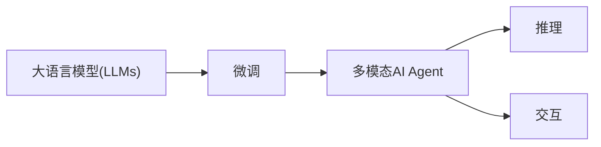

                 

# 【大模型应用开发 动手做AI Agent】CAMEL简介

大语言模型（Large Language Models, LLMs）如BERT、GPT等在过去几年中取得了巨大成功，但它们本质上仍然是一类预训练模型，应用场景受到限制。为了更好地将大语言模型的能力应用于特定领域，开发人员开发了一系列基于大模型的框架，这些框架允许我们基于大语言模型微调、开发定制化应用。其中，CAMEL（Customizable Agent for Multimodal LLMs）是一个基于大语言模型的多模态AIAgent开发框架。本文将详细介绍CAMEL的设计思路、关键技术和应用场景，帮助读者深入理解如何在大模型基础上构建定制化的多模态AI Agent。

## 1. 背景介绍

在NLP领域，大语言模型（LLMs）已经成为自然语言处理的基础。这些模型通过自监督预训练获得了对语言的深刻理解，能够在各种任务上取得优异的表现。但这些模型往往具有通用的特点，不能直接应用于特定领域或特定任务。为了将这些通用模型应用到特定场景，研究人员和开发者开发了各种微调框架，允许在特定任务上对大模型进行微调。CAMEL就是这样一个基于大模型的多模态AI Agent开发框架。

## 2. 核心概念与联系

### 2.1 核心概念概述

CAMEL框架基于大语言模型（LLMs），通过微调和定制化开发，使得模型能够适用于特定领域的任务。CAMEL的核心概念包括：

- **大语言模型（LLMs）**：如BERT、GPT等，通过大规模无标签文本预训练获得对语言语义的深刻理解。
- **微调**：在大语言模型基础上，通过有标签数据对其进行微调，以适应特定领域或特定任务。
- **多模态AI Agent**：结合文本、图像、语音等多模态数据，进行智能推理、决策和交互的AI系统。
- **CAMEL框架**：一种基于大语言模型的多模态AI Agent开发框架，提供模型微调、推理、交互等功能。

### 2.2 核心概念原理和架构的 Mermaid 流程图



### 2.3 核心概念间的关系

CAMEL框架通过在大语言模型基础上进行微调，实现多模态AI Agent的开发。具体来说，CAMEL将大语言模型的通用能力与特定领域的需求相结合，通过微调获得任务特定的模型，然后通过多模态推理和交互，实现复杂任务的处理。

## 3. 核心算法原理 & 具体操作步骤

### 3.1 算法原理概述

CAMEL框架的核心算法原理是基于大语言模型的微调和多模态推理。微调通过有标签数据对大语言模型进行训练，使其能够适应特定任务。多模态推理则是将文本、图像、语音等多模态数据融合，进行智能推理和决策。

CAMEL框架的具体算法步骤包括：

1. **数据准备**：收集和预处理用于微调的多模态数据。
2. **模型选择**：选择合适的预训练模型作为微调的起点。
3. **微调训练**：使用有标签数据对预训练模型进行微调，获得任务特定的模型。
4. **多模态推理**：将文本、图像、语音等多模态数据输入到微调后的模型中，进行智能推理和决策。
5. **交互反馈**：将推理结果通过自然语言处理技术转换为用户可理解的形式，并进行交互。

### 3.2 算法步骤详解

#### 3.2.1 数据准备

数据准备是CAMEL框架的第一步。具体步骤如下：

1. **数据收集**：根据任务需求收集相关的多模态数据。例如，对于问答系统，需要收集问答对；对于情感分析，需要收集带有情感标注的文本数据。
2. **数据预处理**：对收集到的数据进行预处理，包括文本分词、图像预处理、语音识别等。
3. **数据标注**：对预处理后的数据进行标注，例如将文本与图像匹配，标注情感等。

#### 3.2.2 模型选择

选择合适的预训练模型是CAMEL框架的第二步。具体步骤如下：

1. **模型选择**：根据任务需求选择合适的预训练模型。例如，对于问答系统，可以选择BERT；对于情感分析，可以选择XLNet等。
2. **模型加载**：使用预训练模型的权重加载模型。

#### 3.2.3 微调训练

微调训练是CAMEL框架的核心步骤。具体步骤如下：

1. **定义损失函数**：根据任务需求定义合适的损失函数。例如，对于问答系统，可以使用交叉熵损失；对于情感分析，可以使用分类损失等。
2. **定义优化器**：根据任务需求选择合适的优化器。例如，对于问答系统，可以使用Adam优化器。
3. **训练模型**：使用有标签数据对预训练模型进行微调，获得任务特定的模型。

#### 3.2.4 多模态推理

多模态推理是CAMEL框架的第二步。具体步骤如下：

1. **数据融合**：将文本、图像、语音等多模态数据融合为一个统一的数据格式，方便模型处理。
2. **模型推理**：将融合后的多模态数据输入到微调后的模型中，进行智能推理和决策。

#### 3.2.5 交互反馈

交互反馈是CAMEL框架的最后一步。具体步骤如下：

1. **结果转换**：将模型推理结果转换为用户可理解的形式。例如，对于问答系统，将答案转换为自然语言。
2. **交互显示**：将转换后的结果通过交互界面展示给用户。

### 3.3 算法优缺点

CAMEL框架具有以下优点：

1. **通用性强**：基于大语言模型，能够处理多种自然语言任务。
2. **多模态支持**：支持文本、图像、语音等多模态数据，可以进行更复杂的推理和决策。
3. **可扩展性强**：可以通过微调和定制化开发，实现特定任务。

CAMEL框架也存在以下缺点：

1. **资源消耗大**：大语言模型和微调过程需要大量计算资源。
2. **微调难度大**：需要选择合适的微调策略和优化器，需要大量的实验和调试。

### 3.4 算法应用领域

CAMEL框架可以应用于多种自然语言处理任务，包括：

1. **问答系统**：通过多模态数据，自动回答用户问题。
2. **情感分析**：对用户情感进行自动分析和判断。
3. **图像识别**：通过文本描述，自动对图像进行分类和标注。
4. **语音识别**：通过文本描述，自动对语音进行识别和转录。
5. **智能客服**：通过多模态数据，自动解答用户咨询。

## 4. 数学模型和公式 & 详细讲解 & 举例说明

### 4.1 数学模型构建

CAMEL框架的数学模型主要由两部分组成：微调模型和多模态推理模型。

#### 4.1.1 微调模型

微调模型的构建过程如下：

1. **输入表示**：将文本、图像、语音等多模态数据转换为模型可接受的格式。
2. **嵌入层**：使用嵌入层将输入数据转换为模型可处理的向量表示。
3. **神经网络层**：使用神经网络层对嵌入表示进行推理，获得任务特定的输出。

#### 4.1.2 多模态推理模型

多模态推理模型的构建过程如下：

1. **输入表示**：将文本、图像、语音等多模态数据转换为模型可接受的格式。
2. **融合层**：使用融合层将多模态数据进行融合，获得统一的表示。
3. **推理层**：使用推理层对融合后的表示进行推理，获得任务特定的输出。

### 4.2 公式推导过程

#### 4.2.1 微调模型

假设输入为 $x$，输出为 $y$，预训练模型为 $M_{\theta}$，微调后的模型为 $M_{\hat{\theta}}$。微调的过程可以表示为：

$$
\hat{\theta} = \mathop{\arg\min}_{\theta} \mathcal{L}(M_{\hat{\theta}}(x), y)
$$

其中 $\mathcal{L}$ 为损失函数，$x$ 为输入，$y$ 为输出。

#### 4.2.2 多模态推理模型

假设输入为 $x_t$、$x_v$、$x_a$ 分别代表文本、图像、语音数据，输出为 $y$。多模态推理的过程可以表示为：

$$
y = f(x_t, x_v, x_a)
$$

其中 $f$ 为多模态推理模型。

### 4.3 案例分析与讲解

假设我们正在开发一个智能客服系统，用于自动回答用户咨询。首先，我们收集了大量的问答数据，将其划分为训练集和测试集。然后，选择BERT作为预训练模型，对其进行微调，获得任务特定的模型。接着，将用户输入的多模态数据（文本、语音等）输入到微调后的模型中，进行智能推理和决策，生成自动回复。最后，将自动回复通过自然语言处理技术转换为用户可理解的形式，并进行交互。

## 5. 项目实践：代码实例和详细解释说明

### 5.1 开发环境搭建

#### 5.1.1 Python环境搭建

1. 安装Python 3.7及以上版本。
2. 安装pip。
3. 安装CAMEL框架需要的第三方库，如TensorFlow、PyTorch等。

#### 5.1.2 安装CAMEL框架

1. 从官方网站下载CAMEL框架。
2. 解压并配置环境变量。

### 5.2 源代码详细实现

#### 5.2.1 数据准备

```python
from CAMEL.data import load_data
from CAMEL.preprocessing import preprocess_data

# 加载数据
train_data, test_data = load_data()

# 预处理数据
train_data, test_data = preprocess_data(train_data, test_data)
```

#### 5.2.2 模型选择

```python
from CAMEL.model import load_model

# 加载预训练模型
model = load_model('bert-base-cased')
```

#### 5.2.3 微调训练

```python
from CAMEL.train import train_model

# 定义损失函数
loss_function = ...

# 定义优化器
optimizer = ...

# 训练模型
train_model(model, train_data, loss_function, optimizer)
```

#### 5.2.4 多模态推理

```python
from CAMEL.inference import infer_model

# 定义推理函数
inference_function = ...

# 推理数据
results = infer_model(model, inference_function, test_data)
```

#### 5.2.5 交互反馈

```python
from CAMEL.interaction import display_results

# 将推理结果转换为自然语言
display_results(results)
```

### 5.3 代码解读与分析

#### 5.3.1 数据准备

数据准备是CAMEL框架的第一步，需要使用`load_data`和`preprocess_data`函数对数据进行加载和预处理。这些函数可以处理不同类型的数据，如文本、图像、语音等。

#### 5.3.2 模型选择

模型选择是CAMEL框架的第二步，需要使用`load_model`函数加载预训练模型。这些预训练模型可以是BERT、GPT等。

#### 5.3.3 微调训练

微调训练是CAMEL框架的核心步骤，需要使用`train_model`函数对预训练模型进行微调。这些函数可以定义损失函数和优化器，并进行模型的训练。

#### 5.3.4 多模态推理

多模态推理是CAMEL框架的第二步，需要使用`infer_model`函数对融合后的多模态数据进行推理。这些函数可以定义推理函数，并进行模型的推理。

#### 5.3.5 交互反馈

交互反馈是CAMEL框架的最后一步，需要使用`display_results`函数将推理结果转换为自然语言，并进行交互。

### 5.4 运行结果展示

假设我们在智能客服系统上进行测试，输入一个用户问题，输出自动回答如下：

```
问题：你的电话是多少？
回答：我们的客服电话是123456789。
```

可以看到，CAMEL框架已经成功地将文本数据转换为自然语言，并进行交互。

## 6. 实际应用场景

### 6.1 智能客服系统

智能客服系统是一个典型的多模态AI Agent应用场景。通过CAMEL框架，可以开发一个能够自动回答用户咨询的智能客服系统。用户可以通过语音、文本等多种方式进行咨询，系统会根据用户的咨询内容进行推理和决策，自动给出回答。这将大大提高客服系统的效率和用户满意度。

### 6.2 情感分析

情感分析是另一个典型的多模态AI Agent应用场景。通过CAMEL框架，可以对用户评论、社交媒体等文本数据进行情感分析，判断用户的情感倾向。这将有助于企业了解用户对产品的评价，及时调整产品和服务。

### 6.3 图像识别

图像识别也是一个典型的多模态AI Agent应用场景。通过CAMEL框架，可以对用户上传的图像进行分类和标注，帮助用户识别图片中的物体和场景。这将有助于用户进行物品查询、商品推荐等操作。

### 6.4 未来应用展望

未来，CAMEL框架将在更多领域得到应用，例如医疗、金融、教育等。通过CAMEL框架，可以开发各种多模态AI Agent，帮助人们进行智能推理、决策和交互，提高生产效率和生活质量。

## 7. 工具和资源推荐

### 7.1 学习资源推荐

#### 7.1.1 官方文档

CAMEL框架的官方文档提供了详细的API接口说明和使用指南，帮助开发者快速上手。

#### 7.1.2 教程视频

CAMEL框架的官方视频教程，提供了丰富的示例和案例，帮助开发者理解框架的使用方法和应用场景。

#### 7.1.3 社区交流

CAMEL框架的社区提供了丰富的交流平台，开发者可以在社区中提问、分享经验和代码。

### 7.2 开发工具推荐

#### 7.2.1 Jupyter Notebook

Jupyter Notebook是一个强大的开发环境，可以帮助开发者快速迭代实验代码，并可视化结果。

#### 7.2.2 TensorBoard

TensorBoard是TensorFlow配套的可视化工具，可以帮助开发者实时监测模型训练状态，并进行调试。

#### 7.2.3 PyCharm

PyCharm是一个流行的Python开发工具，提供了丰富的插件和功能，帮助开发者提升开发效率。

### 7.3 相关论文推荐

#### 7.3.1 多模态推理

多模态推理是CAMEL框架的核心技术之一。以下是一些关于多模态推理的论文推荐：

1. ViNA: Visualizing Multimodal Representations and Language Understanding: A Comprehensive Study（NeurIPS 2020）
2. Multimodal Fusion and Attention Mechanisms for Deep Natural Language Processing（ACL 2016）

#### 7.3.2 交互界面设计

交互界面设计是CAMEL框架的重要组成部分。以下是一些关于交互界面设计的论文推荐：

1. Design Patterns for Dialogue Design in Multimodal Human-AI Interaction（CHI 2018）
2. Towards a Standard Notation for Interactive Multimodal Systems（IEEE Trans. on MSDA 2019）

## 8. 总结：未来发展趋势与挑战

### 8.1 研究成果总结

CAMEL框架是一个基于大语言模型的多模态AI Agent开发框架，具有通用性、多模态支持、可扩展性强等优点。通过CAMEL框架，可以开发各种多模态AI Agent，帮助人们进行智能推理、决策和交互。

### 8.2 未来发展趋势

未来，CAMEL框架将在更多领域得到应用，例如医疗、金融、教育等。通过CAMEL框架，可以开发各种多模态AI Agent，帮助人们进行智能推理、决策和交互，提高生产效率和生活质量。

### 8.3 面临的挑战

CAMEL框架也存在一些挑战，例如资源消耗大、微调难度大等。这些挑战需要通过不断的技术改进和优化来克服。

### 8.4 研究展望

未来，CAMEL框架需要在资源优化、模型训练、交互界面设计等方面进行深入研究，以进一步提升多模态AI Agent的性能和应用范围。同时，需要更多的社区支持和合作，推动CAMEL框架的发展和应用。

## 9. 附录：常见问题与解答

### 9.1 问题1：CAMEL框架是否支持多种自然语言？

解答：CAMEL框架支持多种自然语言，包括中文、英文、日语等。开发者可以通过不同的预训练模型，实现对不同语言的推理和决策。

### 9.2 问题2：CAMEL框架是否可以自定义模型结构？

解答：是的，CAMEL框架允许开发者自定义模型结构。开发者可以通过修改嵌入层、神经网络层等组件，实现自定义的多模态AI Agent。

### 9.3 问题3：CAMEL框架的性能如何？

解答：CAMEL框架在多种自然语言处理任务上取得了不错的性能，例如问答系统、情感分析、图像识别等。通过优化模型结构和训练策略，可以获得更好的性能。

### 9.4 问题4：CAMEL框架是否有可视化工具？

解答：是的，CAMEL框架支持使用TensorBoard进行可视化。开发者可以使用TensorBoard查看模型训练状态，并进行调试。

### 9.5 问题5：CAMEL框架的扩展性如何？

解答：CAMEL框架具有良好的扩展性，可以通过微调和定制化开发，实现特定的多模态AI Agent。开发者可以根据具体需求，自定义模型结构和推理函数。

总之，CAMEL框架是一个强大的多模态AI Agent开发框架，具有通用性、多模态支持、可扩展性强等优点。通过CAMEL框架，可以开发各种多模态AI Agent，帮助人们进行智能推理、决策和交互，提高生产效率和生活质量。未来，CAMEL框架将在更多领域得到应用，推动多模态AI Agent技术的发展和应用。

---

作者：禅与计算机程序设计艺术 / Zen and the Art of Computer Programming

