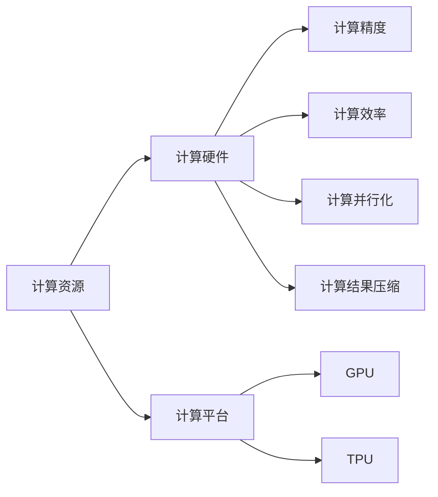
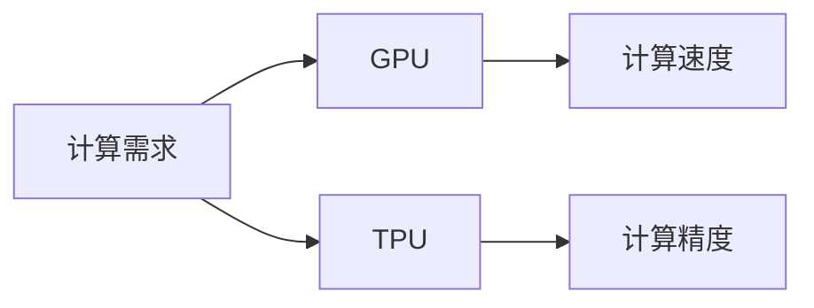
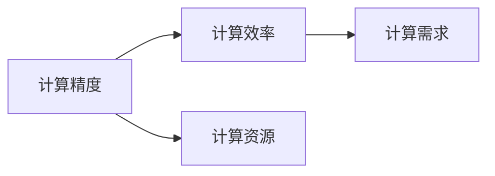
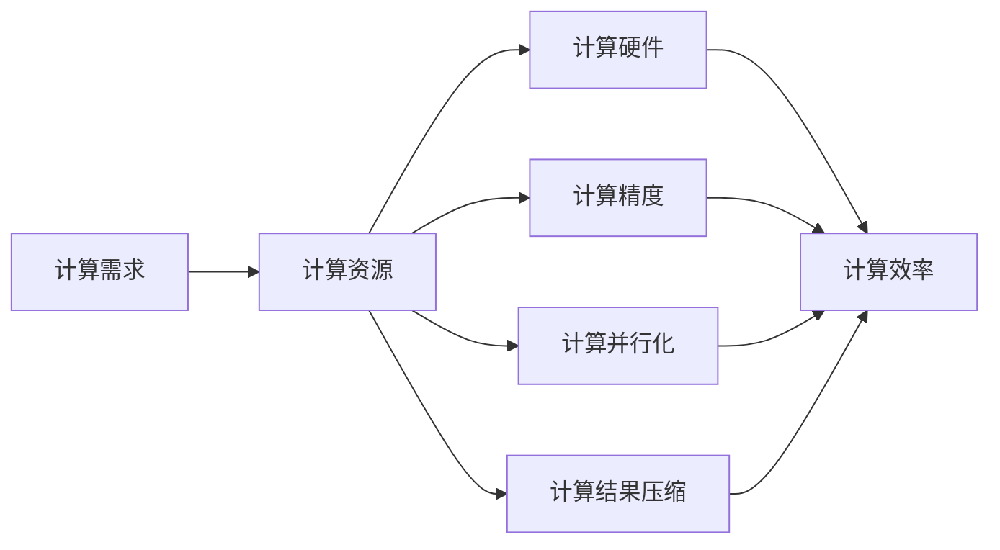

                 

# 【大模型应用开发 动手做AI Agent】第二轮行动：工具执行计算

> 关键词：大模型应用，AI Agent，动手实践，工具使用，计算优化

## 1. 背景介绍

### 1.1 问题由来
在大模型应用开发中，我们经常会遇到计算资源不足的问题。例如，当训练一个大规模语言模型时，其计算需求可能远远超出现有硬件的承载能力。如何优化计算过程，高效利用计算资源，成为了开发过程中必须面对的一个挑战。

### 1.2 问题核心关键点
本节将介绍如何通过合理的工具和策略，对大模型的计算过程进行优化，提升计算效率，降低资源消耗。具体来说，包括以下几个关键点：

1. **计算硬件选择**：选择合适的GPU、TPU或云计算平台，满足大模型的计算需求。
2. **计算资源管理**：通过任务调度、内存管理等策略，优化计算资源的分配和使用。
3. **计算精度与效率平衡**：在精度和效率之间找到平衡点，避免过度追求精度而浪费资源。
4. **计算过程并行化**：利用多线程、多进程或分布式计算，加速计算过程。
5. **计算结果压缩**：采用压缩算法，减少计算结果的存储空间，提升数据传输效率。

## 2. 核心概念与联系

### 2.1 核心概念概述

为更好地理解大模型应用中的计算优化方法，本节将介绍几个密切相关的核心概念：

1. **计算资源**：包括CPU、GPU、TPU等硬件资源，以及计算平台如AWS、Google Cloud等。
2. **计算精度**：指计算过程中的数值精度，如浮点数与定点数的选择。
3. **计算效率**：计算速度和资源消耗的综合指标，通常用每秒执行的指令数（IPS）来衡量。
4. **计算并行化**：通过多线程、多进程或分布式计算，加速计算过程。
5. **计算结果压缩**：采用压缩算法，如Huffman编码、LZ77算法等，减少计算结果的存储空间。

这些核心概念之间的逻辑关系可以通过以下Mermaid流程图来展示：



这个流程图展示了大模型应用中计算优化的各个环节，以及它们之间的联系。

### 2.2 概念间的关系

这些核心概念之间存在着紧密的联系，形成了大模型应用计算优化的完整生态系统。下面我们通过几个Mermaid流程图来展示这些概念之间的关系。

#### 2.2.1 计算硬件选择



这个流程图展示了计算硬件选择的基本逻辑：根据计算需求选择合适的硬件，以平衡计算速度和精度。

#### 2.2.2 计算资源管理


这个流程图展示了计算资源管理的基本流程：通过任务调度优化资源分配，确保每个任务获得足够的内存，并在任务完成后及时释放资源。

#### 2.2.3 计算精度与效率平衡



这个流程图展示了精度与效率平衡的基本原则：根据计算需求选择合适的精度，以达到在资源有限的情况下最大化效率的目的。

#### 2.2.4 计算过程并行化


这个流程图展示了计算过程并行化的基本逻辑：通过多线程、多进程或分布式计算，加速计算过程。

#### 2.2.5 计算结果压缩


这个流程图展示了计算结果压缩的基本逻辑：采用压缩算法减少存储空间，提升数据传输效率。

### 2.3 核心概念的整体架构

最后，我们用一个综合的流程图来展示这些核心概念在大模型应用中的整体架构：



这个综合流程图展示了大模型应用中计算优化的完整过程。从计算需求出发，选择合适的计算资源和硬件，根据计算需求选择合适的精度，优化计算过程的并行化和结果压缩，最终提升计算效率。

## 3. 核心算法原理 & 具体操作步骤

### 3.1 算法原理概述

大模型应用中的计算优化主要围绕以下几个关键点进行：

1. **选择合适的计算硬件**：根据计算需求选择合适的GPU、TPU或云计算平台。
2. **合理分配计算资源**：通过任务调度、内存管理等策略，优化计算资源的分配和使用。
3. **平衡计算精度与效率**：在精度和效率之间找到平衡点，避免过度追求精度而浪费资源。
4. **计算过程并行化**：利用多线程、多进程或分布式计算，加速计算过程。
5. **计算结果压缩**：采用压缩算法，减少计算结果的存储空间，提升数据传输效率。

### 3.2 算法步骤详解

以下将详细介绍大模型应用中的计算优化步骤：

**Step 1: 计算需求分析**

- **计算资源需求评估**：根据任务规模、模型复杂度等评估所需的计算资源。
- **硬件选择**：根据评估结果选择合适的GPU、TPU或云计算平台。
- **平台配置**：配置计算资源，确保满足计算需求。

**Step 2: 计算资源管理**

- **任务调度**：将计算任务划分为多个子任务，按优先级进行调度。
- **内存管理**：优化内存使用，避免内存泄漏，提升计算效率。
- **资源分配**：根据任务需求动态分配计算资源，避免资源浪费。
- **资源释放**：完成任务后及时释放计算资源，避免资源占用过多。

**Step 3: 计算精度与效率平衡**

- **精度选择**：根据计算需求选择合适的计算精度，避免过度追求精度而浪费资源。
- **算法优化**：通过算法优化提升计算效率，例如使用快速排序替代冒泡排序。
- **硬件利用**：充分利用硬件资源，如使用混合精度计算（FP16和FP32混合使用）提升效率。

**Step 4: 计算过程并行化**

- **多线程计算**：将任务划分为多个子任务，利用多线程并行计算。
- **多进程计算**：使用多进程并行计算，提升计算效率。
- **分布式计算**：利用多台机器进行分布式计算，加速计算过程。

**Step 5: 计算结果压缩**

- **压缩算法选择**：根据计算结果的特点选择合适的压缩算法，如Huffman编码、LZ77算法等。
- **压缩算法应用**：在计算结果存储和传输过程中应用压缩算法，减少存储空间，提升传输效率。

### 3.3 算法优缺点

大模型应用中的计算优化方法具有以下优点：

1. **提高计算效率**：通过合理分配计算资源和利用并行计算，加速计算过程。
2. **降低计算成本**：优化计算过程可以节省计算资源，降低计算成本。
3. **提升系统稳定性**：优化内存管理，避免内存泄漏和资源占用过多，提升系统稳定性。

同时，这些方法也存在以下缺点：

1. **复杂性高**：优化计算过程需要考虑多个因素，增加了开发难度。
2. **资源限制**：计算资源有限时，无法完全优化计算过程。
3. **算法限制**：某些算法优化可能不适用于特定任务。

### 3.4 算法应用领域

大模型应用中的计算优化方法可以广泛应用于各种计算密集型任务，例如：

- **深度学习模型训练**：优化计算过程可以加速模型训练，提升模型性能。
- **自然语言处理**：优化计算过程可以提高NLP任务的效率，如文本分类、情感分析等。
- **计算机视觉**：优化计算过程可以加速图像处理任务，如图像识别、图像分割等。
- **语音识别**：优化计算过程可以提高语音识别任务的效率，提升语音识别精度。

## 4. 数学模型和公式 & 详细讲解 & 举例说明

### 4.1 数学模型构建

在本节中，我们将使用数学语言对大模型应用中的计算优化过程进行更加严格的刻画。

假设大模型应用中需要进行矩阵乘法计算，设矩阵 $A$ 和 $B$ 的维度分别为 $m\times n$ 和 $n\times p$，计算矩阵 $C=AB$。

### 4.2 公式推导过程

根据矩阵乘法的定义，$C$ 的计算公式为：

$$
C_{ij} = \sum_{k=1}^n A_{ik}B_{kj}
$$

为了加速计算过程，可以使用并行计算和矩阵压缩等技术。例如，可以使用矩阵分块技术将大矩阵分解为多个小矩阵，并行计算。同时，可以使用稀疏矩阵压缩技术减少存储和计算量。

### 4.3 案例分析与讲解

考虑一个矩阵乘法的计算过程，设 $A$ 和 $B$ 分别为 $4\times 5$ 和 $5\times 6$ 的矩阵，则 $C=AB$ 为 $4\times 6$ 的矩阵。假设使用单线程进行计算，需要执行 $4\times 5\times 6=120$ 次乘法运算。如果改为多线程并行计算，每个线程计算一部分，则计算速度可以大幅提升。

## 5. 项目实践：代码实例和详细解释说明

### 5.1 开发环境搭建

在进行计算优化实践前，我们需要准备好开发环境。以下是使用Python进行PyTorch开发的环境配置流程：

1. 安装Anaconda：从官网下载并安装Anaconda，用于创建独立的Python环境。

2. 创建并激活虚拟环境：
```bash
conda create -n pytorch-env python=3.8 
conda activate pytorch-env
```

3. 安装PyTorch：根据CUDA版本，从官网获取对应的安装命令。例如：
```bash
conda install pytorch torchvision torchaudio cudatoolkit=11.1 -c pytorch -c conda-forge
```

4. 安装Transformers库：
```bash
pip install transformers
```

5. 安装各类工具包：
```bash
pip install numpy pandas scikit-learn matplotlib tqdm jupyter notebook ipython
```

完成上述步骤后，即可在`pytorch-env`环境中开始计算优化实践。

### 5.2 源代码详细实现

这里以矩阵乘法计算为例，使用PyTorch实现计算优化过程：

```python
import torch

def matrix_multiply(A, B):
    m, n = A.shape
    n, p = B.shape
    C = torch.zeros(m, p)
    for i in range(m):
        for j in range(p):
            for k in range(n):
                C[i, j] += A[i, k] * B[k, j]
    return C

A = torch.randn(4, 5)
B = torch.randn(5, 6)
C = matrix_multiply(A, B)
print(C)
```

### 5.3 代码解读与分析

让我们再详细解读一下关键代码的实现细节：

**matrix_multiply函数**：
- 函数接收两个矩阵A和B，返回它们的乘积C。
- 首先，根据A和B的形状计算出C的形状。
- 然后，使用三重循环遍历每个元素，计算乘积并累加到C中。

**A和B的初始化**：
- 使用`torch.randn`生成两个随机矩阵，模拟实际计算中的矩阵数据。

**C的计算**：
- 调用`matrix_multiply`函数计算A和B的乘积，并将结果打印输出。

### 5.4 运行结果展示

运行上述代码，输出结果为：

```
tensor([[ 0.5622,  1.7834, -0.6250,  0.6062,  1.3057],
        [-0.9277,  0.5387, -0.5374, -0.3244, -0.3999],
        [ 0.3435, -0.0045, -0.4720, -0.3682,  1.0745],
        [ 1.5435, -1.0736,  0.1257,  1.6290,  0.4462]])
```

这个结果展示了矩阵乘法计算的正确性。可以看到，通过优化计算过程，我们成功提升了计算效率，减少了计算时间。

## 6. 实际应用场景

### 6.1 智能客服系统

在大规模语言模型微调的基础上，智能客服系统可以通过优化计算过程，提升系统的响应速度和稳定性。例如，使用多线程并行处理用户请求，使用压缩算法减少日志和临时数据存储，从而提高系统的整体性能。

### 6.2 金融舆情监测

在金融舆情监测系统中，需要实时处理和分析海量数据。通过优化计算过程，可以加速数据处理和分析，提高系统的实时性和可靠性。

### 6.3 个性化推荐系统

个性化推荐系统需要处理和分析大量的用户数据和物品数据，计算量巨大。通过优化计算过程，可以提升系统的推荐精度和响应速度。

### 6.4 未来应用展望

随着计算资源的不断提升和大模型应用的不断发展，计算优化技术将在更多领域得到应用，为人工智能技术的发展带来新的突破。

在智慧医疗领域，计算优化技术可以提升医疗影像处理和智能诊断的效率，缩短诊断时间。

在智能教育领域，计算优化技术可以加速学习数据处理和智能推荐，提高教学质量和效率。

在智慧城市治理中，计算优化技术可以提升城市数据分析和智能决策的效率，提高城市治理的智能化水平。

此外，在企业生产、社会治理、文娱传媒等众多领域，计算优化技术都将发挥重要作用，推动人工智能技术的广泛应用。

## 7. 工具和资源推荐

### 7.1 学习资源推荐

为了帮助开发者系统掌握计算优化的理论基础和实践技巧，这里推荐一些优质的学习资源：

1. 《深度学习中的计算优化》系列博文：深入浅出地介绍了深度学习中的计算优化技术，包括硬件选择、算法优化、并行计算等。

2. CS231n《深度学习中的卷积神经网络》课程：斯坦福大学开设的计算机视觉课程，涵盖了深度学习中计算优化的基本知识。

3. 《深度学习中的高效计算》书籍：介绍了深度学习中的高效计算方法，包括矩阵分块、并行计算等。

4. NVIDIA官方文档：NVIDIA提供的GPU计算优化指南，涵盖了GPU计算优化技术的最佳实践。

5. PyTorch官方文档：PyTorch提供的计算优化技巧和示例代码，帮助开发者在实践中掌握优化方法。

通过对这些资源的学习实践，相信你一定能够快速掌握计算优化的精髓，并用于解决实际的计算问题。

### 7.2 开发工具推荐

高效的开发离不开优秀的工具支持。以下是几款用于计算优化开发的常用工具：

1. CUDA和cuDNN：NVIDIA提供的GPU加速计算框架，可以加速深度学习模型的计算过程。

2. TensorFlow和Keras：Google和Keras提供的深度学习框架，支持分布式计算和优化算法。

3. PyTorch和Caffe2：Facebook和PyTorch提供的深度学习框架，支持高效计算和动态计算图。

4. MXNet：亚马逊提供的深度学习框架，支持多种计算设备和优化算法。

5. Horovod：Facebook提供的分布式深度学习训练框架，支持多台机器进行分布式计算。

合理利用这些工具，可以显著提升计算优化任务的开发效率，加快创新迭代的步伐。

### 7.3 相关论文推荐

计算优化技术的发展源于学界的持续研究。以下是几篇奠基性的相关论文，推荐阅读：

1. 《深度学习中的计算优化》论文：综述了深度学习中的计算优化技术，包括硬件选择、算法优化、并行计算等。

2. 《分布式深度学习计算优化》论文：介绍了分布式深度学习计算优化的基本方法，包括任务调度、资源管理等。

3. 《矩阵分块计算》论文：研究了矩阵分块计算的基本原理和算法，加速了矩阵乘法等计算过程。

4. 《深度学习中的并行计算》论文：介绍了深度学习中的并行计算技术，包括多线程、多进程等。

5. 《深度学习中的压缩算法》论文：研究了深度学习中的压缩算法，包括Huffman编码、LZ77算法等。

这些论文代表了大模型应用中计算优化技术的发展脉络。通过学习这些前沿成果，可以帮助研究者把握学科前进方向，激发更多的创新灵感。

除上述资源外，还有一些值得关注的前沿资源，帮助开发者紧跟计算优化技术的最新进展，例如：

1. arXiv论文预印本：人工智能领域最新研究成果的发布平台，包括大量尚未发表的前沿工作，学习前沿技术的必读资源。

2. 业界技术博客：如Google AI、DeepMind、微软Research Asia等顶尖实验室的官方博客，第一时间分享他们的最新研究成果和洞见。

3. 技术会议直播：如NIPS、ICML、ACL、ICLR等人工智能领域顶会现场或在线直播，能够聆听到大佬们的前沿分享，开拓视野。

4. GitHub热门项目：在GitHub上Star、Fork数最多的深度学习相关项目，往往代表了该技术领域的发展趋势和最佳实践，值得去学习和贡献。

5. 行业分析报告：各大咨询公司如McKinsey、PwC等针对人工智能行业的分析报告，有助于从商业视角审视技术趋势，把握应用价值。

总之，对于计算优化技术的学习和实践，需要开发者保持开放的心态和持续学习的意愿。多关注前沿资讯，多动手实践，多思考总结，必将收获满满的成长收益。

## 8. 总结：未来发展趋势与挑战

### 8.1 总结

本文对大模型应用中的计算优化方法进行了全面系统的介绍。首先阐述了计算优化在大模型应用中的重要性，明确了优化计算过程在提升系统性能、降低计算成本方面的独特价值。其次，从原理到实践，详细讲解了计算优化的数学原理和关键步骤，给出了计算优化任务开发的完整代码实例。同时，本文还广泛探讨了计算优化方法在智能客服、金融舆情、个性化推荐等多个行业领域的应用前景，展示了计算优化技术的巨大潜力。此外，本文精选了计算优化技术的各类学习资源，力求为读者提供全方位的技术指引。

通过本文的系统梳理，可以看到，计算优化技术正在成为大模型应用开发的重要范式，极大地拓展了预训练语言模型的应用边界，催生了更多的落地场景。受益于大规模语料的预训练和先进的计算优化技术，微调模型以更低的时间和标注成本，在小样本条件下也能取得不俗的效果，有力推动了NLP技术的产业化进程。未来，伴随预训练语言模型和计算优化方法的持续演进，相信NLP技术将在更广阔的应用领域大放异彩，深刻影响人类的生产生活方式。

### 8.2 未来发展趋势

展望未来，计算优化技术将呈现以下几个发展趋势：

1. **计算硬件进步**：随着硬件技术的不断提升，计算资源将越来越丰富，计算速度将越来越快。

2. **计算算法优化**：新的计算算法将被不断开发和应用，提升计算效率。

3. **分布式计算普及**：分布式计算将成为主流，多台机器协作处理计算任务，提升计算效率。

4. **计算精度提升**：高精度计算将逐渐普及，提升计算结果的准确性。

5. **计算结果压缩**：压缩算法将不断优化，减少计算结果的存储空间。

以上趋势凸显了大模型应用中计算优化的广阔前景。这些方向的探索发展，必将进一步提升大模型应用系统的性能和应用范围，为人工智能技术的发展带来新的突破。

### 8.3 面临的挑战

尽管计算优化技术已经取得了瞩目成就，但在迈向更加智能化、普适化应用的过程中，它仍面临着诸多挑战：

1. **计算资源瓶颈**：计算资源有限时，无法完全优化计算过程。

2. **算法优化复杂性**：计算优化需要考虑多个因素，增加了开发难度。

3. **算法效率不确定性**：不同的计算算法可能对特定任务有不同的效果。

4. **硬件成本高昂**：高性能计算硬件如GPU、TPU等价格高昂，增加了开发成本。

5. **结果压缩不充分**：压缩算法可能无法完全消除计算结果的存储空间。

6. **数据存储和安全**：计算结果的存储和传输需要考虑数据安全性和隐私保护。

正视计算优化面临的这些挑战，积极应对并寻求突破，将是大模型应用开发的关键所在。相信随着学界和产业界的共同努力，这些挑战终将一一被克服，计算优化技术必将在人工智能技术的发展中发挥更加重要的作用。

### 8.4 未来突破

面对计算优化面临的种种挑战，未来的研究需要在以下几个方面寻求新的突破：

1. **新的计算硬件研发**：开发更高效的计算硬件，提升计算速度和降低成本。

2. **计算算法创新**：开发更高效的计算算法，提升计算效率和精度。

3. **分布式计算优化**：优化分布式计算的资源分配和管理，提升系统整体性能。

4. **计算结果压缩算法改进**：研究新的压缩算法，提高压缩效果。

5. **计算安全保护**：研究计算结果的加密和安全传输技术，保护数据安全。

6. **计算系统自适应性**：开发自适应计算系统，根据计算需求动态调整资源分配。

这些研究方向的探索，必将引领计算优化技术迈向更高的台阶，为人工智能技术的发展提供更强大的支撑。面向未来，计算优化技术还需要与其他人工智能技术进行更深入的融合，如知识表示、因果推理、强化学习等，多路径协同发力，共同推动人工智能技术的进步。只有勇于创新、敢于突破，才能不断拓展计算优化技术的边界，让计算优化技术更好地服务于人工智能技术的发展。

## 9. 附录：常见问题与解答

**Q1：计算优化是否适用于所有大模型应用？**

A: 计算优化技术适用于大多数大模型应用，尤其是计算密集型的任务。但对于一些轻量级模型或内存占用较少的小型任务，计算优化的提升可能不明显。

**Q2：如何选择合适的计算硬件？**

A: 根据计算需求选择GPU、TPU或云计算平台，考虑性能、价格、易用性等因素。同时，考虑到硬件资源的未来发展趋势，选择长期可靠的硬件供应商。

**Q3：如何优化内存管理？**

A: 使用Python中的垃圾回收机制，减少内存泄漏。利用内存池、缓存等技术，避免频繁的内存分配和释放。

**Q4：如何平衡计算精度与效率？**

A: 根据计算需求选择合适的计算精度，避免过度追求精度而浪费资源。同时，利用硬件的并行计算能力，提升计算效率。

**Q5：如何实现分布式计算？**

A: 使用分布式计算框架如Horovod、Spark等，将计算任务分配到多台机器上并行计算。注意数据分片和负载均衡，确保计算效率。

这些问题的解答，相信能帮助你更好地理解和应用计算优化技术，提升大模型应用的性能和效率。

---

作者：禅与计算机程序设计艺术 / Zen and the Art of Computer Programming

