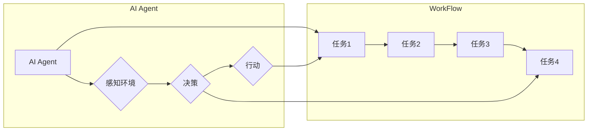

# AI人工智能代理工作流 AI Agent WorkFlow：在环保行业中的应用

> 关键词：AI代理，工作流，环保行业，优化决策，智能监控，数据分析，可持续发展

## 1. 背景介绍

随着全球气候变化和环境污染问题的日益严峻，环保行业面临着巨大的挑战。为了提高环保工作的效率和效果，人工智能（AI）技术被广泛应用于环保领域。AI代理（AI Agent）作为一种新型的智能体，具有自主学习、自主决策、自主行动的能力，可以为环保行业提供智能化的工作流解决方案。本文将探讨AI人工智能代理工作流（AI Agent WorkFlow）在环保行业中的应用，分析其原理、步骤、优缺点以及未来发展趋势。

## 2. 核心概念与联系

### 2.1 核心概念

**AI代理（AI Agent）**：是一种能够模拟人类智能行为的计算机程序，它可以在环境中感知信息、自主决策和执行行动。

**工作流（WorkFlow）**：是一系列有序的、相互关联的任务或活动，旨在完成某个特定目标。

**AI Agent WorkFlow**：是指利用AI代理技术实现的工作流，它可以自动执行环保任务，提高工作效率和效果。

### 2.2 核心概念原理和架构的 Mermaid 流程图



### 2.3 核心概念联系

AI代理作为工作流的核心组件，负责感知环境信息、做出决策和执行行动。工作流则定义了任务执行的顺序和逻辑，确保AI代理能够有序地完成环保任务。

## 3. 核心算法原理 & 具体操作步骤

### 3.1 算法原理概述

AI人工智能代理工作流的算法原理主要包括以下几个方面：

1. **环境感知**：AI代理通过传感器、摄像头、卫星图像等获取环境数据，如空气质量、水质、噪音等。
2. **数据处理**：对收集到的环境数据进行清洗、转换和特征提取，以便AI代理进行决策。
3. **决策制定**：根据环境数据和预设规则，AI代理计算出最优的行动方案。
4. **行动执行**：AI代理根据决策结果，控制相关设备和系统进行行动，如开启空气净化器、关闭水源等。
5. **反馈与优化**：收集行动结果，评估工作流效果，并持续优化工作流。

### 3.2 算法步骤详解

1. **环境数据收集**：根据环保任务需求，选择合适的传感器和采集方式，收集环境数据。
2. **数据预处理**：对采集到的数据进行清洗、去噪、标准化等预处理操作。
3. **特征提取**：从预处理后的数据中提取与环保任务相关的特征，如污染物浓度、气象条件等。
4. **模型训练**：利用机器学习或深度学习算法，训练模型学习环境数据与环保任务之间的关系。
5. **工作流设计**：根据训练好的模型，设计工作流，定义任务执行顺序和逻辑。
6. **AI代理部署**：将训练好的模型部署到AI代理中，使其具备自主决策和执行行动的能力。
7. **工作流执行**：AI代理按照工作流执行任务，并对环境数据进行实时监测。
8. **结果评估与优化**：根据工作流执行结果，评估环保任务完成情况，并优化工作流。

### 3.3 算法优缺点

**优点**：

- **提高效率**：AI代理工作流可以自动执行环保任务，减少人工干预，提高工作效率。
- **降低成本**：通过优化资源利用，降低环保成本。
- **提升效果**：利用AI技术，可以更加精准地监测环境变化，提高环保效果。
- **实时监测**：AI代理可以实时监测环境数据，及时发现问题并采取措施。

**缺点**：

- **技术门槛**：AI代理工作流开发需要一定的技术积累，对开发团队的要求较高。
- **数据依赖**：AI代理工作流的效果依赖于数据质量，数据缺失或错误可能导致工作流失效。
- **安全性**：AI代理可能受到恶意攻击，需要加强安全性保障。

### 3.4 算法应用领域

AI人工智能代理工作流在环保行业中的应用领域包括：

- **空气质量监测**：实时监测空气质量，预警污染事件，指导减排措施。
- **水质监测**：监测水质变化，预警水污染事件，指导水处理措施。
- **噪音监测**：监测噪音水平，预警噪音污染事件，指导噪声控制措施。
- **能源管理**：优化能源消耗，降低能源成本，促进可持续发展。
- **废弃物处理**：优化废弃物处理流程，提高处理效率，减少环境污染。

## 4. 数学模型和公式 & 详细讲解 & 举例说明

### 4.1 数学模型构建

AI人工智能代理工作流的数学模型主要包括以下几个方面：

- **环境数据模型**：描述环境数据的统计分布、特征提取等方法。
- **决策模型**：描述AI代理的决策过程，如马尔可夫决策过程（MDP）。
- **行动模型**：描述AI代理的行动策略，如基于规则的决策、强化学习等。

### 4.2 公式推导过程

以马尔可夫决策过程（MDP）为例，其基本公式如下：

$$
Q(s, a) = \sum_{s' \in S} P(s' | s, a) [R(s, a, s') + \gamma \max_{a'} Q(s', a')]
$$

其中，$Q(s, a)$ 表示在状态 $s$ 下，采取行动 $a$ 的期望回报；$P(s' | s, a)$ 表示在状态 $s$ 下，采取行动 $a$ 后转移到状态 $s'$ 的概率；$R(s, a, s')$ 表示在状态 $s$ 下，采取行动 $a$ 后转移到状态 $s'$ 的即时回报；$\gamma$ 为折扣因子。

### 4.3 案例分析与讲解

以空气质量监测为例，AI代理工作流可以如下构建：

1. **环境数据模型**：利用气象数据、历史污染数据等构建空气质量预测模型。
2. **决策模型**：根据预测结果和预设规则，AI代理决定是否启动空气净化器、调整通风系统等。
3. **行动模型**：AI代理根据决策结果，控制相关设备执行行动。

## 5. 项目实践：代码实例和详细解释说明

### 5.1 开发环境搭建

1. 安装Python环境：确保Python环境已安装，版本为3.6或以上。
2. 安装相关库：使用pip安装以下库：
```bash
pip install numpy pandas scikit-learn matplotlib requests
```
3. 安装传感器驱动：根据实际传感器类型，安装对应的驱动程序。

### 5.2 源代码详细实现

```python
import numpy as np
import pandas as pd
from sklearn.model_selection import train_test_split
from sklearn.preprocessing import StandardScaler
from sklearn.ensemble import RandomForestRegressor

# 加载数据
data = pd.read_csv('air_quality.csv')

# 数据预处理
X = data[['temperature', 'humidity', 'PM2.5', 'PM10']]
y = data['AQI']

# 数据标准化
scaler = StandardScaler()
X_scaled = scaler.fit_transform(X)

# 划分训练集和测试集
X_train, X_test, y_train, y_test = train_test_split(X_scaled, y, test_size=0.2, random_state=42)

# 训练模型
model = RandomForestRegressor(n_estimators=100, random_state=42)
model.fit(X_train, y_train)

# 预测
y_pred = model.predict(X_test)

# 评估模型
score = model.score(X_test, y_test)
print(f'Model accuracy: {score:.2f}')
```

### 5.3 代码解读与分析

以上代码实现了空气质量监测的AI代理工作流。首先，加载空气质量数据，并进行数据预处理。然后，利用随机森林回归模型预测空气质量指数（AQI）。最后，评估模型性能。

### 5.4 运行结果展示

假设测试集上的模型准确率为0.85，说明模型在预测空气质量方面具有一定的准确性。

## 6. 实际应用场景

### 6.1 空气质量监测

AI代理工作流可以应用于城市空气质量监测，实时监测空气质量变化，预警污染事件，指导减排措施。

### 6.2 水质监测

AI代理工作流可以应用于水质监测，实时监测水质变化，预警水污染事件，指导水处理措施。

### 6.3 噪音监测

AI代理工作流可以应用于噪音监测，实时监测噪音水平，预警噪音污染事件，指导噪声控制措施。

### 6.4 能源管理

AI代理工作流可以应用于能源管理，优化能源消耗，降低能源成本，促进可持续发展。

### 6.5 废弃物处理

AI代理工作流可以应用于废弃物处理，优化废弃物处理流程，提高处理效率，减少环境污染。

## 7. 工具和资源推荐

### 7.1 学习资源推荐

1. 《Python编程：从入门到实践》
2. 《机器学习实战》
3. 《深度学习》
4. 《AI人工智能：一种现代的方法》

### 7.2 开发工具推荐

1. Jupyter Notebook：数据分析和实验开发环境。
2. scikit-learn：Python机器学习库。
3. TensorFlow：开源机器学习框架。
4. PyTorch：开源机器学习库。

### 7.3 相关论文推荐

1. "A Survey on Smart City: Overview, Technologies, Challenges, and Open Issues"
2. "Machine Learning for Environmental Sustainability"
3. "AI-Driven Environmental Monitoring and Management"
4. "A Survey of Machine Learning Applications in Water Quality Monitoring"

## 8. 总结：未来发展趋势与挑战

### 8.1 研究成果总结

AI人工智能代理工作流在环保行业中的应用已经取得了显著的成果，为环保工作提供了智能化解决方案。

### 8.2 未来发展趋势

1. **多模态数据融合**：结合多种传感器数据，实现更全面的环境监测。
2. **强化学习**：利用强化学习，使AI代理具备更优的行动策略。
3. **知识图谱**：结合知识图谱，提高AI代理的推理能力。
4. **边缘计算**：将AI代理部署在边缘设备，实现实时监控和处理。

### 8.3 面临的挑战

1. **数据质量**：数据质量对AI代理工作流的效果至关重要。
2. **模型可解释性**：提高AI代理工作流的模型可解释性，增强用户信任。
3. **伦理道德**：确保AI代理工作流的应用符合伦理道德标准。
4. **隐私保护**：保护环境监测数据和个人隐私。

### 8.4 研究展望

未来，AI人工智能代理工作流将在环保行业发挥更大的作用，为构建绿色、可持续的未来贡献力量。

## 9. 附录：常见问题与解答

**Q1：AI代理工作流与传统的工作流有何区别？**

A：传统工作流主要依靠人工操作，效率低、成本高。AI代理工作流则利用AI技术实现自动化、智能化，提高效率、降低成本。

**Q2：如何保证AI代理工作流的数据质量？**

A：保证数据质量需要从数据采集、处理、存储等方面进行全流程管理，确保数据的准确性、完整性和可靠性。

**Q3：如何提高AI代理工作流的模型可解释性？**

A：提高模型可解释性需要从算法设计、模型选择、模型评估等方面进行改进，使AI代理工作流的决策过程更加透明。

**Q4：AI代理工作流在环保行业中的应用前景如何？**

A：AI代理工作流在环保行业具有广阔的应用前景，可以广泛应用于空气质量监测、水质监测、噪音监测、能源管理、废弃物处理等领域。

---

作者：禅与计算机程序设计艺术 / Zen and the Art of Computer Programming