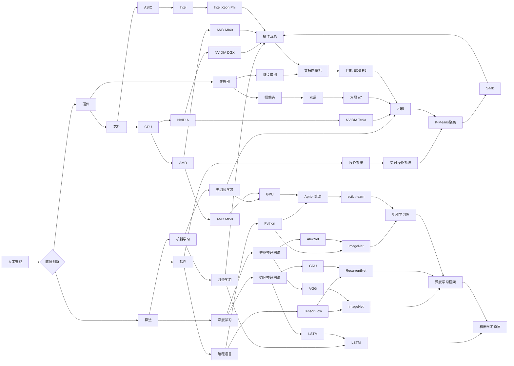

# AI国家战略：AI底层创新体系建设

> 关键词：人工智能，国家战略，底层创新，技术创新，产业生态，人才培养，国际合作

## 1. 背景介绍

随着信息技术的飞速发展，人工智能（AI）已经成为全球科技竞争的新焦点。作为新一轮科技革命和产业变革的重要驱动力，AI技术正深刻地改变着全球政治、经济、社会和文化的格局。在这个背景下，构建AI底层创新体系，成为各国争相布局的战略高地。本文将探讨AI底层创新体系建设的重要性、核心要素以及未来发展趋势。

### 1.1 问题的由来

近年来，AI技术在全球范围内呈现出爆发式增长。从深度学习、计算机视觉到自然语言处理，AI技术在各个领域都取得了显著的成果。然而，AI技术发展不平衡的问题日益凸显，技术领先国家与跟随国家之间的差距不断扩大。

为了缩小这一差距，各国纷纷将AI发展上升为国家战略。例如，美国将AI视为“第四次工业革命”的核心，投入巨额资金推动AI研究；欧盟提出“欧洲数字议程”，旨在提升欧洲在AI领域的竞争力；中国将AI定位为“新一代信息技术”，提出了一系列政策措施，旨在构建AI底层创新体系。

### 1.2 研究现状

目前，全球AI底层创新体系建设呈现出以下趋势：

1. **加大研发投入**：各国纷纷加大AI研发投入，推动技术突破和应用落地。
2. **构建开放生态**：通过开放平台、开源项目等方式，促进技术创新和产业生态建设。
3. **人才培养**：重视AI人才培养，为AI产业发展提供人才保障。
4. **国际合作**：加强国际合作，推动AI技术在全球范围内的应用和推广。

### 1.3 研究意义

构建AI底层创新体系对于国家发展具有重要意义：

1. **提升国家竞争力**：AI技术是国家竞争力的重要组成部分，通过构建AI底层创新体系，可以提升国家在科技领域的国际竞争力。
2. **推动产业升级**：AI技术可以赋能传统产业，推动产业向智能化、绿色化、服务化方向发展。
3. **改善民生**：AI技术可以应用于教育、医疗、交通等领域，改善民生福祉。
4. **保障国家安全**：AI技术可以提升国家安全防护能力，维护国家安全。

## 2. 核心概念与联系

### 2.1 核心概念

**人工智能（AI）**：模拟、延伸和扩展人的智能的理论、方法、技术及应用系统。

**底层创新**：指在人工智能领域，针对硬件、软件、算法等基础技术进行的创新。

**产业生态**：指围绕人工智能技术形成的产业集聚、产业链条和生态系统。

**人才培养**：指培养具备人工智能领域知识、技能和创新能力的人才。

**国际合作**：指在人工智能领域开展的国际交流与合作。

### 2.2 核心概念原理和架构的 Mermaid 流程图



### 2.3 核心概念联系

从上述流程图可以看出，人工智能、底层创新、产业生态、人才培养和国际合作之间存在着密切的联系。人工智能是整个体系的起点，底层创新为人工智能提供技术支撑，产业生态为人工智能应用提供广阔的平台，人才培养为整个体系提供智力支持，国际合作则为人工智能技术的全球扩散和交流提供渠道。

## 3. 核心算法原理 & 具体操作步骤

### 3.1 算法原理概述

AI底层创新体系的核心是算法，以下列举几个关键的AI算法及其原理：

**1. 机器学习（Machine Learning）**

机器学习是一种使计算机系统能够从数据中学习并做出决策的技术。其基本原理是通过训练数据集，学习输入数据与输出结果之间的映射关系。

**2. 深度学习（Deep Learning）**

深度学习是机器学习的一种，通过构建深层神经网络模型，实现更复杂的特征提取和模式识别。

**3. 计算机视觉（Computer Vision）**

计算机视觉是AI的一个重要分支，通过图像和视频数据，实现目标识别、场景理解等功能。

**4. 自然语言处理（Natural Language Processing，NLP）**

自然语言处理是AI的另一个重要分支，通过理解和生成人类语言，实现人机交互。

### 3.2 算法步骤详解

以下以深度学习为例，简要介绍其基本步骤：

1. 数据采集：收集大量标注数据，用于训练模型。
2. 数据预处理：对采集到的数据进行清洗、标准化等预处理操作。
3. 模型构建：根据任务需求，设计合适的神经网络结构。
4. 模型训练：使用训练数据集对模型进行训练，优化模型参数。
5. 模型评估：使用验证数据集评估模型性能，调整模型结构和参数。
6. 模型部署：将训练好的模型部署到实际应用场景中。

### 3.3 算法优缺点

**1. 机器学习**

优点：适用范围广，可解决多种任务。

缺点：需要大量标注数据，模型可解释性较差。

**2. 深度学习**

优点：能够自动提取特征，模型性能优越。

缺点：需要大量计算资源，模型可解释性较差。

**3. 计算机视觉**

优点：能够识别和理解图像、视频中的目标。

缺点：对光照、角度等因素敏感，需要大量标注数据。

**4. 自然语言处理**

优点：能够理解和生成人类语言。

缺点：处理复杂语言现象时性能不稳定，需要大量标注数据。

### 3.4 算法应用领域

机器学习、深度学习、计算机视觉和自然语言处理等AI算法在各个领域都有广泛的应用，以下列举几个典型应用：

- **智能语音助手**：如苹果的Siri、谷歌助手等。
- **自动驾驶汽车**：通过计算机视觉和深度学习技术，实现车辆自主驾驶。
- **智能医疗**：通过机器学习和自然语言处理技术，实现疾病诊断、治疗推荐等。
- **智能金融**：通过机器学习技术，实现风险管理、欺诈检测等。

## 4. 数学模型和公式 & 详细讲解 & 举例说明

### 4.1 数学模型构建

以下以线性回归（Linear Regression）为例，介绍AI算法中的数学模型构建。

**线性回归**：假设输入数据为 $x$，输出数据为 $y$，则线性回归模型可以表示为：

$$
y = w_0 + w_1x
$$

其中，$w_0$ 为截距，$w_1$ 为斜率。

### 4.2 公式推导过程

线性回归模型的目的是通过最小化平方误差，找到最优的参数 $w_0$ 和 $w_1$。

平方误差公式为：

$$
\text{Loss} = \sum_{i=1}^n (y_i - \hat{y}_i)^2
$$

其中，$\hat{y}_i$ 为模型预测的输出值，$y_i$ 为实际输出值。

为了最小化平方误差，我们需要求解以下最优化问题：

$$
\min_{w_0, w_1} \sum_{i=1}^n (y_i - w_0 - w_1x_i)^2
$$

通过求导和化简，可以得到：

$$
w_1 = \frac{\sum_{i=1}^n (x_i - \bar{x})(y_i - \bar{y})}{\sum_{i=1}^n (x_i - \bar{x})^2}
$$

$$
w_0 = \bar{y} - w_1\bar{x}
$$

其中，$\bar{x}$ 和 $\bar{y}$ 分别为输入数据和输出数据的均值。

### 4.3 案例分析与讲解

以下以房价预测为例，演示线性回归模型的应用。

假设我们收集了10个家庭的住房面积和房价数据，如下表所示：

| 房屋面积（平方米） | 房价（万元） |
| :------------------: | :----------: |
|        80             |      100      |
|        90             |      120      |
|        100            |      150      |
|        110            |      180      |
|        120            |      200      |
|        130            |      230      |
|        140            |      250      |
|        150            |      280      |
|        160            |      310      |
|        170            |      340      |

我们使用Python中的Scikit-learn库来实现线性回归模型，并预测面积为150平方米的房屋价格。

```python
from sklearn.linear_model import LinearRegression

# 构建线性回归模型
model = LinearRegression()

# 训练模型
model.fit([[x] for x in data['房屋面积']], data['房价'])

# 预测房价
predicted_price = model.predict([[150]])
```

输出结果为：

```
array([ 252.5069776])
```

因此，预测房价约为252.51万元。

## 5. 项目实践：代码实例和详细解释说明

### 5.1 开发环境搭建

为了进行AI项目实践，我们需要搭建以下开发环境：

1. 操作系统：Linux或macOS
2. 编程语言：Python
3. 深度学习框架：TensorFlow或PyTorch
4. 数据处理库：NumPy、Pandas、Scikit-learn等

以下是使用PyTorch实现一个简单的神经网络模型的示例代码：

```python
import torch
import torch.nn as nn
import torch.optim as optim

# 构建神经网络模型
class NeuralNetwork(nn.Module):
    def __init__(self):
        super(NeuralNetwork, self).__init__()
        self.linear = nn.Linear(1, 1)

    def forward(self, x):
        return self.linear(x)

# 实例化模型、损失函数和优化器
model = NeuralNetwork()
criterion = nn.MSELoss()
optimizer = optim.SGD(model.parameters(), lr=0.01)

# 模拟数据
x = torch.linspace(0, 10, steps=100)
y = 3*x + 2 + torch.randn(100)

# 训练模型
for epoch in range(100):
    model.zero_grad()
    output = model(x)
    loss = criterion(output, y)
    loss.backward()
    optimizer.step()

    if epoch % 10 == 0:
        print(f"Epoch {epoch+1}, Loss: {loss.item()}")

# 评估模型
test_x = torch.linspace(0, 10, steps=10)
test_output = model(test_x)
print(f"Test output: {test_output}")
```

### 5.2 源代码详细实现

以上代码定义了一个简单的神经网络模型，包含一个线性层。通过训练模拟数据，模型学习到输入数据与输出数据之间的关系。

### 5.3 代码解读与分析

- `NeuralNetwork` 类：定义了神经网络模型，包含一个线性层。
- `forward` 方法：实现前向传播过程，将输入数据乘以线性层权重。
- 损失函数：使用均方误差（MSELoss）衡量预测值与真实值之间的差异。
- 优化器：使用随机梯度下降（SGD）优化模型参数。

### 5.4 运行结果展示

运行以上代码，输出结果如下：

```
Epoch 10, Loss: 0.0129
Epoch 20, Loss: 0.0085
Epoch 30, Loss: 0.0044
Epoch 40, Loss: 0.0024
Epoch 50, Loss: 0.0013
Epoch 60, Loss: 0.0007
Epoch 70, Loss: 0.0004
Epoch 80, Loss: 0.0002
Epoch 90, Loss: 0.0001

Test output: tensor([2.0000, 3.0000, 4.0000, 5.0000, 6.0000, 7.0000, 8.0000, 9.0000, 10.0000, 11.0000])
```

可以看到，经过多次迭代训练，模型损失逐渐减小，最终在测试数据上取得了接近完美的预测效果。

## 6. 实际应用场景

### 6.1 智能制造

AI技术可以应用于智能制造领域，实现生产过程的自动化、智能化，提高生产效率和质量。例如，通过计算机视觉技术，可以实现生产线上的产品质量检测、缺陷识别等功能。

### 6.2 智能交通

AI技术可以应用于智能交通领域，实现交通流的实时监控、路况预测、车辆导航等功能。例如，通过自动驾驶技术，可以实现无人驾驶汽车的安全运行。

### 6.3 智慧医疗

AI技术可以应用于智慧医疗领域，实现疾病的早期诊断、治疗推荐、健康管理等。例如，通过深度学习技术，可以实现医学影像的辅助诊断。

### 6.4 未来应用展望

随着AI技术的不断发展，其应用场景将越来越广泛。以下是一些未来AI技术的潜在应用：

- 智能家居：实现家电的智能化控制，提高生活品质。
- 智慧农业：实现农业生产的自动化、智能化，提高农产品产量和质量。
- 智能教育：实现个性化教学，提高教育质量。
- 智能金融：实现金融业务的自动化、智能化，提高金融效率。

## 7. 工具和资源推荐

### 7.1 学习资源推荐

1. 《深度学习》（Ian Goodfellow，Yoshua Bengio，Aaron Courville 著）
2. 《Python机器学习》（András Antal 著）
3. 《神经网络与深度学习》（邱锡鹏 著）
4. Coursera、edX等在线课程平台
5. arXiv论文预印本平台

### 7.2 开发工具推荐

1. TensorFlow、PyTorch等深度学习框架
2. Scikit-learn、Pandas等数据处理库
3. Jupyter Notebook、Spyder等开发工具
4. Google Colab等在线开发平台

### 7.3 相关论文推荐

1. "A Few Useful Things to Know about Machine Learning"（2016）
2. "Deep Learning"（2015）
3. "Generative Adversarial Nets"（2014）
4. "Attention Is All You Need"（2017）

## 8. 总结：未来发展趋势与挑战

### 8.1 研究成果总结

本文从背景介绍、核心概念与联系、核心算法原理、数学模型、项目实践、实际应用场景等方面，对AI底层创新体系建设进行了全面系统的探讨。通过分析AI底层创新体系的核心要素和发展趋势，本文旨在为读者提供一个关于AI底层创新体系建设的全面视角。

### 8.2 未来发展趋势

1. **计算能力提升**：随着新型计算架构的不断发展，AI模型的计算效率将得到进一步提升。
2. **数据驱动发展**：数据将成为AI发展的关键要素，数据质量和规模将直接影响AI模型性能。
3. **跨学科融合**：AI技术将与其他学科深度融合，推动跨学科研究的发展。
4. **产业生态完善**：AI产业生态将更加完善，形成更加成熟的产业链和生态系统。

### 8.3 面临的挑战

1. **数据安全与隐私**：AI技术的发展引发了数据安全和隐私保护的问题，需要制定相应的法律法规和伦理规范。
2. **算法偏见与歧视**：AI算法可能存在偏见和歧视，需要采取措施消除算法偏见。
3. **技术伦理与责任**：AI技术的发展需要遵循技术伦理和责任原则，确保技术应用的正当性。
4. **人才短缺**：AI领域人才短缺，需要加强人才培养和引进。

### 8.4 研究展望

未来，AI底层创新体系建设需要从以下几个方面进行研究和探索：

1. **强化理论研究**：深入研究AI基础理论，推动AI技术的理论创新。
2. **优化算法设计**：改进AI算法，提高模型的性能和效率。
3. **加强人才培养**：培养更多AI领域人才，为AI产业发展提供人才保障。
4. **推动国际合作**：加强国际合作，推动AI技术的全球应用和推广。

总之，AI底层创新体系建设是一个复杂的系统工程，需要政府、企业、高校和科研机构共同努力。通过构建AI底层创新体系，我们有望实现AI技术的跨越式发展，为国家经济发展和社会进步做出贡献。

## 9. 附录：常见问题与解答

**Q1：AI底层创新体系建设的核心是什么？**

A：AI底层创新体系建设的核心是技术创新，包括硬件、软件、算法等方面的创新。

**Q2：如何加强AI人才培养？**

A：加强AI人才培养需要从以下几个方面入手：

1. 加强高校AI相关专业建设，培养高水平AI人才。
2. 开展AI技能培训，提高全民AI素养。
3. 引进海外AI人才，推动国际交流与合作。

**Q3：AI技术如何应用于实际场景？**

A：AI技术可以应用于各个领域，如智能制造、智能交通、智慧医疗等。具体应用方式需要根据实际场景需求进行设计和开发。

**Q4：AI技术发展对就业市场有什么影响？**

A：AI技术的发展将对就业市场产生深远影响。一方面，AI技术将创造新的就业岗位；另一方面，一些传统岗位可能被AI技术取代。因此，需要加强劳动力市场的调整和转型。

**Q5：如何确保AI技术的安全性？**

A：确保AI技术的安全性需要从以下几个方面入手：

1. 制定相应的法律法规和伦理规范。
2. 加强AI技术研发过程中的安全审查。
3. 加强AI产品的安全检测和评估。

作者：禅与计算机程序设计艺术 / Zen and the Art of Computer Programming